# 基于wireshark对基础恶意流量的分析 - 先知社区

基于wireshark对基础恶意流量的分析

- - -

# ***恶意流量分析***

## 1\. 网站流量特征分析

主要分析请求url，user-agent，请求参数等

### （1）dirsearch

-   介绍：dirsearch是一个基于Python的命令行工具，用于对web服务器中的目录和文件进行暴力破解。它通过多线程的方式进行暴力扫描，支持保持连接、多种后缀、生成报告（纯文本、JSON）、启发式检测无效的网页、递归的暴力扫描、支持HTTP代理、用户代理随机化、批量处理、请求延迟等功能特点。
-   主要作用：dirsearch可以用来发现web服务器中的目录和文件，并尝试通过猜测文件名或目录名来获取敏感信息。它可以帮助网络安全专业人员或黑客攻击者进行安全漏洞扫描和攻击。
-   主要特征： 通过显示过滤器,过滤 http.request数据流，可以在数据流中看到大量http GET请求再对路径以及文件进行爆破，可以发现在info中的路径有很明显的顺序,例如dir将a开头的路径跑完后就开始跑b开头的路径如此反复,所以在遇到有类似特征的流量，可以初步判断为dirsearch攻击。  
    [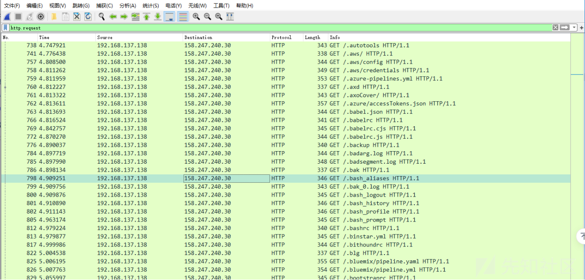](https://xzfile.aliyuncs.com/media/upload/picture/20231107203255-c712c1ba-7d69-1.png)

### (2) sqlmap

-   介绍：SQLMap是一款开源的自动化SQL注入工具，由Python写成。它主要功能是扫描、发现并利用给定的URL和SQL注入漏洞。其广泛的功能和选项包括数据库指纹、枚举、数据库提权、访问目标文件系统，并在获取操作权限时执行任意命令。SQLMap完全支持MySQL、Oracle、PostgreSQL、MSSQL、Access、IBM DB2、SQLite、Firebird、Sybase、SAP MaxDB、HSQLDB和Informix等多种数据库管理系统。
-   主要特征：依然是通过wireshark的显示过滤器过滤sqlmap攻击流量包 过滤 http.request后，可以发现info中有大量的sql语句。  
    [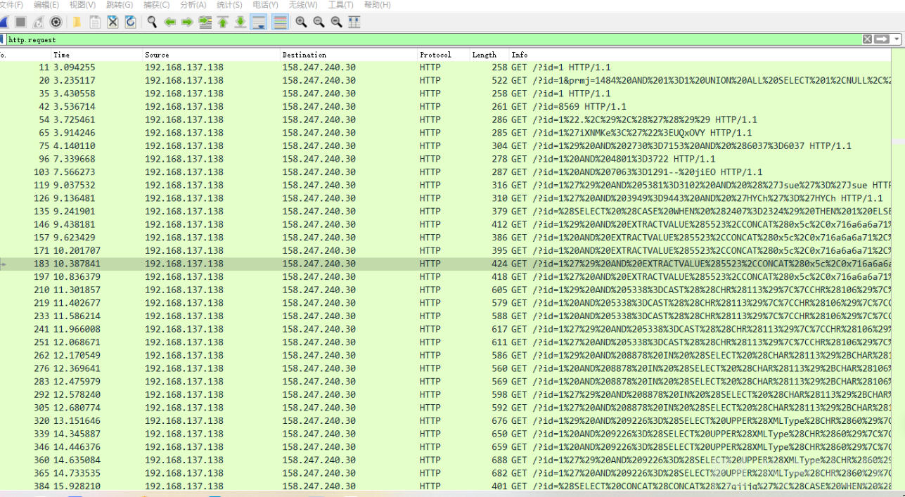](https://xzfile.aliyuncs.com/media/upload/picture/20231107205626-0fe0c2e0-7d6d-1.png)  
    如果攻击者没有设置sqlmap工具，在传输层的请求头中的user-agent可以看到sqlmap的网站，这是一个强特征，只要有这个特征就可以断定是sqlmap  
    [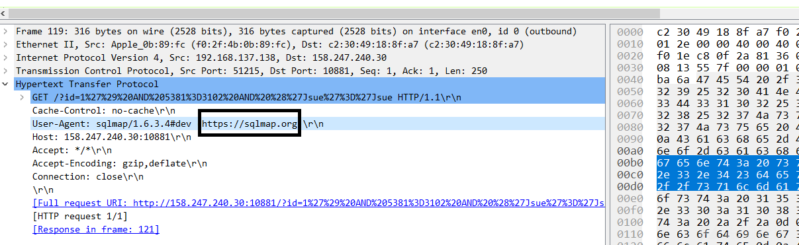](https://xzfile.aliyuncs.com/media/upload/picture/20231108111858-8e4fe156-7de5-1.png)  
    如果需要过滤sqlmap的数据流 使用 http.user\_agent contains sqlmap 可以将包含sql的数据流过滤出来，进行下一步分析。  
    \## 2.漏洞扫描器流量特征分析  
    \### （1）AWVS
-   介绍：一个用于测试和管理Web应用程序安全性的平台。它能够自动扫描互联网或者本地局域网中是否存在漏洞，并报告漏洞。AWVS可以扫描任何通过Web浏览器访问和遵循HTTP/HTTPS规则的Web站点，适用于任何中小型和大型企业的内联网、外延网和面向客户、雇员、厂商和其它人员的Web网站。AWVS可以通过检查SQL注入攻击漏洞、XSS跨站脚本攻击漏洞等漏洞来审核Web应用程序的安全性。
-   特征：参数、ua、content\_type 中含有 test、testing、wvs、acunetix\_wvs\_security\_test、acunetix，acunetix\_wvs，其中主要是 test、testing比较常见。  
    使用显示过滤器，过滤awvs攻击流量包
    
    ```plain
    http.content_type contains "test（替换上述特征）"
    ```
    
    可以发现在http传输层协议中，POST请求下属的Content\_type包含testing  
    [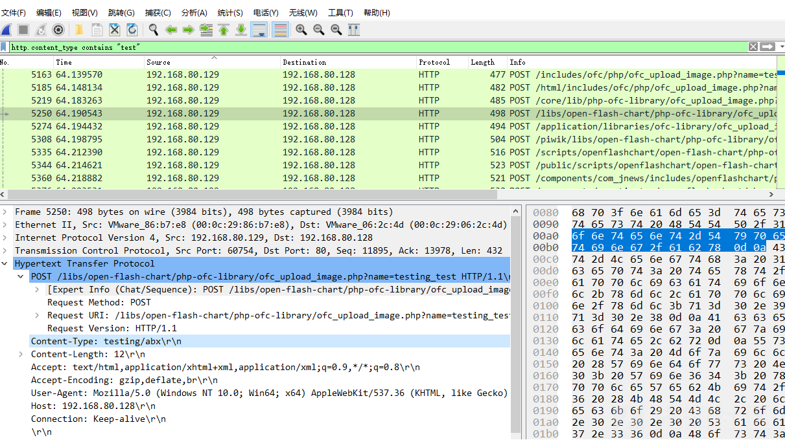](https://xzfile.aliyuncs.com/media/upload/picture/20231107211739-068665f8-7d70-1.png)  
    或者使用
    
    ```plain
    http.request.uri.query.parameter contains "test"
    ```
    
    过滤后，可以在post info 请求中看到 name=testingXXXX的特征信息

### （2）namp

-   介绍：Nmap是一款针对大型网络的端口扫描工具，它最初设计目的是为了快速扫描大型网络。Nmap支持多种协议的扫描，如UDP、TCP、ICMP等，同时支持性能和可靠性统计，例如动态延时计算、数据包超时和转发、并行端口扫描、通过并行ping侦测下层主机等功能。
-   主要特征：使用显示过滤器过滤namp流量包
    
    ```plain
    tcp && ip.dst == [namp扫描的ip]
    ```
    
    可以发现有大量的tcp包 在对目标ip进行端口访问  
    [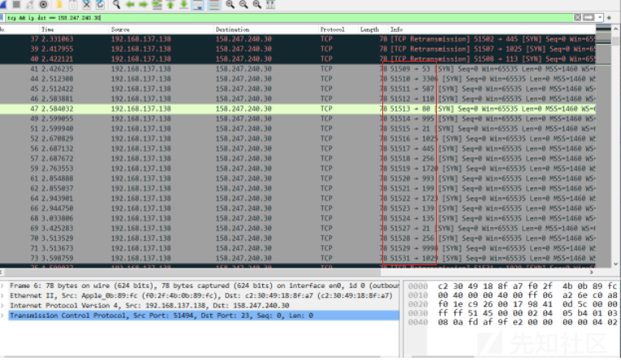](https://xzfile.aliyuncs.com/media/upload/picture/20231108114008-838aefec-7de8-1.png)

## 3.webshell管理工具流量特征分析

### （1）蚁剑

-   介绍：蚁剑（AntSword）是一款开源的跨平台WebShell管理工具，主要面向合法授权的渗透测试安全人员以及进行常规操作的网站管理员。它推崇模块化的开发思想，遵循开源，致力于为不同层次的人群提供最简单易懂、方便直接的代码展示及其修改说明。
-   主要特征：蚁剑是明文传输（即使使用了加密与编码，也会有包传输密码协商过程，该过程也会有明文存在）即：在post包中的html可以看到传入的参数 观察多个POST包中可以发现html下属的form item都有一个display\_errors  
    [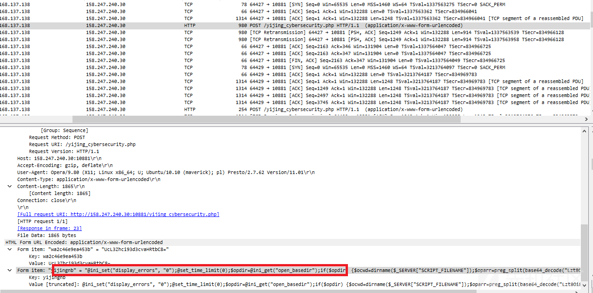](https://xzfile.aliyuncs.com/media/upload/picture/20231108121202-f7f8f3e8-7dec-1.png)  
    右键，选择作为过滤器应用中选中  
    [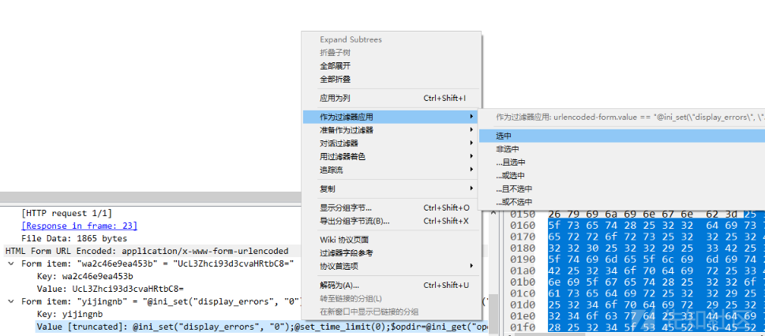](https://xzfile.aliyuncs.com/media/upload/picture/20231108121845-e8867308-7ded-1.png)  
    将显示过滤器中多余的信息删去，只留下 urlencoded-form.value contains "display\_errors"  
    [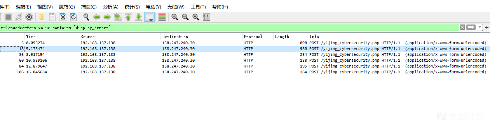](https://xzfile.aliyuncs.com/media/upload/picture/20231108123344-0043569e-7df0-1.png)  
    然后在追踪http 通过url解密，就可以实现分析攻击者的操作，溯源等操作  
    [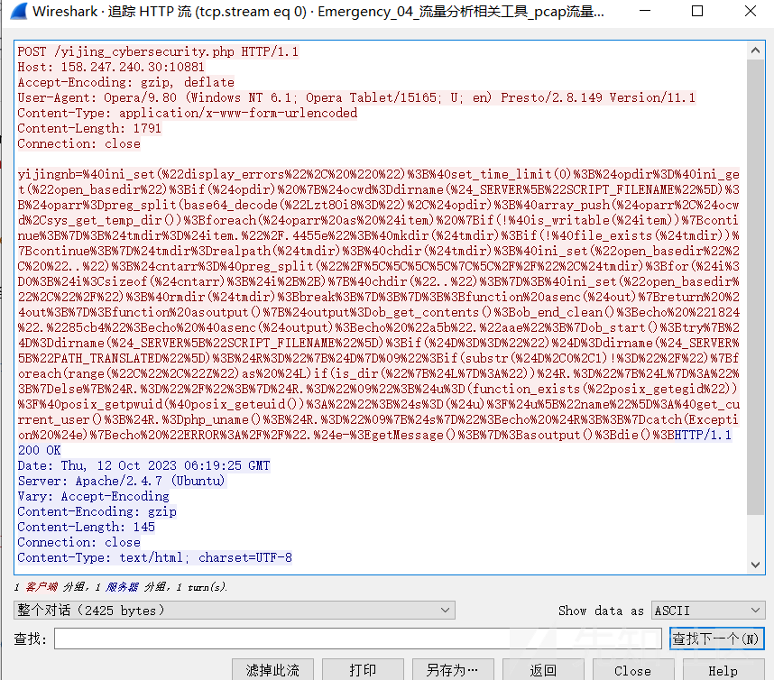](https://xzfile.aliyuncs.com/media/upload/picture/20231108123446-250aa9fa-7df0-1.png)  
    \### （2）冰蝎
-   介绍：“冰蝎”是一个动态二进制加密的网站管理客户端，基于JAVA开发，能够跨平台使用。最新版本为v2.0.1，兼容性较之前的版本有较大提升。它的主要功能包括基本信息、命令执行、虚拟终端、文件管理、Socks代理、反弹shell、数据库管理、自定义代码等，非常强大。
-   主要特征： 冰蝎2.0，3.0，4.0版本之间各有差异  
    例如4.0的特征：  
    在4.0更新的源代码中，定义了14个user-agent
    
    ```plain
    "Mozilla/5.0 (Macintosh; Intel Mac OS X 11_2_3) AppleWebKit/537.36 (KHTML, like Gecko) Chrome/89.0.4389.114 Safari/537.36",
    "Mozilla/5.0 (Macintosh; Intel Mac OS X 10.15; rv:87.0) Gecko/20100101 Firefox/87.0",
    "Mozilla/5.0 (Windows NT 10.0; Win64; x64) AppleWebKit/537.36 (KHTML, like Gecko) Chrome/96.0.4664.110 Safari/537.36",
    "Mozilla/5.0 (Windows NT 10.0; Win64; x64) AppleWebKit/537.36 (KHTML, like Gecko) Chrome/99.0.4844.74 Safari/537.36 Edg/99.0.1150.55",
    "Mozilla/5.0 (Windows NT 10.0; WOW64) AppleWebKit/537.36 (KHTML, like Gecko) Chrome/96.0.4664.110 Safari/537.36",
    "Mozilla/5.0 (Windows NT 10.0; Win64; x64; rv:98.0) Gecko/20100101 Firefox/98.0",
    "Mozilla/5.0 (Windows NT 10.0) AppleWebKit/537.36 (KHTML, like Gecko)
    Chrome/84.0.4147.125 Safari/537.36",
    "Mozilla/5.0 (Macintosh; Intel Mac OS X 10_15_6) AppleWebKit/537.36 (KHTML, like Gecko)
    Chrome/84.0.4147.125 Safari/537.36",
    "Mozilla/5.0 (Macintosh; Intel Mac OS X 10.15; rv:79.0) Gecko/20100101 Firefox/79.0",
    "Mozilla/5.0 (Windows NT 6.3; Trident/7.0; rv:11.0) like Gecko"
    ```
    
    大多数情况为第一个  
    1.观察冰蝎攻击流量包的POST请求包，可以在user-agent中看到上诉特征  
    [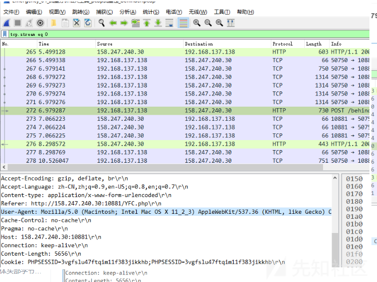](https://xzfile.aliyuncs.com/media/upload/picture/20231108125048-62b36a06-7df2-1.png)  
    如果需要拦截这个攻击，可以在防火墙中拦截Chrome/89.0.4389.114 这个版本的流量 因为现在chrome更新到100.xx的版本了 只要攻击者或者极少用户使用，影响不大  
    [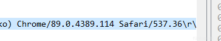](https://xzfile.aliyuncs.com/media/upload/picture/20231108130115-d82ba9be-7df3-1.png)  
    2.请求体头部字节与响应头部字节不会变化  
    [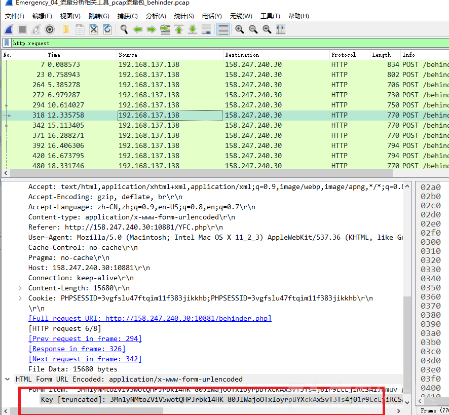](https://xzfile.aliyuncs.com/media/upload/picture/20231108130234-0785b448-7df4-1.png)  
    [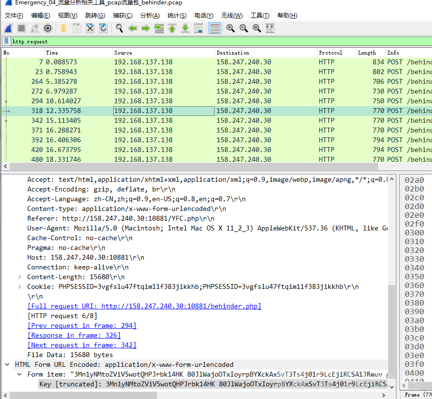](https://xzfile.aliyuncs.com/media/upload/picture/20231108130245-0df53a24-7df4-1.png)  
    可以发现他们请求体中的key值开头一直不变 这是在实际情况是不可能的 所以在看到此特征的流量可以直接判断为冰蝎。  
    \### （3）哥斯拉
-   介绍:哥斯拉是一款由Java语言开发的webshell权限管理工具，功能强大，能绕过市面大部分的静态查杀和流量加密，不受大部分的流量Waf限制，自带的插件冰蝎和蚁剑无法比拟。它不仅可以实现传统的命令执行、文件管理、数据库管理等功能，还可以进行MSF联动、绕过OpenBasedir、ZIP压缩和解压、代码执行、绕过DisableFunctions等操作。
-   主要特征：哥斯拉客户端与 shell 建连初期的三个固定行为特征，且顺序出现在同一个 TCP 连接中。可以总结为：  
    特征：发送一段固定代码（payload），http 响应为空  
    特征：发送一段固定代码（test），执行结果为固定内容  
    特征：发送一段固定代码（getBacisInfo）  
    先发送一段pass的加密密文  
    [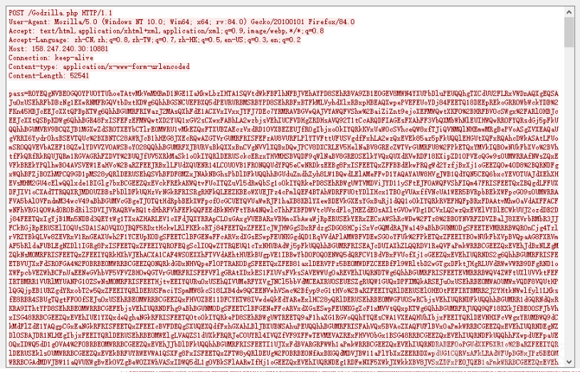](https://xzfile.aliyuncs.com/media/upload/picture/20231108132550-474582f4-7df7-1.png)  
    然后目标服务器会返回一串空回复  
    [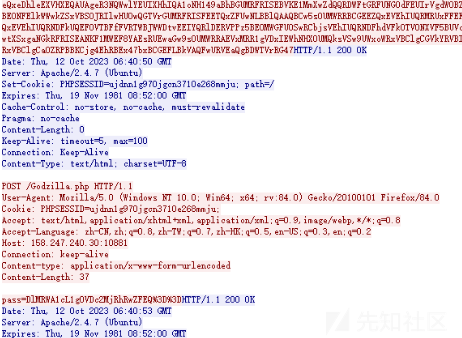](https://xzfile.aliyuncs.com/media/upload/picture/20231108132622-5a7b4cbe-7df7-1.png)  
    在通过交互2次 返回固定值 密文  
    [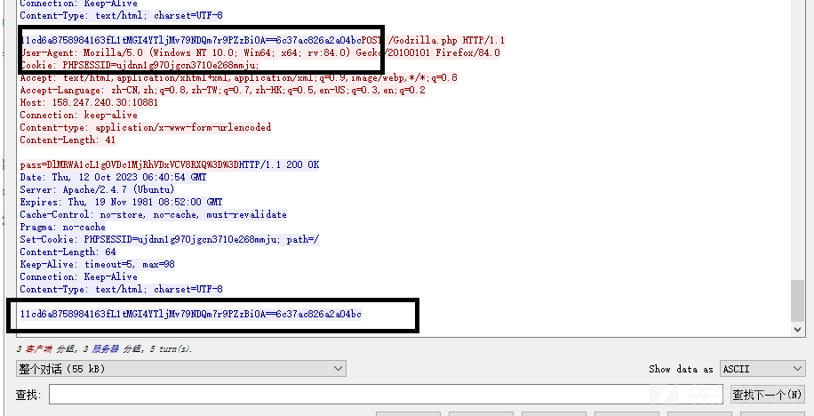](https://xzfile.aliyuncs.com/media/upload/picture/20231108132648-6a48e46c-7df7-1.png)  
    哥斯拉的响应体中有一个特征是前16位和后16为会组成一个32位md5 正则匹配类似于(?i:\[0-9A-F\]{16})\[\\w+/\]{4,}=?=?(?i:\[0-9A-F\]{16})  
    可以在返回包中的密文发现 前16和后16为一个32位的MD5值  
    [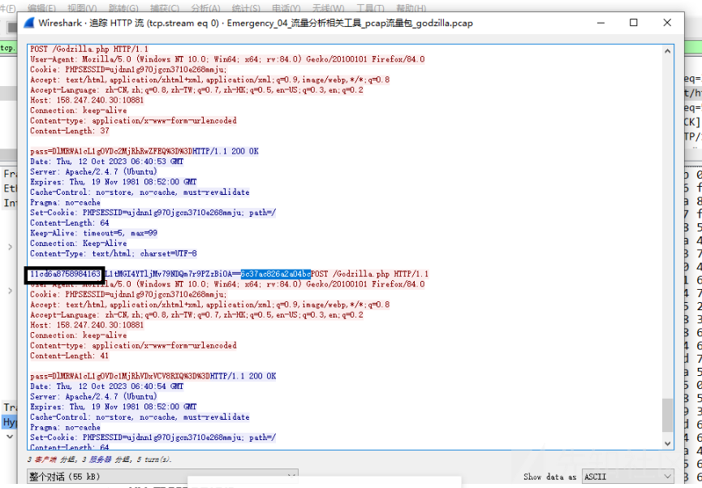](https://xzfile.aliyuncs.com/media/upload/picture/20231108132833-a888bdd8-7df7-1.png)

## 4.常见C2远控服务器流量特征分析

### (1) metasploit

-   介绍：Metasploit是一款开源的网络安全评估工具，它被广泛用于发现、验证和利用网络漏洞。这个工具是由Rapid7开发的，包括Metasploit Pro、Metasploit Express和Metasploit Community Edition等版本。
-   主要特征：meterpreter命令执行的过程已经进行了加密处理，继续进行活动，防御者也不会发现有价值的数据，但可以观察到每个数据都包含MZ标头和DOS模式异常。  
    metasploit是使用tcp协议，使用显示过滤器，过滤metasploit流量包  
    [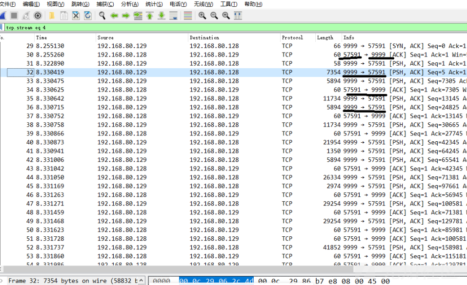](https://xzfile.aliyuncs.com/media/upload/picture/20231108133407-6ff9a526-7df8-1.png)  
    可以发现有2个端口一直在交互 9999和57591 可以初步判断这个为远控后门，追踪下tcp的数据流，发现有明显特征  
    [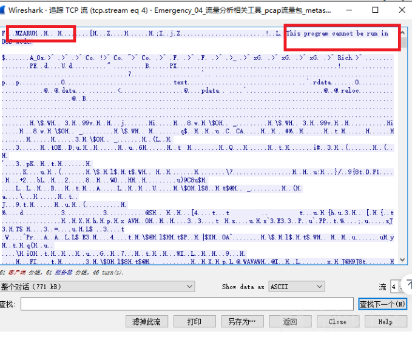](https://xzfile.aliyuncs.com/media/upload/picture/20231108133824-08bc7324-7df9-1.png)  
    连续追踪多个tcp包都有这个特征，所以当我们遇到该特征的流量，可以判断为metasploit流量。

### （2）cobaltstrike

-   介绍：Cobalt Strike提供了一套功能强大的工具和框架，用于模拟网络攻击、横向移动、特权升级、持久化访问以及命令和控制等任务。它旨在帮助安全专业人员评估和改善组织的网络防御能力，同时提供了完整的红队操作平台。Cobalt Strike的核心功能包括木马部署与远控、模拟攻击、内网渗透和横向移动、网络侦察、命令和控制以及报告和日志记录。
-   主要特征：  
    (1）cs使用的http协议 cs流量包的第一个GET请求 有一个随机编码 IPYK转换为ascii 之和与 256 取余计算值等于 92 ，下载stage payload的过程uri符合 checksum8 规则，即：路径的 ascii 之和与 256 取余计算值等于 92  
    [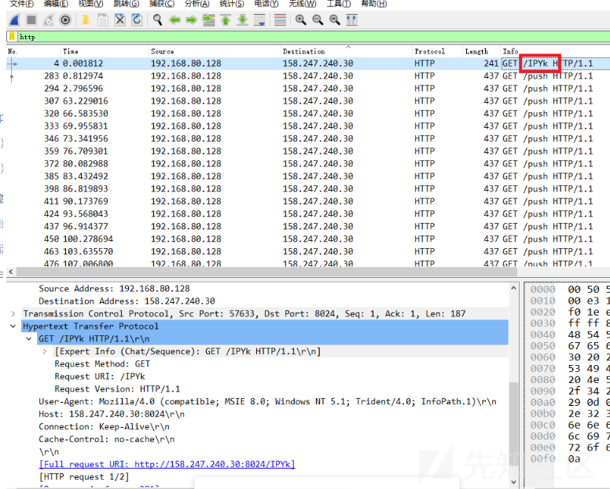](https://xzfile.aliyuncs.com/media/upload/picture/20231108135055-c8616f9e-7dfa-1.png)  
    (2) c2服务器如果没有任务下发，会有规律的请求响应间隔，用于维持连接，比如这里是每间隔3s，发一次包（间隔时间可以在cs内设置） 有些响应在4s，是因为网络有延迟不影响  
    [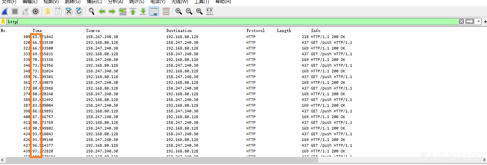](https://xzfile.aliyuncs.com/media/upload/picture/20231108135541-72d5f40e-7dfb-1.png)  
    如果cs服务器有任务下发，则会加密放在http心跳包的cookie里面，下发后，靶机完成指令，也同样会返回一个post包都加密并隐藏在cookie中。

# 总结

以上为根据课程等总结，大多都是在POST和GET请求中，还有很多流量特征需要大家发现，大家可以讨论讨论，如有错误或者更好的方法，请指出。
