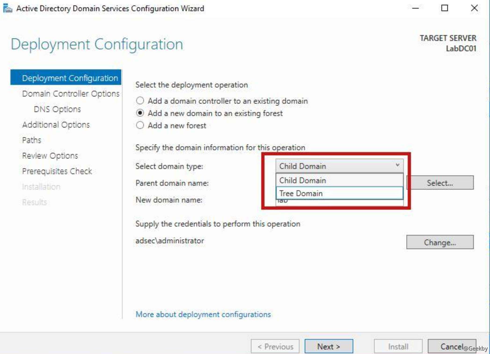
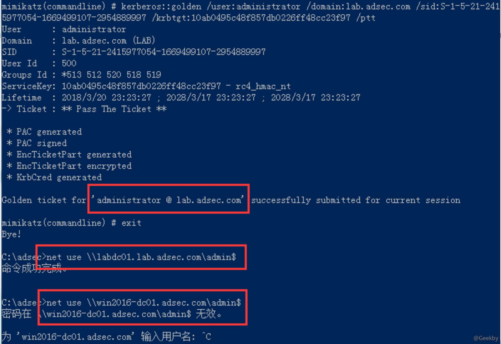
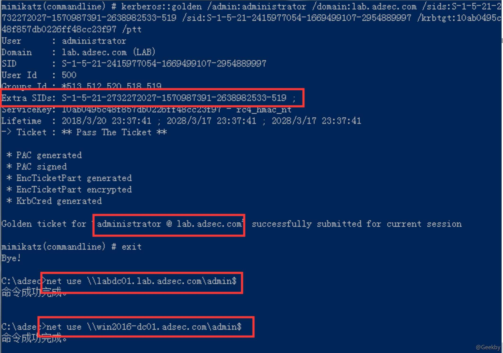
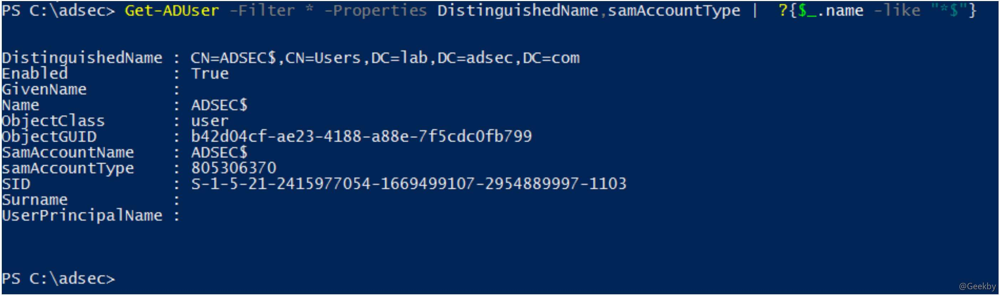
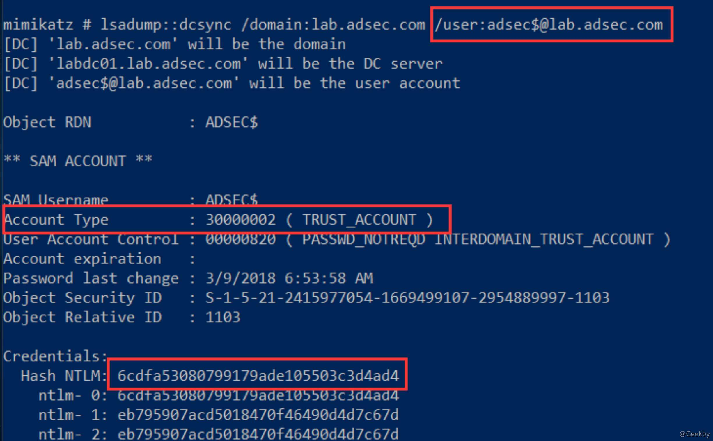
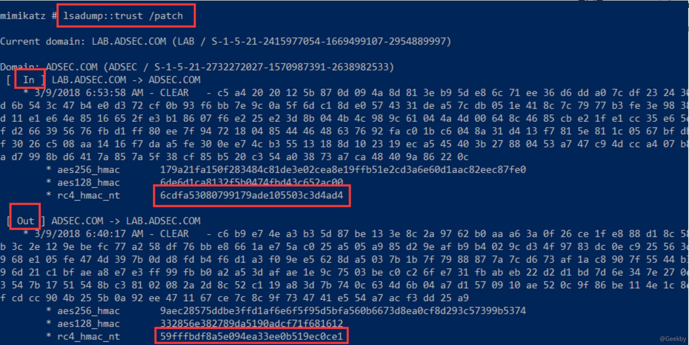
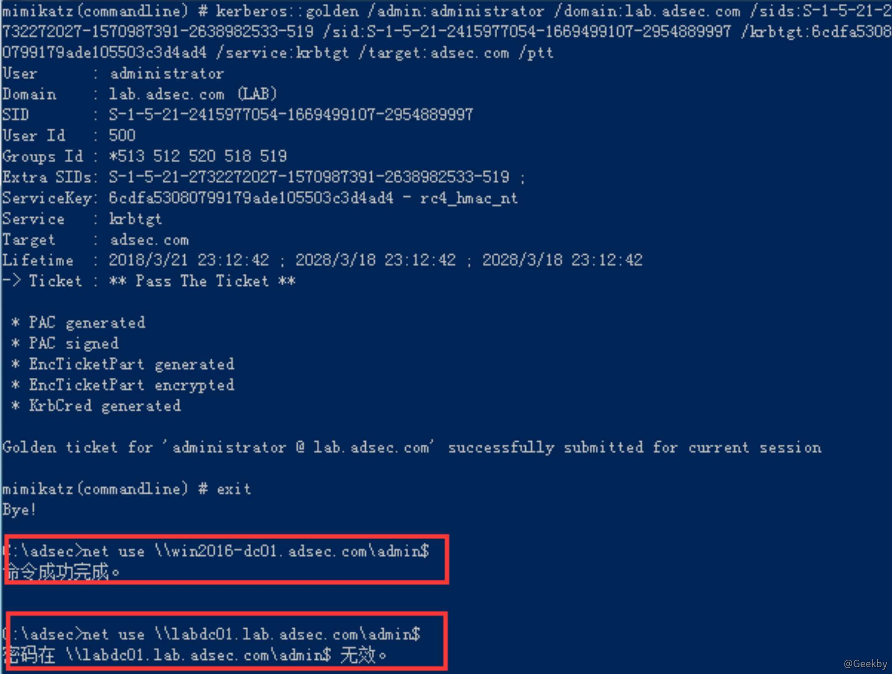
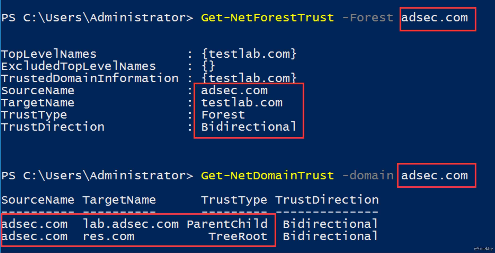
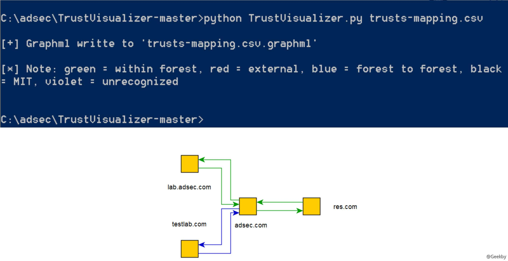
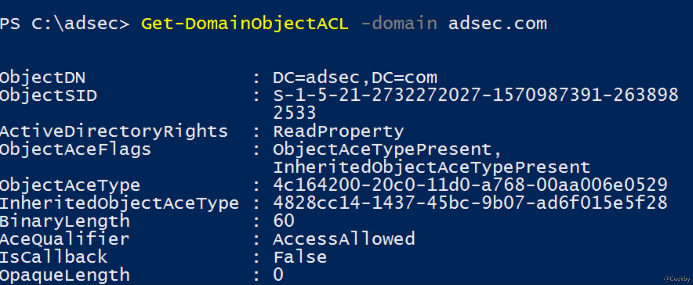

# [](#%E5%9F%BA%E4%BA%8E%E5%9F%9F%E4%BF%A1%E4%BB%BB%E5%85%B3%E7%B3%BB%E7%9A%84%E5%9F%9F%E6%94%BB%E5%87%BB)基于域信任关系的域攻击

## [](#%E5%9F%9F%E4%BF%A1%E4%BB%BB)域信任

建立域之间的信任关系，是为了一个域的用户能方便地访问其他域的资源，同时也方便了对域网络的管理和维护。这种模式在带来便利的同时，也存在很多可以被恶意攻击者利用的地方。

域信任关系可以是单向\\双向信任、可传递\\不可传递信任、内部\\外部信任、跨域链接信任(cross link trust)等类型。例如，2 个域之间有单向可传递的外部信任关系。同一个森林(Forest)内部的域信任关系，一般隐含为双向可传递的内部信任关系。


部署：



父子信任关系是最常见的域信任关系，在同一个森林内部，加入一个新域时，最常见的是子域模式(Parent- Child)，或者是树根模式(Tree-Root)，这两种模式分别会建立父子信任\\树根信任关系，都是双向可传递的内部信任关系。


`跨域链接信任`(cross link)，指的是在同一个森林的两个子域间建立直接的信任关系。因为在同一个森林中，域的组织关系是树状结构，从一个子域到另外一个域，需要从树枝的子域顺寻到根域(Forest Root)，然后从根域继续顺寻到另外一个子域，而跨域链接相当于 在 2 个子域之间之间建立了一个快捷方式的信任关系，以减少认证和授权的时间和步骤。

`内部信任`指的是森林内部域之间的信任关系。相应地，`外部信任`(External Domain Trust)指的是域和所在森林之外的域之间的信任关系。

还有一种 `MIT` 信任(Kerberos 协议及标准由 MIT 提出)，是 Windows 域与非 Windows 域之间的信任关系，由于应用较少，本文不讨论此种类型的域信任关系。

## [](#%E8%B7%A8%E5%9F%9F%E8%AE%A4%E8%AF%81%E5%92%8C%E8%B5%84%E6%BA%90%E8%AE%BF%E9%97%AE%E6%8E%88%E6%9D%83)跨域认证和资源访问授权

当 2 个域之间建立域信任关系时，会建立共享的`域间密钥`(Inter-Realm Key，简写为`IRKey`)，其作用相当于 `Krbtgt`，只不过 `IRKey` 用于相互信任的 2 个域之间的认 证，而 Krbtgt 用于同一个域服务器的 AC 和 KDC 之间的认证。

信任域之间的认证授权过程，与同一个域中的认证授权大抵相似，但仍然有不少区别。


1.  Jack 向 DC1 发起认证请求，数据由 Jack 的口令 NTLM 值加密;
    
2.  DC1 使用 Jack 的口令 NTLM 值验证收到的认证请求，返回一个通过认证的 TGT 票据给 Jack;
    
3.  Jack 使用 TGT 票据，向 DC1 发起授权请求，发起 请求访问 DC2 中文件服务的 TGS\_REQ;
    
4.  DC1 检查到文件服务在 DC2 中，返回一个可转投的 TGT(Referral TGT)，指明需转投到 DC2，使用 IRKey 加密可转投 TGT 中的认证信息;
    
5.  Jack 收到可转投的 TGT 后，根据提示信息，使用转投 TGT，发起访问 DC2 中文件服务的请求 TGS\_REQ;
    
6.  DC2 收到请求后，使用 IRKey 验证可转投 TGT 中的认证信息，返回一个允许访问文件服务的 TGS 票据，票据中部分信息使用运行文件服务的服务账号的口令 NTLM 值加密;
    
7.  Jack 使用收到的 TGS 票据访问 DC2 中的文件服务;
    
8.  文件服务的服务账号使用口令 NTLM 值校验 TGS
    

当 2 个域之间建立信任关系时，会在全局域数据库中存档对方的 SPN、DNS 等信息，方便访问时进行查询。例如，上图中，DC1 会存档 DC2 中所有的服务 SPN、DNS 等信息。

如果 Jack 请求访问的服务在 DC1 的全局数据库中，则会返回转投 TGT，如果不在，如果 DC1 有父域，则 DC1 会向父域请求直至森林的根域服务器，如果 DC1 本身是根服务器(本例中 DC1 是根域服务器)，则直接告诉 Jack，请求访问的服务不存在。

一个森林只有一个全局数据库。

## [](#sidhistory-%E7%89%88%E8%B7%A8%E5%9F%9F%E9%BB%84%E9%87%91%E7%A5%A8%E6%8D%AE)SIDHistory 版跨域黄金票据

在一个域中，一旦我们获取 Krbtgt 的 NTLM 值，则可以构造黄金票据，伪造成域内任意用户，包括管理员，获取对域的完全访问控制权限。但是在同一个森林的不同域中，黄金票据不再有效。

回顾一下黄金票据的几大要素，即域名、域的SID(Security Identifier)、本域 Krbtgt 用户口令 NTLM 值、想伪造票据的用户 RID(Relative Identifier，在无特别指明情况下，Mimikatz 工具会设置 RID 为域管理员的 RID)。不同的域有不同的 Krbtgt，导致黄金票据在不同的域之间失效。

|     |     |     |
| --- | --- | --- |
| ```plain<br>1<br>``` | ```cmd<br>mimikatz.exe "kerberos::golden /user:anyusername /domain:lab.adsec.com /sid:S-1-5-21-2732272027-1570987391-2638982533 /krbtgt:16ed27ee7848756cfa96b33c25e3ad3d /ptt" exit<br>``` |



不同的域有不同的 Krbtgt，导致黄金票据在不同的域之间失效。

可以看到，在构造 lab.adsec.com 域的黄金票据时，在本域中有效，到父级域 adsec.com 中票据失效。

如果一个用户的 `SIDHistory` 属性被设置为高权限组或者用户的 `ID`，则该用户也具备等同于高权限组或者用户的权限。如果我们伪造的黄金票据中加入目标域的域管理员组的 `SID`，则可以获取目标域的域管理员权限，`黄金票据`和 `SIDHistory` 的结合，可实现跨域黄金票据。

由于每个域的 `SID` 都不同，叠加 `SIDHistory` 的黄金票据不具备通用性。根据微软的描述，在同一个域森林内部，企业管理组 `EA(Enterprise Administrators)` 会自动被森林内部所有域加入到本域的域管理员组，且 `EA` 只存在于根域中，所以企业管理组 `EA` 的 `SID` 固定为根域的 `SID` 加上固定的 `RID` 即 `519`。

因此，如果将使用企业管理组 `EA` 的 `SID` 设置 `SIDHistory` 属性，和黄金票据结合，则在只获取任意一个域 `krbtgt` 账号 `NTLM` 值的前提下，可实现森林内部所有域的跨域黄金票据，这种票据可简称为 `SIDHistory` 版黄金票据。

当然也可以添加森林内某个指定域的管理员组 `SID` 为 `SIDHistory`，但是这样的黄金票据只对该指定域有效，对其他域无效。不如使用企业管理员 `SID` 的票据那样有通用性。

|     |     |     |
| --- | --- | --- |
| ```plain<br>1<br>``` | ```cmd<br>mimikatz.exe "kerberos::golden /user:anyusername sids:[EA组的sid] /sid:[lab.adsec.com域的sid] /domain:lab.adsec.com /krbtgt:16ed27ee7848756cfa96b33c25e3ad3d /ptt" exit<br>``` |



仍然在 `lab.adsec.com` 域中构造黄金票据，但添加了 `SIDS` 参数，使用根域的企业管理员 SID 作为参数值，即 `SIDHistory` 版黄金票据，对 `lab.adsec.com` 和 `adsec.com` 域均有效。

这里需要注意的是，实现 `SIDHistory` 版黄金票据的基础是森林内信任关系，因为如果不是森林内信任关系，则 `SIDHistory` 会被微软的 `SID Filter` 规则过滤掉，从而失效，但森林内部不会有 `SID Filter` 规则。这也是为什么说是森林而非域才是安全边界。

## [](#irkey-%E7%89%88%E8%B7%A8%E5%9F%9F%E9%BB%84%E9%87%91%E7%A5%A8%E6%8D%AE)IRKey 版跨域黄金票据

当 2 个域之间建立域信任关系时，需要建立共享的域间密钥(`Inter-Realm Key`，简写为 IRKey)，其作用相当于 Krbtgt，只不过是用于相互信任的 2 个域之间，而 Krbtgt 用于同一个域服务器的 AC 和 KDC 之间。

只要获取森林内部任意域的 krbtgt 账号的 NTLM 值，则通过 `SIDHistory` 版黄金票据，即可获取全森林所有域的控制权。因此为了防御，必须 2 次修改森林内部所有域的 `krbtgt` 账号的 `NTLM` 值。

在多域环境中，`IRKey` 和主机账号类似，系统默认每 `30` 天自动修改一次 `NTLM`。所以即使 2 次修改森林内所有域的 `krbtgt` 账号的 `NTLM`，`IRKey` 的 `NTLM` 大概率仍然没有发生改变(小概率是 `krbtgt` 的 `NTLM` 修改正好碰上了 `IRKey` 的修改周期)。

类似白银票据，可以使用 `IRKey` 伪造域间可转投票据(`Inter-Realm Referral TGT`)，获取目标域的域管理员权限，再结合上一节的 `SIDHistory` 版黄金票据，再次获取整个森林的控制权。这里需要注意的是 `SID` 为目标域的 `SID`。

在域中，大部分带 `‘$’` 符号的账号为 `Computer` 账号，但是 `User` 组带 `‘$’` 符号的账号为信任账号，可以通过域服务器自带的 `Powershell` 命令 `Get-ADUser` 获取所有 带 `‘$’` 符号的 `User` 账号，下图中 `ADSEC$` 账号为信任账号，隶属于 `Users` 组。



有 2 种方式可以获取信任账号的 `NTLM` 值。

### [](#dcsync-%E8%8E%B7%E5%8F%96%E4%BF%A1%E4%BB%BB%E8%B4%A6%E5%8F%B7%E7%9A%84-ntlm-%E5%80%BC)Dcsync 获取信任账号的 NTLM 值

下图采用 `Dcsync` 方式，获取 `lab.adsec.com` 域中信任账号 `adsec$` 的 `NTLM` 值，结果表明该账号的类型为 `TRUST_ACCOUNT`



### [](#lsadum-%E8%8E%B7%E5%8F%96%E4%BF%A1%E4%BB%BB%E8%B4%A6%E5%8F%B7%E7%9A%84-ntlm-%E5%80%BC)lsadum 获取信任账号的 NTLM 值

采用 `lsadump::trust /patch`方式。从下图中可看到有 `[IN] LAB.ADSEC.COM -> ADSEC.COM` 和 `[OUT] ADSEC.COM -> LAB.ADSEC.COM` 两种不同的 `NTLM` 值，分别是往外到其他域和往内到本域访问时用到的值。因为双向信任关系其实是 2 个单向信任关系的叠加，所以会有 2 个密钥。这里我们要从本域构造 `IRKey` 版黄金票据访问森林内部其他域，所以使用 `IN` 这个 `NTLM` 值。



由于 `IRKey` 存在于森林内部的信任域之间，也存在于森林外部的森林之间，均可用于转投认证。在 `SIDHistory` 版黄金票据中，由于 `SID Filter` 规则，在森林之间不能使用，但是 `IRKey` 版不涉及这个安全过滤规则，仍然有效。`IRKey` 版黄金票据可以分作森林内部的、森林外部的 2 种，操作方法类似，这里我们着重介绍森林内部的 `IRKey` 版黄金票据。



域间转投票据的认证，依靠 `IRKey` 加密。在我们已知 `IRKey` 的前提下，可以伪造持有该 `IRKey` 的信任域的任意用户。测试中，我们构造一个票据，告诉 `adsec.com` 域，转投认证的用户为 `administrator`，而且 `SIDHistory` 为根域的企业管理员。

构造成功后，具备 `adsec.com` 的管理员权限，但是不能高权限访问 `lab.adsec.com`，因为构造的票据是到 `adsec.com` 域的管理员票据。在获取 `adsec.com` 域的高权限后，可以获取该域的 `krbtgt` 账号的 `NTLM` 值，在此基础上，继续构造 `SIDHistory` 版黄金票据，从而可以获取整个森林的控制权。

## [](#%E5%9F%9F%E4%BF%A1%E4%BB%BB%E5%85%B3%E7%B3%BB%E7%9A%84%E8%8E%B7%E5%8F%96)域信任关系的获取

在大型域网络中，因为公司并购、企业重组、业务扩展等各种原因，域网络的组织模式、信任关系各有不同。这些不同的信任关系，均存放在森林根域的数据库中(Global Catalog)，有多种方式可以获取这些数据

PowerView、BloodHound 工具分别提供了多种获取域信任关系的方式，且能可视化信任关系。下面将介绍从森林内部的某个子域的主机，获取整个森林信任关系的方法和过程。

Powerview:



先使用 `Get-NetForestTrust` 命令获取森林级别的信任关系，共有 2 个森林，分别为 `adsec.com`、`testlab.com`，2 个森林建立了双向信任关系

使用 `Get-NetDomainTrust` 命令获取 `adsec.com` 域的域级别信任关系，即森林内部关系，有到 `lab.adsec.com` 的 `ParentChild` 信任关系和到 `res.com` 域的 `TreeRoot` 两种森林内部关系。

测试中，`Get-NetDomainTrust` 的参数 `adsec.com` 表示查询指定域上的信任关系，一般情况下，只要指定的域信任当前查询主机所在的域，就可以获取对方的信任关系数据。

在查询时可以使用 `Export-CSV -NoTypeInformation` 将输出结果转换为 CSV 格式，命令为 `Get-DomainTrustMapping -API | Export-CSV -NoTypeInformation trusts-mapping.csv`。然后使用 `TrustVisualizer` 工具进行可视化输出。最后使用 `yED` 工具转换为可视化图形。



## [](#%E5%88%A9%E7%94%A8%E5%9F%9F%E4%BF%A1%E4%BB%BB%E5%AE%9E%E7%8E%B0%E8%B7%A8%E5%9F%9F%E6%94%BB%E5%87%BB)利用域信任实现跨域攻击

如果一个域内用户(假设用户为 eviluser)想访问其他域的资源访问，首先确保目标域信任当前用户所在的域，这是基本前提，然后必须具备以下3个条件之一

1.  eviluser 被目标域加入了某个组，这个组在目标域中具有资源访问权限;
2.  eviluser 被目标域中的某些主机或服务器添加为本地组，例如被某台服务器添加为本地管理员组;
3.  当前用户被目标域的某些域对象添加为访问控制 ACL 的安全主体(Security Principal)，例如可以修改某个域用户对象的口令

也许有人疑问，根据前面介绍的内容，既然只要获取了当前域的 `Krbtgt` 账号或者 `IRKey` 账号的 `NTLM` 值， 即可获取整个森林的控制权，那没有必要再介绍森林内部的跨域攻击

这是因为在实际情况中，并不一定能顺利获取某个域的 `Krbtgt` 账号或者 `IRKey` 账号的 `NTLM` 值，例如域资源少、配置严谨、系统更新及时等，这时需要绕道至更大的域，才有更多的机会获取 `Krbtgt` 账号或者 `IRKey` 账号的 `NTLM` 值，因为资源越多，存在脆弱点的概率越大

要实现从当前用户 eviluser 开始，跨域攻击 A 域，首先得确保当前用户具备跨域访问 A 域资源的权限，所以攻击环节应该包括几个步骤

1.  从当前域的数据库中，枚举有哪些域信任当前域 (出)，由于是攻击其他域，所以不用关注当前域信任哪些外部域(入)，这从上一节介绍的方法可以轻松获取
    
2.  利用信任关系，枚举目标域中哪些组包含外来域的用户。这里需要特别解释一点的是，在域内通常有 3 种 类型的组，第 1 种是域本地组(Domain Local Groups)，可以添加跨域、跨森林的组成员，也是最常见的组；第 2 种是全局组(Global Groups)，不允许有任何跨域组成员，即使是同一个森林也不可以，权限较高，例如企业管理组；第 3 种是通用组(Universal Groups)，可以添加森林内的任何成员，但是跨森林的不可以。在森林内部的跨域攻击中，我们只关注第一、三种域内组。一个用户的 `memberof` 属性由组的 `member` 属性计算 而来，前提是组的 `member` 属性已经更新到全局目录数据库中(Global Catalog)。如果一个用户被森林中另外一个域添加为通用组成员，通用组将 `member` 属性更新到森林的全局目录数据库中，用户的 `memberof` 属性会通过计算被更新;
    
    一个用户被森林中另外一个域添加为域本地组成员时，由于域本地组不会更新 `memberof` 属性到全局目录数据库中，因此用户的 `memberof` 属性也不会被计算更新。所以，即使我们有权限查询森林的全局目录数据库，也只能得到被添加到其他域通用组的成员属性，要想获得加入其他域域本地组的成员属性，需要逐个轮询所有的域
    
3.  枚举目标域中主机\\服务器的本地组，查看哪些外来用户被加入到主机\\服务器的本地组，可以通过 `GPO` 组策略进行枚举，也可以通过 `PowerView` 逐个探测，当然 `BloodHood` 自动化的全部探测。
    
4.  枚举目标域内对象的 ACL，检查是否有包含外来域用户的域对象 ACL。一般而言，任意用户均可查看所有域内对象的 ACL，同时全局数据库中保存了所有域对象的 ACL，可以很方便的枚举。PowerView 提供了 `Get-DomainObjectACL` 命令，可方便枚举
    



5.  对第 2、3、4 步筛选出的用户做第二次筛选，筛选出属于当前域的用户，作为在当前域中的攻击对象，例如获取目标用户的 NTLM 值或者 TGT 票据，本域的攻击方法。
    
6.  利用第 3 步攻击获取的用户 NTLM 值或者 TGT 票据 进行跨域访问，进入目标域，然后攻击获取目标域的 `Krbtgt` 账号或者 `IRKey` 账号的 `NTLM` 值，如果条件不成熟，继续上面的步骤，逐步进入更多的域中寻找机会。当一个用户被森林外部域加入某个组时，会出现在外部目标域的 `CN=ForeignSecurityPrincipals,DC=domain,DC=com` 组中，相当于用户在外部域中的代表或者别名，而且域中的所有外来用户具备相同的 `SID`，这是跨森林的 `SID` 过滤安全机制的效果。
    
    所以只要枚举 `ForeignSecurityPrincipals` 组，就可得知哪些用户具有这个外部森林的访问权限，假设用户结果集合为 `ExternalUsers`。接下来，先查看是否包含我们当前所在域的用户，如果有，则直接攻击这些用户获取 `NTLM` 值或者 `TGT` 票据，从而获取森林外部域的资源访问权限
    
    如果没有，则查看 `ExternalUsers` 是否包含我们当前所在森林的用户，假设结果合集为 `InternalUsers`。在当前森林中查询定位 `InternalUsers` 所在的域。以这些域为目标，使用森林内部的跨域攻击方法，攻击这些域，获取进入这些域的权限，再从这些域中攻击 `InternalUsers` 中的用户，从而获取外部域的资源访问权限，这是一种绕道攻击
    

## [](#sid-%E8%BF%87%E6%BB%A4%E6%9C%BA%E5%88%B6)SID 过滤机制

微软宣称 `森林是活动目录的安全边界`，但是跨森林的攻击在 2005 年就已经出现。首先解释什么是 `SIDHistory` 和 `SID` 过滤机制

### [](#sidhistory)SIDHistory

`SIDHistory`(在 PAC 结构中为 `ExtraSids` 字段)是为了方便用户在域之间的迁移。当一个用户迁移到新的域后，原来的 `SID` 以及所在组的一些 `SID`，都可被加入到新域中新用户的 `SIDHistory` 属性。当这个新的用户访问某个资源时，根据 `SID` 或者 `SIDHistory` 在资源 `ACL` 中的匹配性来判断是拒绝或者允许访问。因此 `SIDHistory` 相当于多了一个或者多个组属性，权限得到了扩张

在同一个森林内部的跨域信任关系中，`SIDHistory` 属性没有被 `SID` 过滤保护机制过滤。如果一个子域的用户 `SIDHistory` 属性添加了企业管理员(企业管理员肯定是森林的管理员)的 `SID`，则子用户具备了森林的企业管理员权限，权限得到了扩张，所以 `SIDHistory` 后来被修改为受保护的属性

而跨森林的信任关系中，`SIDHistory` 属性被 `SID` 过滤机制过滤，不再具备上面的特权属性，这也是 `森林是活动目录的安全边界` 的原因之一

### [](#sid-%E8%BF%87%E6%BB%A4%E6%9C%BA%E5%88%B6-1)SID 过滤机制

当一个用户的 `TGT` 通过域信任关系被转递到一个新域后，`TGT` 中的 `PAC(privileged attribute certificate)` 包含用户的 `SID` 和 `SIDHistory`。新域对 `PAC` 进行严格的审查 ，并根据信任关系的类别执行各种安全过滤机制

过滤的机制按照分类进行过滤，有些 `SID` 是一直被拒绝的，我们关注的企业管理员 `(S-1-5-21-<Domain>-5 19)` 的 `SID` 是被 `ForestSpecific` 规则过滤，因为森林拒绝来自森林之外的特权 `SIDHistory`。微软发布了 `SID` 过滤的详细描述。
