# 备用机神器！苹果安卓双向同步短信大法 - 少数派

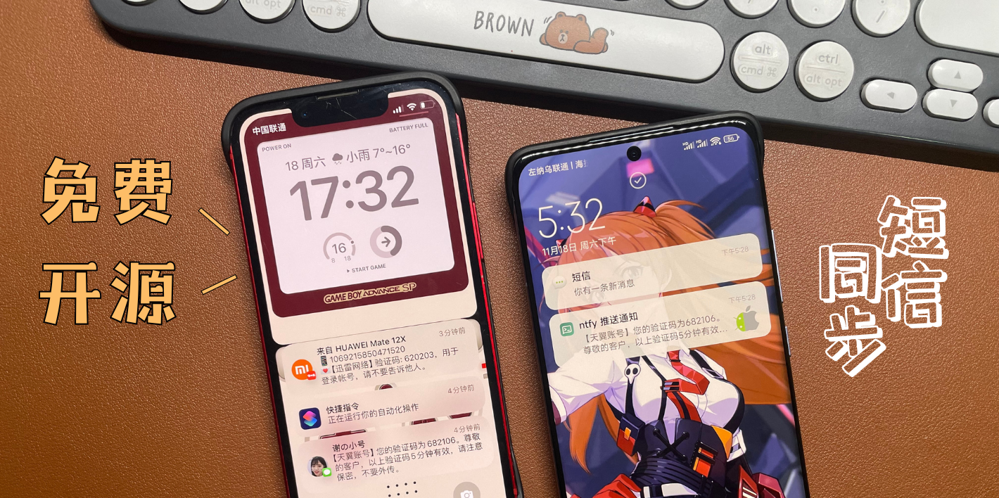

备用机神器！苹果安卓双向同步短信大法

[谢週五](https://sspai.com/u/juneix/updates)

22 小时前

**Matrix 首页推荐** 

[Matrix](https://sspai.com/matrix) 是少数派的写作社区，我们主张分享真实的产品体验，有实用价值的经验与思考。我们会不定期挑选 Matrix 最优质的文章，展示来自用户的最真实的体验和观点。   
文章代表作者个人观点，少数派仅对标题和排版略作修改。

- - -

## 〇、前言

作为一个双机党用户，我同时使用 iPhone 和安卓手机时会有一些小众的同步需求，比如**短信验证码转发**。经过一段时间的网上冲浪，我发现网上的大部分教程都是借助服务号、企微/钉钉/飞书群机器人之类的，多少有一些限制，感觉还不够优雅。因此，我自己动手整合出了一个终极形态——**双向同步短信大法**。

1.  Apple 设备端借助系统推送和自动化功能，不需要 App 常驻后台，甚至不需要运行 App。
2.  安卓端需安装 App 且常驻后台，但可定制化程度很高，没有各种限制。
3.  所有软件都是免费开源的，也可以自部署服务器，更安全。
4.  支持电脑浏览器等方式推送通知，网络短信 ✔get。

双向同步短信

给大家感受一下转发短信的速度，不管是从 iPhone 还是从安卓转发，几乎都是秒推送了，还不错吧。

Apple 设备转安卓

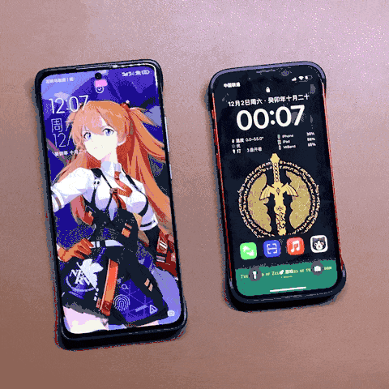

安卓转Apple 设备

如果你问我为什么不买个双卡手机就完事了，非要这么麻烦？我只能说我就是喜欢小手机（iPhone 的 se、mini 系列一直没双卡我其实无所谓），同时我也喜欢同时拥有Apple 设备和安卓系统，体验各自的精彩。大家又是因为什么原因使用两个手机呢？欢迎留言讨论一下。

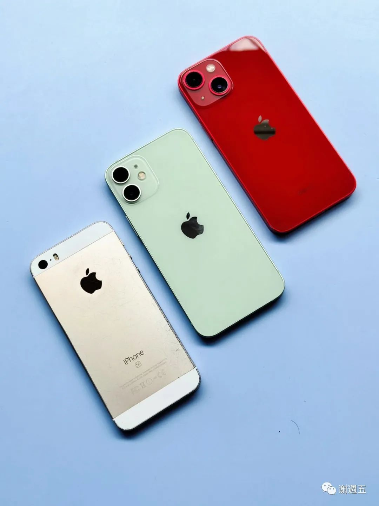

晒一下我的单卡小手机

## 一、安卓 ➡️ Apple 设备

首先说下最常见的情况，安卓备用机短信转发到Apple 设备，也支持转发**任意 App 通知**，甚至**远程控制**安卓。

### 1.1 软件介绍

**Bark** 直接在 App Store 搜索即可找到，免费下载。

> 免费、轻量！简单调用接口即可给自己的 iPhone 发送推送。
> 
> 依赖 Apple 推送通知服务 (APNs)，及时、稳定、可靠。
> 
> 不会消耗设备的电量， 基于系统推送服务与推送扩展，App 本体并不需要运行。
> 
> 隐私安全，可以通过一些方式确保包含作者本人在内的所有人都无法窃取你的隐私。

**短信转发器（SmsForwarder）**虽然开源免费，但因为权限比较敏感，国内商店已下架，请前往 [Github 下载](https://sspai.com/link?target=https%3A%2F%2Fgithub.com%2Fpppscn%2FSmsForwarder)。

> 监控 Android手机短信、来电、APP通知，并根据指定规则转发到其他手机：钉钉/企微/飞书群机器人、企微/飞书应用消息、邮箱、bark、webhook、电报机器人、Server酱、PushPlus、手机短信等。同时包括主动控制服务端与客户端，让你轻松远程发短信、查短信、查通话、查话簿、查电量等。

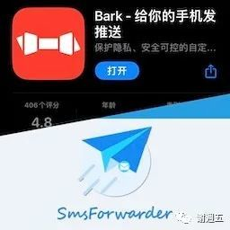

### 1.2 使用步骤

Apple 设备安装 **Bark**，点击复制推送地址 api.day.app/xxxx，不要泄露。如果不小心公开了，建议及时重置。如果你有自部署的 Bark 服务器，可以点击右上角+号进行修改。

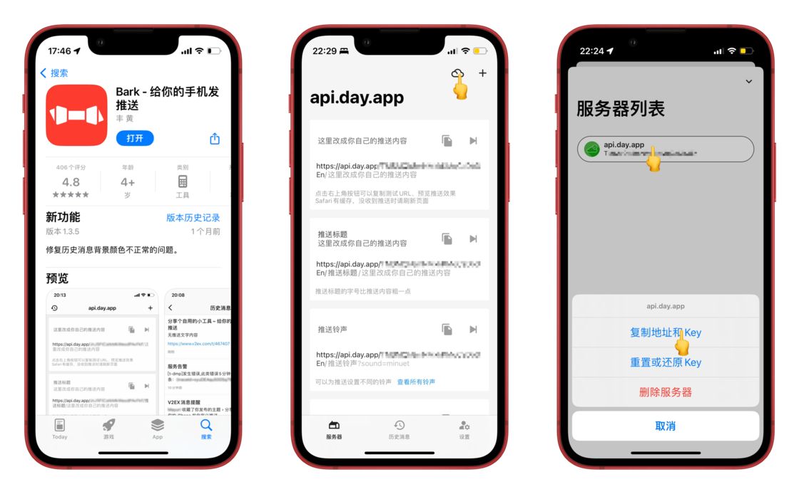

Bark 设置

安卓安装**短信转发器**，授予**短信/自启动/后台/省电权限**。然后进行以下操作：

-   添加转发规则（除了短信，来电、App 通知也可以）
-   发送通道选 Bark，填写自己的推送地址
-   其他选项可参考截图设置

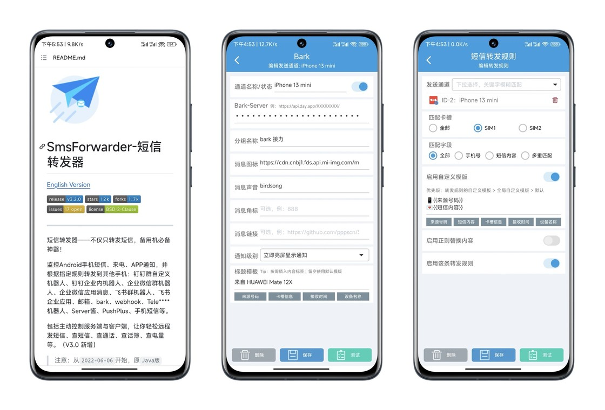

短信转发器设置

请务必授予所有关键**系统权限**，点击**测试**是否运行正常。

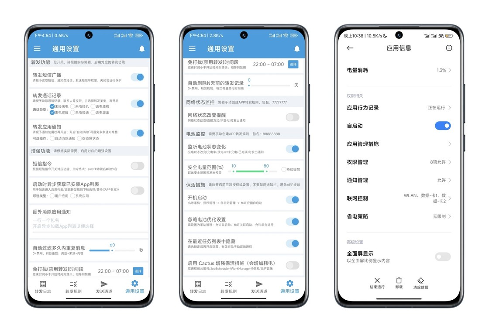

短信转发器权限

更多详细设置和玩法请参考短信转发器作者的👉 [使用文档 Wiki](https://sspai.com/link?target=https%3A%2F%2Fgithub.com%2Fpppscn%2FSmsForwarder%2Fwiki)

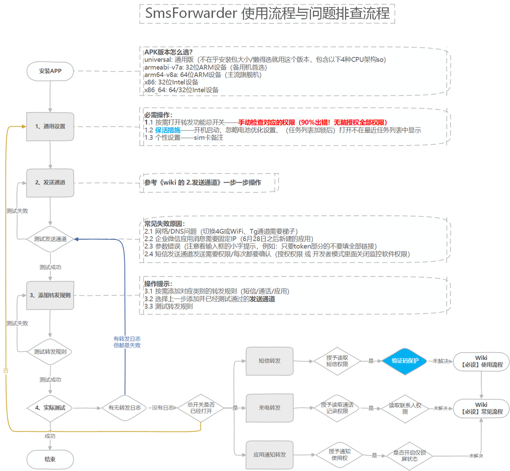

短信转发器指南

## 二、Apple 设备 ➡️ 安卓

接下来说说 Apple 设备备用机短信转发安卓，另外还可以推送文字、图片、链接等。

### 2.1 软件介绍

**快捷指令**是Apple 设备的出厂内置 App，如果实在找不到就去 App Store 重新下载回来。

> 「快捷指令」可让你快速完成各项任务。只需轻点一下，或者直接交给 Siri 和自动化帮你完成。从「快捷指令中心」中数以百计的示例开始使用，或通过拖放创建个人专属的快捷指令。

**ntfy** 是一个免费的开源软件，你可以在 404 商店或者 F-Droid 下载。

> ntfy（发音为 notify）是一种基于 HTTP 的简单 pub-sub 通知服务。它允许您通过脚本从任何计算机和/或使用 REST API 向手机或桌面发送通知。它是无限灵活的，并且是 100% 免费软件。

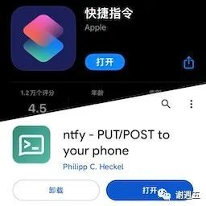

### 2.2 使用步骤

安卓打开👉 [ntfy.sh](https://sspai.com/link?target=https%3A%2F%2Fntfy.sh%2F) 安装 **ntfy**，再打开 ntfy.sh/ikun 添加**自定义 topic 主题**，请把测试的「**ikun**」修改成复杂一点的组合（比如字母+数字），记住自己的推送地址，不要泄露。nfty 默认是**没有密码保护**的，除非购买订阅或者自部署服务器。

安卓安装 **ntfy**，授予**通知/自启动/后台/省电权限**，订阅同一个**自定义 topic 主题**。ntfy 可通过浏览器推送通知，也支持 PWA，但在手机上感觉不太完美，电脑浏览器可以试试。如果你有自部署的 ntfy 服务器，可勾选使用其他服务器。

ntfy设置

Apple 设备快捷指令添加 👉 [**ntfy 推送通知**](https://sspai.com/link?target=https%3A%2F%2F5nav.eu.org%2Fntfy)，填写上面创建的**自定义topic主题。**快捷指令传送门若失效、有版本更新，请看简介找到小而美回复「同步短信」自动获取。如果你有自部署的 ntfy 服务器，可以在添加快捷指令时修改。

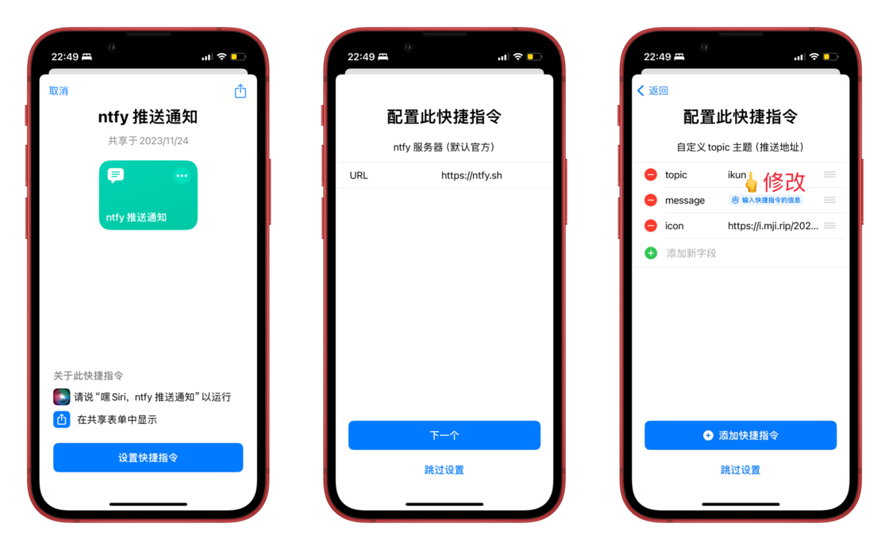

新建一个**个人自动化**，收到短信关键词（如快递、验证码）自动运行 **ntfy 推送通知**，注意选择**立即运行**。短信「立即运行」选项必须 iOS 17，否则要手动确认运行，请考虑升级系统。

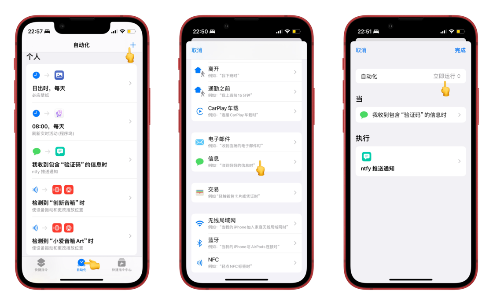

快捷指令自动化

更多详细设置和玩法请参考 ntfy 官网的👉 [使用文档](https://sspai.com/link?target=https%3A%2F%2Fdocs.ntfy.sh%2F)

## 三、小结

现在，不论是工作交流还是日常信息的沟通，两台手机间的短信流转得如此优雅而高效，让我的双机生活更加圆满。

这个方案里使用到的 Bark、短信转发器、ntfy 都是免费开源软件，且官方提供了免费服务器。如果比较在意隐私安全，推荐**自部署服务器**，最低门槛 20 块的某客云刷个 **Armbian** + **IPv6 DDNS** 就能搞定，已经有 NAS、VPS 的当然更好用靠谱了。

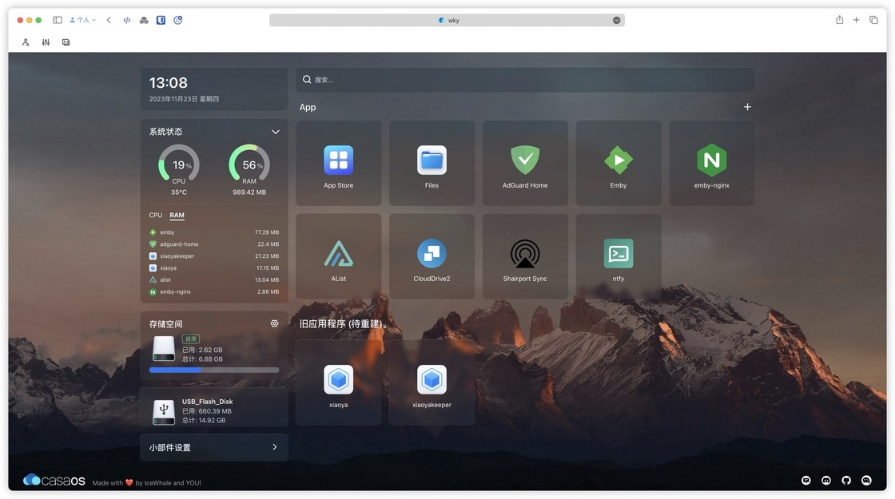

某客云自部署

虽然 ntfy 也支持 iOS，但目前还有一些不太完善的地方，我觉得整体体验不如 Bark，推荐搭配使用。最后再补充一些大家可能关心的细节：

-   iPhone 压根不需要运行App，所以几乎不消耗电量
-   快捷指令可以在任何有系统分享菜单的地方调用
-   安卓的短信转发器和 ntfy 务必授予自启动/后台/省电权限，避免失效
-   ntfy 推荐在设置里开启 WebSockets 协议，相对更省电
-   借助 HTTP 命令行工具，任何设备都可以给 Bark 和 ntfy 推送文本、链接等

如果你喜欢我的内容，除了关注、点赞、评论，我特别邀请你一起帮忙决定下期选题，看我简介找到「[**谢週五的留言板**](https://support.qq.com/products/286230/roadmap?d-wx-push=1)」，就能参与投票了～

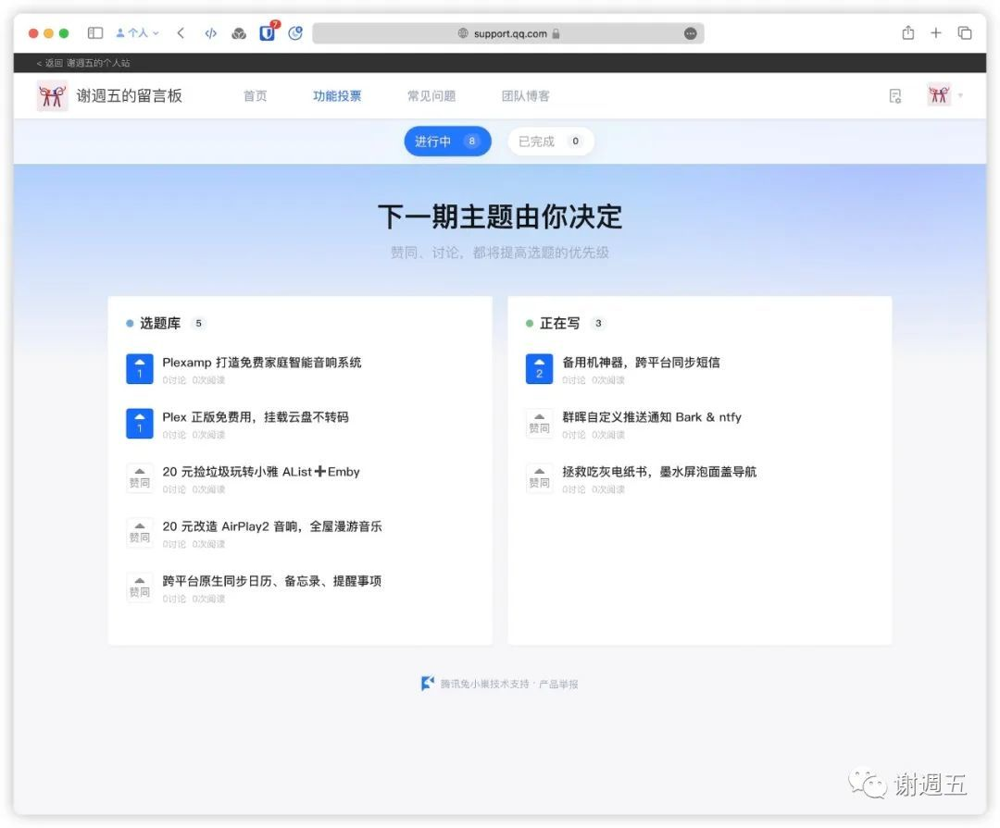

欢迎在线催更

下期教大家除了推送短信，**如何使用 Bark 和 ntfy 推送更多自定义通知。**比如自动签到，群晖的硬盘、下载、备份情况等。

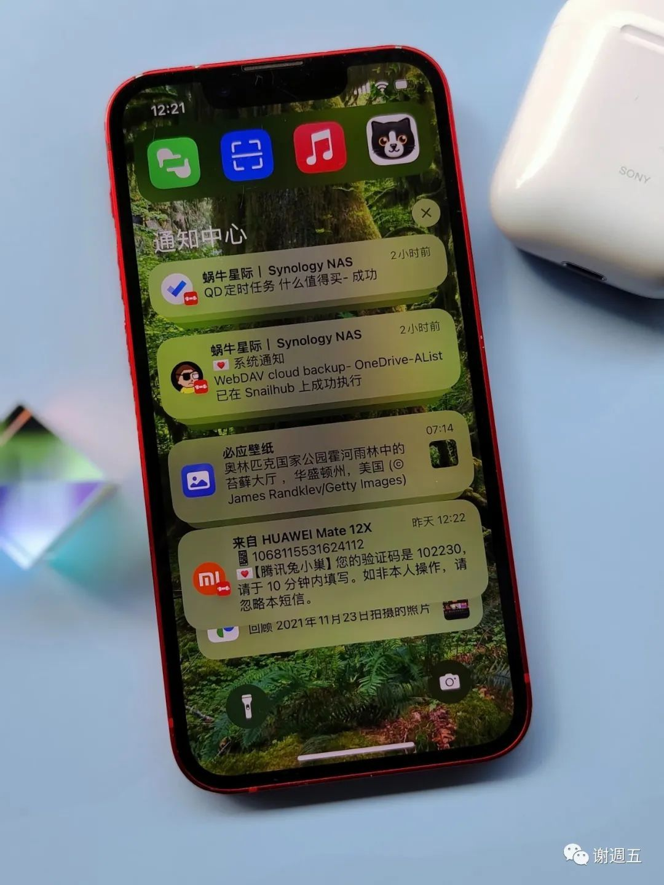

下期预告

〇、前言

一、安卓 ➡️ Apple 设备

1.1 软件介绍

1.2 使用步骤

二、Apple 设备 ➡️ 安卓

2.1 软件介绍

2.2 使用步骤

三、小结

全部评论(28)

热门排序

写下尊重、理性、友好的评论，有助于彼此更好地交流～

[捷宝](https://sspai.com/u/aw8a9end/updates)

16 小时前

以为有什么新方案，原来还是这两个老朋友啊😂

22

[谢週五](https://sspai.com/u/juneix/updates)

16 小时前

重点是第二段，iPhone转发短信到安卓，应该是全网独家方案了吧。加上第一段，才是完整的双向同步啊😎

0

[捷宝](https://sspai.com/u/aw8a9end/updates)

回复

[谢週五](https://sspai.com/u/juneix/updates)

2 分钟前

嗯，方法是新的，老的是用的app，不过我已经换回安卓机了😂早点看到就好了

0

[斓曦未央丶](https://sspai.com/u/lxwy_per/updates)

55 分钟前

IOS上用ntfy接收消息确实不好用，有延迟、不提示，不知道是不是我自己手机的问题，网页版倒是很及时，所以IOS接收消息又换到了PushDeer上

00

[readerpi](https://sspai.com/u/olo426uf/updates)

15 小时前

很详细，期待更多iPhone和安卓双持使用技巧的文章

00

[Sssugus](https://sspai.com/u/3t4ennz0/updates)

18 小时前

不知道有没有什么可以实现iOS收到短信，自动发送到微信之类的工具呢？

20

[谢週五](https://sspai.com/u/juneix/updates)

18 小时前

有啊，快捷指令➕server 酱/pushplus 服务号之类的都行，我觉得体验不太好，所以才有了文章的方案

0

[Sssugus](https://sspai.com/u/3t4ennz0/updates)

回复

[谢週五](https://sspai.com/u/juneix/updates)

14 小时前

刚捣鼓了一下，快捷指令里面开个收到短信自动化执行指令，然后执行一个将短信内容发送给微信好友就行。我设置了发送给我的微信小号，实现了这个需求。

0

[alienate8607](https://sspai.com/u/xiaozhubin/updates)

19 小时前

两个卡，所有注册都在一个手机号上，而手机是pixel 国内无法双卡，之前是用tasker 设置的转邮件，实时性不是很好。后来发现了SmsForwarder 这真是个神器。现在我那年迈的pixel 2天天充着电，专门收验证码。

30

[谢週五](https://sspai.com/u/juneix/updates)

19 小时前

tasker说实话个人觉得挺难用的，安卓自动化工具推荐 MacroDroid，有点 iPhone 快捷指令的感觉了。短信转发器确实好用，用 1-2 年了吧。文章里多了全网独家的 「iPhone 转发安卓」的小众需求，某个摸鱼群群友要求的😄

1

[alienate8607](https://sspai.com/u/xiaozhubin/updates)

回复

[谢週五](https://sspai.com/u/juneix/updates)

19 小时前

iPhone转安卓这个确实第一次看见。感觉，自建gotify 也可以用来作为iPhone 转安卓的方案使用。

0

[谢週五](https://sspai.com/u/juneix/updates)

回复

[alienate8607](https://sspai.com/u/xiaozhubin/updates)

19 小时前

嗯，gotify试用了一下，体验不如 ntfy。ntfy 官网演示看到接入了很多平台，比较友好。

0

[北坡八百炮兵炮](https://sspai.com/u/u83zrx0t/updates)

19 小时前

感谢分享，打开了新世界大门

10

[谢週五](https://sspai.com/u/juneix/updates)

19 小时前

比较小众的需求，顺手分享，能帮到少数派就好～

1

[夜影](https://sspai.com/u/egk66q3j/updates)

19 小时前

有点好奇，ios 平台下 bark 这种要联网的应用虽然说开源了，但是也不便于自己编译安装的要怎么保证发布版本和开源代码的一致性呢0.0？毕竟安卓可以自己从源码编译(虽然大多数人包括我都是直接用预编译产物也没法保证

40

[谢週五](https://sspai.com/u/juneix/updates)

19 小时前

我也是技术小白，这个不是很懂。具体可以参考开发者官网的描述。[https://bark.day.app/#/privacy](https://sspai.com/link?target=https%3A%2F%2Fbark.day.app%2F%23%2Fprivacy)

1

[少数派40499532](https://sspai.com/u/w1ragnkt/updates)

17 小时前

即便是可以自己编译安装，难道每次升级都要从头到尾阅读源码之后再安装吗？现在的手机都有详细的权限控制，不想让 app 访问应该是从权限控制入手而不是担心是否开源，编译后的代码是否有害。现在的 app 为什么要签名才能发布就是为了万一你作恶能找到下家，有签名的就说明 app 没有被篡改。

0

[夜影](https://sspai.com/u/egk66q3j/updates)

回复

[少数派40499532](https://sspai.com/u/w1ragnkt/updates)

7 小时前

权限控制在这个场景下无法区分的呀。短信需要联网推送，那必然需要放行敏感权限。开源自己编译可以强保证应用没有在正常联网用途之外偷偷上传隐私。(自己声明用户信也行，但显然这个保证不如开源强。

0

[夜影](https://sspai.com/u/egk66q3j/updates)

回复

[谢週五](https://sspai.com/u/juneix/updates)

7 小时前

哦！非常感谢！官网的解释完美地解答了我的疑问—— github 和 appstore 能保证编译产物和开源代码的一致性！

0

[Vincent\_Asobi](https://sspai.com/u/4pxqr71e/updates)

20 小时前

404商店是什么？

10

[谢週五](https://sspai.com/u/juneix/updates)

19 小时前

谷歌 play商店，也可以直接去 f-droid 下载。打开官网就能看到了

0

[Mojit0](https://sspai.com/u/rv7ygrc2/updates)

20 小时前

iPhone快捷指令要求手机解锁才会触发

10

[谢週五](https://sspai.com/u/juneix/updates)

19 小时前

制作快捷指令时我已经设置「锁定时允许允许」了，如果还是需要手动确认，那应该就是系统版本低了，iOS 17 才给了短信静默自动化权限。

0

[Jerrys](https://sspai.com/u/dqmvrjg1/updates)

21 小时前

单位的APP只能安卓，所以用两个，苹果主力机，安卓插钉钉卡，苹果流量快用完的时候安卓开热点。

20

[谢週五](https://sspai.com/u/juneix/updates)

19 小时前

我手机套餐都是丐版，才 3GB流量，全靠 Wi-Fi，甚至用不完，叠加到下个月😄

1

[Jerrys](https://sspai.com/u/dqmvrjg1/updates)

回复

[谢週五](https://sspai.com/u/juneix/updates)

10 小时前

主号移动是融合套餐，40G限速，家里5人共享，副号北钉不限速、不销量，所以经常给主号开热点，苹果开热点总是断，所以安卓备用机给苹果开。

0

[任大喵](https://sspai.com/u/j64ow5hb/updates)

21 小时前

啊 说起来我一直犹豫着要不要买一台二手pixel作为安卓的备用机，但是感觉平时又用不到，所以就一直在买和用不到徘徊中hahahahahha

10

[谢週五](https://sspai.com/u/juneix/updates)

19 小时前

买个玩玩了，苹果安卓各有特色。我那个小米 12x 就是二手，一千块。我喜欢小手机，这个在安卓里勉强算小了

0

没有更多评论了哦
