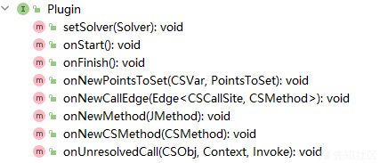
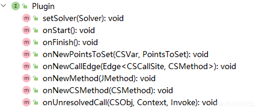

# 太阿分析JavaWeb系统-添加入口点 - 先知社区

太阿分析JavaWeb系统-添加入口点

- - -

# 0x01 前言

实践：

-   分析 JavaWeb 系统发现太阿必须指定程序入口，否则不会指针分析
-   多看项目 issues

程序分析对象：太阿目前的污点分析需要指定程序入口，否则只使用 Soot 前端生成 Jimple 三地址码

-   对于多程序入口程序，思路是参考 [太阿Wiki](https://github.com/pascal-lab/Tai-e/wiki/Pointer-Analysis-Framework#an-example-of-plugin)、[issue#9](https://github.com/pascal-lab/Tai-e/issues/9) 编写自己的插件并激活
-   对于封闭的 Jar 包，可以查看 [issue#17](https://github.com/pascal-lab/Tai-e/issues/17)，实验观察会执行 **WorldBuilder** 阶段，随后进行的指针分析则会因为缺少入口而直接结束
    -   查看源码，在 options.yml 找到配置项 worldBuilderClass: pascal.taie.frontend.soot.SootWorldBuilder，作用是用 Soot 扫描字节码生成 Jimple 三地址码
    -   指针分析在 options.yml 的配置项是 analyses: pta: xxx

思路：Javaee 指的是 Web 程序，在 Javaee 中存在多个 Servlet/Controller，需要将多个路由对应的方法加入到太阿分析的入口点 Entrypoint（这也是调用图和 ICFG 的入口）。

# 0x02 分析插件系统

太阿的一个特点是它的分析插件系统，通过与指针分析交互能够以模块化的方式添加新的分析到框架中，相关目录是 pascal/taie/analysis/pta/plugin。

插件系统是如何工作的：

[](https://xzfile.aliyuncs.com/media/upload/picture/20240103163851-859bee88-aa13-1.png)

## 如何加载 solver 和 plugins

太阿调用指针分析类的方法 pascal/taie/analysis/pta/PointerAnalysis#runAnalysis() 进行分析

-   创建一个默认求解器 solver
-   根据 solver 和 options 加载默认和额外添加的 plugin

```plain
private PointerAnalysisResult runAnalysis(HeapModel heapModel,
                                              ContextSelector selector) {
        AnalysisOptions options = getOptions();
        Solver solver = new DefaultSolver(options,
                heapModel, selector, new MapBasedCSManager());
        // The initialization of some Plugins may read the fields in solver,
        // e.g., contextSelector or csManager, thus we initialize Plugins
        // after setting all other fields of solver.
        setPlugin(solver, options);
        solver.solve();
        return solver.getResult();
    }
```

跟进插件配置方法 pascal/taie/analysis/pta/PointerAnalysis#setPlugin()，创建一个插件组并加载插件

-   可以使用 new 语句添加默认 plugin
-   最后将插件组和求解器互相绑定

```plain
private static void setPlugin(Solver solver, AnalysisOptions options) {
        CompositePlugin plugin = new CompositePlugin();
        // add builtin plugins
        // To record elapsed time precisely, AnalysisTimer should be added at first.
        plugin.addPlugin(
                new AnalysisTimer(),
                new EntryPointHandler(),
                new ClassInitializer(),
                new ThreadHandler(),
                new NativeModeller(),
                new ExceptionAnalysis()
        );
            ...
        plugin.setSolver(solver);
        solver.setPlugin(plugin);
```

## solver

solver 用于装载指针分析的环境信息和插件，进行指针分析后返回指针分析的结果。

查看接口文件 pascal/taie/analysis/pta/core/solver/Solver.java，结合 pascal/taie/analysis/pta/PointerAnalysis.java 指针分析类的代码，可以看到

-   指针分析类通过创建 solver 实例
-   然后调用求解器的入口点 solver.solve() 进行指针分析

#### 求解器接口

如下代码是 Solver 接口的代码，逐个查看并进行注解，主要包含：

-   系统的运行参数、类继承关系、堆实例、上下文敏感要素
-   指针分析相关的 CallGraph、指针的指向关系、指针流向图
-   指针分析的 EntryPoint、指针分析结果等

```plain
public interface Solver {

    // 运行参数
    AnalysisOptions getOptions();

    // 类继承关系
    ClassHierarchy getHierarchy();

    // 查询类型
    TypeSystem getTypeSystem();

    // 获取堆模型
    HeapModel getHeapModel();

    // 管理上下文敏感要素
    CSManager getCSManager();

    // 表示上下文敏感变体
    ContextSelector getContextSelector();

    // 方法调用图，包括方法节点和调用边
    CallGraph<CSCallSite, CSMethod> getCallGraph();

    // 获取指针集，即指针指向的对象集合
    PointsToSet getPointsToSetOf(Pointer pointer);

    // 创建一个空的指向关系集合
    PointsToSet makePointsToSet();

    // 为求解器设置插件
    void setPlugin(Plugin plugin);

        // 求解器的起始点
    void solve();

    // 添加指针及其指针集合
    void addPointsTo(Pointer pointer, PointsToSet pts);

    // 添加指针及其上下文敏感对象
    void addPointsTo(Pointer pointer, CSObj csObj);

    // 添加指针、上下文的堆、抽象对象
    void addPointsTo(Pointer pointer, Context heapContext, Obj obj);

    // 添加指针、空的上下文、抽象对象
    default void addPointsTo(Pointer pointer, Obj obj) {
        addPointsTo(pointer, getContextSelector().getEmptyContext(), obj);
    }

        // 添加指向关系集合
    void addVarPointsTo(Context context, Var var, PointsToSet pts);

    void addVarPointsTo(Context context, Var var, CSObj csObj);

    void addVarPointsTo(Context context, Var var, Context heapContext, Obj obj);

    default void addVarPointsTo(Context context, Var var, Obj obj) {
        addVarPointsTo(context, var, getContextSelector().getEmptyContext(), obj);
    }

    void addPointerFilter(Pointer pointer, Predicate<CSObj> filter);

    // 添加指针流向图的边
    default void addPFGEdge(Pointer source, Pointer target, FlowKind kind) {
        addPFGEdge(source, target, kind, Identity.get());
    }

    // 添加指针流向图
    default void addPFGEdge(Pointer source, Pointer target, FlowKind kind, Type type) {
        addPFGEdge(source, target, kind, new TypeFilter(type, this));
    }

    void addPFGEdge(Pointer source, Pointer target, FlowKind kind, Transfer transfer);

    // 添加入口点
    void addEntryPoint(EntryPoint entryPoint);

    // 添加调用边
    void addCallEdge(Edge<CSCallSite, CSMethod> edge);

    // 添加上下文敏感方法
    void addCSMethod(CSMethod csMethod);

    void addStmts(CSMethod csMethod, Collection<Stmt> stmts);

    void addIgnoredMethod(JMethod method);

    void initializeClass(JClass cls);

    // 获取指针分析的结果
    PointerAnalysisResult getResult();
}
```

#### 默认求解器实现类

查看文件 pascal/taie/analysis/pta/core/solver/DefaultSolver.java，找到入口方法 solve()，作用是运行指针分析算法。

```plain
@Override
    public void solve() {
        initialize();
        analyze();
    }
```

查看初始化方法 initialize()，

-   根据上下文敏感要素，分别创建调用图、指针流向图
-   创建集合对象，包含工作清单、可达方法、初始化过的类、忽略方法、语义处理器
-   调用 plugin.onStart() 执行加载的插件

查看分析方法 analyze()，

-   通过迭代算法消费 WorkList 中的任务，其中调用的插件方法 plugin.onNewPointsToSet()
-   指针分析结束后，调用插件方法 plugin.onFinish() 结束插件生命周期

## plugins

太阿的插件用于执行指针分析的各种算法任务，pascal/taie/analysis/pta/plugin/Plugin.java 接口类有几个生命周期函数：

[](https://xzfile.aliyuncs.com/media/upload/picture/20240104200342-4d955cd6-aaf9-1.png)

查看默认求解器 DefaultSolver 发现，初始化求解器时会执行所有插件的 onStart() 方法。

查看指针分析主类 pascal/taie/analysis/pta/PointerAnalysis.java 的 setPlugin() 方法，其中内置加载的插件有 EntryPointHandler()。

```plain
plugin.addPlugin(
                new AnalysisTimer(),
                new EntryPointHandler(),
                new ClassInitializer(),
                new ThreadHandler(),
                new NativeModeller(),
                new ExceptionAnalysis()
        );
```

#### 程序入口点插件

查看 pascal/taie/analysis/pta/plugin/EntryPointHandler.java，只有两个方法，其中 onStart() 方法：

-   如果指定的 main class 有 main 方法，那么就调用 solver.addEntryPoint() 添加污点分析的入口点
-   如果没有 main 方法，则判断运行参数中是否有隐式入口 implicit-entries 参数，简单来说就是通过 new 语句隐式加载类对象的代码
    -   如果配置了隐式入口，则逐个添加为污点分析的入口点
    -   查看 en/pointer-analysis-framework.adoc，该参数用于指定是否将 JVM 隐式调用的方法视为指针分析的入口点。当为 false 时，这些方法不被视为入口点，导致可能出现不合理的指向结果
    -   类加载过程由类加载器来完成，有隐式加载和显式加载两种方式（隐式调用）
        -   隐式加载是指在使用new等方式创建对象时会隐式调用类加载器把对应的类加载到JVM中
        -   显式加载是指通过直接调用Class.forName()把对应的类加载到JVM中

```plain
@Override
    public void setSolver(Solver solver) {
        this.solver = solver;
    }

    @Override
    public void onStart() {
        // process program main method
        JMethod main = World.get().getMainMethod();
        if (main != null) {
            solver.addEntryPoint(new EntryPoint(main,
                    new DeclaredParamProvider(main, solver.getHeapModel(), 1)));
        }
        // process implicit entries
        if (solver.getOptions().getBoolean("implicit-entries")) {
            for (JMethod entry : World.get().getImplicitEntries()) {
                solver.addEntryPoint(new EntryPoint(entry, EmptyParamProvider.get()));
            }
        }
    }
```

#### 入口点的数据结构

简单查看入口点的数据结构，找到 pascal/taie/analysis/pta/core/solver/DefaultSolver.java 的 addEntryPoint() 方法，传入 EntryPoint 程序入口点对象

```plain
@Override
    public void addEntryPoint(EntryPoint entryPoint) {...}
```

查看 Record 记录类 pascal/taie/analysis/pta/core/solver/EntryPoint.java，入口被定义为 method 及其 parameters

```plain
public record EntryPoint(JMethod method, ParamProvider paramProvider) {...}
```

#### 源码中添加入口点

查看了入口点的数据结构之后，回头看 pascal/taie/analysis/pta/plugin/EntryPointHandler.java，其根据 main class 及其 main 方法添加指针分析入口点的主要代码如下，

```plain
solver.addEntryPoint(new EntryPoint(main,
                    new DeclaredParamProvider(main, solver.getHeapModel(), 1)));
```

动态调试打印 main，得到函数签名 <Server: void main(java.lang.String\[\])>。

可以直接在 EntryPointHandler 插件里添加入口点方法，比如添加某 JavaWeb 系统的 Servlet 方法为指针分析的入口，分析其参数实例得到函数签名：<DecryptApplicationService2: void service(com.oreilly.servlet.MultipartWrapper, javax.servlet.http.HttpServletResponse)>

操作发现，通过 new EntryPoint(JMethod, ParamProvider) 创建入口点，函数签名必须是 JMethod 类型。追溯 main 是如何赋值 JMethod 类型的，发现

-   pascal/taie/frontend/soot/SootWorldBuilder.java，调用 new Converter(loader, typeSystem) 创建转换器
-   然后调用 JMethod Converter.convertMethod(SootMethod) 方法
-   再追踪形参 SootMethod 找到 soot.Scene.java#getMainMethod() 方法

soot.Scene.java#getMainMethod() 方法如下，

-   找到最底层的 mainClass.getMethodUnsafe(String name, List<type> parameterTypes, Type returnType) </type>
-   传入方法的 className、形参List、返回类型，即可修改默认的入口点方法
-   ~But，soot-4.4.1-sources.jar!/soot/Scene.java 的源码是只读的，那就到此为止吧，再追着修改入口点的默认方法就不礼貌了~

```plain
public SootMethod getMainMethod() {
    if (!hasMainClass()) {
      throw new RuntimeException("There is no main class set!");
    }

    SootMethod mainMethod = Options.v().src_prec() != Options.src_prec_dotnet
        ? mainClass.getMethodUnsafe("main", Collections.singletonList(ArrayType.v(RefType.v("java.lang.String"), 1)),
            VoidType.v())
        : mainClass.getMethodUnsafe("Main",
            Collections.singletonList(ArrayType.v(RefType.v(DotnetBasicTypes.SYSTEM_STRING), 1)), VoidType.v());
    if (mainMethod == null) {
      throw new RuntimeException("Main class declares no main method!");
    }
    return mainMethod;
  }
```

查看参考资料，发现太阿的插件通过封装方法可以获取到 new EntryPoint(JMethod, ParamProvider) 的参数对象，比如 pascal/taie/analysis/pta/plugin/ThreadHandler.java 的 onStart() 方法。

-   获取 JMethod 对象：向 requireNonNull(hierarchy.getJREMethod(method signature)) 传入方法签名
-   获取 ParamProvider 对象：
    -   typeSystem.getClassType(classname)
    -   heapModel.getMockObj(Descriptor.ENTRY\_DESC,"<system-thread-group>",threadGroup)</system-thread-group>
-   也可以从 World 对象中读取类继承关系，然后根据类名获取实例，再获取其方法

```plain
@Override
    public void onStart() {
        if (!solver.getOptions().getBoolean("implicit-entries")) {
            return;
        }
        TypeSystem typeSystem = solver.getTypeSystem();
        HeapModel heapModel = solver.getHeapModel();

        // setup system thread group
        JMethod threadGroupInit = requireNonNull(
                hierarchy.getJREMethod("<java.lang.ThreadGroup: void <init>()>"));
        ClassType threadGroup = typeSystem.getClassType(ClassNames.THREAD_GROUP);
        Obj systemThreadGroup = heapModel.getMockObj(Descriptor.ENTRY_DESC,
                "<system-thread-group>", threadGroup);
        solver.addEntryPoint(new EntryPoint(threadGroupInit,
                new SpecifiedParamProvider.Builder(threadGroupInit)
                        .addThisObj(systemThreadGroup)
                        .build()));
```

# 0x03 编写插件添加多个入口

查看代码时发现 src/test/java/pascal/taie/analysis/pta/CustomEntryPointPlugin.java，该类就是自定义入口点的测试类。

创建一个插件目录和插件类 pascal/taie/analysis/pta/plugin/pumpkin/TomcatEntry.java，参考 CustomEntryPointPlugin 的插件编写代码。

#### 指定所在类

CustomEntryPointPlugin 插件的代码很全，只需要填充类名、方法名、参数类型即可。

获取自定义入口方法所在的类，这里写入测试类：

```plain
@Override
    public void onStart() {
        JClass clz = hierarchy.getClass("com.esafenet.servlet.service.smartsec.DecryptApplicationService2");
    assert clz != null;
```

#### 形参问题

入口点方法的参数分成三类，首先调用 clz.getDeclaredMethod(method) 获取入口点方法，然后根据不同的情况分别获取方法的参数，代码如下。

-   如果是空参数，则 ParamProvider 使用 EmptyParamProvider.get()
    
-   默认声明参数，传入堆和方法名 new DeclaredParamProvider(declaredParam1, heapModel, 1) 获取声明的参数类型。跟踪 DeclaredParamProvider() 方法，定位到 pascal/taie/analysis/pta/core/solver/DeclaredParamProvider#generateObjs() 方法查看具体操作
    
    -   如果 method 非静态方法、且 method 所在类非抽象，则创建方法所在类的 this 对象
    -   如果 **param 可实例化**、即非抽象类接口类，则创建 param 对象
        -   Controller/Servlet 接收的 req/resp 形参都是接口类 javax.servlet.http.HttpServletRequest、javax.servlet.http.HttpServletResponse
        -   通过参数的声明类型无法创建 param 对象
-   使用 specifiedParam 指定参数类型
    -   调用 heapModel.getMockObj() 生成 this、param 等对象
    -   调用 paramProviderBuilder.build() 生成 ParamProvider 对象

```plain
// 声明参数: emptyParam、declaredParam
                JMethod emptyParam = clz.getDeclaredMethod("entryWithEmptyParam");
        assert emptyParam != null;
        solver.addEntryPoint(new EntryPoint(emptyParam, EmptyParamProvider.get()));

        JMethod declaredParam1 = clz.getDeclaredMethod("entryWithDeclaredParam1");
        assert declaredParam1 != null;
        solver.addEntryPoint(new EntryPoint(
                declaredParam1, new DeclaredParamProvider(declaredParam1, heapModel, 1)));
                ...

                // 特定参数: specifiedParam
                JMethod specifiedParam = clz.getDeclaredMethod("entryWithSpecifiedParam");
        assert specifiedParam != null;
        SpecifiedParamProvider.Builder paramProviderBuilder =
                new SpecifiedParamProvider.Builder(specifiedParam);
        Obj thisObj = heapModel.getMockObj(Descriptor.ENTRY_DESC, "MethodParam{this}",
                clz.getType(), specifiedParam);
        Obj p0 = heapModel.getMockObj(Descriptor.ENTRY_DESC, "MethodParam{0}",
                specifiedParam.getParamType(0), specifiedParam);
        Obj p1 = heapModel.getMockObj(Descriptor.ENTRY_DESC, "MethodParam{1}",
                specifiedParam.getParamType(1), specifiedParam);
        Obj stringObj = heapModel.getMockObj(Descriptor.ENTRY_DESC, "MethodParam{0}.s1",
                typeSystem.getType(ClassNames.STRING), specifiedParam);
        Obj param1Obj = heapModel.getMockObj(Descriptor.ENTRY_DESC, "MethodParam{1}[*]",
                typeSystem.getType("Param1"), specifiedParam);
        JField s1Field = hierarchy.getField("<Param1: java.lang.String s1>");
        paramProviderBuilder.addThisObj(thisObj)
                .addParamObj(0, p0)
                .addFieldObj(p0, s1Field, stringObj)
                .addParamObj(1, p1)
                .addArrayObj(p1, param1Obj)
                .setDelegate(new DeclaredParamProvider(specifiedParam, heapModel));
        solver.addEntryPoint(new EntryPoint(specifiedParam, paramProviderBuilder.build()));
```

#### 编写插件代码

参考 CustomEntryPointPlugin.java 编写自定义插件 TomcatEntry.java，

```plain
package pascal.taie.analysis.pta.plugin.pumpkin;

import pascal.taie.World;
import pascal.taie.analysis.pta.core.heap.Descriptor;
import pascal.taie.analysis.pta.core.heap.HeapModel;
import pascal.taie.analysis.pta.core.heap.Obj;
import pascal.taie.analysis.pta.core.solver.DeclaredParamProvider;

import pascal.taie.analysis.pta.core.solver.EntryPoint;
import pascal.taie.analysis.pta.core.solver.Solver;
import pascal.taie.analysis.pta.core.solver.SpecifiedParamProvider;
import pascal.taie.analysis.pta.plugin.Plugin;
import pascal.taie.language.classes.ClassHierarchy;
import pascal.taie.language.classes.JClass;
import pascal.taie.language.classes.JMethod;
import pascal.taie.language.type.TypeSystem;

public class TomcatEntry implements Plugin {

    private Solver solver;

    private ClassHierarchy hierarchy;

    private TypeSystem typeSystem;

    private HeapModel heapModel;

    @Override
    public void setSolver(Solver solver) {
        this.solver = solver;
        this.hierarchy = solver.getHierarchy();
        this.typeSystem = solver.getTypeSystem();
        this.heapModel = solver.getHeapModel();
    }

    @Override
    public void onStart() {

        JClass clz = hierarchy.getClass("com.esafenet.servlet.service.smartsec.DecryptApplicationService2");
        assert clz != null;

        JMethod specifiedParam = clz.getDeclaredMethod("service");
        assert specifiedParam != null;

        JClass reqWrapper = World.get().getClassHierarchy().getClass("javax.servlet.ServletRequestWrapper");
        JClass respWrapper = World.get().getClassHierarchy().getClass("javax.servlet.http.HttpServletResponseWrapper");

        SpecifiedParamProvider.Builder paramProviderBuilder =
                new SpecifiedParamProvider.Builder(specifiedParam);
        Obj thisObj = heapModel.getMockObj(Descriptor.ENTRY_DESC, "MethodParam{this}",
                clz.getType(), specifiedParam);
        Obj p0 = heapModel.getMockObj(Descriptor.ENTRY_DESC, "MethodParam{0}",
                reqWrapper.getType(), specifiedParam);

        Obj p1 = heapModel.getMockObj(Descriptor.ENTRY_DESC, "MethodParam{1}",
                respWrapper.getType(), specifiedParam);


        paramProviderBuilder.addThisObj(thisObj)
                .addParamObj(0, p0)
                .addParamObj(1, p1)
                .setDelegate(new DeclaredParamProvider(specifiedParam, heapModel));

        System.out.println("build对象");
        System.out.println(paramProviderBuilder.build().getParamObjs(0));

        solver.addEntryPoint(new EntryPoint(specifiedParam, paramProviderBuilder.build()));

    }
}
```

#### 入口点运行测试

编辑 options.yml 运行配置文件，添加插件参数，导入项目有关 jar 包

```plain
appClassPath:
  - java-benchmarks/general/javax.servlet-api-4.0.0.jar
  - java-benchmarks/yisaitong/CDGServer3/WEB-INF/lib/JSPSmart.jar
  - java-benchmarks/yisaitong/CDGServer3/WEB-INF/lib/Rijndael.jar
  - java-benchmarks/yisaitong/CDGServer3/WEB-INF/lib/UserAuth.jar
  - ...
mainClass:
inputClasses: []
...

analyses:
  pta: cs:ci;plugins:[pascal.taie.analysis.pta.plugin.pumpkin.TomcatEntry];
```

运行结果如下，证明找到了插件添加的 com.esafenet.servlet.service.smartsec.DecryptApplicationService2 入口点，进行了 4.58s 的指针分析。

```plain
[Pointer analysis] elapsed time: 3.99s
Detected 0 taint flow(s):
TFGDumper starts ...
Source nodes:
Sink nodes:
Dumping /.../Tai-e-master/output/taint-flow-graph.dot
TFGDumper finishes, elapsed time: 0.18s
-------------- Pointer analysis statistics: --------------
#var pointers:                8,2402 (insens) / 8,2402 (sens)
#objects:                     5345 (insens) / 5345 (sens)
#var points-to:               118,0422 (insens) / 118,0422 (sens)
#static field points-to:      1806 (sens)
#instance field points-to:    14,4745 (sens)
#array points-to:             1,1705 (sens)
#reachable methods:           8067 (insens) / 8067 (sens)
#call graph edges:            4,3095 (insens) / 4,3096 (sens)
----------------------------------------
pta finishes, elapsed time: 4.58s
Tai-e finishes, elapsed time: 114.80s
```

#### 入口点参数运行测试（找到污点数据流）

入口点添加成功，但测试发现 Source nodes 一直为空，说明 req 没有匹配上 sources 的 req.getParameter() 方法。

如下的 source 程序的堆里定位到了，说明是 req 的设置问题。

```plain
sources:
    - { kind: call, method: "<javax.servlet.ServletRequestWrapper: java.lang.String getParameter(java.lang.String)>", index: result }
```

首先来到插件代码，打印入口点的信息：

```plain
System.out.println("build对象");
        System.out.println(paramProviderBuilder.build().getParamObjs(0));
```

发现第一个参数 req 的对象信息如下所示，看起来没问题。

```plain
[EntryPointObj{alloc=MethodParam{0},type=javax.servlet.ServletRequestWrapper in <com.esafenet.servlet.service.smartsec.DecryptApplicationService2: void service(javax.servlet.http.HttpServletRequest,javax.servlet.http.HttpServletResponse)>}]
```

难道是 javax.servlet.ServletRequestWrapper 的问题？

修改插件代码，尝试指定 javax.servlet.http.HttpServletRequestWrapper 类型，

```plain
JClass reqWrapper = World.get().getClassHierarchy().getClass("javax.servlet.http.HttpServletRequestWrapper");
```

发现终于找到了污点对象及其数据流！

```plain
Detected 25 taint flow(s):
TaintFlow{<com.esafenet.servlet.service.smartsec.DecryptApplicationService2: void service(javax.servlet.http.HttpServletRequest,javax.servlet.http.HttpServletResponse)>[3@L82] $r2 = invokeinterface request.getParameter(%stringconst0)/result -> <java.io.FileInputStream: void <init>(java.lang.String)>[2@L93] invokespecial $r2.<init>(r1)/0}
...

TFGDumper starts ...
Source nodes:
VarNode{<com.esafenet.servlet.service.smartsec.DecryptApplicationService2: void service(javax.servlet.http.HttpServletRequest,javax.servlet.http.HttpServletResponse)>/$r2}
Sink nodes:
VarNode{<java.io.FilePermission: void init(int)>/$r30}
VarNode{<java.util.zip.ZipFile: void <init>(java.io.File,int,java.nio.charset.Charset)>/$r9}
...
```

为什么指定模拟参数为 javax.servlet.ServletRequestWrapper 不行？

-   javax.servlet.ServletRequestWrapper 类实现的接口是 javax.servlet.ServletRequest，没有实现 javax.servlet.http.HttpServletRequest 接口
-   javax.servlet.http.HttpServletRequestWrapper，继承了 ServletRequestWrapper、还实现了两个接口

在测试代码里，com.opensymphony.module.sitemesh.parser.PageRequest 继承了 HttpServletRequestWrapper，尝试把该类设置为模拟参数，发现也可以找到污点流。

```plain
[EntryPointObj{alloc=MethodParam{0},type=com.opensymphony.module.sitemesh.parser.PageRequest in <com.esafenet.servlet.service.smartsec.DecryptApplicationService2: void service(javax.servlet.http.HttpServletRequest,javax.servlet.http.HttpServletResponse)>}]
[Pointer analysis] elapsed time: 5.29s
Detected 25 taint flow(s):
TaintFlow{<com.esafenet.servlet.service.smartsec.DecryptApplicationService2: void service(javax.servlet.http.HttpServletRequest,javax.servlet.http.HttpServletResponse)>[3@L82] $r2 = invokeinterface request.getParameter(%stringconst0)/result -> <java.io.FileInputStream: void <init>(java.lang.String)>[2@L93] invokespecial $r2.<init>(r1)/0}
TaintFlow{<com.esafenet.servlet.service.smartsec.DecryptApplicationService2: void service(javax.servlet.http.HttpServletRequest,javax.servlet.http.HttpServletResponse)>[3@L82] $r2 = invokeinterface request.getParameter(%stringconst0)/result -> <java.io.FileOutputStream: void <init>(java.lang.String)>[2@L101] invokespecial $r2.<init>(r1)/0}
...
Source nodes:
VarNode{<com.esafenet.servlet.service.smartsec.DecryptApplicationService2: void service(javax.servlet.http.HttpServletRequest,javax.servlet.http.HttpServletResponse)>/$r2}
```

由此得出结论，模拟参数的对象是接口的实现类、或者接口实现类的子类时，才能生成 Source nodes。

#### 如何设置 source

关于 getParameter(str) 方法，

-   顶级接口 javax/servlet/ServletRequest.java 定义了该方法
-   次级接口 javax/servlet/http/HttpServletRequest.java 没有重写该方法
-   实现类 javax.servlet.ServletRequestWrapper.java，实现 ServletRequest 接口重写了该方法
-   次级实现类 javax/servlet/http/HttpServletRequestWrapper.java，继承了 ServletRequestWrapper、实现了 HttpServletRequest 接口，没有重写该方法

关于要设置的污点对象 <com.esafenet.servlet.service.smartsec.DecryptApplicationService2: void service(javax.servlet.http.HttpServletRequest,javax.servlet.http.HttpServletResponse)>

-   形参是 javax/servlet/http/HttpServletRequest.java 接口，没有声明或重写 getParameter(str) 方法
-   只有 javax/servlet/http/HttpServletRequestWrapper.java 实现了该接口，也没有声明或重写 getParameter(str) 方法

入口方法、及其参数的所在类不能是接口类，那只能选择 HttpServletRequest 的实现类 javax/servlet/http/HttpServletRequestWrapper 作为入口方法的参数。

在这种配置下，对 source 进行测试。

定义了 getParameter(str) 方法的顶级接口 ServletRequest，没有找到 Source nodes。

```plain
- { kind: call, method: "<javax.servlet.ServletRequest: java.lang.String getParameter(java.lang.String)>", index: result }
```

重写了 getParameter(str) 方法的实现类 javax.servlet.ServletRequestWrapper，找到了 Source nodes:  
VarNode{<com.esafenet.servlet.service.smartsec.DecryptApplicationService2: void service(javax.servlet.http.HttpServletRequest,javax.servlet.http.HttpServletResponse)>/$r2}

```plain
- { kind: call, method: "<javax.servlet.ServletRequestWrapper: java.lang.String getParameter(java.lang.String)>", index: result }
```

没有声明或重写 getParameter(str) 方法的接口类 javax.servlet.http.HttpServletRequest，没有找到 Source nodes。

```plain
- { kind: call, method: "<javax.servlet.http.HttpServletRequest: java.lang.String getParameter(java.lang.String)>", index: result }
```

没有声明或重写 getParameter(str) 方法的实现类 javax.servlet.http.HttpServletRequestWrapper，也是入口点方法的实际参数之一，没有找到 Source nodes。

```plain
- { kind: call, method: "<javax.servlet.http.HttpServletRequestWrapper: java.lang.String getParameter(java.lang.String)>", index: result }
```

由此得出结论，source 设置方法的所在函数，必须满足两个条件：

-   不能是接口类
-   必须声明或重写了要设置的污点方法

将污点分析结果 .dot 转换成 svg 文件

```plain
dot -Tsvg -o taint-flow-graph.svg taint-flow-graph.dot
```

# 参考

-   [Java静态分析框架Tai-e的简单使用](https://y4er.com/posts/simple-use-of-the-java-static-analysis-framework-tai-e/)
    
-   [指针分析框架-太阿Wiki](https://github.com/pascal-lab/Tai-e/wiki/Pointer-Analysis-Framework#an-example-of-plugin)
    
-   [How could I add multiple entrypoints? #9](https://github.com/pascal-lab/Tai-e/issues/9)
-   [how to handle jar without main-class #17](https://github.com/pascal-lab/Tai-e/issues/17)
-   [详解 Java 17 中的记录类型（Record）](https://www.zhihuclub.com/181597.shtml)

学习所得，不足之处欢迎师傅们指点纠正，不胜感激。
