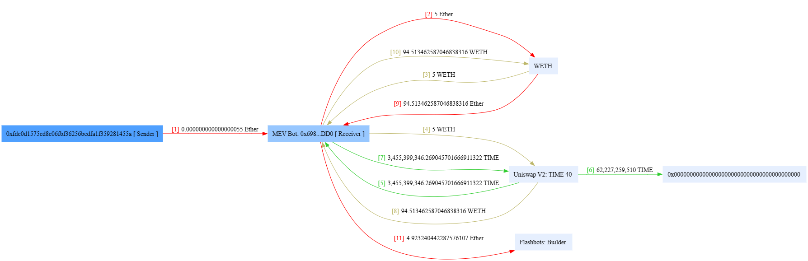
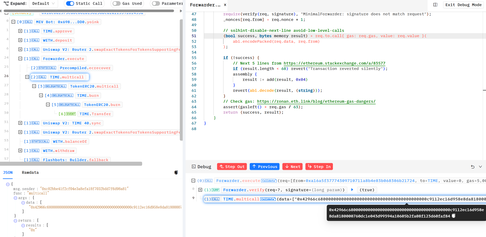
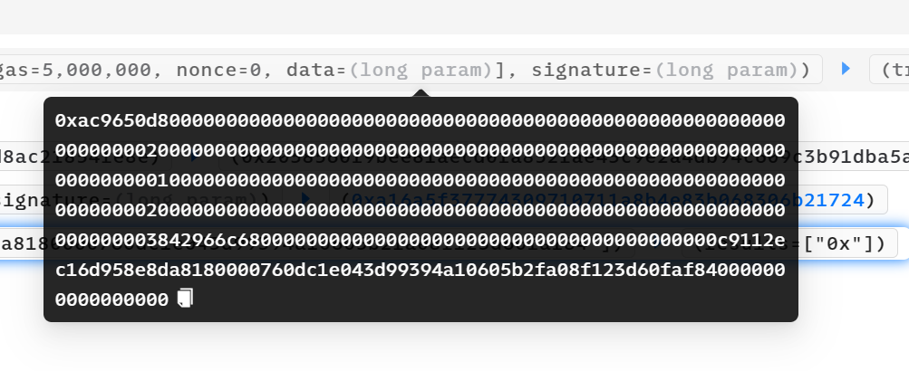
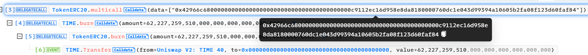
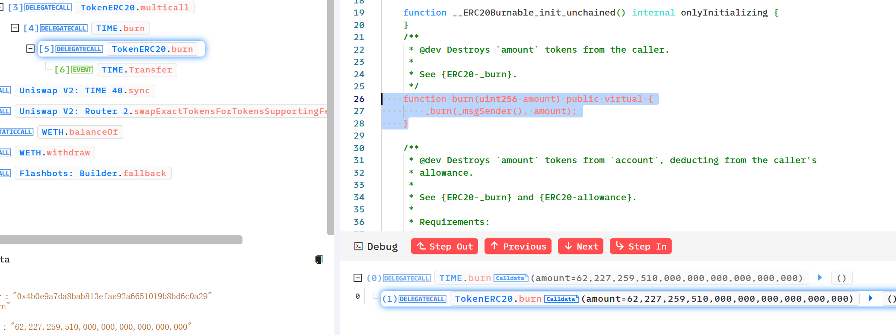

# 奇安信攻防社区-ERC2771 Multicall任意地址欺骗攻击分析

### ERC2771 Multicall任意地址欺骗攻击分析

ERC2771 Multicall任意地址欺骗攻击

# ERC2771 Multicall任意地址欺骗攻击分析复现

> 距离这一事件发生不到几天,进行一下漏洞分析和复现。(真是一场大汗淋漓的复现，边复现边发现有新的合约被攻击，有新的黑客和攻击合约出现…..)  
> 2023-12-10 S7iter

### 消息来源：

[X 上的 Scam Sniffer | Web3 Anti-Scam：“After more investigation, there are 515 Thirdweb deployed tokens on the Mainnet affected by the Multicall and ERC-2771 vulnerabilities, 25 of which have been exploited. Both HXA and WFCA are listed on exchanges and the prices have dropped a lot. https://t.co/3VnSWtNtio” / X (twitter.com)](https://twitter.com/realScamSniffer/status/1733122679803396235)

[X 上的 Phalcon：“Since OZ has publicly disclosed the details of the problematic integration between two specific standards – ERC-2771 and Multicall – we now re-share our analysis of the related exploit. The interesting aspect of this exploit stems from the way the public burn issue was taken… https://t.co/GMHjnn11n9” / X (twitter.com)](https://twitter.com/Phalcon_xyz/status/1732967384774746408)

#### 攻击者地址分析：

只举例最先发生攻击的地址,这一攻击行为后来被其他haker地址争先模仿,涉及到多个链:比如BSC Polyon....

**ETH链：**

[https://etherscan.io/tx/0xecdd111a60debfadc6533de30fb7f55dc5ceed01dfadd30e4a7ebdb416d2f6b6](https://etherscan.io/tx/0xecdd111a60debfadc6533de30fb7f55dc5ceed01dfadd30e4a7ebdb416d2f6b6)

hacker: [https://etherscan.io/address/0xfde0d1575ed8e06fbf36256bcdfa1f359281455a](https://etherscan.io/address/0xfde0d1575ed8e06fbf36256bcdfa1f359281455a)

hacker利用的攻击合约： [https://etherscan.io/address/0x6980a47bee930a4584b09ee79ebe46484fbdbdd0](https://etherscan.io/address/0x6980a47bee930a4584b09ee79ebe46484fbdbdd0)

对攻击合约进行反编译  
[https://library.dedaub.com/decompile?md5=b01e758fad75dad198dfbcc4f2e52e35](https://library.dedaub.com/decompile?md5=b01e758fad75dad198dfbcc4f2e52e35)

**Polygon链：**

[https://polygonscan.com/tx/0x1b0e27f10542996ab2046bc5fb47297bcb1915df5ca79d7f81ccacc83e5fe5e4](https://polygonscan.com/tx/0x1b0e27f10542996ab2046bc5fb47297bcb1915df5ca79d7f81ccacc83e5fe5e4)

hacker:[https://polygonscan.com/address/0x0a4311b6a2e6dbc5b6a1a0c2bd77b3d83f220a1c](https://polygonscan.com/address/0x0a4311b6a2e6dbc5b6a1a0c2bd77b3d83f220a1c)

hacker利用的攻击合约：[https://polygonscan.com/address/0x1a8c8706f51dc21f455ff1b44f5678ede8faabb7](https://polygonscan.com/address/0x1a8c8706f51dc21f455ff1b44f5678ede8faabb7)

对攻击合约进行反编译  
[https://library.dedaub.com/decompile?md5=a572dd9666a813f2d1e82c4e3932af30](https://library.dedaub.com/decompile?md5=a572dd9666a813f2d1e82c4e3932af30)

#### 漏洞产生的平台：

[ERC-2771: Secure Protocol for Native Meta Transactions (ethereum.org)](https://eips.ethereum.org/EIPS/eip-2771)

[Utilities - OpenZeppelin Docs](https://docs.openzeppelin.com/contracts/4.x/api/utils#Multicall)

#### 受到影响的代币：

影响代币很多，比如：

ETH主网：HXA WFCA TIME([https://etherscan.io/tx/0xecdd111a60debfadc6533de30fb7f55dc5ceed01dfadd30e4a7ebdb416d2f6b6](https://etherscan.io/tx/0xecdd111a60debfadc6533de30fb7f55dc5ceed01dfadd30e4a7ebdb416d2f6b6)) NAME([https://etherscan.io/tx/0x4ed1ec3d33c297560ed8f5a782b54d2c52adb20155c543fb64ba9065e45c046c](https://etherscan.io/tx/0x4ed1ec3d33c297560ed8f5a782b54d2c52adb20155c543fb64ba9065e45c046c)) 等

polygon：Swop([https://polygonscan.com/tx/0x1b0e27f10542996ab2046bc5fb47297bcb1915df5ca79d7f81ccacc83e5fe5e4](https://polygonscan.com/tx/0x1b0e27f10542996ab2046bc5fb47297bcb1915df5ca79d7f81ccacc83e5fe5e4)) (hack:[https://polygonscan.com/address/0x0a4311b6a2e6dbc5b6a1a0c2bd77b3d83f220a1c](https://polygonscan.com/address/0x0a4311b6a2e6dbc5b6a1a0c2bd77b3d83f220a1c))  
攻击合约：([https://polygonscan.com/address/0x1a8c8706f51dc21f455ff1b44f5678ede8faabb7](https://polygonscan.com/address/0x1a8c8706f51dc21f455ff1b44f5678ede8faabb7))

[https://polygonscan.com/txs?a=0x5dbc7b840baa9dabcbe9d2492e45d7244b54a2a0](https://polygonscan.com/txs?a=0x5dbc7b840baa9dabcbe9d2492e45d7244b54a2a0)

### 漏洞分析：

#### 链上分析

这里以TIME举例

受攻击合约地址 [Time (TIME) Token Tracker | Etherscan](https://etherscan.io/token/0x4b0e9a7da8bab813efae92a6651019b8bd6c0a29)

hacker: [ERC2771 Exploiter 2 | Address 0xfde0d1575ed8e06fbf36256bcdfa1f359281455a | Etherscan](https://etherscan.io/address/0xfde0d1575ed8e06fbf36256bcdfa1f359281455a)

hacker利用的攻击合约： [MEV Bot: 0x698...DD0 | Address 0x6980a47bee930a4584b09ee79ebe46484fbdbdd0 | Etherscan](https://etherscan.io/address/0x6980a47bee930a4584b09ee79ebe46484fbdbdd0)

Phalcon可视分析：

[https://explorer.phalcon.xyz/tx/eth/0x4ed1ec3d33c297560ed8f5a782b54d2c52adb20155c543fb64ba9065e45c046c](https://explorer.phalcon.xyz/tx/eth/0x4ed1ec3d33c297560ed8f5a782b54d2c52adb20155c543fb64ba9065e45c046c)



更加详细：[https://www.metasleuth.io/result/eth/0xecdd111a60debfadc6533de30fb7f55dc5ceed01dfadd30e4a7ebdb416d2f6b6](https://www.metasleuth.io/result/eth/0xecdd111a60debfadc6533de30fb7f55dc5ceed01dfadd30e4a7ebdb416d2f6b6)

黑客的动作可以分为以下：

一：0xfde0d1575ed8e06fbf36256bcdfa1f359281455a 花费了55Wei部署了MEVbot(攻击合约)，然后攻击合约用5个ETH兑换出来了5个WETH

二：用这5个WETH通过Uniswap兑换出来345,539,9346个Time币

三：然后调用execute 函数，构造恶意的 data 去调用代币合约的 multicall 函数



代币合约会根据攻击者传入的恶意 data 去 delegateCall 执行代币合约的 burn 函数，燃烧掉池子地址中的 62,227,259,510 个 Time 币(就是所谓的将代币打入0x00中)

四：然后导致代币价格瞬间上涨，随后黑客通过uniswap卖出3,455,399,346个Time币，获得大约94个WETH,然后兑换为大约94个ETH。(Mevbot这一操作过程给Flashbots大约5个Eth,使其保证交易快速稳定)。

#### 漏洞代码原理分析

Forward.sol:

```js
function execute(ForwardRequest calldata req, bytes calldata signature)  
        public  
        payable  
        returns (bool, bytes memory)  
    {  
        require(verify(req, signature), "MinimalForwarder: signature does not match request");  
        \_nonces\[req.from\] = req.nonce + 1;  

        // solhint-disable-next-line avoid-low-level-calls  
        (bool success, bytes memory result) = req.to.call{ gas: req.gas, value: req.value }(  
            abi.encodePacked(req.data, req.from)  
        );
```

execute 函数中，验证 req.from 的签名过后会用 call 交互 req.to（代币地址）。其中攻击者传入的 req.data 为

 0xac9650d8000000000000000000000000000000000000000000000000000000000000002000000000000000000000000000000000000000000000000000000000000000010000000000000000000000000000000000000000000000000000000000000020000000000000000000000000000000000000000000000000000000000000003842966c680000000000000000000000000000000000000000c9112ec16d958e8da8180000760dc1e043d99394a10605b2fa08f123d60faf840000000000000000

因为 0xac9650d8 为 multicall 函数的函数签名，故会调用代币合约的 multicall 函数，并且multicall 函数传入的 data 值为:

0x42966c680000000000000000000000000000000000000000c9112ec16d958e8da8180000760dc1e043d99394a10605b2fa08f123d60faf84

所以传入的data就是

```js
0xac9650d8
0000000000000000000000000000000000000000000000000000000000000020
0000000000000000000000000000000000000000000000000000000000000001
0000000000000000000000000000000000000000000000000000000000000020
0000000000000000000000000000000000000000000000000000000000000038
0x42966c680000000000000000000000000000000000000000c9112ec16d958e8da8180000760dc1e043d99394a10605b2fa08f123d60faf84
```

> 为什么传入 multicall 函数的 data 值中没有 req.from 呢？这是因为 EVM 底层处理 call 调用时会根据其中的偏移量而截断所需要的值，而攻击者传入的 calldata 值中设定偏移量是 38，数值长度为 1，所以刚好截取出来的 data 值是42966c680000000000000000000000000000000000000000c9112ec16d958e8da8180000760dc1e043d99394a10605b2fa08f123d60faf84  
> 具体可以参考 [(evm.codes)](https://www.evm.codes/?fork=shanghai)

因为0x42966c68为 burn 函数的函数签名,所以会根据攻击者构造的 data 值去 delegatecall 调用代币合约的 burn 函数。

MulticallUpgradeable.sol

```js
    function multicall(bytes\[\] calldata data) external virtual returns (bytes\[\] memory results) {  
        results = new bytes\[\](data.length);  
        for (uint256 i = 0; i < data.length; i++) {  
            results\[i\] = \_functionDelegateCall(address(this), data\[i\]);  
        }  
        return results;  
    }  
\--------------------------------------------------------------------------------------------------------------------------------  
    function \_functionDelegateCall(address target, bytes memory data) private returns (bytes memory) {  
        require(AddressUpgradeable.isContract(target), "Address: delegate call to non-contract");  

        // solhint-disable-next-line avoid-low-level-calls  
        (bool success, bytes memory returndata) = target.delegatecall(data);  
        return AddressUpgradeable.verifyCallResult(success, returndata, "Address: low-level delegate call failed");  
    }
```



其中 \_msgSender() 函数被 ERC-2771 库重写。(因为目前代码已经修改了,所以去调用NAME的来看)

我们来看下[ERC-2771: Secure Protocol for Native Meta Transactions (ethereum.org)](https://eips.ethereum.org/EIPS/eip-2771)

可以找到

```js
function \_msgSender() internal view returns (address payable signer) {  
        signer = msg.sender;  
        if (msg.data.length>=20 && isTrustedForwarder(signer)) {  
            assembly {  
                signer := shr(96,calldataload(sub(calldatasize(),20)))  
            }  
        }
```

所以最终\_msgSender() 返回的值为传入的 calldata 的最后 20 个字节“0x760dc1e043d99394a10605b2fa08f123d60faf84”

0x760dc1e043d99394a10605b2fa08f123d60faf84[Uniswap V2: TIME 40 | Address 0x760dc1e043d99394a10605b2fa08f123d60faf84 | Etherscan](https://etherscan.io/address/0x760dc1e043d99394a10605b2fa08f123d60faf84)为池子地址。

### 漏洞复现

可以利用黑客攻击合约自己部署在测试网进行测试,或者直接fork主网进行复现。

### 参考：

[ERC-2771: Secure Protocol for Native Meta Transactions (ethereum.org)](https://eips.ethereum.org/EIPS/eip-2771)

[Security Vulnerability Incident Report 12/8 --- 安全漏洞事件报告 12/8 (thirdweb.com)](https://blog.thirdweb.com/vulnerability-report/)

[Smart contract security vulnerability 12/4 (thirdweb.com)](https://blog.thirdweb.com/security-vulnerability/)

[Arbitrary Address Spoofing Attack: ERC2771Context Multicall Public Disclosure --- 任意地址欺骗攻击：ERC2771Context Multicall 公开披露 (openzeppelin.com)](https://blog.openzeppelin.com/arbitrary-address-spoofing-vulnerability-erc2771context-multicall-public-disclosure)
