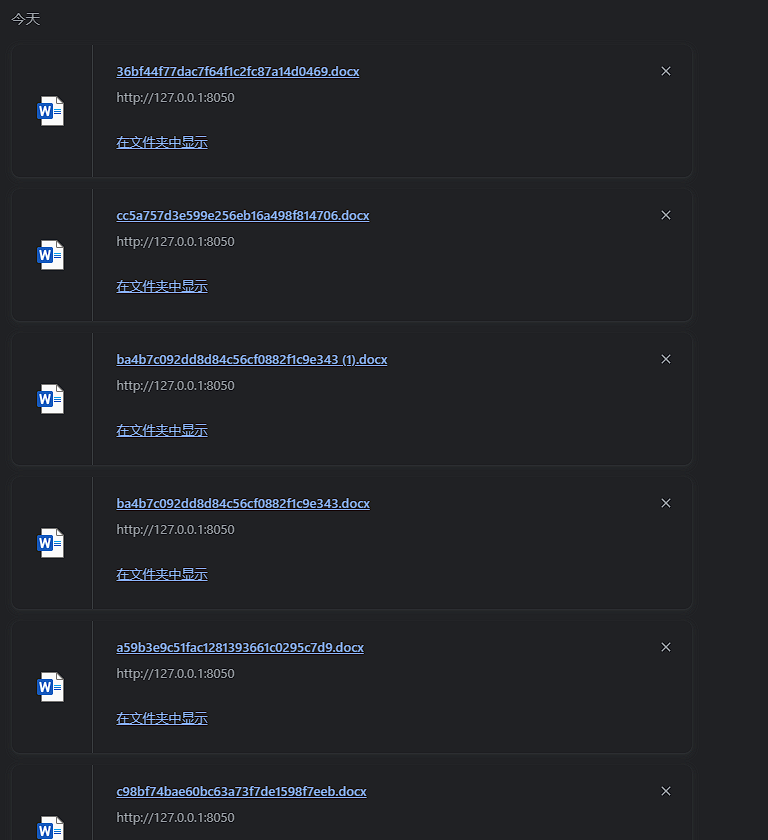

# 奇安信攻防社区-I DOC VIEW前台RCE分析

### I DOC VIEW前台RCE分析

I DOC VIEW是一个在线的文档查看器，其中的/html/2word接口因为处理不当，导致可以远程读取任意文件，通过这个接口导致服务器下载恶意的JSP进行解析，从而RCE。

I DOC VIEW是一个在线的文档查看器，其中的`/html/2word`接口因为处理不当，导致可以远程读取任意文件，通过这个接口导致服务器下载恶意的JSP进行解析，从而RCE。

## 漏洞影响版本

`20231115`之前版本

## 源码分析

先定位到问题接口：

接口里面就一个方法`toWord`，那么就来看看它做了什么：

前面的内容不是特别紧要，这里有一个去爬取页面的方法，也是唯一使用了`url`参数的地方：

这里使用了`getPage`方法来处理`obj`，而`obj`又是`url`来的`URL`对象，但是疑惑的时文件名只能是`index.html`所以去看一下这个`getWebPage`方法：

其实到上面这里还好，都是一些写文件的操作，并且写的也是`index.html`但是下面做的操作就是本此漏洞的关键了，软件本意应该是想做一个比较完善的爬虫，所以接下会调用`GrabUtility.searchForNewFilesToGrab`方法继续解析文件内容，这里的`conn`也就是刚才创建的链接：

进入到`GrabUtility.searchForNewFilesToGrab`查看，发现其中的内容就是解析响应值，其中获取`link[href]`、`script[src]`、`img[src]`标签对应的内容然后存进`GrabUtility`的成员变量`filesToGrab`中：

然后就到了触发漏洞的操作了，这里读取了`filesToGrab`的`size`然后开始尝试挨个链接下载了，这里调用了`GetWebPage`重载方法，目录还是原来的目录，文件名时自动解析的文件名：

这就好办了，因为程序中只对后缀做了过滤，所以只要我们不是它黑名单的后缀然后再配合`目录穿越`就行了，然后黑名单是`html`、`htm`、`php`、`asp`、`aspx`和`net`，但是没有`jsp`，所以只需要写个`jsp`的?就可以了。

这里需要注意的是，因为截取`/`后的内容作为文件名，所以不能使用`/`进行目录穿越，但是系统是`windows`上的，所以就可以使用`\`来代替。

那么利用流程就是：首先启动恶意服务器，将服务器的`index.html`中放入一个`href`、`img`或者`script`定向到`jsp`马就行了！（这也印证了通告中的`诱导`下载危险文件）

## 复现

我已经写了一键Poc：[https://github.com/springkill/idocv\_poc](https://github.com/springkill/idocv_poc)  
分步复现手法如下：  
构造页面：

`python`启动简易`http`，访问！

然后被杀（谢谢你火绒：

关了火绒（因为服务貌似会有缓存，所以需要换个端口）：

测试：

当然最后不要忘记打开火绒哦。

## 结语

文件操作是十分敏感的操作，尤其是向服务器中下载文件，同时下载的文件最好也有固定的目录存放并防止目录穿越，开发者已经想到了下载文件的风险，但是却没有将对策做好，导致了本次漏洞。

## 彩蛋

天知道我试了多少次……

