# 奇安信攻防社区-Java代码审计初试

### Java代码审计初试

本文为Java代码审计入门的一篇文章，学习SSM框架的开源代码审计

## 审计环境

```js
jdk 7u80 
Tomcat 7 
Maven 3.6.3
```

下载源码后，导入数据库，IDEA导入项目，并修改数据库配置信息

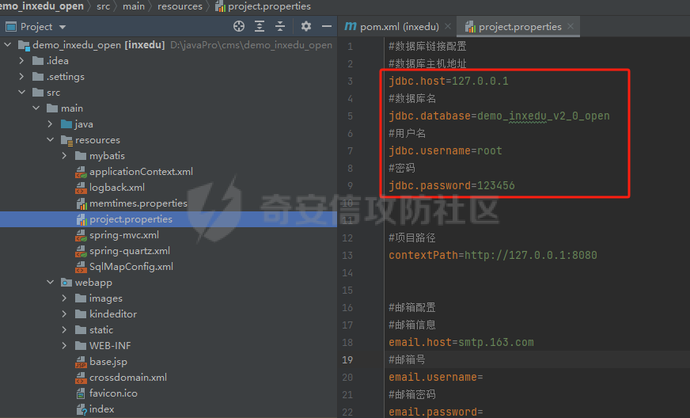

配置Tomcat运行，即可访问系统


## 结构分析

开始审计前，先看看网站文件和结构

-   src/main/java：存放java代码的目录
-   src/main/resources：存放资源的目录，包括properties、spring、springmvc、mybatis等配置文件
-   src/main/webapp：存放网站的JSP、html、xml等web应用源代码  
    可以看出是一个SSM架构（即Spring+Spring MVC+MyBatis）

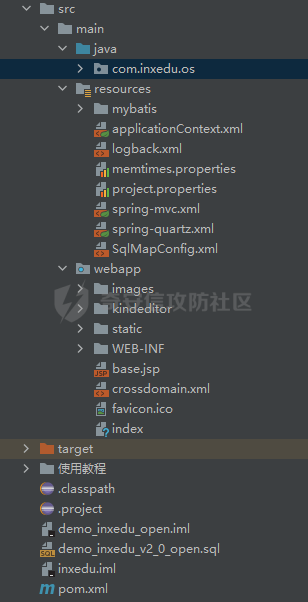  
然后看一下几个文件：

-   pom.xml：Maven的主要配置文件。在这个文件中，可以看到当前项目用了哪些组件以及组件的版本，如果使用了存在漏洞的组件版本，可以快速发现。
-   web.xml：Tomcat启动时会自动加载web.xml中的配置，文件中配置了Filter、Listener、Servlet。主要关注Filter过滤器，查看网站的过滤措施。
-   applicationContext.xml：Spring的全局配置文件。其中也会包含对其他的配置文件的引用。
-   spring-mvc.xml：其中会有静态资源映射、拦截器配置、文件上传限制等配置

### pom.xml

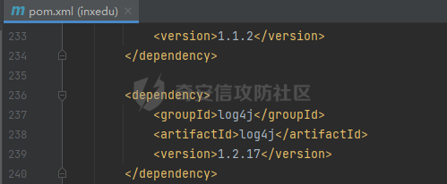  
搜索发现该版本log4j存在CVE-2019-17571反序列化漏洞，寻找漏洞处触发点，搜索SocketNode类，发现项目中没有调用。  
所以即使项目使用了存在漏洞版本的组件，也不代表就一定存在相应漏洞

### web.xml

只配置了两个filter过滤器，一个是配置了对字符进行编码，另一个是使页面具有统一布局，没有看到对XSS和sql注入的过滤器。  
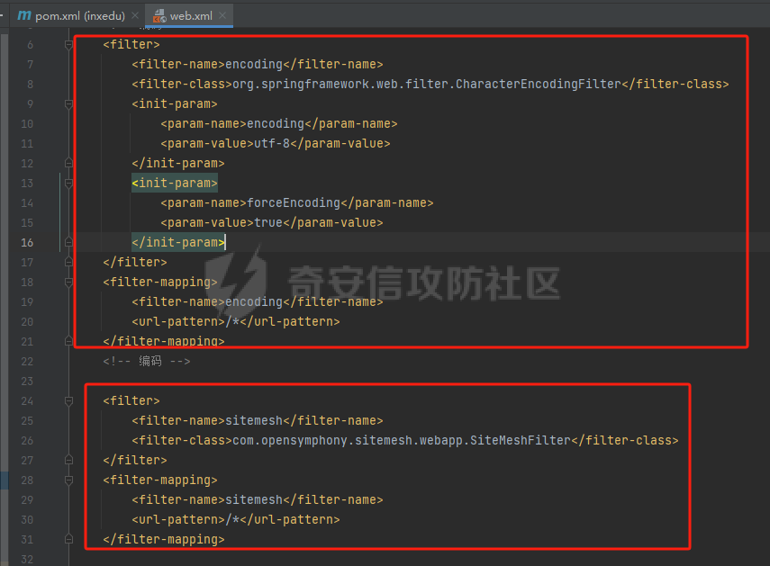

### applicationContext.xml

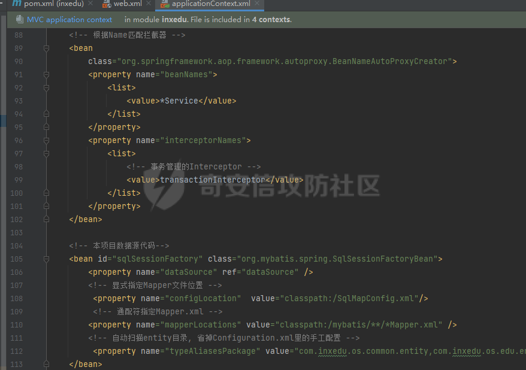

### spring-mvc.xml

配置了拦截的路径、上传文件的大小  
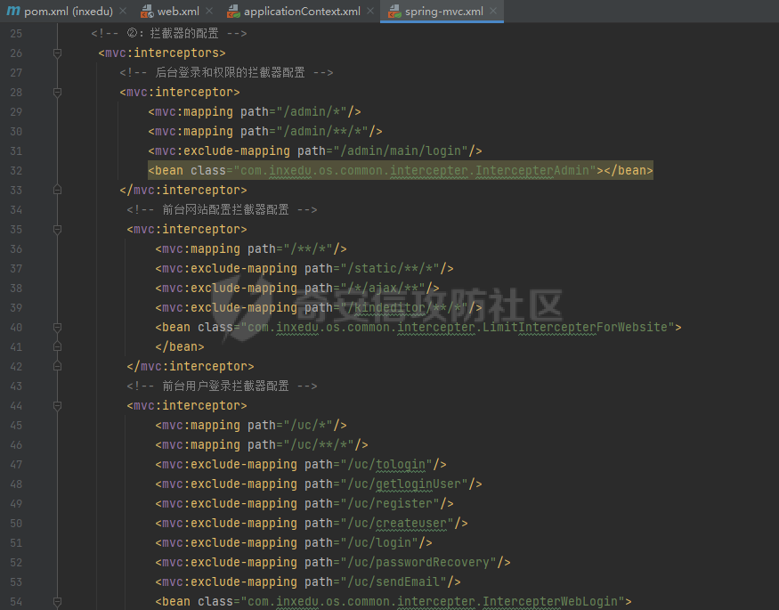

## 源码审计

### SQL注入审计

已经知道项目使用的是Mybatis，所以SQL语句会有两种定义方式，一个是使用注解的方式，一个是在Mapper.xm文件中编写。

参数拼接也有两种常用的方式，即${}和#{}，#{}是采用预编译的方式，${}是采用简单的拼接。

然后Mybatis框架下易产生SQL注入漏洞的情况主要分为三种，like、 in和 order by 语句。

所以根据以上信息，在xml文件中搜索${（当然也可以去搜索这些语句来寻找审计参数是否可控）

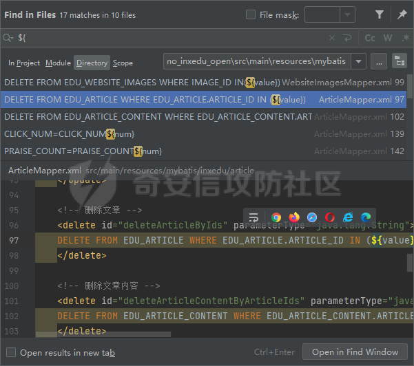

### 后台SQL注入

在ArticleMapper.xml中，发现存在用 in 语句并使用${}方式传参

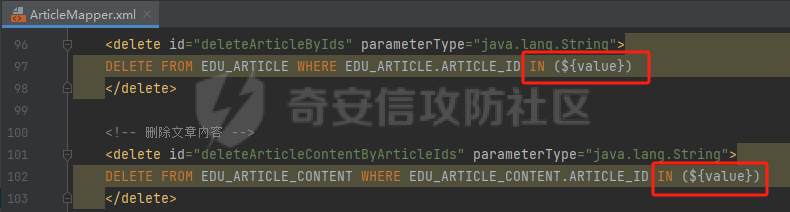

然后找到该mapper对应的实现类  
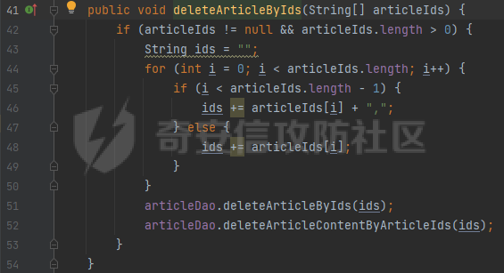

然后找到类调用的地方，确定请求路径和传参方式，请求路径为/admin/article/delete，参数是通过articelId传入  
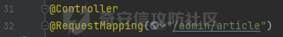

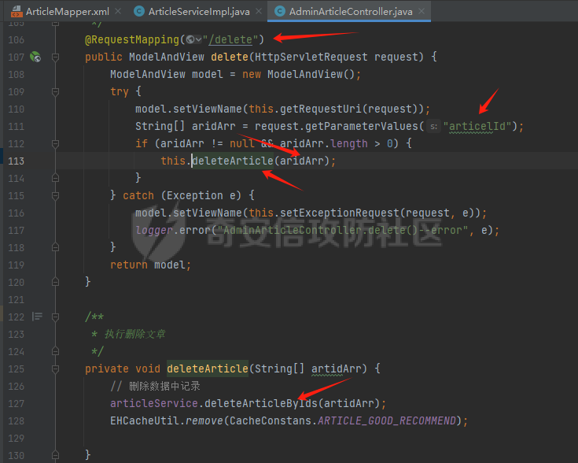

#### 漏洞验证

`/admin/article/delete?articelId=1`  
sqlmap跑一下  
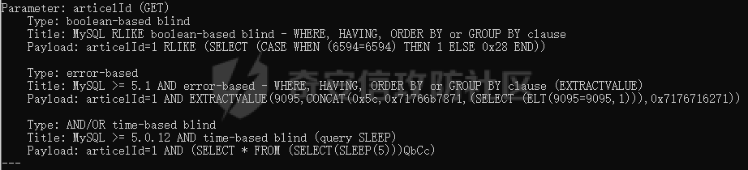

### 前台SQL注入

同样在CourseFavoritesMapper.xml中找到${}传参语句  
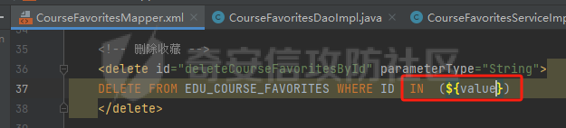

然后找到调用该mapper的地方  
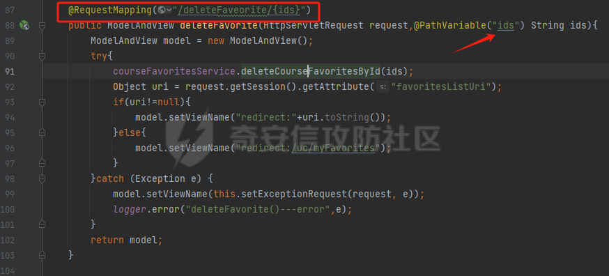

路径为/uc/deleteFaveorite/{ids}，{ids}直接输入参数即可，格式如图  
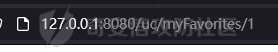

#### 漏洞验证：

前台登录后抓包，放到sqlmap跑一下  
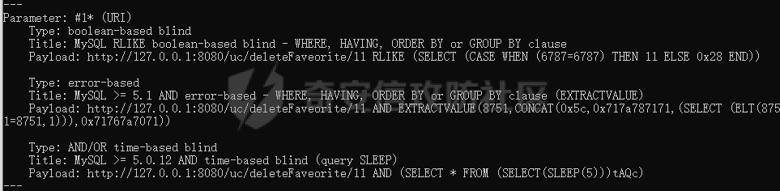

其他还有几处也存在sql注入，漏洞成因都差不多，这里就不多写了。

### XSS审计

审计XSS要点是定位用户的输入输出，梳理数据交互以及前端展示的过程。找到一个对应的输入输出的地方后，根据现有的安全措施（编码、过滤器）判断是否存在绕过的可能。

在结构分析时，已经知道web.xml中并没有发现对xss的过滤，接下来就需要分析在代码中是否存在过滤。

首先看看插入过程中是否存在过滤

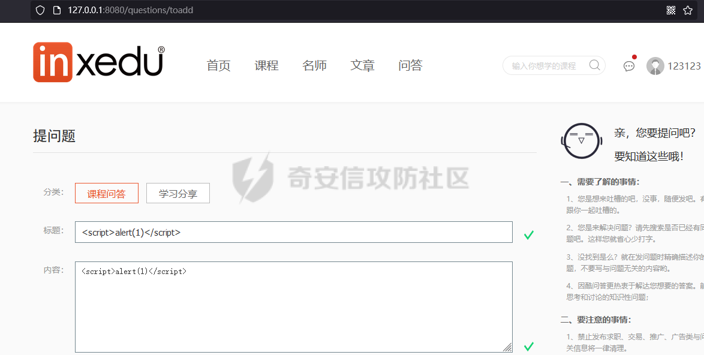

抓包查看路由请求  
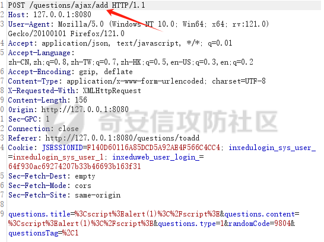

全局搜索路由关键字，定位到控制器QuestionsController.java

addQuestions()方法，接收的传参的为Questions类，然后判断用户是否登录，然后调用了sevice层中的addQuestions()方法  
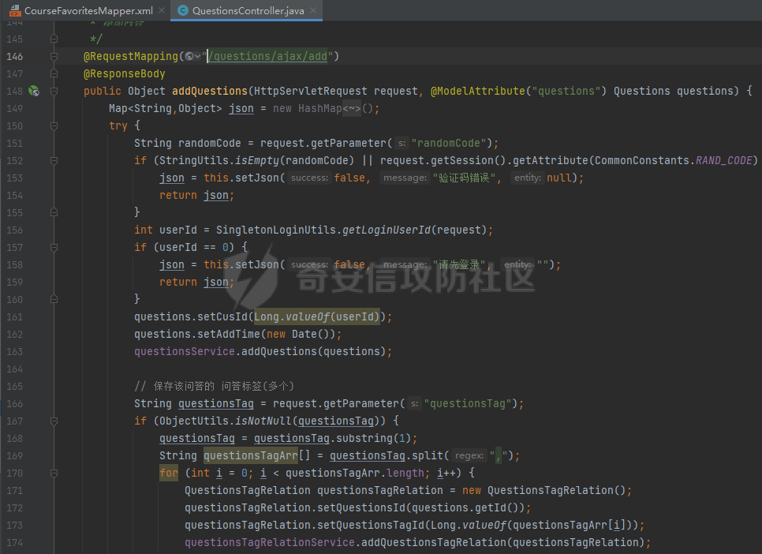

查看Questions类的属性中有哪些是String类型的，可以在这些属性中插入XSS语句  
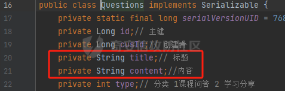

查看它的实现类，调用questionsDao的addQuestions()方法  
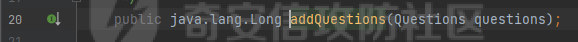

跟进addQuestions()方法，是一个Service  
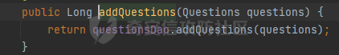

继续跟进，调用insert插入数据库中  
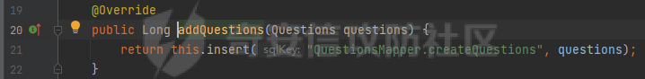

根据insert中的信息找到对应的Mapper查看，将数据插入到edu\_question表中  
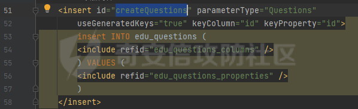  
在整个插入数据的过程中，都没有对数据进行过滤

接着看输出部分，访问问答页面时触发XSS  
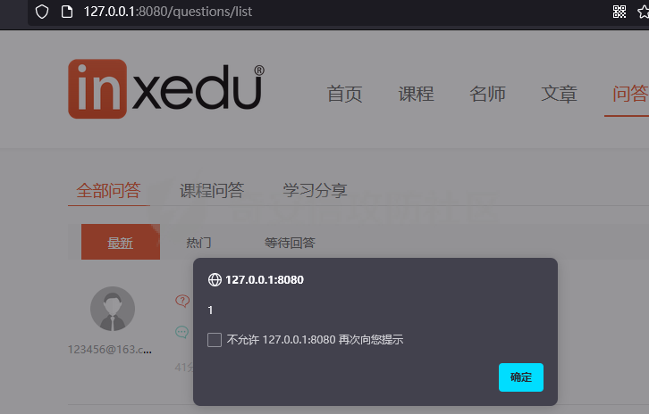

根据路由questions/list定位到jsp文件  
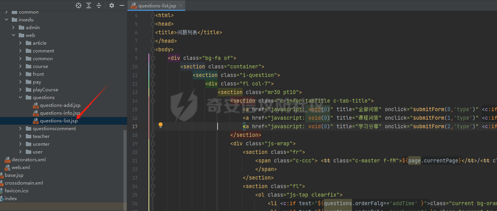

搜索.title、.content  
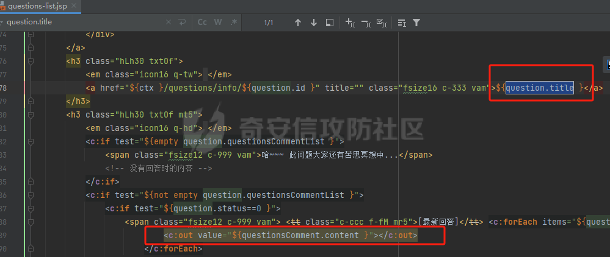

发现标题处直接拼接数据库中的值输出，而内容处使用了<c:out>标签包裹，<c:out>标签是直接对代码进行输出而不当成js代码执行。所以标题处存在XSS，内容处不存在。

### 文件上传

全局搜索upload、uploadfile等寻找上传功能点  
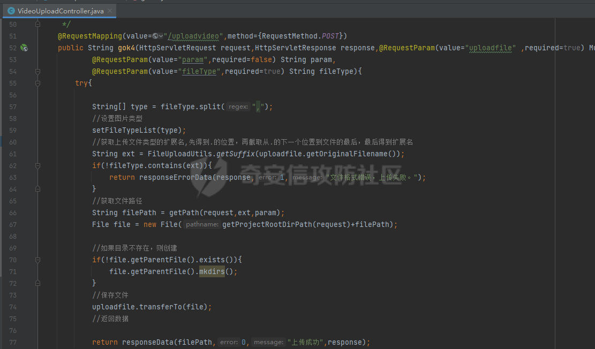

fileType从逗号处分割，存入type中，后续与上传文件后缀对比。  
如果fileType中包含了ext则返回true，然后用取反，所以fileType中必须要包含ext，否则直接返回错误。随后获取文件路径，进行文件上传。

这里注意fileType是从请求中传入参数获取的，所以在上传时，只要在fileType传入jsp、jspx，就可以成功上传  
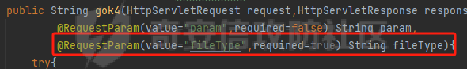

#### 漏洞验证：

构造上传数据包，成功上传  
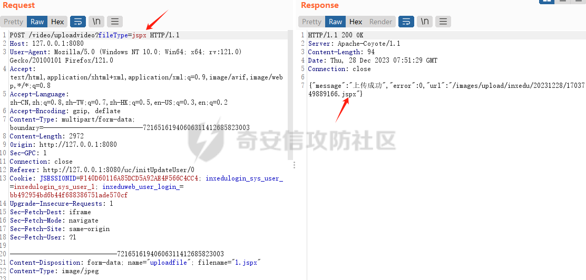

连接webshell  
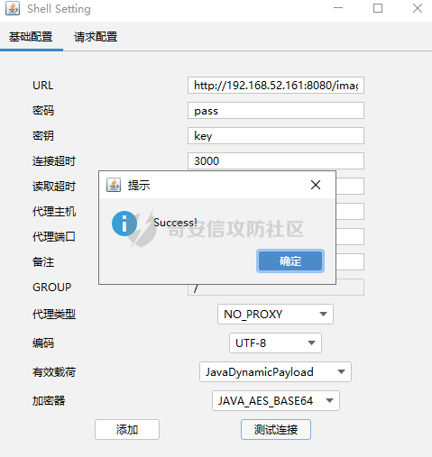

### 越权漏洞

注册账号进入用户中心，点击更改个人信息抓包发现userid，可能存在越权漏洞  
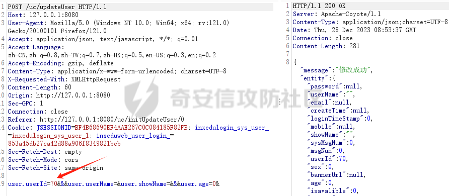

在项目中全局搜索/updateUser，找到UserController  
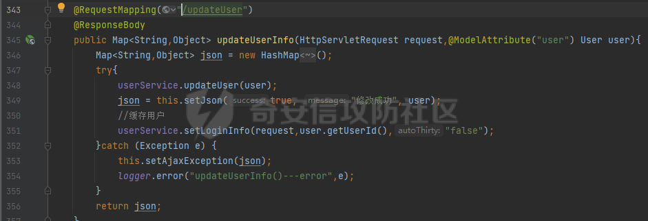

直接调用了userService的updateUser接口  
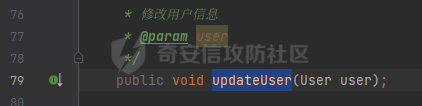

进入接口实现类  
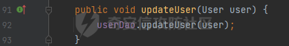

继续跟进，最终跟到UserDaoImpl的updateUser方法  
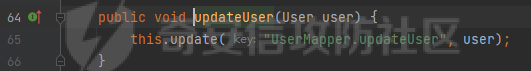

直接引用UserMapper的updateUser进行更新  
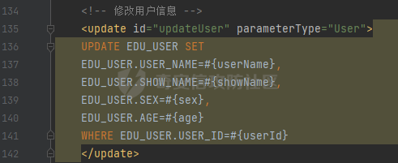

整个流程没有任何的权限校验，没有判断 userId 与当前用户的关系，所以只要修改为其他用户id，就可以修改其他的用户信息

#### 漏洞验证

注册两个账号

第一个账号test1  
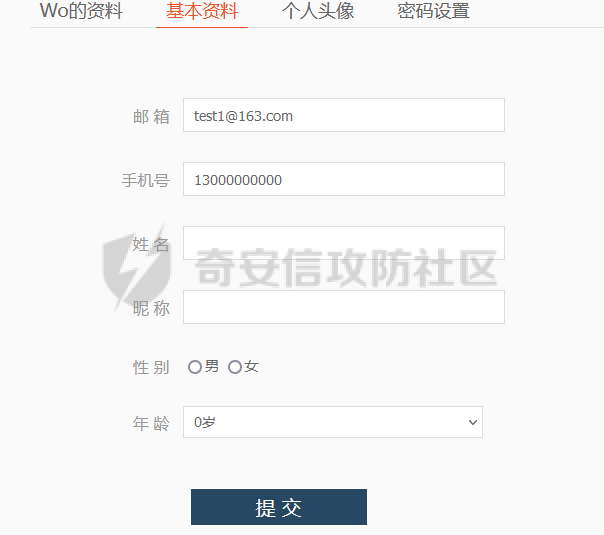

用户id为70  
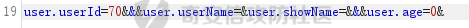

第二个账号test2  
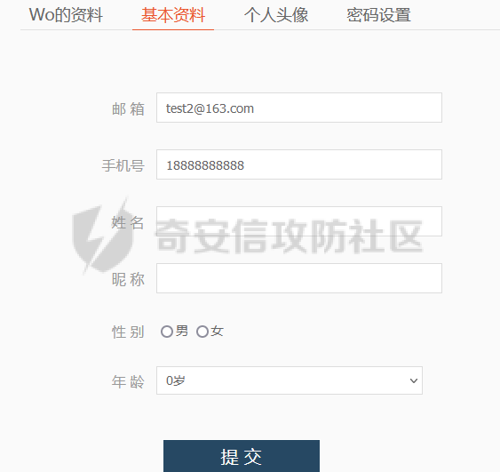

用户id为71  


在登录test2的情况下，抓包修改userId为70，并修改userName  
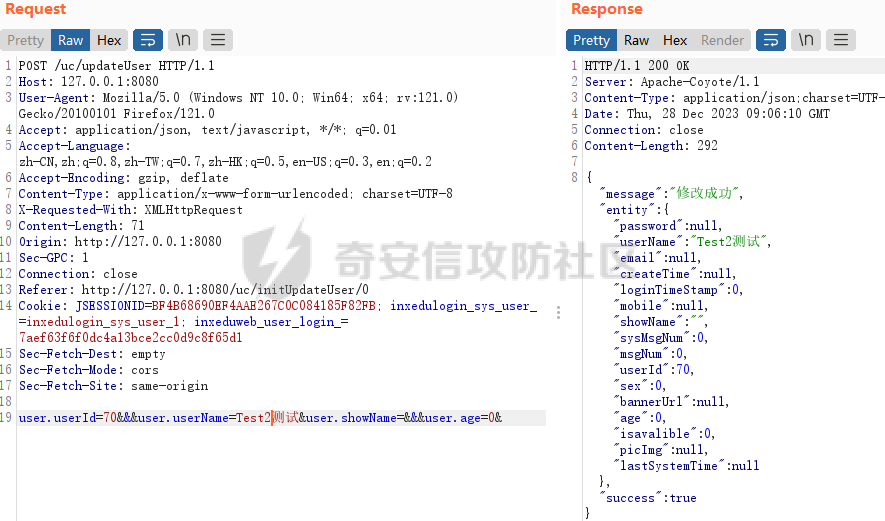

然后登录test1账号，发现个人信息被修改  
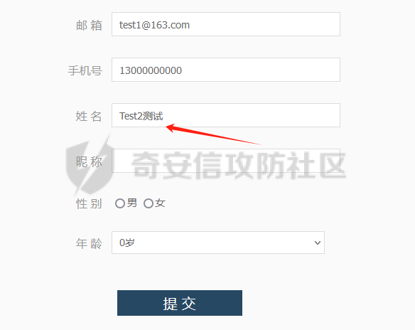

## 总结

本文涉及漏洞有限，审计漏洞也不够全面，主要是学习SSM框架的代码审计过程记录，在审计中意识到某些漏洞单纯通过白盒的方式难以发现，所以想要让审计更加全面，还需黑白结合的方式。
