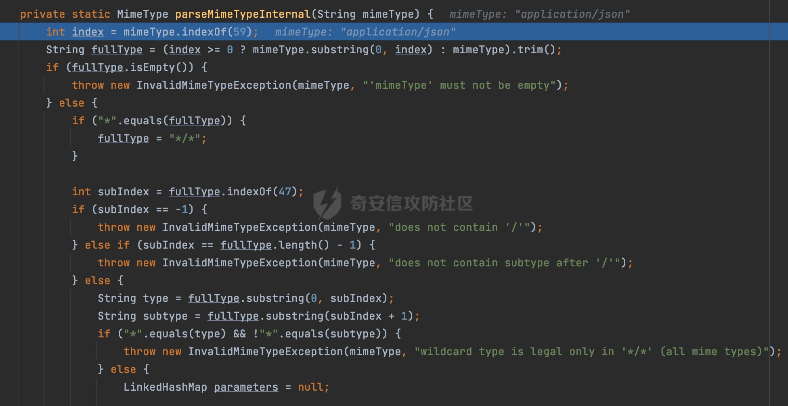

# 奇安信攻防社区-SpringMVC参数处理过程与Content-type绕过浅析

### SpringMVC参数处理过程与Content-type绕过浅析

在Spring Web应用中，通过自定义过滤器（Filter）来进行输入验证和过滤是一种常见的做法。尤其是对于一些存在sql注入、xss的web应用，在实现时经常会通过request.getParamaters()方法获取对应的请求内容进行验证/拦截，解类似的安全风险。但是这里并不能覆盖类似json等请求方式。此时一般会通过请求的 Content-Type 头来区分不同类型的请求来获取对应的请求内容。在某些情况下可以绕过对应的检测逻辑。

# 0x00 前言

因为用户的输入是不可信的。若没有对用户输入长度、特殊字符，大小写等进行限制，当用户输入携带恶意攻击字符，系统取出并输出到特定页面或拼接到SQL查询语句时，可能触发安全风险（例如 XSS 或二次 SQL 注入等）。在Spring Web应用中，通过自定义过滤器（Filter）来进行输入验证和过滤是一种常见的做法。尤其是对于一些存在sql注入、xss的web应用，通过过滤器来验证/拦截请求参数来缓解类似的安全风险是很常见的做法。

在过滤器filter中，经常会通过request.getParamaters()方法获取对应的请求内容进行处理，但是这里并不能覆盖类似json等请求方式。此时一般会通过请求的 Content-Type 头来区分不同类型的请求，从而选择适当的方法获取请求体内容，例如下面的例子,通过 Content-Type 头判断是否是JSON请求，然后在getJsonParam方法中通过getInputStream()方法来获取请求body：

```Java
String contentType = request.getContentType();
String paramJson = "";
if ("application/json".equals(contentType)) {
    paramJson = this.getJsonParam((HttpServletRequest) servletRequest);
}
```

在HTTP请求中，Content-type是一个重要的头部信息。它用于指定请求的媒体类型，例如 application/json、application/xml等。在SpringMVC中，Content-type的作用是告诉框架如何解析请求的参数。

结合上面的例子，实际上简单的判断`"application/json".equals(contentType)`只需要在请求时将 Content-Type 头设置为`application/json;`即可绕过对应的检测逻辑了。下面看看SpringMVC在参数处理过程中是如何对Content-type进行处理的，看看有没有更多的绕过方法。


# 0x01 Content-type与参数解析过程

下面以5.3.26版本为例，简单分析下SpringWeb在请求处理中，是如何对Content-type的识别与处理的。

当Spring MVC接收到请求时，Servlet容器会调用DispatcherServlet的service方法（方法的实现在其父类FrameworkServlet中定义），首先会获取request请求的类型，除了PATCH方法以外都会通过HttpServlet的service方法进行处理：


实际上根据不同的请求方法，会调用processRequest方法进行处理，例如GET请求会调用doGet方法：


一般情况下类似application/json、application/xml等格式的请求一般都会通过POST方法进行请求，以doPost方法为例。在执行doService方法后，继而调用doDispatch方法处理，首先会对Multipart请求进行处理，然后获取对应的mappedHandler，其实就是获取到url 和 Handler 映射关系，然后就可以根据请求的uri来找到对应的Controller和method，处理和响应请求：


在checkMultipart方法中，若multipartResolver不为null，会对multipart类型的请求进行解析：


这里multipartResolver的isMultipart方法会通过 Content-Type 头判断当前请求是否是Multipart请求。在SpringMVC中，主要涉及两个multipartResolver：

-   StandardServletMultipartResolver（Springboot默认情况下使用）


如果strictServletCompliance属性为true，那么Content-Type头的值必须以`multipart/form-data`开头。否则只要以"multipart/"开头就认为是Multipart请求：

```Java
public boolean isMultipart(HttpServletRequest request) {
    return StringUtils.startsWithIgnoreCase(request.getContentType(), this.strictServletCompliance ? "multipart/form-data" : "multipart/");
}
```

-   CommonsMultipartResolver（主要是基于Apache commons fileupload库）

```Java
public boolean isMultipart(HttpServletRequest request) {
    return this.supportedMethods != null ? this.supportedMethods.contains(request.getMethod()) && FileUploadBase.isMultipartContent(new ServletRequestContext(request)) : ServletFileUpload.isMultipartContent(request);
}
```

如果`supportedMethods`属性不为null且支持当前请求的HTTP方法，就调用`FileUploadBase.isMultipartContent`进行判断，否则则调用`ServletFileUpload.isMultipartContent`进行判断，实际上两者都调用的是org.apache.commons.fileupload.FileUploadBase#isMultipartContent：


在org.apache.commons.fileupload.FileUploadBase#isMultipartContent中，如果Content-Type头为null，直接返回`false`，表示不是Multipart请求。如果Content-Type头不为null，将其转换为小写，若以`multipart/`开头，就认为是Multipart请求:


调用 MultipartResolver 的 resolveMultipart() 方法对请求的数据进行解析并将解析结果封装到中HttpServletRequest后，进行进一步的处理。再往后在参数解析时，会使用参数解析器进行解析，首先检查是否有合适的参数解析器支持当前参数，如果不支持则抛出异常。实际调用了getArgumentResolver进行处理。具体的处理过程可见[https://forum.butian.net/share/2372。](https://forum.butian.net/share/2372%E3%80%82)

在getArgumentResolver中，如果缓存中不存在适用的解析器，则遍历已配置的解析器列表。对于每个解析器，它会调用supportsParameter方法来判断是否支持给定的参数类型。如果找到了支持的解析器，则将其缓存，并返回该解析器。

以`application/json`请求为例，最后会通过RequestResponseBodyMethodProcessor解析器进行处理，看看是否对Content-type进行了识别与处理。

在org.springframework.web.servlet.mvc.method.annotation.RequestResponseBodyMethodProcessor#readWithMessageConverters方法中，通过消息转换器（Message Converters）从HTTP请求中读取请求体的方法，通常在处理Spring MVC控制器中带有`@RequestBody`注解的方法时被调用，这里调用另一个重载的`readWithMessageConverters`方法，传递`ServletServerHttpRequest`、`MethodParameter`和`Type`作为参数。这个方法是用于实际的请求体读取和消息转换的核心方法：


在这里可以看到对Content-Type 头内容进行了读取：


查看具体获取方法，这里主要是检查和修复Content-Type头，以确保它包含媒体类型和字符集信息，使得后续的处理能够更准确地解析请求内容。例如这里会检查Content-Type的字符集： 如果Content-Type不为null，但其字符集为null，尝试从原始HttpServletRequest中获取字符集信息。例如`application/json`最后会被处理成`application/json;charset=UTF-8`：


在读取Content-Type头的逻辑中，这里也进行了一定的处理：


最终调用的是org.springframework.util.MimeTypeUtils#parseMimeTypeInternal进行处理,这里主要是将一个MIME类型的字符串解析为`MimeType`对象，其中包括媒体类型、子类型和可能的参数：



最终在setContentType时，还限制了对应的内容不能是通配符类型（wildcard type），否则会抛出对应的异常，这应该是一种保护机制,强制用户自己配置MediaType：


获取到Content-type后，通过消息转换器（`HttpMessageConverter`）从HTTP输入消息中读取请求体，并将其转换为方法参数所需的类型：


使用迭代器遍历`this.messageConverters`中注册的所有消息转换器，对于每个消息转换器，检查它是否能够读取目标类型（`targetType`）以及其他相关条件，如上下文类（`contextClass`）和内容类型（`contentType`），一般`application/json`请求默认情况下会通过Jackson2的转换器进行处理：


会使用canRead方法检查是否支持：


通过supportedMediaType可以看到MappingJackson2HttpMessageConverter匹配的Content-Type类型：


以上是SpringWeb在请求处理中，对Content-type的简单识别与处理的过程。

# 0x02 绕过思路

前面提到了，在过滤器filter中，经常会通过request.getParamaters()方法获取对应的请求内容进行处理，但是这里并不能覆盖类似json等请求方式。此时一般会**通过请求的 Content-Type 头来区分不同类型的请求，从而选择适当的方法获取请求体内容，进一步进行安全检查**。那么这里**如果匹配 Content-Type 头的逻辑不够严谨，利用解析差异有可能能绕过对应的防护措施**。

## 2.1 Spring本身对Content-Type内容的限制

之前有师傅分享过，为了避免XXE注入，一些Web应用程序可能使用自定义过滤器来阻止包含"application/xml" Content-Type的请求，为了绕过这些过滤器，我们可以将Content-Type设置为通配符`*/*`：


在SpringWeb中，前面提到，在解析时限制了对应的内容不能是通配符类型（wildcard type），否则会抛出对应的异常，这应该是一种保护机制,强制用户自己配置MediaType：


限制类似`*/*`的Content-Type的请求是无法正常解析的。

同样的，虽然MappingJackson2HttpMessageConverter匹配的类似`application/*+json`的Content-Type类型：


但是实际上会因为对应的限制，无法正常解析：


## 2.2 Multipart绕过

前面提到，在SpringMVC中，当接收到一个multipart请求后，会调用 MultipartResolver的resolveMultipart()方法对请求的数据进行解析并将解析结果封装到中HttpServletRequest。然后进一步进行解析。

很多时候一些安全检测的filter在进行类似SQL注入、XSS的过滤时没有考虑到上述情况，那么就可以尝试将普通的GET/POST转换成Multipart请求，绕过对应的安全检查。这种情况可能研发在编写安全filter的时候就意识到了，

但是很⼤可能整个检测的依据就是：

```Java
if (contentType.contains("multipart/form-data")) {  
//获取对应的参数内容进行sql注入、xss等恶意输入的过滤
......
}
```

根据前面的分析，SpringMVC在请求解析时，主要涉及两个multipartResolver，其判断是否是Multipart请求的方式的逻辑基本都是在忽略大小写或者经过大小写统一后，判断是否是以`multipart/`开头（StandardServletMultipartResolver如果strictServletCompliance属性为true，那么Content-Type头的值必须以"multipart/form-data"开头）。

那么只需要做如下的处理，可能就可以绕过对应的检测逻辑：

-   ⼤写Content-Type的内容
-   Content-Type中multipart/以外内容的删减替换
-   上述两者组合

## 2.3 其他

除了利用Multipart请求转换以外。类似request.getParamaters()方法并不能覆盖类似json等请求方式。此时一般会通过请求的 Content-Type 头来区分不同类型的请求。这里同样也可以尝试修改Content-Type的内容尝试绕过对应的检测逻辑。

根据前面的分析，主要是通过调用org.springframework.util.MimeTypeUtils#parseMimeTypeInternal对请求的Content-type内容进行处理。

首先通过`mimeType.indexOf(';')`找到第一个分号的位置，然后提取出分号之前的部分。并去除首尾的空格：


进行一些基本的检查操作后，找到第一个斜杠的位置，提取出type和subtype：


然后遍历分号后面的参数部分，解析每个参数的名称和值，并构建一个LinkedHashMap来存储参数：


最后在返回MimeType对象时，会统一将type&subtype转换成小写：


也就是说，以`application/json`为例，通过如下的处理，仍可正常解析请求：

-   ⼤写Content-Type的内容


-   加入额外的空格


-   在分号(;)后加入额外的内容


当然也可以组合进行利用，在特定情况下可能就可以绕过对应的检测逻辑。

同理，部分类似某些waf的设计难免也是直接 通过Content-type进⾏检测，同样可以利用类似的思路进行绕过。
