# 奇安信攻防社区-SpringSecurity（Spring-WebFlux）动态配置资源权限绕过风险浅析

### SpringSecurity（Spring-WebFlux）动态配置资源权限绕过风险浅析

在SpringMVC中，使用SpringSecurity时可以通过实现FilterInvocationSecurityMetadataSource接口，在其中加载资源权限。实现动态配置资源权限。Spring MVC基于 Servlet 规范进行处理，而Spring WebFlux依赖于 Reactor 模块。两者在SpringSecurity的使用上还是有区别的。浅谈Spring-WebFlux动态配置资源权限场景在代码审计时需要关注的风险。

# 0x00 前言

前面提到，在SpringMVC中，使用SpringSecurity时可以通过实现FilterInvocationSecurityMetadataSource接口，在其中加载资源权限。实现动态配置资源权限。Spring MVC基于 Servlet 规范进行处理，而Spring WebFlux依赖于 Reactor 模块。两者在SpringSecurity的使用上还是有区别的。（SpringMVC的动态配置资源权限可以参考[https://forum.butian.net/share/2694）](https://forum.butian.net/share/2694%EF%BC%89)

在WebFlux场景下，可以通过`ReactiveAuthorizationManager`接口来实现动态配置资源权限，`ReactiveAuthorizationManager` 接口是用于进行响应式授权决策的关键接口。它允许自定义响应式授权逻辑，以根据请求上下文（如身份验证信息、访问路径等）进行访问决策。通过重写check方法可以获取用户登录时的权限和当前请求路径，如果返回可以访问的标志`Mono.just(new AuthorizationDecision(true))` 则可以访问当前地址，否则无权限访问:

```Java
public class CustomReactiveAuthorizationManager implements ReactiveAuthorizationManager<AuthorizationContext>  {

    @Override
    public Mono<AuthorizationDecision> check(Mono<Authentication> authentication, AuthorizationContext object) {
        // 自定义授权逻辑
        // 根据 authentication 和 resource 进行授权判断
        // 返回 AuthorizationDecision，表示允许或拒绝访问
    }
}
```

最后返回一个 `AuthorizationDecision` 对象表示授权决策。然后将自定义的 `ReactiveAuthorizationManager` 集成到 Spring Security 的配置中，以替换默认的授权逻辑，例如这里`access(customReactiveAuthorizationManager)` 表示对 `/**`路径的访问均通过自定义的 `ReactiveAuthorizationManager` 进行授权判断：

```Java
@EnableWebFluxSecurity
public class SecurityConfig {
    @Autowired
    CustomReactiveAuthorizationManager customReactiveAuthorizationManager;

    @Bean
    public SecurityWebFilterChain securityWebFilterChain(ServerHttpSecurity http) {
        return http
            // 其他配置...
            .authorizeExchange()
                .pathMatchers("/**")
                    .access(customReactiveAuthorizationManager)
                .and()
            .build();
    }
}
```

# 0x01 关键内容

对于动态配置资源权限，在实际审计过程中，主要关注的是还是资源的匹配过程。一般情况下是请求的url的匹配，下面是其中的一些关键内容。

## 1.1 AuthorizationContext

在前面的案例中，`org.springframework.security.web.server.authorization.AuthorizationContext` 是 Spring Security WebFlux 模块中的一个类，用于表示授权上下文。它主要用于在 WebFlux 环境中传递和存储与授权相关的信息。

通过构造方法可以看到，这里包含了请求ServerWebExchange信息。那么可以通过`AuthorizationContext`即可在请求处理的不同阶段传递和存储这些信息，以便后续的授权决策过程中使用：

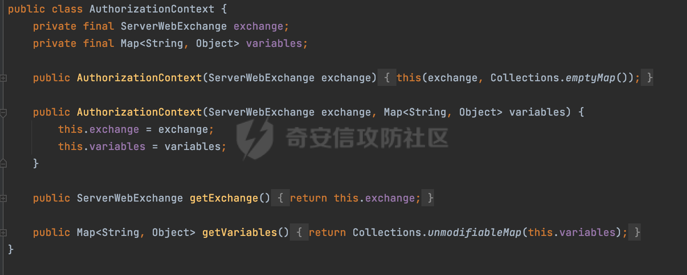

## 1.2 获取请求路径的方式

`ServerWebExchange` 封装了 HTTP 请求和响应的上下文对象。可以通过`AuthorizationContext`的getExchange获取。例如下面的例子，通过getExchange获取当前request，然后再获取到当前请求的路径完成基于URL的鉴权：

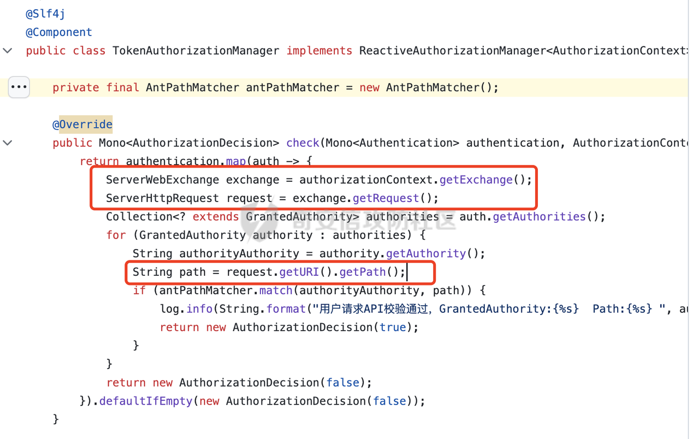

除此以外，还可以通过exchange对象获取当前请求上下文，然后通过如下方法获取请求路径：

```Java
request.getPath().pathWithinApplication().value()
```

两者区别不大，`exchange.getRequest().getURI().getPath()`是会进行URL Decode处理的，但是两者并未进行更多的标准化处理。如果只是简单的使用startwith或者contiain方法进行白名单/黑名单的鉴权处理的话，在某种情况下是存在绕过的可能的。更具体的内容可以参考[https://forum.butian.net/share/2317。](https://forum.butian.net/share/2317%E3%80%82)

# 0x02 潜在的绕过风险

在 Spring Security 中，`HttpFirewall` 接口主要用于处理请求的防火墙策略，以防止潜在的安全风险，比如防止特殊字符的注入等。然而在 Spring WebFlux 中，这个接口并不适用，因为 WebFlux 采用了响应式的编程范式，其请求处理方式与传统的 Servlet API 不同。类似`;`,`//`,`../`这类常见的利用解析差异绕过的符号均不会被拦截。下面看看实际可能存在的安全风险。

## 2.1 路径解析差异绕过

通过关键字在github检索了一下相关WebFlux项目动态资源权限配置的实现，发现很多项目都是通过`org.springframework.util.AntPathMatcher`进行路径匹配的：

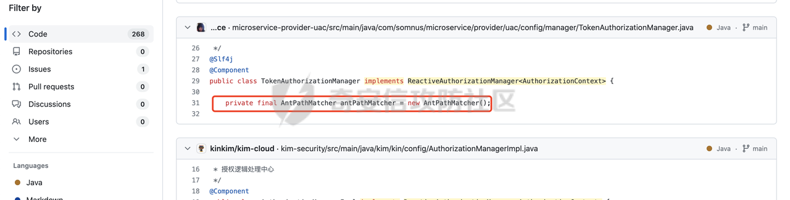

而对于WebFlux来说，其会调用org.springframework.web.reactive.result.condition.PatternsRequestCondition#getMatchingPatterns方法进行相关的匹配，从这里可以看到，首先从exchange对象中获取请求的路径信息并赋值给lookupPath，然后通过PathPattern的方式进行路径匹配：

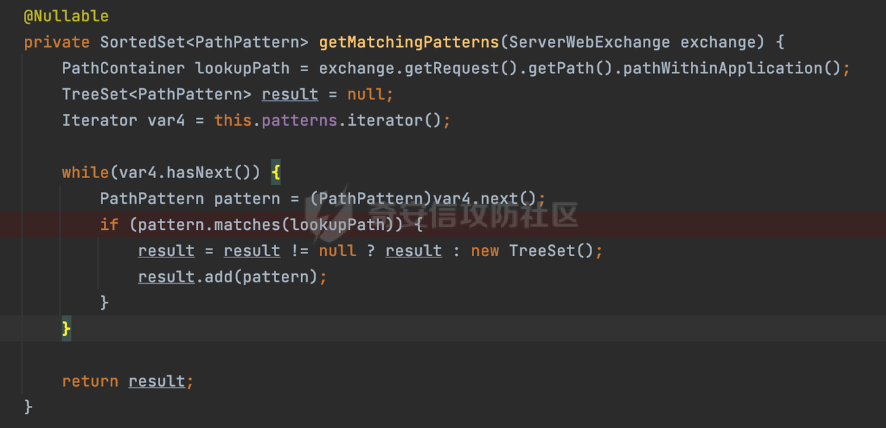

也就是说这里明显存在解析差异的问题。下面简单对比下直接使用`AntPathMatcher`与`PathPatternParser`两者进行路径匹配时的区别，由于缺少了类似`HttpFirewall`的防护，在存在解析差异情况下，在特定逻辑下可能存在绕过的风险。

### 2.1.1 尾部匹配模式

不论是SpringMVC还是SpringWebFlux，实际上都是支持尾部`/`匹配的。但是解析的阶段不一样。

对于SpringMVC来说，当使用AntPathMatcher进行匹配且**TrailingSlashMatch**为true时，会应用尾部的/匹配：

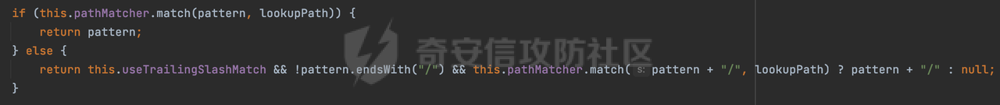

可以看到这里是额外在pattern尾部拼接`/`再进行匹配的。也就是说其实**AntPathMatcher默认情况下并不会匹配尾部额外的/**，例如下面的例子会返回false：

```Java
AntPathMatcher matcher = new AntPathMatcher();
matcher.match("/admin/manage","/admin/manage/");
```

而对于PathPattern匹配模式来说，在匹配时会根据matchOptionalTrailingSeparator（此参数为true时，默认为true）进行一定的处理，如果Pattern尾部没有斜杠，请求路径有尾部斜杠也能成功匹配（类似TrailingSlashMatch的作用），这个是默认嵌套在匹配流程中的：

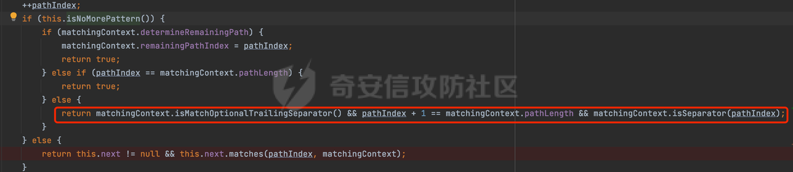

也就是说**默认情况下PathPattern模式会匹配尾部额外的`/`**，例如下面的例子会返回true:

```Java
PathPatternParser pathPatternParser =new PathPatternParser();
pathPatternParser.parse("/admin/manage").matches(PathContainer.parsePath("/admin/manage/"));
```

因为Spring WebFlux使用PathPattern的方式进行路径匹配。所以可以考虑结合尾部添加额外的`/`来绕过对应的AntPathMatcher匹配逻辑。

### 2.1.2 URL编码

SpringMVC在不同版本解析路径的方式是不一样的，当使用AntPathMatcher解析请求时，会调用UrlPathHelper的resolveAndCacheLookupPath进行处理：

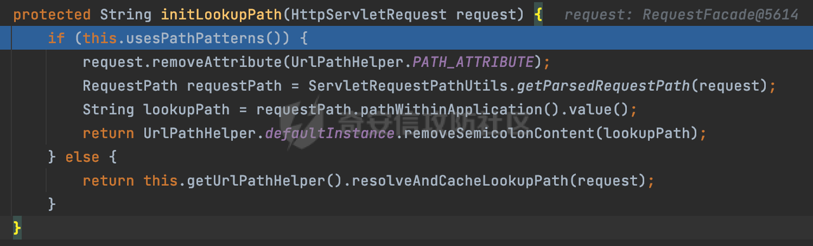

在获取requestUri时调用了decodeAndCleanUriString进行URL解码处理，通过这一系列的处理后，最终调用AntPathMatcher进行匹配：

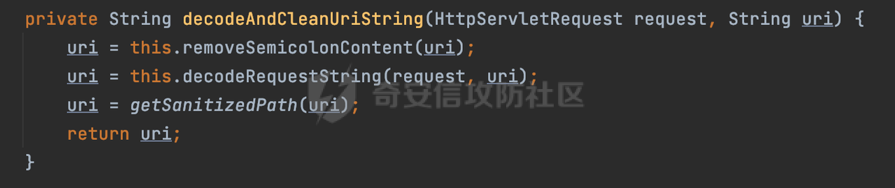

这也是为什么对请求的path进行url编码后仍可以正常访问，实际上**AntPathMatcher在匹配时默认情况下并不会进行URL解码操作**。例如下面的例子会返回false：

```Java
matcher.match("/admin/manage","/admin/manage/");
matcher.match("/admin/manage","/admin/%6d%61%6e%61%67%65");
```

而对于PathPattern匹配模式来说，在进行资源匹配时，会对路径中的URL编码进行解码操作，这个同样也是默认嵌套在匹配流程中的，主要是通过decodeAndParseSegments属性控制的（默认是true）：

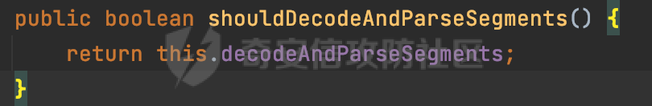

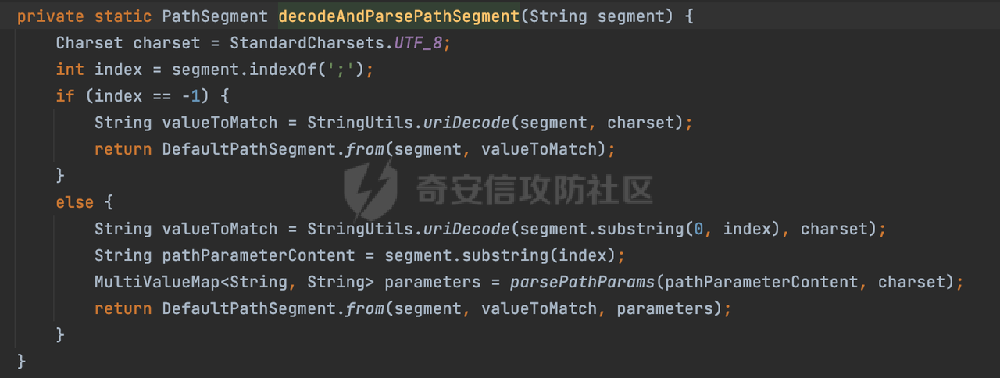

也就是说，PathPattern**在匹配时默认情况下会进行URL解码操作**。例如下面的例子会返回true：

```Java
PathPatternParser pathPatternParser =new PathPatternParser();
pathPatternParser.parse("/admin/manage").matches(PathContainer.parsePath("/admin/%6d%61%6e%61%67%65"));
```

因为Spring WebFlux使用PathPattern的方式进行路径匹配。所以可以考虑对请求路径URL编码后访问来绕过对应的AntPathMatcher匹配逻辑。

### 2.1.3 分号的处理

除了URL编码以外，SpringMVC在使用AntPathMatcher解析请求时，会调用removeSemicolonContent方法剔除额外的`;`,然后通过这一系列的处理后，最终调用AntPathMatcher进行匹配：

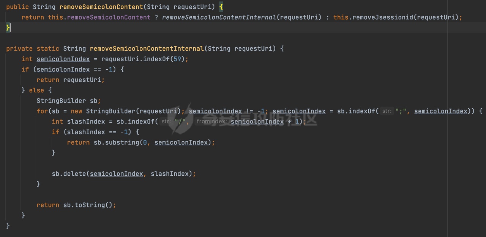

这也是为什么类似`/admin/mange;bypass/`的请求仍可以正常访问，但是实际上**AntPathMatcher在匹配时默认情况下并不会对路径中的;进行处理**。例如下面的例子会返回false：

```Java
AntPathMatcher matcher = new AntPathMatcher();
matcher.match("/admin/manage/","/admin/manage;bypass/");
```

而**对于PathPattern匹配模式来说，在进行资源匹配时，默认会对路径中的分号进行截断处理**，这个过程也是内嵌在匹配过程中的：

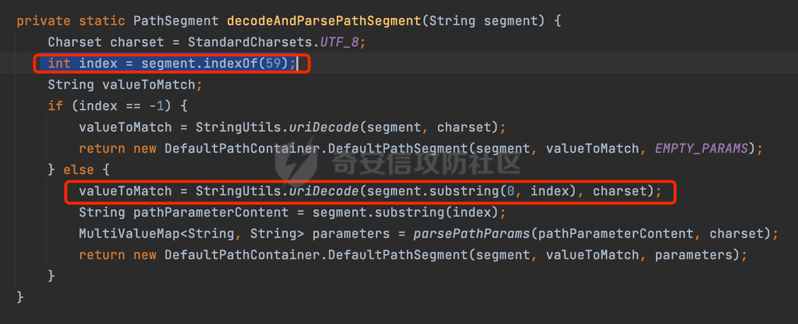

例如下面的例子会返回true：

```Java
PathPatternParser pathPatternParser =new PathPatternParser();
pathPatternParser.parse("/admin/manage/").matches(PathContainer.parsePath("/admin/manage;bypass/"));
```

同样的，可以在实际请求时考虑引入`;`来绕过对应的匹配逻辑。

### 2.1.4 换行符的匹配

在org.springframework.util.AntPathMatcher#doMatch方法中，首先调用tokenizePattern()方法将pattern分割成了String数组，如果是全路径并且区分大小写,那么就通过简单的字符串检查，看看path是否有潜在匹配的可能，没有的话返回false:

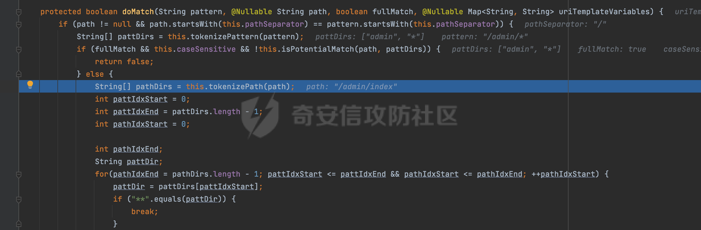

然后调用tokenizePath()方法将需要匹配的path分割成string数组,主要是通过java.util 里面的StringTokenizer来处理字符串：

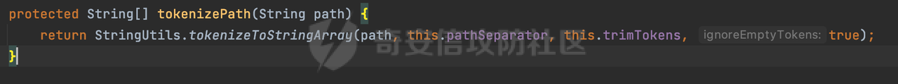

然后就是pathDirs和pattDirs两个数组从左到右开始匹配，主要是一些正则的转换还有通配符的匹配。例如/admin/\*的`*`实际上是正则表达式`.*`通过java.util.regex.compile#matcher进行匹配:

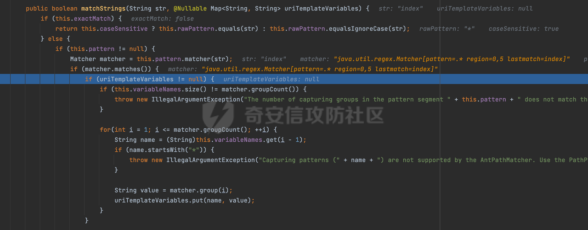

这里会调用AntPathStringMatcher的构造方法对Patten里的字符进行正则转换并封装成java.util.regex.Pattern对象返回，然后跟请求的Path进行匹配。不同版本间是存在差异的。主要是是否开启DOTALL。主要影响在匹配的时候会不会匹配类似\\r \\n 等换行字符。

这里跟SpringMVC的情况类似，就不再赘述了。具体可以参考[https://forum.butian.net/share/2694](https://forum.butian.net/share/2694)

## 2.2 其他

实际上在获取路径时，可以参考Spring WebFlux的处理方法，然后使用PathPattern进行匹配，避免由于解析差异导致的绕过问题：


