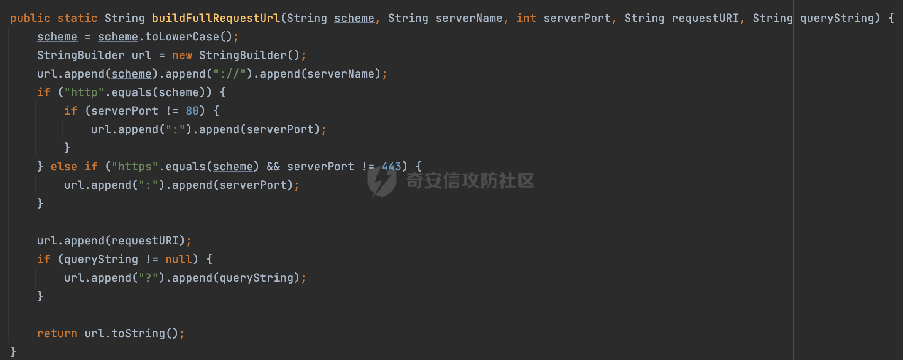

# 奇安信攻防社区-SpringSecurity动态配置资源权限浅析

### SpringSecurity动态配置资源权限浅析

在Spring Security中实现通过数据库动态配置url资源权限，需要通过配置验证过滤器来实现资源权限的加载、验证。系统启动时，到数据库加载系统资源权限列表，当有请求访问时，通过对比系统资源权限列表和用户资源权限列表（在用户登录时添加到用户信息中）来判断用户是否有该url的访问权限。浅析其中代码审计时需要关注的风险。

# 0x00 前言

在Spring Security中实现通过数据库动态配置url资源权限，需要通过配置验证过滤器来实现资源权限的加载、验证。系统启动时，到数据库加载系统资源权限列表，当有请求访问时，通过对比系统资源权限列表和用户资源权限列表（在用户登录时添加到用户信息中）来判断用户是否有该url的访问权限。

在配置验证过滤器时需要的配置项有如下几个，实现顺序如下：

-   securityMetadataSource：实现FilterInvocationSecurityMetadataSource接口，在其中加载资源权限。
-   accessDecisionManager：配置自定义的AccessDecisionManager，用于决定用户是否有权限访问资源。
-   filterSecurityInterceptor：通过继承AbstractSecurityInterceptor并实现Filter接口自定义一个验证过滤器，替换默认验证过滤器。
-   WebSecurityConfig：系统配置类，需要在配置类中配置启用filterSecurityInterceptor。

从Spring Security 6开始，FilterSecurityInterceptor被AuthorizationFilter 代替了。此时主要是通过access方法进行实现，例如下面的例子：

```Java
@Bean
SecurityFilterChain securityFilterChain(HttpSecurity http) throws Exception {
    http.authorizeHttpRequests(register -> register.anyRequest().access((authentication, object) -> {
                //表示请求的 URL 地址和数据库的地址是否匹配上了
                boolean isMatch = false;
                //获取当前请求的 URL 地址
                String requestURI = object.getRequest().getRequestURI();
                List<MenuWithRoleVO> menuWithRole = menuService.getMenuWithRole();
                for (MenuWithRoleVO m : menuWithRole) {
                    if (antPathMatcher.match(m.getUrl(), requestURI)) {
                        isMatch = true;
                        //这就是当前请求需要的角色
                        List<Role> roles = m.getRoles();
                        //获取当前登录用户的角色
                        Collection<? extends GrantedAuthority> authorities = authentication.get().getAuthorities();
                        for (GrantedAuthority authority : authorities) {
                            for (Role role : roles) {
                                if (authority.getAuthority().equals(role.getName())) {
                                    //说明当前登录用户具备当前请求所需要的角色
                                    return new AuthorizationDecision(true);
                                }
                            }
                        }
                    }
                }
                if (!isMatch) {
                    //说明请求的 URL 地址和数据库的地址没有匹配上，对于这种请求，统一只要登录就能访问
                    if (authentication.get() instanceof AnonymousAuthenticationToken) {
                        return new AuthorizationDecision(false);
                    } else {
                        //说明用户已经认证了
                        return new AuthorizationDecision(true);
                    }
                }
                return new AuthorizationDecision(false);
            }))
            .formLogin(form -> 
            //...
            )
            .csrf(csrf -> 
            //...
            )
            .exceptionHandling(e -> 
            //...
            )
            .logout(logout ->
            //...
            );
    return http.build();
}
```

# 0x01 关键内容

对于动态配置资源权限，在实际审计过程中，主要关注的是资源的匹配过程。一般情况下是请求的url的匹配，下面是其中的一些关键内容。

## 1.1 FilterInvocation

`org.springframework.security.web.FilterInvocation` 是 Spring Security 中用于封装 HTTP 请求和响应的类，主要用于在安全过滤链（Security Filter Chain）中传递请求的上下文信息。

在 Spring Security 的安全过滤链中，每个安全过滤器都会处理 `FilterInvocation` 对象，该对象包含了当前请求的相关信息，以及用于处理请求的 `Filter`。它实现了 Spring 的 `FilterChainProxy` 接口，使得安全过滤器链能够逐一处理请求。


其中可以下面两个方法对当前的request进行解析，获取当前请求的url，然后配置对应url的访问权限：


## 1.2 获取请求路径的方式

从前面FilterInvocation提供的方法可知，具体获取请求路径的方式是通过Spring Security的工具类进行处理的。

`org.springframework.security.web.util.UrlUtils` 类是 Spring Security 框架提供的一个工具类，主要用于处理与 URL 相关的操作。这个类提供了一些静态方法，使开发人员能够轻松地处理 URL，例如构建完整的请求 URL、解析 URL 参数等：


主要是如下两个方法：

-   buildFullRequestUrl

这里主要是通过requestURI进行获取，没有做额外过多的处理，同时获取的内容包含协议端口等额外信息：



-   buildRequestUrl

这里主要是通过servletPath方法获取请求路径，如果servletPath为空，则使用requestURI进行获取，一般情况下是对请求的路径进行了归一化处理的：


# 0x02 潜在的绕过风险

在Spring Security中提供了一个HttpFirewall接口，用于处理掉一些非法请求。默认情况下使用的是StrictHttpFirewall，这里会校验请求URL是否规范，对于不规范的请求直接拒绝：


类似`;`,`//`,`../`这类常见的利用解析差异绕过的符号均会被拦截，在一定程度上缓解了解析差异带来的潜在的权限绕过风险。

不同版本的StrictHttpFirewall方法是有差异的，以spring-security-web-5.6.8为例，增加了黑名单的规则，可以看到主要是增加了一些类似换行符的黑名单：


在实际审计过程中可能会遇到一些绕过案例，**主要关注点是在securityMetadataSource**。这里会实现FilterInvocationSecurityMetadataSource接口，一般会通过当前的请求地址，获取该地址需要的用户角色。可能存在因为解析请求地址的差异导致一些权限绕过问题。一般都是通过FilterInvocation获取对应的path进行匹配，例如下面的例子：

```Java
    @Override
    public Collection<ConfigAttribute> getAttributes(Object object) throws IllegalArgumentException {
        String requestUrl = ((FilterInvocation) object).getRequestUrl();
        List<Menu> menus = menuService.getAllMenusWithRole();
        for (Menu menu : menus) {
            if (antPathMatcher.match(menu.getUrl(), requestUrl)) {
                List<Role> roles = menu.getRoles();
                String[] str = new String[roles.size()];
                for (int i = 0; i < roles.size(); i++) {
                    str[i] = roles.get(i).getName();
                }
                return SecurityConfig.createList(str);
            }
        }
        return SecurityConfig.createList("ROLE_LOGIN");
    }
```

从前面也了解到实际获取的方式主要是通过org.springframework.security.web.util.UrlUtils解析request对象进行实现的。主要涉及getRequestUrl和getFullRequestUrl两个方法。而getFullRequestUrl没有做额外过多的处理，同时获取的内容包含协议端口等额外信息，实际情况使用getRequestUrl更多，下面针对getRequestUrl结合列举一些案例：

## 2.1 ?绕过

从org.springframework.security.web.util.UrlUtils#buildRequestUrl方法可以看到，在获得 url 路径后，这里虽然对请求内容进行了归一化处理，但是如果query不为空，还会把?和后面的参数拼接上去，作为 url继续进行匹配：


假设实际的路由匹配逻辑如下：

```Java
FilterInvocation fi = (FilterInvocation) object;
AntPathMatcher antPathMatcher = new AntPathMatcher();
if(antPathMatcher.match("/admin/manage",fi.getRequestUrl())){
    ......
}
```

也就是说在请求的path后加上?即可绕过上述逻辑。

## 2.2 结合尾部/解析绕过

结合低版本SpringWeb **TrailingSlashMatch**的特性以及高版本**matchOptionalTrailingSeparator属性**的特点，在访问对应的Controller接口时请求路径尾部存在额外的斜杠也能成功匹配。利用这一点同样可以绕过上述的逻辑。（当然低版本的**SuffixPatternMatch**后缀匹配模式也可以）

## 2.3 AntPathRequestMatcher解析差异绕过

搜索了一些案例实现，发现绝大部分都会使用AntPathMatcher或者SpringSecurity的AntPathRequestMatcher进行匹配（实际上两者是类似的）：

[https://github.com/lenve/vhr/blob/master/vhr/vhrserver/vhr-web/src/main/java/org/javaboy/vhr/config/CustomFilterInvocationSecurityMetadataSource.java](https://github.com/lenve/vhr/blob/master/vhr/vhrserver/vhr-web/src/main/java/org/javaboy/vhr/config/CustomFilterInvocationSecurityMetadataSource.java)

因为高版本的SpringWeb使用的是PathPattern进行路由解析的，这里可能会有解析差异的问题。下面是一个具体的例子：

对于默认的Pattern模式，不开启DOTALL时候，在默认匹配的时候不会匹配\\r \\n 字符。


AntPathRequestMatcher解析时，会调用AntPathStringMatcher的构造方法对Patten里的字符进行正则转换并封装成java.util.regex.Pattern对象返回，然后跟请求的Path进行匹配。而不同版本间是存在差异的。

-   spring-core-5.3.21


-   spring-core-5.3.22


在5.3.22版本之前，Pattern并没有配置dotall模式，从5.3.22版本开始，配置了dotall模式，此时的表达式`.`匹配任何字符，包括行结束符。

当使用高版本的Spring时，在进行路由解析时使用的是PathPatternParser。在处理`{param}`时，PathPattern会使用CaptureVariablePathElement进行处理，因为通配符{}中没有正则，所以这里只需要pathElements的元素个数和PathPattern中的元素个数一致都会返回true:


那么假设实际的路由匹配逻辑如下,通过前面的分析，只需要访问`/admin/%0d%0a`即可绕过对应的匹配逻辑了：

```Java
antPathMatcher.match("/admin/{name}",fi.getRequestUrl())
```

而SpringSecurity在某些版本之前是没有对换行符进行拦截的，在特定场景下可能存在权限绕过的风险。
