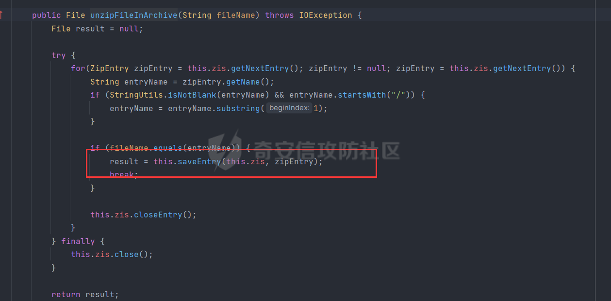
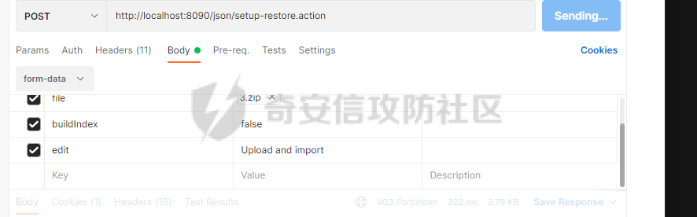
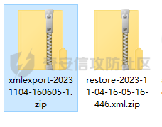
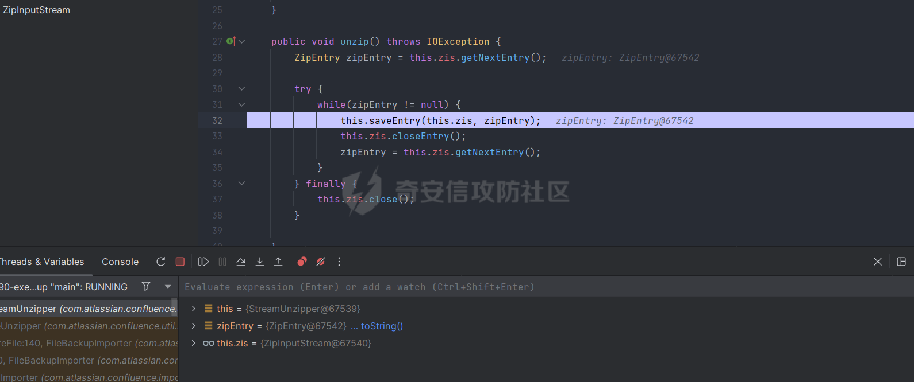

# 奇安信攻防社区-【Web实战】 Atlassian Confluence CVE-2023-22518/22515 Getshell 速通

### 【Web实战】 Atlassian Confluence CVE-2023-22518/22515 Getshell 速通

对 CVE-2023-22518 的一波分析

# 前言&&参考

前阵子爆出来的评分10.0的Confluence未授权漏洞可谓是比较震撼的，但其实漏洞原理不算复杂，利用的是XframeWork2的getter特性。具体分析可以参考我的往期文章  
[Atlassian Confluence CVE-2023-22515 深入浅出 - Boogiepop Doesn’t Laugh](https://boogipop.com/2023/10/16/Atlassian%20Confluence%20CVE-2023-22515%20%E6%B7%B1%E5%85%A5%E6%B5%85%E5%87%BA/)  
然后有一些外国佬发了一些不全的验证性质的POC，没有EXP  
[https://github.com/davidfortytwo/CVE-2023-22518/blob/main/CVE-2023-22518.py](https://github.com/davidfortytwo/CVE-2023-22518/blob/main/CVE-2023-22518.py)  
我就浅浅的分析一下。

# 漏洞分析

但只需要给出漏洞的路由，我们就可以进一步去分析，这个POC中给出的路由是  
`/json/setup-restore.action`  
我们直接到structs.xml文件中去寻找相关的路由  
!\[image.png\]

  
这乍一看就发现了一个Action，进去看看逻辑

  
这个接口没有进行鉴权，并且我们可以触发validate方法，他会获取请求体中上传的File，然后带入`getExportDescriptor`方法

  
在这里可以看到参数名是Zip，不难想到让我们上传一个zip文件。  
  
随后创建一个解压类unzipper

  
进行解压操作

  
进入saveEntry看看

  
一开始我以为是zipslip，所以有了下面一个失败的尝试

# 调试流程分析

进入我们的断点了已经，这里有个细节，就是我们需要给header加一个  
`X-Atlassian-Token=no-check`  
往前看堆栈

  
有一个isProtected属性，是由methodRequiresProtection方法赋值的

  
isOverrideHeaderPresent方法

  
这样isProtected属性就为false了

  
因此我们才有接下来的调用哦。那我们继续看解压流程

  
在这里会创建一个缓存文件夹，存放zip的位置

  
确实是有这东西，继续往下看

  
这里会读取zip文件里有没有exportDescriptor.properties这个文件

  
这里我的zip文件并没有他，因此就寄掉了，我们加上这个文件再来一遍

  
很好这次是成功获取咯。  
然后经过多次尝试，properties有几个必要的属性

-   exportType
-   createdByBuildNumber
-   buildNumber

其中我们要让exportType=ALL，这样才可以进入接下来的execute流程  
并且这个zip需要一个entities.xml，而且这个entities.xml需要一定的配置，到这里我就去网上搜了一下这个文件，然后才知道，哦，原来这就是confluence的备份文件zip

  
然后这个也就是数据恢复接口未授权访问。恍然大悟的我发现哪里来的那么多操作，直接自己本地准备个备份文件，然后给目标上传复原，管理员密码就是自己的了。  
对于这个路由为什么是未授权的，其实就是stucts.xml配置错误问题了

  
`/json`路由继承了admin路由，导致不需要鉴权也可以访问管理员权限的接口

  
我们直接post界面请求就可以进入该界面了。

# 正确的Getshell方法

这里我准备2个confluence，一个搭建在我的虚拟机里，一个搭建在本地

> 虚拟机管理员用户密码为  
> kino/kino123  
> 本机管理员用户密码为  
> admin/admin

我们现在需要做的事利用本机的confluence获取一份备份文件，鉴于严谨，这边选择把版本对应起来，都是8.5.1

  
在官网备份有2种备份文件，第一种就是设置里面->备份与恢复->导出站点  
他得到的文件是restore打头的

  
其中exportType为site，通过上述调试流程的判断，我们需要让exportType为ALL，因此我们选用另一个导出方案  
`/json/backup.action`

  
这个备份文件中主要内容是在entities.xml里，我们可以粗略的看看

  
这样导出的就是all了，之后我们进行覆盖。

  
然后等待一会儿，就可以发现用户名密码和空间内容被我们覆盖

  
^^，然后就是rce的问题

## 后台插件RCE

[https://github.com/AIex-3/confluence-hack/tree/main](https://github.com/AIex-3/confluence-hack/tree/main)  
后台提供了插件功能

  
我们可以上传自定义插件，github上有人做了一个恶意插件

  
成功rce咯~CVE-2023-22515也是这样后台RCE的，但这个毕竟不是完整的TTY，假如服务不出网，我们还是需要修改一下插件的，最好能哥斯拉连接这样子。不过理论应该是可以的，只需要修改下逻辑- -  
看了一下它的源码

  
就是一个单纯的马，咱们传一个哥斯拉的马就行了OVO

# 失败的Getshell尝试

再说说失败的getshell方式吧，一开始我是逆向分析的，而不是正向分析的，因为当时不知道confluence有备份文件这东西，所以就自己手动构造了一下zip包，也是希望这个失败的思路可以给大家一点思路，个人觉得还是比较有趣的。这里就说一下我逆向的思路

  
我准备了一个zipslip的压缩包，由于上面说到了这个zip需要entities.xml和properties属性文件，然后xml就是随便给了一个大标签，是没有任何内容的，紧接着就进入断点判断了。

获取到了属性文件properties就会进入doRestore方法去进行恢复

这个isSynchronous就是我们get传入的参数，我们要让他为true才可以进入task.run

  
这个context是一个DefalutImportContext对象，所以之后task.run运行的逻辑应该在里面

进入了doImport方法，然后有个preImport进行解压处理。

  
最后自然就到了unzip方法

  
我以为在SaveEntity这里可以进行zipslip操作的。QWQ

  
结果有一层判断isChildOf，导致我们的zipslip失败呜呜呜呜

# 总结

总得来说这漏洞是一个自爆式百分百损失的漏洞，你假如想用，那么就拿不到服务器那边原来的数据，而我们打Confluence的站一般都是去看他的文库数据，而不是获取这个站点的shell，这是一种比较极端的利用方式，不太建议使用，除非已知文库没啥东西，就是想要这个shell。
