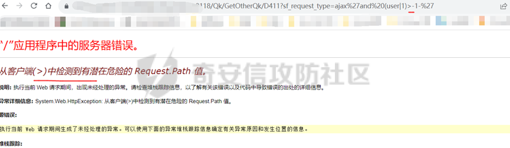

# 奇安信攻防社区-【Web实战】SQL Server注入专题--利用sys视图进行显错注入的由浅入深绕过方式

### 【Web实战】SQL Server注入专题--利用sys视图进行显错注入的由浅入深绕过方式

今天这篇SQL注入的专题给到我们的SQL Server数据库，它还有一个名字是MSSQL数据库。其中有一种注入方式，是我今天所要介绍的主题，它便是利用sys视图进行显错注入。这里我将由浅入深的介绍它的几种绕过方式和payload。

# 前言

今天这篇SQL注入的专题给到我们的SQL Server数据库，它还有一个名字是MSSQL数据库。其中有一种注入方式，是我今天所要介绍的主题，它便是**利用sys视图进行显错注入**。这里我将由浅入深的介绍它的几种绕过方式和payload。

这里导致注入的**原因**是：数据类型原本是数字，但是输入的内容是字符，因此在转换中失败导致报错。

比如在 SQL Server 中，`-(1/DB_NAME())-` 这样的语句看起来像是在进行数学运算，然而由于除以一个字符串是无意义的操作，因此这样的语句在 SQL Server 中会引发一个错误。其中使用了 `DB_NAME()` 函数来获取当前数据库的名称。

# 绕过案例1

## 介绍

普通payload被waf拦截，因此想到利用sys视图显错注入来进行绕过，使用payload`'-(1/user)-'`成功注入，并爆出当前数据库用户。

## 过程

[https://xxxx/，用户名xxx](https://xxxx/%EF%BC%8C%E7%94%A8%E6%88%B7%E5%90%8Dxxx)密码xxx

其中点击在线教育中心：

其中随便点击一个课程：

然后抓包：

其中的id参数判断出存在单引号字符型注入，且为mssql数据库：  
其中判断出存在依讯waf，使用普通的payload都是会被拦截的。

但是其中这里利用sys视图进行显错注入，可以成功绕过：  
`id='-(1/user)-'`，成功绕过查看用户：

`id='-(1/db_name())-'`，成功绕过查看数据库名：

# 绕过案例2

## 介绍

使用payload`'-(1/user)-'`并没有爆出当前数据库用户，那么这里改造payload为`'and+(user|1)>-1-'`从而成功爆出当前数据库用户。

## 过程

[https://x.x.x.x/enlink/#/client/app](https://x.x.x.x/enlink/#/client/app)，其中用户名xxx  
密码xxx  
其中点击门户：  

点击更多中的实验教学系统：

其中点击预约实验项目：

其中输入项目名称和教师，点击查询然后抓包：  
其中`xsyyshiyan.aspx`接口的`jsname`参数和`xmname`参数存在SQL注入：  
但是这里使用`'-(1/user)-'`虽然成功执行，但是并没有爆出当前用户：

所以这里需要修改payload：

这里改造为如下payload：`'and+(user|1)>-1-'` （这里亲测`'and+(user|1)=-1-'`也是可以成功的，如果`>`给拦截了，可以尝试修改为`=`等号）

成功爆出当前数据库用户：

`@@version`，成功爆出数据库版本号

# 绕过案例3

## 介绍

使用payload`'-(1/user)-'`遇上`/`被检测，那么这里改造payload为`'and+(user|1)>-1-'`,但是又碰到`>`被检测，最终使用payload`'and (user|1)=-1-'`从而成功绕过，爆出当前数据库用户。

## 过程

[https://x.x.x.x](https://x.x.x.x/)

用户名xxx

密码xxx

其中点击xx报刊复印资料：

这里抓到了如下包：

其中`sf_request_type`参数存在sql注入：

Payload：

`'-(1/user)-'`

这里测试发现不行：

通过fuzz发现是`/`这个除号会给如此防御，如下换成减号`-`是可以，但是无法爆出数据库当前用户

然后这里换了一个payload：`'and (user|1)>-1-'`

这里发现`>`大于号被检测为有潜在危险的 Request.Path 值：

那么这里将`>`替换成`=`，即payload：`'and (user|1)=-1-'`

成功爆出当前数据库用户：

`@@version`当前数据库版本：

