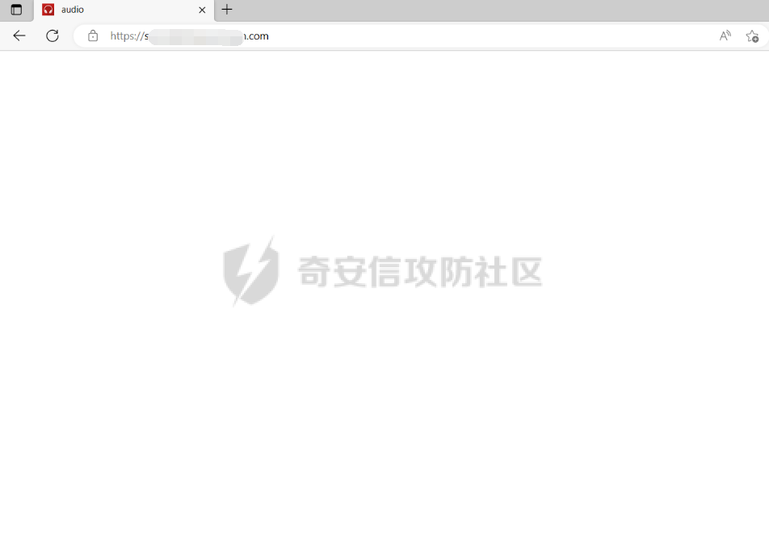

# 奇安信攻防社区-【Web实战】一次空白页面的“妙手回春”嘎嘎出严重漏洞

### 【Web实战】一次空白页面的“妙手回春”嘎嘎出严重漏洞

某次企业SRC的一次实战。其中通过信息收集发现了一个站点，这里为内部系统，访问的时候居然直接一片空白，是空白页面。难道空白页面就没有漏洞吗？我就偏偏不信这个邪，上手就是干！

# 前言

某次企业SRC的一次实战。其中通过信息收集发现了一个站点，这里为内部系统，访问的时候居然直接一片空白，是空白页面。难道空白页面就没有漏洞吗？我就偏偏不信这个邪，上手就是干！

# 过程

[https://x,x.com/](https://x,x.com/)  
打开页面啥也没有，一片空白:  

其中这里按下键盘中的F12，通过审计js后，发现接口：

其中的一个接口/api/plugin/directory/getLastUsedDirId拼接后，如下提示：

其中响应包中响应的“插件分类不能为空”让我百思不得其解，不知道是缺了什么参数。那么这里就再回到js中看看吧，果然，给我发现了端倪：  
这里再查看js，发现其中给出提示，原来是header要加如下字段：

那么我加了其中一个字段category，发现成功，但是却又报了非法用户登录。那么这里就必须需要Authorization认证字段了：

因此这里就又碰到了一个棘手的问题，Authorization认证字段这个一般都是成功登录系统后才会赋予给用户的一个值，而这个地方连页面都是空白的，那么这里到底去哪里寻找Authorization认证字段的值呢？

这里贯彻着遇事不决看js的思想，继续来审计js，终于发现了解决方法：  
其中在js中发现了login接口。这里存在该逻辑漏洞：id:t.id||"1234",name:t.name||"1234",organizationCode:t.organizationCode||-1。这里用了||或，那么言下之意就是如果不知道id、name和organizationCode的话，就可以直接id参数和name参数都填1234，organizationCode填-1

login接口，这里真成功了，其中获取到data

那么这里猜测data的值即为那个Authorization认证字段的值，这里填入：

发现成功调用接口：

那么这里其中的接口就都可以成功调用了：

像这里的获取内部数据等等

这里最关键的一个接口来了：  
这里通过js审计到查看oss配置信息的接口：  

这里因为是阿里云的，所以这里直接使用oss browser来进行利用，利用成功：

这些直接可以下载到后端的源码：

其中反编译出来直接为后端源码，泄露许多严重敏感信息

后端的配置信息：

其中还有数据库密码等等敏感信息

反编译出来的后端源码：  

最后的最后，当然也是给了严重的漏洞等级，舒服了！
