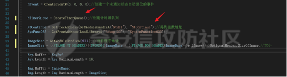
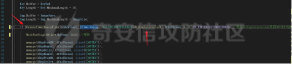
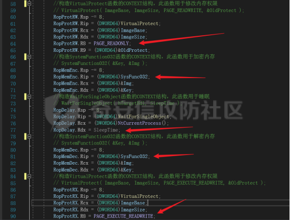
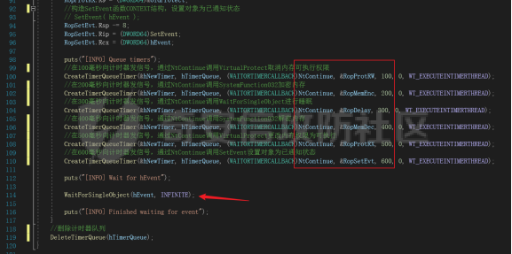
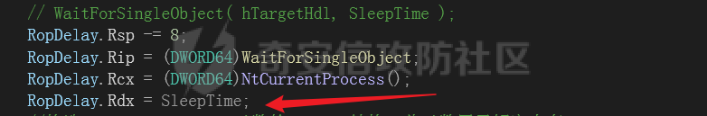
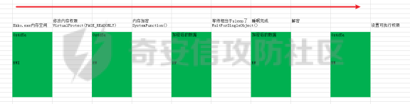
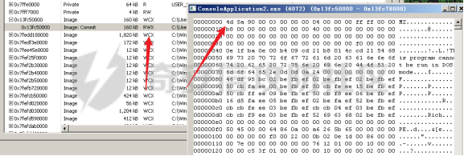
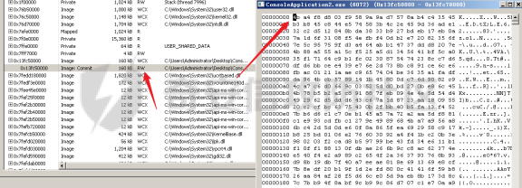

# 奇安信攻防社区-【Web实战】内存免杀-Ekko项目解读

### 【Web实战】内存免杀-Ekko项目解读

通过分析Ekko项目了解内存加密过程，这对对抗内存扫描来说很重要。

# **概述**

Edr会扫描程序的内存空间，检测是否存在恶意软件，这种检测恶意软件的方式，应该和静态检测没什么区别，只不过一个扫描的对象是硬盘，一个是内存，应该都是基于特征码来检测的，为了绕过这种扫描我们可以对内存中的beacon进行加密，但这样的话就会出现问题，因为beacon被加密后是无法正常的运行的，因为代码被加密了。  
#  
我们提到过自己是不可以加密自己的，但是Ekko项目实现了自己加密自己的内存，这对对抗内存扫描很有帮助。

# **API理解**

`CreateEvent()`创建或打开一个事件对象

`SetEvent()`设置对象状态已通知状态

`CreateTimerQueue()`创建计时器队列

`CreateTimerQueueTimer()`创建计时器队列计时器

```js

BOOL CreateTimerQueueTimer(
  [out]          PHANDLE             phNewTimer,
  [in, optional] HANDLE              TimerQueue,
  [in]           WAITORTIMERCALLBACK Callback,
  [in, optional] PVOID               Parameter,
  [in]           DWORD               DueTime,
  [in]           DWORD               Period,
  [in]           ULONG               Flags
);
```

`phNewTimer`接受计时器队列计时器的缓冲区

`TimeQueue`计时器队列句柄

`CallBack`回调函数，计时器过期时要执行的函数

`Parameter`回调函数的参数

`DueTime`过多长时间向计时器发信号

`Period`计时器的周期，如果为0就向计时器发信号

`Flag`标志，指定函数调用相关内容。

对于`CreateTimerQueueTimer`函数可以这样理解，它可以定时执行一个函数，应该是异步执行的。

`WaitForSingleObject()`等待某个对象的状态，如果状态为已通知就往下执行，或者等待超时也会往下执行，也可以设置一直等待

`SystemFunction032()`通过RC4加密方式加密内存

`RtlCaptureContext()`得到当前线程的CONTEXT结构

对于`CONTEXT`结构可以理解为:用于存储线程运行时寄存器的值，RIP,RSP......

`NtContinue`()对于这个函数确实不太理解，这里只需要知道给它传进去一个`CONTEXT`结构，就可以执行`CONTEXT`对应的代码，也就是可以控制程序执行流程。

# **Ekko代码阅读**

一些不太重要的代码会跳过去



```js
  hEvent = CreateEventW(0, 0, 0, 0);//创建一个未通知状态自动复位的事件
  hTimerQueue = CreateTimerQueue();//创建计时器队列
  NtContinue = GetProcAddress(GetModuleHandleA("Ntdll"), "NtContinue");//得到函数地址
  SysFunc032 = GetProcAddress(LoadLibraryA("Advapi32"), "SystemFunction032");
  ImageBase = GetModuleHandleA(NULL);//当前程序地址
  ImageSize = ((PIMAGE_NT_HEADERS)((DWORD64)ImageBase + ((PIMAGE_DOS_HEADER)ImageBase)->e_lfanew))->OptionalHeader.SizeOfImage;//大小
```

这段代码通过调用`CreateTimerQueue`创建了一个计时器队列接着，通过调用`GetModuleHandleA`与`GetProcAddress`得到了`NtContinue`和`SystemFunction032`函数的地址，接着又得到了当前程序的基地址和当前程序的大小



```js
if (CreateTimerQueueTimer(&hNewTimer, hTimerQueue, (WAITORTIMERCALLBACK)RtlCaptureContext, &CtxThread, 0, 0, WT_EXECUTEINTIMERTHREAD))//调用RtlCaptureContext得到CONTEXT结构
    {
        WaitForSingleObject(hEvent, 0x32);//等待

        memcpy(&RopProtRW, &CtxThread, sizeof(CONTEXT));
        memcpy(&RopMemEnc, &CtxThread, sizeof(CONTEXT));
        memcpy(&RopDelay, &CtxThread, sizeof(CONTEXT));
        memcpy(&RopMemDec, &CtxThread, sizeof(CONTEXT));
        memcpy(&RopProtRX, &CtxThread, sizeof(CONTEXT));
        memcpy(&RopSetEvt, &CtxThread, sizeof(CONTEXT));
```

通过`CreateTimerQueueTimer`创建了一个计时器，在创建后会立刻调用(因为`DueTime`与`period`都是0)`RtlCaptureContext`函数得到当前线程的`CONTEXT`结构，接着使用得到的`CONTEXT`结构初始化了一些`CONTEXT`结构，为下面的调用做准备。



```js
        //构造VirtualProtect函数的CONTEXT结构，此函数用于修改内存权限
        // VirtualProtect( ImageBase, ImageSize, PAGE_READWRITE, &OldProtect );
        RopProtRW.Rsp -= 8;
        RopProtRW.Rip = (DWORD64)VirtualProtect;
        RopProtRW.Rcx = (DWORD64)ImageBase;
        RopProtRW.Rdx = (DWORD64)ImageSize;
        RopProtRW.R8 = PAGE_READWRITE;
        RopProtRW.R9 = (DWORD64)&OldProtect;
        //构造SystemFunction032函数的CONTEXT结构，此函数用于加密内存
        // SystemFunction032( &Key, &Img );
        RopMemEnc.Rsp -= 8;
        RopMemEnc.Rip = (DWORD64)SysFunc032;
        RopMemEnc.Rcx = (DWORD64)&Img;
        RopMemEnc.Rdx = (DWORD64)&Key;
        //构造WaitForSingleObject函数的CONTEXT结构，此函数用于睡眠
        // WaitForSingleObject( hTargetHdl, SleepTime );
        RopDelay.Rsp -= 8;
        RopDelay.Rip = (DWORD64)WaitForSingleObject;
        RopDelay.Rcx = (DWORD64)NtCurrentProcess();
        RopDelay.Rdx = SleepTime;
        //构造SystemFunction032函数的CONTEXT结构，此函数用于解密内存
        // SystemFunction032( &Key, &Img );
        RopMemDec.Rsp -= 8;
        RopMemDec.Rip = (DWORD64)SysFunc032;
        RopMemDec.Rcx = (DWORD64)&Img;
        RopMemDec.Rdx = (DWORD64)&Key;
        //构造VirtualProtect函数的CONTEXT结构，此函数用于修改内存权限
        // VirtualProtect( ImageBase, ImageSize, PAGE_EXECUTE_READWRITE, &OldProtect );
        RopProtRX.Rsp -= 8;
        RopProtRX.Rip = (DWORD64)VirtualProtect;
        RopProtRX.Rcx = (DWORD64)ImageBase;
        RopProtRX.Rdx = (DWORD64)ImageSize;
        RopProtRX.R8 = PAGE_EXECUTE_READWRITE;
        RopProtRX.R9 = (DWORD64)&OldProtect;
        //构造SetEvent函数CONTEXT结构，设置对象为已通知状态
        // SetEvent( hEvent );
        RopSetEvt.Rsp -= 8;
        RopSetEvt.Rip = (DWORD64)SetEvent;
        RopSetEvt.Rcx = (DWORD64)hEvent;
```

这段代码为调用`VirtualProtect`与`SystemFunction032`......做准备  
主要通过给`CONTEXT`结构的成员赋值，来模拟对应函数的调用(当然这里不是真的调用)



```js
    //等100毫秒向计时器发信号，通过NtContinue调用VirtualProtect取消内存可执行权限
        CreateTimerQueueTimer(&hNewTimer, hTimerQueue, (WAITORTIMERCALLBACK)NtContinue, &RopProtRW, 100, 0, WT_EXECUTEINTIMERTHREAD);
        //等200毫秒向计时器发信号，通过NtContinue调用SystemFunction032加密内存
        CreateTimerQueueTimer(&hNewTimer, hTimerQueue, (WAITORTIMERCALLBACK)NtContinue, &RopMemEnc, 200, 0, WT_EXECUTEINTIMERTHREAD);
        //等300毫秒向计时器发信号，通过NtContinue调用WaitForSingleObject进行睡眠
        CreateTimerQueueTimer(&hNewTimer, hTimerQueue, (WAITORTIMERCALLBACK)NtContinue, &RopDelay, 300, 0, WT_EXECUTEINTIMERTHREAD);
```

这段代码负责加密，主要通过`CreateTimerQueueTimer`函数创建计时器，计时器在等待指定的毫秒后，调用回调函数(也就是调用`NtContinue`)而`NtContinue`则会根据我们传入的`CONTEXT`结构去执行对应的函数。

比如第一行，传入的是`VirtualProtect`函数的`CONTEXT`结构，那么`NtContinue`将会调用`VirtualProtect`

下面是调用流程，画的有点丑，师傅们见谅^ \_^......

  
第二行就是调用`SystemFunction032`来对内存进行加密  
第三行就是调用`WaitForSingleObject`来实现睡眠，SleepTime就是睡眠的时间

  
下面来看一下解密内存部分

```js
 //等400毫秒向计时器发信号，通过NtContinue调用SystemFunction032解密内存
        CreateTimerQueueTimer(&hNewTimer, hTimerQueue, (WAITORTIMERCALLBACK)NtContinue, &RopMemDec, 400, 0, WT_EXECUTEINTIMERTHREAD);
        //等500毫秒向计时器发信号，通过NtContinue调用VirtualProtect更改内存权限为可执行
        CreateTimerQueueTimer(&hNewTimer, hTimerQueue, (WAITORTIMERCALLBACK)NtContinue, &RopProtRX, 500, 0, WT_EXECUTEINTIMERTHREAD);
        //等600毫秒向计时器发信号，通过NtContinue调用SetEvent设置对象为已通知状态
        CreateTimerQueueTimer(&hNewTimer, hTimerQueue, (WAITORTIMERCALLBACK)NtContinue, &RopSetEvt, 600, 0, WT_EXECUTEINTIMERTHREAD);
```

第一行通过调用`SystemFunction032`来解密内存，第二行调用`VirtualProtect`设置内存权限为可读可写可执行，第三行调用`SetEvent`将事件对象设置为已通知状态。  
内存加密部分执行流程



主要的代码已经介绍完了，下面来看一下效果。

# **效果**

**睡眠前**

  
**睡眠后**

  
因为作者水平有限，文章中难免会出现错误和不足之处，如果有哪些不好的地方希望各位师傅斧正。

# **参考**

[https://github.com/Cracked5pider/Ekko](https://github.com/Cracked5pider/Ekko) Ekko项目地址
