# 奇安信攻防社区-【Web实战】浅析CVE-2023-22518

### 【Web实战】浅析CVE-2023-22518

简单分析下CVE-2023-22518这个高危漏洞，师傅们切记不要再生产环境使用。

## 漏洞描述

在Confluence中存在权限验证漏洞，攻击者可以通过发送而已请求来获取服务器权限，造成远程命令执行。

！！！！！！！！！！！！！！！！！！！！！！！！！！！！！！！！！！！！！！！！！！！

！！！！注意，测试该漏洞会导致数据不可逆损失，如需测试漏洞请一定要使用测试环境！！！！

！！！！！！！！！！！！！！！！！！！！！！！！！！！！！！！！！！！！！！！！！！！

## 漏洞分析

既然修复了，老样子diff一下：

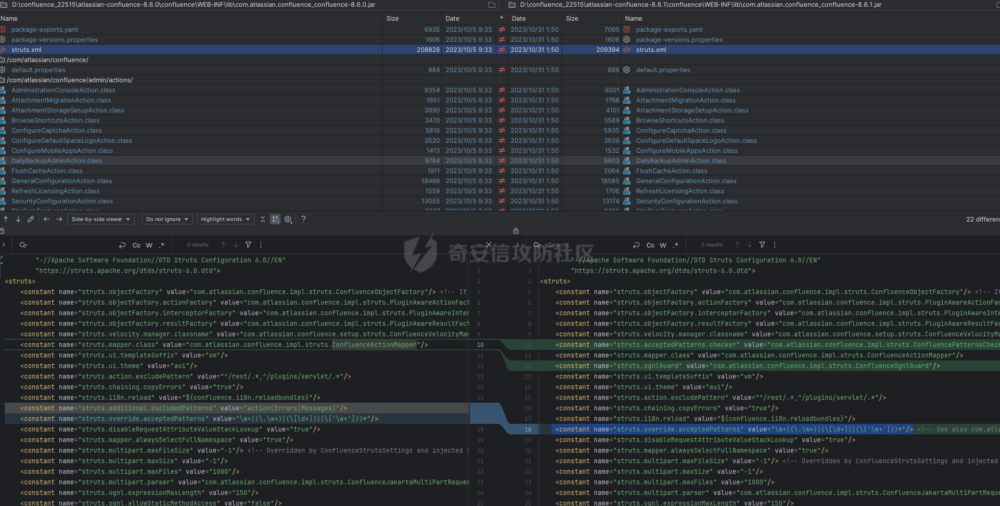  
修改很多，不过最引人注目的还是很多class文件都新增了两个注解，看起来就是对权限做了处理：

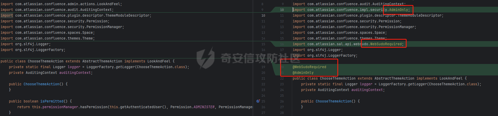  
那么就来了解下什么是`websudo`：

```php
WebSudo 是 Atlassian Confluence中的一项安全特性。它的目的是确保用户在执行一些敏感操作之前重新验证自己的凭据，以提高系统的安全性。  
​  
当一个已登录的用户试图进行一些可能对系统有重大影响的操作，例如更改系统设置、安装插件等，Confluence 会要求该用户重新输入密码来确认他们的身份。这种再次确认身份的机制称为 WebSudo。  
​  
因为和sudo很像，所以就叫了websudo。
```

看来关键点就在权限上了，再根据长亭的通告，因为confluence滥用了struts的继承关系，所以导致了部分权限绕过，并且漏洞利用会导致数据丢失。

在diff代码的时候看到了如下内容，最开始的思路是直接通过`bootstrap`来把`confluence`的数据库切换到自己的数据库上（当然当时我并不了解confluence的bootstrap是干嘛的），走了弯路，后来想了想这样的话也不会丢失数据无法恢复，应该是一种覆盖的操作才对：

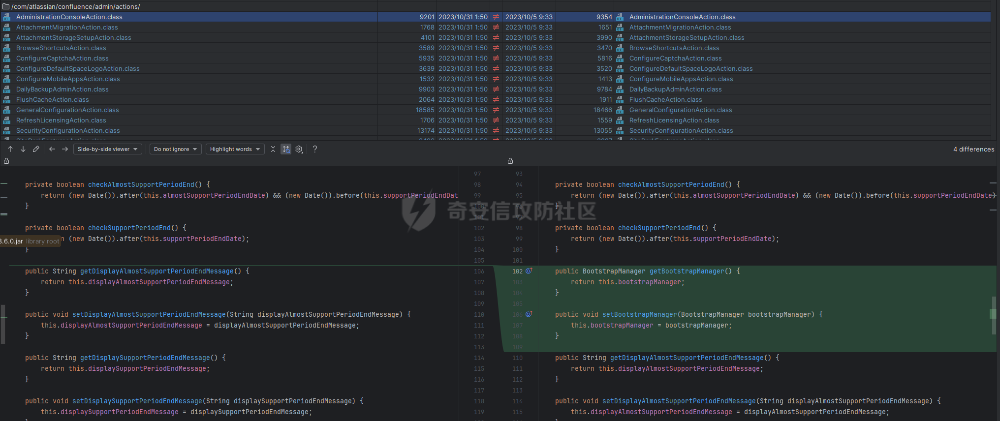

既然说到了权限问题，这里可以简单了解下：

[https://struts.apache.org/core-developers/namespace-configuration](https://struts.apache.org/core-developers/namespace-configuration)

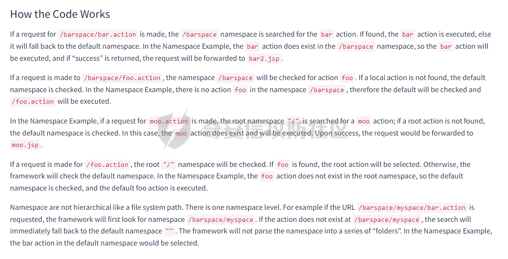  
实际上`confluence`不光是会去`defualt`来进行检查，而是会去被继承的`namespace`逐层递归到`default`，所以寻找继承了`admin`的`namespace`最后发现`struts.xml`中有这么一段：

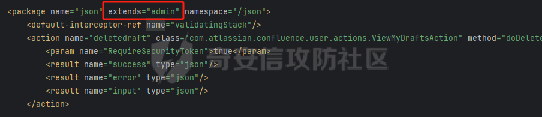  
说明`json`的命名空间可以进行递归到admin，也就是通告中说的滥用继承关系导致部分权限绕过。

那么接下来就明了了，只需要寻找能够破坏数据的功能就可以了，实在是不想看官方文档，让我们感谢人工智能：

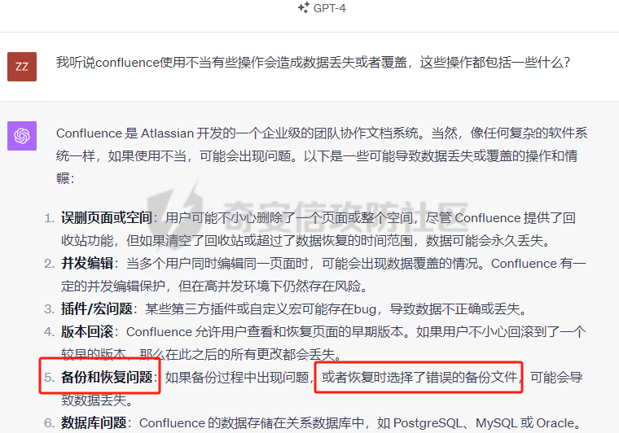

很好，接下来就可以去confluence里面看备份相关的东西了：

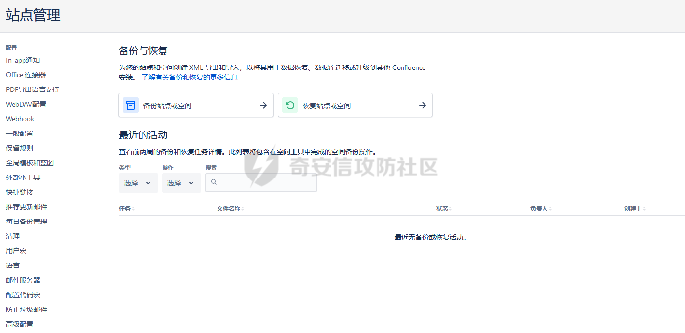

经过了几次创建和还原可以确定这里确实能够还原admin的密码（毕竟是备份）。

直接创建一个备份并且下载下来，然后去搜索restore相关的action，最终在不断地尝试下定位到了一个action：

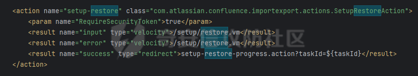  
尝试用`json`命名空间去访问这个action，得到了一些有趣的东西（注意这里要用POST进行访问）：

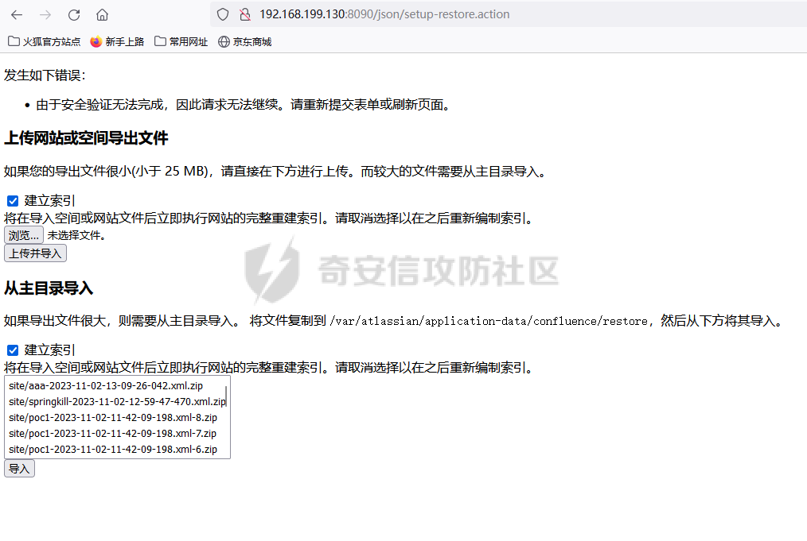

看到下面是我创建的很多备份文件，但是这里其实是有坑的，在直接构造一个文件上传包的时候，对面返回的相应是这样的：

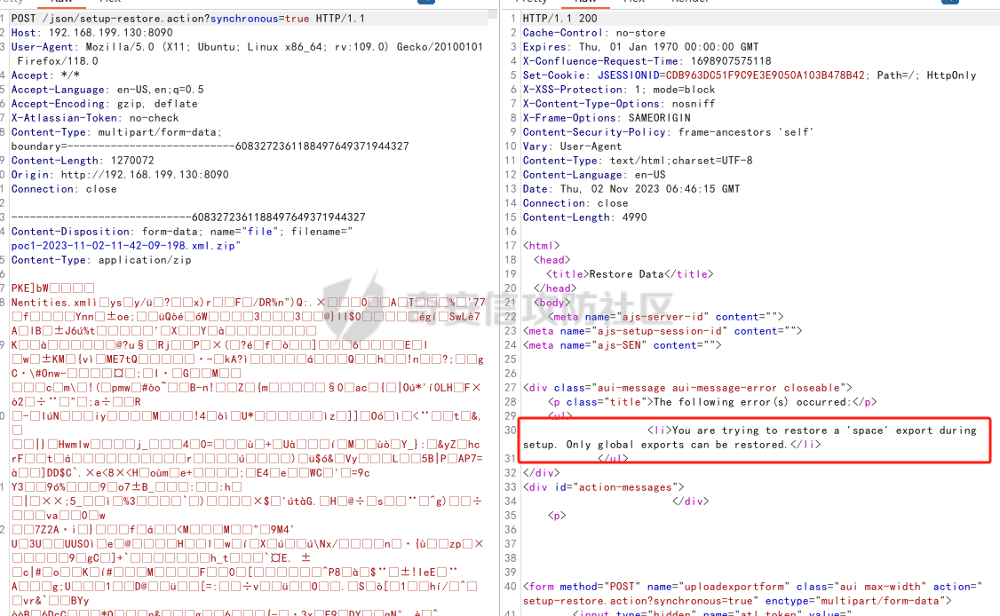

很奇怪，我明明创建的是`site`的包，为什么说我尝试恢复`space`，又创建了几个无果后，觉得还是要去看看代码，直接搜索提示语：

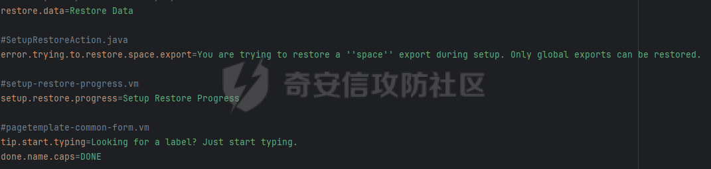  
然后进入`SetupRestoreAction.class`下个断点，可以看到导致这个问题的原因是`validate()`方法检验了一下`exportScope`是否是`ALL`，但是我们创建的是`SITE`好家伙，这哪有ALL的包啊：

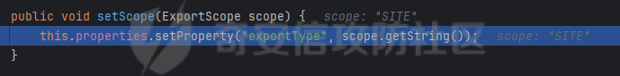

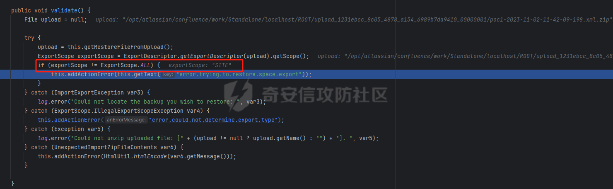

（其实在这里直接改成ALL应该接可以了）

但是我想找到根本原因，问题只能是出在备份的时候了，发现在confluence的备份中其实只有两个选项：

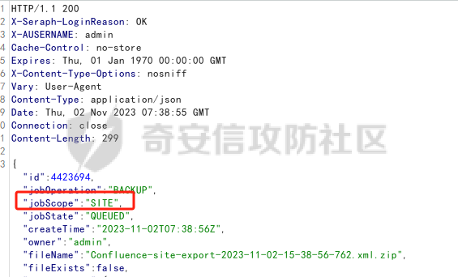

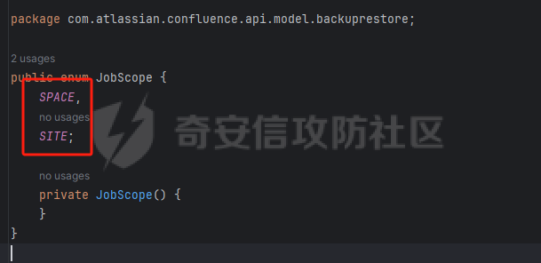  
因为这个漏洞太危险了，所以怎么解决这个问题的就不放了，再次提醒千万不要用在生产环境中。

重新构造数据包：  
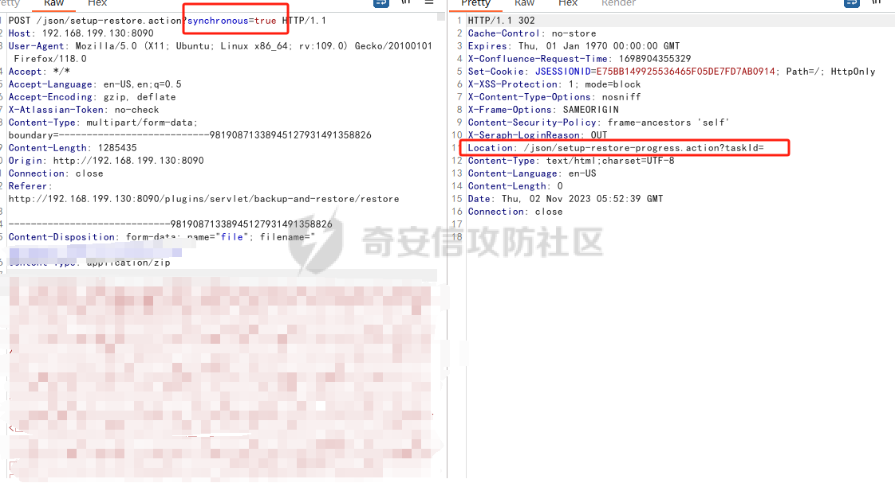  
可以看到跳转地址和struts.xml写的一样，这里要注意`synchronous=true`的设置，发送完包后等待一小会儿，就会将备份导入，当然原先设置好的管理员账号密码也会被备份中的内容覆盖。

## 效果如下

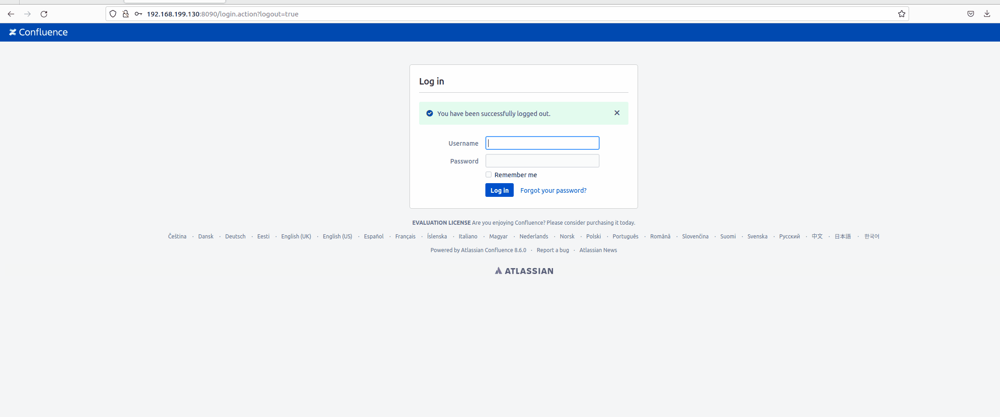

## RCE

参考历史漏洞即可RCE，老生常谈，不过多说啦。
