# 奇安信攻防社区-【Web实战】浅谈Jersey中常见的鉴权措施

### 【Web实战】浅谈Jersey中常见的鉴权措施

跟SpringMvc一样，Jersey也提供了类似过滤器和拦截器的功能，辅助进行类似鉴权类业务需求的开发。简单总结下Jersey中常用的鉴权措施。

# 0x00 前言

Jersey是一个开源的RESTful Web服务框架，它实现了JAX-RS规范（JAX-RS是Java API for RESTful Web Services的简称，它是Java EE的一个规范，提供了一组用于创建RESTful Web服务的API。）中定义的API，并提供了许多额外的特性和工具来简化RESTful Web服务的开发。

跟SpringMvc一样，Jersey也提供了类似过滤器和拦截器的功能，辅助进行类似鉴权类业务需求的开发。下面简单总结下Jersey中常用的鉴权措施。

# 0x01 常见鉴权措施

## 1.1 过滤器

Jersey过滤器是`javax.ws.rs.container.ContainerRequestFilter`和`javax.ws.rs.container.ContainerResponseFilter`接口的实现。这些过滤器分别用于处理HTTP请求和响应。

在鉴权场景中，比较常用的是ContainerRequestFilter，其提供了在 JAX-RS 应用程序中过滤 HTTP 请求的方法，并允许开发人员修改或拒绝请求。

该接口只包含一个方法，接收一个`ContainerRequestContext`对象作为参数，该对象表示当前请求的上下文信息，包括请求头、URI、HTTP 方法、实体等信息：

```Java
public void filter(ContainerRequestContext requestContext) throws IOException;
```

通过该接口可以实现一些类似权限控制的功能。

例如下面的例子，通过获取请求header中的Authorization进行身份认证，若验证失败返回401状态码：

```Java
public class AuthenticationFilter implements ContainerRequestFilter {

    @Override
    public void filter(ContainerRequestContext requestContext) {
        // 在此处进行身份验证操作
        if (!isAuthenticated(requestContext)) {
            requestContext.abortWith(Response.status(Response.Status.UNAUTHORIZED).build());
        }
    }

    private boolean isAuthenticated(ContainerRequestContext requestContext) {
        // 从请求头中获取认证信息，并进行认证操作
        String authHeader = requestContext.getHeaderString("Authorization");
        // ...
        return true; // 身份验证通过
    }

}
```

然后使用 `ResourceConfig`实例注册上面的过滤器：

```Java
@Component
public class AppConfig extends ResourceConfig {

    AppConfig() {
        register(AuthenticationFilter.class);
        ......
    }
}
```

配置好后过滤器即可生效，可以看到当请求的request缺少Authorization时，认证失败返回401 status：

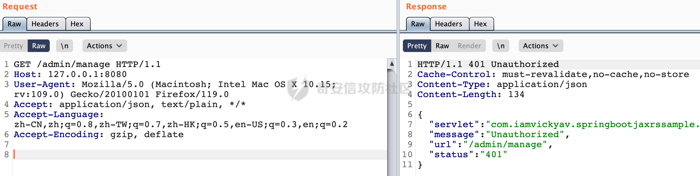

相比SpringMvc中的Filter，ContainerRequestFilter并没有类似@WebFilter或者FilterRegistrationBean来对Filter的生效范围进行配置。

默认情况下，ContainerRequestFilter将拦截到所有进入Jersey应用程序的HTTP请求。也就是说，无论请求的路径是什么，只要能匹配到对应的资源方法，对应的请求都会受到该过滤器的影响。同样是上面的例子，当访问一个不存在的资源/test时，可以看到并不会经过AuthenticationFilter的处理，返回404 status:

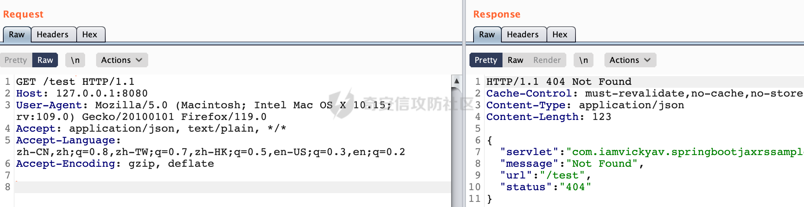

若想在找到实际资源之前进行拦截，可以考虑在对应的Filter中使用@PreMatching注解，可以在启动请求匹配之前执行的请求过滤器，即可以修改请求的资源，影响匹配的方法。同样是上面的例子：


可以看到当启用PreMatching注解后，访问一个不存在的资源/test时，会经过AuthenticationFilter的处理并因为鉴权认证不通过返回401 status：

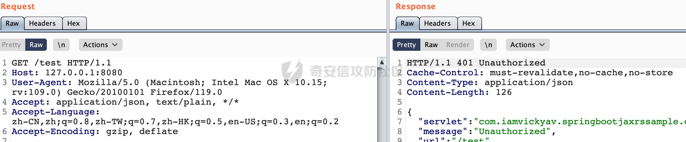

实际鉴权场景会比上述案例更复杂，经常需要根据不同的资源进行权限的区分，而ContainerRequestFilter将拦截到所有进入Jersey应用程序的HTTP请求，明显满足不了类似区分资源更复杂的需求(只针对某一些资源方法执行过滤器处理)。所以Jersey也提供了对应的方案，对自定义鉴权措施进行补充。下面是具体的实现方式：

### 1.1.1 UriInfo处理

`javax.ws.rs.core.UriInfo`提供了有关当前请求URI的各种信息。可以通过ContainerRequestContext的getUriInfo方法进行获取：

```Java
UriInfo uriInfo = requestContext.getUriInfo();
```

获取到UriInfo后，可以调用其方法来获取请求Path信息。基于Path可以完成针对某一些资源方法执行过滤器处理。

以请求[http://127.0.0.1:8080/api/manage;bypass/](http://127.0.0.1:8080/api/manage;bypass/) 为例，查看UriInfo中各个方法的返回值：

| 方法名 | 功能  | 返回值 |
| --- | --- | --- |
| getAbsolutePath() | 获取请求的绝对路径 | [http://127.0.0.1:8080/api/manage;bypass/](http://127.0.0.1:8080/api/manage;bypass/) |
| getPath() | 获取请求的路径部分 | api/manage;bypass/ |
| getRequestUri() | 返回一个URI对象，表示客户端发出请求的完整请求URI | [http://127.0.0.1:8080/api/manage;bypass/](http://127.0.0.1:8080/api/manage;bypass/) |
| getPathSegments() | 返回一个List对象，其中包含路径中每个段的字符串值 | \[api, manage, \] |

可以看到除了getPathSegments以外，其他获取到的返回值均未进行标准化处理。如果只是简单的使用startwith或者contiain方法进行白名单/黑名单的鉴权处理的话，在某种情况下是存在绕过的可能的。

除了UriInfo以外，使用`requestContext.getUriInfo().getRequestUri()`方法来获取访问请求的URI后，可以调用相应方法来获取各种URI组件的信息，包括请求的path，同样以以请求[http://127.0.0.1:8080/api/manage;bypass/](http://127.0.0.1:8080/api/manage;bypass/) 为例，查看各个方法的返回值，同样的均未进行标准化处理：

| 方法名 | 功能  | 返回值 |
| --- | --- | --- |
| getPath() | 返回请求URI的路径部分，并解析任何转义字符（如URL编码的斜杠） | /api/manage;bypass/ |
| getRawPath() | 返回请求URI的路径部分，但不进行解码或规范化 | /api/manage;bypass/ |

其次，`requestContext.getUriInfo().getRequestUri().compareTo()`方法用于比较两个URI，这个方法返回一个整数值，表示两个URI的排序顺序。如果两个URI相等，则返回0；如果第一个URI小于第二个URI，则返回负数；否则，返回正数。但是该方法比较`http://127.0.0.1:8080/api/manage;bypass/`和`http://127.0.0.1:8080/api/manage`同样会认为不是一个URI。

除了UriInfo以外，同样也可以使用HttpServletRequest进行处理。只需要通过@Context在过滤器中引入即可。若直接使用类似request.getRequestURI()方法进行路径判断的话，同样会存在因为没有对请求的uri进行规范化导致鉴权绕过的风险：

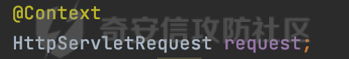

**默认情况下Jersey不会对请求path进行解码操作，同时类似路径穿越符../也不会进行处理，但是类似;矩阵参数会进行处理。同时在Jersey中，默认情况下/admin/manage跟/admin/manage/访问的是同一个资源**。

在审计过程中可以结合Jersey的解析特点，快速判断基于UriInfo的path资源划分是否存在缺陷从而导致权限绕过的风险。

### 1.1.2 ResourceInfo处理

前面提到使用UriInfo可能会因为规范化的问题导致权限绕过。Jersey还提供了`javax.ws.rs.container.ResourceInfo`。

ResourceInfo中主要包含一些资源信息，可获取处理请求的资源类和方法，经常会配合自定义注解完成一系列的鉴权操作。下面是一些常用的方法：

-   getResourceClass():获取包含当前资源方法的资源类（resource class）的Class对象。
-   getResourceMethod():获取当前处理的资源方法的Method对象。Method对象包含有关资源方法的详细信息，如方法名称、参数、返回类型等。

在使用ResourceInfo需要注意，当在对应的Filter中使用@PreMatching注解，在启动请求匹配之前执行的请求过滤器时，是没办法通过ResourceInfo获取资源信息的（因为此时还没匹配到对应的资源）。

### 1.1.3 @NameBinding使用

JAX-RS提供了`NameBinding`机制，该机制允许创建自定义的注解，并将这些注解与过滤器或拦截器相关联，以便更精确地控制它们的应用范围。看一个具体的例子：

假设部分资源是需要admin角色才能访问的，此时直接使用ContainerRequestFilter明显没办法满足需求。可以考虑使用@NameBinding处理。

首先定义一个注解类RequireAdminRole,并且在该注解上添加了一个@NameBinding注解,表示这是JAX-RS中的一个名称绑定标记：

```Java
@Target({ ElementType.TYPE, ElementType.METHOD })
@Retention(RetentionPolicy.RUNTIME)
@NameBinding
public @interface RequireAdminRole {
}
```

然后定义一个过滤器AdminAuthFilter，用于对当前请求的用户身份进行鉴权，若非admin用户则返回403:

```Java
@Provider
@RequireAdminRole
public class AdminAuthFilter implements ContainerRequestFilter {

    @Override
    public void filter(ContainerRequestContext requestContext) {
        // 在此处进行身份验证操作
        if (!isAdmin(requestContext)) {
            requestContext.abortWith(Response.status(Response.Status.FORBIDDEN).entity("无权限访问").build());
        }
    }

    private boolean isAdmin(ContainerRequestContext requestContext) {
        // 判断当前用户身份是否是Admin
        // ....
        return true; // 身份验证通过
    }
}
```

在`ResourceConfig`实例注册过滤器后，最后在对应的资源方法上添加@RequireAdminRole注解就可以了:

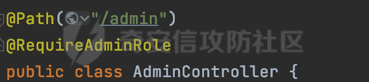

可以看到当以非admin用户身份进行请求资源时，AdminAuthFilter生效，返回403 status：

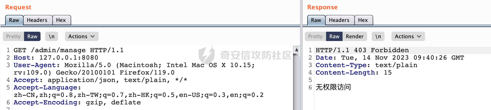

但是非AdminController注册的资源是可以不受AdminAuthFilter影响的。

但是这里有个问题，@NameBinding绑定分散在各个资源类的各个资源方法上，如果检查某个过滤器到底过滤了哪些资源方法是有一定难度的，也不利于维护。

### 1.1.4 动态绑定

在JAX-RS中，除了NameBinding的匹配方式，还提供了动态绑定的方式来统一配置过滤器/拦截器的匹配规则。可以通过实现动态特征接口`javax.ws.rs.container.DynamicFeature`，在运行期对匹配的方法进行绑定。

该接口的主要方法是`configure(ResourceInfo, FeatureContext)`，该方法在JAX-RS应用程序初始化时调用。`ResourceInfo`提供了关于正在注册的资源方法的信息，而`FeatureContext`一般用于根据实际情况动态添加或移除过滤器:

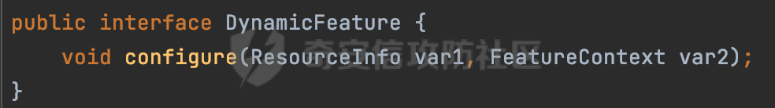

还是刚刚的例子，假设AdminController下的所有注册资源都需要经过AdminAuthFilter处理：

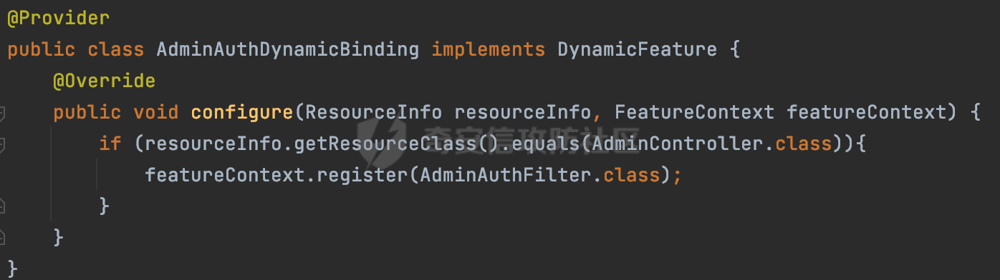

当该接口注册生效时，可以看到当以非admin用户身份进行请求资源时，AdminAuthFilter生效，返回403 status：


这里可以基于ResourceInfo结合正则表达式的方式进行匹配，在审计时也需要额外关注对应的匹配覆盖度是否合理，避免出现不必要的权限绕过操作。

## 1.2 自定义注解

除了过滤器以外，Jersey也支持自定义注解的方式进行鉴权。Jersey中的AOP是基于HK2框架实现的。看一个具体的例子，这里定义一个登陆鉴权用的注解@Login，用于避免未授权访问：

```Java
@Target({ ElementType.TYPE, ElementType.METHOD })
@Retention(RetentionPolicy.RUNTIME)
@NameBinding
public @interface Login {
}
```

然后定义这个注解的方法拦截器：

```Java
@Login
public class AuthenticationInterceptor implements MethodInterceptor{

    @Override
    public Object invoke(MethodInvocation methodInvocation) throws Throwable {
        //登陆校验逻辑
        //......
        return Response.ok().entity("未登陆，无权限访问").build();
    }
}
```

Jersey在调用方法拦截器的时候，需要InterceptionService的实现，这里对AuthenticationInterceptor进行绑定，该接口中有三个方法，在执行对应的接口方法之前会调用getMethodInteceptors()方法，获取对应的方法拦截器并执行：

```Java
public class AuthInterceptor implements InterceptionService {

    private static Map<Annotation, MethodInterceptor> map = new HashMap<>();
    static {
        Annotation[] annotations = AuthenticationInterceptor.class.getAnnotations();
        for (Annotation annotation : annotations) {
            map.put(annotation, new AuthenticationInterceptor());
        }
    }

    @Override
    public Filter getDescriptorFilter() {
        return new Filter() {
            @Override
            public boolean matches(Descriptor descriptor) {
                return true;
            }
        };
    }

    @Override
    public List<MethodInterceptor> getMethodInterceptors(Method method) {
        Annotation[] annotations = method.getAnnotations();
        List<MethodInterceptor> list = new ArrayList<>();
        for (Annotation annotation :annotations){
            if(map.get(annotation) != null){
                list.add(map.get(annotation));
            }
        }
        return list;
    }

    @Override
    public List<ConstructorInterceptor> getConstructorInterceptors(Constructor<?> constructor) {
        return null;
    }
}
```

整体实现思路是首先将注解与方法拦截器绑定，通过方法上的注解，获取方法对应的拦截器并执行。最后完成注册就可以使用了。在对应的资源上使用@Login注解:

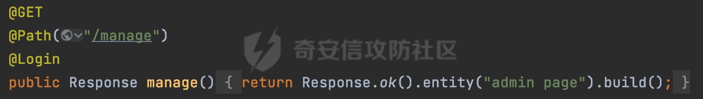

可以看到非登陆情况下禁止访问：

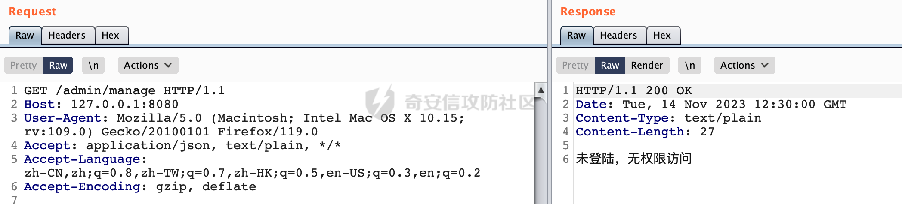

注意这里使用的是MethodInterceptor，主要作用在资源方法级别上的，在class上使用时无效的。在使用时需要额外的注意。同时这种方式实现的鉴权执行顺序会在过滤器之后，在审计时可以额外关注看看有没有执行顺序导致的权限绕过问题。

除此之外，在Jersey中，还提供了标准的 JAX-RS 注释，用于进行资源方法的权限控制的安全注解。这些注解通常与`ContainerRequestFilter`一起使用，以实现对资源的访问控制：

-   @PermitAll
-   @DenyAll
-   @RolesAllowed

可以通过在Filter中注入ResourceInfo，配合进行使用，看一个具体的例子，这里以@RolesAllowed为例，通过该注解完成各个资源的垂直越权校验：

在ContainerRequestFilter的核心方法中，通过ResourceInfo获取当前请求资源的注解，然后通过对应资源@RolesAllowed注解的值，判断当前登陆的用户角色是否合理：

```Java
@Override
public void filter(ContainerRequestContext requestContext) throws IOException {
    //......
    Method method = resourceInfo.getResourceMethod();
    if(method.isAnnotationPresent(RolesAllowed.class)){
        RolesAllowed rolesAnnotation = method.getAnnotation(RolesAllowed.class);
        Set<String> rolesSet = new HashSet<String>(Arrays.asList(rolesAnnotation.value()));

        //获取当前用户身份凭证
        //......

        //判断用户角色是否合理
        if(!isUserAllowed(user,rolesSet))
        {
            requestContext.abortWith(Response.status(Response.Status.UNAUTHORIZED)
                    .entity("您没有该资源的访问权限").build());
            return;
        }

    }
}
```

然后在对应的资源标记@RolesAllowed注解，并指定必须是ADMIN身份才允许访问：

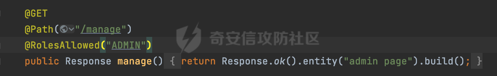

可以看到当以非ADMIN身份尝试访问对应接口时，提示没有访问权限：


## 1.3 鉴权框架

除了上述的措施以外，因为Jersey框架是在Servlet规范之上构建的，它利用了Servlet API来处理HTTP请求和响应。Jersey的核心部分实际上是一个Servlet（`ServletContainer`），负责将传入的HTTP请求映射到相应的资源类和方法，并处理HTTP响应。同样的类似Shiro、SpringSecurity这类主流的鉴权框架同样也适用。

但是在使用过程中，同样需要考虑Jersey实际的路由解析过程（跟Spring的PathPattern模式有点像），**默认情况下Jersey不会对请求path进行解码操作，同时类似路径穿越符../也不会进行处理，但是类似;矩阵参数会进行处理。同时在Jersey中，默认情况下/admin/manage跟/admin/manage/访问的是同一个资源**。避免不必要的权限绕过风险。

最常见的一个例子就是当使用低版本Shiro进行鉴权时，因为Shiro是会对路径穿越符进行处理的，通过两者的解析差异在特定的路由下可能存在权限绕过的风险（CVE-2023-34478）。

# 0x02 其他

Jersey中request拦截器主要是javax.ws.rs.ext.ReaderInterceptor跟javax.ws.rs.ext.WriterInterceptor接口的实现。与此同时，前面提到的@NameBinding以及动态绑定操作同样也适用于拦截器。但是Jersey的拦截器跟Spring中的不太一样，主要用于操作HTTP请求或响应的Body中的Entity数据流，如对Entity数据流进行压缩/解压缩，JSON格式与Java对象之间的转换等。

以上是Jersey中常见鉴权措施的介绍，在审计对应的应用代码时可以额外关注类似的问题，例如解析顺序、动态绑定的匹配逻辑是否合理、UriInfo路径匹配是否存在绕过等。避免权限绕过的风险。
