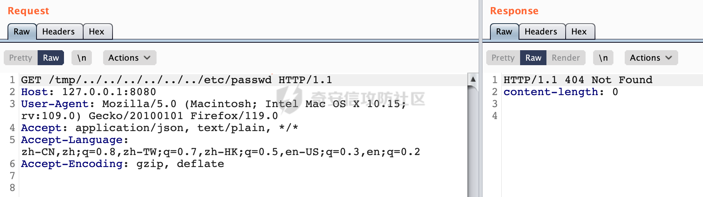

# 奇安信攻防社区-【Web实战】浅谈Reactor Netty HTTP Server目录穿越漏洞（CVE-2023-34062）

### 【Web实战】浅谈Reactor Netty HTTP Server目录穿越漏洞（CVE-2023-34062）

Spring官方近期披露了CVE-2023-34062，在 Reactor Netty HTTP Server 中，1.1.x 版本在 1.1.13 之前以及 1.0.x 版本在 1.0.39 之前存在安全漏洞。在特定情况下，攻击者可以通过发送一个特定的 URL 的请求来触发目录遍历攻击。

# 0x00 关于Reactor Netty HTTP Server

Reactor Netty提供了易于使用和配置的HttpServer。它隐藏了创建HTTP服务器所需的大部分Netty的功能，是用于构建响应式的、非阻塞的 HTTP 服务器的一部分。使得开发者能够方便地构建高性能、响应迅速的 Web 应用。


以下结合实际使用进行简单的介绍：

这里使用 Reactor Netty HttpServer构建了一个简单的 HTTP 服务器，并通过设置一个路由，定义了一个 RESTful 端点 "/hello"。当客户端通过 HTTP GET 请求访问 "/hello" 时，服务器将返回 "Hello, World!" 的响应：

1.  创建 `HttpServer` 实例，指定端口为 8080。
2.  使用 `route` 方法配置服务器的路由，添加了一个处理 "/hello" 路径的处理器，该处理器在接收到请求时发送 "Hello, World!" 的响应。
3.  使用 `bindNow()` 方法启动服务器，并将其绑定到指定的端口。
4.  使用 `onDispose().block()` 方法进行阻塞操作，确保在服务器关闭之前等待所有正在处理的请求完成。是一种优雅关闭服务器的方式。

```Java
DisposableServer server = HttpServer.create().port(8080)
                .route(routes -> {
                    routes.get("/hello", (request, response) -> response.sendString(Mono.just("Hello, World!")));
                }).bindNow();
        server.onDispose()
                .block();
```

具体效果如下：


# 0x01 漏洞描述

Spring官方近期披露了CVE-2023-34062，在 Reactor Netty HTTP Server 中，1.1.x 版本在 1.1.13 之前以及 1.0.x 版本在 1.0.39 之前存在安全漏洞。在特定情况下，攻击者可以通过发送一个特定的 URL 的请求来触发目录遍历攻击。 具体而言，如果通过 Reactor Netty HTTP Server 配置用于提供静态资源，那么应用程序就可能存在风险。


**影响版本**

-   Reactor Netty
    
    -   1.1.0 to 1.1.12
    -   1.0.0 to 1.0.38
    -   更旧的不再支持的版本

# 0x02 原理分析与复现

以reactor-netty-http-1.0.35为例进行分析。

根据漏洞描述，当通过 Reactor Netty HTTP Server 配置用于提供静态资源，那么应用程序就可能存在风险。

查阅官方文档[https://projectreactor.io/docs/netty/release/reference/index.html#\\\_static\\\_resources](https://projectreactor.io/docs/netty/release/reference/index.html#%5C_static%5C_resources) ,这里提供了通过reactor.netty.http.server.HttpServerRoutes#file方法，用于配置处理静态文件的路由规则的案例：


根据对应的方法，搭建具体环境测试：

这里以映射/tmp目录下的test.txt文件为例：


```Java
Path file = Paths.get("/tmp/test.txt");
        DisposableServer server = HttpServer.create().port(8080)
                .route(routes -> {
                    routes.file("/hello",file);
                }).bindNow();
        server.onDispose()
                .block();
```

启动服务后访问/hello成功读取到对应test.txt文件的内容：


在Reactor Netty中设计了一个HttpServerRoutes接口，该接口继承了BiFunction，用来路由请求。当请求到达时，会根据设计的路由规则，按顺序依次查找，直到完成第一个匹配，然后调用对应的处理handler。HttpServerRoutes接口内针对常用的get、head、post、put、delete等请求类型分别设计了相应的路由规则。

首先看下reactor.netty.http.server.HttpServerRoutes#file的具体实现：


最终实际调用的方法如下，当请求的 URI 满足指定的条件时，将根据文件路径path处理 HTTP 请求，发送相应的文件内容。如果文件不存在或不可读，将发送空的响应：


因为path参数在一开始就是硬编码设置好的，所以在这里尝试进行目录穿越也是没办法读取到/etc/passwd内容的：


在HttpServerRoutes接口中可以看到，除了file方法以外，还可以使用reactor.netty.http.server.HttpServerRoutes#directory方法配置静态资源：


通过 `routes.directory(String url, Path directory)` 配置，指定了服务器应该从文件系统的 directory参数目录中提供静态资源。这表示对于该路径下的文件，服务器将直接返回它们的内容给客户端，而不是执行任何处理逻辑。

这里创建了一个简单的Web服务器，配置了静态资源目录为/tmp，对于该路径下的文件，服务器将直接返回它们的内容给客户端，不会执行任何处理逻辑：

```Java
public static void main(String[] args){

        Path file = Paths.get("/tmp");
        DisposableServer server = HttpServer.create().port(8080)
                .route(routes -> {
                    routes.directory("/tmp",file);
                }).bindNow();
        server.onDispose()
                .block();
}
```

通过main方法启动服务，当尝试访问/tmp目录下的文件时，成功返回对应的内容：


查看具体的实现过程，实际的处理主要在reactor.netty.http.server.DefaultHttpServerRoutes#directory方法：


首先使用 route 方法配置一个路由规则。这个规则基于 HttpPredicate.prefix(uri)，表示当请求的 URI 以指定的 uri 前缀开头时，应用这个路由规则，在下面的逻辑里会定义路由规则的处理器，方便处理符合条件的 HTTP 请求：


这里会获取请求的 URI，并通过 replaceFirst(uri, "") 去除 URI 中的指定前缀，得到请求的相对路径 prefix,如果相对路径`prefix`不为空且以斜杠`/`开头，将斜杠去除:


然后构建文件系统路径，使用`directory.resolve(prefix)`将相对路径`prefix`解析为绝对路径：


具体resolve方法的实现，这里这主要是实现了两个字节数组（表示Unix系统中的路径）的解析和合并操作：


处理完后检查处理后的路径是否可读。如果可读，表示存在相应的静态资源，将执行以下操作：

-   如果存在拦截器 (interceptor != null)，则使用拦截器处理响应，并通过 sendFile(p) 发送文件内容。
-   如果没有拦截器，直接通过 resp.sendFile(p) 发送文件内容。
-   如果路径不可读，表示静态资源不存在或不可访问，通过 resp.sendNotFound() 返回 404 Not Found。


根据前面的分析，**整个过程并没有对uri中类似../目录穿越符进行处理**直接拼接到Path中读取文件内容，此时可以目录穿越读取其他路径下的文件，并直接返回它们的内容给客户端。

同样是上面的例子：

直接在uri上引入目录穿越符`../`尝试读取/etc/passwd的内容，可以看到由于缺少对应的安全措施成功目录穿越读取到对应的内容：


综上所述，**当使用存在漏洞版本的Reactor Netty 且通过reactor.netty.http.server.HttpServerRoutes#directory方法配置静态资源访问时，可能存在目录穿越的风险**。

# 0x03 修复方式

主要的修复在reactor.netty.http.server.DefaultHttpServerRoutes#directory方法，相比之前的逻辑，这里会调用`normalize()`方法将路径标准化，即解析任何`.`（当前目录）和`..`（上一级目录）的引用，如果规范化后的请求资源路径不是以设置的静态资源目录开头的话，返回resp.sendNotFound，表示内容不存在。通过对请求内容的规范化处理避免了目录遍历的风险：


同样是上面的例子，在pom中显式依赖1.0.39安全版本的Reactor Netty：


此时再次尝试结合目录穿越符去读取/etc/passwd的内容，返回404 status，利用失败：


