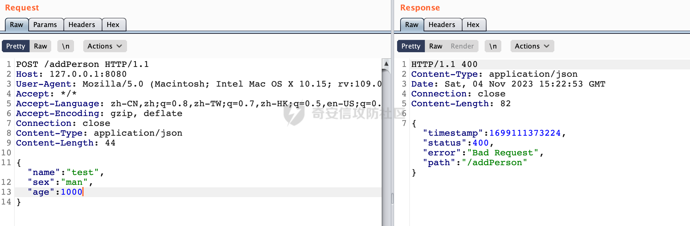

# 奇安信攻防社区-【Web实战】浅谈Spring中的Controller参数的验证机制

### 【Web实战】浅谈Spring中的Controller参数的验证机制

在应用程序的业务逻辑中，数据校验是必须要考虑和面对的事情。应用程序必须通过某种手段保证输入进来的数据是安全可靠的。浅谈Spring中的Controller参数的验证机制。

# 0x00 前言

在应用程序的业务逻辑中，数据校验是必须要考虑和面对的事情。应用程序必须通过某种手段保证输入进来的数据是安全可靠的，例如出于性能和安全的考虑，会限制默认分页查询的单页最大数量等等。


# 0x01 使用Bean Validation进行参数校验

Bean Validation是Java定义的一套基于注解的数据校验规范，**Hibernate Validator** 是 Bean Validation 的实现，它扩展了 Bean Validation 规范，提供了更多的验证功能，包括自定义验证器的编写、国际化支持等。开发人员可以使用 Hibernate Validator 来定义和执行验证规则，确保对象的属性值在满足特定条件时是有效的。

spring boot应用可以直接引入对应的依赖进行使用：

```XML
<dependency>
   <groupId>org.springframework.boot</groupId>
   <artifactId>spring-boot-starter-validation</artifactId>
</dependency>
```

查看对应的pom文件可以发现实际是对Hibernate Validator进行了封装：


看一个实际的例子,这里传入Person对象，并通过@Valid启用校验：

```Java
@RequestMapping("/addPerson")
public ApiResponse<Boolean> addPerson(@Valid @RequestBody Person person) {
    //调用service方法添加Person
    ......
    ApiResponse<Boolean> response = new ApiResponse<>(200, "Success", result);
    return response;
}
```

在Person中可以看到，这里主要是对对应的参数做了非空校验，以及限制了age参数的范围为1-100:

```Java
@Data
public class Person {

    @NotBlank(message = "姓名不能为空")
    private String name;
    @NotBlank(message = "性别不能为空")
    private String sex;
    @NotNull(message = "年龄不能为空")
    @Range(message = "range from 1 to 100", min = 1, max = 100)
    private Integer age;

}
```

具体效果，当尝试调用addPerson接口时，仅仅传递name参数的话会报错，从log可以看到要求sex和age不为null:


同样的，当age大于100时，对应参数age检测同样不通过：




除了@Valid以外，还有一个 Spring 框架中提供的比较常用的注解@Validated，其对@Valid进行了二次封装并提供了分组校验功能，允许根据具体情况对不同的约束条件进行分组，以实现更细粒度的校验。


同时@Validated 注解提供了更多的高级功能，例如可以在类级别上定义约束条件，并在该类的方法中使用，但是相比@Valid不能用于成员属性（field）:


更多具体使用的方法这里就不进行展开了。

# 0x02 SpringWeb Controller参数校验过程

结合上面的例子，那么springmvc接口方法中是如何对标注有@Validated或@Valid参数进行校验的呢？

SpringMvc参数解析是由HandlerMethodArgumentResolver的实现进行，具体解析逻辑位于#resolveArgument方法中。参数校验这块应该也是在在对应的方法参数解析器里执行的。SpringMVC参数处理过程可以参考[https://forum.butian.net/share/2372。](https://forum.butian.net/share/2372%E3%80%82)

上例中@RequestBody修饰的参数解析，是通过RequestResponseBodyMethodProcessor参数解析器进行处理的。以spring-webmvc-5.3.21为例，查看其resolveArgument方法的具体逻辑与处理过程。

首先通过使用转换器readWithMessageConverters把request请求转换出来，拿到对应的值并获取入参的名称：


只有存在binderFactory才会去完成自动的绑定&校验，同时只有传递参数才需要去绑定校验，这里核心的校验主要是`validateIfApplicable`方法：


在`validateIfApplicable`方法中，首先会调用getParameterAnnotations方法获取标注在此参数上的所有注解们（例如上面例子中的@Valid和@RequestBody两个注解），然后调用ValidationAnnotationUtils.determineValidationHints方法进行处理，主要是判定这个参数对象是否有满足参数校验条件的注解，并且返回对应的分组信息：


如果给定的注解是 `javax.validation.Valid`，则返回一个空对象数组 EMPTY\_OBJECT\_ARRAY。否则查找是否存在 `@Validated` 注解，若存在的话调用`convertValidationHints(hints)` 方法获取其中的值（hints），并且返回对应的分组信息（`@Validated` 注解的分组功能）。同时，**如果注解是以Valid开头的话，也会有类似的效果**：


这里简单验证下，自定义注解@ValidCheck:


同样是上面的例子，这里传入Person对象，这里通过@ValidCheck启用校验，当尝试调用addPerson接口时，仅仅传递name参数的话会有同样的效果。：

```Java
@RequestMapping("/addPerson")
public ApiResponse<Boolean> addPerson(@ValidCheck @RequestBody Person person) {
    //调用service方法添加Person
    ......
    ApiResponse<Boolean> response = new ApiResponse<>(200, "Success", result);
    return response;
}
```

判定完校验条件后，接着回到`validateIfApplicable`方法方法中调用binder.validate(validationHints)。最终调用org.hibernate.validator.internal.engine.ValidatorImpl#validateValue，这里是实际的校验逻辑：


同时相关注解还可以作用在类或者方法上，这里是另外一套解析逻辑，不深入展开。

# 0x03 常见的安全问题

在实际的应用程序的业务逻辑中，JavaBean的设计会比较复杂，例如会通过继承/级联的方式进行拓展。Bean Validation显然也考虑到了类似的情况，做了一定的处理。

看一个实际的例子，在前面Person的基础上，新建了Employee并继承了Persion进行拓展，校验了职位不能为空：

```Java
@Data
public class Employee extends Person{

    @NotBlank(message = "职位不能为空")
    private String position;

}
```

同样的在Controller中，这里传入Employee对象，并通过@Valid启用校验：

```Java
@RequestMapping("/addEmployee")
    public ApiResponse<String> addEmployee(@Valid @RequestBody Employee employee, BindingResult bindingResult) {
        //调用service方法添加Employee
        //.....
        ApiResponse<Boolean> response = new ApiResponse<>(200, "Success", result);
        return response;
}
```

具体效果，当尝试调用/addEmployee接口时，不传递name参数的话会报错，从log可以看到要求姓名不能为空:


**这里经常会有一个误区，因为继承场景下是可以覆盖父类的属性校验的，很多时候会认为springmvc接口方法中是标注有@Validated或@Valid参数即可递归校验所有的属性**。

看一个实际的业务场景，在SQL查询中，OrderBy子句的内容通常是动态的，根据不同的查询需求可能会有不同的排序字段和排序方式。正因为OrderBy子句的内容是动态生成的，预编译无法处理动态的SQL语句。所以常常这类场景会存在SQL注入的风险。那么在平时构建sql时，就需要对类似排序字段的参数进行校验，避免SQL注入的风险。

这里定义了一个Page类，用于SQL分页，并包含用于排序（orderBy）的关键属性，这里对orderBy进行了校验，限制了排序字段仅允许包含字母（大小写），数字，连字符，下划线和点号的字符串，避免了sql注入的问题：


在Controller接口中传递Page对象，并通过@Valid启用校验，正常情况下查询排序结果：


当orderBy的值包含空格时，无法正常查询，从log可以看到对orderBy字段的要求，从一定程度上规避了sql注入的风险：


在实际情况中，还可能对Page进行封装，例如作为属性级联到其他JavaBean中。例如这里作为User对象的属性进行引入：


那么这种情况下，是不是跟前面想的一样，springmvc接口方法中是标注有@Validated或@Valid参数即可递归校验所有的属性？


实际上在User中的Page对象并不会进行参数校验。这里对Controller传入的User对象使用@Valid进行校验：

```Java
@RequestMapping("/search")
public ApiResponse<List<Row>> search(@Valid @RequestBody User user) {
   ......
}
```

正常情况下，对FIRST\_NAME进行排序，正常返回：


按照前面的设计，orderBy属性通过正则进行处理，限制了输入，类似空格等内容是不允许的，但是可以看到，再请求时并没有进行相关的限制，可以正常使用并查询：


因为这里参数校验失效了，那么就可以进行SQL注入利用了，案例中使用的是H2 database，在没有屏蔽错误信息的情况下，可以考虑使用报错注入进行利用。FILE\_READ函数是支持文件名和URL的方式进行读取的。这里尝试访问一个不存在的路径将查询结果返回，例如查询user()，可以看到成功利用获取到对应的数据库用户为SA:


那么正确的使用方式是怎么样的呢？

@Valid注解可用于验证**级联**的属性、方法参数或方法返回类型。同时，通过使用@Valid可以实现**递归验证**。正确的方式应该是使用@Valid注解对这类属性进行标记：


还是刚刚的例子，此时尝试在属性内容中输入空格，可以看到已经无法正常查询：


所以在使用Bean Validation进行参数校验时需要额外注意。避免上述参数校验失效的情况导致安全风险的发生。同样的，在日常代码审计中，也需要关注JavaBean中的校验方式是否合理，提前发现存在缺陷的应用代码。
