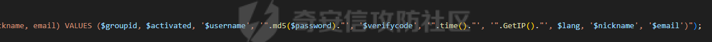

# 奇安信攻防社区-【Web实战】记一次前台getshell组合拳审计的完整过程

### 【Web实战】记一次前台getshell组合拳审计的完整过程

本文内容仅限学习所用，请不要利用文中消息进行危害性测试。为保护此源码使用者的安全，本文中的源码系统名将做打码处理。 初学者学习中的小小收获，各位大佬轻喷。 1 整体审计 拿到源码，先做...

本文内容仅限学习所用，请不要利用文中消息进行危害性测试。为保护此源码使用者的安全，本文中的源码系统名将做打码处理。

初学者学习中的小小收获，各位大佬轻喷。

# 1 整体审计

拿到源码，先做一次整体审计，看一看整个代码的处理逻辑、是否有过滤控制器、是否有权限校验控制器等。

先看目录：


很明显有控制器，是模仿MVC形式的CMS。

## 1.1 权限控制

一共有两个入口index.php admin/index.php （感觉这样写的CMS很常见）。


查看两个文件，发现它们没有什么不同之处，定义了ROOT，然后进入APP:run()。除了admin文件夹下的index文件中定义了一个常量ADMINDIR。


跟进APP:run()，这里是整个CMS的核心。


很常见的路径转方法（伪静态？），如/index.php/\[controller\]/\[action\]/\[arag1\]/\[arg2\]。但由于其控制器分别在controllers和admin/controllers下，而访问控制脚本的函数使用的是不可控变量，所以不能通过普通控制器入口访问管理员的控制器。

这里还存在一个问题：它引入的时候貌似没有校验权限，是否普通用户可以越权调用admin的controller？

后面看了一下，其中一个类的构造函数处会进行鉴权。那就是看哪些控制器的构造函数没有鉴权 就能造成绕过。总而言之鉴权的地方不是统一的。

又看了一眼 发现是控制器的父类。那就是哪个父类不是这个（这样写的话可能性就会小很多）。后面看了一眼这个类包括了大部分后台HTML元素，那理论上所有控制器（除了API控制器）都会走这个类。

  
后面又发现，SAdmin虽然会检测session，但在session无效的时候并不会拦截，而只是会在session有效的情况下给SAdmin->data赋值。也就是说，具体的权限校验还是要在函数中实现。这给越权提供了空间。

然后发现后面校验权限是按照类似“校验权限字符是否在权限字符串中”的途径。

通过CheckAccess、CheckAction实现（这两个校验过程相同）：


同时，admin的data只赋值一次：


除了改数据库之外没办法混淆鉴权了。（也就是说，如果存在注入，有造成后台管理员登陆的可能）

## 1.2 过滤控制

进一步查看控制器文件夹，查看是否有负责整体过滤参数的控制器（SQL、XSS、文件上传等的过滤文件）。

这里的过滤文件为functions.globals.php。不过这里的过滤函数都不是主动调用的（有些CMS会包括此文件 然后此文件中会先一步处理所有参数，这里完全就是写了函数等待调用）

过滤函数这边先实体编码然后加斜杠，应该是绕不了。


引用过滤函数的则是这三个，如果其他地方都是由此处获取请求参数，那就无法造成SQL注入。


当然，在HTTP交互中会被后端接受的参数远不止GET、POST和Cookie（这里是大多数CMS的误区，又不喜欢过滤其他头又喜欢用其他头）。如果其他的头也会在交互中被获取并且没有经过这三个函数，或者某处的GET、POST参数没有经过这些过滤，即可造成注入。

# 2 审计漏洞列表

## 2.1 后台文件上传（可shell）

目录穿越的后台模版文件上传造成的getshell  
完全没有过滤相对路径+需要造成的模版文件后缀白名单造成的getshell（本来这个目录穿越还有点意义，结果我发现它根本没有限制入口为根目录文件夹- -，白穿越了）


## 2.2 后台注入（很鸡肋）

后台数据库管理中的功能。由于被输入的参数使用反引号包裹，而此CMS的过滤函数本身不过滤反引号，所以造成注入。  
POC为[http://localhost/admin/index.php/database/operate?dbaction=emptytable&amp;tablename=hong\\\_acat\`+where+cat\_id=2+and+sleep(2);--%20)#](http://localhost/admin/index.php/database/operate?dbaction=emptytable&amp;tablename=hong%5C_acat%60+where+cat_id=2+and+sleep(2);--%20)#) 注入形式如下，用#号作为注释符即可。实际上，全database.php都存在这个漏洞（只要带有\`$database\`）


## 2.3 后台目录穿越

大家都爱的没用垃圾洞，甚至不需要后台代码。


# 3 柳暗花明的前台注入

找了这么多后台的洞，总而言之还是没什么用的。毕竟对于小CMS而言我们都希望使用前台漏洞，高效快速还不用苦苦猜一个管理员口令。于是我开始找前台漏洞。越权我们之前已经看过了是越不了的，RCE没有条件，信息泄露也没有条件，上传在前台已经测试过了没有绕过可能。那么能找的高危漏洞只剩下注入一个了。

在第一节中我们已经找到了CMS的过滤函数并且确定了此过滤无法绕过。现在需要找到的就是那些没有被过滤函数保护且会涉及数据库查询的参数。

接下来则是无聊的看参数时间，由于此CMS没有统一过滤，可以直接在控制器的action函数中查看输入参数是否经过过滤函数。

## 3.1 代码分析

终于，在注册的地方找到了一个不经过过滤函数的参数：



这个GetIP()是没有经过过滤函数的。虽然大多数CMS中这个IP是不可控的，但笔者属于不是很信邪的那一款。于是跟进GetIP函数：


这里写成了：先去X-FORWARDED-FOR、CLIENT-IP或者getenv('REMOTE\_ADDR')（这个不可控是环境变量）取IP，如果这个IP不符合格式就返回gethostbyname($\_SERVER\['HTTP\_HOST'\])，否则是正则表达式过滤之后的IP。问题就在于gethostbyname()并不能取到过滤的作用，于是我们就能将任意字符插入查询参数中，造成注入。

造成注入的条件则是：  
1.存在X-FORWARDED-FOR或CLIENT-IP，且其值不为IP形式  
2.HOST置为payload

以此格式传入包，果然触发了数据库报错：


## 3.2 使用注入进入后台

此查询语句的原貌是：

```php
"INSERT INTO " . TABLE_PREFIX . "user (groupid, activated, username, password, verifycode, joindate, joinip, lang, nickname, email) VALUES ($groupid, $activated, '$username', '".md5($password)."', '$verifycode', '".time()."', '".GetIP()."', $lang, '$nickname', '$email')"
```

这里的groupid就是鉴权的ID（用户组ID）。由于这里就是注册点，这个注入可以被改造成这个形式，从而在注册时另外创建一个管理员账号，以此进入后台：

```php
INSERT INTO ***_user (groupid, activated, username, password, verifycode, joindate, joinip, lang, nickname, email) VALUES (2, -1, '111111111', '593c9b4a9390551d53e5cacf28ebd638', '96fbTjrp', '1697167889', '', 1, '111111111', '222@222.22');INSERT INTO ***_session (sessionid, userid, ipaddress, useragent, created, admin) VALUES ('aaa','1','','','','1')#', 1, '111111111', '222@222.22')
```

后面插入的帐号即为管理员账号。则POC为：

```php
', 1, '123', '222@222.22'),(1, 1, '111111111', '593c9b4a9390551d53e5cacf28ebd638', '96fbTjrp', '1697167889', '', 1, '111111111', '222@222.22')#
```

这将额外添加一个用户名为111111111密码为111111111111的帐号。


使用此账密登陆，成功：


然后利用之前提到的后台文件上传漏洞，就能够getshell愉快玩耍啦~
