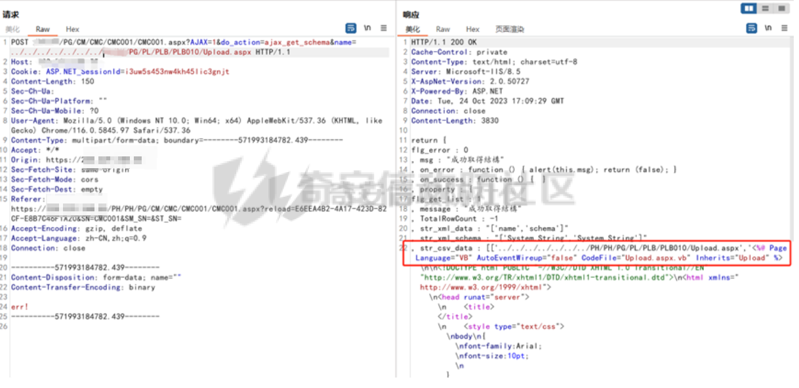

# 奇安信攻防社区-【Web实战】记一次对某停车场系统的测试

### 【Web实战】记一次对某停车场系统的测试

对某停车场系统的测试

# 请出主角

又是登录框开局，先扫一下目录看看有没有未授权  
没扫出东西，其实这种301状态的路径也可以继续扫下去看看，我已经扫过了，没扫出东西，就不贴图了

  
看到没有验证码，抓包跑一下弱口令

爆破无果，尝试SQL注入万能密码也没反应，想随手尝试一下有没有别的测试账号弱口令，test/123456，system/123456之类的

# SQL注入

  
发现在准备输入密码的时候，下面提示了没有这个账号，猜测应该会有某个接口在我们准备输入密码时判断系统内是否存在该账号

把burp里的http历史清除，继续输入test，在要准备输入密码的时候，查看数据包记录

发现记录到一条数据包，根据接口名可以大致确定是在检查用户名

查看数据包

返回了没有这个账号，如果是一个存在的账号

会返回这个包

既然会判断用户是否存在，那肯定是带入到数据库进行了查询，放到重放器，往用户名后面打个单引号

果然不出所料，这地方是有注入的，复制数据包保存到本地，sqlmap一把梭

成功跑出注入，可惜注入类型不是堆叠，不能--os-shell，直接跑密码

这个时候是看到跑出admin了，这个时候已经在幻想进后台文件上传拿shell下播了

于是马上把程序给终止了，拿admin账号密码去登录系统

提示密码错误

郁闷了好一会，拿其他账号密码去尝试登录，也都登不上，把其他几个库和表也都跑了一遍，都登不上，都准备下播了，但是作为严辉村第二台超级计算机，我觉得会不会是前面跑数据的时候出错了，于是我把最开始的那个表又跑了一遍，这次我没有终止程序，看能不能跑出其他的管理员账号

跑完了发现竟然有3个admin，第一个已经登录过了，登不上，直接拿第二个来登

这次成功跳转进了后台，进了后台首先把功能全点一遍，找找上传

功能很多，鼠标都点烂了，才找到一处上传功能，而且只能上传xls格式的文件

就算我本地建个xlsx，改成xls上传都不行，直接下载他给的范例进行上传

正常上传提示已执行过，改一下后缀和内容

感觉应该是白名单，试过网上很多种绕过方式都不行

先把这个放一放，看一下刚刚点功能点的过程中burp里面记录的数据包

# 任意文件读取

查看http历史记录，发现有很多这种数据接口，感觉像是在读取文件，参数里有一个xml的文件名，查看返回包，也有这个文件名，并且确实有xml格式的数据，尝试目录穿越读取文件

先尝试读一下根目录的default.aspx

../../逐个增加

经过测试，发现如果是7个以下../，会提示找不到路径

如果../是7个以上的话，会提示无法使用前置的..来离开至顶端目录的上一层目录

当../为7个时，根据提示可以发现已经开始报错代码错误的位置了

但是还是没有看到文件内容，试过很多方法，最后发现把最后一个参数&name\_space=EditDetail给删掉，就能成功读取到文件内容

成功读取到aspx代码，至于为什么是这样，问就是我也不知道

既然有任意文件读取了，尝试读取一下刚刚文件上传的代码

找到刚刚上传的数据包，发现上传是由Upload.aspx来处理的

读他！！！

也是7个../

  
成功读到文件，但是没有关键代码，就读到一个声明，其他都是html

根据声明CodeFile="Upload.aspx.vb"可知：指定代码文件的位置。这意味着与当前页面关联的代码将位于名为"Upload.aspx.vb"的文件中，在Upload.aspx引用这个文件的时候，没有加../，说明Upload.aspx.vb文件也处于当前目录

继续读~

成功读到关键代码，格式虽然有点乱，但咱是严辉村超级计算机2.0

根据代码得知，上传的文件会保存到PL/PLB/PLB010/UploadFile/目录下，文件名设置为Upload+时间戳+.xls

这还玩个球球，直接把后缀写死

继续上传，由于系统是windows，尝试用特殊符号截断

经过测试，还是传不上

于是我又把头扭向了SQL注入，因为后台功能点很多，大部分为查询，尝试在后台找一个能堆叠注入的点--os-shell

找到一个可以执行sql命令的地方，继续抓包丢sqlmap，还是不行，都是只能跑出报错注入

读一下配置文件web.config

读到了数据库账号密码，权限为sa，可惜数据库地址在内网。。。。

这时突然想到，既然--os-shell不行，数据库用户为sa，直接--sql-shell

sqlmap --is-dba

权限为DBA

\--sql-shell

尝试利用xp\_cmdshell执行命令

发现当注入类型不是堆叠时，不支持查询以外的操作。害，还是基础知识不够扎实

正在想怎么办时，因为看数据包基本上都是xml格式传参，又试了试XXE注入

确实有回显，但是XXE没深入了解过，这玩意好像拿不了shell，也先不看了

看了看IP

也没开别的服务

继续看后台，一个一个功能点再细细看一遍

发现这里查询出来的内容包含图片

点开发现确实是有图片

但是我无法对图片进行修改，此时想到之前跑出的账号密码，想试试能不能以用户的身份登录系统，然后上传资料图片试试上传webshell

登录一个新的账号

发现这可能也是一个管理用户的账号，内部功能与admin不同，再把这些新的功能翻一遍

还是无果，通过对数据库的信息进行查看，发现用户表里是没有普通用户的账号的，这些用户的信息存在另外一个数据库里，而且刚刚上面看到的图片也都是存在数据库中的。。。

应该都是通过管理员账号导入的

对http历史记录里的所有aspx文件都读了一遍，发现还是没有能R的点

下播下播
