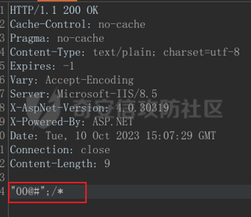

# 奇安信攻防社区-【Web实战】记一次攻防实战绕过登录机制进入后台获取大量敏感数据

### 【Web实战】记一次攻防实战绕过登录机制进入后台获取大量敏感数据

某省攻防实战。通过多层绕过。成功不要密码拿下一个后台。包括各个学校账号密码，等相关敏感信息。为后续打下坚实基础

# 经典开局一个登录框

由于漏洞应该还未修复。对于数据和相关网址打个码见谅一下

## 常规思路（爆破）

  
常规操作进行一波  
尝试弱口令然后开始爆破  
对于此种有验证码的爆破，可以借用一个bp插件。  
captcha-killer-modified-jdk14.jar  
  
具体使用我就不说了。有很多大佬的文章都有细讲。  
爆破常规并不可行。

## 思路不通就抓包

登录之后抓取返回包  
  
发现有相关的编码返回。感觉是前端进行一些跳转的相关问题

### 搜索js

  
经典改包。00@#

### 绕过第一步检验 但是直接被强制退回

  
本来想直接放弃了。准备试试其他的靶标。  
但是越想越气，md继续打

### 再次js，感觉既然登录可以跳转。再次试试呢

抓包到这个强制返回页面。定住之后。因为很多网站是对于一个特定的页面加载特定的js。在那个页面查找相关js

  
分析可知，几个id的参数进行验证

### 感觉是后端验证

感觉还是g了。完全不知道怎么办了。点了半天也不知道这个玩意是咋验证的。感觉像是后端验证，构造数据包也并没有成功。哎。准备放弃了。但是看见我队伍的排名已经不能在看了。md再来

### 遇事不决，继续抓包

发现返回包是html。感觉好像不是特定一些鉴权方式。然后翻啊翻啊突然在返回包之中看见。

  
这不是上面那个js文件里的相关id吗。  
然后想了一下我的html垃圾基础。加一个value值是不是就可以。那么全加成1试试看

### 但是结合上面的js审计。必须保证roleid的值为1

# 成功进入后台。但是没有任何数据哎 任重而道远

## 带着bp开启点点点。点到一个功能点

### 然后经典被重定向到登录框 哎（真g了吗）

截图当时没截图哎，当时确实没用任何的办法。

## 只能继续抓包康康了

一看，又根据我的前端垃圾基础  
看到一个隐藏的返回包

  
哎嘿，又是html返回。是一个js重定向在返回包里。  
哈哈哈哈  
直接删除。成功绕过。

# 成功获取接口

  
然后就是大家都会的。改参数。把schoolid改了。  
成功跳转下一个接口

  
然后正常访问。没有任何数据。  
经典遍历参数进行看数据  
然后抓取返回包进行修改。成功吧数据返回到前端进行渲染

## 成功获取数据。哦吼

## 哦吼。成功知晓整个验证逻辑。那么就开始吧所有功能点进行绕过即可

## 然后就是抓接口遍历参数进行扩大数据量

  
里面是电话号码和密码  
数据量非常大。（基本上各个地区里面学生的信息泄露）基本上每个id后面都有相关的参数

# 成功通过此类。进入到老师等后台。后续就交给大佬进行getshell了

# 小结

对于现在很多网站。多抓包，多分析js和看接口的习惯一定要养成。  
通过分析，去理解整个的业务流程。并且造成组合拳才可以造成危害更加高的漏洞
