# 奇安信攻防社区-【Web实战】零基础微信小程序逆向

### 【Web实战】零基础微信小程序逆向

本文以微信小程序为例，从实战入手，讲解有关于小程序这种新型攻击面的渗透，对于了解小程序的安全性和防范措施有一定的帮助。

# 什么是小程序？

作为中国特有的一种程序形态，小程序在我们的日常生活中已经无处不在。腾讯、百度、阿里巴巴、字节跳动、京东等各家互联网大厂都有各自的生态平台，当然，也有快应用这种行业联盟型的生态平台。  
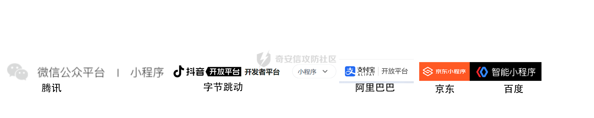

## 相较于传统的APP开发，小程序的区别有（以微信举例）

|     | 微信小程序 | App |
| --- | --- | --- |
| 下载安装 | 通过微信(扫描二维码、搜索、分享)即可获得 | 从应用商店(App Store、应用汇等)下载安装 |
| 内存占用 | 无需安装，和微信共用内存使用，占用内存空间忽略不计 | 安装于手机内存，一直占用内存空间，太多的 App 可能会导致内存不足 |
| 手机适配 | 一次开发，多终端适配 | 需适配各种主流手机，开发成本大 |
| 产品发布 | 提交到微信公众平台审核，云推送 | 向十几个应用商店提交审核，且各应用商店所需资料不一样，非常繁琐 |
| 功能区别 | 限于微信平台提供的功能 | 对硬件资源的利用更加淋漓尽致，可以做出功能、设计、效果和流畅程度远远超过小程序的软件和服务 |
| 传输要求 | 必须使用 HTTPS，且绑定域名需要备案，不能直接使用 IP 作为地址 | 依照开发商自主要求，HTTPS 传输可选可不选 |
| 开发背景 | 适合初创团队，试错成本低，需要较少时间和资金投入 | 适合成熟的商业大公司，对自我品牌要求较高的企业 |

- - -

# **微信小程序架构分析**

整个小程序框架系统分为两部分：**[逻辑层](https://developers.weixin.qq.com/miniprogram/dev/framework/app-service/)**（App Service）和 **[视图层](https://developers.weixin.qq.com/miniprogram/dev/framework/view/)**（View）。小程序提供了自己的视图层描述语言 `WXML` 和 `WXSS`，以及基于 `JavaScript` 的逻辑层框架，并在视图层与逻辑层间提供了数据传输和事件系统，让开发者能够专注于数据与逻辑。

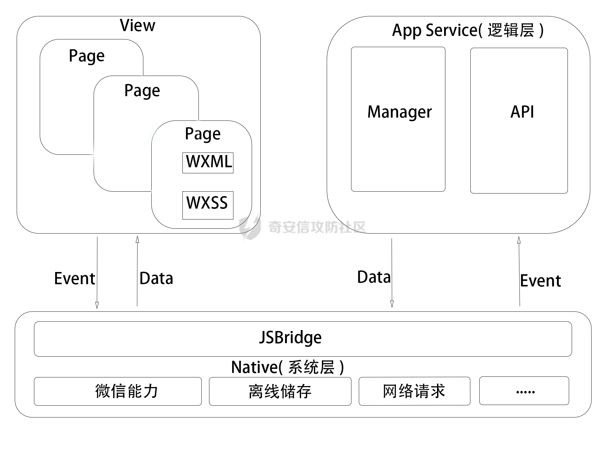

## 逻辑层 App Service

小程序开发框架的逻辑层使用 `JavaScript` 引擎为小程序提供开发 `JavaScript` 代码的运行环境以及微信小程序的特有功能。

逻辑层将数据进行处理后发送给视图层，同时接受视图层的事件反馈。

开发者写的所有代码最终将会打包成一份 `JavaScript` 文件，并在小程序启动的时候运行，直到小程序销毁。这一行为类似 [ServiceWorker](https://developer.mozilla.org/en-US/docs/Web/API/Service_Worker_API)，所以逻辑层也称之为 App Service。

在 `JavaScript` 的基础上，微信增加了一些功能，以方便小程序的开发：

-   增加 `App` 和 `Page` 方法，进行[程序注册](https://developers.weixin.qq.com/miniprogram/dev/framework/app-service/app.html)和[页面注册](https://developers.weixin.qq.com/miniprogram/dev/framework/app-service/page.html)。
-   增加 `getApp` 和 `getCurrentPages` 方法，分别用来获取 `App` 实例和当前页面栈。
-   提供丰富的 [API](https://developers.weixin.qq.com/miniprogram/dev/framework/app-service/api.html)，如微信用户数据，扫一扫，支付等微信特有能力。
-   提供[模块化](https://developers.weixin.qq.com/miniprogram/dev/framework/app-service/module.html#%E6%A8%A1%E5%9D%97%E5%8C%96)能力，每个页面有独立的[作用域](https://developers.weixin.qq.com/miniprogram/dev/framework/app-service/module.html#%E6%96%87%E4%BB%B6%E4%BD%9C%E7%94%A8%E5%9F%9F)。

**注意：小程序框架的逻辑层并非运行在浏览器中，因此 `JavaScript` 在 web 中一些能力都无法使用，如 `window`，`document` 等。**

## 视图层 View

框架的视图层由 WXML 与 WXSS 编写，由组件来进行展示。

将逻辑层的数据反映成视图，同时将视图层的事件发送给逻辑层。

WXML(WeiXin Markup language) 用于描述页面的结构。

WXS(WeiXin Script) 是小程序的一套脚本语言，结合 `WXML`，可以构建出页面的结构。

WXSS(WeiXin Style Sheet) 用于描述页面的样式。

组件(Component)是视图的基本组成单元。

## 目录结构

小程序包含一个描述整体程序的 `app` 和多个描述各自页面的 `page`。

一个小程序主体部分由三个文件组成，必须放在项目的根目录，如下：

| 文件  | 必需  | 作用  |
| --- | --- | --- |
| [app.js](https://developers.weixin.qq.com/miniprogram/dev/framework/app-service/app.html) | 是   | 小程序逻辑 |
| [app.json](https://developers.weixin.qq.com/miniprogram/dev/framework/config.html) | 是   | 小程序公共配置 |
| [app.wxss](https://developers.weixin.qq.com/miniprogram/dev/framework/view/wxss.html) | 否   | 小程序公共样式表 |

一个小程序页面由四个文件组成，分别是：

| 文件类型 | 必需  | 作用  |
| --- | --- | --- |
| [js](https://developers.weixin.qq.com/miniprogram/dev/framework/app-service/page.html) | 是   | 页面逻辑 |
| [wxml](https://developers.weixin.qq.com/miniprogram/dev/framework/view/wxml/) | 是   | 页面结构 |
| [json](https://developers.weixin.qq.com/miniprogram/dev/framework/config.html#%E9%A1%B5%E9%9D%A2%E9%85%8D%E7%BD%AE) | 否   | 页面配置 |
| [wxss](https://developers.weixin.qq.com/miniprogram/dev/framework/view/wxss.html) | 否   | 页面样式表 |

**注意：为了方便开发者减少配置项，描述页面的四个文件必须具有相同的路径与文件名。**

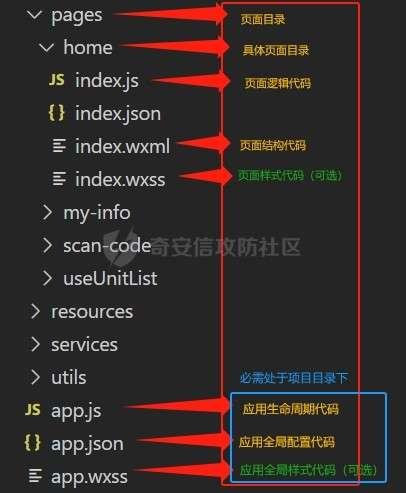

从上述的架构图、文件组成部分来看，重点分析的就是小程序的逻辑层。而逻辑层主要的组成部分是由 app.js、app.json、js 文件、json 配置文件等组成，因此测试过程中主要分析的对象就是这一些。

- - -

# 微信小程序源码提取与常见漏洞

## 测试准备

### 系统

windows

### 常用工具

| 名称  | 用途  | 下载地址 |
| --- | --- | --- |
| wxappUnpacker | 小程序源代码获取工具 |     |
| wxapkgconvertor | 小程序源代码获取工具 | [https://github.com/ezshine/wxapkg-convertor/releases](https://github.com/ezshine/wxapkg-convertor/releases) |
| UnpackMiniApp | 小程序解密 |     |
| 微信开发者工具 | 调试获取的小程序代码 | [https://developers.weixin.qq.com/miniprogram/dev/devtools/download.html](https://developers.weixin.qq.com/miniprogram/dev/devtools/download.html) |
| BurpSuite | 抓包分析测试 | [https://portswigger.net/burp](https://portswigger.net/burp) |
| proxifier | 流量代理 | [https://www.proxifier.com/](https://www.proxifier.com/) |

## 测试开始

### 小程序搜索

笔者常用的搜索方式为使用微信官方小程序界面的搜索功能与北京零零信安科技有限公司的 [0.zone](https://0.zone/)平台，后者可以全自动采集目标企业APP（APK）列表、下载地址和其详情介绍等信息，半自动进行小程序、公众号、生活号等的列表、名称和地址采集。较官方搜索功能，可以更精确的检索目标。

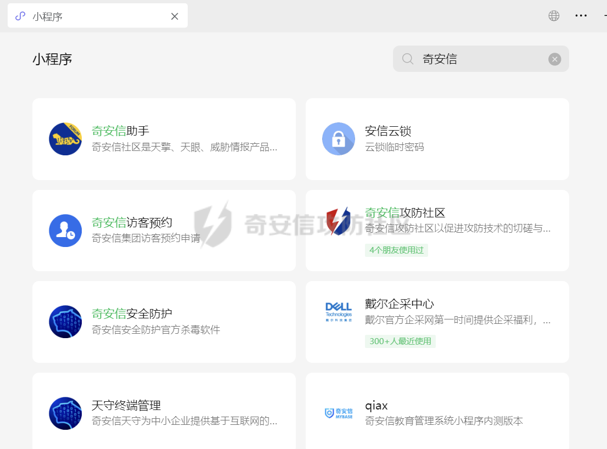

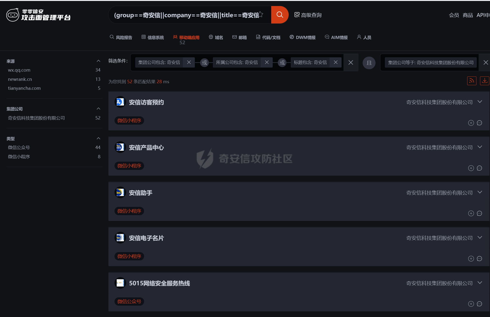

### 源码提取

#### 位置查找

使用windows版微信，打开待测试的小程序后，点击设置-文件管理-打开文件夹。

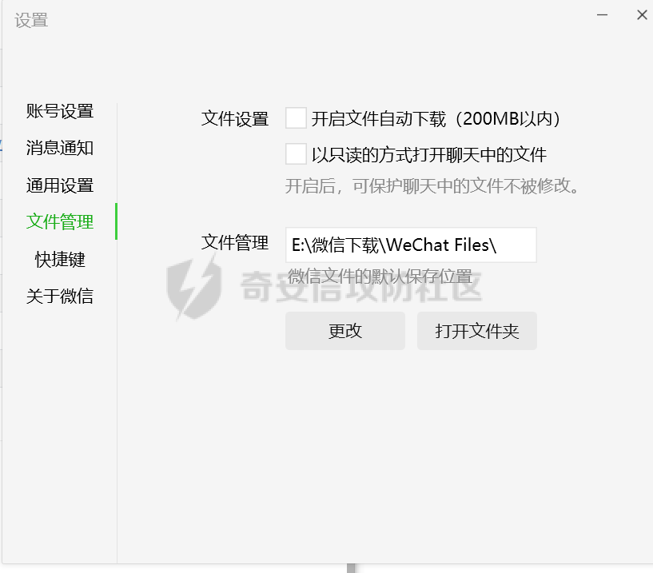

在WeChat Files目录下有一个名为Applet的文件夹，以“wx”开头的文件夹即为小程序文件夹。如果之前打开了很多微信小程序，那么目录中就会存在多个小程序文件夹。第一种区分方法是按照修改时间来进行区分。第二种方法是在微信页面中删除所有浏览过的小程序，重新打开需要进行测试的小程序，那么目录中只会存在一个小程序文件夹。

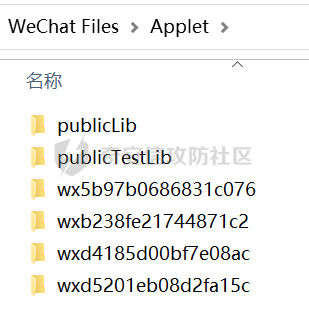

其中的文件名为`__APP__.wxapkg` ，为加密后的文件。

#### 小程序解密

加密方法如下:

-   首先pbkdf2生成AES的key。利用微信小程序id字符串为pass，salt为saltiest 选代次数为1000。调用pbkdf2生成一个32位的key。
-   取原始的wxapkg的包的前1023个字节通过AES通过1生成的key和iv(the iv: 16 bytes),进行加密。
-   接着利用微信小程id字符串的倒数第2个字符为xor key，依次异或1023字节后的所有数据。如果微信小程序id小于2位，则xorkey 为 0x66。
-   把AES加密后的数据 (1024字节)和xor后的数据一起写入文件，并在文件头部添加V1MMWX标识。

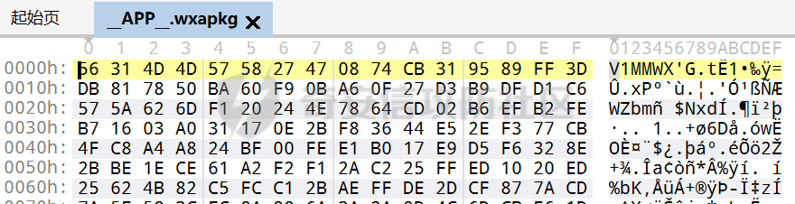

这里使用的解密工具为代码果所编写UnpackMiniApp.exe，用法为点击“选择加密小程序包”，选中待解密的`__APP__.wxapkg`，将会在UnpackMiniApp.exe当前目录的wxpack文件夹中生成解密后的文件。


**注意：一定要选择微信小程序原始位置，移动待测试的`__APP__.wxapkg`文件将会导致无法识别APPID，导致解密失败！**

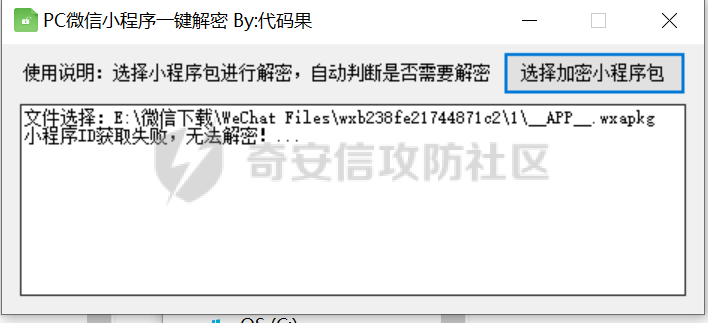

#### wxapkg包文件结构

在解密之后，使用010Editor打开该文件，可以看出，wxapkg包由三个部分组成，分别是头部段、索引段、数据段。

##### 头部段

以“BE”开头，"ED"结尾，其中包含4个“00”空白填充，进行校验的索引段长度块、数据段长度块各四位，固定长度为14字节。


##### 索引段

首先为4字节，为包内文件的数量，如“00 00 00 5F”代表一共有95个文件，然后是包内文件各自的信息，例：“00 00 00 16”代表文件名称的长度为22个字节，“2F 72 65 6F...... 2E 70 6E 67”为带存放路径的文件名称，“00 00 11 7C”对应文件在小程序包中的具体偏移位置，“00 01 01 F7“对应文件在小程序包中的数据长度。

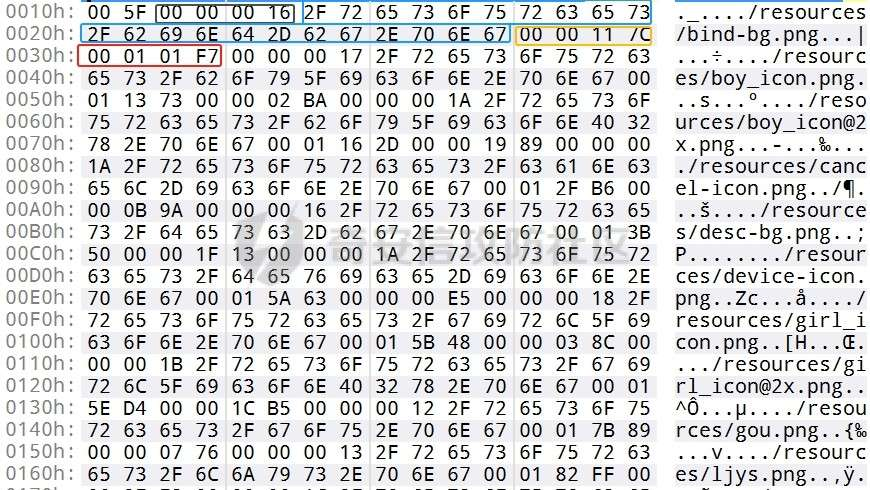

##### 数据段

数据段为存储的文件内容，可通过索引段的信息进行一一对应。

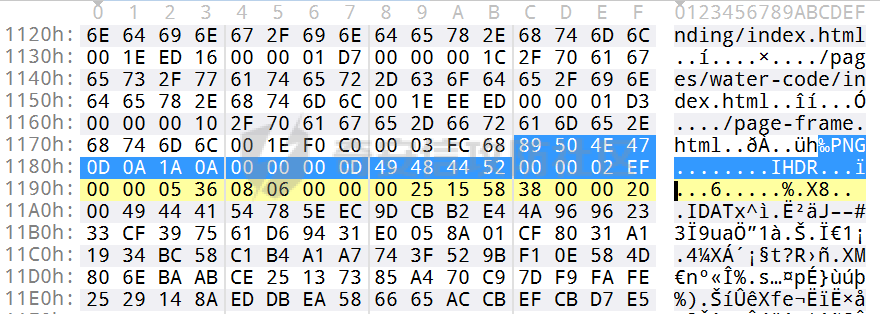

#### 小程序反编译

通过索引段与数据段，我们已经可以还原出一个大体的文件结构

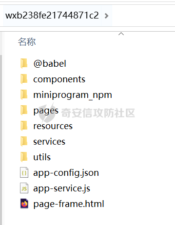

但这并不是最初的原项目文件结构，原因是微信服务器会将小程序源码中所有的“js”文件压入“app-service.js”文件中，将所有的“json”文件压入“app-config.json”中，将所有的“wxml”文件压入“page-frame.html”文件中，“wxss”则在处理之后以“html”文件的形式存留在对应页面目录之下。

笔者对各自文件的还原不再赘述，在此推荐使用wxappUnpacker与wxapkgconvertor，二者均可以直接对解密后的wxapkg包进行反编译，直接还原出原项目的文件结构。

wxappUnpacker的使用命令为：

```php
node wuWxapkg.js xxxxxx.wxapkg
```

wxapkgconvertor的使用更为便携，将待反编译的wxapkg包直接拖入程序窗口中，即可在小程序包位置的同目录下获得同名的小程序项目文件夹。

##### 常见问题

###### 存在分包（即文件夹下有多个.wxapkg文件）

分别解密，反编译后，拼合到同一目录下。

###### 使用wxappUnpacker后，”app-service.js” / “app-config.json” / “page-frame.html” / “.html”文件未成功反编译：

-   将 app-config.json 中的内容拆分成各个页面所对应的 page.json 和 app.json；

```php
node wuConfig.js <path/to/app-config.json>
```

-   将 app-service.js 拆分成一系列原先独立的 JS 文件，并使用 Uglify-ES 美化工具尽可能将代码还原为“编译”前的内容；

```php
node wuJs.js <path/to/app-service.js>
```

-   从 page-frame.html 中提取并还原各页面的 .wxml 和 app.wxss 及公共 .wxss 样式文件；

```php
node wuWxml.js \[-m\] <path/to/page-frame.html>
```

-   该命令参数为 .wxapkg 解包后目录，它将分析并从各个 page.html 中提取还原各页面的 page.wxss 样式文件。

```php
node wuWxss.js <path/to/unpack\_dir>
```

### 安全风险和漏洞

在获取到源码后，我们可以将其加载到微信开发者工具中进行调试。

下面列出实战时常见的微信小程序漏洞

#### 信息泄露

敏感信息是指一旦泄露可能会对开发者的业务、合作伙伴和用户带来利益损害的数据，包括但不限于**账号 AppSecret、特权账号信息、后台加密密钥、登录账户密码、用户身份证号、手机号、银行卡号等**。

可利用微信开发者工具中的搜索功能来搜索例如“appid”、“key”、“phone”等关键字。

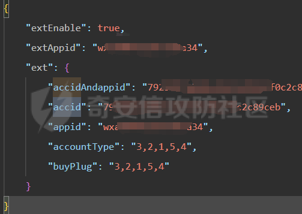

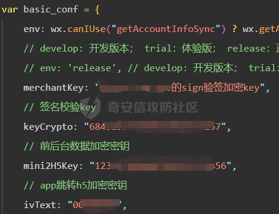

这里说一下针对AppID与AppSecret的利用，在获取到该信息后，可访问微信开放平台调试工具（[https://developers.weixin.qq.com/apiExplorer](https://developers.weixin.qq.com/apiExplorer)），可根据小程序的代码内容配合接口文档进行进一步的利用。

**提示：微信小程序开发者工具在1.06.2206020版本以后在代码质量分析模块中增加针对AppSecret 的检测，故AppSecret泄露只可能在2022-06-02以前开发的小程序中发现。**

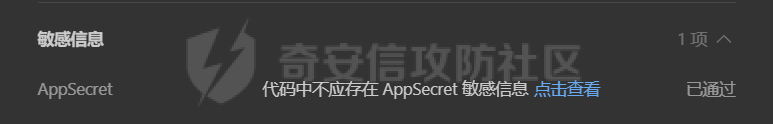

#### SQL 注入

SQL 注入是指 Web 程序代码中对于用户提交的参数未做有效过滤就直接拼接到 SQL 语句中执行，导致参数中的特殊字符打破了 SQL 语句原有逻辑，黑客可以利用该漏洞执行任意 SQL 语句。

通过proxifier的流量代理与BurpSuite的抓包，我们可以针对小程序运行时的功能点进行测试。

**proxifier配置：**

设置ip为127.0.0.1，端口自定义的HTTPS协议代理服务器

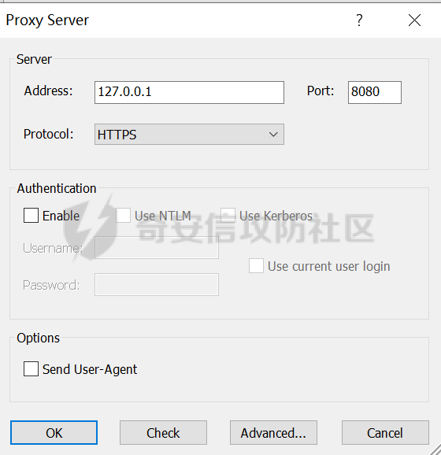

添加规则：程序“wechatappex.exe”，动作为刚才设置的代理服务器

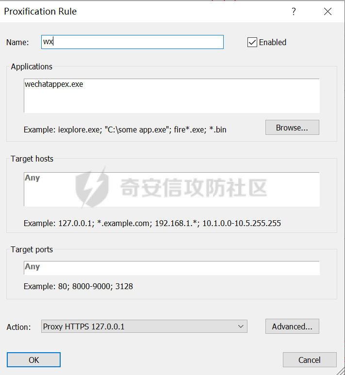

**BurpSuite配置：**

配置代理服务器，端口为刚才设置的自定义端口，地址为127.0.0.1

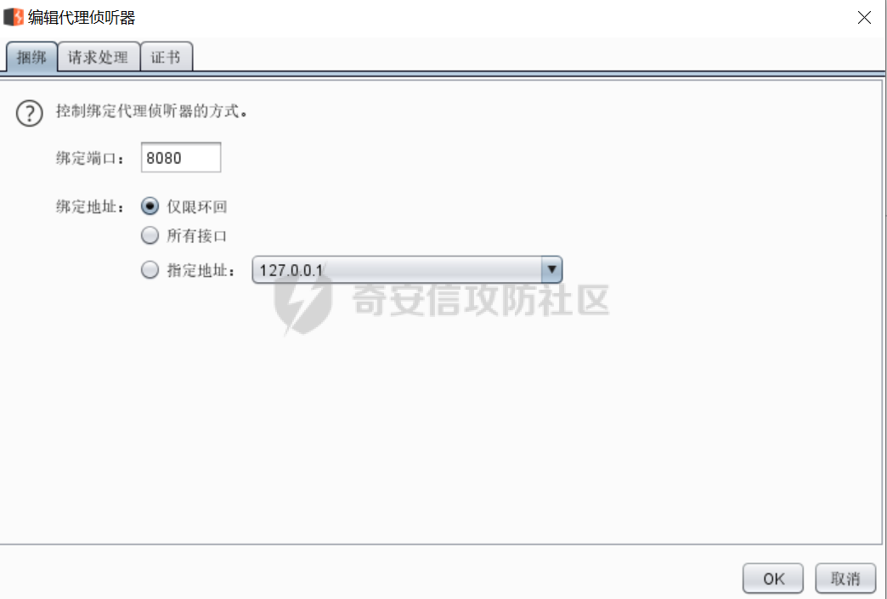

通过对小程序功能点进行SQL注入测试，成功返回数据库用户名。

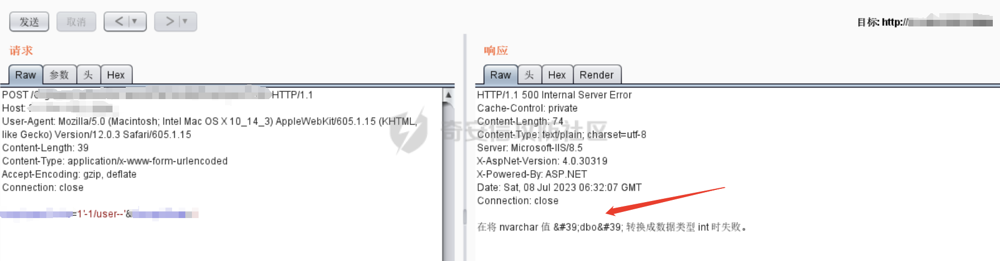

#### 弱口令

弱口令指管理后台的用户名密码设置得较为简单或者使用默认账号。攻击者可以通过登录这些账号修改后台数据或进行下一步的入侵操作。

针对小程序的代码进行审计，发现一处回连域名，访问发现为管理后台。

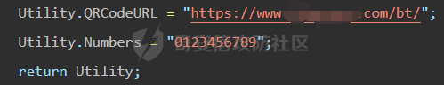

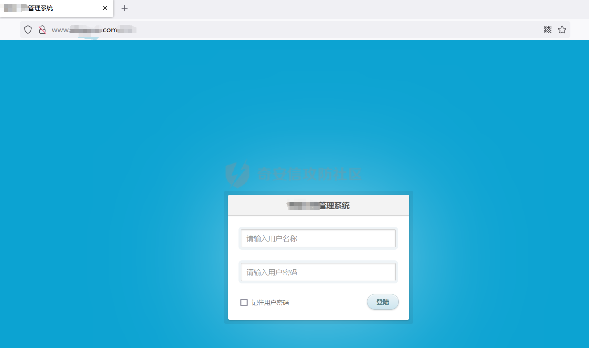

使用用户名:admin 密码：123456 成功登陆后台，获取大量信息。

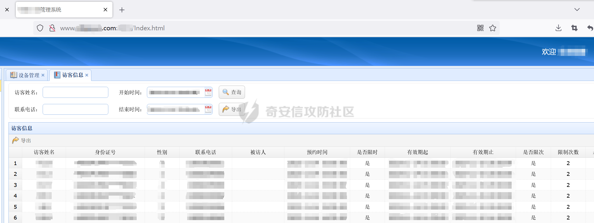

#### 常见问题

##### 将反编译后的源码导入微信开发者工具后，报错 “app.js错误:TypeError: \_typeof3 is not a function”

按错误提示找到文件 @babel/runtime/helpers/typeof.js

将所有内容删除，并替换成

```php
function _typeof2(o) {  
  "@babel/helpers - typeof";  
  return (_typeof2 = "function" == typeof Symbol && "symbol" == typeof Symbol.iterator ? function(o) {  
      return typeof o;  
  } : function(o) {  
      return o && "function" == typeof Symbol && o.constructor === Symbol && o !== Symbol.prototype ? "symbol" : typeof o;  
  })(o);  
}  
function _typeof(o) {  
  return "function" == typeof Symbol && "symbol" === _typeof2(Symbol.iterator) ? module.exports = _typeof = function(o) {  
      return _typeof2(o);  
  } : module.exports = _typeof = function(o) {  
      return o && "function" == typeof Symbol && o.constructor === Symbol && o !== Symbol.prototype ? "symbol" : _typeof2(o);  
  }, _typeof(o);  
}  
module.exports = _typeof;
```

##### 报错“依赖异常”

为程序在反编译过程中对变量还原不准确，通过对比已还原的目录结果删除调用代码中多余路径即可修复。

## 测试总结

小程序开发者在开发环节中必须基于以下原则：

互不信任原则，不要信任用户提交的数据，包括第三方系统提供的数据，必要的数据校验必须放在后台校验。

最小权限原则，代码、模块等只拥有可以完成任务的最小权限，不赋予不必要的权限。

禁止明文保存用户敏感数据。

小程序代码（不包括云函数代码）跟传统 Web 应用的前端代码类似，可被外部获取及进行反混淆，重要业务逻辑应放在后台代码或云函数中进行。

后台接口调用以及云函数调用，必须进行有效的身份鉴权。
