# 奇安信攻防社区-edusrc漏洞笔记（逻辑篇）

### edusrc漏洞笔记（逻辑篇）

刚接触挖洞的时候记录的一些漏洞，全文比较基础，各位大佬轻喷

刚接触挖洞的时候记录的一些漏洞，全文比较基础，各位大佬轻喷

话不多说直接进入正题，首先是fofa搜到了某学校后勤管理界面

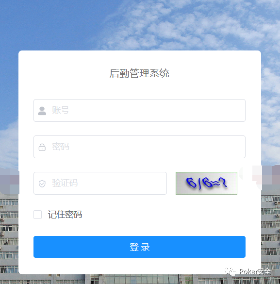

弱口令直接进入后台，可以直接看到学生信息，包括详细敏感信息全部囊括其中，因为涉及敏感加上弱口令已被修复，不方便给大家上图，请见谅

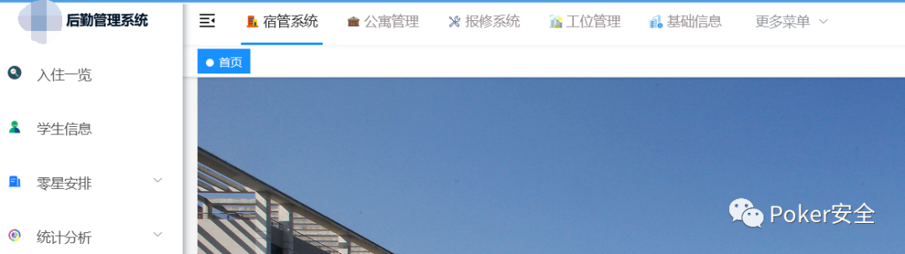

因为在此之前学生系统的漏洞均已被我提交，所以突发奇想，看看能不能用初始密码进入教职工系统。

在这个模块下记录了教职工各类敏感信息以及工号一类

然后开始去搜集资产，寻找登录入口，如下

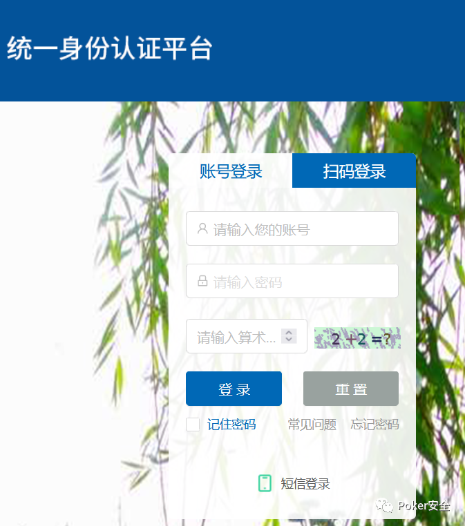

这种站一般都是用身份证后六位作为初始密码

所以我们开始尝试使用工号+身份证后六位尝试初始密码登录

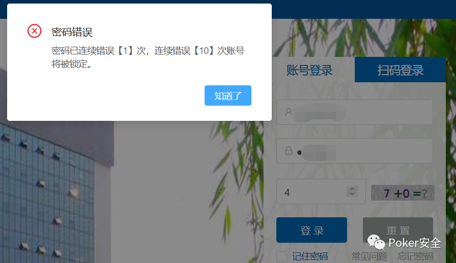

好像不太行。。。

因为此时弱口令被修复，无法再进入后勤系统寻找账号，不过好在我把登录日志记在了脑子里然后写在表格上方便看，找到一个工号登陆成功的日志，推测没有修改初始密码，

再次进入后台寻找此账号用户（此时是实战经过时漏洞暂未被修复）

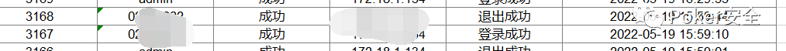

拿到账号密码 继续尝试登陆，成功进入教师系统

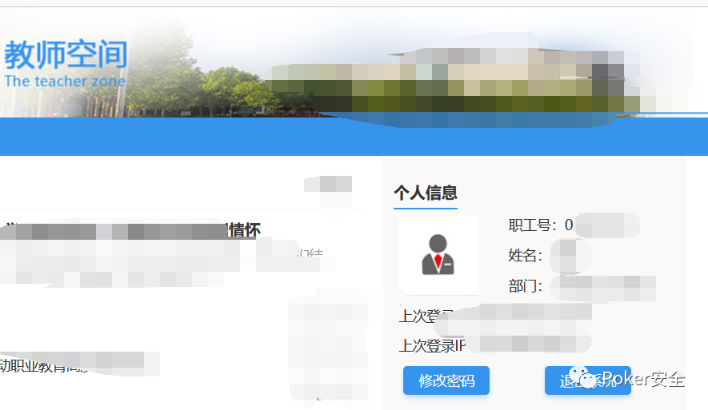

找到一处功能点，用bp开始抓包

可以看到这里有一个userkey的参数，对应刚才的职工号，

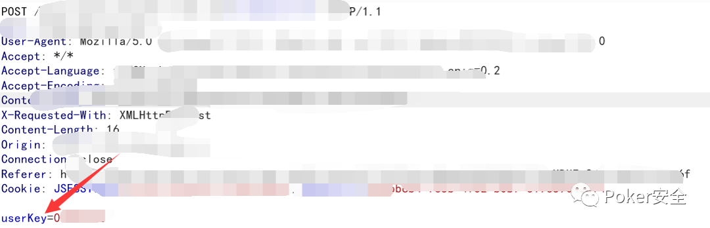

发送到repeater看看，从这里可以看到职工的敏感信息

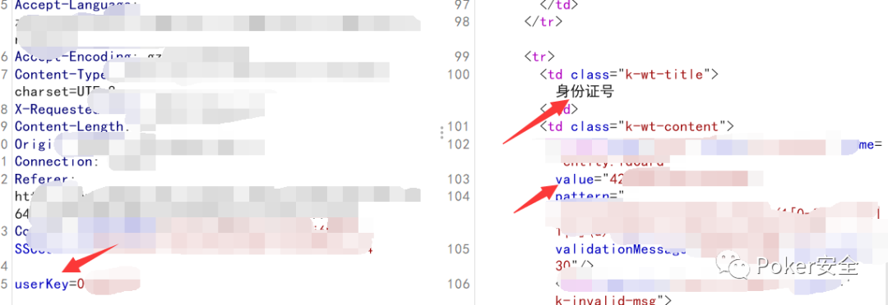

尝试修改参数看看能不能越权查看敏感信息

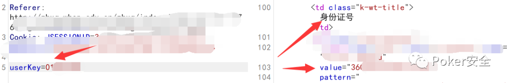

成功越权，到了这里我们可以尝试一下bp的intruder模块进行爆破，看看能不能批量爆破出敏感信息，从而扩大危害

不难发现这些工号都是有一定的规律的，可以尝试构造字典，不过我比较懒，而且构造出来很大一部分都是没有敏感信息的，所以另寻他径，开始寻找存储教职工信息的模块

抽了根烟，冷静了一下，终于找到一处功能点，发现存储了大量任职人员信息

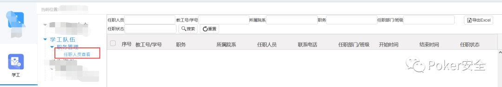

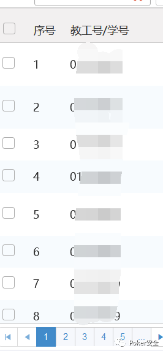

字典有了，我们导出

把刚才抓到的包发送到intruder，准备开始爆破

给userkey参数添加payload

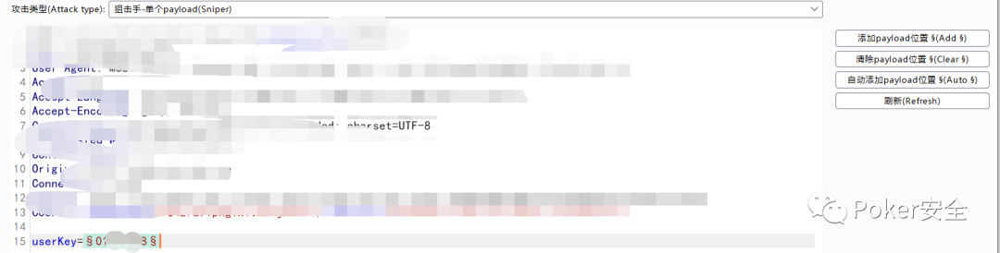

导入字典，数据量大概在五千条左右开始爆破

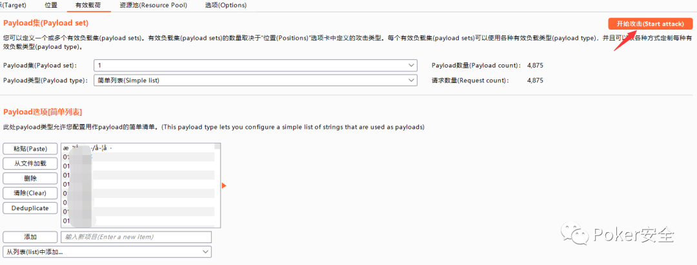

成功爆破出五千条敏感信息

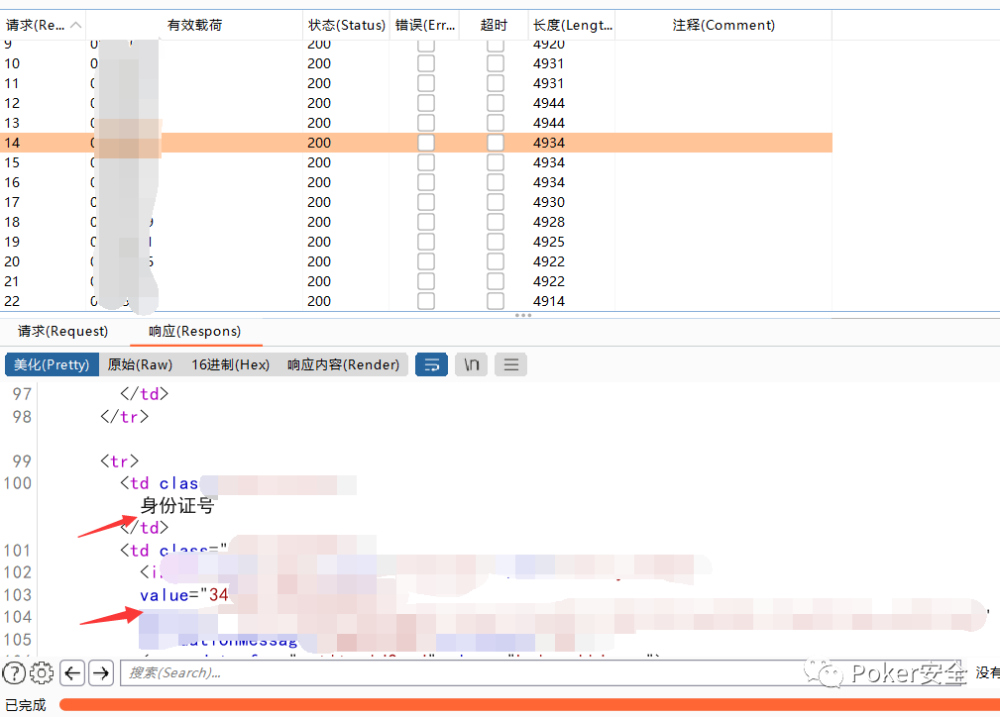

第一个功能点测试完毕

继续干下一个

发现上传点，尝试上传图片马

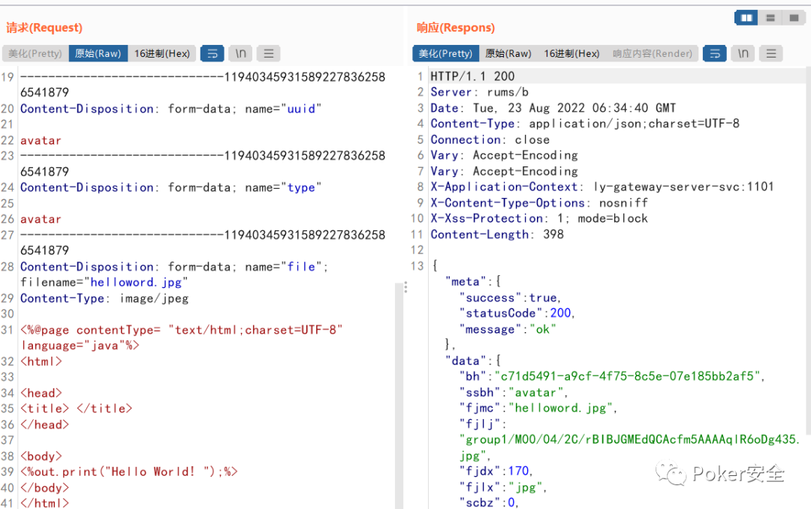

上传成功，发现对内容没有进行过滤，但是有后缀白名单限制，不对上传的脚本文件进行解析，这里修改为jsp文件也是上传成功

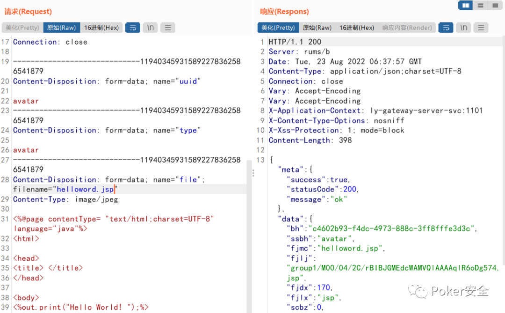

访问，不解析，只下载

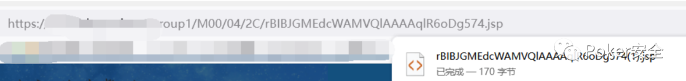

尝试了大部分常用的bypass的办法，发现这里可以解析html文件

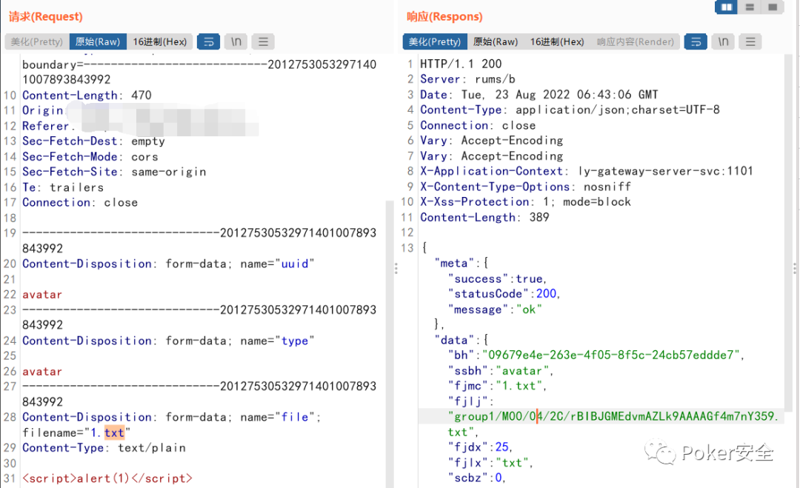

修改后缀为html拿到返回路径

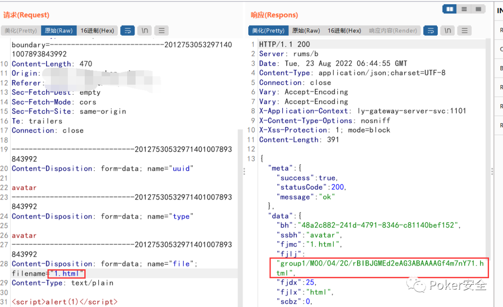

访问，成功造成xss

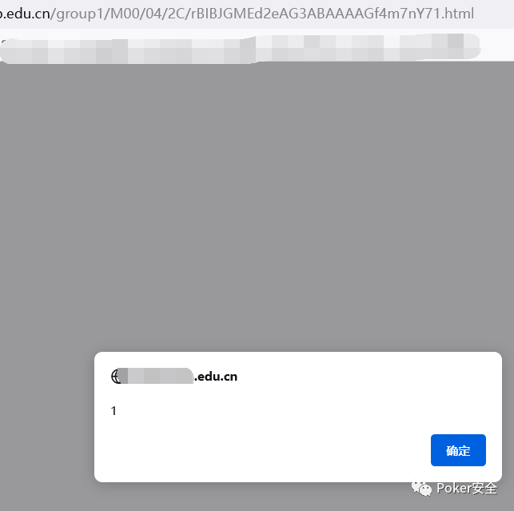

看到几个参数像是路径映射路径,不过我比较懒，混个低危了就没继续深挖了，能存储xss 钓鱼 挂黑页 等等这些

继续往下挖

依旧是一个登录入口，老规矩先抓包

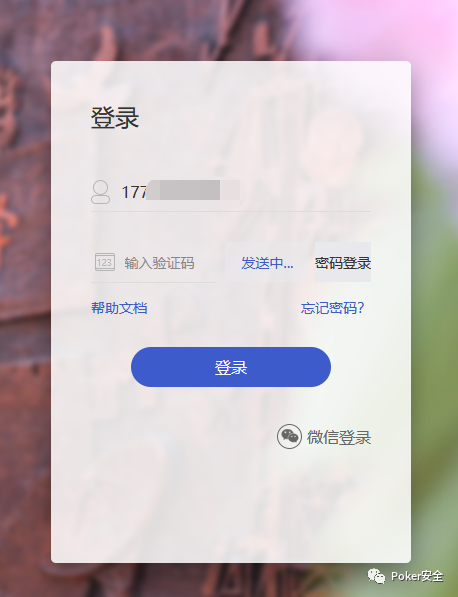

这里抓到的手机号替换成自己的试试，看看能不能越权收到验证码

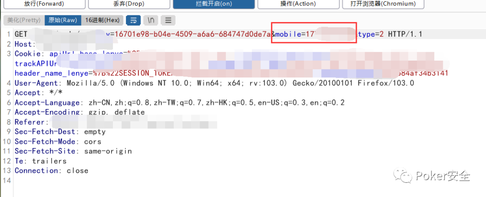

放包，但是自己的手机号并没有收到验证码，所以开两个页面试一下看看能不能获取到

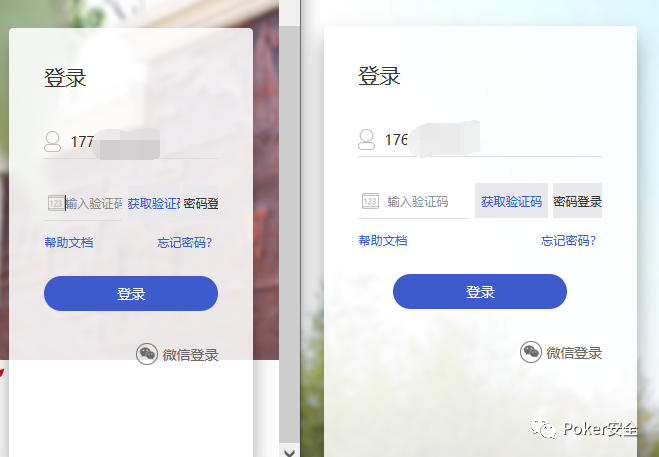

a手机号抓包，修改为b手机号接收，b手机号获取验证码

重复上述改包操作，尝试验证码复用

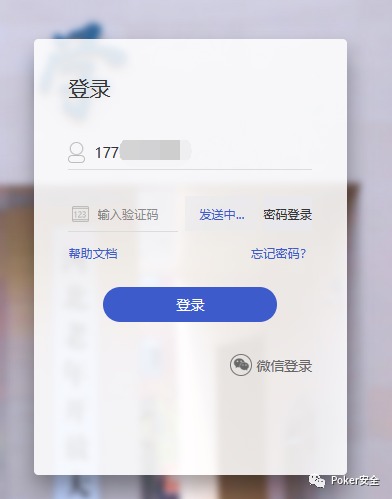

但此时抓包放包之后系统显示验证码在发送中，其实验证码已经发出去了

拦截放包

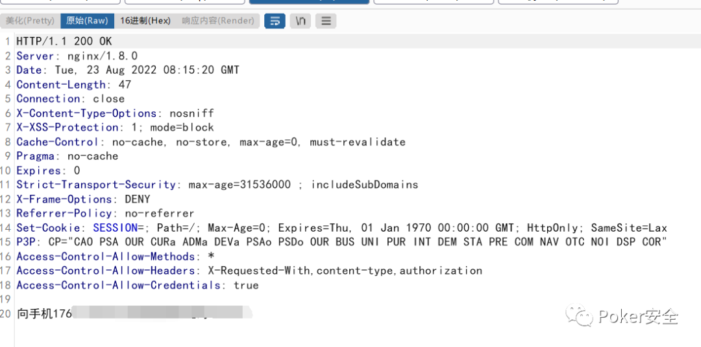

刷新一下尝试用刚才接收的验证码登陆，登陆成功

简单来说过程就是，a手机号验证码登录，抓包替换b手机号，b手机号收到的验证码（此时是第二个页面正常业务功能获取到的验证码）能用a手机号正常登录，原因是系统开发的时候可能是没有校验验证码接收者的用户身份，只校验了验证码发出的时间，导致b手机号接收的验证码越权登录a手机号的账号造成逻辑漏洞出现。

其实我挖洞一直都是佛系，挖的到就挖，挖不到就换，全文比较基础，各位大佬轻喷。
